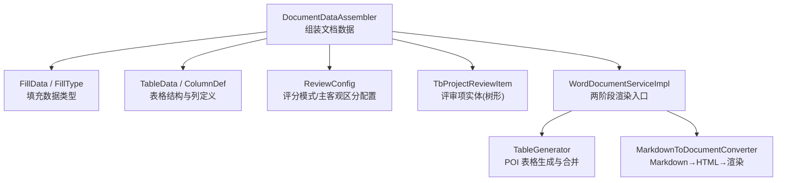
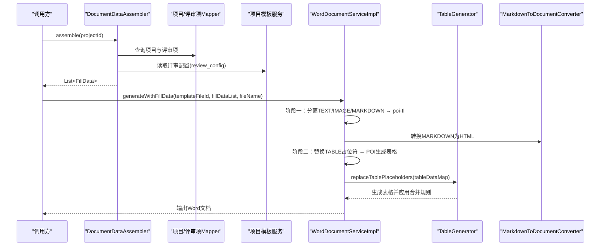
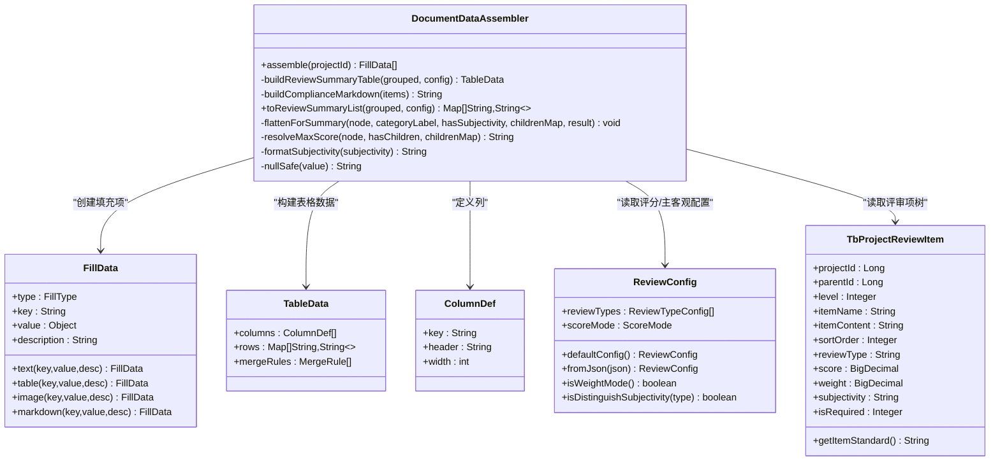
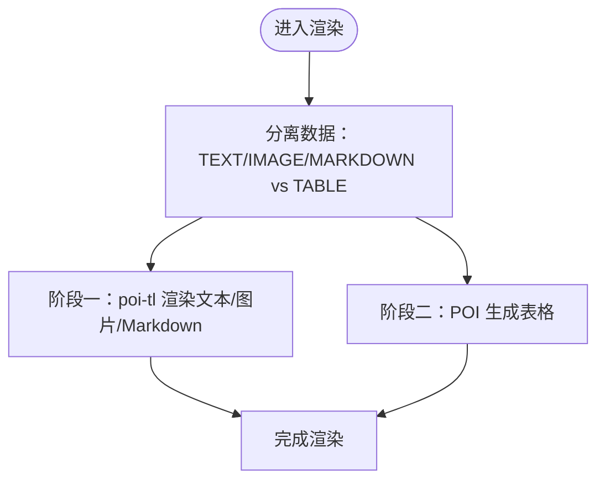
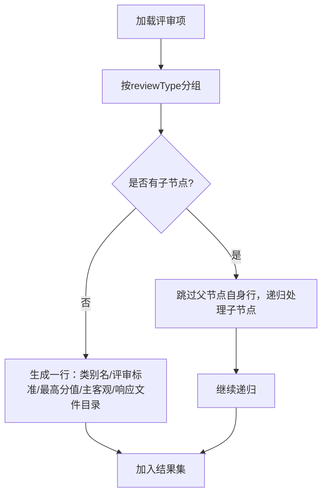
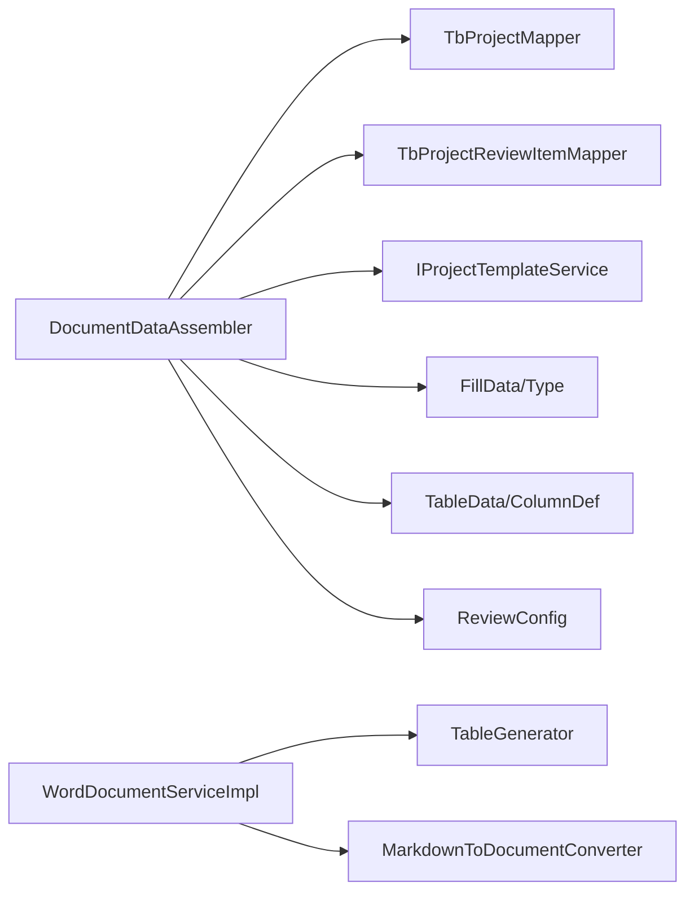

# 文档数据组装器

<cite>
**本文引用的文件**   
- [DocumentDataAssembler.java](file://ele-ai-tender-system/ele-ai-tender-core/src/main/java/com/jy/eleaitender/core/engine/DocumentDataAssembler.java)
- [FillData.java](file://ele-ai-tender-system/ele-ai-tender-common/src/main/java/com/jy/eleaitender/common/dto/FillData.java)
- [FillType.java](file://ele-ai-tender-system/ele-ai-tender-common/src/main/java/com/jy/eleaitender/common/dto/FillType.java)
- [TableData.java](file://ele-ai-tender-system/ele-ai-tender-common/src/main/java/com/jy/eleaitender/common/dto/TableData.java)
- [ColumnDef.java](file://ele-ai-tender-system/ele-ai-tender-common/src/main/java/com/jy/eleaitender/common/dto/ColumnDef.java)
- [ReviewConfig.java](file://ele-ai-tender-system/ele-ai-tender-common/src/main/java/com/jy/eleaitender/common/dto/ReviewConfig.java)
- [TbProjectReviewItem.java](file://ele-ai-tender-system/ele-ai-tender-common/src/main/java/com/jy/eleaitender/common/entity/core/TbProjectReviewItem.java)
- [WordDocumentServiceImpl.java](file://ele-ai-tender-system/ele-ai-tender-file/src/main/java/com/jy/eleaitender/file/service/impl/WordDocumentServiceImpl.java)
- [TableGenerator.java](file://ele-ai-tender-system/ele-ai-tender-file/src/main/java/com/jy/eleaitender/file/engine/TableGenerator.java)
- [MarkdownToDocumentConverter.java](file://ele-ai-tender-system/ele-ai-tender-file/src/main/java/com/jy/eleaitender/file/engine/MarkdownToDocumentConverter.java)
- [DocumentDataAssemblerTest.java](file://ele-ai-tender-system/ele-ai-tender-core/src/test/java/com/jy/eleaitender/core/engine/DocumentDataAssemblerTest.java)
</cite>

## 目录
1. [简介](#简介)
2. [项目结构](#项目结构)
3. [核心组件](#核心组件)
4. [架构总览](#架构总览)
5. [详细组件分析](#详细组件分析)
6. [依赖关系分析](#依赖关系分析)
7. [性能考量](#性能考量)
8. [故障排查指南](#故障排查指南)
9. [结论](#结论)
10. [附录](#附录)

## 简介
本技术文档聚焦“文档数据组装器”的实现与使用，围绕 DocumentDataAssembler 类展开，系统阐述其如何完成：
- 项目基础信息收集（文本、Markdown）
- 评审项数据处理（树形结构、父子节点、排序、分类汇总）
- 数据结构转换（填充数据 FillData、表格 TableData、列定义 ColumnDef、合并规则 MergeRule）
- 渲染对接（Word 文档两阶段渲染：poi-tl 文本/图片 + POI 编程生成表格；Markdown 转 HTML 再渲染）

同时，详细说明 FillData 的设计模式及其对文本、Markdown、表格类型的处理方式，并给出 assemble 方法的使用示例与不同业务场景下的适配建议。

## 项目结构
该功能涉及的核心模块与文件如下：
- 核心组装器：DocumentDataAssembler（core 模块）
- 通用 DTO：FillData、FillType、TableData、ColumnDef、ReviewConfig（common 模块）
- 实体模型：TbProjectReviewItem（common 模块）
- 文档渲染：WordDocumentServiceImpl、TableGenerator、MarkdownToDocumentConverter（file 模块）
- 单元测试：DocumentDataAssemblerTest（core 模块）

图表来源
- [DocumentDataAssembler.java:47-99](file://ele-ai-tender-system/ele-ai-tender-core/src/main/java/com/jy/eleaitender/core/engine/DocumentDataAssembler.java#L47-L99)
- [FillData.java:1-61](file://ele-ai-tender-system/ele-ai-tender-common/src/main/java/com/jy/eleaitender/common/dto/FillData.java#L1-L61)
- [TableData.java:1-23](file://ele-ai-tender-system/ele-ai-tender-common/src/main/java/com/jy/eleaitender/common/dto/TableData.java#L1-L23)
- [ReviewConfig.java:38-121](file://ele-ai-tender-system/ele-ai-tender-common/src/main/java/com/jy/eleaitender/common/dto/ReviewConfig.java#L38-L121)
- [TbProjectReviewItem.java:16-66](file://ele-ai-tender-system/ele-ai-tender-common/src/main/java/com/jy/eleaitender/common/entity/core/TbProjectReviewItem.java#L16-L66)
- [WordDocumentServiceImpl.java:76-152](file://ele-ai-tender-system/ele-ai-tender-file/src/main/java/com/jy/eleaitender/file/service/impl/WordDocumentServiceImpl.java#L76-L152)
- [TableGenerator.java:105-139](file://ele-ai-tender-system/ele-ai-tender-file/src/main/java/com/jy/eleaitender/file/engine/TableGenerator.java#L105-L139)
- [MarkdownToDocumentConverter.java:392-411](file://ele-ai-tender-system/ele-ai-tender-file/src/main/java/com/jy/eleaitender/file/engine/MarkdownToDocumentConverter.java#L392-L411)

章节来源
- [DocumentDataAssembler.java:21-99](file://ele-ai-tender-system/ele-ai-tender-core/src/main/java/com/jy/eleaitender/core/engine/DocumentDataAssembler.java#L21-L99)
- [FillData.java:1-61](file://ele-ai-tender-system/ele-ai-tender-common/src/main/java/com/jy/eleaitender/common/dto/FillData.java#L1-L61)
- [TableData.java:1-23](file://ele-ai-tender-system/ele-ai-tender-common/src/main/java/com/jy/eleaitender/common/dto/TableData.java#L1-L23)
- [ReviewConfig.java:38-121](file://ele-ai-tender-system/ele-ai-tender-common/src/main/java/com/jy/eleaitender/common/dto/ReviewConfig.java#L38-L121)
- [TbProjectReviewItem.java:16-66](file://ele-ai-tender-system/ele-ai-tender-common/src/main/java/com/jy/eleaitender/common/entity/core/TbProjectReviewItem.java#L16-L66)
- [WordDocumentServiceImpl.java:76-152](file://ele-ai-tender-system/ele-ai-tender-file/src/main/java/com/jy/eleaitender/file/service/impl/WordDocumentServiceImpl.java#L76-L152)
- [TableGenerator.java:105-139](file://ele-ai-tender-system/ele-ai-tender-file/src/main/java/com/jy/eleaitender/file/engine/TableGenerator.java#L105-L139)
- [MarkdownToDocumentConverter.java:392-411](file://ele-ai-tender-system/ele-ai-tender-file/src/main/java/com/jy/eleaitender/file/engine/MarkdownToDocumentConverter.java#L392-L411)

## 核心组件
- DocumentDataAssembler：负责按项目维度聚合基础信息与评审项，产出结构化 FillData 列表，供模板渲染使用。
- FillData/FillType：统一描述待填充的数据项类型与值，支持 TEXT、TABLE、IMAGE、MARKDOWN 四类。
- TableData/ColumnDef/MergeRule：描述表格的列定义、行数据与单元格合并策略。
- ReviewConfig：控制评分模式（分值/权重）、是否区分主观/客观等渲染行为。
- TbProjectReviewItem：评审项实体，采用 parentId/level 表示三级树形结构。
- WordDocumentServiceImpl：两阶段渲染入口，分离 poi-tl 文本/图片与 POI 表格生成。
- TableGenerator：根据 TableData 生成 Word 表格，应用合并规则。
- MarkdownToDocumentConverter：将 Markdown 转为 HTML 并参与渲染。

章节来源
- [DocumentDataAssembler.java:47-99](file://ele-ai-tender-system/ele-ai-tender-core/src/main/java/com/jy/eleaitender/core/engine/DocumentDataAssembler.java#L47-L99)
- [FillData.java:1-61](file://ele-ai-tender-system/ele-ai-tender-common/src/main/java/com/jy/eleaitender/common/dto/FillData.java#L1-L61)
- [TableData.java:1-23](file://ele-ai-tender-system/ele-ai-tender-common/src/main/java/com/jy/eleaitender/common/dto/TableData.java#L1-L23)
- [ReviewConfig.java:38-121](file://ele-ai-tender-system/ele-ai-tender-common/src/main/java/com/jy/eleaitender/common/dto/ReviewConfig.java#L38-L121)
- [TbProjectReviewItem.java:16-66](file://ele-ai-tender-system/ele-ai-tender-common/src/main/java/com/jy/eleaitender/common/entity/core/TbProjectReviewItem.java#L16-L66)
- [WordDocumentServiceImpl.java:76-152](file://ele-ai-tender-system/ele-ai-tender-file/src/main/java/com/jy/eleaitender/file/service/impl/WordDocumentServiceImpl.java#L76-L152)
- [TableGenerator.java:105-139](file://ele-ai-tender-system/ele-ai-tender-file/src/main/java/com/jy/eleaitender/file/engine/TableGenerator.java#L105-L139)
- [MarkdownToDocumentConverter.java:392-411](file://ele-ai-tender-system/ele-ai-tender-file/src/main/java/com/jy/eleaitender/file/engine/MarkdownToDocumentConverter.java#L392-L411)

## 架构总览
下图展示了从数据组装到文档渲染的关键流程：

图表来源
- [DocumentDataAssembler.java:47-99](file://ele-ai-tender-system/ele-ai-tender-core/src/main/java/com/jy/eleaitender/core/engine/DocumentDataAssembler.java#L47-L99)
- [WordDocumentServiceImpl.java:76-152](file://ele-ai-tender-system/ele-ai-tender-file/src/main/java/com/jy/eleaitender/file/service/impl/WordDocumentServiceImpl.java#L76-L152)
- [TableGenerator.java:105-139](file://ele-ai-tender-system/ele-ai-tender-file/src/main/java/com/jy/eleaitender/file/engine/TableGenerator.java#L105-L139)
- [MarkdownToDocumentConverter.java:392-411](file://ele-ai-tender-system/ele-ai-tender-file/src/main/java/com/jy/eleaitender/file/engine/MarkdownToDocumentConverter.java#L392-L411)

## 详细组件分析

### DocumentDataAssembler 核心能力
- 项目基础信息收集：将项目字段映射为 TEXT 或 MARKDOWN 类型的 FillData，如项目编号、名称、预算、联系人、需求内容等。
- 评审项分组与汇总：按 reviewType 分组，构建评审汇总表 TableData，并根据 ReviewConfig 决定类别标签与是否显示主观/客观列。
- 符合性审查 Markdown：忽略一级节点，仅展示二级与三级项，形成有序列表。
- 树形处理与排序：基于 parentId/level 组织父子关系，按 sortOrder 排序，计算叶子节点分数与父节点合计。

图表来源
- [DocumentDataAssembler.java:101-266](file://ele-ai-tender-system/ele-ai-tender-core/src/main/java/com/jy/eleaitender/core/engine/DocumentDataAssembler.java#L101-L266)
- [FillData.java:1-61](file://ele-ai-tender-system/ele-ai-tender-common/src/main/java/com/jy/eleaitender/common/dto/FillData.java#L1-L61)
- [TableData.java:1-23](file://ele-ai-tender-system/ele-ai-tender-common/src/main/java/com/jy/eleaitender/common/dto/TableData.java#L1-L23)
- [ColumnDef.java:1-33](file://ele-ai-tender-system/ele-ai-tender-common/src/main/java/com/jy/eleaitender/common/dto/ColumnDef.java#L1-L33)
- [ReviewConfig.java:38-121](file://ele-ai-tender-system/ele-ai-tender-common/src/main/java/com/jy/eleaitender/common/dto/ReviewConfig.java#L38-L121)
- [TbProjectReviewItem.java:16-66](file://ele-ai-tender-system/ele-ai-tender-common/src/main/java/com/jy/eleaitender/common/entity/core/TbProjectReviewItem.java#L16-L66)

章节来源
- [DocumentDataAssembler.java:47-99](file://ele-ai-tender-system/ele-ai-tender-core/src/main/java/com/jy/eleaitender/core/engine/DocumentDataAssembler.java#L47-L99)
- [DocumentDataAssembler.java:101-266](file://ele-ai-tender-system/ele-ai-tender-core/src/main/java/com/jy/eleaitender/core/engine/DocumentDataAssembler.java#L101-L266)

### FillData 设计模式与类型处理
- 类型枚举 FillType：TEXT、TABLE、IMAGE、MARKDOWN，分别对应不同的渲染策略。
- 工厂方法：text/table/image/markdown 静态方法用于快速构造 FillData，保证 value 与 type 的一致性。
- 值约束：
  - TEXT/MARKDOWN：value 为字符串
  - TABLE：value 为 TableData
  - IMAGE：value 为 ImageData（在渲染层转换为 poi-tl 可识别的图片对象）

图表来源
- [WordDocumentServiceImpl.java:76-152](file://ele-ai-tender-system/ele-ai-tender-file/src/main/java/com/jy/eleaitender/file/service/impl/WordDocumentServiceImpl.java#L76-L152)
- [FillType.java:1-20](file://ele-ai-tender-system/ele-ai-tender-common/src/main/java/com/jy/eleaitender/common/dto/FillType.java#L1-L20)
- [FillData.java:1-61](file://ele-ai-tender-system/ele-ai-tender-common/src/main/java/com/jy/eleaitender/common/dto/FillData.java#L1-L61)

章节来源
- [FillData.java:1-61](file://ele-ai-tender-system/ele-ai-tender-common/src/main/java/com/jy/eleaitender/common/dto/FillData.java#L1-L61)
- [FillType.java:1-20](file://ele-ai-tender-system/ele-ai-tender-common/src/main/java/com/jy/eleaitender/common/dto/FillType.java#L1-L20)
- [WordDocumentServiceImpl.java:76-152](file://ele-ai-tender-system/ele-ai-tender-file/src/main/java/com/jy/eleaitender/file/service/impl/WordDocumentServiceImpl.java#L76-L152)

### 评审项树形结构与汇总逻辑
- 树形组织：通过 parentId/level 表达三级结构，roots 为 level=1 且 parentId 为空或 0 的节点。
- 排序规则：按 sortOrder 升序排列，确保展示顺序稳定。
- 分类汇总：
  - 分值模式（SCORE）：类别标签包含所有叶子节点 score 之和（如“技术标（100分）”）。
  - 权重模式（WEIGHT）：类别标签使用一级节点的 weight 百分比（如“技术标（权重60%）”）。
- 主客观列：根据 ReviewConfig.isDistinguishSubjectivity 决定是否输出“主观分/客观分属性”。
- 最大分值解析：父节点取子节点 score 之和，叶子节点直接取 score。

图表来源
- [DocumentDataAssembler.java:170-236](file://ele-ai-tender-system/ele-ai-tender-core/src/main/java/com/jy/eleaitender/core/engine/DocumentDataAssembler.java#L170-L236)
- [ReviewConfig.java:82-92](file://ele-ai-tender-system/ele-ai-tender-common/src/main/java/com/jy/eleaitender/common/dto/ReviewConfig.java#L82-L92)
- [TbProjectReviewItem.java:16-66](file://ele-ai-tender-system/ele-ai-tender-common/src/main/java/com/jy/eleaitender/common/entity/core/TbProjectReviewItem.java#L16-L66)

章节来源
- [DocumentDataAssembler.java:170-236](file://ele-ai-tender-system/ele-ai-tender-core/src/main/java/com/jy/eleaitender/core/engine/DocumentDataAssembler.java#L170-L236)
- [ReviewConfig.java:82-92](file://ele-ai-tender-system/ele-ai-tender-common/src/main/java/com/jy/eleaitender/common/dto/ReviewConfig.java#L82-L92)
- [TbProjectReviewItem.java:16-66](file://ele-ai-tender-system/ele-ai-tender-common/src/main/java/com/jy/eleaitender/common/entity/core/TbProjectReviewItem.java#L16-L66)

### 使用示例：assemble 方法与业务场景适配
- 基本用法：传入 projectId，返回 FillData 列表，包含项目基础信息、符合性审查 Markdown、评审项汇总表格等。
- 分值模式（默认）：适用于以“总分”作为类别标签的场景，适合传统评分表。
- 权重模式：适用于以“权重百分比”作为类别标签的场景，适合按权重分配评分的结构。
- 主客观区分：在 TECHNICAL/CREDIT 类型下默认开启，可在 ReviewConfig 中调整。

参考测试用例路径：
- [DocumentDataAssemblerTest.java:41-76](file://ele-ai-tender-system/ele-ai-tender-core/src/test/java/com/jy/eleaitender/core/engine/DocumentDataAssemblerTest.java#L41-L76)
- [DocumentDataAssemblerTest.java:92-117](file://ele-ai-tender-system/ele-ai-tender-core/src/test/java/com/jy/eleaitender/core/engine/DocumentDataAssemblerTest.java#L92-L117)

章节来源
- [DocumentDataAssembler.java:47-99](file://ele-ai-tender-system/ele-ai-tender-core/src/main/java/com/jy/eleaitender/core/engine/DocumentDataAssembler.java#L47-L99)
- [DocumentDataAssemblerTest.java:41-76](file://ele-ai-tender-system/ele-ai-tender-core/src/test/java/com/jy/eleaitender/core/engine/DocumentDataAssemblerTest.java#L41-L76)
- [DocumentDataAssemblerTest.java:92-117](file://ele-ai-tender-system/ele-ai-tender-core/src/test/java/com/jy/eleaitender/core/engine/DocumentDataAssemblerTest.java#L92-L117)

## 依赖关系分析
- 内部依赖：
  - DocumentDataAssembler 依赖 TbProjectMapper、TbProjectReviewItemMapper、IProjectTemplateService 获取数据与配置。
  - 渲染阶段依赖 WordDocumentServiceImpl 进行两阶段渲染，进一步依赖 TableGenerator 和 MarkdownToDocumentConverter。
- 外部依赖：
  - poi-tl 用于文本/图片/Markdown 渲染。
  - Apache POI 用于表格生成与合并。
  - flexmark 用于 Markdown 解析。

图表来源
- [DocumentDataAssembler.java:35-43](file://ele-ai-tender-system/ele-ai-tender-core/src/main/java/com/jy/eleaitender/core/engine/DocumentDataAssembler.java#L35-L43)
- [WordDocumentServiceImpl.java:76-152](file://ele-ai-tender-system/ele-ai-tender-file/src/main/java/com/jy/eleaitender/file/service/impl/WordDocumentServiceImpl.java#L76-L152)
- [TableGenerator.java:105-139](file://ele-ai-tender-system/ele-ai-tender-file/src/main/java/com/jy/eleaitender/file/engine/TableGenerator.java#L105-L139)
- [MarkdownToDocumentConverter.java:392-411](file://ele-ai-tender-system/ele-ai-tender-file/src/main/java/com/jy/eleaitender/file/engine/MarkdownToDocumentConverter.java#L392-L411)

章节来源
- [DocumentDataAssembler.java:35-43](file://ele-ai-tender-system/ele-ai-tender-core/src/main/java/com/jy/eleaitender/core/engine/DocumentDataAssembler.java#L35-L43)
- [WordDocumentServiceImpl.java:76-152](file://ele-ai-tender-system/ele-ai-tender-file/src/main/java/com/jy/eleaitender/file/service/impl/WordDocumentServiceImpl.java#L76-L152)
- [TableGenerator.java:105-139](file://ele-ai-tender-system/ele-ai-tender-file/src/main/java/com/jy/eleaitender/file/engine/TableGenerator.java#L105-L139)
- [MarkdownToDocumentConverter.java:392-411](file://ele-ai-tender-system/ele-ai-tender-file/src/main/java/com/jy/eleaitender/file/engine/MarkdownToDocumentConverter.java#L392-L411)

## 性能考量
- 树形遍历与分组：评审项分组与扁平化过程为 O(n)，其中 n 为评审项数量；合理设置 sortOrder 可减少排序开销。
- 表格生成：TableGenerator 按列数与行数线性生成单元格，合并规则应用为额外线性扫描，整体复杂度可控。
- Markdown 转换：flexmark 解析与 HTML 渲染为线性复杂度，注意避免超大 Markdown 内容导致内存压力。
- 两阶段渲染：先文本/图片后表格，有利于减少一次性内存占用，提升稳定性。

[本节为通用指导，不直接分析具体文件]

## 故障排查指南
- 项目不存在：当 projectId 无效时，会抛出业务异常，需检查项目是否存在及权限。
- 评审配置解析失败：ReviewConfig.fromJson 失败时会回退默认配置，检查模板 JSON 格式与字段完整性。
- 表格占位符未替换：确认模板中存在正确的 TABLE 占位符标记，且 TableData 的 key 与占位符一致。
- Markdown 渲染异常：检查 Markdown 语法与表格列对齐，必要时查看 MarkdownToDocumentConverter 的列对齐逻辑。

章节来源
- [DocumentDataAssembler.java:47-51](file://ele-ai-tender-system/ele-ai-tender-core/src/main/java/com/jy/eleaitender/core/engine/DocumentDataAssembler.java#L47-L51)
- [ReviewConfig.java:53-60](file://ele-ai-tender-system/ele-ai-tender-common/src/main/java/com/jy/eleaitender/common/dto/ReviewConfig.java#L53-L60)
- [TableGenerator.java:105-139](file://ele-ai-tender-system/ele-ai-tender-file/src/main/java/com/jy/eleaitender/file/engine/TableGenerator.java#L105-L139)
- [MarkdownToDocumentConverter.java:392-411](file://ele-ai-tender-system/ele-ai-tender-file/src/main/java/com/jy/eleaitender/file/engine/MarkdownToDocumentConverter.java#L392-L411)

## 结论
DocumentDataAssembler 提供了统一的文档数据组装能力，将项目基础信息与评审项树形结构转化为标准化的 FillData 列表，并通过两阶段渲染机制高效生成 Word 文档。配合 ReviewConfig 的评分模式与主客观区分，能够灵活适配多种业务场景。建议在复杂项目中结合单元测试与日志定位问题，确保数据正确性与渲染稳定性。

[本节为总结性内容，不直接分析具体文件]

## 附录
- 关键接口与数据模型路径：
  - 组装器：[DocumentDataAssembler.java](file://ele-ai-tender-system/ele-ai-tender-core/src/main/java/com/jy/eleaitender/core/engine/DocumentDataAssembler.java)
  - 填充数据：[FillData.java](file://ele-ai-tender-system/ele-ai-tender-common/src/main/java/com/jy/eleaitender/common/dto/FillData.java)、[FillType.java](file://ele-ai-tender-system/ele-ai-tender-common/src/main/java/com/jy/eleaitender/common/dto/FillType.java)
  - 表格数据：[TableData.java](file://ele-ai-tender-system/ele-ai-tender-common/src/main/java/com/jy/eleaitender/common/dto/TableData.java)、[ColumnDef.java](file://ele-ai-tender-system/ele-ai-tender-common/src/main/java/com/jy/eleaitender/common/dto/ColumnDef.java)
  - 评审配置：[ReviewConfig.java](file://ele-ai-tender-system/ele-ai-tender-common/src/main/java/com/jy/eleaitender/common/dto/ReviewConfig.java)
  - 评审项实体：[TbProjectReviewItem.java](file://ele-ai-tender-system/ele-ai-tender-common/src/main/java/com/jy/eleaitender/common/entity/core/TbProjectReviewItem.java)
  - 渲染入口：[WordDocumentServiceImpl.java](file://ele-ai-tender-system/ele-ai-tender-file/src/main/java/com/jy/eleaitender/file/service/impl/WordDocumentServiceImpl.java)
  - 表格生成：[TableGenerator.java](file://ele-ai-tender-system/ele-ai-tender-file/src/main/java/com/jy/eleaitender/file/engine/TableGenerator.java)
  - Markdown 转换：[MarkdownToDocumentConverter.java](file://ele-ai-tender-system/ele-ai-tender-file/src/main/java/com/jy/eleaitender/file/engine/MarkdownToDocumentConverter.java)
  - 单测参考：[DocumentDataAssemblerTest.java](file://ele-ai-tender-system/ele-ai-tender-core/src/test/java/com/jy/eleaitender/core/engine/DocumentDataAssemblerTest.java)

[本节为索引性内容，不直接分析具体文件]