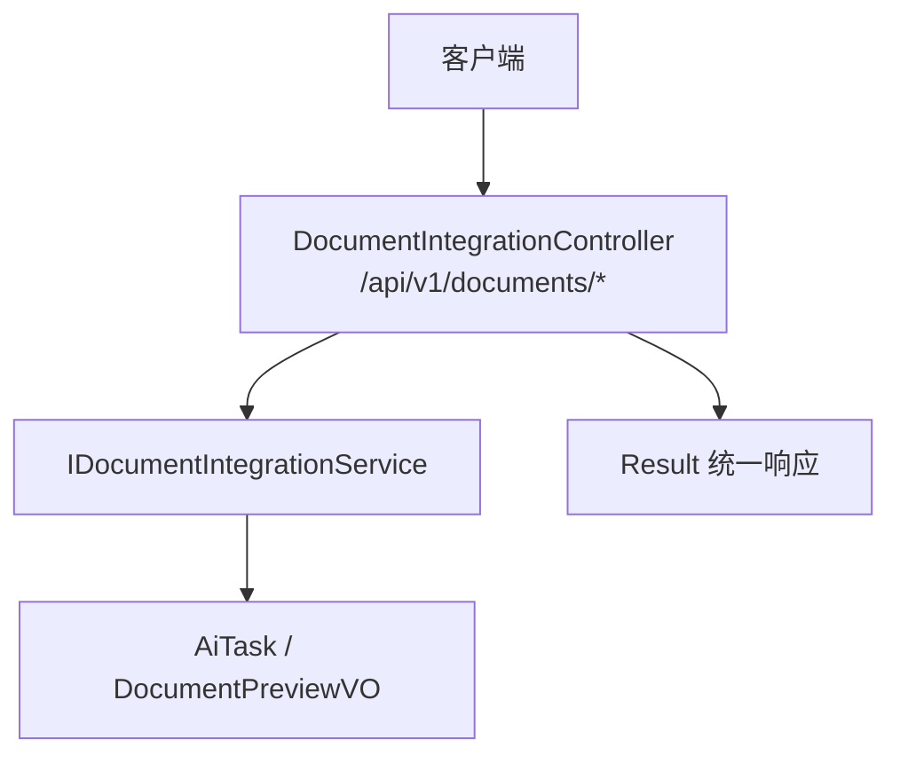
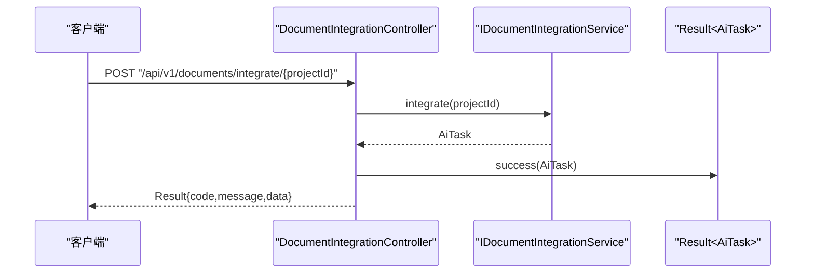

# 文档集成API接口

<cite>
**本文引用的文件**   
- [DocumentIntegrationController.java](file://ele-ai-tender-system/ele-ai-tender-core/src/main/java/com/jy/eleaitender/core/controller/DocumentIntegrationController.java)
- [IDocumentIntegrationService.java](file://ele-ai-tender-system/ele-ai-tender-core/src/main/java/com/jy/eleaitender/core/service/IDocumentIntegrationService.java)
- [DocumentPreviewVO.java](file://ele-ai-tender-system/ele-ai-tender-core/src/main/java/com/jy/eleaitender/core/dto/response/DocumentPreviewVO.java)
- [AiTask.java](file://ele-ai-tender-system/ele-ai-tender-common/src/main/java/com/jy/eleaitender/common/entity/ai/AiTask.java)
- [Result.java](file://ele-ai-tender-system/ele-ai-tender-common/src/main/java/com/jy/eleaitender/common/response/Result.java)
- [ResponseCode.java](file://ele-ai-tender-system/ele-ai-tender-common/src/main/java/com/jy/eleaitender/common/enums/ResponseCode.java)
</cite>

## 目录
1. [简介](#简介)
2. [项目结构](#项目结构)
3. [核心组件](#核心组件)
4. [架构总览](#架构总览)
5. [详细组件分析](#详细组件分析)
6. [依赖关系分析](#依赖关系分析)
7. [性能考虑](#性能考虑)
8. [故障排查指南](#故障排查指南)
9. [结论](#结论)
10. [附录](#附录)

## 简介
本文件为“文档集成”模块的对外RESTful API接口文档，聚焦于 DocumentIntegrationController 暴露的端点，覆盖请求方法、URL路径、参数与响应格式说明。重点包括：
- 文档生成（集成）接口
- 预览接口
- 内容编辑接口
- 统一响应体与错误码规范
- 认证与安全特性说明
- 常见调用示例与最佳实践建议

## 项目结构
该功能位于后端核心模块 ele-ai-tender-core 中，控制器通过服务层完成业务处理，返回统一结果封装对象。



图表来源
- [DocumentIntegrationController.java:18-49](file://ele-ai-tender-system/ele-ai-tender-core/src/main/java/com/jy/eleaitender/core/controller/DocumentIntegrationController.java#L18-L49)
- [IDocumentIntegrationService.java:9-25](file://ele-ai-tender-system/ele-ai-tender-core/src/main/java/com/jy/eleaitender/core/service/IDocumentIntegrationService.java#L9-L25)
- [AiTask.java:22-76](file://ele-ai-tender-system/ele-ai-tender-common/src/main/java/com/jy/eleaitender/common/entity/ai/AiTask.java#L22-L76)
- [DocumentPreviewVO.java:11-30](file://ele-ai-tender-system/ele-ai-tender-core/src/main/java/com/jy/eleaitender/core/dto/response/DocumentPreviewVO.java#L11-L30)
- [Result.java:13-104](file://ele-ai-tender-system/ele-ai-tender-common/src/main/java/com/jy/eleaitender/common/response/Result.java#L13-L104)

章节来源
- [DocumentIntegrationController.java:18-49](file://ele-ai-tender-system/ele-ai-tender-core/src/main/java/com/jy/eleaitender/core/controller/DocumentIntegrationController.java#L18-L49)
- [IDocumentIntegrationService.java:9-25](file://ele-ai-tender-system/ele-ai-tender-core/src/main/java/com/jy/eleaitender/core/service/IDocumentIntegrationService.java#L9-L25)

## 核心组件
- 控制器：DocumentIntegrationController
  - 提供三个端点：执行文档集成、获取集成预览、编辑集成后的文档内容
  - 使用 @RequireLogin 进行登录校验
  - 使用 Swagger 注解标注接口元信息
- 服务接口：IDocumentIntegrationService
  - 定义 integrate、getPreview、editContent 三个能力
- 数据模型
  - AiTask：AI任务实体，用于表示异步任务状态与结果
  - DocumentPreviewVO：文档预览视图对象，包含HTML预览、Markdown原始内容与关联文件ID等
- 统一响应：Result<T>
  - 所有接口均返回 Result 包装体，包含 code、message、data、timestamp

章节来源
- [DocumentIntegrationController.java:18-49](file://ele-ai-tender-system/ele-ai-tender-core/src/main/java/com/jy/eleaitender/core/controller/DocumentIntegrationController.java#L18-L49)
- [IDocumentIntegrationService.java:9-25](file://ele-ai-tender-system/ele-ai-tender-core/src/main/java/com/jy/eleaitender/core/service/IDocumentIntegrationService.java#L9-L25)
- [AiTask.java:22-76](file://ele-ai-tender-system/ele-ai-tender-common/src/main/java/com/jy/eleaitender/common/entity/ai/AiTask.java#L22-L76)
- [DocumentPreviewVO.java:11-30](file://ele-ai-tender-system/ele-ai-tender-core/src/main/java/com/jy/eleaitender/core/dto/response/DocumentPreviewVO.java#L11-L30)
- [Result.java:13-104](file://ele-ai-tender-system/ele-ai-tender-common/src/main/java/com/jy/eleaitender/common/response/Result.java#L13-L104)

## 架构总览
以下时序图展示“执行文档集成”接口的典型调用流程。



图表来源
- [DocumentIntegrationController.java:26-31](file://ele-ai-tender-system/ele-ai-tender-core/src/main/java/com/jy/eleaitender/core/controller/DocumentIntegrationController.java#L26-L31)
- [IDocumentIntegrationService.java:14](file://ele-ai-tender-system/ele-ai-tender-core/src/main/java/com/jy/eleaitender/core/service/IDocumentIntegrationService.java#L14)
- [Result.java:58-60](file://ele-ai-tender-system/ele-ai-tender-common/src/main/java/com/jy/eleaitender/common/response/Result.java#L58-L60)
- [AiTask.java:22-76](file://ele-ai-tender-system/ele-ai-tender-common/src/main/java/com/jy/eleaitender/common/entity/ai/AiTask.java#L22-L76)

## 详细组件分析

### 接口清单与规范
基础路径：/api/v1/documents

- 执行文档集成
  - 方法：POST
  - 路径：/api/v1/documents/integrate/{projectId}
  - 路径参数：
    - projectId：Long，必填
  - 请求头：
    - 需携带登录凭证（见“安全与权限控制”）
  - 响应体：Result<AiTask>
  - 成功示例（JSON）：
    {
      "code": 200,
      "message": "操作成功",
      "data": {
        "id": 1,
        "taskType": "DOCUMENT_INTEGRATE",
        "projectId": 123,
        "bizType": "PROJECT",
        "status": "CREATED",
        "result": null,
        "errorMsg": null,
        "retryCount": 0,
        "maxRetry": 3,
        "startedAt": null,
        "completedAt": null,
        "timeoutMinutes": 30,
        "resultSynced": 0
      },
      "timestamp": 1710000000000
    }
  - 失败示例（JSON）：
    {
      "code": 9044,
      "message": "文档集成任务正在执行中",
      "data": null,
      "timestamp": 1710000000000
    }

- 获取集成预览
  - 方法：GET
  - 路径：/api/v1/documents/preview/{projectId}
  - 路径参数：
    - projectId：Long，必填
  - 请求头：
    - 需携带登录凭证
  - 响应体：Result<DocumentPreviewVO>
  - 成功示例（JSON）：
    {
      "code": 200,
      "message": "操作成功",
      "data": {
        "projectId": 123,
        "projectName": "某采购项目",
        "htmlContent": "<h1>...</h1>",
        "markdownContent": "# ...\n...",
        "integrated": false,
        "generatedFileId": null
      },
      "timestamp": 1710000000000
    }
  - 失败示例（JSON）：
    {
      "code": 9041,
      "message": "文档集成失败",
      "data": null,
      "timestamp": 1710000000000
    }

- 编辑集成后的文档内容
  - 方法：PUT
  - 路径：/api/v1/documents/edit/{projectId}
  - 路径参数：
    - projectId：Long，必填
  - 请求体：
    - markdownContent：String，必填
  - 请求头：
    - Content-Type: application/json
    - 需携带登录凭证
  - 响应体：Result<Void>
  - 成功示例（JSON）：
    {
      "code": 200,
      "message": "操作成功",
      "data": null,
      "timestamp": 1710000000000
    }
  - 失败示例（JSON）：
    {
      "code": 9041,
      "message": "文档集成失败",
      "data": null,
      "timestamp": 1710000000000
    }

章节来源
- [DocumentIntegrationController.java:26-48](file://ele-ai-tender-system/ele-ai-tender-core/src/main/java/com/jy/eleaitender/core/controller/DocumentIntegrationController.java#L26-L48)
- [IDocumentIntegrationService.java:14-24](file://ele-ai-tender-system/ele-ai-tender-core/src/main/java/com/jy/eleaitender/core/service/IDocumentIntegrationService.java#L14-L24)
- [DocumentPreviewVO.java:11-30](file://ele-ai-tender-system/ele-ai-tender-core/src/main/java/com/jy/eleaitender/core/dto/response/DocumentPreviewVO.java#L11-L30)
- [AiTask.java:22-76](file://ele-ai-tender-system/ele-ai-tender-common/src/main/java/com/jy/eleaitender/common/entity/ai/AiTask.java#L22-L76)
- [Result.java:51-95](file://ele-ai-tender-system/ele-ai-tender-common/src/main/java/com/jy/eleaitender/common/response/Result.java#L51-L95)
- [ResponseCode.java:146-150](file://ele-ai-tender-system/ele-ai-tender-common/src/main/java/com/jy/eleaitender/common/enums/ResponseCode.java#L146-L150)

### 数据模型说明
- AiTask（AI任务）
  - 关键字段：taskType、projectId、bizType、status、result、errorMsg、retryCount、maxRetry、startedAt、completedAt、timeoutMinutes、resultSynced
  - 用途：承载文档集成的异步任务信息与执行结果
- DocumentPreviewVO（文档预览）
  - 关键字段：projectId、projectName、htmlContent、markdownContent、integrated、generatedFileId
  - 用途：返回当前项目的文档预览内容与集成状态
- Result<T>（统一响应）
  - 字段：code、message、data、timestamp
  - 工具方法：success()/fail() 等便捷构造器

章节来源
- [AiTask.java:22-76](file://ele-ai-tender-system/ele-ai-tender-common/src/main/java/com/jy/eleaitender/common/entity/ai/AiTask.java#L22-L76)
- [DocumentPreviewVO.java:11-30](file://ele-ai-tender-system/ele-ai-tender-core/src/main/java/com/jy/eleaitender/core/dto/response/DocumentPreviewVO.java#L11-L30)
- [Result.java:13-104](file://ele-ai-tender-system/ele-ai-tender-common/src/main/java/com/jy/eleaitender/common/response/Result.java#L13-L104)

### 安全与权限控制
- 认证机制
  - 接口使用 @RequireLogin 注解保护，未登录或登录态无效将返回未授权错误
- 权限控制
  - 基于登录态进行访问控制；具体资源级权限由服务层实现保障
- 限流策略
  - 未在控制器层显式声明限流注解；如需限流可在网关或全局拦截器层配置
- 签名与时间戳
  - 本控制器未使用外部系统签名校验；若对接外部系统，请参考交互模块相关规范

章节来源
- [DocumentIntegrationController.java:27-47](file://ele-ai-tender-system/ele-ai-tender-core/src/main/java/com/jy/eleaitender/core/controller/DocumentIntegrationController.java#L27-L47)
- [ResponseCode.java:14-16](file://ele-ai-tender-system/ele-ai-tender-common/src/main/java/com/jy/eleaitender/common/enums/ResponseCode.java#L14-L16)

### 错误码与异常处理
- 通用错误码
  - 200：操作成功
  - 400：参数错误
  - 401：未授权
  - 403：无权限访问
  - 404：资源不存在
  - 405：方法不允许
  - 500：操作失败
- 文档集成相关错误码
  - 9041：文档集成失败
  - 9042：文档导出失败
  - 9043：操作暂不支持
  - 9044：文档集成任务正在执行中

章节来源
- [ResponseCode.java:8-18](file://ele-ai-tender-system/ele-ai-tender-common/src/main/java/com/jy/eleaitender/common/enums/ResponseCode.java#L8-L18)
- [ResponseCode.java:146-150](file://ele-ai-tender-system/ele-ai-tender-common/src/main/java/com/jy/eleaitender/common/enums/ResponseCode.java#L146-L150)

### 使用场景与最佳实践
- 典型工作流
  - 步骤1：调用“执行文档集成”，获得 AiTask 并轮询任务状态
  - 步骤2：任务完成后，调用“获取集成预览”查看 HTML/Markdown 内容
  - 步骤3：如需调整，调用“编辑集成后的文档内容”提交修改
- 并发与幂等
  - 当检测到“文档集成任务正在执行中”时，应避免重复触发，可基于任务状态或唯一键做幂等控制
- 超时与重试
  - 根据 AiTask.timeoutMinutes 设置合理的轮询间隔与最大等待时间
- 预览与导出
  - 预览接口返回 htmlContent/markdownContent；如需下载Word，可使用 generatedFileId 结合文件服务接口（不在本控制器范围内）

[本节为概念性指导，不直接分析具体代码文件]

## 依赖关系分析
```mermaid
classDiagram
class DocumentIntegrationController {
+POST "/integrate/{projectId}"
+GET "/preview/{projectId}"
+PUT "/edit/{projectId}"
}
class IDocumentIntegrationService {
+integrate(projectId) AiTask
+getPreview(projectId) DocumentPreviewVO
+editContent(projectId, markdownContent) void
}
class AiTask
class DocumentPreviewVO
class Result~T~
DocumentIntegrationController --> IDocumentIntegrationService : "调用"
IDocumentIntegrationService --> AiTask : "返回"
IDocumentIntegrationService --> DocumentPreviewVO : "返回"
DocumentIntegrationController --> Result~T~ : "封装响应"
```

图表来源
- [DocumentIntegrationController.java:18-49](file://ele-ai-tender-system/ele-ai-tender-core/src/main/java/com/jy/eleaitender/core/controller/DocumentIntegrationController.java#L18-L49)
- [IDocumentIntegrationService.java:9-25](file://ele-ai-tender-system/ele-ai-tender-core/src/main/java/com/jy/eleaitender/core/service/IDocumentIntegrationService.java#L9-L25)
- [AiTask.java:22-76](file://ele-ai-tender-system/ele-ai-tender-common/src/main/java/com/jy/eleaitender/common/entity/ai/AiTask.java#L22-L76)
- [DocumentPreviewVO.java:11-30](file://ele-ai-tender-system/ele-ai-tender-core/src/main/java/com/jy/eleaitender/core/dto/response/DocumentPreviewVO.java#L11-L30)
- [Result.java:13-104](file://ele-ai-tender-system/ele-ai-tender-common/src/main/java/com/jy/eleaitender/common/response/Result.java#L13-L104)

章节来源
- [DocumentIntegrationController.java:18-49](file://ele-ai-tender-system/ele-ai-tender-core/src/main/java/com/jy/eleaitender/core/controller/DocumentIntegrationController.java#L18-L49)
- [IDocumentIntegrationService.java:9-25](file://ele-ai-tender-system/ele-ai-tender-core/src/main/java/com/jy/eleaitender/core/service/IDocumentIntegrationService.java#L9-L25)

## 性能考虑
- 异步任务
  - 文档集成可能耗时较长，建议采用异步任务模式并通过任务状态轮询
- 预览渲染
  - HTML预览内容可能较大，注意分页或按需加载
- 网络与序列化
  - 合理设置请求/响应大小限制，避免大文本导致内存压力

[本节为通用性能建议，不直接分析具体代码文件]

## 故障排查指南
- 常见问题
  - 未授权：检查登录态是否有效，确认请求头携带必要凭证
  - 任务冲突：出现“文档集成任务正在执行中”时，等待前次任务完成或去重
  - 预览为空：确认已存在可集成的源数据，或先执行集成再预览
- 定位手段
  - 查看 Result.code 与 message 快速定位错误类型
  - 针对 AiTask.status 与 errorMsg 进一步诊断任务执行情况

章节来源
- [ResponseCode.java:14-16](file://ele-ai-tender-system/ele-ai-tender-common/src/main/java/com/jy/eleaitender/common/enums/ResponseCode.java#L14-L16)
- [ResponseCode.java:146-150](file://ele-ai-tender-system/ele-ai-tender-common/src/main/java/com/jy/eleaitender/common/enums/ResponseCode.java#L146-L150)
- [AiTask.java:42-49](file://ele-ai-tender-system/ele-ai-tender-common/src/main/java/com/jy/eleaitender/common/entity/ai/AiTask.java#L42-L49)

## 结论
DocumentIntegrationController 提供了文档集成、预览与内容编辑的核心能力，配合统一响应体与明确的任务模型，便于前端与第三方系统集成。建议在调用侧做好登录态管理、任务轮询与幂等控制，以获得稳定可靠的集成体验。

[本节为总结性内容，不直接分析具体代码文件]

## 附录
- 接口元信息
  - 控制器类名：DocumentIntegrationController
  - 包路径：com.jy.eleaitender.core.controller
  - 基础路径：/api/v1/documents
- 相关枚举与常量
  - 响应码枚举：ResponseCode
  - 统一响应：Result
  - 任务实体：AiTask
  - 预览视图：DocumentPreviewVO

章节来源
- [DocumentIntegrationController.java:18-21](file://ele-ai-tender-system/ele-ai-tender-core/src/main/java/com/jy/eleaitender/core/controller/DocumentIntegrationController.java#L18-L21)
- [ResponseCode.java:8-18](file://ele-ai-tender-system/ele-ai-tender-common/src/main/java/com/jy/eleaitender/common/enums/ResponseCode.java#L8-L18)
- [Result.java:13-104](file://ele-ai-tender-system/ele-ai-tender-common/src/main/java/com/jy/eleaitender/common/response/Result.java#L13-L104)
- [AiTask.java:22-76](file://ele-ai-tender-system/ele-ai-tender-common/src/main/java/com/jy/eleaitender/common/entity/ai/AiTask.java#L22-L76)
- [DocumentPreviewVO.java:11-30](file://ele-ai-tender-system/ele-ai-tender-core/src/main/java/com/jy/eleaitender/core/dto/response/DocumentPreviewVO.java#L11-L30)