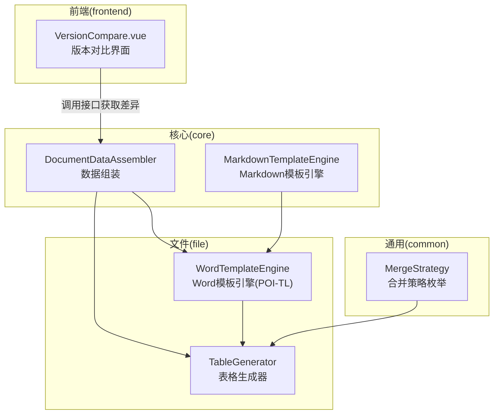
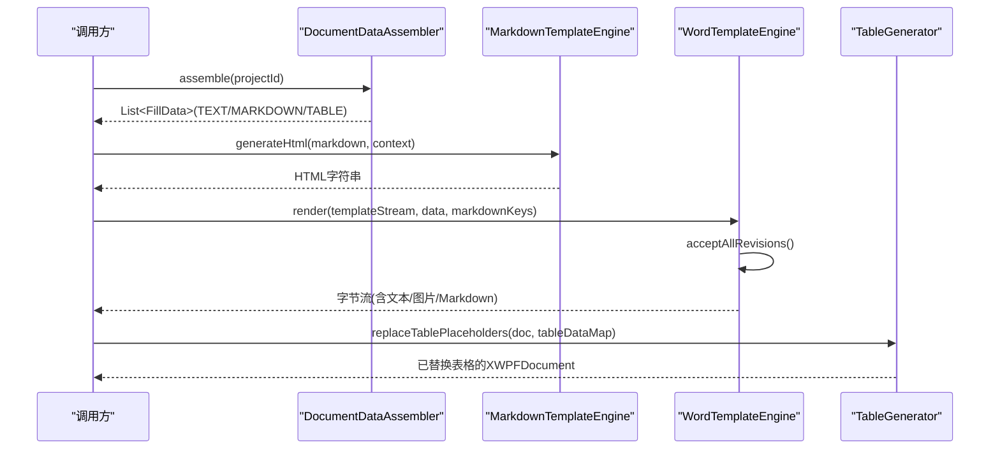
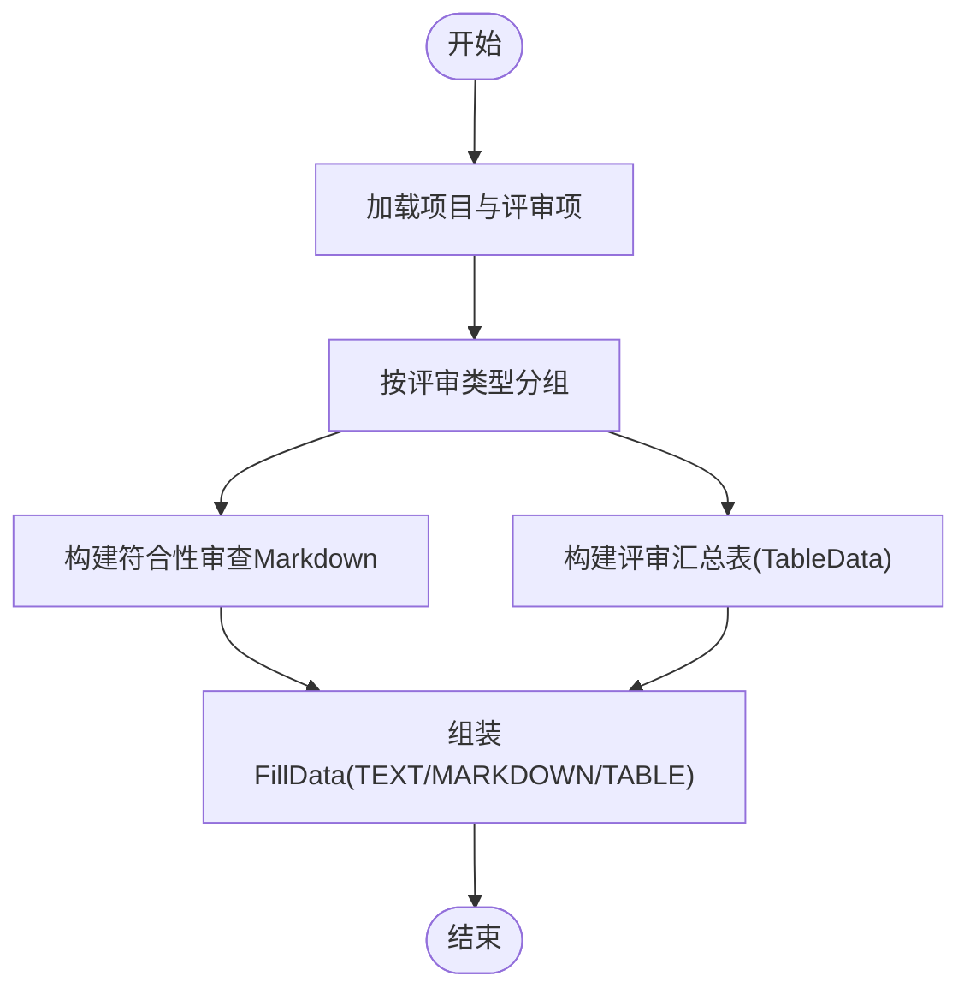
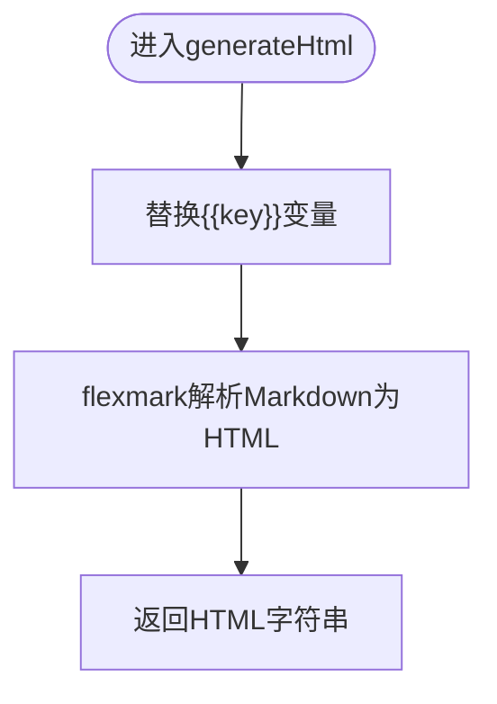
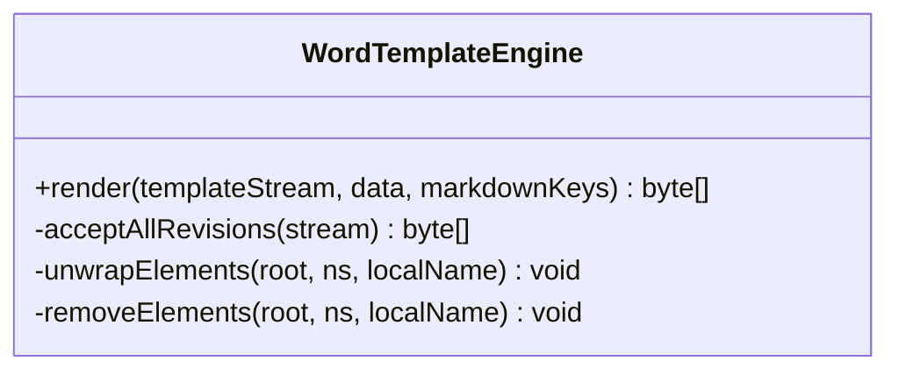
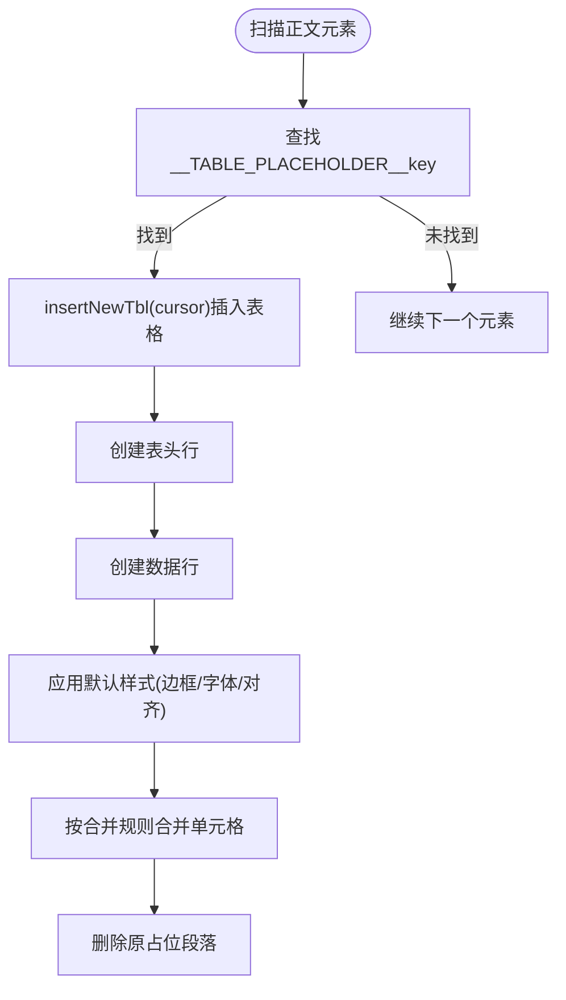
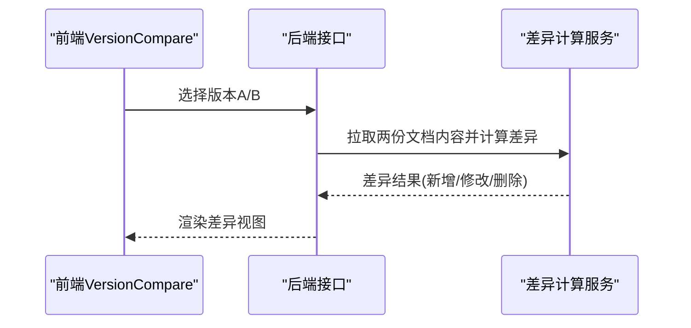
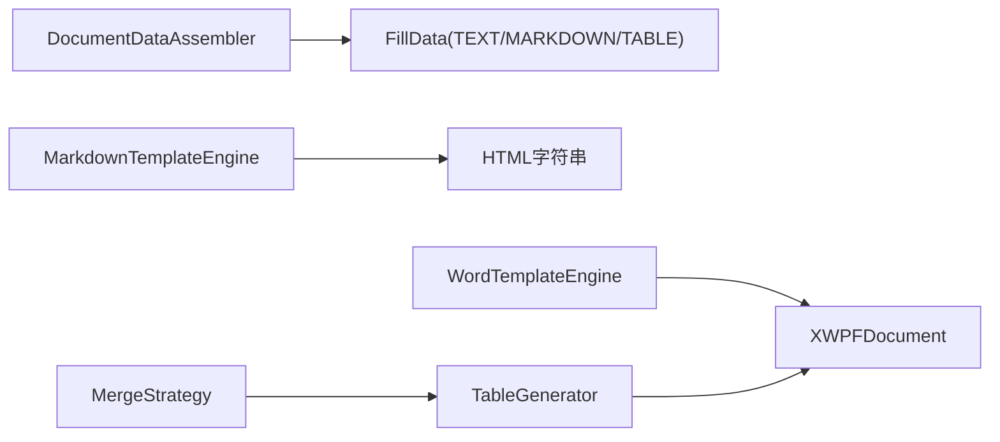

# 文档集成引擎

<cite>
**本文引用的文件**   
- [DocumentDataAssembler.java](file://ele-ai-tender-system/ele-ai-tender-core/src/main/java/com/jy/eleaitender/core/engine/DocumentDataAssembler.java)
- [MarkdownTemplateEngine.java](file://ele-ai-tender-system/ele-ai-tender-core/src/main/java/com/jy/eleaitender/core/engine/MarkdownTemplateEngine.java)
- [WordTemplateEngine.java](file://ele-ai-tender-system/ele-ai-tender-file/src/main/java/com/jy/eleaitender/file/engine/WordTemplateEngine.java)
- [TableGenerator.java](file://ele-ai-tender-system/ele-ai-tender-file/src/main/java/com/jy/eleaitender/file/engine/TableGenerator.java)
- [MergeStrategy.java](file://ele-ai-tender-system/ele-ai-tender-common/src/main/java/com/jy/eleaitender/common/dto/MergeStrategy.java)
- [FILE_SERVICE_SPEC.md](file://docs/rules/FILE_SERVICE_SPEC.md)
- [VersionCompare.vue](file://ele-ai-tender-frontend/src/components/project/VersionCompare.vue)
</cite>

## 目录
1. [引言](#引言)
2. [项目结构](#项目结构)
3. [核心组件](#核心组件)
4. [架构总览](#架构总览)
5. [详细组件分析](#详细组件分析)
6. [依赖关系分析](#依赖关系分析)
7. [性能与可扩展性](#性能与可扩展性)
8. [故障排查指南](#故障排查指南)
9. [结论](#结论)
10. [附录](#附录)

## 引言
本技术文档围绕“文档集成引擎”展开，聚焦以下目标：
- 文档数据组装器：多源数据聚合、数据转换、格式化输出（文本、表格、Markdown）
- Markdown模板引擎：变量替换、Markdown→HTML渲染流程
- Word文档生成器：基于POI-TL的模板处理、表格生成、图片插入、样式定制
- 版本对比与合并策略：前端对比展示与后端合并策略定义
- 高级功能：预览、导出、批量处理的实现思路与要点

## 项目结构
文档集成相关代码主要分布在 core 与 file 两个模块中，common 提供通用DTO，前端在 frontend 提供版本对比UI。

图表来源
- [DocumentDataAssembler.java:1-267](file://ele-ai-tender-system/ele-ai-tender-core/src/main/java/com/jy/eleaitender/core/engine/DocumentDataAssembler.java#L1-L267)
- [MarkdownTemplateEngine.java:1-82](file://ele-ai-tender-system/ele-ai-tender-core/src/main/java/com/jy/eleaitender/core/engine/MarkdownTemplateEngine.java#L1-L82)
- [WordTemplateEngine.java:1-121](file://ele-ai-tender-system/ele-ai-tender-file/src/main/java/com/jy/eleaitender/file/engine/WordTemplateEngine.java#L1-L121)
- [TableGenerator.java:1-287](file://ele-ai-tender-system/ele-ai-tender-file/src/main/java/com/jy/eleaitender/file/engine/TableGenerator.java#L1-L287)
- [MergeStrategy.java:1-11](file://ele-ai-tender-system/ele-ai-tender-common/src/main/java/com/jy/eleaitender/common/dto/MergeStrategy.java#L1-L11)
- [VersionCompare.vue:1-80](file://ele-ai-tender-frontend/src/components/project/VersionCompare.vue#L1-L80)

章节来源
- [DocumentDataAssembler.java:1-267](file://ele-ai-tender-system/ele-ai-tender-core/src/main/java/com/jy/eleaitender/core/engine/DocumentDataAssembler.java#L1-L267)
- [MarkdownTemplateEngine.java:1-82](file://ele-ai-tender-system/ele-ai-tender-core/src/main/java/com/jy/eleaitender/core/engine/MarkdownTemplateEngine.java#L1-L82)
- [WordTemplateEngine.java:1-121](file://ele-ai-tender-system/ele-ai-tender-file/src/main/java/com/jy/eleaitender/file/engine/WordTemplateEngine.java#L1-L121)
- [TableGenerator.java:1-287](file://ele-ai-tender-system/ele-ai-tender-file/src/main/java/com/jy/eleaitender/file/engine/TableGenerator.java#L1-L287)
- [MergeStrategy.java:1-11](file://ele-ai-tender-system/ele-ai-tender-common/src/main/java/com/jy/eleaitender/common/dto/MergeStrategy.java#L1-L11)
- [VersionCompare.vue:1-80](file://ele-ai-tender-frontend/src/components/project/VersionCompare.vue#L1-L80)

## 核心组件
- 文档数据组装器：从项目基础信息、需求内容、评审项等多源数据聚合，转换为结构化 FillData 列表，包含 TEXT、MARKDOWN、TABLE 三类数据，供后续渲染使用。
- Markdown模板引擎：支持 {{key}} 占位符替换，并将 Markdown 解析为 HTML，便于预览或嵌入到文档内容中。
- Word模板引擎：基于 POI-TL 原生配置，负责文本、图片、Markdown 渲染；通过修订标记清理避免编译期异常。
- 表格生成器：绕过 POI-TL 循环标签限制，直接以 Apache POI API 创建表格，支持列定义、行数据填充、默认样式、单元格合并等。
- 合并策略：定义表格单元格合并策略（如按相邻相同文本合并）。

章节来源
- [DocumentDataAssembler.java:1-267](file://ele-ai-tender-system/ele-ai-tender-core/src/main/java/com/jy/eleaitender/core/engine/DocumentDataAssembler.java#L1-L267)
- [MarkdownTemplateEngine.java:1-82](file://ele-ai-tender-system/ele-ai-tender-core/src/main/java/com/jy/eleaitender/core/engine/MarkdownTemplateEngine.java#L1-L82)
- [WordTemplateEngine.java:1-121](file://ele-ai-tender-system/ele-ai-tender-file/src/main/java/com/jy/eleaitender/file/engine/WordTemplateEngine.java#L1-L121)
- [TableGenerator.java:1-287](file://ele-ai-tender-system/ele-ai-tender-file/src/main/java/com/jy/eleaitender/file/engine/TableGenerator.java#L1-L287)
- [MergeStrategy.java:1-11](file://ele-ai-tender-system/ele-ai-tender-common/src/main/java/com/jy/eleaitender/common/dto/MergeStrategy.java#L1-L11)

## 架构总览
整体流程：数据组装 → 模板渲染（文本/图片/Markdown）→ 表格占位符扫描与替换 → 输出最终文档。

图表来源
- [DocumentDataAssembler.java:47-99](file://ele-ai-tender-system/ele-ai-tender-core/src/main/java/com/jy/eleaitender/core/engine/DocumentDataAssembler.java#L47-L99)
- [MarkdownTemplateEngine.java:64-73](file://ele-ai-tender-system/ele-ai-tender-core/src/main/java/com/jy/eleaitender/core/engine/MarkdownTemplateEngine.java#L64-L73)
- [WordTemplateEngine.java:42-63](file://ele-ai-tender-system/ele-ai-tender-file/src/main/java/com/jy/eleaitender/file/engine/WordTemplateEngine.java#L42-L63)
- [TableGenerator.java:31-53](file://ele-ai-tender-system/ele-ai-tender-file/src/main/java/com/jy/eleaitender/file/engine/TableGenerator.java#L31-L53)

## 详细组件分析

### 文档数据组装器（DocumentDataAssembler）
职责与能力
- 多源聚合：读取项目基础信息、需求内容、评审项等数据。
- 数据转换：将评审项按类型分组、构建符合性审查 Markdown、生成评审汇总表 TableData。
- 格式化输出：构造 FillData 列表，包含 TEXT、MARKDOWN、TABLE 三种类型，供渲染层消费。

关键流程
- 加载项目与评审项，按评审类型分组。
- 构建符合性审查 Markdown（忽略一级节点，展示二级+三级列表）。
- 构建评审汇总表 TableData（含列定义、行数据、合并规则）。

图表来源
- [DocumentDataAssembler.java:47-99](file://ele-ai-tender-system/ele-ai-tender-core/src/main/java/com/jy/eleaitender/core/engine/DocumentDataAssembler.java#L47-L99)
- [DocumentDataAssembler.java:132-166](file://ele-ai-tender-system/ele-ai-tender-core/src/main/java/com/jy/eleaitender/core/engine/DocumentDataAssembler.java#L132-L166)
- [DocumentDataAssembler.java:106-121](file://ele-ai-tender-system/ele-ai-tender-core/src/main/java/com/jy/eleaitender/core/engine/DocumentDataAssembler.java#L106-L121)

章节来源
- [DocumentDataAssembler.java:1-267](file://ele-ai-tender-system/ele-ai-tender-core/src/main/java/com/jy/eleaitender/core/engine/DocumentDataAssembler.java#L1-L267)

### Markdown模板引擎（MarkdownTemplateEngine）
工作机制
- 变量替换：支持 {{key}} 占位符，遍历上下文进行字符串替换。
- Markdown→HTML：使用 flexmark-java 解析 Markdown 为 HTML，用于预览或嵌入。

图表来源
- [MarkdownTemplateEngine.java:44-55](file://ele-ai-tender-system/ele-ai-tender-core/src/main/java/com/jy/eleaitender/core/engine/MarkdownTemplateEngine.java#L44-L55)
- [MarkdownTemplateEngine.java:33-39](file://ele-ai-tender-system/ele-ai-tender-core/src/main/java/com/jy/eleaitender/core/engine/MarkdownTemplateEngine.java#L33-L39)
- [MarkdownTemplateEngine.java:64-73](file://ele-ai-tender-system/ele-ai-tender-core/src/main/java/com/jy/eleaitender/core/engine/MarkdownTemplateEngine.java#L64-L73)

章节来源
- [MarkdownTemplateEngine.java:1-82](file://ele-ai-tender-system/ele-ai-tender-core/src/main/java/com/jy/eleaitender/core/engine/MarkdownTemplateEngine.java#L1-L82)

### Word模板引擎（WordTemplateEngine）
实现方案
- 使用 POI-TL 原生引擎（禁止 SpringEL），绑定 Markdown 渲染策略。
- 渲染前执行“接受所有修订”，避免 poi-tl 编译阶段因修订标记导致的索引错乱异常。
- 两阶段渲染：阶段一由 POI-TL 渲染文本/图片/Markdown；阶段二由 TableGenerator 替换表格占位符。

图表来源
- [WordTemplateEngine.java:42-63](file://ele-ai-tender-system/ele-ai-tender-file/src/main/java/com/jy/eleaitender/file/engine/WordTemplateEngine.java#L42-L63)
- [WordTemplateEngine.java:71-89](file://ele-ai-tender-system/ele-ai-tender-file/src/main/java/com/jy/eleaitender/file/engine/WordTemplateEngine.java#L71-L89)
- [WordTemplateEngine.java:92-119](file://ele-ai-tender-system/ele-ai-tender-file/src/main/java/com/jy/eleaitender/file/engine/WordTemplateEngine.java#L92-L119)

章节来源
- [WordTemplateEngine.java:1-121](file://ele-ai-tender-system/ele-ai-tender-file/src/main/java/com/jy/eleaitender/file/engine/WordTemplateEngine.java#L1-L121)
- [FILE_SERVICE_SPEC.md:33-71](file://docs/rules/FILE_SERVICE_SPEC.md#L33-L71)

### 表格生成器（TableGenerator）
功能特性
- 扫描文档中的表格占位符段落并替换为真实表格。
- 支持列定义、表头加粗、数据行填充、默认样式（边框、字体、对齐）。
- 单元格合并：按相邻相同文本合并策略。

图表来源
- [TableGenerator.java:31-53](file://ele-ai-tender-system/ele-ai-tender-file/src/main/java/com/jy/eleaitender/file/engine/TableGenerator.java#L31-L53)
- [TableGenerator.java:75-117](file://ele-ai-tender-system/ele-ai-tender-file/src/main/java/com/jy/eleaitender/file/engine/TableGenerator.java#L75-L117)
- [TableGenerator.java:147-184](file://ele-ai-tender-system/ele-ai-tender-file/src/main/java/com/jy/eleaitender/file/engine/TableGenerator.java#L147-L184)
- [TableGenerator.java:234-285](file://ele-ai-tender-system/ele-ai-tender-file/src/main/java/com/jy/eleaitender/file/engine/TableGenerator.java#L234-L285)

章节来源
- [TableGenerator.java:1-287](file://ele-ai-tender-system/ele-ai-tender-file/src/main/java/com/jy/eleaitender/file/engine/TableGenerator.java#L1-L287)
- [MergeStrategy.java:1-11](file://ele-ai-tender-system/ele-ai-tender-common/src/main/java/com/jy/eleaitender/common/dto/MergeStrategy.java#L1-L11)

### 版本对比与合并策略
- 前端对比：VersionCompare.vue 提供双版本选择与差异展示（新增/修改/删除高亮）。
- 合并策略：MergeStrategy 定义表格单元格合并策略（当前仅支持相邻相同文本合并）。

图表来源
- [VersionCompare.vue:1-80](file://ele-ai-tender-frontend/src/components/project/VersionCompare.vue#L1-L80)
- [MergeStrategy.java:1-11](file://ele-ai-tender-system/ele-ai-tender-common/src/main/java/com/jy/eleaitender/common/dto/MergeStrategy.java#L1-L11)

章节来源
- [VersionCompare.vue:1-80](file://ele-ai-tender-frontend/src/components/project/VersionCompare.vue#L1-L80)
- [MergeStrategy.java:1-11](file://ele-ai-tender-system/ele-ai-tender-common/src/main/java/com/jy/eleaitender/common/dto/MergeStrategy.java#L1-L11)

## 依赖关系分析
- DocumentDataAssembler 依赖项目与评审项数据源，产出 FillData 列表。
- MarkdownTemplateEngine 被用于 Markdown→HTML 转换，供预览或嵌入。
- WordTemplateEngine 依赖 POI-TL 原生引擎与 Markdown 渲染策略，并在渲染前清理修订标记。
- TableGenerator 依赖 TableData、ColumnDef、MergeRule、MergeStrategy，直接操作 XWPFDocument 生成表格。

图表来源
- [DocumentDataAssembler.java:47-99](file://ele-ai-tender-system/ele-ai-tender-core/src/main/java/com/jy/eleaitender/core/engine/DocumentDataAssembler.java#L47-L99)
- [MarkdownTemplateEngine.java:64-73](file://ele-ai-tender-system/ele-ai-tender-core/src/main/java/com/jy/eleaitender/core/engine/MarkdownTemplateEngine.java#L64-L73)
- [WordTemplateEngine.java:42-63](file://ele-ai-tender-system/ele-ai-tender-file/src/main/java/com/jy/eleaitender/file/engine/WordTemplateEngine.java#L42-L63)
- [TableGenerator.java:31-53](file://ele-ai-tender-system/ele-ai-tender-file/src/main/java/com/jy/eleaitender/file/engine/TableGenerator.java#L31-L53)
- [MergeStrategy.java:1-11](file://ele-ai-tender-system/ele-ai-tender-common/src/main/java/com/jy/eleaitender/common/dto/MergeStrategy.java#L1-L11)

章节来源
- [DocumentDataAssembler.java:1-267](file://ele-ai-tender-system/ele-ai-tender-core/src/main/java/com/jy/eleaitender/core/engine/DocumentDataAssembler.java#L1-L267)
- [MarkdownTemplateEngine.java:1-82](file://ele-ai-tender-system/ele-ai-tender-core/src/main/java/com/jy/eleaitender/core/engine/MarkdownTemplateEngine.java#L1-L82)
- [WordTemplateEngine.java:1-121](file://ele-ai-tender-system/ele-ai-tender-file/src/main/java/com/jy/eleaitender/file/engine/WordTemplateEngine.java#L1-L121)
- [TableGenerator.java:1-287](file://ele-ai-tender-system/ele-ai-tender-file/src/main/java/com/jy/eleaitender/file/engine/TableGenerator.java#L1-L287)
- [MergeStrategy.java:1-11](file://ele-ai-tender-system/ele-ai-tender-common/src/main/java/com/jy/eleaitender/common/dto/MergeStrategy.java#L1-L11)

## 性能与可扩展性
- 数据组装：评审项分组与树形结构扁平化采用一次遍历与 Map 分组，时间复杂度近似 O(n)，适合中等规模评审项。
- Markdown渲染：flexmark 解析为 AST 再渲染为 HTML，对大段 Markdown 需注意内存占用，建议分页或分块处理。
- Word渲染：POI-TL 原生引擎避免反射开销；修订标记清理在 DOM 层面操作，需控制模板大小与节点数量。
- 表格生成：直接 POI API 创建表格，避免循环标签带来的额外解析成本；合并策略按列扫描，复杂度 O(m×n)。
- 扩展点：
  - 新增合并策略：扩展 MergeStrategy 并在 TableGenerator.applyMergeRules 中分支处理。
  - 新增数据类型：扩展 FillData 类型并在渲染管线中增加对应处理逻辑。
  - 模板语法扩展：在 MarkdownTemplateEngine 中增加条件渲染或函数式占位符。

[本节为通用指导，不直接分析具体文件]

## 故障排查指南
常见问题与定位
- Word模板填充失败：检查模板是否包含修订标记，确认 WordTemplateEngine 已执行 acceptAllRevisions。
- 表格未生成：确认 TableGenerator 能匹配 __TABLE_PLACEHOLDER__key，且 TableData 非空。
- Markdown未渲染：确认 WordTemplateEngine 绑定了 Markdown 渲染策略，且 markdownKeys 正确传入。
- 合并异常：检查 MergeRule 列索引与数据顺序，确保相邻相同文本连续排列。

参考规范
- POI-TL 引擎约束、占位符语法、两阶段渲染、修订标记预处理等详见 FILE_SERVICE_SPEC。

章节来源
- [WordTemplateEngine.java:42-63](file://ele-ai-tender-system/ele-ai-tender-file/src/main/java/com/jy/eleaitender/file/engine/WordTemplateEngine.java#L42-L63)
- [TableGenerator.java:31-53](file://ele-ai-tender-system/ele-ai-tender-file/src/main/java/com/jy/eleaitender/file/engine/TableGenerator.java#L31-L53)
- [FILE_SERVICE_SPEC.md:33-71](file://docs/rules/FILE_SERVICE_SPEC.md#L33-L71)

## 结论
文档集成引擎通过清晰的分层与职责划分，实现了从多源数据聚合到 Word 文档生成的完整链路。数据组装器提供结构化 FillData，Markdown 引擎支撑灵活的内容渲染，Word 引擎结合 POI-TL 与自定义表格生成器，兼顾了模板兼容性与生成质量。版本对比与合并策略为文档演进提供了可视化与可配置的支撑。

[本节为总结性内容，不直接分析具体文件]

## 附录
- 模板语法与约束：参见 FILE_SERVICE_SPEC 中关于 POI-TL 引擎约束、占位符语法、两阶段渲染、修订标记预处理的说明。
- 前端版本对比：VersionCompare.vue 提供双版本选择与差异展示，便于用户直观查看变更。

章节来源
- [FILE_SERVICE_SPEC.md:33-71](file://docs/rules/FILE_SERVICE_SPEC.md#L33-L71)
- [VersionCompare.vue:1-80](file://ele-ai-tender-frontend/src/components/project/VersionCompare.vue#L1-L80)