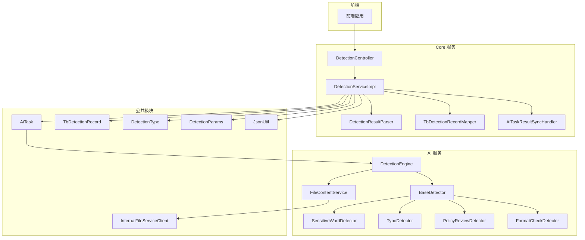
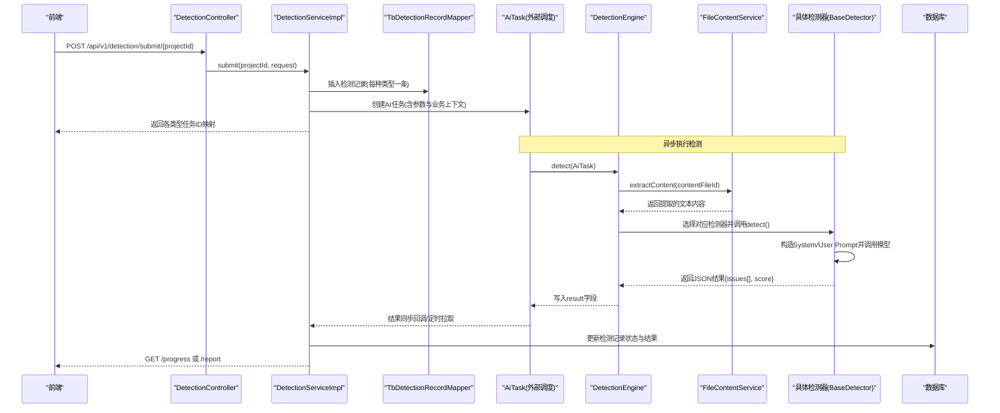
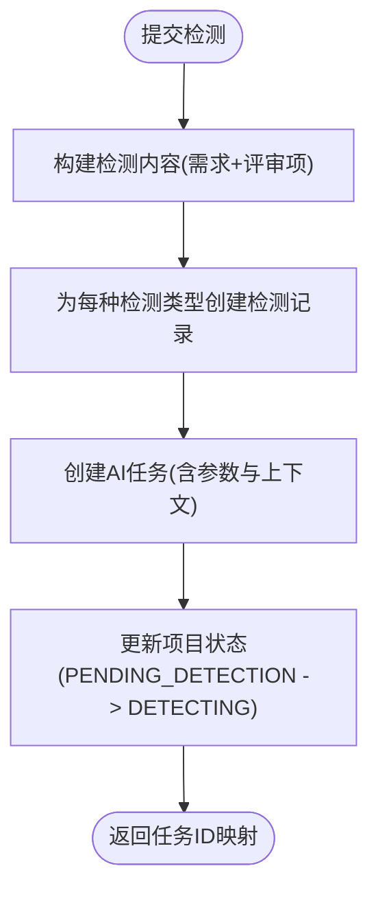
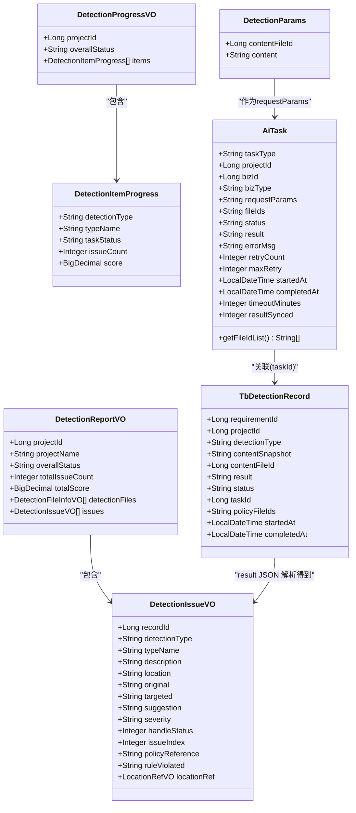
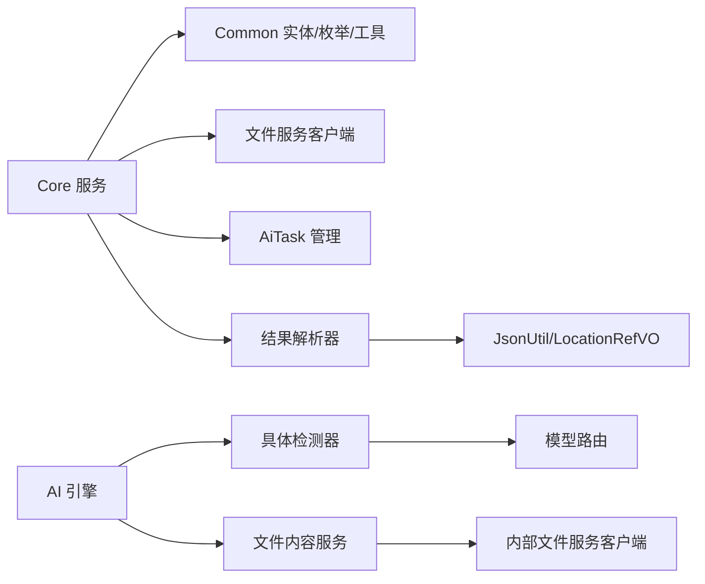

# 智能检测服务

<cite>
**本文引用的文件**   
- [DetectionServiceImpl.java](file://ele-ai-tender-system/ele-ai-tender-core/src/main/java/com/jy/eleaitender/core/service/impl/DetectionServiceImpl.java)
- [IDetectionService.java](file://ele-ai-tender-system/ele-ai-tender-core/src/main/java/com/jy/eleaitender/core/service/IDetectionService.java)
- [DetectionController.java](file://ele-ai-tender-system/ele-ai-tender-core/src/main/java/com/jy/eleaitender/core/controller/DetectionController.java)
- [DetectionProgressVO.java](file://ele-ai-tender-system/ele-ai-tender-core/src/main/java/com/jy/eleaitender/core/dto/response/DetectionProgressVO.java)
- [DetectionReportVO.java](file://ele-ai-tender-system/ele-ai-tender-core/src/main/java/com/jy/eleaitender/core/dto/response/DetectionReportVO.java)
- [DetectionIssueVO.java](file://ele-ai-tender-system/ele-ai-tender-core/src/main/java/com/jy/eleaitender/core/dto/response/DetectionIssueVO.java)
- [DetectionFileInfoVO.java](file://ele-ai-tender-system/ele-ai-tender-core/src/main/java/com/jy/eleaitender/core/dto/response/DetectionFileInfoVO.java)
- [TbDetectionRecord.java](file://ele-ai-tender-system/ele-ai-tender-common/src/main/java/com/jy/eleaitender/common/entity/core/TbDetectionRecord.java)
- [AiTask.java](file://ele-ai-tender-system/ele-ai-tender-common/src/main/java/com/jy/eleaitender/common/entity/ai/AiTask.java)
- [DetectionType.java](file://ele-ai-tender-system/ele-ai-tender-common/src/main/java/com/jy/eleaitender/common/enums/DetectionType.java)
- [DetectionParams.java](file://ele-ai-tender-system/ele-ai-tender-common/src/main/java/com/jy/eleaitender/common/dto/ai/DetectionParams.java)
- [DetectionResultParser.java](file://ele-ai-tender-system/ele-ai-tender-core/src/main/java/com/jy/eleaitender/core/util/DetectionResultParser.java)
- [DetectionEngine.java](file://ele-ai-tender-system/ele-ai-tender-ai/src/main/java/com/jy/eleaitender/ai/processor/checker/DetectionEngine.java)
- [BaseDetector.java](file://ele-ai-tender-system/ele-ai-tender-ai/src/main/java/com/jy/eleaitender/ai/processor/checker/BaseDetector.java)
- [SensitiveWordDetector.java](file://ele-ai-tender-system/ele-ai-tender-ai/src/main/java/com/jy/eleaitender/ai/processor/checker/SensitiveWordDetector.java)
- [TypoDetector.java](file://ele-ai-tender-system/ele-ai-tender-ai/src/main/java/com/jy/eleaitender/ai/processor/checker/TypoDetector.java)
- [PolicyReviewDetector.java](file://ele-ai-tender-system/ele-ai-tender-ai/src/main/java/com/jy/eleaitender/ai/processor/checker/PolicyReviewDetector.java)
- [FormatCheckDetector.java](file://ele-ai-tender-system/ele-ai-tender-ai/src/main/java/com/jy/eleaitender/ai/processor/checker/FormatCheckDetector.java)
- [AiTaskResultSyncHandler.java](file://ele-ai-tender-system/ele-ai-tender-core/src/main/java/com/jy/eleaitender/core/scheduler/AiTaskResultSyncHandler.java)
- [TbDetectionRecordMapper.java](file://ele-ai-tender-system/ele-ai-tender-core/src/main/java/com/jy/eleaitender/core/mapper/TbDetectionRecordMapper.java)
- [JsonUtil.java](file://ele-ai-tender-system/ele-ai-tender-common/src/main/java/com/jy/eleaitender/common/util/JsonUtil.java)
- [FileContentService.java](file://ele-ai-tender-system/ele-ai-tender-ai/src/main/java/com/jy/eleaitender/ai/service/FileContentService.java)
- [InternalFileServiceClient.java](file://ele-ai-tender-system/ele-ai-tender-common/src/main/java/com/jy/eleaitender/common/client/InternalFileServiceClient.java)
</cite>

## 更新摘要
**变更内容**   
- 更新了检测参数配置，支持通过contentFileId或content字段处理内容
- 完善了四种检测类型的详细说明：敏感词检测、错别字检查、政策审查和格式验证
- 增强了内容处理机制，支持直接文本输入和文件内容提取两种方式
- 优化了检测引擎的内容组装逻辑，支持多源内容合并处理

## 目录
1. [简介](#简介)
2. [项目结构](#项目结构)
3. [核心组件](#核心组件)
4. [架构总览](#架构总览)
5. [详细组件分析](#详细组件分析)
6. [依赖关系分析](#依赖关系分析)
7. [性能考虑](#性能考虑)
8. [故障排查指南](#故障排查指南)
9. [结论](#结论)
10. [附录](#附录)

## 简介
本技术文档围绕"智能检测服务"展开，聚焦于检测任务的创建与管理、检测类型定义与参数配置、执行状态跟踪、检测结果的数据结构与存储方案、AI检测结果的后处理与标准化、以及检测记录的查询与分析能力。系统现在支持通过contentFileId或content字段灵活处理检测内容，提供敏感词检测、错别字检查、政策审查和格式验证等多种检测类型，帮助读者快速理解并高效使用该系统。

## 项目结构
智能检测服务由 Core 模块（编排与业务）、AI 模块（检测引擎与具体检测器）、Common 模块（实体、枚举、DTO）组成，前后端通过 REST API 交互。Core 负责提交检测任务、聚合进度与报告、处理用户接受/拒绝建议；AI 负责根据任务类型分发到具体检测器，调用模型并输出结构化结果；Common 提供统一的数据结构与工具方法。



图表来源
- [DetectionController.java](file://ele-ai-tender-system/ele-ai-tender-core/src/main/java/com/jy/eleaitender/core/controller/DetectionController.java)
- [DetectionServiceImpl.java](file://ele-ai-tender-system/ele-ai-tender-core/src/main/java/com/jy/eleaitender/core/service/impl/DetectionServiceImpl.java)
- [DetectionResultParser.java](file://ele-ai-tender-system/ele-ai-tender-core/src/main/java/com/jy/eleaitender/core/util/DetectionResultParser.java)
- [TbDetectionRecordMapper.java](file://ele-ai-tender-system/ele-ai-tender-core/src/main/java/com/jy/eleaitender/core/mapper/TbDetectionRecordMapper.java)
- [AiTaskResultSyncHandler.java](file://ele-ai-tender-system/ele-ai-tender-core/src/main/java/com/jy/eleaitender/core/scheduler/AiTaskResultSyncHandler.java)
- [DetectionEngine.java](file://ele-ai-tender-system/ele-ai-tender-ai/src/main/java/com/jy/eleaitender/ai/processor/checker/DetectionEngine.java)
- [BaseDetector.java](file://ele-ai-tender-system/ele-ai-tender-ai/src/main/java/com/jy/eleaitender/ai/processor/checker/BaseDetector.java)
- [SensitiveWordDetector.java](file://ele-ai-tender-system/ele-ai-tender-ai/src/main/java/com/jy/eleaitender/ai/processor/checker/SensitiveWordDetector.java)
- [TypoDetector.java](file://ele-ai-tender-system/ele-ai-tender-ai/src/main/java/com/jy/eleaitender/ai/processor/checker/TypoDetector.java)
- [PolicyReviewDetector.java](file://ele-ai-tender-system/ele-ai-tender-ai/src/main/java/com/jy/eleaitender/ai/processor/checker/PolicyReviewDetector.java)
- [FormatCheckDetector.java](file://ele-ai-tender-system/ele-ai-tender-ai/src/main/java/com/jy/eleaitender/ai/processor/checker/FormatCheckDetector.java)
- [FileContentService.java](file://ele-ai-tender-system/ele-ai-tender-ai/src/main/java/com/jy/eleaitender/ai/service/FileContentService.java)
- [InternalFileServiceClient.java](file://ele-ai-tender-system/ele-ai-tender-common/src/main/java/com/jy/eleaitender/common/client/InternalFileServiceClient.java)
- [AiTask.java](file://ele-ai-tender-system/ele-ai-tender-common/src/main/java/com/jy/eleaitender/common/entity/ai/AiTask.java)
- [TbDetectionRecord.java](file://ele-ai-tender-system/ele-ai-tender-common/src/main/java/com/jy/eleaitender/common/entity/core/TbDetectionRecord.java)
- [DetectionType.java](file://ele-ai-tender-system/ele-ai-tender-common/src/main/java/com/jy/eleaitender/common/enums/DetectionType.java)
- [DetectionParams.java](file://ele-ai-tender-system/ele-ai-tender-common/src/main/java/com/jy/eleaitender/common/dto/ai/DetectionParams.java)
- [JsonUtil.java](file://ele-ai-tender-system/ele-ai-tender-common/src/main/java/com/jy/eleaitender/common/util/JsonUtil.java)

章节来源
- [DetectionController.java](file://ele-ai-tender-system/ele-ai-tender-core/src/main/java/com/jy/eleaitender/core/controller/DetectionController.java)
- [DetectionServiceImpl.java](file://ele-ai-tender-system/ele-ai-tender-core/src/main/java/com/jy/eleaitender/core/service/impl/DetectionServiceImpl.java)
- [DetectionEngine.java](file://ele-ai-tender-system/ele-ai-tender-ai/src/main/java/com/jy/eleaitender/ai/processor/checker/DetectionEngine.java)
- [BaseDetector.java](file://ele-ai-tender-system/ele-ai-tender-ai/src/main/java/com/jy/eleaitender/ai/processor/checker/BaseDetector.java)
- [DetectionType.java](file://ele-ai-tender-system/ele-ai-tender-common/src/main/java/com/jy/eleaitender/common/enums/DetectionType.java)
- [TbDetectionRecord.java](file://ele-ai-tender-system/ele-ai-tender-common/src/main/java/com/jy/eleaitender/common/entity/core/TbDetectionRecord.java)
- [AiTask.java](file://ele-ai-tender-system/ele-ai-tender-common/src/main/java/com/jy/eleaitender/common/entity/ai/AiTask.java)

## 核心组件
- 检测控制器：暴露提交检测、获取进度、获取报告等接口，统一鉴权与响应封装。
- 检测服务：编排检测流程，创建检测记录与 AI 任务，聚合进度与报告，处理问题接受/拒绝与批量操作，驱动状态机流转。
- 检测引擎：按任务类型分发到具体检测器，组装内容（文本或文件提取），返回 JSON 结果。
- 检测器基类与实现：封装模型路由、调用记录、异常兜底与结果解析；具体检测器覆盖提示词模板与是否需文件标志。
- 结果解析器：将 AI 输出的 JSON 转换为标准问题项 VO，支持评分、数量统计、handleStatus 更新、位置引用解析与批量替换构建。
- 数据实体与枚举：检测记录、AI 任务、检测类型、检测参数等。

章节来源
- [DetectionController.java](file://ele-ai-tender-system/ele-ai-tender-core/src/main/java/com/jy/eleaitender/core/controller/DetectionController.java)
- [IDetectionService.java](file://ele-ai-tender-system/ele-ai-tender-core/src/main/java/com/jy/eleaitender/core/service/IDetectionService.java)
- [DetectionServiceImpl.java](file://ele-ai-tender-system/ele-ai-tender-core/src/main/java/com/jy/eleaitender/core/service/impl/DetectionServiceImpl.java)
- [DetectionEngine.java](file://ele-ai-tender-system/ele-ai-tender-ai/src/main/java/com/jy/eleaitender/ai/processor/checker/DetectionEngine.java)
- [BaseDetector.java](file://ele-ai-tender-system/ele-ai-tender-ai/src/main/java/com/jy/eleaitender/ai/processor/checker/BaseDetector.java)
- [DetectionResultParser.java](file://ele-ai-tender-system/ele-ai-tender-core/src/main/java/com/jy/eleaitender/core/util/DetectionResultParser.java)
- [DetectionType.java](file://ele-ai-tender-system/ele-ai-tender-common/src/main/java/com/jy/eleaitender/common/enums/DetectionType.java)
- [TbDetectionRecord.java](file://ele-ai-tender-system/ele-ai-tender-common/src/main/java/com/jy/eleaitender/common/entity/core/TbDetectionRecord.java)
- [AiTask.java](file://ele-ai-tender-system/ele-ai-tender-common/src/main/java/com/jy/eleaitender/common/entity/ai/AiTask.java)
- [DetectionParams.java](file://ele-ai-tender-system/ele-ai-tender-common/src/main/java/com/jy/eleaitender/common/dto/ai/DetectionParams.java)

## 架构总览
整体采用分层与插件化设计：
- 控制层：REST 接口接收请求，委托服务层。
- 服务层：编排检测流程，维护检测记录与状态，协调 AI 任务与文件服务。
- 引擎层：按类型分发到具体检测器，统一模型调用与结果解析。
- 数据层：持久化检测记录与 AI 任务，提供查询与更新能力。



图表来源
- [DetectionController.java](file://ele-ai-tender-system/ele-ai-tender-core/src/main/java/com/jy/eleaitender/core/controller/DetectionController.java)
- [DetectionServiceImpl.java](file://ele-ai-tender-system/ele-ai-tender-core/src/main/java/com/jy/eleaitender/core/service/impl/DetectionServiceImpl.java)
- [DetectionEngine.java](file://ele-ai-tender-system/ele-ai-tender-ai/src/main/java/com/jy/eleaitender/ai/processor/checker/DetectionEngine.java)
- [FileContentService.java](file://ele-ai-tender-system/ele-ai-tender-ai/src/main/java/com/jy/eleaitender/ai/service/FileContentService.java)
- [BaseDetector.java](file://ele-ai-tender-system/ele-ai-tender-ai/src/main/java/com/jy/eleaitender/ai/processor/checker/BaseDetector.java)
- [TbDetectionRecordMapper.java](file://ele-ai-tender-system/ele-ai-tender-core/src/main/java/com/jy/eleaitender/core/mapper/TbDetectionRecordMapper.java)

## 详细组件分析

### 检测任务创建与管理
- 提交检测：为每个检测类型创建 TbDetectionRecord 与 AiTask，记录内容快照、政策文件 ID 列表、开始时间等，并通过状态机推进项目状态。
- 重试与跳过：支持重新检测（重置记录状态与结果、重建任务），支持跳过检测并发送通知。
- 进度与报告：聚合各类型检测项的状态、问题数与得分，计算总体状态；报告包含问题列表与检测文件信息。
- 建议处理：接受/拒绝单条问题或批量接受，自动尝试转为通过状态并触发版本备份。



图表来源
- [DetectionServiceImpl.java](file://ele-ai-tender-system/ele-ai-tender-core/src/main/java/com/jy/eleaitender/core/service/impl/DetectionServiceImpl.java)

章节来源
- [DetectionServiceImpl.java](file://ele-ai-tender-system/ele-ai-tender-core/src/main/java/com/jy/eleaitender/core/service/impl/DetectionServiceImpl.java)
- [DetectionController.java](file://ele-ai-tender-system/ele-ai-tender-core/src/main/java/com/jy/eleaitender/core/controller/DetectionController.java)
- [DetectionProgressVO.java](file://ele-ai-tender-system/ele-ai-tender-core/src/main/java/com/jy/eleaitender/core/dto/response/DetectionProgressVO.java)
- [DetectionReportVO.java](file://ele-ai-tender-system/ele-ai-tender-core/src/main/java/com/jy/eleaitender/core/dto/response/DetectionReportVO.java)
- [TbDetectionRecord.java](file://ele-ai-tender-system/ele-ai-tender-common/src/main/java/com/jy/eleaitender/common/entity/core/TbDetectionRecord.java)
- [AiTask.java](file://ele-ai-tender-system/ele-ai-tender-common/src/main/java/com/jy/eleaitender/common/entity/ai/AiTask.java)

### 检测类型定义与参数配置
- 检测类型：敏感词检测、错别字检测、政策文件审查、格式规范检测。
- **新增内容处理支持**：DetectionParams 支持 content 与 contentFileId 二选一，便于直接传入文本或从文件提取内容。
- 任务类型映射：DetectionType 与 AiTaskType 的映射用于引擎分发。

**更新** 检测参数现在支持两种内容处理方式：
- `content` 字段：直接传入待检测文本字符串
- `contentFileId` 字段：通过文件ID从文件服务提取内容

章节来源
- [DetectionType.java](file://ele-ai-tender-system/ele-ai-tender-common/src/main/java/com/jy/eleaitender/common/enums/DetectionType.java)
- [DetectionParams.java](file://ele-ai-tender-system/ele-ai-tender-common/src/main/java/com/jy/eleaitender/common/dto/ai/DetectionParams.java)
- [DetectionEngine.java](file://ele-ai-tender-system/ele-ai-tender-ai/src/main/java/com/jy/eleaitender/ai/processor/checker/DetectionEngine.java)

### 执行状态跟踪
- 检测记录状态：PENDING/PROCESSING/COMPLETED/FAILED/AI_UNAVAILABLE 等，结合项目状态机进行流转。
- 进度聚合：根据各类型检测项状态与结果，计算总体状态（DETECTING/PASSED/FAILED/AI_UNAVAILABLE）。
- 定时同步：定时扫描待处理记录并更新状态，确保前端可实时感知。

章节来源
- [DetectionServiceImpl.java](file://ele-ai-tender-system/ele-ai-tender-core/src/main/java/com/jy/eleaitender/core/service/impl/DetectionServiceImpl.java)
- [TbDetectionRecord.java](file://ele-ai-tender-system/ele-ai-tender-common/src/main/java/com/jy/eleaitender/common/entity/core/TbDetectionRecord.java)
- [AiTask.java](file://ele-ai-tender-system/ele-ai-tender-common/src/main/java/com/jy/eleaitender/common/entity/ai/AiTask.java)

### 检测结果数据结构与存储
- 结果 JSON 结构：包含 issues 数组与 score 字段；每条 issue 包含 position/original/targeted/suggestion/reason/severity/detectionType/policyReference/ruleViolated/handleStatus/locationRef 等字段。
- 存储方案：TbDetectionRecord.result 字段保存完整 JSON；DetectionResultParser 提供解析与更新方法，支持 handleStatus 更新、批量接受、位置引用解析与替换对构建。
- 位置信息：LocationRefVO 用于精准定位原文片段，配合文件修复服务进行替换。



图表来源
- [DetectionIssueVO.java](file://ele-ai-tender-system/ele-ai-tender-core/src/main/java/com/jy/eleaitender/core/dto/response/DetectionIssueVO.java)
- [DetectionReportVO.java](file://ele-ai-tender-system/ele-ai-tender-core/src/main/java/com/jy/eleaitender/core/dto/response/DetectionReportVO.java)
- [DetectionProgressVO.java](file://ele-ai-tender-system/ele-ai-tender-core/src/main/java/com/jy/eleaitender/core/dto/response/DetectionProgressVO.java)
- [TbDetectionRecord.java](file://ele-ai-tender-system/ele-ai-tender-common/src/main/java/com/jy/eleaitender/common/entity/core/TbDetectionRecord.java)
- [AiTask.java](file://ele-ai-tender-system/ele-ai-tender-common/src/main/java/com/jy/eleaitender/common/entity/ai/AiTask.java)
- [DetectionParams.java](file://ele-ai-tender-system/ele-ai-tender-common/src/main/java/com/jy/eleaitender/common/dto/ai/DetectionParams.java)

章节来源
- [DetectionResultParser.java](file://ele-ai-tender-system/ele-ai-tender-core/src/main/java/com/jy/eleaitender/core/util/DetectionResultParser.java)
- [DetectionIssueVO.java](file://ele-ai-tender-system/ele-ai-tender-core/src/main/java/com/jy/eleaitender/core/dto/response/DetectionIssueVO.java)
- [DetectionReportVO.java](file://ele-ai-tender-system/ele-ai-tender-core/src/main/java/com/jy/eleaitender/core/dto/response/DetectionReportVO.java)
- [DetectionProgressVO.java](file://ele-ai-tender-system/ele-ai-tender-core/src/main/java/com/jy/eleaitender/core/dto/response/DetectionProgressVO.java)
- [TbDetectionRecord.java](file://ele-ai-tender-system/ele-ai-tender-common/src/main/java/com/jy/eleaitender/common/entity/core/TbDetectionRecord.java)
- [AiTask.java](file://ele-ai-tender-system/ele-ai-tender-common/src/main/java/com/jy/eleaitender/common/entity/ai/AiTask.java)

### AI 检测结果后处理、格式化与标准化
- 引擎编排：DetectionEngine 根据任务类型选择检测器，合并内容与文件提取结果，调用检测器并序列化结果。
- **增强内容处理**：支持从 content 字段直接使用文本，或通过 contentFileId 调用 FileContentService 提取文件内容。
- 检测器基类：BaseDetector 统一模型路由、调用记录、异常兜底与结果解析；具体检测器仅覆盖提示词模板与是否需要文件标志。
- 结果标准化：DetectionResultParser 将 AI 输出转换为 DetectionIssueVO 列表，统一字段命名与类型，支持 handleStatus 更新与批量接受。

**更新** 内容处理流程现在支持：
1. 直接从 DetectionParams.content 获取文本内容
2. 通过 DetectionParams.contentFileId 调用 FileContentService.extractContent() 提取文件内容
3. 使用 StringJoiner 合并多种内容源

```mermaid
classDiagram
class DetectionEngine {
+detect(task) String
-resolveDetector(taskType) BaseDetector
+extractContent(fileId) String
}
class FileContentService {
+extractContent(fileId) String
+resolveFileContents(fileIds) String
}
class BaseDetector {
+detect(content, taskId, userId, fileIds) DetectionResult
#needFileFlag() Boolean
#getDetectionType() String
#getSystemPrompt() String
#buildUserPrompt(content) String
#parseDetectionResult(aiOutput) DetectionResult
class DetectionResult {
+DetectionIssueVO[] issues
+int score
+String error
}
}
class SensitiveWordDetector
class TypoDetector
class PolicyReviewDetector
class FormatCheckDetector
DetectionEngine --> BaseDetector : "分发"
DetectionEngine --> FileContentService : "内容提取"
FileContentService --> InternalFileServiceClient : "文件下载"
BaseDetector <|-- SensitiveWordDetector
BaseDetector <|-- TypoDetector
BaseDetector <|-- PolicyReviewDetector
BaseDetector <|-- FormatCheckDetector
```

图表来源
- [DetectionEngine.java](file://ele-ai-tender-system/ele-ai-tender-ai/src/main/java/com/jy/eleaitender/ai/processor/checker/DetectionEngine.java)
- [FileContentService.java](file://ele-ai-tender-system/ele-ai-tender-ai/src/main/java/com/jy/eleaitender/ai/service/FileContentService.java)
- [BaseDetector.java](file://ele-ai-tender-system/ele-ai-tender-ai/src/main/java/com/jy/eleaitender/ai/processor/checker/BaseDetector.java)
- [InternalFileServiceClient.java](file://ele-ai-tender-system/ele-ai-tender-common/src/main/java/com/jy/eleaitender/common/client/InternalFileServiceClient.java)
- [SensitiveWordDetector.java](file://ele-ai-tender-system/ele-ai-tender-ai/src/main/java/com/jy/eleaitender/ai/processor/checker/SensitiveWordDetector.java)
- [TypoDetector.java](file://ele-ai-tender-system/ele-ai-tender-ai/src/main/java/com/jy/eleaitender/ai/processor/checker/TypoDetector.java)
- [PolicyReviewDetector.java](file://ele-ai-tender-system/ele-ai-tender-ai/src/main/java/com/jy/eleaitender/ai/processor/checker/PolicyReviewDetector.java)
- [FormatCheckDetector.java](file://ele-ai-tender-system/ele-ai-tender-ai/src/main/java/com/jy/eleaitender/ai/processor/checker/FormatCheckDetector.java)

章节来源
- [DetectionEngine.java](file://ele-ai-tender-system/ele-ai-tender-ai/src/main/java/com/jy/eleaitender/ai/processor/checker/DetectionEngine.java)
- [FileContentService.java](file://ele-ai-tender-system/ele-ai-tender-ai/src/main/java/com/jy/eleaitender/ai/service/FileContentService.java)
- [BaseDetector.java](file://ele-ai-tender-system/ele-ai-tender-ai/src/main/java/com/jy/eleaitender/ai/processor/checker/BaseDetector.java)
- [DetectionResultParser.java](file://ele-ai-tender-system/ele-ai-tender-core/src/main/java/com/jy/eleaitender/core/util/DetectionResultParser.java)

### 检测记录查询与分析
- 查询接口：提供进度与报告查询，支持按项目维度聚合各类型检测项状态、问题数与得分。
- 历史查看：通过 TbDetectionRecordMapper 按项目或需求维度查询检测记录。
- 统计报表：基于 DetectionReportVO 汇总总问题数与总分，结合 DetectionFileInfoVO 展示检测文件清单。
- 趋势分析：可通过定时任务与访问日志表（sup_access_log）进行长期趋势分析（概念性说明）。

章节来源
- [DetectionController.java](file://ele-ai-tender-system/ele-ai-tender-core/src/main/java/com/jy/eleaitender/core/controller/DetectionController.java)
- [DetectionServiceImpl.java](file://ele-ai-tender-system/ele-ai-tender-core/src/main/java/com/jy/eleaitender/core/service/impl/DetectionServiceImpl.java)
- [TbDetectionRecordMapper.java](file://ele-ai-tender-system/ele-ai-tender-core/src/main/java/com/jy/eleaitender/core/mapper/TbDetectionRecordMapper.java)
- [DetectionReportVO.java](file://ele-ai-tender-system/ele-ai-tender-core/src/main/java/com/jy/eleaitender/core/dto/response/DetectionReportVO.java)
- [DetectionFileInfoVO.java](file://ele-ai-tender-system/ele-ai-tender-core/src/main/java/com/jy/eleaitender/core/dto/response/DetectionFileInfoVO.java)

## 依赖关系分析
- 组件耦合：
  - Core 服务依赖 Common 实体与枚举、AI 任务与检测记录、文件服务客户端。
  - AI 引擎依赖检测器实现与模型路由、结果解析器、文件内容服务。
  - 结果解析器依赖 JsonUtil 与 LocationRefVO，提供健壮解析与更新能力。
- 外部依赖：
  - 文件服务：用于内容提取与文档修复。
  - 模型路由：动态选择模型并记录调用信息。
- 潜在循环依赖：当前分层清晰，未见循环依赖迹象。



图表来源
- [DetectionServiceImpl.java](file://ele-ai-tender-system/ele-ai-tender-core/src/main/java/com/jy/eleaitender/core/service/impl/DetectionServiceImpl.java)
- [DetectionEngine.java](file://ele-ai-tender-system/ele-ai-tender-ai/src/main/java/com/jy/eleaitender/ai/processor/checker/DetectionEngine.java)
- [FileContentService.java](file://ele-ai-tender-system/ele-ai-tender-ai/src/main/java/com/jy/eleaitender/ai/service/FileContentService.java)
- [BaseDetector.java](file://ele-ai-tender-system/ele-ai-tender-ai/src/main/java/com/jy/eleaitender/ai/processor/checker/BaseDetector.java)
- [DetectionResultParser.java](file://ele-ai-tender-system/ele-ai-tender-core/src/main/java/com/jy/eleaitender/core/util/DetectionResultParser.java)
- [InternalFileServiceClient.java](file://ele-ai-tender-system/ele-ai-tender-common/src/main/java/com/jy/eleaitender/common/client/InternalFileServiceClient.java)
- [JsonUtil.java](file://ele-ai-tender-system/ele-ai-tender-common/src/main/java/com/jy/eleaitender/common/util/JsonUtil.java)

章节来源
- [DetectionServiceImpl.java](file://ele-ai-tender-system/ele-ai-tender-core/src/main/java/com/jy/eleaitender/core/service/impl/DetectionServiceImpl.java)
- [DetectionEngine.java](file://ele-ai-tender-system/ele-ai-tender-ai/src/main/java/com/jy/eleaitender/ai/processor/checker/DetectionEngine.java)
- [FileContentService.java](file://ele-ai-tender-system/ele-ai-tender-ai/src/main/java/com/jy/eleaitender/ai/service/FileContentService.java)
- [BaseDetector.java](file://ele-ai-tender-system/ele-ai-tender-ai/src/main/java/com/jy/eleaitender/ai/processor/checker/BaseDetector.java)
- [DetectionResultParser.java](file://ele-ai-tender-system/ele-ai-tender-core/src/main/java/com/jy/eleaitender/core/util/DetectionResultParser.java)
- [InternalFileServiceClient.java](file://ele-ai-tender-system/ele-ai-tender-common/src/main/java/com/jy/eleaitender/common/client/InternalFileServiceClient.java)
- [JsonUtil.java](file://ele-ai-tender-system/ele-ai-tender-common/src/main/java/com/jy/eleaitender/common/util/JsonUtil.java)

## 性能考虑
- 并行检测：四种检测类型独立任务，可并行执行，缩短端到端耗时。
- 内容复用：检测内容快照避免重复提取，减少 IO 开销。
- **优化的内容处理**：支持直接文本输入和文件内容提取两种方式，避免不必要的文件下载。
- 结果增量更新：handleStatus 更新与批量接受采用 JSON 局部修改，降低全量重写成本。
- 定时轮询：每 10 秒扫描待处理记录并更新状态，平衡实时性与负载。
- 模型路由与限流：通过模型路由与线程池配置（AI 模块）控制并发与超时，避免资源争用。

## 故障排查指南
- 常见错误：
  - AI 不可用：状态标记为 AI_UNAVAILABLE，需检查模型连通性与路由配置。
  - 结果解析失败：DetectionResultParser 捕获异常并记录日志，检查 AI 输出是否符合约定结构。
  - 文档修复失败：接受建议时若未找到原文或修复失败，会记录警告并回退 handleStatus。
  - **内容提取失败**：当使用 contentFileId 时，检查文件服务连接和文件是否存在。
- 诊断要点：
  - 查看检测记录 result 字段与状态，确认是否已同步。
  - 核对任务状态与重试次数，必要时执行重试。
  - 关注系统访问日志（sup_access_log）中的错误信息与耗时。
  - **检查内容处理路径**：确认使用的是 content 还是 contentFileId，以及对应的处理逻辑。

章节来源
- [DetectionServiceImpl.java](file://ele-ai-tender-system/ele-ai-tender-core/src/main/java/com/jy/eleaitender/core/service/impl/DetectionServiceImpl.java)
- [DetectionResultParser.java](file://ele-ai-tender-system/ele-ai-tender-core/src/main/java/com/jy/eleaitender/core/util/DetectionResultParser.java)
- [AiTaskResultSyncHandler.java](file://ele-ai-tender-system/ele-ai-tender-core/src/main/java/com/jy/eleaitender/core/scheduler/AiTaskResultSyncHandler.java)
- [DetectionEngine.java](file://ele-ai-tender-system/ele-ai-tender-ai/src/main/java/com/jy/eleaitender/ai/processor/checker/DetectionEngine.java)
- [FileContentService.java](file://ele-ai-tender-system/ele-ai-tender-ai/src/main/java/com/jy/eleaitender/ai/service/FileContentService.java)

## 结论
智能检测服务以清晰的职责划分与可扩展的检测器体系，实现了多类型检测任务的统一编排、状态跟踪与结果标准化。通过完善的解析与更新机制，支持用户交互式处理问题并自动推进项目状态。**新增的内容处理灵活性**使得系统能够同时支持直接文本输入和文件内容提取，提升了使用的便捷性和适应性。建议在后续迭代中持续优化模型路由与并发控制，完善统计报表与趋势分析能力，提升整体性能与可观测性。

## 附录
- API 概览：
  - 提交检测：POST /api/v1/detection/submit/{projectId}
  - 获取进度：GET /api/v1/detection/progress/{projectId}
  - 获取报告：GET /api/v1/detection/report/{projectId}
  - 接受/拒绝建议：PUT /api/v1/detection/accept/{recordId}/{issueIndex}、PUT /api/v1/detection/reject/{recordId}/{issueIndex}
  - 批量接受：PUT /api/v1/detection/accept-all/{projectId}
  - 跳过检测：PUT /api/v1/detection/skip/{projectId}
  - 重新检测：PUT /api/v1/detection/retry/{projectId}

章节来源
- [DetectionController.java](file://ele-ai-tender-system/ele-ai-tender-core/src/main/java/com/jy/eleaitender/core/controller/DetectionController.java)
- [IDetectionService.java](file://ele-ai-tender-system/ele-ai-tender-core/src/main/java/com/jy/eleaitender/core/service/IDetectionService.java)