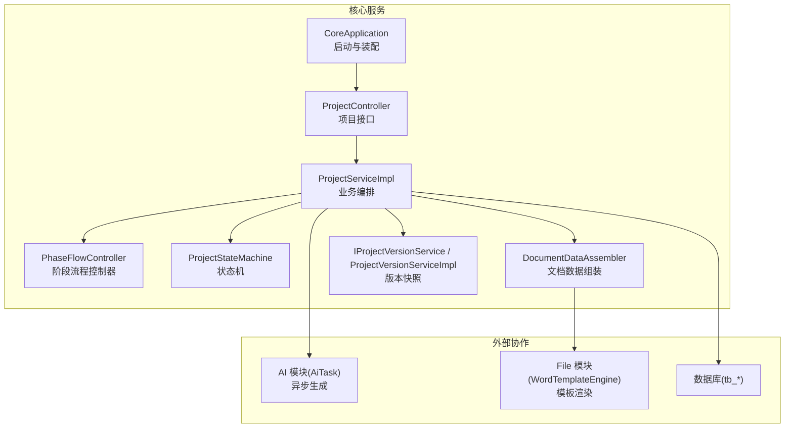
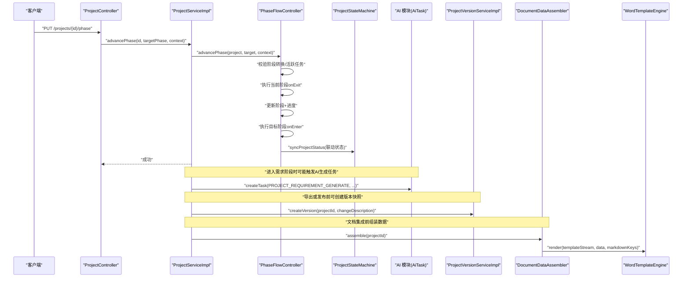
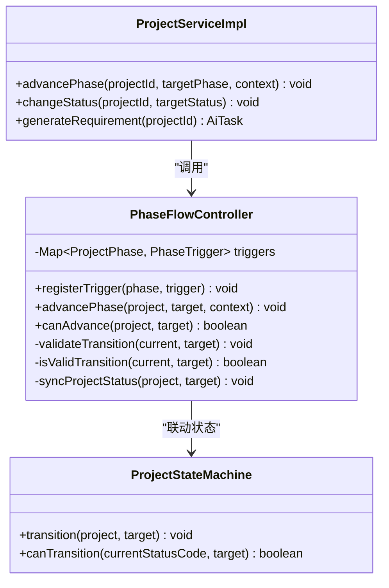
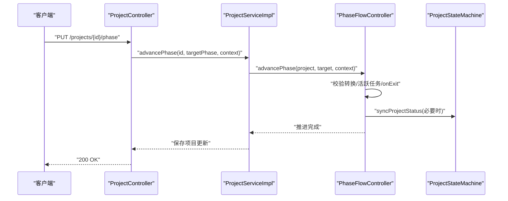
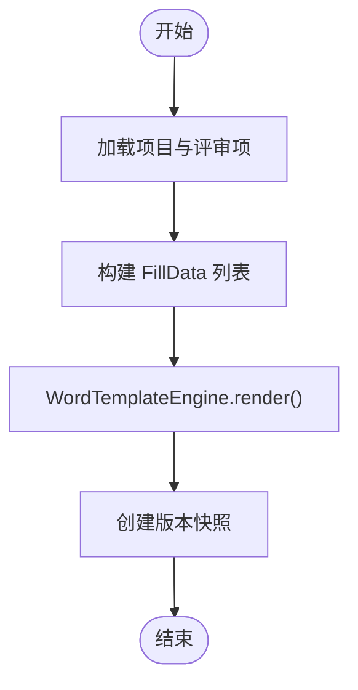
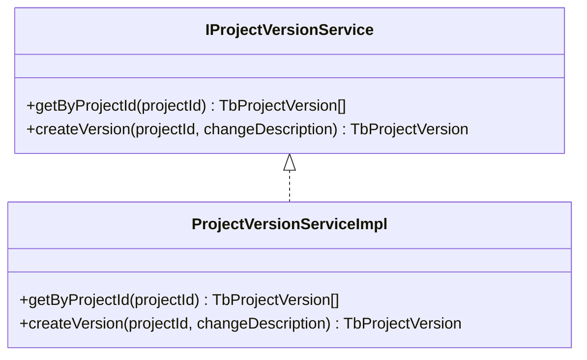
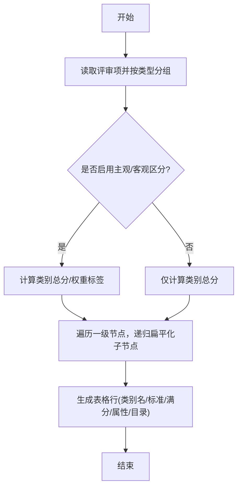
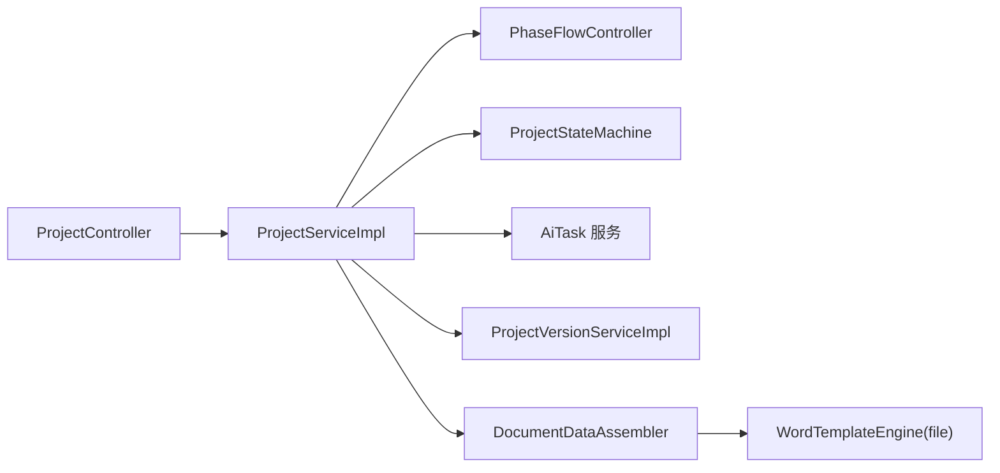

# 核心业务服务 (ele-ai-tender-core)

<cite>
**本文引用的文件**   
- [CORE_MODULE_SPEC.md](file://docs/rules/CORE_MODULE_SPEC.md)
- [PHASE_FLOW_SPEC.md](file://docs/rules/PHASE_FLOW_SPEC.md)
- [CoreApplication.java](file://ele-ai-tender-system/ele-ai-tender-core/src/main/java/com/jy/eleaitender/core/CoreApplication.java)
- [ProjectController.java](file://ele-ai-tender-system/ele-ai-tender-core/src/main/java/com/jy/eleaitender/core/controller/ProjectController.java)
- [ProjectServiceImpl.java](file://ele-ai-tender-system/ele-ai-tender-core/src/main/java/com/jy/eleaitender/core/service/impl/ProjectServiceImpl.java)
- [PhaseFlowController.java](file://ele-ai-tender-system/ele-ai-tender-core/src/main/java/com/jy/eleaitender/core/statemachine/PhaseFlowController.java)
- [ProjectStateMachine.java](file://ele-ai-tender-system/ele-ai-tender-core/src/main/java/com/jy/eleaitender/core/statemachine/ProjectStateMachine.java)
- [DocumentDataAssembler.java](file://ele-ai-tender-system/ele-ai-tender-core/src/main/java/com/jy/eleaitender/core/engine/DocumentDataAssembler.java)
- [WordTemplateEngine.java](file://ele-ai-tender-system/ele-ai-tender-file/src/main/java/com/jy/eleaitender/file/engine/WordTemplateEngine.java)
- [IProjectVersionService.java](file://ele-ai-tender-system/ele-ai-tender-core/src/main/java/com/jy/eleaitender/core/service/IProjectVersionService.java)
- [ProjectVersionServiceImpl.java](file://ele-ai-tender-system/ele-ai-tender-core/src/main/java/com/jy/eleaitender/core/service/impl/ProjectVersionServiceImpl.java)
</cite>

## 目录
1. [简介](#简介)
2. [项目结构](#项目结构)
3. [核心组件](#核心组件)
4. [架构总览](#架构总览)
5. [详细组件分析](#详细组件分析)
6. [依赖关系分析](#依赖关系分析)
7. [性能考虑](#性能考虑)
8. [故障排查指南](#故障排查指南)
9. [结论](#结论)
10. [附录](#附录)

## 简介
本技术文档聚焦于核心业务服务 ele-ai-tender-core，围绕项目管理、文档版本控制、业务流程编排等关键能力展开。重点说明：
- 状态机模式在项目生命周期管理中的应用（阶段推进、触发器机制、事件驱动）
- 文档集成引擎与模板引擎协作流程（数据组装、Word 生成）
- 服务间通信、事务管理与异步任务处理的关键实现
- 性能优化策略与常见问题的排障方法

## 项目结构
核心模块采用分层与领域划分相结合的组织方式：
- 启动与装配：Spring Boot 启动类、Mapper 扫描、调度开关
- 控制器层：对外暴露 /api/v1 接口
- 服务层：业务编排、状态机协调、AI 任务编排
- 状态机：阶段流程控制器 + 项目状态机 + 各阶段触发器
- 引擎层：文档数据组装器、模板渲染（与 file 模块协作）
- 版本控制：项目版本快照服务

图表来源
- [CoreApplication.java:1-24](file://ele-ai-tender-system/ele-ai-tender-core/src/main/java/com/jy/eleaitender/core/CoreApplication.java#L1-L24)
- [ProjectController.java:98-134](file://ele-ai-tender-system/ele-ai-tender-core/src/main/java/com/jy/eleaitender/core/controller/ProjectController.java#L98-L134)
- [ProjectServiceImpl.java:1-340](file://ele-ai-tender-system/ele-ai-tender-core/src/main/java/com/jy/eleaitender/core/service/impl/ProjectServiceImpl.java#L1-L340)
- [PhaseFlowController.java:1-176](file://ele-ai-tender-system/ele-ai-tender-core/src/main/java/com/jy/eleaitender/core/statemachine/PhaseFlowController.java#L1-L176)
- [ProjectStateMachine.java:1-60](file://ele-ai-tender-system/ele-ai-tender-core/src/main/java/com/jy/eleaitender/core/statemachine/ProjectStateMachine.java#L1-L60)
- [DocumentDataAssembler.java:1-267](file://ele-ai-tender-system/ele-ai-tender-core/src/main/java/com/jy/eleaitender/core/engine/DocumentDataAssembler.java#L1-L267)
- [WordTemplateEngine.java:1-121](file://ele-ai-tender-system/ele-ai-tender-file/src/main/java/com/jy/eleaitender/file/engine/WordTemplateEngine.java#L1-L121)
- [IProjectVersionService.java:1-22](file://ele-ai-tender-system/ele-ai-tender-core/src/main/java/com/jy/eleaitender/core/service/IProjectVersionService.java#L1-L22)
- [ProjectVersionServiceImpl.java:38-65](file://ele-ai-tender-system/ele-ai-tender-core/src/main/java/com/jy/eleaitender/core/service/impl/ProjectVersionServiceImpl.java#L38-L65)

章节来源
- [CORE_MODULE_SPEC.md:1-358](file://docs/rules/CORE_MODULE_SPEC.md#L1-L358)
- [PHASE_FLOW_SPEC.md:58-70](file://docs/rules/PHASE_FLOW_SPEC.md#L58-L70)

## 核心组件
- 项目服务：负责项目创建、更新、删除、分页查询、阶段推进、状态变更、需求生成任务提交等
- 阶段流程控制器：注册并执行阶段触发器，校验阶段转换规则，联动项目状态
- 项目状态机：定义合法的状态转换集合，提供转换与合法性检查
- 文档数据组装器：聚合项目基础信息、需求内容、评审项，输出结构化 FillData 供模板渲染
- Word 模板引擎：基于 poi-tl 的模板填充，支持 Markdown 渲染与修订标记清理
- 版本快照服务：按项目维度创建版本快照，记录关键内容变化

章节来源
- [ProjectServiceImpl.java:1-340](file://ele-ai-tender-system/ele-ai-tender-core/src/main/java/com/jy/eleaitender/core/service/impl/ProjectServiceImpl.java#L1-L340)
- [PhaseFlowController.java:1-176](file://ele-ai-tender-system/ele-ai-tender-core/src/main/java/com/jy/eleaitender/core/statemachine/PhaseFlowController.java#L1-L176)
- [ProjectStateMachine.java:1-60](file://ele-ai-tender-system/ele-ai-tender-core/src/main/java/com/jy/eleaitender/core/statemachine/ProjectStateMachine.java#L1-L60)
- [DocumentDataAssembler.java:1-267](file://ele-ai-tender-system/ele-ai-tender-core/src/main/java/com/jy/eleaitender/core/engine/DocumentDataAssembler.java#L1-L267)
- [WordTemplateEngine.java:1-121](file://ele-ai-tender-system/ele-ai-tender-file/src/main/java/com/jy/eleaitender/file/engine/WordTemplateEngine.java#L1-L121)
- [IProjectVersionService.java:1-22](file://ele-ai-tender-system/ele-ai-tender-core/src/main/java/com/jy/eleaitender/core/service/IProjectVersionService.java#L1-L22)
- [ProjectVersionServiceImpl.java:38-65](file://ele-ai-tender-system/ele-ai-tender-core/src/main/java/com/jy/eleaitender/core/service/impl/ProjectVersionServiceImpl.java#L38-L65)

## 架构总览
核心服务通过控制器接收请求，交由服务层进行业务编排；阶段推进由状态机与触发器协同完成；文档生成由数据组装器与模板引擎协作；AI 任务以异步方式解耦到 AI 模块；版本快照在关键节点持久化。

图表来源
- [ProjectController.java:112-118](file://ele-ai-tender-system/ele-ai-tender-core/src/main/java/com/jy/eleaitender/core/controller/ProjectController.java#L112-L118)
- [ProjectServiceImpl.java:232-239](file://ele-ai-tender-system/ele-ai-tender-core/src/main/java/com/jy/eleaitender/core/service/impl/ProjectServiceImpl.java#L232-L239)
- [PhaseFlowController.java:57-96](file://ele-ai-tender-system/ele-ai-tender-core/src/main/java/com/jy/eleaitender/core/statemachine/PhaseFlowController.java#L57-L96)
- [ProjectStateMachine.java:37-45](file://ele-ai-tender-system/ele-ai-tender-core/src/main/java/com/jy/eleaitender/core/statemachine/ProjectStateMachine.java#L37-L45)
- [ProjectVersionServiceImpl.java:48-65](file://ele-ai-tender-system/ele-ai-tender-core/src/main/java/com/jy/eleaitender/core/service/impl/ProjectVersionServiceImpl.java#L48-L65)
- [DocumentDataAssembler.java:47-99](file://ele-ai-tender-system/ele-ai-tender-core/src/main/java/com/jy/eleaitender/core/engine/DocumentDataAssembler.java#L47-L99)
- [WordTemplateEngine.java:42-63](file://ele-ai-tender-system/ele-ai-tender-file/src/main/java/com/jy/eleaitender/file/engine/WordTemplateEngine.java#L42-L63)

## 详细组件分析

### 项目状态机与阶段流程
- 状态机定义合法的状态转换集合，禁止非法跳转
- 阶段流程控制器维护阶段触发器映射，顺序推进阶段，并在进入/离开阶段时执行钩子逻辑
- 阶段与状态联动：进入编制阶段→IN_PROGRESS，进入检测阶段→DETECTING（中间经 PENDING_DETECTION）

图表来源
- [ProjectStateMachine.java:19-45](file://ele-ai-tender-system/ele-ai-tender-core/src/main/java/com/jy/eleaitender/core/statemachine/ProjectStateMachine.java#L19-L45)
- [PhaseFlowController.java:24-96](file://ele-ai-tender-system/ele-ai-tender-core/src/main/java/com/jy/eleaitender/core/statemachine/PhaseFlowController.java#L24-L96)
- [ProjectServiceImpl.java:232-278](file://ele-ai-tender-system/ele-ai-tender-core/src/main/java/com/jy/eleaitender/core/service/impl/ProjectServiceImpl.java#L232-L278)

章节来源
- [ProjectStateMachine.java:1-60](file://ele-ai-tender-system/ele-ai-tender-core/src/main/java/com/jy/eleaitender/core/statemachine/ProjectStateMachine.java#L1-L60)
- [PhaseFlowController.java:1-176](file://ele-ai-tender-system/ele-ai-tender-core/src/main/java/com/jy/eleaitender/core/statemachine/PhaseFlowController.java#L1-L176)
- [ProjectServiceImpl.java:1-340](file://ele-ai-tender-system/ele-ai-tender-core/src/main/java/com/jy/eleaitender/core/service/impl/ProjectServiceImpl.java#L1-L340)
- [PHASE_FLOW_SPEC.md:58-70](file://docs/rules/PHASE_FLOW_SPEC.md#L58-L70)

### 项目生命周期与阶段推进时序
- 控制器接收阶段推进请求
- 服务层加载项目实体，委托阶段流程控制器执行推进
- 控制器返回结果给前端

图表来源
- [ProjectController.java:112-118](file://ele-ai-tender-system/ele-ai-tender-core/src/main/java/com/jy/eleaitender/core/controller/ProjectController.java#L112-L118)
- [ProjectServiceImpl.java:232-239](file://ele-ai-tender-system/ele-ai-tender-core/src/main/java/com/jy/eleaitender/core/service/impl/ProjectServiceImpl.java#L232-L239)
- [PhaseFlowController.java:57-96](file://ele-ai-tender-system/ele-ai-tender-core/src/main/java/com/jy/eleaitender/core/statemachine/PhaseFlowController.java#L57-L96)
- [ProjectStateMachine.java:37-45](file://ele-ai-tender-system/ele-ai-tender-core/src/main/java/com/jy/eleaitender/core/statemachine/ProjectStateMachine.java#L37-L45)

### 文档集成与模板渲染流程
- 数据组装器从项目、评审项、模板配置中收集数据，构建 FillData 列表
- 模板引擎使用 poi-tl 渲染文本、图片与 Markdown，表格由 TableGenerator 处理
- 生成完成后固化版本快照

图表来源
- [DocumentDataAssembler.java:47-99](file://ele-ai-tender-system/ele-ai-tender-core/src/main/java/com/jy/eleaitender/core/engine/DocumentDataAssembler.java#L47-L99)
- [WordTemplateEngine.java:42-63](file://ele-ai-tender-system/ele-ai-tender-file/src/main/java/com/jy/eleaitender/file/engine/WordTemplateEngine.java#L42-L63)
- [ProjectVersionServiceImpl.java:48-65](file://ele-ai-tender-system/ele-ai-tender-core/src/main/java/com/jy/eleaitender/core/service/impl/ProjectVersionServiceImpl.java#L48-L65)

### 项目版本控制
- 版本快照服务根据项目 ID 获取历史版本
- 创建版本时序列化关键内容快照（如生成的文件ID、状态），递增版本号并持久化

图表来源
- [IProjectVersionService.java:1-22](file://ele-ai-tender-system/ele-ai-tender-core/src/main/java/com/jy/eleaitender/core/service/IProjectVersionService.java#L1-L22)
- [ProjectVersionServiceImpl.java:38-65](file://ele-ai-tender-system/ele-ai-tender-core/src/main/java/com/jy/eleaitender/core/service/impl/ProjectVersionServiceImpl.java#L38-L65)

章节来源
- [IProjectVersionService.java:1-22](file://ele-ai-tender-system/ele-ai-tender-core/src/main/java/com/jy/eleaitender/core/service/IProjectVersionService.java#L1-L22)
- [ProjectVersionServiceImpl.java:38-65](file://ele-ai-tender-system/ele-ai-tender-core/src/main/java/com/jy/eleaitender/core/service/impl/ProjectVersionServiceImpl.java#L38-L65)

### 复杂逻辑流程图：评审项汇总表格构建
- 按评审类型分组（资信标、技术标、商务标）
- 计算类别总分与权重标签
- 扁平化叶子节点，生成表格行数据

图表来源
- [DocumentDataAssembler.java:170-214](file://ele-ai-tender-system/ele-ai-tender-core/src/main/java/com/jy/eleaitender/core/engine/DocumentDataAssembler.java#L170-L214)
- [DocumentDataAssembler.java:216-236](file://ele-ai-tender-system/ele-ai-tender-core/src/main/java/com/jy/eleaitender/core/engine/DocumentDataAssembler.java#L216-L236)

章节来源
- [DocumentDataAssembler.java:1-267](file://ele-ai-tender-system/ele-ai-tender-core/src/main/java/com/jy/eleaitender/core/engine/DocumentDataAssembler.java#L1-L267)

## 依赖关系分析
- 控制器依赖服务层，服务层依赖状态机与触发器、AI 任务服务、版本服务、数据组装器
- 数据组装器依赖评审项 Mapper 与项目模板服务
- 模板引擎位于 file 模块，core 模块通过数据组装器与其协作

图表来源
- [ProjectController.java:98-134](file://ele-ai-tender-system/ele-ai-tender-core/src/main/java/com/jy/eleaitender/core/controller/ProjectController.java#L98-L134)
- [ProjectServiceImpl.java:1-340](file://ele-ai-tender-system/ele-ai-tender-core/src/main/java/com/jy/eleaitender/core/service/impl/ProjectServiceImpl.java#L1-L340)
- [PhaseFlowController.java:1-176](file://ele-ai-tender-system/ele-ai-tender-core/src/main/java/com/jy/eleaitender/core/statemachine/PhaseFlowController.java#L1-L176)
- [ProjectStateMachine.java:1-60](file://ele-ai-tender-system/ele-ai-tender-core/src/main/java/com/jy/eleaitender/core/statemachine/ProjectStateMachine.java#L1-L60)
- [DocumentDataAssembler.java:1-267](file://ele-ai-tender-system/ele-ai-tender-core/src/main/java/com/jy/eleaitender/core/engine/DocumentDataAssembler.java#L1-L267)
- [WordTemplateEngine.java:1-121](file://ele-ai-tender-system/ele-ai-tender-file/src/main/java/com/jy/eleaitender/file/engine/WordTemplateEngine.java#L1-L121)

章节来源
- [CORE_MODULE_SPEC.md:1-358](file://docs/rules/CORE_MODULE_SPEC.md#L1-L358)

## 性能考虑
- 阶段推进前检查活跃 AI 任务，避免并发冲突与资源争用
- 文档渲染前清理修订标记，减少 poi-tl 重构时的异常与回退开销
- 评审项汇总采用流式分组与扁平化遍历，降低内存占用
- 版本快照仅在关键节点创建，避免频繁写入
- 建议对大文档渲染与 AI 任务执行采用异步与限流策略（参考 AI 模块线程池配置）

[本节为通用指导，不直接分析具体文件]

## 故障排查指南
- 项目状态异常：检查 tb_project.status 与状态机转换规则，确认是否允许该转换
- 阶段推进失败：查看阶段流程日志，确认是否存在活跃 AI 任务或当前阶段未完成
- 需求阶段内容为空：核对 tb_project.requirement_id 是否为空；若为空，检查对应 AI 任务状态
- AI 生成失败：检查模型配置与 Token 用量上限，关注任务终态与结果同步标志
- 评审项结构错误：检查 parent_id 与 level 层级关系是否符合三级结构约束
- 检测相关问题：参考检测全链路规范定位问题

章节来源
- [CORE_MODULE_SPEC.md:342-350](file://docs/rules/CORE_MODULE_SPEC.md#L342-L350)

## 结论
核心业务服务通过清晰的分层与状态机模式，实现了项目生命周期的强一致流转与可扩展的阶段触发机制。文档集成与模板渲染在 core 与 file 模块之间解耦协作，结合版本快照保障可追溯性。配合 AI 任务的异步编排与完善的排障指引，系统具备高可用与易维护的特性。

[本节为总结性内容，不直接分析具体文件]

## 附录
- 接口清单与表结构详见核心模块规范文档
- 阶段流程控制器与触发器职责详见阶段流程规范

章节来源
- [CORE_MODULE_SPEC.md:1-358](file://docs/rules/CORE_MODULE_SPEC.md#L1-L358)
- [PHASE_FLOW_SPEC.md:58-70](file://docs/rules/PHASE_FLOW_SPEC.md#L58-L70)