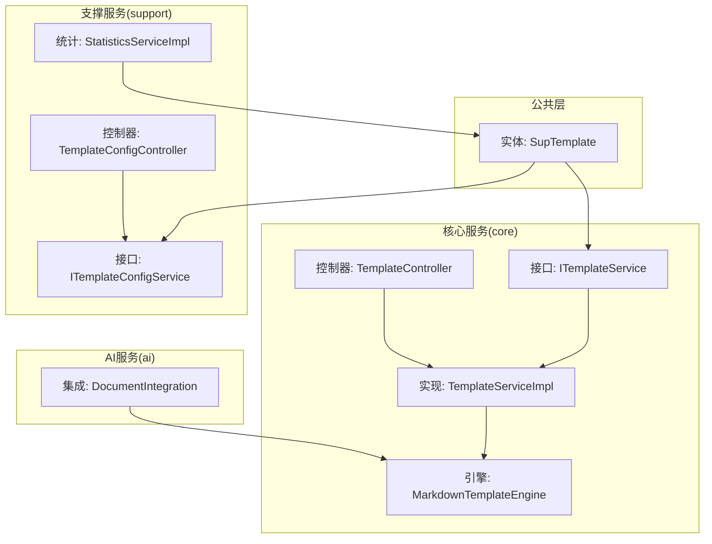
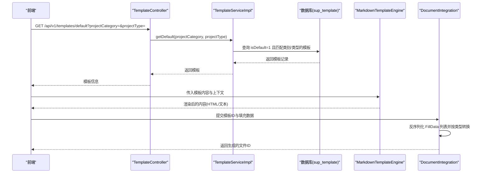
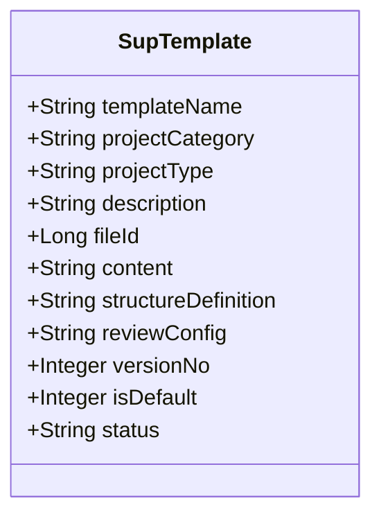
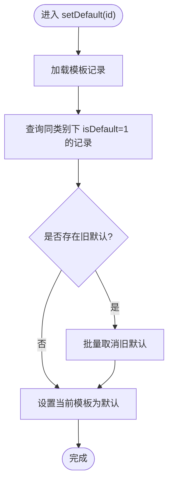
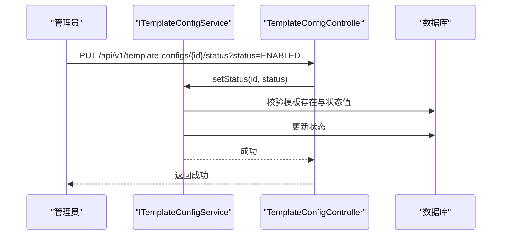
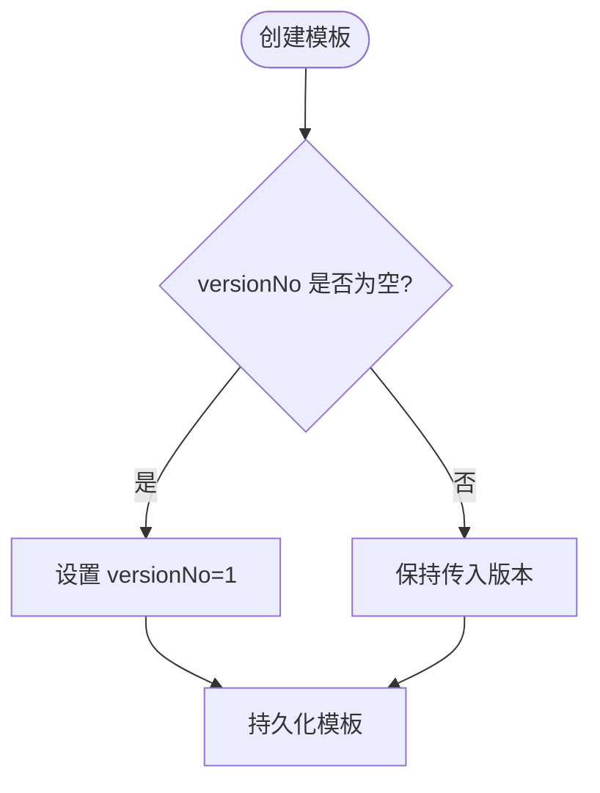
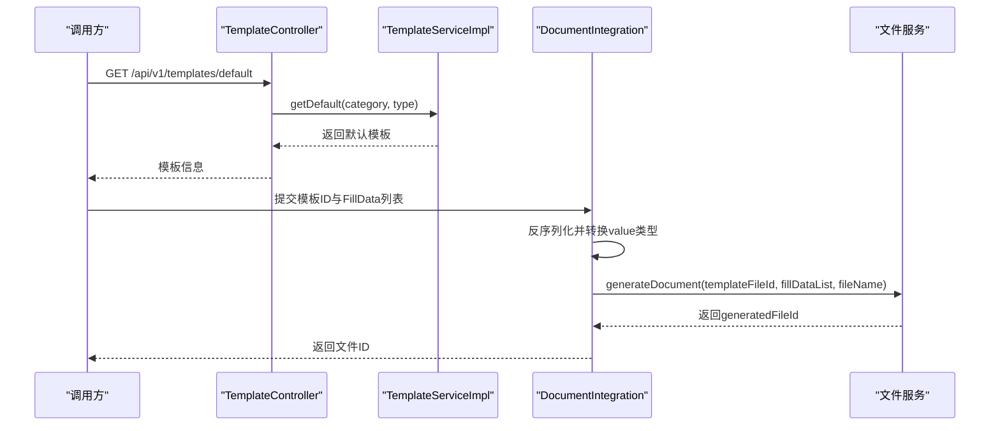
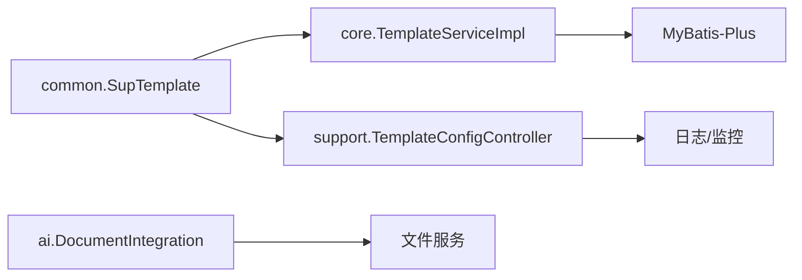

# 模板管理模块

<cite>
**本文引用的文件**
- [SupTemplate.java](file://ele-ai-tender-system/ele-ai-tender-common/src/main/java/com/jy/eleaitender/common/entity/support/SupTemplate.java)
- [ITemplateService.java](file://ele-ai-tender-system/ele-ai-tender-core/src/main/java/com/jy/eleaitender/core/service/ITemplateService.java)
- [TemplateServiceImpl.java](file://ele-ai-tender-system/ele-ai-tender-core/src/main/java/com/jy/eleaitender/core/service/impl/TemplateServiceImpl.java)
- [TemplateController.java](file://ele-ai-tender-system/ele-ai-tender-core/src/main/java/com/jy/eleaitender/core/controller/TemplateController.java)
- [ITemplateConfigService.java](file://ele-ai-tender-system/ele-ai-tender-support/src/main/java/com/jy/eleaitender/support/service/ITemplateConfigService.java)
- [TemplateConfigController.java](file://ele-ai-tender-system/ele-ai-tender-support/src/main/java/com/jy/eleaitender/support/controller/TemplateConfigController.java)
- [StatisticsServiceImpl.java](file://ele-ai-tender-system/ele-ai-tender-support/src/main/java/com/jy/eleaitender/support/service/impl/StatisticsServiceImpl.java)
- [MarkdownTemplateEngine.java](file://ele-ai-tender-system/ele-ai-tender-core/src/main/java/com/jy/eleaitender/core/engine/MarkdownTemplateEngine.java)
- [DocumentIntegration.java](file://ele-ai-tender-system/ele-ai-tender-ai/src/main/java/com/jy/eleaitender/ai/processor/generator/DocumentIntegration.java)
- [SUPPORT_SYSTEM_SPEC.md](file://docs/rules/SUPPORT_SYSTEM_SPEC.md)
</cite>

## 目录
1. [简介](#简介)
2. [项目结构](#项目结构)
3. [核心组件](#核心组件)
4. [架构总览](#架构总览)
5. [详细组件分析](#详细组件分析)
6. [依赖分析](#依赖分析)
7. [性能考虑](#性能考虑)
8. [故障排查指南](#故障排查指南)
9. [结论](#结论)
10. [附录](#附录)

## 简介
本技术文档聚焦于“模板管理模块”，围绕模板实体数据结构、CRUD 操作、版本与默认模板机制、模板应用与实例化流程，以及权限控制、使用统计与性能监控等管理功能进行系统化说明。文档面向不同技术背景的读者，提供从高层架构到代码级实现的渐进式解读，并辅以图示帮助理解。

## 项目结构
模板管理相关能力分布在多个子模块中：
- 公共实体定义位于 common 模块，供 core 与 support 共同复用
- core 模块提供业务服务与对外 API（侧重运行时使用）
- support 模块提供配置与管理侧 API（侧重运维与后台管理）
- AI 模块在文档生成阶段消费模板与填充数据
- 规则文档对支持端模板管理接口进行了约定

图表来源
- [SupTemplate.java:1-52](file://ele-ai-tender-system/ele-ai-tender-common/src/main/java/com/jy/eleaitender/common/entity/support/SupTemplate.java#L1-L52)
- [ITemplateService.java:1-48](file://ele-ai-tender-system/ele-ai-tender-core/src/main/java/com/jy/eleaitender/core/service/ITemplateService.java#L1-L48)
- [TemplateServiceImpl.java:1-125](file://ele-ai-tender-system/ele-ai-tender-core/src/main/java/com/jy/eleaitender/core/service/impl/TemplateServiceImpl.java#L1-L125)
- [TemplateController.java:1-52](file://ele-ai-tender-system/ele-ai-tender-core/src/main/java/com/jy/eleaitender/core/controller/TemplateController.java#L1-L52)
- [ITemplateConfigService.java:1-16](file://ele-ai-tender-system/ele-ai-tender-support/src/main/java/com/jy/eleaitender/support/service/ITemplateConfigService.java#L1-L16)
- [TemplateConfigController.java:1-81](file://ele-ai-tender-system/ele-ai-tender-support/src/main/java/com/jy/eleaitender/support/controller/TemplateConfigController.java#L1-L81)
- [StatisticsServiceImpl.java:76-104](file://ele-ai-tender-system/ele-ai-tender-support/src/main/java/com/jy/eleaitender/support/service/impl/StatisticsServiceImpl.java#L76-L104)
- [MarkdownTemplateEngine.java:44-81](file://ele-ai-tender-system/ele-ai-tender-core/src/main/java/com/jy/eleaitender/core/engine/MarkdownTemplateEngine.java#L44-L81)
- [DocumentIntegration.java:66-92](file://ele-ai-tender-system/ele-ai-tender-ai/src/main/java/com/jy/eleaitender/ai/processor/generator/DocumentIntegration.java#L66-L92)

章节来源
- [SUPPORT_SYSTEM_SPEC.md:60-70](file://docs/rules/SUPPORT_SYSTEM_SPEC.md#L60-L70)

## 核心组件
- 模板实体 SupTemplate：承载模板名称、适用类别/类型、描述、内容、Word 结构定义、评审项配置、版本号、是否默认、状态等字段，并继承基础实体以具备通用审计字段
- 核心服务 ITemplateService/TemplateServiceImpl：提供分页查询、详情获取、默认模板选择、创建、更新、批量删除、设为默认等能力
- 支撑服务 ITemplateConfigService/TemplateConfigController：提供管理侧的增删改查、状态切换、设为默认等接口
- 模板渲染 MarkdownTemplateEngine：基于占位符替换与 Markdown→HTML 转换，用于文本类模板渲染
- 文档集成 DocumentIntegration：将模板与填充数据结合，调用文件服务生成最终文档
- 统计概览 StatisticsServiceImpl：汇总模板数量等指标，为运营看板提供数据

章节来源
- [SupTemplate.java:1-52](file://ele-ai-tender-system/ele-ai-tender-common/src/main/java/com/jy/eleaitender/common/entity/support/SupTemplate.java#L1-L52)
- [ITemplateService.java:1-48](file://ele-ai-tender-system/ele-ai-tender-core/src/main/java/com/jy/eleaitender/core/service/ITemplateService.java#L1-L48)
- [TemplateServiceImpl.java:1-125](file://ele-ai-tender-system/ele-ai-tender-core/src/main/java/com/jy/eleaitender/core/service/impl/TemplateServiceImpl.java#L1-L125)
- [ITemplateConfigService.java:1-16](file://ele-ai-tender-system/ele-ai-tender-support/src/main/java/com/jy/eleaitender/support/service/ITemplateConfigService.java#L1-L16)
- [TemplateConfigController.java:1-81](file://ele-ai-tender-system/ele-ai-tender-support/src/main/java/com/jy/eleaitender/support/controller/TemplateConfigController.java#L1-L81)
- [MarkdownTemplateEngine.java:44-81](file://ele-ai-tender-system/ele-ai-tender-core/src/main/java/com/jy/eleaitender/core/engine/MarkdownTemplateEngine.java#L44-L81)
- [DocumentIntegration.java:66-92](file://ele-ai-tender-system/ele-ai-tender-ai/src/main/java/com/jy/eleaitender/ai/processor/generator/DocumentIntegration.java#L66-L92)
- [StatisticsServiceImpl.java:76-104](file://ele-ai-tender-system/ele-ai-tender-support/src/main/java/com/jy/eleaitender/support/service/impl/StatisticsServiceImpl.java#L76-L104)

## 架构总览
模板管理采用分层设计：
- 表现层：core 与 support 两个 Controller 分别暴露运行期与管理期接口
- 服务层：ITemplateService 与 ITemplateConfigService 封装业务逻辑
- 数据层：通过 MyBatis-Plus 访问 sup_template 表
- 渲染与生成：MarkdownTemplateEngine 负责文本渲染；DocumentIntegration 负责与文件服务协作生成 Word

图表来源
- [TemplateController.java:43-50](file://ele-ai-tender-system/ele-ai-tender-core/src/main/java/com/jy/eleaitender/core/controller/TemplateController.java#L43-L50)
- [TemplateServiceImpl.java:52-61](file://ele-ai-tender-system/ele-ai-tender-core/src/main/java/com/jy/eleaitender/core/service/impl/TemplateServiceImpl.java#L52-L61)
- [MarkdownTemplateEngine.java:44-81](file://ele-ai-tender-system/ele-ai-tender-core/src/main/java/com/jy/eleaitender/core/engine/MarkdownTemplateEngine.java#L44-L81)
- [DocumentIntegration.java:66-92](file://ele-ai-tender-system/ele-ai-tender-ai/src/main/java/com/jy/eleaitender/ai/processor/generator/DocumentIntegration.java#L66-L92)

## 详细组件分析

### 模板实体数据结构
- 模板名称、适用项目类别/类型、描述：用于分类检索与展示
- 模板文件ID：关联文件服务中的模板源文件
- 模板用途说明 content：文本型模板内容
- Word 章节结构 structureDefinition：JSON 描述 Word 文档结构
- 评审项配置 reviewConfig：JSON 描述评审项相关配置
- 版本号 versionNo：用于版本演进与回滚定位
- 是否默认 isDefault：标记某类别下的默认模板
- 状态 status：启用/禁用等生命周期控制

图表来源
- [SupTemplate.java:1-52](file://ele-ai-tender-system/ele-ai-tender-common/src/main/java/com/jy/eleaitender/common/entity/support/SupTemplate.java#L1-L52)

章节来源
- [SupTemplate.java:1-52](file://ele-ai-tender-system/ele-ai-tender-common/src/main/java/com/jy/eleaitender/common/entity/support/SupTemplate.java#L1-L52)

### CRUD 操作实现
- 分页查询：支持按模板名称、项目类别、项目类型筛选，按创建时间倒序
- 详情获取：根据 ID 获取模板，不存在时抛出业务异常
- 创建：未设置默认标志则置为非默认；未设置版本号则置为 1；未设置状态则置为启用
- 更新：先校验存在性再执行更新
- 批量删除：参数校验后逐条删除
- 设为默认：在同一项目类别下清除其他默认模板，再将目标模板设为默认

图表来源
- [TemplateServiceImpl.java:100-123](file://ele-ai-tender-system/ele-ai-tender-core/src/main/java/com/jy/eleaitender/core/service/impl/TemplateServiceImpl.java#L100-L123)

章节来源
- [ITemplateService.java:13-46](file://ele-ai-tender-system/ele-ai-tender-core/src/main/java/com/jy/eleaitender/core/service/ITemplateService.java#L13-L46)
- [TemplateServiceImpl.java:26-123](file://ele-ai-tender-system/ele-ai-tender-core/src/main/java/com/jy/eleaitender/core/service/impl/TemplateServiceImpl.java#L26-L123)

### 管理端模板配置接口
- 分页查询：支持模板名称、项目类别、项目类型、状态过滤
- 详情/创建/更新/删除：标准 CRUD
- 设为默认：管理端入口
- 设置状态：仅允许启用/禁用两种值，非法值会触发参数错误

图表来源
- [TemplateConfigController.java:73-79](file://ele-ai-tender-system/ele-ai-tender-support/src/main/java/com/jy/eleaitender/support/controller/TemplateConfigController.java#L73-L79)
- [ITemplateConfigService.java:14](file://ele-ai-tender-system/ele-ai-tender-support/src/main/java/com/jy/eleaitender/support/service/ITemplateConfigService.java#L14-L14)

章节来源
- [TemplateConfigController.java:21-80](file://ele-ai-tender-system/ele-ai-tender-support/src/main/java/com/jy/eleaitender/support/controller/TemplateConfigController.java#L21-L80)
- [ITemplateConfigService.java:1-16](file://ele-ai-tender-system/ele-ai-tender-support/src/main/java/com/jy/eleaitender/support/service/ITemplateConfigService.java#L1-L16)
- [SUPPORT_SYSTEM_SPEC.md:60-70](file://docs/rules/SUPPORT_SYSTEM_SPEC.md#L60-L70)

### 模板版本管理机制
- 版本字段：实体包含 versionNo，用于标识模板版本
- 默认版本策略：创建时若未指定版本号，默认置为 1
- 现状说明：当前实现未提供显式的版本历史表或差异对比、回滚恢复接口；如需完善，可在现有基础上扩展版本快照与比较工具

图表来源
- [TemplateServiceImpl.java:64-78](file://ele-ai-tender-system/ele-ai-tender-core/src/main/java/com/jy/eleaitender/core/service/impl/TemplateServiceImpl.java#L64-L78)
- [SupTemplate.java:43-44](file://ele-ai-tender-system/ele-ai-tender-common/src/main/java/com/jy/eleaitender/common/entity/support/SupTemplate.java#L43-L44)

章节来源
- [TemplateServiceImpl.java:64-78](file://ele-ai-tender-system/ele-ai-tender-core/src/main/java/com/jy/eleaitender/core/service/impl/TemplateServiceImpl.java#L64-L78)
- [SupTemplate.java:43-44](file://ele-ai-tender-system/ele-ai-tender-common/src/main/java/com/jy/eleaitender/common/entity/support/SupTemplate.java#L43-L44)

### 模板应用与实例化流程
- 模板选择：通过默认模板接口按项目类别/类型获取默认模板
- 参数填充：AI 集成层将填充数据反序列化为强类型对象，并按类型转换 value
- 文档生成：调用文件服务生成 Word 文档，返回文件 ID
- 文本渲染：Markdown 引擎支持占位符替换与 Markdown→HTML 转换

图表来源
- [TemplateController.java:43-50](file://ele-ai-tender-system/ele-ai-tender-core/src/main/java/com/jy/eleaitender/core/controller/TemplateController.java#L43-L50)
- [TemplateServiceImpl.java:52-61](file://ele-ai-tender-system/ele-ai-tender-core/src/main/java/com/jy/eleaitender/core/service/impl/TemplateServiceImpl.java#L52-L61)
- [DocumentIntegration.java:66-92](file://ele-ai-tender-system/ele-ai-tender-ai/src/main/java/com/jy/eleaitender/ai/processor/generator/DocumentIntegration.java#L66-L92)

章节来源
- [TemplateController.java:36-50](file://ele-ai-tender-system/ele-ai-tender-core/src/main/java/com/jy/eleaitender/core/controller/TemplateController.java#L36-L50)
- [TemplateServiceImpl.java:52-61](file://ele-ai-tender-system/ele-ai-tender-core/src/main/java/com/jy/eleaitender/core/service/impl/TemplateServiceImpl.java#L52-L61)
- [DocumentIntegration.java:66-92](file://ele-ai-tender-system/ele-ai-tender-ai/src/main/java/com/jy/eleaitender/ai/processor/generator/DocumentIntegration.java#L66-L92)
- [MarkdownTemplateEngine.java:44-81](file://ele-ai-tender-system/ele-ai-tender-core/src/main/java/com/jy/eleaitender/core/engine/MarkdownTemplateEngine.java#L44-L81)

### 权限控制与状态管理
- 登录鉴权：核心与管理端接口均标注登录要求，确保受保护访问
- 状态控制：管理端提供设置状态接口，仅接受启用/禁用两种值，非法值将触发参数错误
- 默认模板：同一项目类别下仅能有一个默认模板，设置时会先清除旧默认

章节来源
- [TemplateController.java:24-50](file://ele-ai-tender-system/ele-ai-tender-core/src/main/java/com/jy/eleaitender/core/controller/TemplateController.java#L24-L50)
- [TemplateConfigController.java:41-79](file://ele-ai-tender-system/ele-ai-tender-support/src/main/java/com/jy/eleaitender/support/controller/TemplateConfigController.java#L41-L79)
- [TemplateServiceImpl.java:100-123](file://ele-ai-tender-system/ele-ai-tender-core/src/main/java/com/jy/eleaitender/core/service/impl/TemplateServiceImpl.java#L100-L123)

### 使用统计与性能监控
- 统计概览：支撑服务统计模板总数等关键指标，便于运营看板展示
- 日志与监控：系统已集成访问日志与操作日志能力，可结合日志平台进行性能与问题追踪

章节来源
- [StatisticsServiceImpl.java:76-104](file://ele-ai-tender-system/ele-ai-tender-support/src/main/java/com/jy/eleaitender/support/service/impl/StatisticsServiceImpl.java#L76-L104)

## 依赖分析
- 模块耦合
  - core 与 support 共享 common 中的 SupTemplate 实体，降低重复定义
  - core 服务依赖 MyBatis-Plus 进行分页与条件查询
  - AI 模块依赖 core 提供的模板信息与填充数据，并通过文件服务生成文档
- 外部依赖
  - 文件服务：用于模板源文件存储与文档生成
  - 日志与监控：支撑系统的访问日志与操作日志能力

图表来源
- [SupTemplate.java:1-52](file://ele-ai-tender-system/ele-ai-tender-common/src/main/java/com/jy/eleaitender/common/entity/support/SupTemplate.java#L1-L52)
- [TemplateServiceImpl.java:1-125](file://ele-ai-tender-system/ele-ai-tender-core/src/main/java/com/jy/eleaitender/core/service/impl/TemplateServiceImpl.java#L1-L125)
- [TemplateConfigController.java:1-81](file://ele-ai-tender-system/ele-ai-tender-support/src/main/java/com/jy/eleaitender/support/controller/TemplateConfigController.java#L1-L81)
- [DocumentIntegration.java:66-92](file://ele-ai-tender-system/ele-ai-tender-ai/src/main/java/com/jy/eleaitender/ai/processor/generator/DocumentIntegration.java#L66-L92)

章节来源
- [TemplateServiceImpl.java:1-125](file://ele-ai-tender-system/ele-ai-tender-core/src/main/java/com/jy/eleaitender/core/service/impl/TemplateServiceImpl.java#L1-L125)
- [TemplateConfigController.java:1-81](file://ele-ai-tender-system/ele-ai-tender-support/src/main/java/com/jy/eleaitender/support/controller/TemplateConfigController.java#L1-L81)
- [DocumentIntegration.java:66-92](file://ele-ai-tender-system/ele-ai-tender-ai/src/main/java/com/jy/eleaitender/ai/processor/generator/DocumentIntegration.java#L66-L92)

## 性能考虑
- 分页与索引：分页查询建议针对模板名称、项目类别、项目类型建立合适索引，避免全表扫描
- 默认模板查询：isDefault 与项目类别组合查询频繁，建议联合索引优化
- 大对象处理：structureDefinition 与 reviewConfig 为 JSON 字符串，注意读写体积与序列化开销
- 渲染与生成：Markdown 渲染与 Word 生成属于 CPU/IO 密集型操作，建议异步化与限流保护

[本节为通用指导，不直接分析具体文件]

## 故障排查指南
- 模板不存在：详情查询时若模板不存在，会抛出业务异常，需检查 ID 是否正确
- 参数错误：设置状态时若传入非启用/禁用值，将触发参数错误，需校验入参
- 默认模板冲突：设为默认前会清除同类别下的旧默认，确认业务预期是否符合
- 填充数据反序列化：AI 集成层会对 FillData 的 value 按 type 转换，若类型不匹配可能导致转换失败，需检查填充数据格式

章节来源
- [TemplateServiceImpl.java:42-49](file://ele-ai-tender-system/ele-ai-tender-core/src/main/java/com/jy/eleaitender/core/service/impl/TemplateServiceImpl.java#L42-L49)
- [TemplateConfigController.java:73-79](file://ele-ai-tender-system/ele-ai-tender-support/src/main/java/com/jy/eleaitender/support/controller/TemplateConfigController.java#L73-L79)
- [TemplateServiceImpl.java:100-123](file://ele-ai-tender-system/ele-ai-tender-core/src/main/java/com/jy/eleaitender/core/service/impl/TemplateServiceImpl.java#L100-L123)
- [DocumentIntegration.java:81-92](file://ele-ai-tender-system/ele-ai-tender-ai/src/main/java/com/jy/eleaitender/ai/processor/generator/DocumentIntegration.java#L81-L92)

## 结论
模板管理模块以清晰的实体模型与服务分层为基础，提供了完整的 CRUD、默认模板管理与状态控制能力，并在 AI 文档生成链路中发挥关键作用。当前版本已满足基本业务需求，后续可在版本历史、差异对比与回滚方面进一步扩展，以提升可维护性与可追溯性。

[本节为总结性内容，不直接分析具体文件]

## 附录
- 管理端模板接口规范参考：见支撑系统规范文档中模板管理章节

章节来源
- [SUPPORT_SYSTEM_SPEC.md:60-70](file://docs/rules/SUPPORT_SYSTEM_SPEC.md#L60-L70)