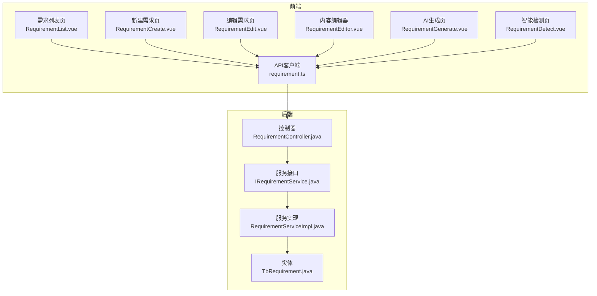
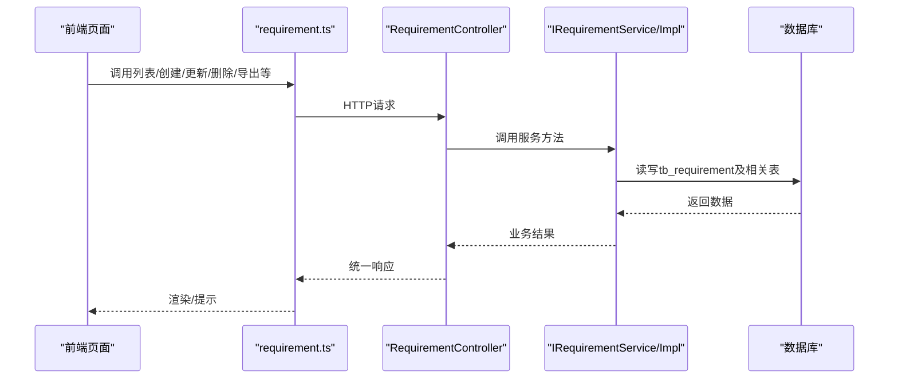
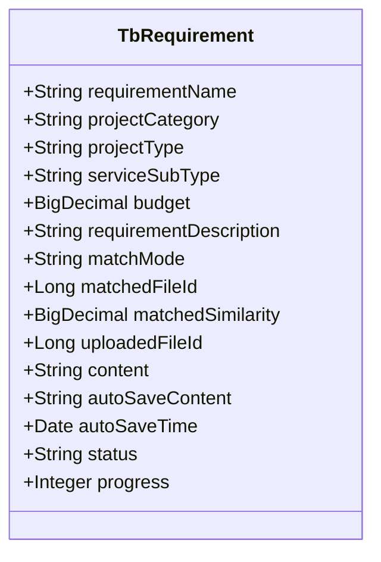
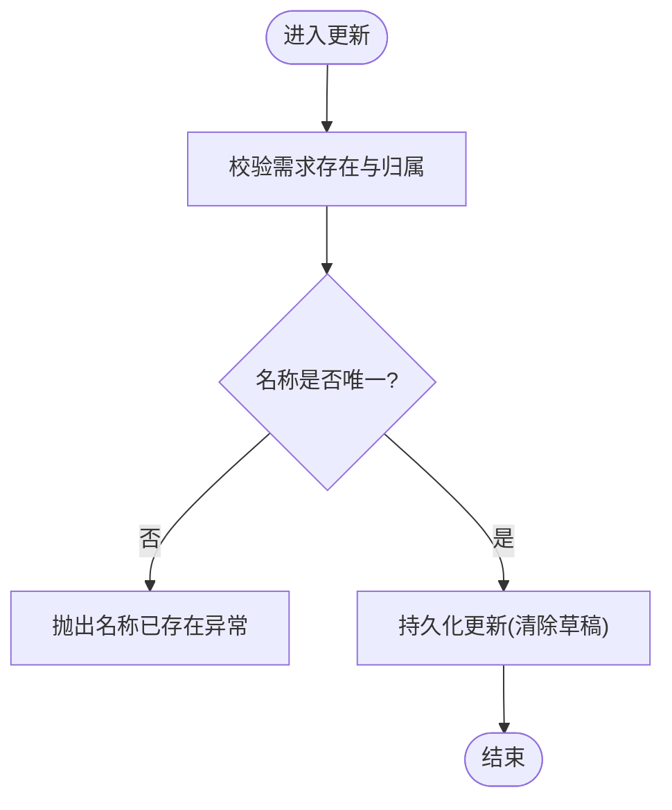
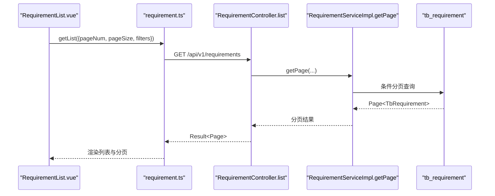
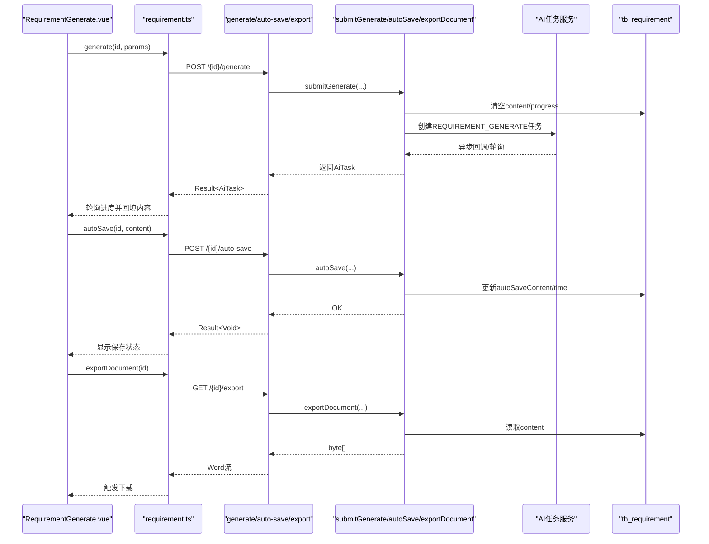
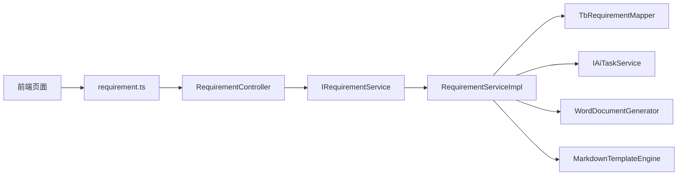

# 需求管理模块

<cite>
**本文引用的文件**   
- [TbRequirement.java](file://ele-ai-tender-system/ele-ai-tender-common/src/main/java/com/jy/eleaitender/common/entity/core/TbRequirement.java)
- [RequirementController.java](file://ele-ai-tender-system/ele-ai-tender-core/src/main/java/com/jy/eleaitender/core/controller/RequirementController.java)
- [IRequirementService.java](file://ele-ai-tender-system/ele-ai-tender-core/src/main/java/com/jy/eleaitender/core/service/IRequirementService.java)
- [RequirementServiceImpl.java](file://ele-ai-tender-system/ele-ai-tender-core/src/main/java/com/jy/eleaitender/core/service/impl/RequirementServiceImpl.java)
- [RequirementList.vue](file://ele-ai-tender-frontend/src/views/requirement/RequirementList.vue)
- [RequirementCreate.vue](file://ele-ai-tender-frontend/src/views/requirement/RequirementCreate.vue)
- [RequirementEdit.vue](file://ele-ai-tender-frontend/src/views/requirement/RequirementEdit.vue)
- [RequirementEditor.vue](file://ele-ai-tender-frontend/src/views/requirement/RequirementEditor.vue)
- [RequirementGenerate.vue](file://ele-ai-tender-frontend/src/views/requirement/RequirementGenerate.vue)
- [RequirementDetect.vue](file://ele-ai-tender-frontend/src/views/requirement/RequirementDetect.vue)
- [requirement.ts](file://ele-ai-tender-frontend/src/api/requirement.ts)
</cite>

## 目录
1. [简介](#简介)
2. [项目结构](#项目结构)
3. [核心组件](#核心组件)
4. [架构总览](#架构总览)
5. [详细组件分析](#详细组件分析)
6. [依赖关系分析](#依赖关系分析)
7. [性能与一致性](#性能与一致性)
8. [故障排查指南](#故障排查指南)
9. [结论](#结论)
10. [附录：API定义与数据模型](#附录api定义与数据模型)

## 简介
本技术文档围绕“需求管理模块”展开，覆盖需求实体数据结构、CRUD操作、与项目的关联关系、搜索过滤、导入导出、版本对比与变更追踪等高级能力。文档以代码级实现为依据，结合前后端交互流程，提供可落地的架构说明与排障建议。

## 项目结构
需求管理模块采用前后端分离的架构：
- 前端（Vue3 + Element Plus）：提供需求列表、新建、编辑、内容编辑器、AI生成、智能检测、导出等页面与交互逻辑。
- 后端（Spring Boot + MyBatis-Plus）：提供REST API，封装业务服务层，负责数据持久化、AI任务编排、检测记录处理、文档导出等。

图表来源
- [RequirementList.vue](file://ele-ai-tender-frontend/src/views/requirement/RequirementList.vue)
- [RequirementCreate.vue](file://ele-ai-tender-frontend/src/views/requirement/RequirementCreate.vue)
- [RequirementEdit.vue](file://ele-ai-tender-frontend/src/views/requirement/RequirementEdit.vue)
- [RequirementEditor.vue](file://ele-ai-tender-frontend/src/views/requirement/RequirementEditor.vue)
- [RequirementGenerate.vue](file://ele-ai-tender-frontend/src/views/requirement/RequirementGenerate.vue)
- [RequirementDetect.vue](file://ele-ai-tender-frontend/src/views/requirement/RequirementDetect.vue)
- [requirement.ts](file://ele-ai-tender-frontend/src/api/requirement.ts)
- [RequirementController.java](file://ele-ai-tender-system/ele-ai-tender-core/src/main/java/com/jy/eleaitender/core/controller/RequirementController.java)
- [IRequirementService.java](file://ele-ai-tender-system/ele-ai-tender-core/src/main/java/com/jy/eleaitender/core/service/IRequirementService.java)
- [RequirementServiceImpl.java](file://ele-ai-tender-system/ele-ai-tender-core/src/main/java/com/jy/eleaitender/core/service/impl/RequirementServiceImpl.java)
- [TbRequirement.java](file://ele-ai-tender-system/ele-ai-tender-common/src/main/java/com/jy/eleaitender/common/entity/core/TbRequirement.java)

章节来源
- [RequirementController.java:32-196](file://ele-ai-tender-system/ele-ai-tender-core/src/main/java/com/jy/eleaitender/core/controller/RequirementController.java#L32-L196)
- [IRequirementService.java:15-110](file://ele-ai-tender-system/ele-ai-tender-core/src/main/java/com/jy/eleaitender/core/service/IRequirementService.java#L15-L110)
- [RequirementServiceImpl.java:65-426](file://ele-ai-tender-system/ele-ai-tender-core/src/main/java/com/jy/eleaitender/core/service/impl/RequirementServiceImpl.java#L65-L426)
- [TbRequirement.java:17-66](file://ele-ai-tender-system/ele-ai-tender-common/src/main/java/com/jy/eleaitender/common/entity/core/TbRequirement.java#L17-L66)

## 核心组件
- 需求实体 TbRequirement：承载需求名称、类别、类型、预算、描述、匹配模式、参考文件ID、内容、自动保存草稿、状态与进度等字段。
- 控制器 RequirementController：暴露分页查询、详情、创建、更新、删除、模板匹配、AI生成、自动保存、检测、导出等接口。
- 服务 IRequirementService / RequirementServiceImpl：实现业务逻辑，包括唯一性校验、权限归属检查、AI任务编排、检测记录处理、文档导出等。
- 前端页面与API：列表、新建、编辑、编辑器、生成、检测页面通过 requirement.ts 调用后端接口，完成端到端业务流程。

章节来源
- [TbRequirement.java:17-66](file://ele-ai-tender-system/ele-ai-tender-common/src/main/java/com/jy/eleaitender/common/entity/core/TbRequirement.java#L17-L66)
- [RequirementController.java:32-196](file://ele-ai-tender-system/ele-ai-tender-core/src/main/java/com/jy/eleaitender/core/controller/RequirementController.java#L32-L196)
- [IRequirementService.java:15-110](file://ele-ai-tender-system/ele-ai-tender-core/src/main/java/com/jy/eleaitender/core/service/IRequirementService.java#L15-L110)
- [RequirementServiceImpl.java:65-426](file://ele-ai-tender-system/ele-ai-tender-core/src/main/java/com/jy/eleaitender/core/service/impl/RequirementServiceImpl.java#L65-L426)

## 架构总览
需求管理模块遵循典型的三层架构：
- 表现层：Vue页面与API客户端，负责表单校验、交互反馈、分页与筛选。
- 控制层：REST控制器，参数校验、统一响应包装、鉴权注解。
- 服务层：业务编排、事务控制、外部AI任务调度、结果同步、文档导出。

图表来源
- [RequirementController.java:32-196](file://ele-ai-tender-system/ele-ai-tender-core/src/main/java/com/jy/eleaitender/core/controller/RequirementController.java#L32-L196)
- [IRequirementService.java:15-110](file://ele-ai-tender-system/ele-ai-tender-core/src/main/java/com/jy/eleaitender/core/service/IRequirementService.java#L15-L110)
- [RequirementServiceImpl.java:65-426](file://ele-ai-tender-system/ele-ai-tender-core/src/main/java/com/jy/eleaitender/core/service/impl/RequirementServiceImpl.java#L65-L426)

## 详细组件分析

### 实体与数据模型
- 关键字段
  - 基本信息：需求名称、项目类别、项目类型、服务子分类、预算价、需求描述
  - 匹配信息：匹配模式、匹配的历史文件ID、匹配度百分比、上传的文件ID
  - 内容与草稿：业务需求内容、自动保存内容、自动保存时间
  - 状态与进度：状态（进行中/已完成）、完成进度（0-100）
- 设计要点
  - 使用BaseEntity继承通用审计字段（如创建人、创建时间等）
  - 预算价以元为单位存储，前端展示时按万元换算
  - 自动保存内容用于编辑器场景的草稿恢复，正式保存后清理

图表来源
- [TbRequirement.java:17-66](file://ele-ai-tender-system/ele-ai-tender-common/src/main/java/com/jy/eleaitender/common/entity/core/TbRequirement.java#L17-L66)

章节来源
- [TbRequirement.java:17-66](file://ele-ai-tender-system/ele-ai-tender-common/src/main/java/com/jy/eleaitender/common/entity/core/TbRequirement.java#L17-L66)

### CRUD操作与业务规则
- 创建
  - 名称唯一性校验；默认状态为进行中、进度为0；插入成功后返回实体
- 更新
  - 先校验存在性与归属权；再次进行名称唯一性校验；保存后清除草稿
- 删除
  - 校验存在性与归属权后删除
- 匹配历史模板
  - 设置匹配模式与匹配文件ID并持久化
- AI生成
  - 清空内容与进度；根据匹配模式组装参考文件ID；创建AI生成任务
- 自动保存
  - 保存草稿内容与时间；支持获取与清除草稿
- 检测
  - 提交检测：软删除旧检测记录，为敏感词与错别字分别创建检测记录与AI任务
  - 接受建议：自动修正内容（首次替换），更新处理状态
  - 拒绝建议：仅更新处理状态
  - 完成检测：将需求状态置为已完成、进度置为100

图表来源
- [RequirementServiceImpl.java:116-125](file://ele-ai-tender-system/ele-ai-tender-core/src/main/java/com/jy/eleaitender/core/service/impl/RequirementServiceImpl.java#L116-L125)

章节来源
- [RequirementController.java:77-98](file://ele-ai-tender-system/ele-ai-tender-core/src/main/java/com/jy/eleaitender/core/controller/RequirementController.java#L77-L98)
- [RequirementServiceImpl.java:102-132](file://ele-ai-tender-system/ele-ai-tender-core/src/main/java/com/jy/eleaitender/core/service/impl/RequirementServiceImpl.java#L102-L132)

### 与项目的关联关系管理
- 当前实现中，需求实体包含项目类别与项目类型字段，用于后续匹配与检索；未直接维护与项目实体的外键关系。
- 若需一对多关系（一个项目对应多个需求），建议在数据库层增加外键约束，并在服务层实现级联操作（如删除项目时级联删除或归档其下需求）。
- 数据一致性保证建议：
  - 在删除项目前校验是否存在关联需求，必要时提供迁移或归档策略
  - 使用事务包裹跨表操作，确保一致性
  - 引入软删除与审计字段，便于追溯

[本节为概念性说明，不直接分析具体文件]

### 搜索与过滤功能
- 后端分页查询支持：
  - 项目名称模糊匹配
  - 需求状态精确匹配
  - 项目类型精确匹配
  - 创建时间范围过滤
- 前端列表页提供相应筛选控件与分页器，调用后端接口并渲染表格

图表来源
- [RequirementController.java:38-50](file://ele-ai-tender-system/ele-ai-tender-core/src/main/java/com/jy/eleaitender/core/controller/RequirementController.java#L38-L50)
- [RequirementServiceImpl.java:65-89](file://ele-ai-tender-system/ele-ai-tender-core/src/main/java/com/jy/eleaitender/core/service/impl/RequirementServiceImpl.java#L65-L89)
- [RequirementList.vue](file://ele-ai-tender-frontend/src/views/requirement/RequirementList.vue)
- [requirement.ts](file://ele-ai-tender-frontend/src/api/requirement.ts)

章节来源
- [RequirementController.java:38-50](file://ele-ai-tender-system/ele-ai-tender-core/src/main/java/com/jy/eleaitender/core/controller/RequirementController.java#L38-L50)
- [RequirementServiceImpl.java:65-89](file://ele-ai-tender-system/ele-ai-tender-core/src/main/java/com/jy/eleaitender/core/service/impl/RequirementServiceImpl.java#L65-L89)
- [RequirementList.vue](file://ele-ai-tender-frontend/src/views/requirement/RequirementList.vue)

### 导入导出与版本对比、变更追踪
- 导出
  - 将Markdown内容转换为HTML，再生成Word文档返回下载
- 导入
  - 当前未提供专用导入接口；可通过手动创建需求并粘贴内容或使用AI生成填充内容
- 版本对比与变更追踪
  - 当前未提供显式的版本表或差异对比接口；可在服务层扩展：
    - 新增需求版本表，记录每次提交的快照
    - 提供差异对比接口，基于文本diff算法输出变更点
    - 在关键操作（创建、更新、完成检测）写入操作日志

章节来源
- [RequirementController.java:182-194](file://ele-ai-tender-system/ele-ai-tender-core/src/main/java/com/jy/eleaitender/core/controller/RequirementController.java#L182-L194)
- [RequirementServiceImpl.java:395-401](file://ele-ai-tender-system/ele-ai-tender-core/src/main/java/com/jy/eleaitender/core/service/impl/RequirementServiceImpl.java#L395-L401)

### 高级功能：AI生成与智能检测
- AI生成
  - 清空内容与进度，根据匹配模式选择参考文件ID，创建AI生成任务，前端轮询任务状态并回填内容
- 智能检测
  - 提交检测：为敏感词与错别字分别创建检测记录与AI任务
  - 接受建议：自动修正内容（首次替换），更新处理状态
  - 拒绝建议：仅更新处理状态
  - 完成检测：将需求状态置为已完成、进度置为100

图表来源
- [RequirementController.java:110-138](file://ele-ai-tender-system/ele-ai-tender-core/src/main/java/com/jy/eleaitender/core/controller/RequirementController.java#L110-L138)
- [RequirementController.java:182-194](file://ele-ai-tender-system/ele-ai-tender-core/src/main/java/com/jy/eleaitender/core/controller/RequirementController.java#L182-L194)
- [RequirementServiceImpl.java:147-181](file://ele-ai-tender-system/ele-ai-tender-core/src/main/java/com/jy/eleaitender/core/service/impl/RequirementServiceImpl.java#L147-L181)
- [RequirementServiceImpl.java:183-205](file://ele-ai-tender-system/ele-ai-tender-core/src/main/java/com/jy/eleaitender/core/service/impl/RequirementServiceImpl.java#L183-L205)
- [RequirementServiceImpl.java:395-401](file://ele-ai-tender-system/ele-ai-tender-core/src/main/java/com/jy/eleaitender/core/service/impl/RequirementServiceImpl.java#L395-L401)
- [RequirementGenerate.vue](file://ele-ai-tender-frontend/src/views/requirement/RequirementGenerate.vue)
- [RequirementEditor.vue](file://ele-ai-tender-frontend/src/views/requirement/RequirementEditor.vue)

章节来源
- [RequirementController.java:110-138](file://ele-ai-tender-system/ele-ai-tender-core/src/main/java/com/jy/eleaitender/core/controller/RequirementController.java#L110-L138)
- [RequirementServiceImpl.java:147-205](file://ele-ai-tender-system/ele-ai-tender-core/src/main/java/com/jy/eleaitender/core/service/impl/RequirementServiceImpl.java#L147-L205)
- [RequirementGenerate.vue](file://ele-ai-tender-frontend/src/views/requirement/RequirementGenerate.vue)
- [RequirementEditor.vue](file://ele-ai-tender-frontend/src/views/requirement/RequirementEditor.vue)

### 前端交互与页面职责
- 列表页：分页查询、筛选、删除、跳转生成页
- 新建页：表单校验、匹配模式选择、创建并跳转生成页
- 编辑页：加载详情、校验名称唯一性、保存修改
- 编辑器：自动保存、AI辅助优化、跳转到检测页
- 生成页：提交AI生成任务、轮询进度、导出文档、跳转到检测页
- 检测页：提交检测、接受/拒绝建议、完成检测

章节来源
- [RequirementList.vue](file://ele-ai-tender-frontend/src/views/requirement/RequirementList.vue)
- [RequirementCreate.vue](file://ele-ai-tender-frontend/src/views/requirement/RequirementCreate.vue)
- [RequirementEdit.vue](file://ele-ai-tender-frontend/src/views/requirement/RequirementEdit.vue)
- [RequirementEditor.vue](file://ele-ai-tender-frontend/src/views/requirement/RequirementEditor.vue)
- [RequirementGenerate.vue](file://ele-ai-tender-frontend/src/views/requirement/RequirementGenerate.vue)
- [RequirementDetect.vue](file://ele-ai-tender-frontend/src/views/requirement/RequirementDetect.vue)
- [requirement.ts](file://ele-ai-tender-frontend/src/api/requirement.ts)

## 依赖关系分析
- 控制器依赖服务接口，服务实现依赖Mapper与外部AI任务服务
- 前端依赖API客户端，页面组件通过路由导航到不同功能页
- 实体与数据库表映射清晰，字段命名与业务语义一致

图表来源
- [RequirementController.java:32-196](file://ele-ai-tender-system/ele-ai-tender-core/src/main/java/com/jy/eleaitender/core/controller/RequirementController.java#L32-L196)
- [IRequirementService.java:15-110](file://ele-ai-tender-system/ele-ai-tender-core/src/main/java/com/jy/eleaitender/core/service/IRequirementService.java#L15-L110)
- [RequirementServiceImpl.java:65-426](file://ele-ai-tender-system/ele-ai-tender-core/src/main/java/com/jy/eleaitender/core/service/impl/RequirementServiceImpl.java#L65-L426)
- [requirement.ts](file://ele-ai-tender-frontend/src/api/requirement.ts)

章节来源
- [RequirementController.java:32-196](file://ele-ai-tender-system/ele-ai-tender-core/src/main/java/com/jy/eleaitender/core/controller/RequirementController.java#L32-L196)
- [RequirementServiceImpl.java:65-426](file://ele-ai-tender-system/ele-ai-tender-core/src/main/java/com/jy/eleaitender/core/service/impl/RequirementServiceImpl.java#L65-L426)

## 性能与一致性
- 分页查询：使用MyBatis-Plus分页插件，避免全表扫描；可按名称、状态、类型、时间范围组合过滤
- 自动保存：高频写操作，建议考虑缓存层（如Redis）暂存草稿，降低数据库压力
- AI任务：异步执行，前端轮询状态；注意幂等与重试机制，避免重复创建任务
- 导出：Markdown转HTML再转Word，大文档可能耗时，建议异步导出并提供下载通知

[本节为通用指导，不直接分析具体文件]

## 故障排查指南
- 名称重复：更新时若名称冲突会抛出业务异常，请检查前端校验与后端唯一性校验
- 归属校验失败：getById内部进行归属检查，非创建人访问将被拒绝
- 检测建议不接受：原文不存在时会跳过自动修正，但仍会更新处理状态
- 导出失败：确认内容不为空且模板引擎可用

章节来源
- [RequirementServiceImpl.java:116-125](file://ele-ai-tender-system/ele-ai-tender-core/src/main/java/com/jy/eleaitender/core/service/impl/RequirementServiceImpl.java#L116-L125)
- [RequirementServiceImpl.java:254-304](file://ele-ai-tender-system/ele-ai-tender-core/src/main/java/com/jy/eleaitender/core/service/impl/RequirementServiceImpl.java#L254-L304)

## 结论
需求管理模块具备完整的CRUD、AI生成与智能检测、导出等能力，前后端协作清晰。建议在后续迭代中完善项目关联关系、版本对比与变更追踪，以提升可追溯性与可维护性。

[本节为总结性内容，不直接分析具体文件]

## 附录：API定义与数据模型

### REST API概览
- 分页查询：GET /api/v1/requirements?pageNum=&pageSize=&requirementName=&status=&projectType=&createTimeStart=&createTimeEnd=
- 获取匹配文件：GET /api/v1/requirements/match-files?requirementId=&keyword=
- 名称唯一性校验：GET /api/v1/requirements/check-name?requirementName=&excludeId=
- 获取详情：GET /api/v1/requirements/{id}
- 创建：POST /api/v1/requirements
- 更新：PUT /api/v1/requirements/{id}
- 删除：DELETE /api/v1/requirements/{id}
- 匹配模板：POST /api/v1/requirements/{id}/match?matchedFileId=&matchMode=
- AI生成：POST /api/v1/requirements/{id}/generate
- 自动保存：POST /api/v1/requirements/{id}/auto-save
- 获取草稿：GET /api/v1/requirements/{id}/auto-save
- 清除草稿：DELETE /api/v1/requirements/{id}/auto-save
- 提交检测：POST /api/v1/requirements/{id}/detect
- 接受建议：POST /api/v1/requirements/{id}/detect/{recordId}/accept?issueIndex=
- 拒绝建议：POST /api/v1/requirements/{id}/detect/{recordId}/reject?issueIndex=
- 获取检测记录：GET /api/v1/requirements/{id}/detect/records
- 完成检测：POST /api/v1/requirements/{id}/detect/finish
- 导出文档：GET /api/v1/requirements/{id}/export

章节来源
- [RequirementController.java:38-194](file://ele-ai-tender-system/ele-ai-tender-core/src/main/java/com/jy/eleaitender/core/controller/RequirementController.java#L38-L194)

### 数据模型字段说明（节选）
- 需求名称：字符串，必填，唯一
- 项目类别/类型：字符串，用于匹配与筛选
- 预算价：数值（元），前端展示按万元换算
- 匹配模式/文件ID：字符串/长整型，决定AI生成参考来源
- 内容/草稿：文本，支持自动保存与恢复
- 状态/进度：字符串/整数，标识生命周期与完成度

章节来源
- [TbRequirement.java:17-66](file://ele-ai-tender-system/ele-ai-tender-common/src/main/java/com/jy/eleaitender/common/entity/core/TbRequirement.java#L17-L66)