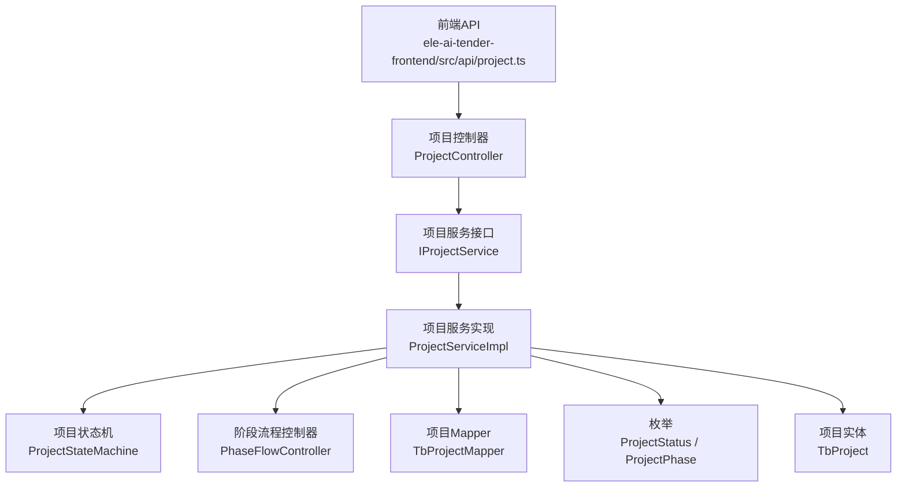
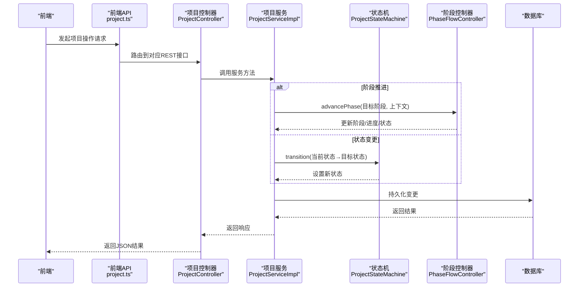
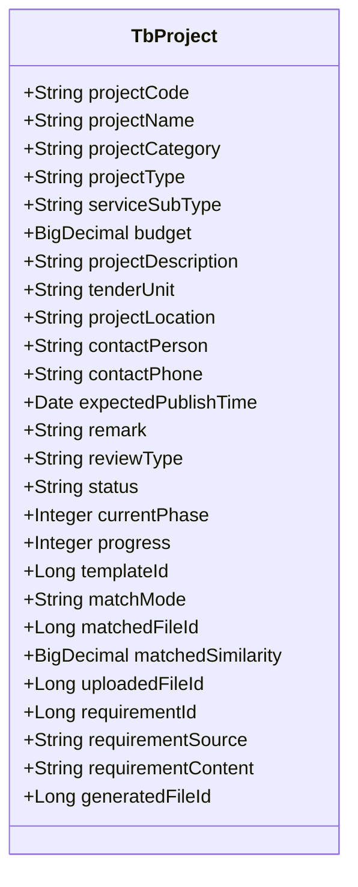
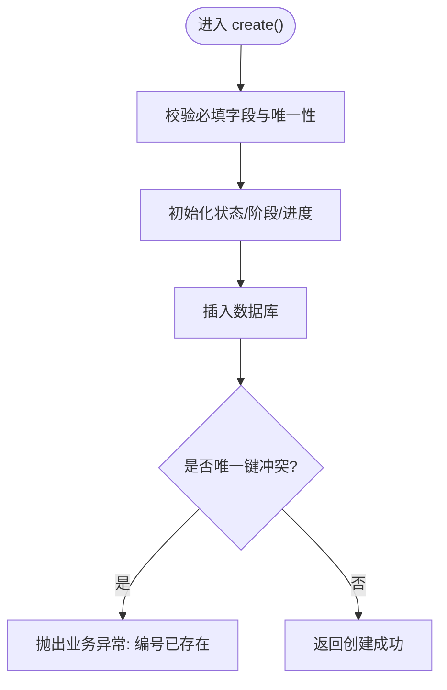
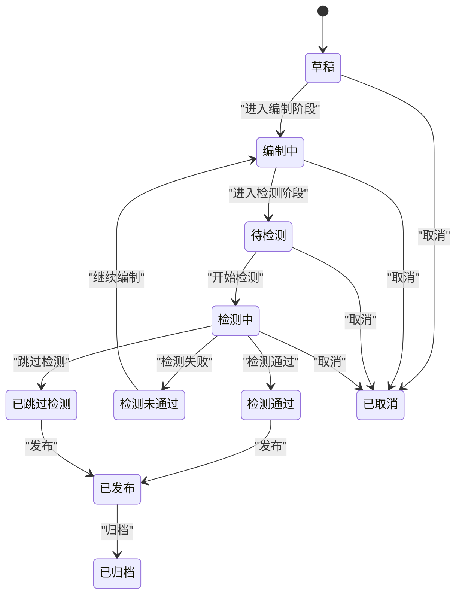
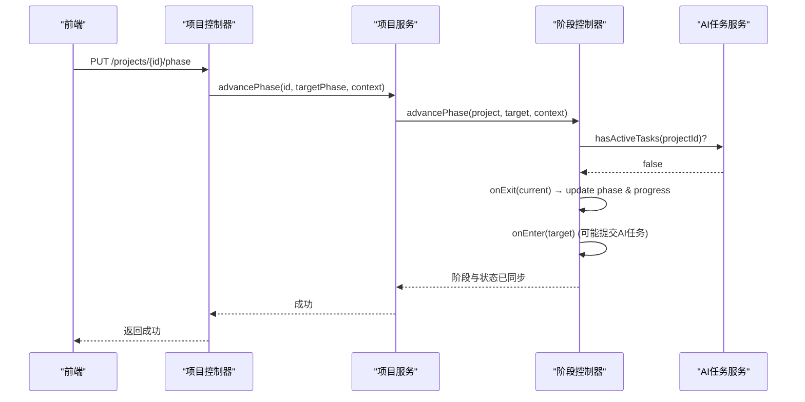
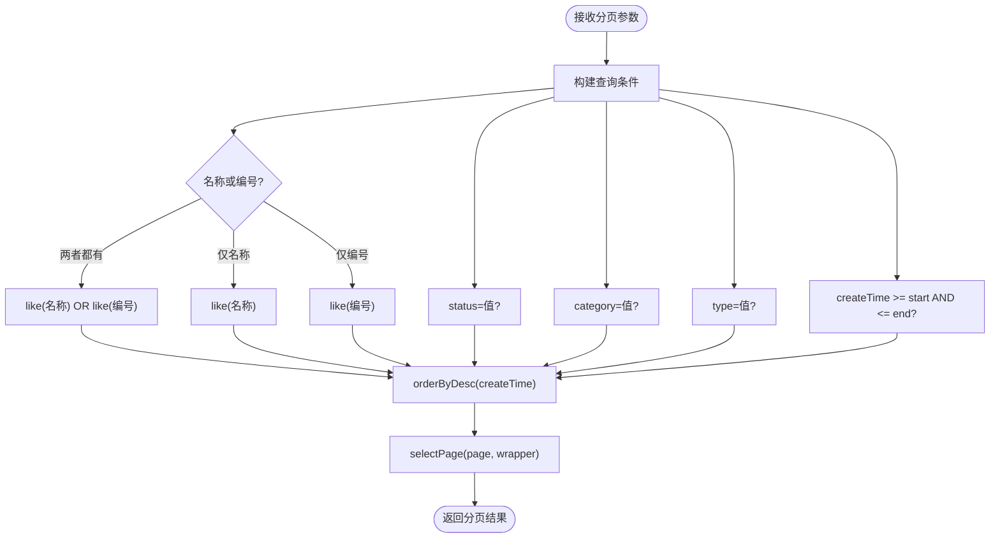
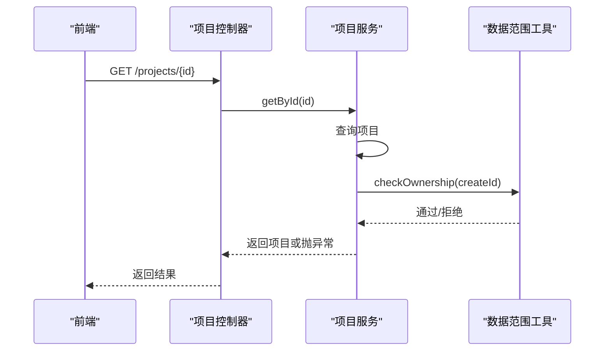
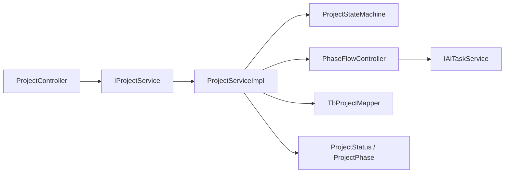

# 项目管理系统

<cite>
**本文引用的文件**   
- [TbProject.java](file://ele-ai-tender-system/ele-ai-tender-common/src/main/java/com/jy/eleaitender/common/entity/core/TbProject.java)
- [ProjectController.java](file://ele-ai-tender-system/ele-ai-tender-core/src/main/java/com/jy/eleaitender/core/controller/ProjectController.java)
- [IProjectService.java](file://ele-ai-tender-system/ele-ai-tender-core/src/main/java/com/jy/eleaitender/core/service/IProjectService.java)
- [ProjectServiceImpl.java](file://ele-ai-tender-system/ele-ai-tender-core/src/main/java/com/jy/eleaitender/core/service/impl/ProjectServiceImpl.java)
- [ProjectStateMachine.java](file://ele-ai-tender-system/ele-ai-tender-core/src/main/java/com/jy/eleaitender/core/statemachine/ProjectStateMachine.java)
- [PhaseFlowController.java](file://ele-ai-tender-system/ele-ai-tender-core/src/main/java/com/jy/eleaitender/core/statemachine/PhaseFlowController.java)
- [ProjectStatus.java](file://ele-ai-tender-system/ele-ai-tender-common/src/main/java/com/jy/eleaitender/common/enums/ProjectStatus.java)
- [ProjectPhase.java](file://ele-ai-tender-system/ele-ai-tender-common/src/main/java/com/jy/eleaitender/common/enums/ProjectPhase.java)
- [project.ts（前端API）](file://ele-ai-tender-frontend/src/api/project.ts)
- [project.ts（前端类型）](file://ele-ai-tender-frontend/src/types/project.ts)
</cite>

## 目录
1. [简介](#简介)
2. [项目结构](#项目结构)
3. [核心组件](#核心组件)
4. [架构总览](#架构总览)
5. [详细组件分析](#详细组件分析)
6. [依赖关系分析](#依赖关系分析)
7. [性能考虑](#性能考虑)
8. [故障排查指南](#故障排查指南)
9. [结论](#结论)
10. [附录](#附录)

## 简介
本技术文档围绕“项目”实体与相关能力，系统化阐述数据结构设计、CRUD实现、生命周期管理、查询过滤、权限控制与数据隔离等关键主题。文档面向后端与前端开发者，兼顾业务人员理解，提供从概念到代码的完整映射与可视化图示。

## 项目结构
本项目采用前后端分离与多模块后端架构：
- 前端通过 API 层调用核心服务的项目接口，完成列表、详情、创建、更新、删除、版本历史、阶段推进、状态变更等操作。
- 后端核心服务暴露 REST 接口，由控制器转发至服务层；服务层负责校验、事务、状态机与阶段流程编排，并持久化至数据库。
- 公共枚举定义项目状态与编制阶段，状态机与阶段控制器共同保障流转正确性。

图表来源
- [ProjectController.java:1-159](file://ele-ai-tender-system/ele-ai-tender-core/src/main/java/com/jy/eleaitender/core/controller/ProjectController.java#L1-L159)
- [IProjectService.java:1-93](file://ele-ai-tender-system/ele-ai-tender-core/src/main/java/com/jy/eleaitender/core/service/IProjectService.java#L1-L93)
- [ProjectServiceImpl.java:1-340](file://ele-ai-tender-system/ele-ai-tender-core/src/main/java/com/jy/eleaitender/core/service/impl/ProjectServiceImpl.java#L1-L340)
- [ProjectStateMachine.java:1-60](file://ele-ai-tender-system/ele-ai-tender-core/src/main/java/com/jy/eleaitender/core/statemachine/ProjectStateMachine.java#L1-L60)
- [PhaseFlowController.java:1-176](file://ele-ai-tender-system/ele-ai-tender-core/src/main/java/com/jy/eleaitender/core/statemachine/PhaseFlowController.java#L1-L176)
- [ProjectStatus.java:1-36](file://ele-ai-tender-system/ele-ai-tender-common/src/main/java/com/jy/eleaitender/common/enums/ProjectStatus.java#L1-L36)
- [ProjectPhase.java:1-41](file://ele-ai-tender-system/ele-ai-tender-common/src/main/java/com/jy/eleaitender/common/enums/ProjectPhase.java#L1-L41)
- [TbProject.java:1-100](file://ele-ai-tender-system/ele-ai-tender-common/src/main/java/com/jy/eleaitender/common/entity/core/TbProject.java#L1-L100)

章节来源
- [ProjectController.java:1-159](file://ele-ai-tender-system/ele-ai-tender-core/src/main/java/com/jy/eleaitender/core/controller/ProjectController.java#L1-L159)
- [IProjectService.java:1-93](file://ele-ai-tender-system/ele-ai-tender-core/src/main/java/com/jy/eleaitender/core/service/IProjectService.java#L1-L93)
- [ProjectServiceImpl.java:1-340](file://ele-ai-tender-system/ele-ai-tender-core/src/main/java/com/jy/eleaitender/core/service/impl/ProjectServiceImpl.java#L1-L340)
- [ProjectStateMachine.java:1-60](file://ele-ai-tender-system/ele-ai-tender-core/src/main/java/com/jy/eleaitender/core/statemachine/ProjectStateMachine.java#L1-L60)
- [PhaseFlowController.java:1-176](file://ele-ai-tender-system/ele-ai-tender-core/src/main/java/com/jy/eleaitender/core/statemachine/PhaseFlowController.java#L1-L176)
- [ProjectStatus.java:1-36](file://ele-ai-tender-system/ele-ai-tender-common/src/main/java/com/jy/eleaitender/common/enums/ProjectStatus.java#L1-L36)
- [ProjectPhase.java:1-41](file://ele-ai-tender-system/ele-ai-tender-common/src/main/java/com/jy/eleaitender/common/enums/ProjectPhase.java#L1-L41)
- [TbProject.java:1-100](file://ele-ai-tender-system/ele-ai-tender-common/src/main/java/com/jy/eleaitender/common/entity/core/TbProject.java#L1-L100)

## 核心组件
- 项目实体 TbProject：承载项目基本信息、状态、阶段、进度、模板、匹配模式、需求与生成文件等字段。
- 项目控制器 ProjectController：对外暴露分页查询、详情、创建、更新、批量删除、版本历史、导出、阶段推进、状态变更、AI需求生成、取消/发布/归档等接口。
- 项目服务 IProjectService/ProjectServiceImpl：封装业务逻辑，包括唯一性校验、分页查询、CRUD、阶段推进、状态转换、AI任务触发等。
- 状态机 ProjectStateMachine：维护合法的状态转换规则，确保状态变更合规。
- 阶段流程控制器 PhaseFlowController：管理阶段推进规则、触发器注册、阶段与状态的联动、活跃任务检查等。
- 枚举 ProjectStatus/ProjectPhase：定义项目状态与编制阶段的编码与标签。
- 前端 API types/project.ts：定义前端请求参数与返回模型，与后端实体对齐。

章节来源
- [TbProject.java:1-100](file://ele-ai-tender-system/ele-ai-tender-common/src/main/java/com/jy/eleaitender/common/entity/core/TbProject.java#L1-L100)
- [ProjectController.java:1-159](file://ele-ai-tender-system/ele-ai-tender-core/src/main/java/com/jy/eleaitender/core/controller/ProjectController.java#L1-L159)
- [IProjectService.java:1-93](file://ele-ai-tender-system/ele-ai-tender-core/src/main/java/com/jy/eleaitender/core/service/IProjectService.java#L1-L93)
- [ProjectServiceImpl.java:1-340](file://ele-ai-tender-system/ele-ai-tender-core/src/main/java/com/jy/eleaitender/core/service/impl/ProjectServiceImpl.java#L1-L340)
- [ProjectStateMachine.java:1-60](file://ele-ai-tender-system/ele-ai-tender-core/src/main/java/com/jy/eleaitender/core/statemachine/ProjectStateMachine.java#L1-L60)
- [PhaseFlowController.java:1-176](file://ele-ai-tender-system/ele-ai-tender-core/src/main/java/com/jy/eleaitender/core/statemachine/PhaseFlowController.java#L1-L176)
- [ProjectStatus.java:1-36](file://ele-ai-tender-system/ele-ai-tender-common/src/main/java/com/jy/eleaitender/common/enums/ProjectStatus.java#L1-L36)
- [ProjectPhase.java:1-41](file://ele-ai-tender-system/ele-ai-tender-common/src/main/java/com/jy/eleaitender/common/enums/ProjectPhase.java#L1-L41)
- [project.ts（前端类型）:1-72](file://ele-ai-tender-frontend/src/types/project.ts#L1-L72)

## 架构总览
下图展示从前端到后端的调用链路与核心组件交互：

图表来源
- [ProjectController.java:1-159](file://ele-ai-tender-system/ele-ai-tender-core/src/main/java/com/jy/eleaitender/core/controller/ProjectController.java#L1-L159)
- [ProjectServiceImpl.java:1-340](file://ele-ai-tender-system/ele-ai-tender-core/src/main/java/com/jy/eleaitender/core/service/impl/ProjectServiceImpl.java#L1-L340)
- [ProjectStateMachine.java:1-60](file://ele-ai-tender-system/ele-ai-tender-core/src/main/java/com/jy/eleaitender/core/statemachine/ProjectStateMachine.java#L1-L60)
- [PhaseFlowController.java:1-176](file://ele-ai-tender-system/ele-ai-tender-core/src/main/java/com/jy/eleaitender/core/statemachine/PhaseFlowController.java#L1-L176)

## 详细组件分析

### 项目实体数据结构设计
- 基本信息：项目编号、项目名称、类别、类型、服务子类型、预算金额、描述、招标单位、地点、联系人、联系电话、预期发布时间、备注。
- 状态与阶段：评审类型、项目状态、当前编制阶段、完成进度百分比。
- 模板与匹配：使用的模板ID、匹配模式、匹配的历史文件ID、匹配度百分比、上传的文件ID。
- 需求与生成：关联的业务需求ID、需求来源、招标需求内容、生成的招标文件ID。
- 继承基础字段：创建时间、创建人等来自基类。

图表来源
- [TbProject.java:1-100](file://ele-ai-tender-system/ele-ai-tender-common/src/main/java/com/jy/eleaitender/common/entity/core/TbProject.java#L1-L100)

章节来源
- [TbProject.java:1-100](file://ele-ai-tender-system/ele-ai-tender-common/src/main/java/com/jy/eleaitender/common/entity/core/TbProject.java#L1-L100)

### CRUD 操作实现
- 创建项目
  - 必填校验：项目编号、评审方式。
  - 唯一性校验：项目编号全局唯一；项目名称可配置唯一。
  - 默认初始化：状态为草稿、阶段为基础信息录入、进度为0。
  - 异常处理：捕获唯一键冲突，转换为业务异常提示。
- 更新项目
  - 读取现有记录并进行归属校验。
  - 名称唯一性校验（排除自身）。
  - 禁止修改项目编号，仅更新其他字段。
- 删除项目
  - 支持批量删除，逐个进行归属校验后删除。
- 分页查询
  - 支持按项目名称或编号模糊查询（OR逻辑）、状态、类别、类型、创建时间范围筛选。
  - 默认按创建时间倒序排序。
- 版本历史
  - 提供按项目ID获取版本历史列表接口。

图表来源
- [ProjectServiceImpl.java:131-160](file://ele-ai-tender-system/ele-ai-tender-core/src/main/java/com/jy/eleaitender/core/service/impl/ProjectServiceImpl.java#L131-L160)

章节来源
- [ProjectController.java:67-88](file://ele-ai-tender-system/ele-ai-tender-core/src/main/java/com/jy/eleaitender/core/controller/ProjectController.java#L67-L88)
- [ProjectServiceImpl.java:84-118](file://ele-ai-tender-system/ele-ai-tender-core/src/main/java/com/jy/eleaitender/core/service/impl/ProjectServiceImpl.java#L84-L118)
- [ProjectServiceImpl.java:131-174](file://ele-ai-tender-system/ele-ai-tender-core/src/main/java/com/jy/eleaitender/core/service/impl/ProjectServiceImpl.java#L131-L174)
- [ProjectServiceImpl.java:177-189](file://ele-ai-tender-system/ele-ai-tender-core/src/main/java/com/jy/eleaitender/core/service/impl/ProjectServiceImpl.java#L177-L189)

### 项目生命周期与状态管理
- 状态枚举：包含草稿、编制中、待检测、检测中、检测通过、检测未通过、已跳过检测、已发布、已归档、已取消。
- 状态机规则：定义各状态允许的下一状态集合，非法转换将抛出业务异常。
- 阶段与状态联动：
  - 首次进入编制阶段时，状态从草稿转为编制中。
  - 进入检测阶段时，状态流转至待检测并进一步进入检测中。
  - 其他阶段进入时，若当前为草稿则转为编制中。
- 阶段推进：
  - 只能顺序推进到下一阶段，不允许跳跃或倒退。
  - 推进前检查无活跃AI任务。
  - 执行当前阶段 onExit 校验与清理，再执行目标阶段 onEnter 自动任务。
  - 同步更新项目进度百分比（阶段×20%）。

图表来源
- [ProjectStatus.java:1-36](file://ele-ai-tender-system/ele-ai-tender-common/src/main/java/com/jy/eleaitender/common/enums/ProjectStatus.java#L1-L36)
- [ProjectStateMachine.java:19-30](file://ele-ai-tender-system/ele-ai-tender-core/src/main/java/com/jy/eleaitender/core/statemachine/ProjectStateMachine.java#L19-L30)
- [PhaseFlowController.java:33-39](file://ele-ai-tender-system/ele-ai-tender-core/src/main/java/com/jy/eleaitender/core/statemachine/PhaseFlowController.java#L33-L39)

章节来源
- [ProjectStatus.java:1-36](file://ele-ai-tender-system/ele-ai-tender-common/src/main/java/com/jy/eleaitender/common/enums/ProjectStatus.java#L1-L36)
- [ProjectStateMachine.java:1-60](file://ele-ai-tender-system/ele-ai-tender-core/src/main/java/com/jy/eleaitender/core/statemachine/ProjectStateMachine.java#L1-L60)
- [PhaseFlowController.java:57-96](file://ele-ai-tender-system/ele-ai-tender-core/src/main/java/com/jy/eleaitender/core/statemachine/PhaseFlowController.java#L57-L96)
- [PhaseFlowController.java:134-167](file://ele-ai-tender-system/ele-ai-tender-core/src/main/java/com/jy/eleaitender/core/statemachine/PhaseFlowController.java#L134-L167)

### 阶段推进与AI任务集成
- 阶段推进流程：
  - 校验阶段转换合法性。
  - 检查项目下是否存在活跃AI任务，若有则拒绝推进。
  - 执行当前阶段 onExit 校验与清理。
  - 更新阶段与进度百分比。
  - 执行目标阶段 onEnter，可能自动提交AI任务（如智能检测）。
  - 联动更新项目状态。
- AI需求生成：
  - 根据项目信息构造需求生成参数。
  - 依据匹配模式选择参考文档来源（自动匹配/手动选择/上传文件）。
  - 提交AI任务并返回任务标识。

图表来源
- [ProjectController.java:112-118](file://ele-ai-tender-system/ele-ai-tender-core/src/main/java/com/jy/eleaitender/core/controller/ProjectController.java#L112-L118)
- [ProjectServiceImpl.java:234-239](file://ele-ai-tender-system/ele-ai-tender-core/src/main/java/com/jy/eleaitender/core/service/impl/ProjectServiceImpl.java#L234-L239)
- [PhaseFlowController.java:57-96](file://ele-ai-tender-system/ele-ai-tender-core/src/main/java/com/jy/eleaitender/core/statemachine/PhaseFlowController.java#L57-L96)

章节来源
- [ProjectController.java:112-118](file://ele-ai-tender-system/ele-ai-tender-core/src/main/java/com/jy/eleaitender/core/controller/ProjectController.java#L112-L118)
- [ProjectServiceImpl.java:234-239](file://ele-ai-tender-system/ele-ai-tender-core/src/main/java/com/jy/eleaitender/core/service/impl/ProjectServiceImpl.java#L234-L239)
- [PhaseFlowController.java:57-96](file://ele-ai-tender-system/ele-ai-tender-core/src/main/java/com/jy/eleaitender/core/statemachine/PhaseFlowController.java#L57-L96)

### 查询与过滤功能
- 分页查询：支持页码与每页大小参数。
- 条件筛选：
  - 项目名称或编号模糊查询（OR逻辑）。
  - 状态、类别、类型精确匹配。
  - 创建时间起止范围筛选。
- 排序：默认按创建时间倒序。

图表来源
- [ProjectServiceImpl.java:85-118](file://ele-ai-tender-system/ele-ai-tender-core/src/main/java/com/jy/eleaitender/core/service/impl/ProjectServiceImpl.java#L85-L118)

章节来源
- [ProjectController.java:35-49](file://ele-ai-tender-system/ele-ai-tender-core/src/main/java/com/jy/eleaitender/core/controller/ProjectController.java#L35-L49)
- [ProjectServiceImpl.java:85-118](file://ele-ai-tender-system/ele-ai-tender-core/src/main/java/com/jy/eleaitender/core/service/impl/ProjectServiceImpl.java#L85-L118)

### 权限控制与数据隔离
- 登录校验：控制器接口使用登录注解，要求用户认证后方可访问。
- 数据所有权校验：
  - 获取详情与批量删除时，基于创建人ID进行归属校验，确保用户仅能操作自己创建的项目。
- 数据范围辅助：
  - 使用数据范围工具进行所有权检查，避免越权访问。

图表来源
- [ProjectController.java:60-65](file://ele-ai-tender-system/ele-ai-tender-core/src/main/java/com/jy/eleaitender/core/controller/ProjectController.java#L60-L65)
- [ProjectServiceImpl.java:121-128](file://ele-ai-tender-system/ele-ai-tender-core/src/main/java/com/jy/eleaitender/core/service/impl/ProjectServiceImpl.java#L121-L128)
- [ProjectServiceImpl.java:177-189](file://ele-ai-tender-system/ele-ai-tender-core/src/main/java/com/jy/eleaitender/core/service/impl/ProjectServiceImpl.java#L177-L189)

章节来源
- [ProjectController.java:35-65](file://ele-ai-tender-system/ele-ai-tender-core/src/main/java/com/jy/eleaitender/core/controller/ProjectController.java#L35-L65)
- [ProjectServiceImpl.java:121-128](file://ele-ai-tender-system/ele-ai-tender-core/src/main/java/com/jy/eleaitender/core/service/impl/ProjectServiceImpl.java#L121-L128)
- [ProjectServiceImpl.java:177-189](file://ele-ai-tender-system/ele-ai-tender-core/src/main/java/com/jy/eleaitender/core/service/impl/ProjectServiceImpl.java#L177-L189)

### 前端对接与类型定义
- 前端API：
  - 提供列表、详情、创建、更新、批量删除、版本历史、导出、阶段推进、AI需求生成、状态变更、取消/发布/归档、名称唯一性校验等方法。
- 前端类型：
  - 定义项目信息、查询参数、创建参数、版本信息等类型，与后端实体保持一致。

章节来源
- [project.ts（前端API）:1-59](file://ele-ai-tender-frontend/src/api/project.ts#L1-L59)
- [project.ts（前端类型）:1-72](file://ele-ai-tender-frontend/src/types/project.ts#L1-L72)

## 依赖关系分析
- 控制器依赖服务接口，服务实现依赖状态机与阶段控制器、AI任务服务、Mapper与枚举。
- 阶段控制器依赖AI任务服务以检查活跃任务，并在阶段切换时联动状态机。
- 状态机依赖项目状态枚举，阶段控制器依赖项目阶段枚举。

图表来源
- [ProjectController.java:1-159](file://ele-ai-tender-system/ele-ai-tender-core/src/main/java/com/jy/eleaitender/core/controller/ProjectController.java#L1-L159)
- [IProjectService.java:1-93](file://ele-ai-tender-system/ele-ai-tender-core/src/main/java/com/jy/eleaitender/core/service/IProjectService.java#L1-L93)
- [ProjectServiceImpl.java:1-340](file://ele-ai-tender-system/ele-ai-tender-core/src/main/java/com/jy/eleaitender/core/service/impl/ProjectServiceImpl.java#L1-L340)
- [ProjectStateMachine.java:1-60](file://ele-ai-tender-system/ele-ai-tender-core/src/main/java/com/jy/eleaitender/core/statemachine/ProjectStateMachine.java#L1-L60)
- [PhaseFlowController.java:1-176](file://ele-ai-tender-system/ele-ai-tender-core/src/main/java/com/jy/eleaitender/core/statemachine/PhaseFlowController.java#L1-L176)

章节来源
- [ProjectController.java:1-159](file://ele-ai-tender-system/ele-ai-tender-core/src/main/java/com/jy/eleaitender/core/controller/ProjectController.java#L1-L159)
- [ProjectServiceImpl.java:1-340](file://ele-ai-tender-system/ele-ai-tender-core/src/main/java/com/jy/eleaitender/core/service/impl/ProjectServiceImpl.java#L1-L340)
- [PhaseFlowController.java:1-176](file://ele-ai-tender-system/ele-ai-tender-core/src/main/java/com/jy/eleaitender/core/statemachine/PhaseFlowController.java#L1-L176)

## 性能考虑
- 分页查询使用MyBatis-Plus分页插件，建议对常用筛选字段建立索引以提升查询效率。
- 模糊查询（名称/编号）在大数据量场景下可能影响性能，建议结合全文检索或搜索引擎优化。
- 阶段推进前检查活跃AI任务，避免并发导致的数据不一致；必要时引入分布式锁或队列机制。
- 状态机与阶段控制器逻辑轻量，但频繁调用时应注意日志级别与输出量，避免IO瓶颈。

## 故障排查指南
- 唯一键冲突
  - 现象：创建项目时报唯一键冲突异常。
  - 定位：检查项目编号是否重复，查看异常消息中的唯一键名。
  - 处理：更换项目编号或清理重复数据。
- 状态转换非法
  - 现象：变更状态或推进阶段时报状态错误。
  - 定位：核对当前状态与目标状态是否在允许转换集合内。
  - 处理：调整目标状态或先切换到中间状态。
- 阶段推进被拒
  - 现象：推进阶段时报错提示有活跃任务。
  - 定位：检查项目下是否存在正在执行的AI任务。
  - 处理：等待任务完成或取消任务后再推进。
- 数据越权
  - 现象：访问他人项目详情或删除时报权限错误。
  - 定位：确认当前用户是否为项目创建者。
  - 处理：使用正确的用户身份或授权访问。

章节来源
- [ProjectServiceImpl.java:150-159](file://ele-ai-tender-system/ele-ai-tender-core/src/main/java/com/jy/eleaitender/core/service/impl/ProjectServiceImpl.java#L150-L159)
- [ProjectStateMachine.java:37-45](file://ele-ai-tender-system/ele-ai-tender-core/src/main/java/com/jy/eleaitender/core/statemachine/ProjectStateMachine.java#L37-L45)
- [PhaseFlowController.java:66-69](file://ele-ai-tender-system/ele-ai-tender-core/src/main/java/com/jy/eleaitender/core/statemachine/PhaseFlowController.java#L66-L69)
- [ProjectServiceImpl.java:121-128](file://ele-ai-tender-system/ele-ai-tender-core/src/main/java/com/jy/eleaitender/core/service/impl/ProjectServiceImpl.java#L121-L128)

## 结论
本项目管理系统在项目实体设计、CRUD实现、生命周期管理与阶段推进方面形成了清晰的分层与职责划分。状态机与阶段控制器协同保障业务流转的正确性与一致性；查询过滤满足常见业务场景；权限控制与数据隔离确保数据安全。后续可在性能优化、扩展性与可观测性方面持续改进。

## 附录
- 前端API路径与参数定义参见前端API与类型文件。
- 后端接口定义参见控制器与服务接口。
- 状态与阶段枚举定义参见公共枚举文件。