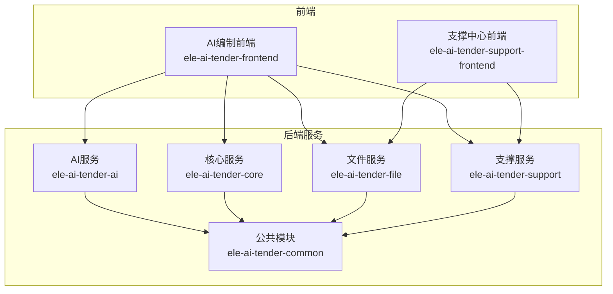
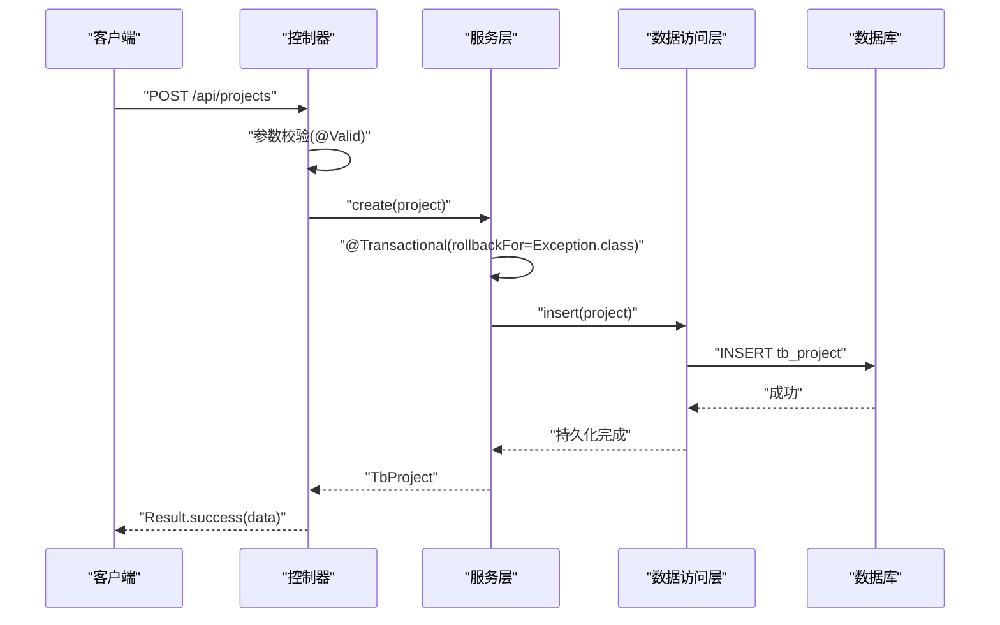
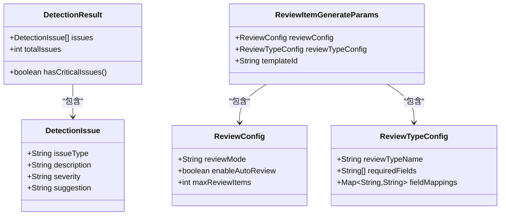
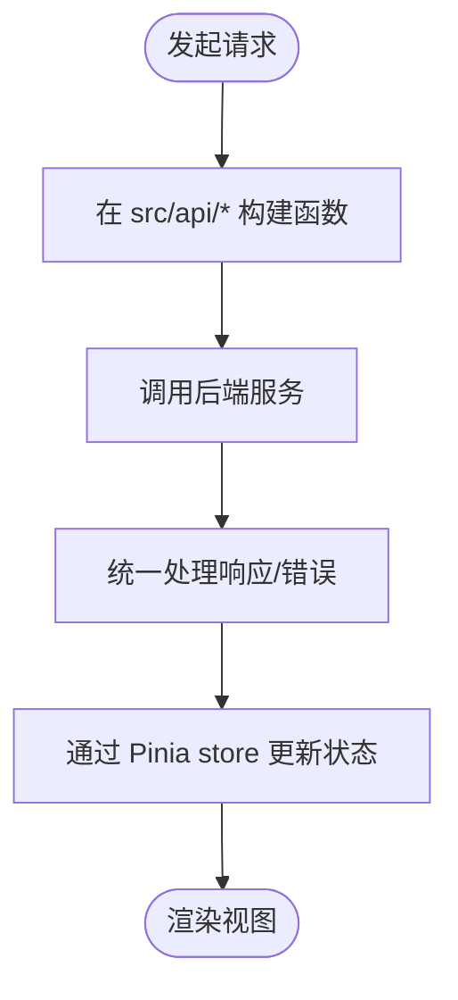
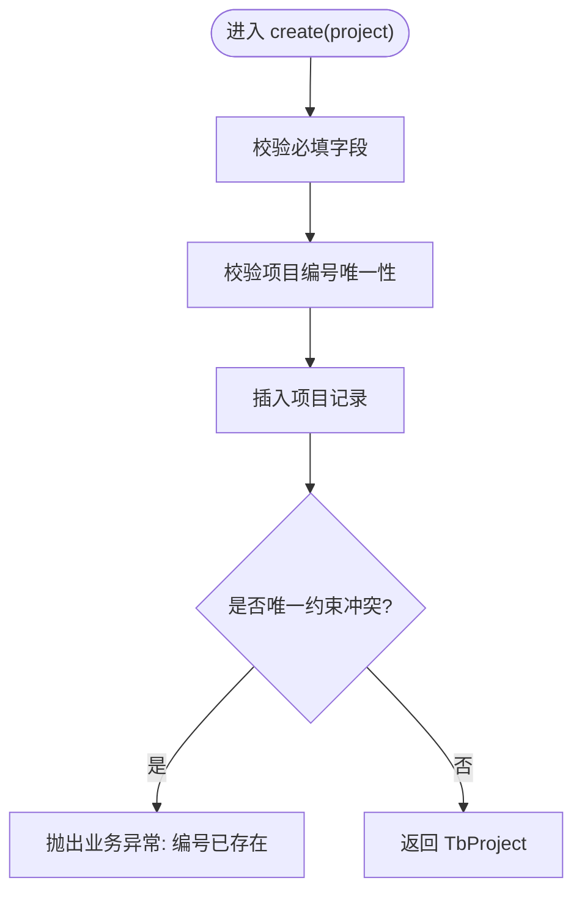
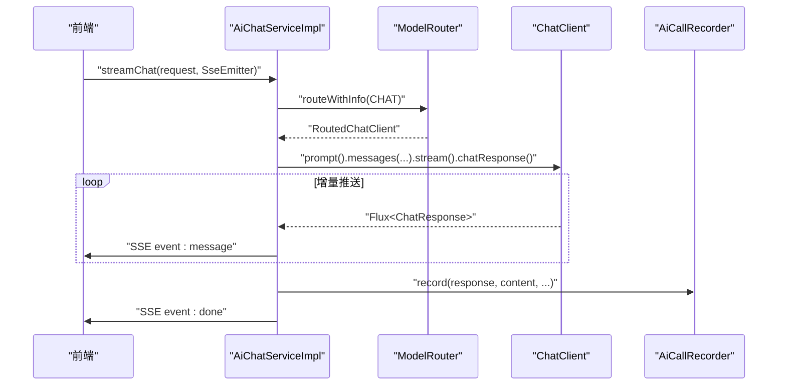
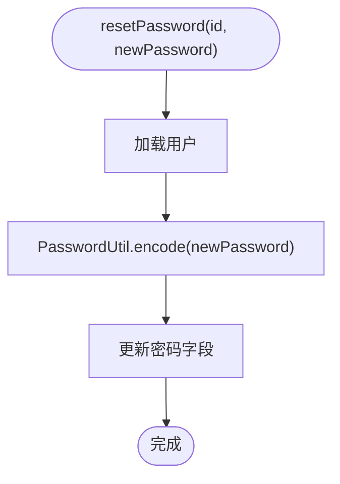
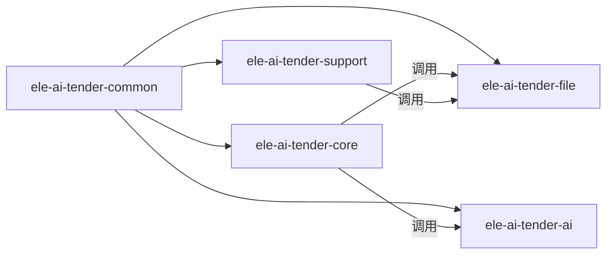

# 代码规范

<cite>
**本文引用的文件**
- [CODE_CONVENTIONS.md](file://docs/rules/CODE_CONVENTIONS.md)
- [FRONTEND_CONVENTIONS.md](file://docs/rules/FRONTEND_CONVENTIONS.md)
- [BaseEntity.java](file://ele-ai-tender-system/ele-ai-tender-common/src/main/java/com/jy/eleaitender/common/entity/base/BaseEntity.java)
- [BusinessException.java](file://ele-ai-tender-system/ele-ai-tender-common/src/main/java/com/jy/eleaitender/common/exception/BusinessException.java)
- [AuthException.java](file://ele-ai-tender-system/ele-ai-tender-common/src/main/java/com/jy/eleaitender/common/exception/AuthException.java)
- [FileException.java](file://ele-ai-tender-system/ele-ai-tender-common/src/main/java/com/jy/eleaitender/common/exception/FileException.java)
- [AiUnavailableException.java](file://ele-ai-tender-system/ele-ai-tender-common/src/main/java/com/jy/eleaitender/common/exception/AiUnavailableException.java)
- [JwtUtil.java](file://ele-ai-tender-system/ele-ai-tender-common/src/main/java/com/jy/eleaitender/common/util/JwtUtil.java)
- [HttpRequestLogFilter.java](file://ele-ai-tender-system/ele-ai-tender-common/src/main/java/com/jy/eleaitender/common/logging/HttpRequestLogFilter.java)
- [GlobalExceptionHandler (core).java](file://ele-ai-tender-system/ele-ai-tender-core/src/main/java/com/jy/eleaitender/core/handler/GlobalExceptionHandler.java)
- [GlobalExceptionHandler (ai).java](file://ele-ai-tender-system/ele-ai-tender-ai/src/main/java/com/jy/eleaitender/ai/handler/GlobalExceptionHandler.java)
- [GlobalExceptionHandler (file).java](file://ele-ai-tender-system/ele-ai-tender-file/src/main/java/com/jy/eleaitender/file/handler/GlobalExceptionHandler.java)
- [GlobalExceptionHandler (support).java](file://ele-ai-tender-system/ele-ai-tender-support/src/main/java/com/jy/eleaitender/support/handler/GlobalExceptionHandler.java)
- [ProjectServiceImpl.java](file://ele-ai-tender-system/ele-ai-tender-core/src/main/java/com/jy/eleaitender/core/service/impl/ProjectServiceImpl.java)
- [AiChatServiceImpl.java](file://ele-ai-tender-system/ele-ai-tender-ai/src/main/java/com/jy/eleaitender/ai/service/impl/AiChatServiceImpl.java)
- [UserServiceImpl.java](file://ele-ai-tender-system/ele-ai-tender-support/src/main/java/com/jy/eleaitender/support/service/impl/UserServiceImpl.java)
- [DetectionResult.java](file://ele-ai-tender-system/ele-ai-tender-common/src/main/java/com/jy/eleaitender/common/dto/DetectionResult.java)
- [ReviewItemGenerateParams.java](file://ele-ai-tender-system/ele-ai-tender-common/src/main/java/com/jy/eleaitender/common/dto/ReviewItemGenerateParams.java)
- [ReviewConfig.java](file://ele-ai-tender-system/ele-ai-tender-common/src/main/java/com/jy/eleaitender/common/dto/ReviewConfig.java)
- [ReviewTypeConfig.java](file://ele-ai-tender-system/ele-ai-tender-common/src/main/java/com/jy/eleaitender/common/dto/ReviewTypeConfig.java)
</cite>

## 更新摘要
**所做更改**
- 更新了Java内部类结构优化相关内容，反映DetectionResult中的DetectionIssue类和ReviewItemGenerateParams中的ReviewConfig、ReviewTypeConfig类转换为public static内部类的变更
- 增强了Java最佳实践章节，强调内部类声明的规范性
- 更新了DTO设计模式部分，包含新的内部类结构示例

## 目录
1. [简介](#简介)
2. [项目结构](#项目结构)
3. [核心组件](#核心组件)
4. [架构总览](#架构总览)
5. [详细组件分析](#详细组件分析)
6. [依赖分析](#依赖分析)
7. [性能考虑](#性能考虑)
8. [故障排查指南](#故障排查指南)
9. [结论](#结论)
10. [附录](#附录)

## 简介
本规范面向"招标文件AI编制系统"，统一后端Java与前端TypeScript的编码约定，覆盖包结构、命名、异常处理、事务管理、依赖管理、数据库设计、接口设计、安全编码、日志记录、Git提交、代码审查与持续集成检查规则。目标是确保团队开发一致性与代码质量，降低沟通与维护成本。

## 项目结构
- 后端采用多模块Maven工程：common（通用能力）、core（核心业务）、ai（AI能力）、file（文件服务）、support（支撑中心），以及前后端分离的双前端项目。
- 前端双项目：支撑中心管理后台与AI编制业务前端，技术栈为Vue 3 + TypeScript + Vite + Element Plus + Pinia。

图表来源
- [FRONTEND_CONVENTIONS.md:1-70](file://docs/rules/FRONTEND_CONVENTIONS.md#L1-L70)
- [CODE_CONVENTIONS.md:186-250](file://docs/rules/CODE_CONVENTIONS.md#L186-L250)

章节来源
- [FRONTEND_CONVENTIONS.md:1-70](file://docs/rules/FRONTEND_CONVENTIONS.md#L1-L70)
- [CODE_CONVENTIONS.md:186-250](file://docs/rules/CODE_CONVENTIONS.md#L186-L250)

## 核心组件
- 基础实体与自动填充：所有实体继承 BaseEntity，统一主键、审计字段、乐观锁与逻辑删除；通过 MetaObjectHandlerImpl 自动填充。
- 全局异常处理：各服务提供 GlobalExceptionHandler，统一返回 Result<T>，HTTP状态码固定200，业务错误通过 code/message 区分。
- JWT工具：JwtUtil 提供统一的Token生成、解析与校验，支持内部用户、外部系统与跨服务调用场景。
- 访问日志：HttpRequestLogFilter 统一拦截请求，补全traceId，采集请求/响应体并持久化访问日志。

章节来源
- [BaseEntity.java:1-74](file://ele-ai-tender-system/ele-ai-tender-common/src/main/java/com/jy/eleaitender/common/entity/base/BaseEntity.java#L1-L74)
- [GlobalExceptionHandler (core).java:1-92](file://ele-ai-tender-system/ele-ai-tender-core/src/main/java/com/jy/eleaitender/core/handler/GlobalExceptionHandler.java#L1-L92)
- [GlobalExceptionHandler (ai).java:1-102](file://ele-ai-tender-system/ele-ai-tender-ai/src/main/java/com/jy/eleaitender/ai/handler/GlobalExceptionHandler.java#L1-L102)
- [GlobalExceptionHandler (file).java:1-64](file://ele-ai-tender-system/ele-ai-tender-file/src/main/java/com/jy/eleaitender/file/handler/GlobalExceptionHandler.java#L1-L64)
- [GlobalExceptionHandler (support).java:1-95](file://ele-ai-tender-system/ele-ai-tender-support/src/main/java/com/jy/eleaitender/support/handler/GlobalExceptionHandler.java#L1-L95)
- [JwtUtil.java:1-311](file://ele-ai-tender-system/ele-ai-tender-common/src/main/java/com/jy/eleaitender/common/util/JwtUtil.java#L1-L311)
- [HttpRequestLogFilter.java:1-137](file://ele-ai-tender-system/ele-ai-tender-common/src/main/java/com/jy/eleaitender/common/logging/HttpRequestLogFilter.java#L1-L137)

## 架构总览
- 分层职责：Controller仅做参数接收与校验、权限注解、调用Service并封装Result；Service承载业务逻辑与事务；Mapper负责数据访问。
- 统一返回：内部接口使用 Result<T>，交互协议接口使用 InteractionResult<T>，禁止混用。
- 分页：请求继承 BasePageRequest，响应直接返回 MyBatis-Plus Page<T>。
- 错误码：按范围划分，新增错误码登记于 ResponseCode 枚举。

图表来源
- [CODE_CONVENTIONS.md:224-272](file://docs/rules/CODE_CONVENTIONS.md#L224-L272)
- [ProjectServiceImpl.java:131-160](file://ele-ai-tender-system/ele-ai-tender-core/src/main/java/com/jy/eleaitender/core/service/impl/ProjectServiceImpl.java#L131-L160)

章节来源
- [CODE_CONVENTIONS.md:67-184](file://docs/rules/CODE_CONVENTIONS.md#L67-L184)
- [CODE_CONVENTIONS.md:224-272](file://docs/rules/CODE_CONVENTIONS.md#L224-L272)

## 详细组件分析

### Java后端编码规范
- 包结构与命名
  - 包结构遵循 config/controller/service/mapper/entity/dto/enums/constant/exception/handler/aspect/util 等标准分层。
  - 类名PascalCase，Service接口I前缀+Service，实现类去I加Impl；方法/变量camelCase；常量UPPER_SNAKE_CASE；DTO后缀Request/Response或VO。
- **内部类结构优化**
  - **更新** 内部类应声明为 `public static` 以遵循Java最佳实践，提高代码可读性和可维护性。
  - DetectionResult中的DetectionIssue类已转换为 `public static class DetectionIssue`。
  - ReviewItemGenerateParams中的ReviewConfig和ReviewTypeConfig类已转换为 `public static class ReviewConfig` 和 `public static class ReviewTypeConfig`。
  - 内部类仅在其父类上下文中使用时才应定义为静态内部类。
- 数据库设计规范
  - 表命名按模块前缀 snake_case；所有实体继承 BaseEntity，自动填充审计字段、乐观锁与逻辑删除。
  - 初始化SQL放置于各模块 sql/init.sql。
- 接口设计原则
  - URL kebab-case，资源复数名词；HTTP方法语义明确；统一返回 Result<T>；分页请求/响应规范清晰；错误码按范围分配。
- 异常处理模式
  - 定义 BusinessException、AuthException、FileException、AiUnavailableException 等专用异常；每个服务提供 GlobalExceptionHandler 统一捕获并返回 Result.fail(code, message)。
- 事务管理策略
  - 多写操作或需一致性保证的方法标注 @Transactional(rollbackFor = Exception.class)；只读查询不加或 readOnly=true；避免在事务内调用外部HTTP。
- 依赖管理规范
  - 新增依赖在父POM的 dependencyManagement 声明版本，子模块不写version；单源原则，严禁重复维护同名同义DTO。

章节来源
- [CODE_CONVENTIONS.md:186-272](file://docs/rules/CODE_CONVENTIONS.md#L186-L272)
- [BaseEntity.java:1-74](file://ele-ai-tender-system/ele-ai-tender-common/src/main/java/com/jy/eleaitender/common/entity/base/BaseEntity.java#L1-L74)
- [BusinessException.java:1-51](file://ele-ai-tender-system/ele-ai-tender-common/src/main/java/com/jy/eleaitender/common/exception/BusinessException.java#L1-L51)
- [AuthException.java:1-51](file://ele-ai-tender-system/ele-ai-tender-common/src/main/java/com/jy/eleaitender/common/exception/AuthException.java#L1-L51)
- [FileException.java:1-36](file://ele-ai-tender-system/ele-ai-tender-common/src/main/java/com/jy/eleaitender/common/exception/FileException.java#L1-L36)
- [AiUnavailableException.java:1-32](file://ele-ai-tender-system/ele-ai-tender-common/src/main/java/com/jy/eleaitender/common/exception/AiUnavailableException.java#L1-L32)
- [GlobalExceptionHandler (core).java:1-92](file://ele-ai-tender-system/ele-ai-tender-core/src/main/java/com/jy/eleaitender/core/handler/GlobalExceptionHandler.java#L1-L92)
- [GlobalExceptionHandler (ai).java:1-102](file://ele-ai-tender-system/ele-ai-tender-ai/src/main/java/com/jy/eleaitender/ai/handler/GlobalExceptionHandler.java#L1-L102)
- [GlobalExceptionHandler (file).java:1-64](file://ele-ai-tender-system/ele-ai-tender-file/src/main/java/com/jy/eleaitender/file/handler/GlobalExceptionHandler.java#L1-L64)
- [GlobalExceptionHandler (support).java:1-95](file://ele-ai-tender-system/ele-ai-tender-support/src/main/java/com/jy/eleaitender/support/handler/GlobalExceptionHandler.java#L1-L95)
- [ProjectServiceImpl.java:131-160](file://ele-ai-tender-system/ele-ai-tender-core/src/main/java/com/jy/eleaitender/core/service/impl/ProjectServiceImpl.java#L131-L160)
- [DetectionResult.java](file://ele-ai-tender-system/ele-ai-tender-common/src/main/java/com/jy/eleaitender/common/dto/DetectionResult.java)
- [ReviewItemGenerateParams.java](file://ele-ai-tender-system/ele-ai-tender-common/src/main/java/com/jy/eleaitender/common/dto/ReviewItemGenerateParams.java)
- [ReviewConfig.java](file://ele-ai-tender-system/ele-ai-tender-common/src/main/java/com/jy/eleaitender/common/dto/ReviewConfig.java)
- [ReviewTypeConfig.java](file://ele-ai-tender-system/ele-ai-tender-common/src/main/java/com/jy/eleaitender/common/dto/ReviewTypeConfig.java)

#### 内部类结构优化示例

图表来源
- [DetectionResult.java](file://ele-ai-tender-system/ele-ai-tender-common/src/main/java/com/jy/eleaitender/common/dto/DetectionResult.java)
- [ReviewItemGenerateParams.java](file://ele-ai-tender-system/ele-ai-tender-common/src/main/java/com/jy/eleaitender/common/dto/ReviewItemGenerateParams.java)
- [ReviewConfig.java](file://ele-ai-tender-system/ele-ai-tender-common/src/main/java/com/jy/eleaitender/common/dto/ReviewConfig.java)
- [ReviewTypeConfig.java](file://ele-ai-tender-system/ele-ai-tender-common/src/main/java/com/jy/eleaitender/common/dto/ReviewTypeConfig.java)

### TypeScript前端编码规范
- 组件开发规范
  - 统一使用 Vue 3 <script setup> Composition API；组件文件名 PascalCase，路由文件名 kebab-case。
- 状态管理模式
  - 状态变更必须通过 Pinia store；禁止在组件中直接读写 localStorage（store文件内除外）。
- API调用规范
  - 所有后端调用在 src/api/ 添加对应函数；修改后端路径/参数/代理规则时，必须同步更新 src/api/*。
- 样式组织方式
  - 样式位于 src/styles/，按 base/variables/index.scss 组织，变量与主题集中管理。
- 代理规则
  - 双前端分别配置不同代理映射到后端服务，详见前端规范文档。

章节来源
- [FRONTEND_CONVENTIONS.md:1-70](file://docs/rules/FRONTEND_CONVENTIONS.md#L1-L70)

#### 前端API调用流程（概念）

[此图为概念流程图，不对应具体源码文件]

### 安全编码要求
- 字符集：所有字节/字符串转换显式指定 UTF-8，避免跨平台差异导致签名/指纹失效。
- 配置快速失败：密钥、secret、签名key缺失时启动或首次调用抛出 IllegalStateException，禁止静默降级。
- JWT与认证：四服务共享同一套JWT密钥；启动时必须执行 JwtUtil.configure(secret, expiration, externalExpiration)；推荐通过环境变量注入。
- 密码与签名：使用 PasswordUtil 进行BCrypt哈希；外部系统HMAC-SHA256签名使用 SignatureUtil。
- 日志脱敏：禁止记录完整JWT Token、签名secret/私钥、文件二进制内容、原始投标口令。

章节来源
- [CODE_CONVENTIONS.md:323-382](file://docs/rules/CODE_CONVENTIONS.md#L323-L382)
- [JwtUtil.java:47-51](file://ele-ai-tender-system/ele-ai-tender-common/src/main/java/com/jy/eleaitender/common/util/JwtUtil.java#L47-L51)

### 链路追踪与日志记录标准
- 统一传播 X-Trace-Id，MDC键 traceId，日志pattern引用 %X{traceId:-}。
- HttpRequestLogFilter 统一拦截请求，SSE流式请求不包装响应以避免事件丢失；非SSE请求缓存请求/响应体并持久化访问日志。

章节来源
- [CODE_CONVENTIONS.md:384-389](file://docs/rules/CODE_CONVENTIONS.md#L384-L389)
- [HttpRequestLogFilter.java:41-106](file://ele-ai-tender-system/ele-ai-tender-common/src/main/java/com/jy/eleaitender/common/logging/HttpRequestLogFilter.java#L41-L106)

### 关键业务流程示例

#### 项目创建与唯一性校验

图表来源
- [ProjectServiceImpl.java:131-160](file://ele-ai-tender-system/ele-ai-tender-core/src/main/java/com/jy/eleaitender/core/service/impl/ProjectServiceImpl.java#L131-L160)
- [ProjectServiceImpl.java:298-306](file://ele-ai-tender-system/ele-ai-tender-core/src/main/java/com/jy/eleaitender/core/service/impl/ProjectServiceImpl.java#L298-L306)

章节来源
- [ProjectServiceImpl.java:131-160](file://ele-ai-tender-system/ele-ai-tender-core/src/main/java/com/jy/eleaitender/core/service/impl/ProjectServiceImpl.java#L131-L160)

#### AI对话SSE流式响应

图表来源
- [AiChatServiceImpl.java:64-123](file://ele-ai-tender-system/ele-ai-tender-ai/src/main/java/com/jy/eleaitender/ai/service/impl/AiChatServiceImpl.java#L64-L123)

章节来源
- [AiChatServiceImpl.java:64-123](file://ele-ai-tender-system/ele-ai-tender-ai/src/main/java/com/jy/eleaitender/ai/service/impl/AiChatServiceImpl.java#L64-L123)

#### 用户密码重置与角色保存

图表来源
- [UserServiceImpl.java:100-105](file://ele-ai-tender-system/ele-ai-tender-support/src/main/java/com/jy/eleaitender/support/service/impl/UserServiceImpl.java#L100-L105)

章节来源
- [UserServiceImpl.java:100-105](file://ele-ai-tender-system/ele-ai-tender-support/src/main/java/com/jy/eleaitender/support/service/impl/UserServiceImpl.java#L100-L105)

## 依赖分析
- 模块耦合与内聚
  - common模块提供通用异常、实体、工具与日志能力，被其他服务复用，提升内聚性。
  - core/ai/file/support各自独立对外暴露API，通过controller-service-mapper分层保持高内聚低耦合。
- 外部依赖与集成点
  - Spring AI用于AI模型调用；MyBatis-Plus用于ORM；JJWT用于JWT；Element Plus与Pinia用于前端。
- 潜在循环依赖
  - 通过@Lazy注入触发器避免循环依赖（如 ProjectServiceImpl 中的阶段触发器）。

图表来源
- [CODE_CONVENTIONS.md:241-250](file://docs/rules/CODE_CONVENTIONS.md#L241-L250)
- [ProjectServiceImpl.java:52-70](file://ele-ai-tender-system/ele-ai-tender-core/src/main/java/com/jy/eleaitender/core/service/impl/ProjectServiceImpl.java#L52-L70)

章节来源
- [CODE_CONVENTIONS.md:241-250](file://docs/rules/CODE_CONVENTIONS.md#L241-L250)
- [ProjectServiceImpl.java:52-70](file://ele-ai-tender-system/ele-ai-tender-core/src/main/java/com/jy/eleaitender/core/service/impl/ProjectServiceImpl.java#L52-L70)

## 性能考虑
- 事务边界最小化：避免在事务内调用外部HTTP接口，减少事务时长与锁竞争。
- 只读查询优化：只读查询不加事务或使用readOnly=true，提高并发性能。
- SSE流式输出：AI对话采用SSE增量推送，降低首屏延迟与内存占用。
- 分页与索引：分页查询结合LambdaQueryWrapper条件组合，注意数据库索引设计与排序字段。

[本节为通用指导，无需源码引用]

## 故障排查指南
- 统一异常处理
  - 认证异常、业务异常、参数绑定/校验异常、媒体类型不支持、请求体解析失败均有专门处理器，返回统一Result结构。
- 常见错误定位
  - 查看GlobalExceptionHandler日志输出；确认业务异常code/message是否符合预期；检查参数校验注解与消息。
- 访问日志与链路追踪
  - 通过HttpRequestLogFilter记录的SysAccessLog与traceId关联问题链路；SSE请求不走响应缓存，注意日志采集策略。

章节来源
- [GlobalExceptionHandler (core).java:30-92](file://ele-ai-tender-system/ele-ai-tender-core/src/main/java/com/jy/eleaitender/core/handler/GlobalExceptionHandler.java#L30-L92)
- [GlobalExceptionHandler (ai).java:29-102](file://ele-ai-tender-system/ele-ai-tender-ai/src/main/java/com/jy/eleaitender/ai/handler/GlobalExceptionHandler.java#L29-L102)
- [GlobalExceptionHandler (file).java:21-64](file://ele-ai-tender-system/ele-ai-tender-file/src/main/java/com/jy/eleaitender/file/handler/GlobalExceptionHandler.java#L21-64)
- [GlobalExceptionHandler (support).java:28-95](file://ele-ai-tender-system/ele-ai-tender-support/src/main/java/com/jy/eleaitender/support/handler/GlobalExceptionHandler.java#L28-95)
- [HttpRequestLogFilter.java:41-106](file://ele-ai-tender-system/ele-ai-tender-common/src/main/java/com/jy/eleaitender/common/logging/HttpRequestLogFilter.java#L41-106)

## 结论
本规范从后端Java与前端TypeScript两个维度明确了包结构、命名、异常、事务、依赖、数据库、接口、安全与日志的统一约定，并通过实际代码示例与图示帮助团队落地执行。建议配合Git提交规范、代码审查清单与CI检查规则，持续提升代码质量与交付效率。

[本节为总结，无需源码引用]

## 附录

### Git提交规范（建议）
- 类型：feat/fix/docs/style/refactor/perf/test/build/ci/chore/revert
- 格式：<type>(scope): <subject>
- 说明：简要描述变更动机与影响范围；涉及破坏性变更需在subject后附加BREAKING CHANGE说明。

[本节为通用建议，无需源码引用]

### 代码审查清单（建议）
- 是否遵循包结构与命名规范
- 是否正确使用异常类型与全局异常处理器
- 事务边界是否合理，是否存在外部HTTP调用
- 接口URL与方法语义是否符合REST风格
- 安全相关配置是否快速失败，敏感信息是否脱敏
- 日志是否包含traceId与必要上下文
- 前端是否通过Pinia管理状态，API是否在src/api/集中管理
- **内部类是否声明为public static以提高代码可读性**

[本节为通用建议，无需源码引用]

### 持续集成检查规则（建议）
- 编译与单元测试：mvn clean test
- 静态检查：SonarQube扫描（覆盖率、重复率、漏洞）
- 前端构建与类型检查：npm run build && npm run type-check
- 安全扫描：依赖漏洞检测（npm audit、OWASP）
- 发布制品：打包镜像并推送到仓库，附带版本标签

[本节为通用建议，无需源码引用]