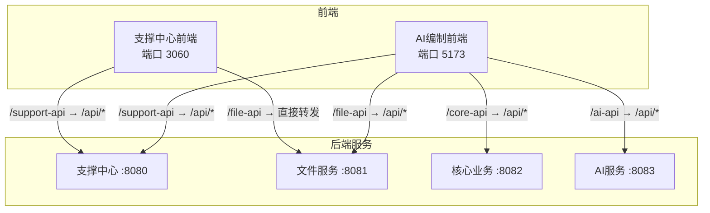
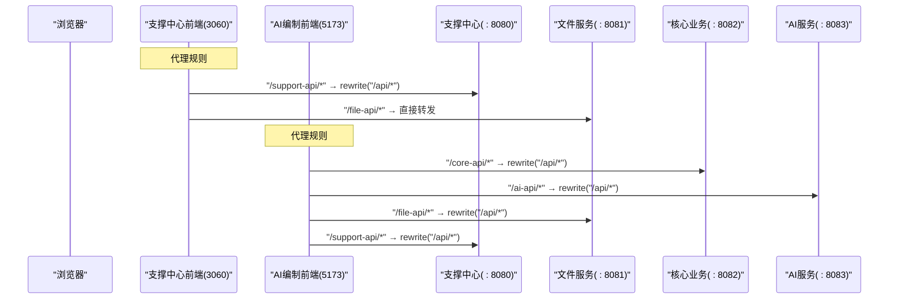
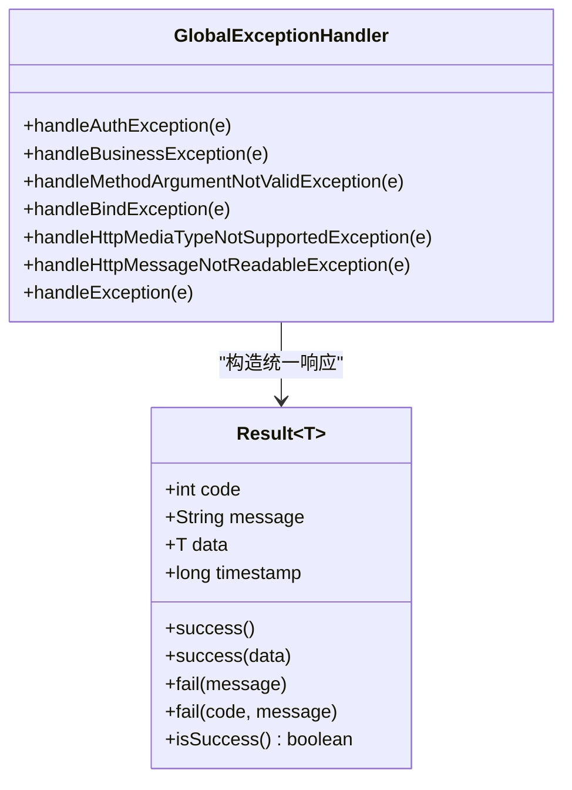
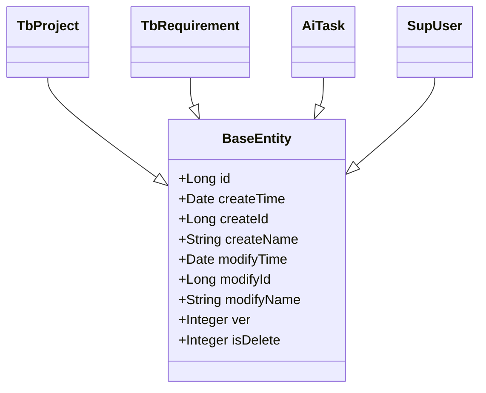
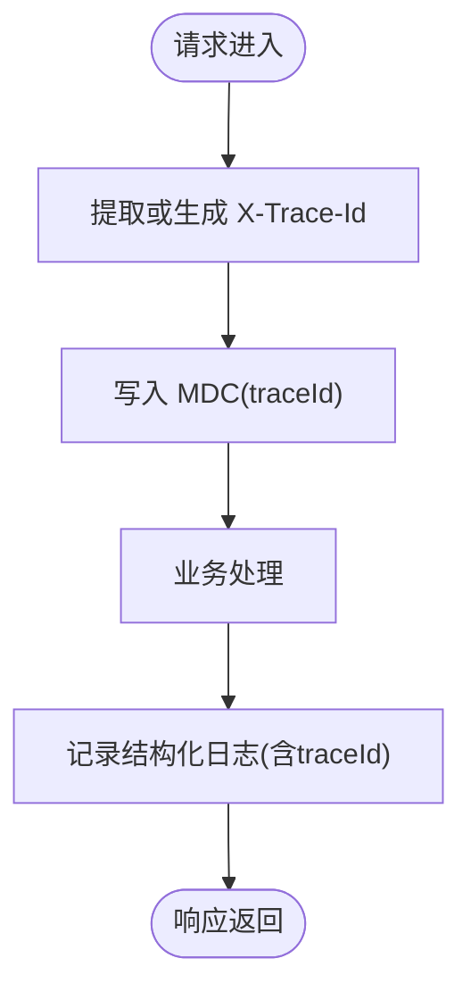
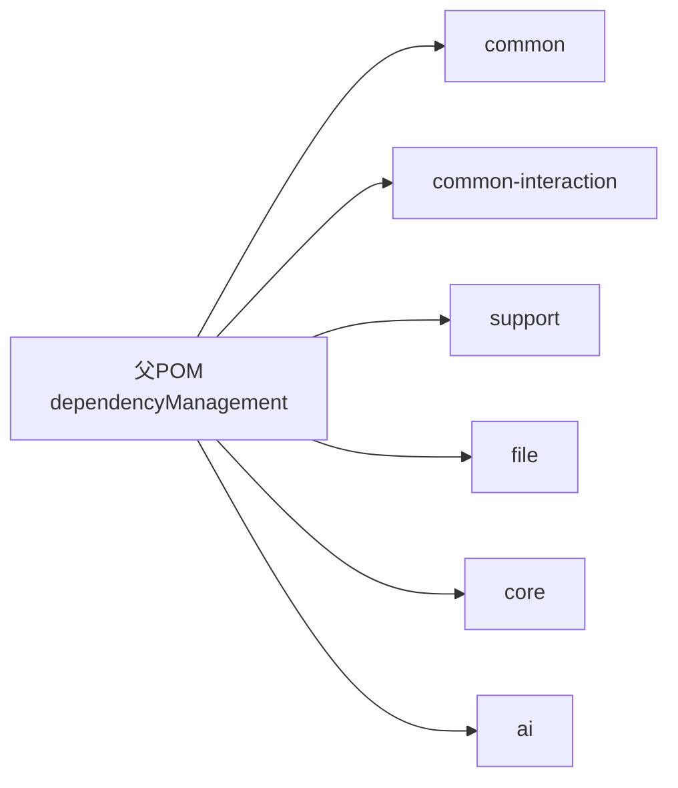

# 开发指南

<cite>
**本文引用的文件**   
- [CLAUDE.md](file://CLAUDE.md)
- [PROJECT_SPEC_FINAL.md](file://docs/rules/PROJECT_SPEC_FINAL.md)
- [CODE_CONVENTIONS.md](file://docs/rules/CODE_CONVENTIONS.md)
- [FRONTEND_CONVENTIONS.md](file://docs/rules/FRONTEND_CONVENTIONS.md)
- [ele-ai-tender-system/pom.xml](file://ele-ai-tender-system/pom.xml)
- [Result.java](file://ele-ai-tender-system/ele-ai-tender-common/src/main/java/com/jy/eleaitender/common/response/Result.java)
- [BaseEntity.java](file://ele-ai-tender-system/ele-ai-tender-common/src/main/java/com/jy/eleaitender/common/entity/base/BaseEntity.java)
- [GlobalExceptionHandler.java](file://ele-ai-tender-system/ele-ai-tender-core/src/main/java/com/jy/eleaitender/core/handler/GlobalExceptionHandler.java)
- [logging-spring.xml（core）](file://ele-ai-tender-system/ele-ai-tender-core/src/main/resources/logging-spring.xml)
- [InteractionTraceSupport.java](file://ele-ai-tender-system/ele-ai-tender-interaction/ele-ai-tender-interaction-core/src/main/java/com/jy/eleaitender/interaction/core/support/InteractionTraceSupport.java)
- [MarkdownToDocumentConverterTest.java](file://ele-ai-tender-system/ele-ai-tender-file/src/test/java/com/jy/eleaitender/file/engine/MarkdownToDocumentConverterTest.java)
</cite>

## 目录
1. [简介](#简介)
2. [项目结构](#项目结构)
3. [核心组件](#核心组件)
4. [架构总览](#架构总览)
5. [详细组件分析](#详细组件分析)
6. [依赖与版本管理](#依赖与版本管理)
7. [性能与可观测性](#性能与可观测性)
8. [测试策略与实践](#测试策略与实践)
9. [开发与协作流程](#开发与协作流程)
10. [常见问题与排障](#常见问题与排障)
11. [结论](#结论)

## 简介
本指南面向招标文件AI编制系统的开发者，覆盖后端Java、前端TypeScript/Vue的编码规范、模块化架构、依赖与版本管理、环境配置、调试与测试实践、以及贡献与发布流程。目标是帮助团队在统一规范下高效协作，降低沟通成本与回归风险。

## 项目结构
系统采用“前后端分离 + 多模块后端”的架构：
- 双前端：支撑中心管理后台与AI编制业务前端，独立部署、独立代理规则
- 后端Maven多模块：公共库、交互协议库、Starter、支撑服务、文件服务、核心业务、AI服务

图表来源
- [CLAUDE.md](file://CLAUDE.md)
- [FRONTEND_CONVENTIONS.md](file://docs/rules/FRONTEND_CONVENTIONS.md)

章节来源
- [CLAUDE.md](file://CLAUDE.md)
- [PROJECT_SPEC_FINAL.md](file://docs/rules/PROJECT_SPEC_FINAL.md)
- [FRONTEND_CONVENTIONS.md](file://docs/rules/FRONTEND_CONVENTIONS.md)

## 核心组件
- 统一响应体 Result<T>：所有内部接口返回统一结构，HTTP状态码固定为200，业务错误通过code/message区分
- 基础实体 BaseEntity：自动填充创建/修改信息、乐观锁、逻辑删除
- 全局异常处理器 GlobalExceptionHandler：集中处理认证、参数校验、解析异常等，并输出友好消息
- 链路追踪 InteractionTraceSupport：基于MDC的traceId传播工具

章节来源
- [Result.java](file://ele-ai-tender-system/ele-ai-tender-common/src/main/java/com/jy/eleaitender/common/response/Result.java)
- [BaseEntity.java](file://ele-ai-tender-system/ele-ai-tender-common/src/main/java/com/jy/eleaitender/common/entity/base/BaseEntity.java)
- [GlobalExceptionHandler.java](file://ele-ai-tender-system/ele-ai-tender-core/src/main/java/com/jy/eleaitender/core/handler/GlobalExceptionHandler.java)
- [InteractionTraceSupport.java](file://ele-ai-tender-system/ele-ai-tender-interaction/ele-ai-tender-interaction-core/src/main/java/com/jy/eleaitender/interaction/core/support/InteractionTraceSupport.java)

## 架构总览
下图展示从浏览器到各后端服务的请求路径与重写规则，体现前后端联调与跨域代理策略。

图表来源
- [FRONTEND_CONVENTIONS.md](file://docs/rules/FRONTEND_CONVENTIONS.md)
- [CLAUDE.md](file://CLAUDE.md)

## 详细组件分析

### 统一响应与异常处理
- 统一响应结构：成功/失败工厂方法封装，便于前端一致化处理
- 全局异常分类处理：认证异常、业务异常、参数校验异常、媒体类型/JSON解析异常、兜底异常
- 统一返回HTTP 200，避免前端对HTTP状态码做分支判断

图表来源
- [Result.java](file://ele-ai-tender-system/ele-ai-tender-common/src/main/java/com/jy/eleaitender/common/response/Result.java)
- [GlobalExceptionHandler.java](file://ele-ai-tender-system/ele-ai-tender-core/src/main/java/com/jy/eleaitender/core/handler/GlobalExceptionHandler.java)

章节来源
- [CODE_CONVENTIONS.md](file://docs/rules/CODE_CONVENTIONS.md)
- [GlobalExceptionHandler.java](file://ele-ai-tender-system/ele-ai-tender-core/src/main/java/com/jy/eleaitender/core/handler/GlobalExceptionHandler.java)

### 数据模型与持久化约定
- 所有实体继承 BaseEntity，获得id、审计字段、乐观锁、逻辑删除能力
- 表命名按模块前缀：sup_/file_/tb_/ai_
- 主键默认自增，必要时使用雪花算法；字段映射遵循驼峰与下划线自动转换

图表来源
- [BaseEntity.java](file://ele-ai-tender-system/ele-ai-tender-common/src/main/java/com/jy/eleaitender/common/entity/base/BaseEntity.java)
- [PROJECT_SPEC_FINAL.md](file://docs/rules/PROJECT_SPEC_FINAL.md)

章节来源
- [CODE_CONVENTIONS.md](file://docs/rules/CODE_CONVENTIONS.md)
- [PROJECT_SPEC_FINAL.md](file://docs/rules/PROJECT_SPEC_FINAL.md)

### 日志与链路追踪
- 统一日志滚动策略与分级输出（INFO/WARN/ERROR），便于定位问题
- 全链路traceId通过MDC键 traceId 传播，支持跨服务关联

图表来源
- [InteractionTraceSupport.java](file://ele-ai-tender-system/ele-ai-tender-interaction/ele-ai-tender-interaction-core/src/main/java/com/jy/eleaitender/interaction/core/support/InteractionTraceSupport.java)
- [logging-spring.xml（core）](file://ele-ai-tender-system/ele-ai-tender-core/src/main/resources/logging-spring.xml)

章节来源
- [CODE_CONVENTIONS.md](file://docs/rules/CODE_CONVENTIONS.md)
- [logging-spring.xml（core）](file://ele-ai-tender-system/ele-ai-tender-core/src/main/resources/logging-spring.xml)

## 依赖与版本管理
- 父POM集中声明第三方依赖版本，子模块仅引用groupId+artifactId
- 关键基线：JDK 21、Spring Boot 3.2.2、MyBatis-Plus 3.5.5、MySQL 8.4.0、Redisson、SpringDoc、Hutool、Lombok、Spring AI、Milvus、POI-TL、Flexmark等
- 对外交互兼容JDK 8的模块需单独维护编译目标

图表来源
- [ele-ai-tender-system/pom.xml](file://ele-ai-tender-system/pom.xml)

章节来源
- [ele-ai-tender-system/pom.xml](file://ele-ai-tender-system/pom.xml)
- [PROJECT_SPEC_FINAL.md](file://docs/rules/PROJECT_SPEC_FINAL.md)

## 性能与可观测性
- 日志分级与滚动策略控制磁盘占用，建议按天/大小切分并保留合理周期
- 链路追踪贯穿调用链，结合业务埋点快速定位瓶颈
- 大模型相关接口建议使用流式响应与超时控制，避免长事务阻塞

[本节为通用指导，不直接分析具体文件]

## 测试策略与实践
- 单元测试：以JUnit为主，针对核心转换器、引擎类编写用例，确保边界条件与空输入健壮性
- 集成测试：围绕Service层与外部依赖（数据库、缓存、向量库）进行隔离测试
- 端到端测试：基于前端代理与后端服务联调，验证关键用户旅程（登录→创建项目→需求生成→检测→评审）

示例参考（Markdown转文档转换器）：
- 空白/空字符串输入应返回非null且内容为空
- 标题、列表、加粗、斜体、行内代码等元素转换正确性断言

章节来源
- [MarkdownToDocumentConverterTest.java](file://ele-ai-tender-system/ele-ai-tender-file/src/test/java/com/jy/eleaitender/file/engine/MarkdownToDocumentConverterTest.java)

## 开发与协作流程
- 新功能开发
  - 明确需求与影响范围，更新相关spec与接口文档
  - 新增包/类遵循分层与命名规范，DTO按归属放置于对应模块
  - 提交前执行前端构建与后端测试
- Bug修复
  - 复现问题并补充单测，修复后回归相关用例
  - 若涉及公共模块变更，先install再clean compile依赖模块
- 文档更新
  - 规范类文档放 docs/rules/，接入指南放 docs/guides/，需求与计划分别放 docs/projects/ 与 docs/plans/
- 贡献者指南
  - 遵循编码规范与安全要求，保持JWT密钥、签名secret等敏感信息不落盘
  - 日志脱敏，禁止记录完整Token、口令、二进制内容

章节来源
- [CLAUDE.md](file://CLAUDE.md)
- [CODE_CONVENTIONS.md](file://docs/rules/CODE_CONVENTIONS.md)
- [PROJECT_SPEC_FINAL.md](file://docs/rules/PROJECT_SPEC_FINAL.md)

## 常见问题与排障
- common模块变更后编译报错
  - 现象：依赖模块报找不到符号或运行时 Unresolved compilation problems
  - 处理：先 install common，再对各依赖模块 clean compile，最后重启服务
- 启动失败或安全配置缺失
  - 现象：密钥未配置导致启动拒绝
  - 处理：按安全规范在启动时校验并抛出异常，禁止静默降级
- 前端代理不通
  - 现象：本地开发无法访问后端
  - 处理：核对 vite.config.ts 中代理前缀与重写规则，确认后端服务已启动
- 日志无traceId
  - 现象：跨服务无法串联日志
  - 处理：检查过滤器/拦截器是否正确设置MDC键 traceId，并在出站请求透传X-Trace-Id

章节来源
- [CLAUDE.md](file://CLAUDE.md)
- [CODE_CONVENTIONS.md](file://docs/rules/CODE_CONVENTIONS.md)
- [FRONTEND_CONVENTIONS.md](file://docs/rules/FRONTEND_CONVENTIONS.md)

## 结论
通过统一的编码规范、清晰的模块边界、集中的依赖管理与完善的异常/日志/追踪机制，本项目能够在保证质量的前提下持续演进。建议在迭代中坚持“代码优先、文档同步”的原则，配合严格的测试与审查流程，持续提升交付效率与稳定性。