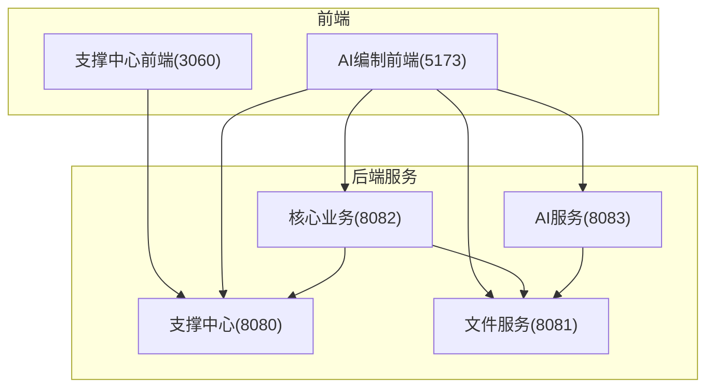
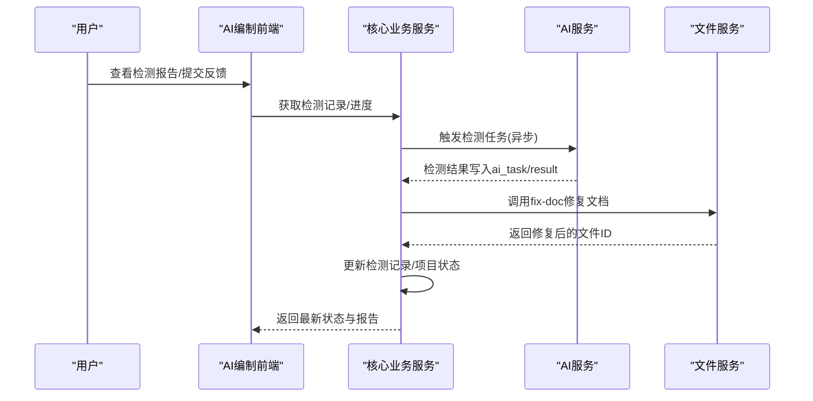
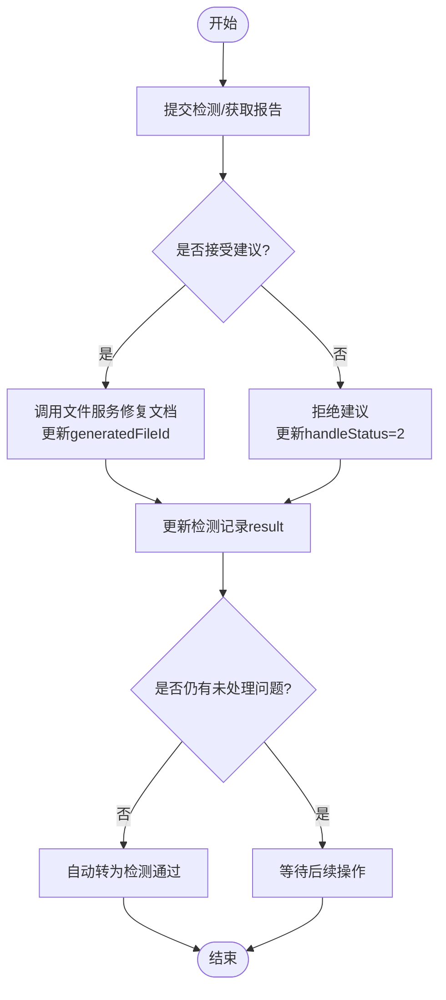
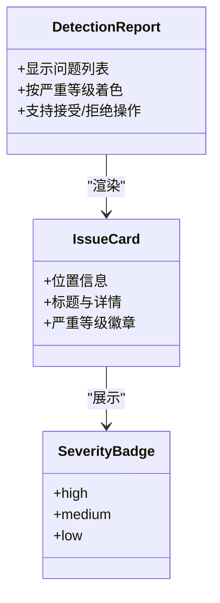
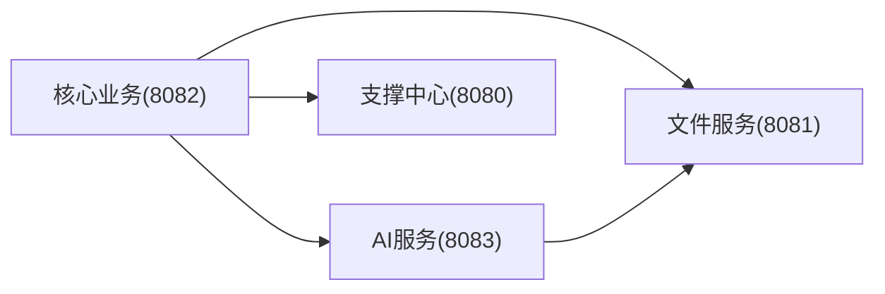

# Bug修复流程

<cite>
**本文引用的文件**   
- [CLAUDE.md](file://CLAUDE.md)
- [PROJECT_SPEC_FINAL.md](file://docs/rules/PROJECT_SPEC_FINAL.md)
- [CODE_CONVENTIONS.md](file://docs/rules/CODE_CONVENTIONS.md)
- [CORE_MODULE_SPEC.md](file://docs/rules/CORE_MODULE_SPEC.md)
- [AI_MODULE_SPEC.md](file://docs/rules/AI_MODULE_SPEC.md)
- [FILE_SERVICE_SPEC.md](file://docs/rules/FILE_SERVICE_SPEC.md)
- [FRONTEND_CONVENTIONS.md](file://docs/rules/FRONTEND_CONVENTIONS.md)
- [DetectionServiceImpl.java](file://ele-ai-tender-system/ele-ai-tender-core/src/main/java/com/jy/eleaitender/core/service/impl/DetectionServiceImpl.java)
- [DetectionResultParser.java](file://ele-ai-tender-system/ele-ai-tender-core/src/main/java/com/jy/eleaitender/core/util/DetectionResultParser.java)
- [GlobalExceptionHandlerTest.java](file://ele-ai-tender-system/ele-ai-tender-core/src/test/java/com/jy/eleaitender/core/handler/GlobalExceptionHandlerTest.java)
- [InteractionGlobalExceptionHandler.java](file://ele-ai-tender-system/ele-ai-tender-interaction/ele-ai-tender-interaction-autoconfigure/src/main/java/com/jy/eleaitender/interaction/autoconfigure/handler/InteractionGlobalExceptionHandler.java)
- [ResponseCode.java](file://ele-ai-tender-system/ele-ai-tender-common/src/main/java/com/jy/eleaitender/common/enums/ResponseCode.java)
- [DetectionReport.vue](file://ele-ai-tender-frontend/src/components/detection/DetectionReport.vue)
</cite>

## 目录
1. [引言](#引言)
2. [项目结构](#项目结构)
3. [核心组件](#核心组件)
4. [架构总览](#架构总览)
5. [详细组件分析](#详细组件分析)
6. [依赖分析](#依赖分析)
7. [性能考虑](#性能考虑)
8. [故障排查指南](#故障排查指南)
9. [结论](#结论)
10. [附录](#附录)

## 引言
本规范为“招标文件AI编制系统”建立统一的Bug修复流程，覆盖从问题发现、报告、分级、定位与修复、回归验证到发布与复盘的全生命周期。目标是在多模块（支撑中心、文件服务、核心业务、AI服务）与双前端（管理后台、业务前端）的复杂环境下，确保缺陷可追溯、修复可控、质量可度量。

## 项目结构
本项目采用前后端分离与多后端服务架构：
- 前端：支撑中心管理后台（端口3060）、AI编制业务前端（端口5173）
- 后端：支撑中心（8080）、文件服务（8081）、核心业务（8082）、AI服务（8083）
- 公共库：common、交互协议库 common-interaction、Starter interaction

图表来源
- [CLAUDE.md:101-115](file://CLAUDE.md#L101-L115)
- [PROJECT_SPEC_FINAL.md:15-27](file://docs/rules/PROJECT_SPEC_FINAL.md#L15-L27)

章节来源
- [CLAUDE.md:101-115](file://CLAUDE.md#L101-L115)
- [PROJECT_SPEC_FINAL.md:15-27](file://docs/rules/PROJECT_SPEC_FINAL.md#L15-L27)

## 核心组件
围绕Bug修复的关键能力与约束来自以下规范与实现：
- 统一返回结构与错误码：内部接口使用统一Result，错误码按范围划分；交互接口使用InteractionResult
- 全局异常处理：各模块需实现GlobalExceptionHandler，兜底异常不暴露敏感信息
- 检测与文档修复链路：接受/拒绝检测建议后自动尝试修复并推进状态
- 前端检测展示：检测报告按严重等级高亮显示，便于快速定位

章节来源
- [CODE_CONVENTIONS.md:95-150](file://docs/rules/CODE_CONVENTIONS.md#L95-L150)
- [CODE_CONVENTIONS.md:274-310](file://docs/rules/CODE_CONVENTIONS.md#L274-L310)
- [ResponseCode.java:39-167](file://ele-ai-tender-system/ele-ai-tender-common/src/main/java/com/jy/eleaitender/common/enums/ResponseCode.java#L39-L167)
- [GlobalExceptionHandlerTest.java:1-22](file://ele-ai-tender-system/ele-ai-tender-core/src/test/java/com/jy/eleaitender/core/handler/GlobalExceptionHandlerTest.java#L1-L22)
- [InteractionGlobalExceptionHandler.java:31-69](file://ele-ai-tender-system/ele-ai-tender-interaction/ele-ai-tender-interaction-autoconfigure/src/main/java/com/jy/eleaitender/interaction/autoconfigure/handler/InteractionGlobalExceptionHandler.java#L31-L69)
- [DetectionServiceImpl.java:308-422](file://ele-ai-tender-system/ele-ai-tender-core/src/main/java/com/jy/eleaitender/core/service/impl/DetectionServiceImpl.java#L308-L422)
- [DetectionReport.vue:342-418](file://ele-ai-tender-frontend/src/components/detection/DetectionReport.vue#L342-L418)

## 架构总览
下图展示了Bug修复在系统中的关键路径：用户在前端提交检测或反馈 → 核心服务编排检测与修复 → AI服务执行检测 → 文件服务生成/修复文档 → 结果回写与状态流转。

图表来源
- [CORE_MODULE_SPEC.md:155-195](file://docs/rules/CORE_MODULE_SPEC.md#L155-L195)
- [AI_MODULE_SPEC.md:49-100](file://docs/rules/AI_MODULE_SPEC.md#L49-L100)
- [FILE_SERVICE_SPEC.md:73-93](file://docs/rules/FILE_SERVICE_SPEC.md#L73-L93)
- [DetectionServiceImpl.java:308-422](file://ele-ai-tender-system/ele-ai-tender-core/src/main/java/com/jy/eleaitender/core/service/impl/DetectionServiceImpl.java#L308-L422)

## 详细组件分析

### 一、Bug报告标准格式与信息要求
为保证问题可复现、可定位，所有Bug报告必须包含以下字段：
- 基本信息
  - 标题：一句话描述问题现象
  - 模块：如“核心业务/文件服务/AI服务/支撑中心/前端”
  - 环境：开发/测试/预发/生产，JDK/Spring Boot/浏览器版本等
  - 关联单号：需求/迭代/变更单号（如有）
- 复现步骤
  - 前置条件：账号权限、数据准备、配置项
  - 操作步骤：编号步骤，尽量最小化复现场景
  - 期望行为：符合规范的预期结果
  - 实际行为：真实发生的结果（含错误提示、日志片段、截图/录屏）
- 影响面
  - 功能影响：是否阻断主流程
  - 数据影响：是否存在数据不一致或丢失风险
  - 安全影响：是否涉及越权、泄露、注入等
- 证据材料
  - 请求/响应（脱敏）：URL、方法、参数、响应体
  - 日志：时间戳、TraceId、关键堆栈
  - 截图/录屏：页面状态、控制台输出
- 优先级与时效（见下一节）

章节来源
- [CODE_CONVENTIONS.md:95-150](file://docs/rules/CODE_CONVENTIONS.md#L95-L150)
- [FRONTEND_CONVENTIONS.md:27-44](file://docs/rules/FRONTEND_CONVENTIONS.md#L27-L44)

### 二、Bug优先级分类与处理时效
建议采用四级分类，结合影响面与紧急程度确定优先级与SLA：
- 严重（P0）
  - 定义：主流程阻断、数据损坏、安全漏洞、线上大面积不可用
  - 时效：立即响应，2小时内给出临时方案，24小时内修复上线
- 重要（P1）
  - 定义：核心功能受损但可绕行，或影响部分用户
  - 时效：4小时内响应，48小时内修复上线
- 一般（P2）
  - 定义：非核心功能异常、UI/文案问题、偶发且影响小
  - 时效：1个工作日内响应，3个工作日内修复上线
- 低优先（P3）
  - 定义：体验优化、建议类问题
  - 时效：纳入迭代计划，按排期修复

说明：
- 若涉及外部系统对接（交互协议），参考交互异常处理规范，避免将内部细节暴露给调用方
- 错误码与消息遵循统一规范，便于前端一致化处理

章节来源
- [CODE_CONVENTIONS.md:274-310](file://docs/rules/CODE_CONVENTIONS.md#L274-L310)
- [InteractionGlobalExceptionHandler.java:31-69](file://ele-ai-tender-system/ele-ai-tender-interaction/ele-ai-tender-interaction-autoconfigure/src/main/java/com/jy/eleaitender/interaction/autoconfigure/handler/InteractionGlobalExceptionHandler.java#L31-L69)
- [ResponseCode.java:39-167](file://ele-ai-tender-system/ele-ai-tender-common/src/main/java/com/jy/eleaitender/common/enums/ResponseCode.java#L39-L167)

### 三、Bug修复开发流程
#### 1) 问题定位
- 通过TraceId串联跨服务日志，定位到具体模块与服务
- 核对接口契约与错误码，确认是参数校验、业务规则还是系统异常
- 对AI相关缺陷，检查ai_task状态与result字段，确认是否处于PROCESSING/COMPLETED(result_synced)阶段

章节来源
- [CLAUDE.md:151-158](file://CLAUDE.md#L151-L158)
- [CORE_MODULE_SPEC.md:187-213](file://docs/rules/CORE_MODULE_SPEC.md#L187-L213)

#### 2) 根因分析
- 区分输入侧（前端/上游服务）与实现侧（Service/Mapper/外部依赖）
- 关注边界条件与并发场景（如唯一索引冲突、乐观锁失败）
- 对AI生成类问题，检查Prompt、模型路由、线程池与超时策略

章节来源
- [CORE_MODULE_SPEC.md:264-274](file://docs/rules/CORE_MODULE_SPEC.md#L264-L274)
- [AI_MODULE_SPEC.md:143-161](file://docs/rules/AI_MODULE_SPEC.md#L143-L161)

#### 3) 修复方案设计
- 明确改动范围与影响面，评估是否需要灰度/回滚策略
- 对检测修复链路，确保locationRef精准定位与降级全文匹配均健壮
- 对交互接口，保证错误码与消息符合交互协议

章节来源
- [FILE_SERVICE_SPEC.md:73-93](file://docs/rules/FILE_SERVICE_SPEC.md#L73-L93)
- [InteractionGlobalExceptionHandler.java:31-69](file://ele-ai-tender-system/ele-ai-tender-interaction/ele-ai-tender-interaction-autoconfigure/src/main/java/com/jy/eleaitender/interaction/autoconfigure/handler/InteractionGlobalExceptionHandler.java#L31-L69)

#### 4) 代码实现
- 遵循分层职责与命名规范，Controller仅做参数接收与封装
- 统一异常处理，兜底异常不暴露SQL等敏感信息
- 新增错误码登记于ResponseCode枚举，保持错误码范围清晰

章节来源
- [CODE_CONVENTIONS.md:186-272](file://docs/rules/CODE_CONVENTIONS.md#L186-L272)
- [GlobalExceptionHandlerTest.java:1-22](file://ele-ai-tender-system/ele-ai-tender-core/src/test/java/com/jy/eleaitender/core/handler/GlobalExceptionHandlerTest.java#L1-L22)
- [ResponseCode.java:39-167](file://ele-ai-tender-system/ele-ai-tender-common/src/main/java/com/jy/eleaitender/common/enums/ResponseCode.java#L39-L167)

#### 5) 回归测试策略
- 单元/集成测试：覆盖异常分支与边界条件（如非法JSON、空值、越界）
- 端到端用例：走通检测→接受→修复→状态流转全流程
- 回归矩阵：按模块×功能点×优先级制定用例集，P0/P1必过

章节来源
- [DetectionResultParser.java:81-156](file://ele-ai-tender-system/ele-ai-tender-core/src/main/java/com/jy/eleaitender/core/util/DetectionResultParser.java#L81-L156)
- [DetectionServiceImpl.java:308-422](file://ele-ai-tender-system/ele-ai-tender-core/src/main/java/com/jy/eleaitender/core/service/impl/DetectionServiceImpl.java#L308-L422)

#### 6) 发布与复盘
- 发布前完成构建与测试（前端npm run build，后端mvn clean test）
- 发布后观察监控指标与错误率，必要时回滚
- 复盘沉淀至docs/projects/，形成知识库条目

章节来源
- [CLAUDE.md:99-100](file://CLAUDE.md#L99-L100)
- [PROJECT_SPEC_FINAL.md:81-91](file://docs/rules/PROJECT_SPEC_FINAL.md#L81-L91)

### 四、检测与建议修复流程（示例）
该流程体现了“检测→接受→修复→状态流转”的闭环，可作为典型Bug修复的回归基线。

图表来源
- [DetectionServiceImpl.java:308-422](file://ele-ai-tender-system/ele-ai-tender-core/src/main/java/com/jy/eleaitender/core/service/impl/DetectionServiceImpl.java#L308-L422)
- [DetectionResultParser.java:121-156](file://ele-ai-tender-system/ele-ai-tender-core/src/main/java/com/jy/eleaitender/core/util/DetectionResultParser.java#L121-L156)
- [FILE_SERVICE_SPEC.md:73-93](file://docs/rules/FILE_SERVICE_SPEC.md#L73-L93)

### 五、前端检测展示与严重等级
前端检测报告按严重等级进行视觉区分，便于快速识别高风险问题。

图表来源
- [DetectionReport.vue:342-418](file://ele-ai-tender-frontend/src/components/detection/DetectionReport.vue#L342-L418)

## 依赖分析
- 模块耦合
  - core ↔ ai：通过ai_task表异步解耦，无直接HTTP调用
  - core → file：文件上传/下载、文档修复、文本提取
  - core/support：认证与权限
- 外部依赖
  - MySQL、Redis、Milvus、大模型API
- 接口契约
  - 统一返回结构、错误码范围、交互协议独立DTO

图表来源
- [CLAUDE.md:153-158](file://CLAUDE.md#L153-L158)
- [PROJECT_SPEC_FINAL.md:40-46](file://docs/rules/PROJECT_SPEC_FINAL.md#L40-L46)

章节来源
- [CLAUDE.md:153-158](file://CLAUDE.md#L153-L158)
- [PROJECT_SPEC_FINAL.md:40-46](file://docs/rules/PROJECT_SPEC_FINAL.md#L40-L46)

## 性能考虑
- 检测与修复链路应避免长事务，外部IO（文件服务）尽量异步或限流
- AI任务注意线程池与用户并发控制，防止堆积
- 前端轮询任务进度时合理设置间隔，避免频繁请求

章节来源
- [AI_MODULE_SPEC.md:143-161](file://docs/rules/AI_MODULE_SPEC.md#L143-L161)
- [FRONTEND_CONVENTIONS.md:45-56](file://docs/rules/FRONTEND_CONVENTIONS.md#L45-L56)

## 故障排查指南
- 全局异常兜底
  - 各模块GlobalExceptionHandler需打印完整堆栈，兜底异常message为空时使用类名，且不暴露SQL等敏感信息
- 交互接口异常
  - 参数绑定/校验失败统一返回400，异常信息拼接字段级错误
- 检测修复失败
  - 检查locationRef定位是否成功，必要时回退全文档匹配
  - 关注批量修复时的异常捕获与计数统计
- 错误码与消息
  - 新增错误码登记于ResponseCode，保持范围清晰与语义明确

章节来源
- [GlobalExceptionHandlerTest.java:1-22](file://ele-ai-tender-system/ele-ai-tender-core/src/test/java/com/jy/eleaitender/core/handler/GlobalExceptionHandlerTest.java#L1-L22)
- [InteractionGlobalExceptionHandler.java:31-69](file://ele-ai-tender-system/ele-ai-tender-interaction/ele-ai-tender-interaction-autoconfigure/src/main/java/com/jy/eleaitender/interaction/autoconfigure/handler/InteractionGlobalExceptionHandler.java#L31-L69)
- [DetectionServiceImpl.java:308-422](file://ele-ai-tender-system/ele-ai-tender-core/src/main/java/com/jy/eleaitender/core/service/impl/DetectionServiceImpl.java#L308-L422)
- [ResponseCode.java:39-167](file://ele-ai-tender-system/ele-ai-tender-common/src/main/java/com/jy/eleaitender/common/enums/ResponseCode.java#L39-L167)

## 结论
通过标准化的Bug报告、分级、修复与回归流程，结合统一的异常处理与错误码体系，可在多模块与AI能力交织的系统内实现高效、可控的质量改进。建议在每次修复后沉淀案例与度量指标，持续优化流程与工具链。

## 附录

### A. 紧急Bug热修复流程
- 快速响应
  - P0事件立即拉起应急群，指定Owner与沟通节奏
- 临时解决方案
  - 开关降级、白名单放行、只读模式、跳过检测等
- 长期修复计划
  - 根因分析与补丁设计，最小化变更，补充测试用例
- 发布与回滚
  - 灰度发布，监控告警，一键回滚预案
- 复盘与沉淀
  - 复盘报告归档至docs/projects/，更新规范与SOP

[本节为通用流程说明，无需源码引用]

### B. Bug统计分析与质量度量
- 指标建议
  - 缺陷密度（每千行代码Bug数）
  - 平均修复时长（MTTR）
  - 回归缺陷率（修复引入的新问题占比）
  - 严重缺陷占比（P0/P1占比）
  - 一次通过率（首次修复即关闭比例）
- 数据来源
  - 缺陷管理系统、CI/CD流水线、监控与日志平台
- 改进闭环
  - 月度质量评审，聚焦Top问题类型与根因，推动规范落地与工具建设

[本节为通用方法论说明，无需源码引用]