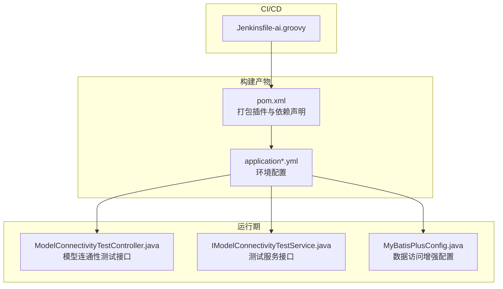
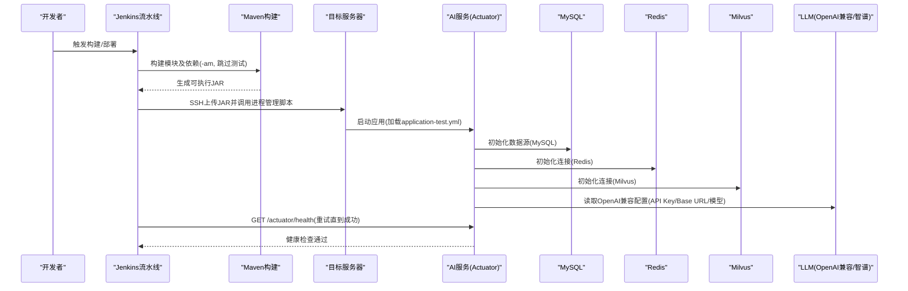
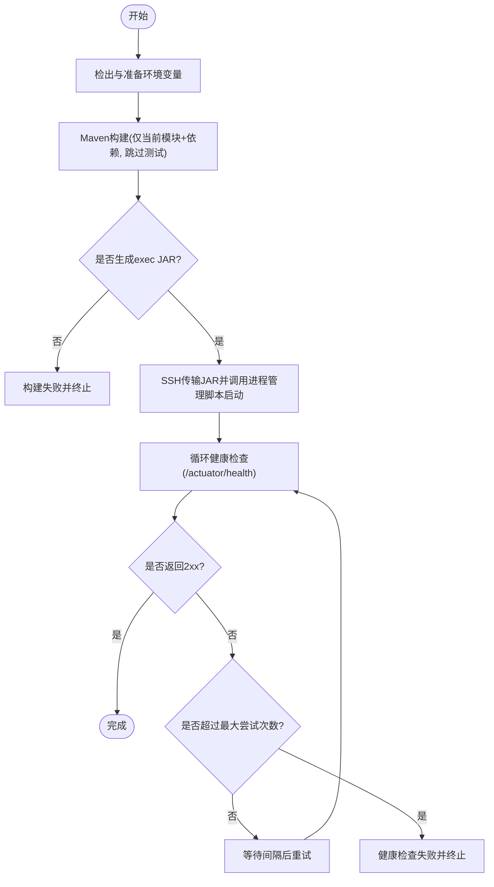
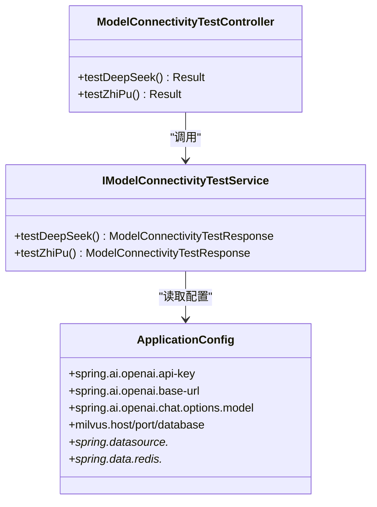
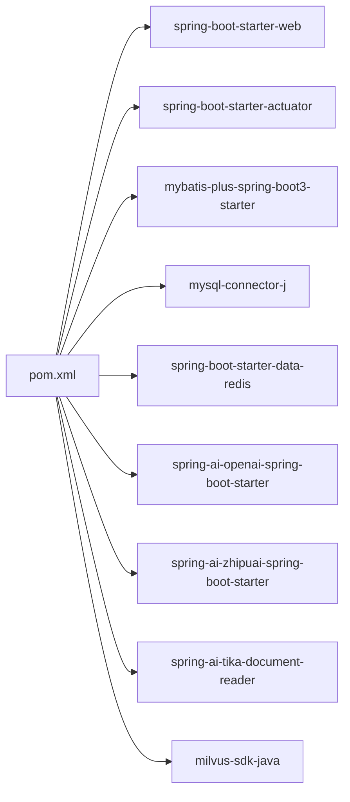

# AI服务流水线

<cite>
**本文引用的文件**   
- [Jenkinsfile-ai.groovy](file://Jenkinsfile-ai.groovy)
- [ele-ai-tender-ai/pom.xml](file://ele-ai-tender-system/ele-ai-tender-ai/pom.xml)
- [application.yml](file://ele-ai-tender-system/ele-ai-tender-ai/src/main/resources/application.yml)
- [application-dev.yml](file://ele-ai-tender-system/ele-ai-tender-ai/src/main/resources/application-dev.yml)
- [application-test.yml](file://ele-ai-tender-system/ele-ai-tender-ai/src/main/resources/application-test.yml)
- [ModelConnectivityTestController.java](file://ele-ai-tender-system/ele-ai-tender-ai/src/main/java/com/jy/eleaitender/ai/controller/ModelConnectivityTestController.java)
- [IModelConnectivityTestService.java](file://ele-ai-tender-system/ele-ai-tender-ai/src/main/java/com/jy/eleaitender/ai/service/IModelConnectivityTestService.java)
- [MyBatisPlusConfig.java](file://ele-ai-tender-system/ele-ai-tender-ai/src/main/java/com/jy/eleaitender/ai/config/MyBatisPlusConfig.java)
</cite>

## 目录
1. [简介](#简介)
2. [项目结构](#项目结构)
3. [核心组件](#核心组件)
4. [架构总览](#架构总览)
5. [详细组件分析](#详细组件分析)
6. [依赖分析](#依赖分析)
7. [性能考虑](#性能考虑)
8. [故障排查指南](#故障排查指南)
9. [结论](#结论)
10. [附录](#附录)

## 简介
本文件为AI服务(ele-ai-tender-ai)的CI/CD流水线配置与部署运维文档，聚焦以下目标：
- 说明AI服务的特殊构建需求，包括Spring AI相关依赖的处理和模型配置的集成
- 详细介绍流水线的环境变量配置，特别是与AI模型相关的参数设置
- 解释构建过程中的性能优化策略，如并行构建与缓存利用
- 说明部署时的AI服务特定配置，包括模型连接测试与向量数据库初始化
- 提供AI服务特有的监控指标与健康检查端点配置
- 包含AI服务部署后的验证流程与常见问题排查方法

## 项目结构
AI服务位于ele-ai-tender-system/ele-ai-tender-ai模块，采用Maven多模块工程组织。流水线通过Jenkinsfile-ai.groovy驱动，执行检出、构建、部署与健康检查等阶段。

图示来源
- [Jenkinsfile-ai.groovy:1-132](file://Jenkinsfile-ai.groovy#L1-L132)
- [ele-ai-tender-ai/pom.xml:1-129](file://ele-ai-tender-system/ele-ai-tender-ai/pom.xml#L1-L129)
- [application.yml:1-72](file://ele-ai-tender-system/ele-ai-tender-ai/src/main/resources/application.yml#L1-L72)
- [ModelConnectivityTestController.java:1-37](file://ele-ai-tender-system/ele-ai-tender-ai/src/main/java/com/jy/eleaitender/ai/controller/ModelConnectivityTestController.java#L1-L37)
- [IModelConnectivityTestService.java:1-11](file://ele-ai-tender-system/ele-ai-tender-ai/src/main/java/com/jy/eleaitender/ai/service/IModelConnectivityTestService.java#L1-L11)
- [MyBatisPlusConfig.java:1-22](file://ele-ai-tender-system/ele-ai-tender-ai/src/main/java/com/jy/eleaitender/ai/config/MyBatisPlusConfig.java#L1-L22)

章节来源
- [Jenkinsfile-ai.groovy:1-132](file://Jenkinsfile-ai.groovy#L1-L132)
- [ele-ai-tender-ai/pom.xml:1-129](file://ele-ai-tender-system/ele-ai-tender-ai/pom.xml#L1-L129)

## 核心组件
- CI/CD流水线（Jenkinsfile-ai.groovy）
  - 工具链：Maven、JDK21
  - 构建命令：仅构建当前模块及其上游依赖，跳过测试
  - 部署：SSH传输JAR到目标服务器并调用进程管理脚本启动
  - 健康检查：循环调用actuator/health直至成功或达到最大尝试次数
- 应用配置（application*.yml）
  - Spring AI OpenAI兼容客户端配置（API Key、Base URL、模型名）
  - Milvus向量数据库连接配置（host/port/database）
  - MySQL与Redis连接配置
  - JWT与内部文件服务地址
- 模型连通性测试接口
  - 提供DeepSeek/OpenAI兼容与智谱模型的连通性测试端点
- 数据访问增强
  - MyBatis Plus分页与乐观锁拦截器配置

章节来源
- [Jenkinsfile-ai.groovy:1-132](file://Jenkinsfile-ai.groovy#L1-L132)
- [application.yml:1-72](file://ele-ai-tender-system/ele-ai-tender-ai/src/main/resources/application.yml#L1-L72)
- [application-dev.yml:1-40](file://ele-ai-tender-system/ele-ai-tender-ai/src/main/resources/application-dev.yml#L1-L40)
- [application-test.yml:1-43](file://ele-ai-tender-system/ele-ai-tender-ai/src/main/resources/application-test.yml#L1-L43)
- [ModelConnectivityTestController.java:1-37](file://ele-ai-tender-system/ele-ai-tender-ai/src/main/java/com/jy/eleaitender/ai/controller/ModelConnectivityTestController.java#L1-L37)
- [IModelConnectivityTestService.java:1-11](file://ele-ai-tender-system/ele-ai-tender-ai/src/main/java/com/jy/eleaitender/ai/service/IModelConnectivityTestService.java#L1-L11)
- [MyBatisPlusConfig.java:1-22](file://ele-ai-tender-system/ele-ai-tender-ai/src/main/java/com/jy/eleaitender/ai/config/MyBatisPlusConfig.java#L1-L22)

## 架构总览
下图展示从Jenkins触发到服务健康检查的端到端流程，以及AI服务对外暴露的关键能力与外部依赖。

图示来源
- [Jenkinsfile-ai.groovy:1-132](file://Jenkinsfile-ai.groovy#L1-L132)
- [application.yml:1-72](file://ele-ai-tender-system/ele-ai-tender-ai/src/main/resources/application.yml#L1-L72)
- [application-test.yml:1-43](file://ele-ai-tender-system/ele-ai-tender-ai/src/main/resources/application-test.yml#L1-L43)

## 详细组件分析

### 流水线阶段与关键行为
- 检出阶段
  - 确定目标服务器、分支与环境变量
- 构建阶段
  - 使用Maven仅构建当前模块与其上游依赖，跳过测试以提升速度
  - 解析生成的exec JAR文件名用于后续部署
- 部署阶段
  - 通过SSH将JAR传输至目标服务器临时目录
  - 调用进程管理脚本以指定端口与JVM参数启动服务
- 健康检查阶段
  - 循环调用/actuator/health，支持最大尝试次数与间隔等待

图示来源
- [Jenkinsfile-ai.groovy:1-132](file://Jenkinsfile-ai.groovy#L1-L132)

章节来源
- [Jenkinsfile-ai.groovy:1-132](file://Jenkinsfile-ai.groovy#L1-L132)

### Spring AI与模型配置集成
- 依赖引入
  - 通过pom.xml引入Spring AI OpenAI兼容starter、智谱starter与Tika文档解析依赖
- 运行时配置
  - application.yml中定义openai.api-key、base-url与chat.options.model
  - 各环境配置文件覆盖数据库、Redis、Milvus、JWT与内部文件服务地址
- 模型连通性测试
  - 提供REST接口用于测试DeepSeek/OpenAI兼容与智谱模型连通性

图示来源
- [ModelConnectivityTestController.java:1-37](file://ele-ai-tender-system/ele-ai-tender-ai/src/main/java/com/jy/eleaitender/ai/controller/ModelConnectivityTestController.java#L1-L37)
- [IModelConnectivityTestService.java:1-11](file://ele-ai-tender-system/ele-ai-tender-ai/src/main/java/com/jy/eleaitender/ai/service/IModelConnectivityTestService.java#L1-L11)
- [application.yml:1-72](file://ele-ai-tender-system/ele-ai-tender-ai/src/main/resources/application.yml#L1-L72)

章节来源
- [ele-ai-tender-ai/pom.xml:81-105](file://ele-ai-tender-system/ele-ai-tender-ai/pom.xml#L81-L105)
- [application.yml:28-35](file://ele-ai-tender-system/ele-ai-tender-ai/src/main/resources/application.yml#L28-L35)
- [application-test.yml:16-18](file://ele-ai-tender-system/ele-ai-tender-ai/src/main/resources/application-test.yml#L16-L18)
- [ModelConnectivityTestController.java:1-37](file://ele-ai-tender-system/ele-ai-tender-ai/src/main/java/com/jy/eleaitender/ai/controller/ModelConnectivityTestController.java#L1-L37)
- [IModelConnectivityTestService.java:1-11](file://ele-ai-tender-system/ele-ai-tender-ai/src/main/java/com/jy/eleaitender/ai/service/IModelConnectivityTestService.java#L1-L11)

### 向量数据库(Milvus)初始化与连接
- 配置项
  - milvus.host、milvus.port、milvus.database通过环境变量或配置文件注入
- 初始化建议
  - 在部署前确保Milvus实例可达且数据库存在
  - 可在部署后通过业务接口或专用初始化任务创建集合与索引（具体逻辑由业务实现决定）

章节来源
- [application.yml:50-54](file://ele-ai-tender-system/ele-ai-tender-ai/src/main/resources/application.yml#L50-L54)
- [application-test.yml:24-27](file://ele-ai-tender-system/ele-ai-tender-ai/src/main/resources/application-test.yml#L24-L27)

### 数据访问增强(MyBatis Plus)
- 启用分页与乐观锁拦截器，提升查询性能与并发安全
- 适用于AI服务中的知识库、任务记录等数据表操作

章节来源
- [MyBatisPlusConfig.java:1-22](file://ele-ai-tender-system/ele-ai-tender-ai/src/main/java/com/jy/eleaitender/ai/config/MyBatisPlusConfig.java#L1-L22)

## 依赖分析
- 构建期依赖
  - Spring Boot Web、AOP、Actuator
  - MyBatis Plus Starter、MySQL Connector、Redis Starter
  - SpringDoc OpenAPI
  - Spring AI OpenAI兼容、智谱、Tika文档解析
  - Milvus SDK
- 运行期依赖
  - MySQL、Redis、Milvus、外部LLM服务(OpenAI兼容/智谱)

图示来源
- [ele-ai-tender-ai/pom.xml:1-129](file://ele-ai-tender-system/ele-ai-tender-ai/pom.xml#L1-L129)

章节来源
- [ele-ai-tender-ai/pom.xml:1-129](file://ele-ai-tender-system/ele-ai-tender-ai/pom.xml#L1-L129)

## 性能考虑
- 构建优化
  - 使用-m参数仅构建当前模块及其直接依赖，减少无关模块编译
  - 跳过测试(-DskipTests)缩短构建时间
  - 合理设置JVM堆大小(JAR_OPTS)，避免内存不足导致GC抖动
- 运行期优化
  - 调整日志级别，生产环境降低Spring AI日志输出
  - 合理配置Redis超时与连接池参数
  - 对Milvus连接进行连接复用与超时控制
- 流水线优化
  - 启用Jenkins缓存（Maven本地仓库、依赖镜像）以减少网络下载
  - 使用并行构建（若多模块独立）加速整体构建

[本节为通用指导，不直接分析具体文件]

## 故障排查指南
- 健康检查失败
  - 确认目标服务器IP与端口正确
  - 检查actuator/health是否可用，查看应用日志定位启动异常
  - 增加MAX_ATTEMPTS与INTERVAL以适应慢启动场景
- 模型连通性问题
  - 校验DEEPSEEK_API_KEY与DEEPSEEK_BASE_URL是否正确
  - 调用模型连通性测试接口验证OpenAI兼容与智谱模型连通性
- 向量数据库连接失败
  - 检查MILVUS_HOST/MILVUS_PORT/MILVUS_DATABASE配置
  - 确认Milvus服务状态与网络可达性
- 数据库/Redis连接失败
  - 核对SPRING_DATASOURCE_*与SPRING_DATA_REDIS_*环境变量
  - 检查防火墙与安全组规则

章节来源
- [Jenkinsfile-ai.groovy:97-129](file://Jenkinsfile-ai.groovy#L97-L129)
- [ModelConnectivityTestController.java:1-37](file://ele-ai-tender-system/ele-ai-tender-ai/src/main/java/com/jy/eleaitender/ai/controller/ModelConnectivityTestController.java#L1-L37)
- [application.yml:16-27](file://ele-ai-tender-system/ele-ai-tender-ai/src/main/resources/application.yml#L16-L27)
- [application.yml:50-54](file://ele-ai-tender-system/ele-ai-tender-ai/src/main/resources/application.yml#L50-L54)

## 结论
本流水线围绕AI服务的特性进行了针对性设计：通过Maven精准构建与跳过测试提升效率；通过环境变量集中管理AI模型与向量数据库连接；通过健康检查与模型连通性测试保障部署质量。建议在CI层引入依赖缓存与制品缓存，进一步缩短构建与部署时间。

[本节为总结，不直接分析具体文件]

## 附录

### 环境变量清单（AI服务）
- 应用基础
  - SERVER_PORT: 服务端口
  - APP_JWT_SECRET: JWT密钥
  - APP_JWT_EXPIRATION: JWT过期时间
  - APP_JWT_EXTERNAL_EXPIRATION: 外部JWT过期时间
- 数据源
  - SPRING_DATASOURCE_URL: MySQL连接URL
  - SPRING_DATASOURCE_USERNAME: 用户名
  - SPRING_DATASOURCE_PASSWORD: 密码
- Redis
  - SPRING_DATA_REDIS_HOST: 主机
  - SPRING_DATA_REDIS_PORT: 端口
  - SPRING_DATA_REDIS_PASSWORD: 密码
  - SPRING_DATA_REDIS_DATABASE: 库号
- AI模型
  - DEEPSEEK_API_KEY: OpenAI兼容API Key
  - DEEPSEEK_BASE_URL: OpenAI兼容Base URL
- 向量数据库
  - MILVUS_HOST: Milvus主机
  - MILVUS_PORT: Milvus端口
  - MILVUS_DATABASE: Milvus数据库
- 内部文件服务
  - INTERNAL_FILE_SERVICE_URL: 内部文件服务地址

章节来源
- [application.yml:16-35](file://ele-ai-tender-system/ele-ai-tender-ai/src/main/resources/application.yml#L16-L35)
- [application.yml:50-64](file://ele-ai-tender-system/ele-ai-tender-ai/src/main/resources/application.yml#L50-L64)
- [application-test.yml:1-43](file://ele-ai-tender-system/ele-ai-tender-ai/src/main/resources/application-test.yml#L1-L43)

### 部署后验证流程
- 健康检查
  - 调用/actuator/health，期望返回2xx
- 模型连通性测试
  - 调用DeepSeek/OpenAI兼容测试接口
  - 调用智谱模型测试接口
- 向量数据库连通性
  - 通过业务接口或初始化任务验证Milvus连接与集合可用性
- 功能验证
  - 调用AI对话、文本优化、建议获取等接口，验证SSE流式响应与同步响应

章节来源
- [Jenkinsfile-ai.groovy:97-129](file://Jenkinsfile-ai.groovy#L97-L129)
- [ModelConnectivityTestController.java:1-37](file://ele-ai-tender-system/ele-ai-tender-ai/src/main/java/com/jy/eleaitender/ai/controller/ModelConnectivityTestController.java#L1-L37)