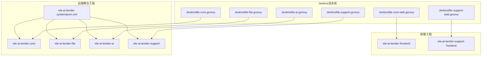
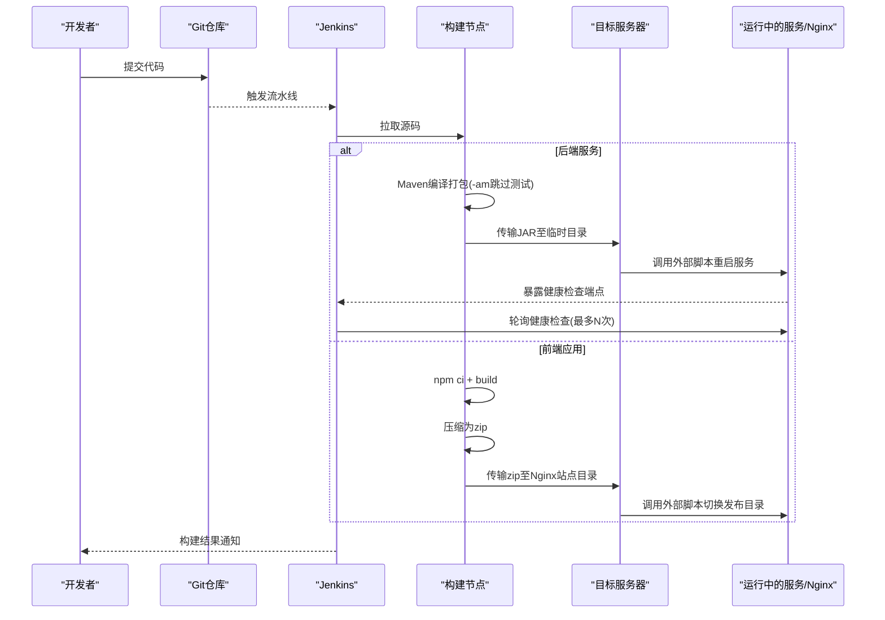
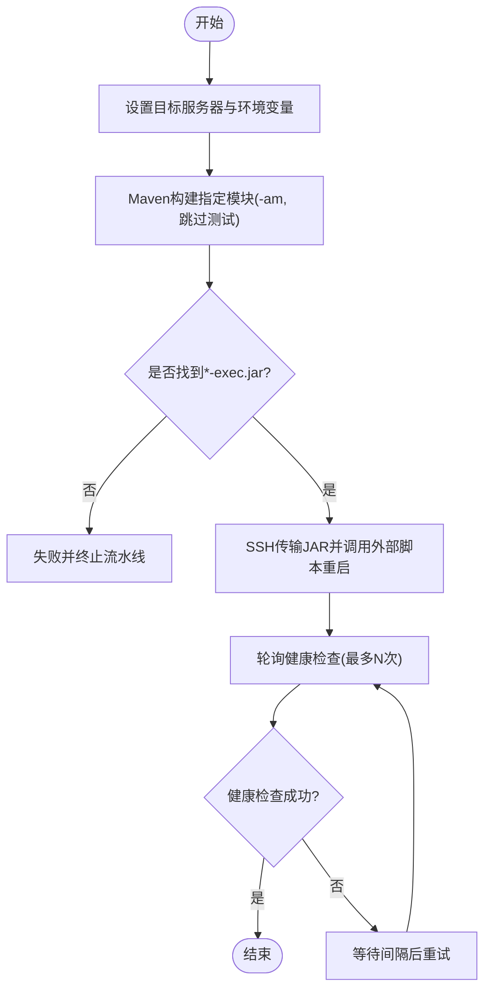
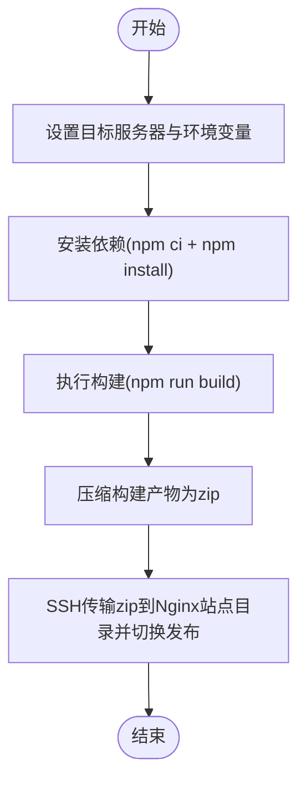
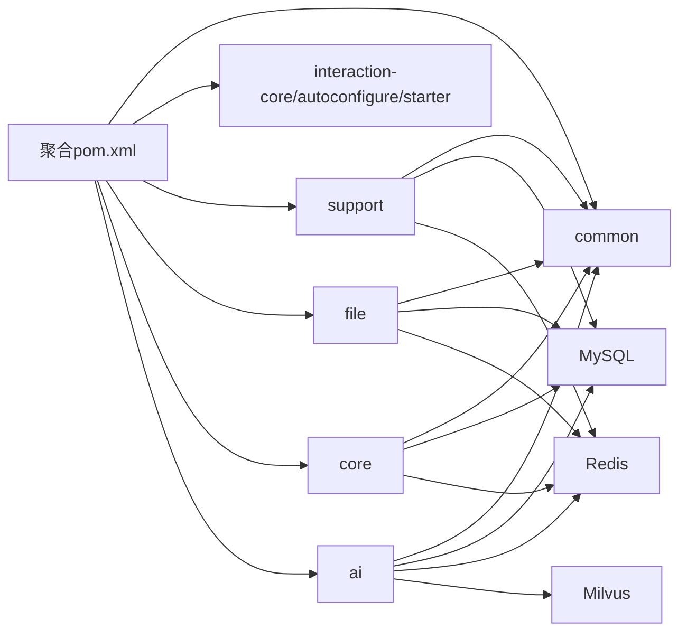

# CI/CD流水线配置

<cite>
**本文引用的文件列表**
- [Jenkinsfile-core.groovy](file://Jenkinsfile-core.groovy)
- [Jenkinsfile-file.groovy](file://Jenkinsfile-file.groovy)
- [Jenkinsfile-ai.groovy](file://Jenkinsfile-ai.groovy)
- [Jenkinsfile-support.groovy](file://Jenkinsfile-support.groovy)
- [Jenkinsfile-core-web.groovy](file://Jenkinsfile-core-web.groovy)
- [Jenkinsfile-support-web.groovy](file://Jenkinsfile-support-web.groovy)
- [pom.xml](file://ele-ai-tender-system/pom.xml)
- [application.yml（core）](file://ele-ai-tender-system/ele-ai-tender-core/src/main/resources/application.yml)
- [application.yml（ai）](file://ele-ai-tender-system/ele-ai-tender-ai/src/main/resources/application.yml)
- [application.yml（file）](file://ele-ai-tender-system/ele-ai-tender-file/src/main/resources/application.yml)
- [application.yml（support）](file://ele-ai-tender-system/ele-ai-tender-support/src/main/resources/application.yml)
- [package.json（前端主站）](file://ele-ai-tender-frontend/package.json)
- [package.json（支持端）](file://ele-ai-tender-support-frontend/package.json)
</cite>

## 目录
1. [简介](#简介)
2. [项目结构](#项目结构)
3. [核心组件](#核心组件)
4. [架构总览](#架构总览)
5. [详细组件分析](#详细组件分析)
6. [依赖关系分析](#依赖关系分析)
7. [性能与并行构建策略](#性能与并行构建策略)
8. [Docker镜像构建与推送（建议方案）](#docker镜像构建与推送建议方案)
9. [多环境部署策略](#多环境部署策略)
10. [监控与告警机制](#监控与告警机制)
11. [故障排查指南](#故障排查指南)
12. [结论](#结论)

## 简介
本文件为“招标文件AI编制系统”的CI/CD流水线配置文档，覆盖后端Java服务与前端静态资源的构建、打包、部署全流程。当前仓库已提供基于Jenkins的多条流水线脚本，分别对应：
- 后端服务：core、file、ai、support
- 前端应用：主站web、支持端web

文档将详细说明各阶段职责、执行顺序、健康检查、环境变量注入方式、以及后续可落地的优化项（如单元测试、集成测试、代码质量检查、Docker镜像构建与推送、多环境差异化配置、监控告警等）。

## 项目结构
仓库采用前后端分离与多模块后端组织：
- 后端聚合工程位于 ele-ai-tender-system，包含多个Spring Boot子模块（common、interaction、support、file、core、ai），通过Maven统一版本管理。
- 前端两个独立Vue工程：ele-ai-tender-frontend 与 ele-ai-tender-support-frontend，使用Vite构建并输出静态资源。
- Jenkins流水线以Groovy脚本形式维护在仓库根目录，按服务维度拆分，便于独立触发与回滚。

图表来源
- [pom.xml:15-23](file://ele-ai-tender-system/pom.xml#L15-L23)
- [Jenkinsfile-core.groovy:1-25](file://Jenkinsfile-core.groovy#L1-L25)
- [Jenkinsfile-file.groovy:1-25](file://Jenkinsfile-file.groovy#L1-L25)
- [Jenkinsfile-ai.groovy:1-25](file://Jenkinsfile-ai.groovy#L1-L25)
- [Jenkinsfile-support.groovy:1-25](file://Jenkinsfile-support.groovy#L1-L25)
- [Jenkinsfile-core-web.groovy:1-25](file://Jenkinsfile-core-web.groovy#L1-L25)
- [Jenkinsfile-support-web.groovy:1-25](file://Jenkinsfile-support-web.groovy#L1-L25)

章节来源
- [pom.xml:1-260](file://ele-ai-tender-system/pom.xml#L1-L260)
- [Jenkinsfile-core.groovy:1-132](file://Jenkinsfile-core.groovy#L1-L132)
- [Jenkinsfile-file.groovy:1-132](file://Jenkinsfile-file.groovy#L1-L132)
- [Jenkinsfile-ai.groovy:1-132](file://Jenkinsfile-ai.groovy#L1-L132)
- [Jenkinsfile-support.groovy:1-132](file://Jenkinsfile-support.groovy#L1-L132)
- [Jenkinsfile-core-web.groovy:1-104](file://Jenkinsfile-core-web.groovy#L1-L104)
- [Jenkinsfile-support-web.groovy:1-104](file://Jenkinsfile-support-web.groovy#L1-L104)

## 核心组件
- Maven聚合工程与工具链
  - JDK 21、Maven、Node.js 22.x（前端）
  - Spring Boot 3.2.x、MyBatis Plus、MySQL、Redis、JWT等
- 后端服务
  - core：业务编排与流程引擎
  - file：文件处理与存储
  - ai：AI能力接入与任务处理
  - support：支撑服务（用户、权限、系统参数等）
- 前端应用
  - 主站web：面向投标业务的前端页面
  - 支持端web：管理与运维相关的前端页面
- Jenkins流水线
  - 每个服务一个流水线脚本，包含Checkout、Build、Deploy、Check等阶段
  - 后端通过SSH传输JAR到目标服务器并调用外部启动脚本；前端通过SSH传输zip包到Nginx站点目录并调用外部切换脚本

章节来源
- [pom.xml:25-66](file://ele-ai-tender-system/pom.xml#L25-L66)
- [application.yml（core）:1-68](file://ele-ai-tender-system/ele-ai-tender-core/src/main/resources/application.yml#L1-L68)
- [application.yml（ai）:1-72](file://ele-ai-tender-system/ele-ai-tender-ai/src/main/resources/application.yml#L1-L72)
- [application.yml（file）:1-63](file://ele-ai-tender-system/ele-ai-tender-file/src/main/resources/application.yml#L1-L63)
- [application.yml（support）:1-68](file://ele-ai-tender-system/ele-ai-tender-support/src/main/resources/application.yml#L1-L68)
- [package.json（前端主站）:1-49](file://ele-ai-tender-frontend/package.json#L1-L49)
- [package.json（支持端）:1-35](file://ele-ai-tender-support-frontend/package.json#L1-L35)

## 架构总览
下图展示从代码提交到服务上线的整体流水线路径，包括后端与前端两条主线。

图表来源
- [Jenkinsfile-core.groovy:46-132](file://Jenkinsfile-core.groovy#L46-L132)
- [Jenkinsfile-file.groovy:46-132](file://Jenkinsfile-file.groovy#L46-L132)
- [Jenkinsfile-ai.groovy:46-132](file://Jenkinsfile-ai.groovy#L46-L132)
- [Jenkinsfile-support.groovy:46-132](file://Jenkinsfile-support.groovy#L46-L132)
- [Jenkinsfile-core-web.groovy:38-104](file://Jenkinsfile-core-web.groovy#L38-L104)
- [Jenkinsfile-support-web.groovy:38-104](file://Jenkinsfile-support-web.groovy#L38-L104)

## 详细组件分析

### 后端服务流水线（core/file/ai/support）
- 通用阶段
  - Checkout：设置目标服务器IP、环境标识、计算盘符等
  - Build：进入聚合工程目录，针对指定模块执行Maven package，自动构建上游依赖，跳过测试
  - Deploy：通过SSH将JAR上传至目标服务器临时目录，并调用外部启动脚本完成替换与重启
  - Check：轮询访问actuator健康端点，成功即视为部署完成
- 差异点
  - 端口与内存参数在各脚本中独立配置
  - 健康检查URL使用各自端口

图表来源
- [Jenkinsfile-core.groovy:26-132](file://Jenkinsfile-core.groovy#L26-L132)
- [Jenkinsfile-file.groovy:26-132](file://Jenkinsfile-file.groovy#L26-L132)
- [Jenkinsfile-ai.groovy:26-132](file://Jenkinsfile-ai.groovy#L26-L132)
- [Jenkinsfile-support.groovy:26-132](file://Jenkinsfile-support.groovy#L26-L132)

章节来源
- [Jenkinsfile-core.groovy:1-132](file://Jenkinsfile-core.groovy#L1-L132)
- [Jenkinsfile-file.groovy:1-132](file://Jenkinsfile-file.groovy#L1-L132)
- [Jenkinsfile-ai.groovy:1-132](file://Jenkinsfile-ai.groovy#L1-L132)
- [Jenkinsfile-support.groovy:1-132](file://Jenkinsfile-support.groovy#L1-L132)

### 前端应用流水线（core-web / support-web）
- 通用阶段
  - Checkout：设置目标服务器与环境变量、计算盘符
  - Init：安装依赖（npm ci + npm install）
  - Build：执行构建命令生成静态资源
  - Dryrun：将构建产物压缩为zip（用于后续传输）
  - Deploy：通过SSH传输zip到Nginx站点目录，并调用外部脚本进行软链接或目录切换
- 差异点
  - APP_DIR指向不同前端工程目录
  - 打包文件名与Nginx站点目录路径不同

图表来源
- [Jenkinsfile-core-web.groovy:18-104](file://Jenkinsfile-core-web.groovy#L18-L104)
- [Jenkinsfile-support-web.groovy:18-104](file://Jenkinsfile-support-web.groovy#L18-L104)

章节来源
- [Jenkinsfile-core-web.groovy:1-104](file://Jenkinsfile-core-web.groovy#L1-L104)
- [Jenkinsfile-support-web.groovy:1-104](file://Jenkinsfile-support-web.groovy#L1-L104)

## 依赖关系分析
- 后端模块依赖
  - 聚合工程通过dependencyManagement统一管理版本，子模块按需引入
  - 各服务均依赖common与common-interaction等基础能力
- 运行时依赖
  - MySQL、Redis、JWT、内部文件服务URL等通过环境变量注入
  - AI服务额外依赖向量数据库Milvus与OpenAI兼容接口配置

图表来源
- [pom.xml:15-23](file://ele-ai-tender-system/pom.xml#L15-L23)
- [pom.xml:68-124](file://ele-ai-tender-system/pom.xml#L68-L124)
- [application.yml（ai）:28-35](file://ele-ai-tender-system/ele-ai-tender-ai/src/main/resources/application.yml#L28-L35)
- [application.yml（ai）:50-54](file://ele-ai-tender-system/ele-ai-tender-ai/src/main/resources/application.yml#L50-L54)

章节来源
- [pom.xml:1-260](file://ele-ai-tender-system/pom.xml#L1-L260)
- [application.yml（core）:16-27](file://ele-ai-tender-system/ele-ai-tender-core/src/main/resources/application.yml#L16-L27)
- [application.yml（ai）:16-35](file://ele-ai-tender-system/ele-ai-tender-ai/src/main/resources/application.yml#L16-L35)
- [application.yml（file）:20-31](file://ele-ai-tender-system/ele-ai-tender-file/src/main/resources/application.yml#L20-L31)
- [application.yml（support）:16-27](file://ele-ai-tender-system/ele-ai-tender-support/src/main/resources/application.yml#L16-L27)

## 性能与并行构建策略
- 当前状态
  - 各服务流水线独立存在，可在Jenkins中并行触发，避免相互阻塞
  - 构建阶段默认跳过测试，缩短构建时间
- 优化建议
  - 并行化聚合构建：在单条流水线中使用parallel对多个服务同时执行Maven构建，减少整体耗时
  - 缓存加速：
    - Maven本地仓库缓存（~/.m2）
    - Node_modules缓存（node_modules目录）
  - 增量构建：仅构建变更模块（-pl）已在现有脚本中使用，保持现状即可
  - 资源隔离：为不同流水线分配专用Agent，避免CPU/IO争用
  - 超时与并发控制：保留disableConcurrentBuilds与timeout，防止长时间占用节点

[本节为通用指导，不直接分析具体文件]

## Docker镜像构建与推送（建议方案）
当前仓库未包含Dockerfile与镜像推送步骤，以下为推荐落地方案：
- 构建阶段
  - 使用多阶段构建：第一阶段编译打包（Maven），第二阶段仅复制JAR与JRE，减小镜像体积
  - 标签策略：
    - 分支名：例如 feature/xxx
    - 提交短哈希：例如 abcdef12
    - 语义化版本：例如 v1.2.3
    - 组合标签：app:branch-commit 与 app:latest
- 推送阶段
  - 登录私有镜像仓库（Harbor/阿里云ACR等）
  - 推送镜像并记录镜像地址与标签
- 部署阶段
  - 根据环境选择镜像标签（dev/test/prod）
  - 通过Kubernetes或容器编排平台滚动更新
- 安全与合规
  - 扫描镜像漏洞（Trivy/Clair）
  - 签名镜像（Cosign）

[本节为概念性方案，不映射到具体源文件]

## 多环境部署策略
- 环境变量驱动
  - 所有关键配置（数据库、Redis、JWT、内部服务URL、AI密钥等）均通过环境变量注入，便于在不同环境切换
- 当前流水线
  - 脚本中固定了目标服务器与APP_ENV=test，实际部署时可通过Jenkins参数化构建传入不同环境值
- 建议实践
  - 开发环境：最小资源、开启调试日志、允许Swagger
  - 测试环境：稳定依赖、关闭Swagger、启用限流与审计
  - 生产环境：严格资源限制、关闭调试、启用灰度与熔断、完善监控与告警

章节来源
- [application.yml（core）:1-68](file://ele-ai-tender-system/ele-ai-tender-core/src/main/resources/application.yml#L1-L68)
- [application.yml（ai）:1-72](file://ele-ai-tender-system/ele-ai-tender-ai/src/main/resources/application.yml#L1-L72)
- [application.yml（file）:1-63](file://ele-ai-tender-system/ele-ai-tender-file/src/main/resources/application.yml#L1-L63)
- [application.yml（support）:1-68](file://ele-ai-tender-system/ele-ai-tender-support/src/main/resources/application.yml#L1-L68)
- [Jenkinsfile-core.groovy:27-44](file://Jenkinsfile-core.groovy#L27-L44)
- [Jenkinsfile-file.groovy:27-44](file://Jenkinsfile-file.groovy#L27-L44)
- [Jenkinsfile-ai.groovy:27-44](file://Jenkinsfile-ai.groovy#L27-L44)
- [Jenkinsfile-support.groovy:27-44](file://Jenkinsfile-support.groovy#L27-L44)

## 监控与告警机制
- 健康检查
  - 后端服务通过actuator/health端点进行健康检查，流水线在部署后轮询确认服务可用
- 建议增强
  - 构建指标：收集每次构建时长、成功率、失败原因分类
  - 服务指标：采集JVM内存、GC、线程池、请求延迟与错误率
  - 告警通道：钉钉/企业微信/邮件/短信，失败立即通知
  - 可视化：Grafana+Prometheus或云监控平台

章节来源
- [Jenkinsfile-core.groovy:97-132](file://Jenkinsfile-core.groovy#L97-L132)
- [Jenkinsfile-file.groovy:97-132](file://Jenkinsfile-file.groovy#L97-L132)
- [Jenkinsfile-ai.groovy:97-132](file://Jenkinsfile-ai.groovy#L97-L132)
- [Jenkinsfile-support.groovy:97-132](file://Jenkinsfile-support.groovy#L97-L132)

## 故障排查指南
- 常见构建问题
  - Maven依赖下载失败：检查网络与镜像仓库配置，清理本地缓存重试
  - Node依赖安装失败：确认Node版本一致，优先使用npm ci
  - 找不到*-exec.jar：检查Maven插件配置与打包产物命名
- 部署问题
  - SSH连接失败：核对Jenkins凭据与目标服务器可达性
  - 外部启动脚本异常：查看目标服务器日志与进程状态
  - 健康检查失败：检查端口、防火墙、服务启动日志
- 性能问题
  - 构建慢：启用缓存、并行构建、减少不必要的依赖
  - 服务启动慢：调整JVM参数、预热依赖、异步初始化

章节来源
- [Jenkinsfile-core.groovy:46-132](file://Jenkinsfile-core.groovy#L46-L132)
- [Jenkinsfile-file.groovy:46-132](file://Jenkinsfile-file.groovy#L46-L132)
- [Jenkinsfile-ai.groovy:46-132](file://Jenkinsfile-ai.groovy#L46-L132)
- [Jenkinsfile-support.groovy:46-132](file://Jenkinsfile-support.groovy#L46-L132)
- [Jenkinsfile-core-web.groovy:38-104](file://Jenkinsfile-core-web.groovy#L38-L104)
- [Jenkinsfile-support-web.groovy:38-104](file://Jenkinsfile-support-web.groovy#L38-L104)

## 结论
当前CI/CD流水线已实现后端服务与前端应用的自动化构建与部署，具备健康检查与基本容错能力。建议在后续迭代中逐步引入单元测试与集成测试、代码质量门禁、Docker镜像构建与推送、多环境差异化配置与完善的监控告警体系，以提升交付质量与稳定性。

[本节为总结性内容，不直接分析具体文件]