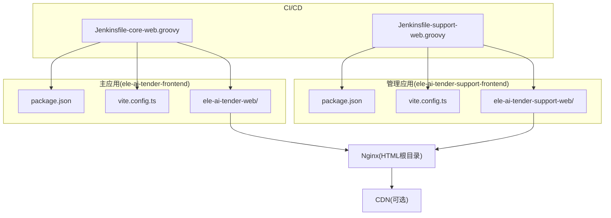
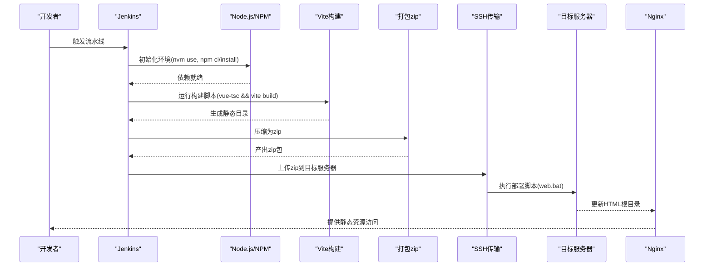
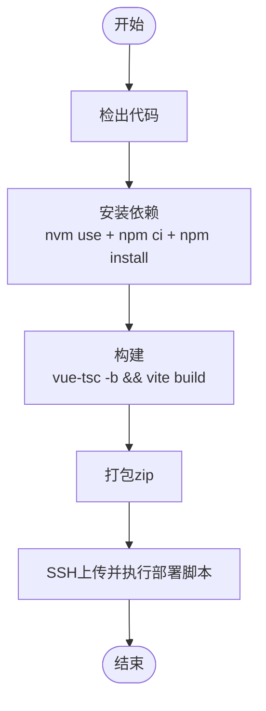
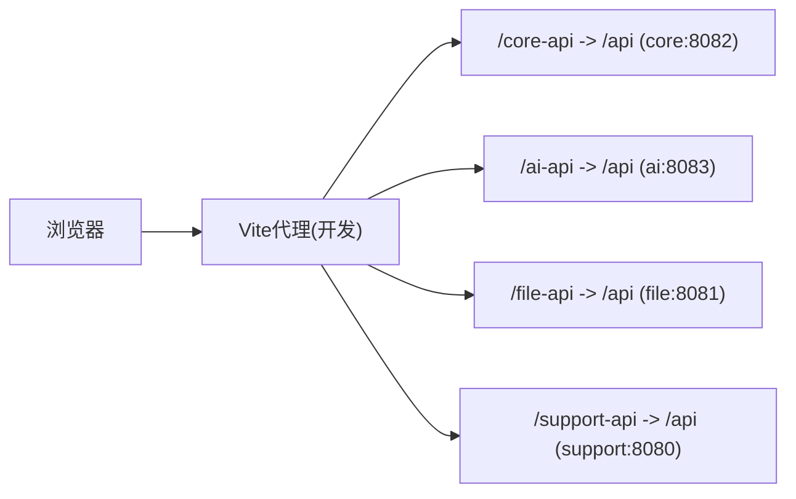
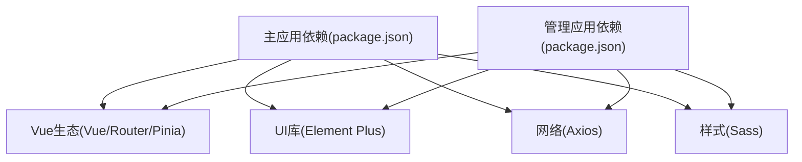

# 前端应用流水线

<cite>
**本文引用的文件**
- [Jenkinsfile-core-web.groovy](file://Jenkinsfile-core-web.groovy)
- [Jenkinsfile-support-web.groovy](file://Jenkinsfile-support-web.groovy)
- [ele-ai-tender-frontend/package.json](file://ele-ai-tender-frontend/package.json)
- [ele-ai-tender-support-frontend/package.json](file://ele-ai-tender-support-frontend/package.json)
- [ele-ai-tender-frontend/vite.config.ts](file://ele-ai-tender-frontend/vite.config.ts)
- [ele-ai-tender-support-frontend/vite.config.ts](file://ele-ai-tender-support-frontend/vite.config.ts)
- [FRONTEND_CONVENTIONS.md](file://docs/rules/FRONTEND_CONVENTIONS.md)
</cite>

## 目录
1. [简介](#简介)
2. [项目结构](#项目结构)
3. [核心组件](#核心组件)
4. [架构总览](#架构总览)
5. [详细组件分析](#详细组件分析)
6. [依赖关系分析](#依赖关系分析)
7. [性能考虑](#性能考虑)
8. [故障排查指南](#故障排查指南)
9. [结论](#结论)
10. [附录](#附录)

## 简介
本文件面向 CI/CD 与运维团队，系统化梳理两个前端应用的构建与部署流水线：主应用 ele-ai-tender-frontend（业务编制端）与管理应用 ele-ai-tender-support-frontend（支撑中心管理后台）。文档覆盖 Node.js 环境、npm 依赖安装、Vue + TypeScript + Vite 的构建流程、资源压缩与分包策略、Nginx 静态部署与 CDN 分发建议、版本管理与缓存策略、性能优化要点以及上线后的页面加载测试与功能验证流程。

## 项目结构
仓库包含两个独立的前端工程，分别对应不同的业务域与端口：
- 主应用：ele-ai-tender-frontend（默认开发端口 5173）
- 管理应用：ele-ai-tender-support-frontend（默认开发端口 3060）

两者均基于 Vue 3 + TypeScript + Vite + Element Plus + Pinia 技术栈，采用相同的技术选型与相近的构建配置。

图表来源
- [Jenkinsfile-core-web.groovy:1-104](file://Jenkinsfile-core-web.groovy#L1-L104)
- [Jenkinsfile-support-web.groovy:1-104](file://Jenkinsfile-support-web.groovy#L1-L104)
- [ele-ai-tender-frontend/package.json:1-49](file://ele-ai-tender-frontend/package.json#L1-L49)
- [ele-ai-tender-support-frontend/package.json:1-35](file://ele-ai-tender-support-frontend/package.json#L1-L35)
- [ele-ai-tender-frontend/vite.config.ts:1-106](file://ele-ai-tender-frontend/vite.config.ts#L1-L106)
- [ele-ai-tender-support-frontend/vite.config.ts:1-75](file://ele-ai-tender-support-frontend/vite.config.ts#L1-L75)

章节来源
- [FRONTEND_CONVENTIONS.md:1-43](file://docs/rules/FRONTEND_CONVENTIONS.md#L1-L43)

## 核心组件
- 构建脚本与工具链
  - 使用 npm scripts 定义 dev/build/preview 等命令，统一通过 vue-tsc 进行类型检查后执行 vite build。
  - 开发模式支持多环境变量模式 localdev/test，生产模式为 production。
- 构建产物输出
  - 主应用输出目录：ele-ai-tender-web
  - 管理应用输出目录：ele-ai-tender-support-web
- 代理与环境变量
  - 开发阶段通过 Vite server.proxy 将 /core-api、/ai-api、/file-api、/support-api 等前缀转发到后端服务，路径重写为 /api。
  - 生产环境 base 路径分别为 /ele-ai-tender-web/ 与 /ele-ai-tender-support-web/，需配合 Nginx 路由。
- 打包优化
  - 关闭 sourcemap；设置 chunkSizeWarningLimit；对 element-plus 与 vue/vue-router/pinia 进行手动分包，利于浏览器缓存与并行加载。

章节来源
- [ele-ai-tender-frontend/package.json:6-13](file://ele-ai-tender-frontend/package.json#L6-L13)
- [ele-ai-tender-support-frontend/package.json:6-13](file://ele-ai-tender-support-frontend/package.json#L6-L13)
- [ele-ai-tender-frontend/vite.config.ts:61-105](file://ele-ai-tender-frontend/vite.config.ts#L61-L105)
- [ele-ai-tender-support-frontend/vite.config.ts:24-74](file://ele-ai-tender-support-frontend/vite.config.ts#L24-L74)

## 架构总览
下图展示从代码提交到静态资源发布的全链路：Jenkins 拉取代码、安装依赖、构建产物、打包 zip、SSH 上传至目标服务器并触发部署脚本，最终由 Nginx 提供静态访问。

图表来源
- [Jenkinsfile-core-web.groovy:18-101](file://Jenkinsfile-core-web.groovy#L18-L101)
- [Jenkinsfile-support-web.groovy:18-101](file://Jenkinsfile-support-web.groovy#L18-L101)

## 详细组件分析

### 主应用(ele-ai-tender-frontend)流水线
- 环境准备
  - 在 Jenkins 中声明 NodeJS 工具版本，并在 Init 阶段使用 nvm 切换指定版本，随后执行 npm ci 与 npm install 确保依赖一致性与可重复构建。
- 构建过程
  - 调用 npm run build，先执行 vue-tsc 类型检查，再执行 vite build。
  - 生产构建输出目录为 ele-ai-tender-web，base 路径为 /ele-ai-tender-web/。
- 打包与部署
  - 使用 7-Zip 将构建产物压缩为 zip，并通过 sshPublisher 上传至目标服务器的 HTML 根目录，最后执行 web.bat 完成替换与回滚逻辑。

图表来源
- [Jenkinsfile-core-web.groovy:38-101](file://Jenkinsfile-core-web.groovy#L38-L101)

章节来源
- [Jenkinsfile-core-web.groovy:10-17](file://Jenkinsfile-core-web.groovy#L10-L17)
- [Jenkinsfile-core-web.groovy:38-77](file://Jenkinsfile-core-web.groovy#L38-L77)
- [Jenkinsfile-core-web.groovy:78-101](file://Jenkinsfile-core-web.groovy#L78-L101)
- [ele-ai-tender-frontend/package.json:6-13](file://ele-ai-tender-frontend/package.json#L6-L13)
- [ele-ai-tender-frontend/vite.config.ts:61-105](file://ele-ai-tender-frontend/vite.config.ts#L61-L105)

### 管理应用(ele-ai-tender-support-frontend)流水线
- 环境准备与构建步骤与主应用一致，差异在于：
  - 应用名与输出目录不同：ele-ai-tender-support-web
  - 开发端口不同：3060
  - 代理规则略有差异：/file-api 直接转发，/support-api 重写为 /api
- 打包与部署同样通过 7-Zip 压缩与 sshPublisher 上传，并执行同一套部署脚本。

图表来源
- [Jenkinsfile-support-web.groovy:38-101](file://Jenkinsfile-support-web.groovy#L38-L101)

章节来源
- [Jenkinsfile-support-web.groovy:10-17](file://Jenkinsfile-support-web.groovy#L10-L17)
- [Jenkinsfile-support-web.groovy:38-77](file://Jenkinsfile-support-web.groovy#L38-L77)
- [Jenkinsfile-support-web.groovy:78-101](file://Jenkinsfile-support-web.groovy#L78-L101)
- [ele-ai-tender-support-frontend/package.json:6-13](file://ele-ai-tender-support-frontend/package.json#L6-L13)
- [ele-ai-tender-support-frontend/vite.config.ts:24-74](file://ele-ai-tender-support-frontend/vite.config.ts#L24-L74)

### 构建与代理配置详解
- 环境变量与代理
  - 主应用读取 VITE_CORE_API_URL、VITE_AI_API_URL、VITE_FILE_API_URL、VITE_SUPPORT_API_URL，并将 /core-api、/ai-api、/file-api、/support-api 前缀请求转发到对应后端服务，同时重写为 /api。
  - 管理应用读取 VITE_FILE_API_URL、VITE_SUPPORT_API_URL，/support-api 重写为 /api，/file-api 直接转发。
- 生产 base 路径
  - 主应用：/ele-ai-tender-web/
  - 管理应用：/ele-ai-tender-support-web/
- 分包与体积控制
  - 关闭 sourcemap；chunkSizeWarningLimit 设为 1500；element-plus 与 vue/vue-router/pinia 单独分包，提升缓存命中率与并发加载能力。

图表来源
- [ele-ai-tender-frontend/vite.config.ts:61-86](file://ele-ai-tender-frontend/vite.config.ts#L61-L86)
- [ele-ai-tender-support-frontend/vite.config.ts:24-59](file://ele-ai-tender-support-frontend/vite.config.ts#L24-L59)

章节来源
- [ele-ai-tender-frontend/vite.config.ts:61-105](file://ele-ai-tender-frontend/vite.config.ts#L61-L105)
- [ele-ai-tender-support-frontend/vite.config.ts:24-74](file://ele-ai-tender-support-frontend/vite.config.ts#L24-L74)
- [FRONTEND_CONVENTIONS.md:27-43](file://docs/rules/FRONTEND_CONVENTIONS.md#L27-L43)

### 资源压缩与静态文件生成优化策略
- 关闭 sourcemap，减少产物体积与磁盘占用。
- 合理设置 chunkSizeWarningLimit，避免大包影响首屏。
- 手动分包：
  - element-plus 独立分包，便于长期缓存。
  - vue/vue-router/pinia 合并为 vue-vendor，提高缓存命中与并行下载效率。
- 生产 base 路径区分，避免跨应用资源冲突。

章节来源
- [ele-ai-tender-frontend/vite.config.ts:87-105](file://ele-ai-tender-frontend/vite.config.ts#L87-L105)
- [ele-ai-tender-support-frontend/vite.config.ts:60-74](file://ele-ai-tender-support-frontend/vite.config.ts#L60-L74)

### 前端资源部署方式（Nginx 与 CDN）
- Nginx 部署
  - 构建产物位于各自目录：ele-ai-tender-web 与 ele-ai-tender-support-web。
  - 通过 Jenkins 的 sshPublisher 将 zip 上传至目标服务器 HTML 根目录，并执行 web.bat 完成替换与回滚。
- CDN 分发（建议）
  - 将静态资源（js/css/img）上传至对象存储或 CDN，并在 index.html 中引用 CDN 地址，以提升全球访问速度与稳定性。
  - 注意：若启用 CDN，需在构建时注入正确的资源基础路径或通过 Nginx 反向代理到 CDN。

章节来源
- [Jenkinsfile-core-web.groovy:78-101](file://Jenkinsfile-core-web.groovy#L78-L101)
- [Jenkinsfile-support-web.groovy:78-101](file://Jenkinsfile-support-web.groovy#L78-L101)

### 版本管理与缓存策略
- 版本化文件名
  - Vite 默认会对 js/css 添加哈希后缀，利于强缓存与增量更新。
- 缓存头建议
  - 对静态资源设置较长 Cache-Control（如一年），对入口 html 设置较短缓存（如不缓存或短 TTL），确保用户获取最新页面。
- 灰度与回滚
  - 通过 web.bat 实现快速回滚，结合版本号目录命名，可实现灰度发布与一键回退。

章节来源
- [ele-ai-tender-frontend/vite.config.ts:87-105](file://ele-ai-tender-frontend/vite.config.ts#L87-L105)
- [ele-ai-tender-support-frontend/vite.config.ts:60-74](file://ele-ai-tender-support-frontend/vite.config.ts#L60-L74)

### 页面加载测试与功能验证流程
- 自动化截图对比（可选）
  - 项目内存在 screenshot-check.mjs 与 screenshot-prototype.mjs，可用于关键页面的视觉回归对比。
- 端到端验证建议
  - 登录流程：验证 /support-api/auth/* 接口可达性（生产环境需确保 Nginx 正确转发）。
  - 文件预览：验证 docx-preview 渲染是否正常。
  - 状态与消息：验证 Pinia store 与消息中心交互。
  - 路由跳转：验证各模块页面路由是否正常工作。

章节来源
- [ele-ai-tender-frontend/package.json:1-49](file://ele-ai-tender-frontend/package.json#L1-L49)
- [ele-ai-tender-support-frontend/package.json:1-35](file://ele-ai-tender-support-frontend/package.json#L1-L35)

## 依赖关系分析
- 构建期依赖
  - typescript、@vitejs/plugin-vue、@vue/tsconfig、vite、vue-tsc 作为开发依赖参与构建。
  - 运行时依赖包括 vue、vue-router、pinia、element-plus、axios、sass 等。
- 外部集成点
  - 后端 API：core/file/ai/support 四个服务，通过代理或 Nginx 转发。
  - 部署工具：7-Zip、sshPublisher、web.bat。

图表来源
- [ele-ai-tender-frontend/package.json:14-40](file://ele-ai-tender-frontend/package.json#L14-L40)
- [ele-ai-tender-support-frontend/package.json:15-33](file://ele-ai-tender-support-frontend/package.json#L15-L33)

章节来源
- [ele-ai-tender-frontend/package.json:14-40](file://ele-ai-tender-frontend/package.json#L14-L40)
- [ele-ai-tender-support-frontend/package.json:15-33](file://ele-ai-tender-support-frontend/package.json#L15-L33)

## 性能考虑
- 构建优化
  - 保持 sourcemap 关闭；合理设置 chunkSizeWarningLimit；利用 manualChunks 拆分大依赖。
- 网络优化
  - 启用 Gzip/Brotli（Nginx 层）；开启 HTTP/2；静态资源走 CDN。
- 缓存优化
  - 资源文件名带哈希；入口 html 短缓存；长缓存静态资源。
- 首屏优化
  - 按需引入 UI 组件；预加载关键资源；减少首屏依赖体积。

[本节为通用指导，无需源码引用]

## 故障排查指南
- 代理与接口不可达
  - 确认开发模式下代理规则与后端服务端口一致；生产环境确认 Nginx 已正确转发 /core-api、/ai-api、/file-api、/support-api 到后端 /api。
- 环境变量缺失
  - 若生产环境缺少 VITE_SUPPORT_API_URL 等变量，可能导致认证与菜单等接口无法访问，请补齐 .env.production 或构建参数。
- 构建失败
  - 检查 Node.js 版本是否与 nvm 配置一致；清理 node_modules 后重新安装；关注 vue-tsc 类型错误。
- 部署失败
  - 检查 sshPublisher 凭据与目标服务器路径；确认 web.bat 可执行且路径正确；查看日志定位问题。

章节来源
- [ele-ai-tender-frontend/vite.config.ts:61-86](file://ele-ai-tender-frontend/vite.config.ts#L61-L86)
- [ele-ai-tender-support-frontend/vite.config.ts:24-59](file://ele-ai-tender-support-frontend/vite.config.ts#L24-L59)
- [Jenkinsfile-core-web.groovy:38-101](file://Jenkinsfile-core-web.groovy#L38-L101)
- [Jenkinsfile-support-web.groovy:38-101](file://Jenkinsfile-support-web.groovy#L38-L101)

## 结论
本项目的主应用与管理应用均采用一致的 Vue 3 + TypeScript + Vite 技术栈，并通过 Jenkins 流水线完成依赖安装、类型检查、构建、打包与部署。通过合理的分包与缓存策略，可在保证稳定性的前提下提升构建与加载性能。建议在后续迭代中完善环境变量治理、引入更完善的端到端测试与性能监控，进一步提升交付质量与用户体验。

[本节为总结性内容，无需源码引用]

## 附录
- 常用命令
  - 主应用：npm run dev / npm run build / npm run preview
  - 管理应用：npm run dev / npm run build / npm run preview
- 关键路径
  - 主应用构建产物：ele-ai-tender-web
  - 管理应用构建产物：ele-ai-tender-support-web
- 参考规范
  - 双前端架构与代理规则见编码规范文档。

章节来源
- [FRONTEND_CONVENTIONS.md:1-43](file://docs/rules/FRONTEND_CONVENTIONS.md#L1-L43)