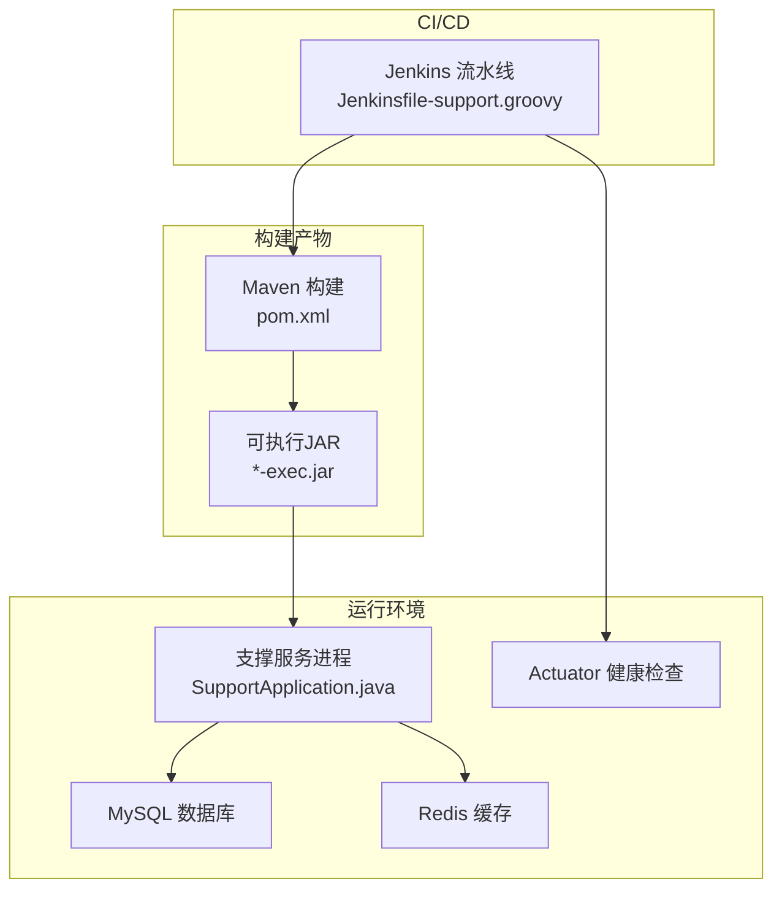
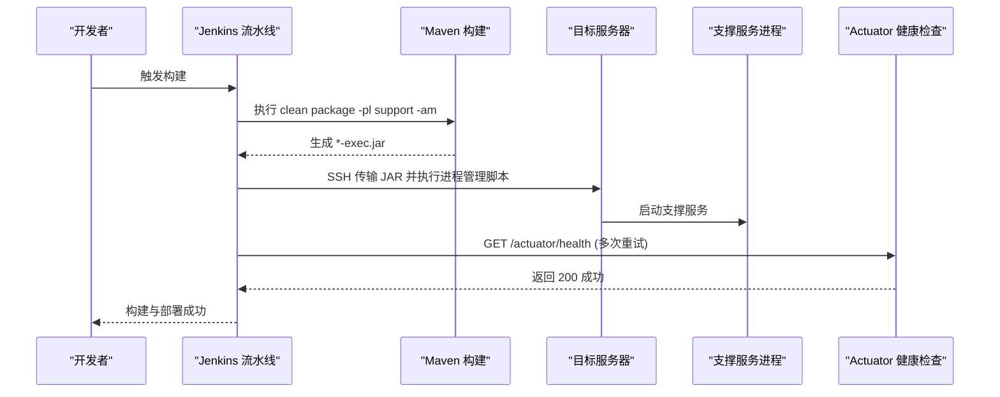
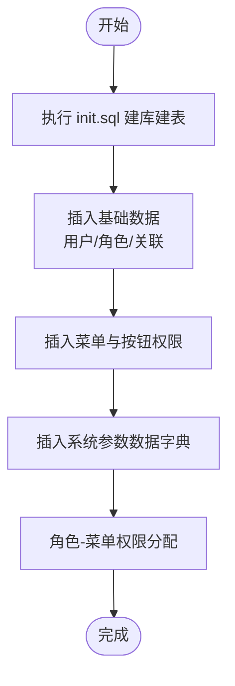
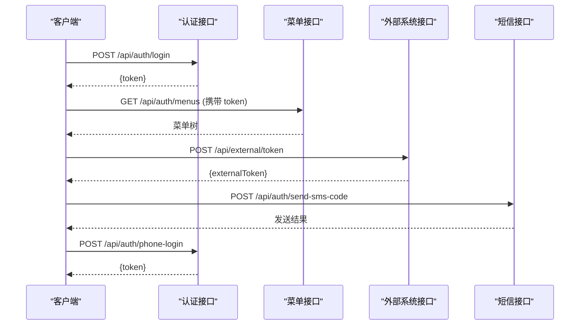
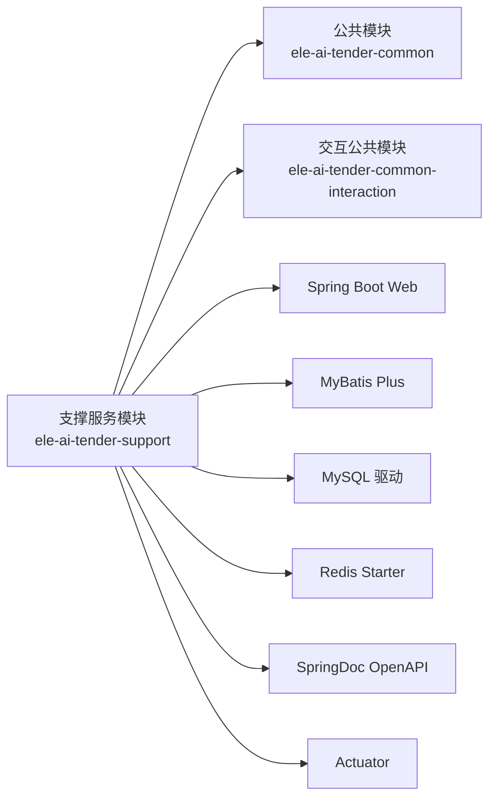

# 支撑服务流水线

<cite>
**本文引用的文件**   
- [Jenkinsfile-support.groovy](file://Jenkinsfile-support.groovy)
- [pom.xml](file://ele-ai-tender-system/ele-ai-tender-support/pom.xml)
- [application.yml](file://ele-ai-tender-system/ele-ai-tender-support/src/main/resources/application.yml)
- [application-dev.yml](file://ele-ai-tender-system/ele-ai-tender-support/src/main/resources/application-dev.yml)
- [application-test.yml](file://ele-ai-tender-system/ele-ai-tender-support/src/main/resources/application-test.yml)
- [init.sql](file://ele-ai-tender-system/ele-ai-tender-support/sql/init.sql)
- [SupportApplication.java](file://ele-ai-tender-system/ele-ai-tender-support/src/main/java/com/jy/eleaitender/support/SupportApplication.java)
- [ele-ai-tender-support.yml](file://docs/guides/ele-ai-tender-support.yml)
</cite>

## 目录
1. [简介](#简介)
2. [项目结构](#项目结构)
3. [核心组件](#核心组件)
4. [架构总览](#架构总览)
5. [详细组件分析](#详细组件分析)
6. [依赖分析](#依赖分析)
7. [性能考虑](#性能考虑)
8. [故障排查指南](#故障排查指南)
9. [结论](#结论)
10. [附录](#附录)

## 简介
本文件面向 ele-ai-tender-support（支撑服务）的 CI/CD 流水线与部署运维，覆盖构建流程、环境配置、安全相关配置、系统初始化、监控与管理接口、以及部署后的完整性验证与权限测试方法。文档以仓库现有脚本与配置文件为依据，提供可操作的步骤与图示说明，帮助读者快速完成支撑服务的构建、部署与验证。

## 项目结构
支撑服务位于 ele-ai-tender-system 下的 ele-ai-tender-support 模块，采用 Spring Boot + MyBatis Plus + Redis 的技术栈，通过 Maven 打包为可执行 JAR，由 Jenkins 流水线触发构建、部署与健康检查。

图表来源
- [Jenkinsfile-support.groovy:1-132](file://Jenkinsfile-support.groovy#L1-L132)
- [pom.xml:93-114](file://ele-ai-tender-system/ele-ai-tender-support/pom.xml#L93-L114)
- [SupportApplication.java:1-21](file://ele-ai-tender-system/ele-ai-tender-support/src/main/java/com/jy/eleaitender/support/SupportApplication.java#L1-L21)

章节来源
- [Jenkinsfile-support.groovy:1-132](file://Jenkinsfile-support.groovy#L1-L132)
- [pom.xml:1-115](file://ele-ai-tender-system/ele-ai-tender-support/pom.xml#L1-L115)
- [SupportApplication.java:1-21](file://ele-ai-tender-system/ele-ai-tender-support/src/main/java/com/jy/eleaitender/support/SupportApplication.java#L1-L21)

## 核心组件
- 构建与打包
  - 使用 Maven 对支撑服务模块进行 clean package，并自动构建上游依赖；Spring Boot Maven 插件将应用打包为带 exec 分类器的可执行 JAR。
- 运行入口
  - Spring Boot 启动类启用调度任务，扫描支持模块与公共模块包路径。
- 外部依赖
  - MySQL 持久化、Redis 缓存、内部文件服务客户端、短信网关等。
- 监控与健康检查
  - Actuator 暴露健康检查端点，供流水线在部署后轮询验证。

章节来源
- [pom.xml:93-114](file://ele-ai-tender-system/ele-ai-tender-support/pom.xml#L93-L114)
- [SupportApplication.java:1-21](file://ele-ai-tender-system/ele-ai-tender-support/src/main/java/com/jy/eleaitender/support/SupportApplication.java#L1-L21)

## 架构总览
支撑服务作为统一认证、用户角色菜单管理、系统参数与消息等基础能力中心，对外暴露 REST API，并通过 Actuator 提供健康检查。流水线负责拉取代码、构建、部署到目标服务器、调用健康检查确认服务可用。

图表来源
- [Jenkinsfile-support.groovy:46-96](file://Jenkinsfile-support.groovy#L46-L96)
- [Jenkinsfile-support.groovy:97-129](file://Jenkinsfile-support.groovy#L97-L129)
- [pom.xml:93-114](file://ele-ai-tender-system/ele-ai-tender-support/pom.xml#L93-L114)

## 详细组件分析

### 构建流程（Maven 与 Spring Boot 插件）
- 构建命令：在根工程下对支撑服务模块执行 clean package，并自动构建上游依赖（-am），跳过测试以提升速度。
- 产物命名：通过 Spring Boot Maven 插件 repackage 生成带有 exec 分类器的可执行 JAR，便于直接 java -jar 运行。
- 主类指定：插件配置中明确 mainClass 指向支撑服务启动类。

章节来源
- [Jenkinsfile-support.groovy:46-71](file://Jenkinsfile-support.groovy#L46-L71)
- [pom.xml:93-114](file://ele-ai-tender-system/ele-ai-tender-support/pom.xml#L93-L114)

### 部署流程（SSH 传输与进程管理）
- 传输方式：通过 sshPublisher 将 JAR 传输至目标服务器的临时目录。
- 进程管理：远程执行 process-jdk21.bat，传入服务名、端口、盘符、仓库路径、备份路径、JAR 名称与 JVM 选项，实现停止旧进程、备份、替换与新进程启动。
- 健康检查：部署完成后循环调用 http://目标IP:端口/actuator/health，最多尝试若干次，间隔等待，直至成功或超时失败。

章节来源
- [Jenkinsfile-support.groovy:72-96](file://Jenkinsfile-support.groovy#L72-L96)
- [Jenkinsfile-support.groovy:97-129](file://Jenkinsfile-support.groovy#L97-L129)

### 环境配置（数据库、Redis、短信网关、JWT、内部文件服务）
- 数据库连接
  - 驱动：com.mysql.cj.jdbc.Driver
  - URL、用户名、密码通过环境变量注入，默认指向本地开发库。
  - dev/test 环境分别覆盖数据库地址与凭据。
- Redis 配置
  - host/port/database/password/timeout 均支持环境变量覆盖，dev/test 环境已给出示例值。
- 短信网关
  - 通过 msg.* 配置项设置用户名、密码、扩展字段、URL 与是否正式环境，test 环境提供示例值，生产应通过环境变量注入。
- JWT 密钥与过期时间
  - jwt.secret、jwt.expiration、jwt.external-expiration 支持环境变量覆盖，建议生产环境使用强随机密钥。
- 内部文件服务
  - internal.file-service.base-url 与 jwt-secret 支持环境变量覆盖，用于支撑服务与文件服务之间的内部通信。

章节来源
- [application.yml:16-27](file://ele-ai-tender-system/ele-ai-tender-support/src/main/resources/application.yml#L16-L27)
- [application.yml:42-56](file://ele-ai-tender-system/ele-ai-tender-support/src/main/resources/application.yml#L42-L56)
- [application.yml:57-64](file://ele-ai-tender-system/ele-ai-tender-support/src/main/resources/application.yml#L57-L64)
- [application-dev.yml:1-27](file://ele-ai-tender-system/ele-ai-tender-support/src/main/resources/application-dev.yml#L1-L27)
- [application-test.yml:1-39](file://ele-ai-tender-system/ele-ai-tender-support/src/main/resources/application-test.yml#L1-L39)

### 安全相关配置（JWT 与 RSA 证书）
- JWT 密钥管理
  - 通过环境变量 APP_JWT_SECRET 注入，避免硬编码；expiration 与 external-expiration 控制普通与外部系统 Token 有效期。
- RSA 公钥获取
  - 公开接口 /api/auth/public-key 用于前端获取 RSA 公钥，以便在前端加密敏感信息（如密码）后再传输。
- 外部系统签名校验
  - 提供 /api/external/verify 接口用于外部系统签名验证，结合接入系统表中的 app_key/app_secret 进行鉴权。

章节来源
- [application.yml:42-46](file://ele-ai-tender-system/ele-ai-tender-support/src/main/resources/application.yml#L42-L46)
- [ele-ai-tender-support.yml:66-73](file://docs/guides/ele-ai-tender-support.yml#L66-L73)
- [ele-ai-tender-support.yml:180-227](file://docs/guides/ele-ai-tender-support.yml#L180-L227)

### 系统初始化流程（菜单、角色权限、数据字典）
- 数据库初始化
  - init.sql 包含建库、建表、基础数据与菜单权限分配，表前缀 sup_，Redis 使用 db=6。
- 菜单与权限
  - 预置系统管理、版本管理、政策文件审查库、消息中心、统计分析、模型路由、AI编制业务等一级菜单及子菜单与按钮级权限。
- 角色与用户
  - 预置管理员与业务用户角色，并为管理员分配所有菜单权限，业务用户仅分配 AI 编制相关菜单权限。
- 系统参数（数据字典）
  - 预置 SYSTEM/SWITCH/AI_RULE/AI_THREAD_POOL 分组参数，涵盖系统名称、文件大小限制、会话超时、功能开关、AI 规则与线程池策略等。

图表来源
- [init.sql:12-14](file://ele-ai-tender-system/ele-ai-tender-support/sql/init.sql#L12-L14)
- [init.sql:476-503](file://ele-ai-tender-system/ele-ai-tender-support/sql/init.sql#L476-L503)
- [init.sql:529-659](file://ele-ai-tender-system/ele-ai-tender-support/sql/init.sql#L529-L659)
- [init.sql:508-522](file://ele-ai-tender-system/ele-ai-tender-support/sql/init.sql#L508-L522)
- [init.sql:667-675](file://ele-ai-tender-system/ele-ai-tender-support/sql/init.sql#L667-L675)

章节来源
- [init.sql:12-14](file://ele-ai-tender-system/ele-ai-tender-support/sql/init.sql#L12-L14)
- [init.sql:476-503](file://ele-ai-tender-system/ele-ai-tender-support/sql/init.sql#L476-L503)
- [init.sql:529-659](file://ele-ai-tender-system/ele-ai-tender-support/sql/init.sql#L529-L659)
- [init.sql:508-522](file://ele-ai-tender-system/ele-ai-tender-support/sql/init.sql#L508-L522)
- [init.sql:667-675](file://ele-ai-tender-system/ele-ai-tender-support/sql/init.sql#L667-L675)

### 监控与管理接口（Actuator 与 OpenAPI）
- 健康检查
  - 流水线通过 GET /actuator/health 进行健康检查，确保服务正常启动。
- 管理接口
  - 支撑服务基于 SpringDoc OpenAPI 提供接口文档，可通过 OpenAPI 规范查看各接口定义。
- 日志与访问日志
  - 内置访问日志与操作日志表，便于问题定位与审计。

章节来源
- [Jenkinsfile-support.groovy:97-129](file://Jenkinsfile-support.groovy#L97-L129)
- [pom.xml:79-83](file://ele-ai-tender-system/ele-ai-tender-support/pom.xml#L79-83)
- [init.sql:237-272](file://ele-ai-tender-system/ele-ai-tender-support/sql/init.sql#L237-L272)
- [init.sql:219-232](file://ele-ai-tender-system/ele-ai-tender-support/sql/init.sql#L219-L232)

### 部署后的完整性验证与权限测试
- 服务可用性
  - 调用 /actuator/health 确认服务状态为 UP。
- 登录与令牌
  - 调用 /api/auth/login 获取 JWT；若需前端加密，先调用 /api/auth/public-key 获取 RSA 公钥。
- 菜单与权限
  - 调用 /api/auth/menus 获取当前用户菜单树，验证管理员与业务用户的菜单差异。
  - 调用 /api/menus/tree 获取全量菜单树，核对预置菜单与按钮权限是否完整。
- 外部系统对接
  - 调用 /api/external/token 换取外部系统 Token，再调用 /api/external/userinfo 获取外部用户信息。
- 短信验证码
  - 调用 /api/auth/send-sms-code 发送验证码，随后调用 /api/auth/phone-login 完成手机验证码登录。
- 系统参数
  - 查询系统参数（数据字典）接口，验证预置参数是否正确加载。

图表来源
- [ele-ai-tender-support.yml:73-159](file://docs/guides/ele-ai-tender-support.yml#L73-L159)
- [ele-ai-tender-support.yml:180-227](file://docs/guides/ele-ai-tender-support.yml#L180-L227)
- [ele-ai-tender-support.yml:99-139](file://docs/guides/ele-ai-tender-support.yml#L99-L139)

## 依赖分析
- 模块依赖
  - 支撑服务依赖 common 与 common-interaction 两个内部模块，提供通用实体、枚举、工具与安全能力。
- 运行时依赖
  - Spring Boot Web、AOP、Validation、MyBatis Plus、MySQL 驱动、Redis、SpringDoc OpenAPI、Actuator。
- 构建依赖
  - Spring Boot Maven 插件负责 repackage 生成可执行 JAR，并指定主类。

图表来源
- [pom.xml:19-91](file://ele-ai-tender-system/ele-ai-tender-support/pom.xml#L19-L91)

章节来源
- [pom.xml:19-91](file://ele-ai-tender-system/ele-ai-tender-support/pom.xml#L19-L91)

## 性能考虑
- 构建优化
  - 流水线跳过测试（-DskipTests）提升构建速度；合理设置 Jenkins 并发与超时。
- 运行资源
  - 通过 JAR_OPTS 调整 JVM 内存上限（例如 -Xmx512M），根据实际负载调优。
- 数据库与缓存
  - 合理设置 Redis 超时与数据库连接池参数；对高频查询增加索引（init.sql 已提供常用索引）。
- 日志级别
  - 生产环境建议降低日志级别，减少 I/O 开销。

[本节为通用指导，不直接分析具体文件]

## 故障排查指南
- 构建失败
  - 检查 Maven 与 JDK 版本是否符合要求；确认上游依赖是否能正常构建。
- 部署失败
  - 检查 SSH 连通性与目标服务器路径权限；确认 process-jdk21.bat 脚本存在且可执行。
- 健康检查失败
  - 检查服务端口是否被占用；查看应用日志与数据库/Redis 连接配置；必要时延长健康检查次数与间隔。
- 登录异常
  - 确认 JWT 密钥一致；检查 RSA 公钥接口是否可达；核对用户状态与角色权限。
- 短信发送失败
  - 核对短信网关账号、密码、扩展字段与 URL；确认网络连通与防火墙策略。

章节来源
- [Jenkinsfile-support.groovy:97-129](file://Jenkinsfile-support.groovy#L97-L129)
- [application.yml:16-27](file://ele-ai-tender-system/ele-ai-tender-support/src/main/resources/application.yml#L16-L27)
- [application-test.yml:30-35](file://ele-ai-tender-system/ele-ai-tender-support/src/main/resources/application-test.yml#L30-L35)

## 结论
支撑服务的 CI/CD 流水线围绕 Maven 构建、SSH 部署与 Actuator 健康检查形成闭环；环境配置通过 application.yml 与环境变量灵活注入；系统初始化脚本提供完整的菜单、角色与数据字典；安全方面通过 JWT 与 RSA 公钥保障传输与鉴权安全。按照本文步骤完成构建、部署与验证，即可稳定交付支撑服务。

[本节为总结性内容，不直接分析具体文件]

## 附录
- 关键环境变量清单（建议在生产环境通过环境变量注入）
  - SPRING_DATASOURCE_URL、SPRING_DATASOURCE_USERNAME、SPRING_DATASOURCE_PASSWORD
  - SPRING_DATA_REDIS_HOST、SPRING_DATA_REDIS_PORT、SPRING_DATA_REDIS_DATABASE、SPRING_DATA_REDIS_PASSWORD
  - APP_JWT_SECRET、APP_JWT_EXPIRATION、APP_JWT_EXTERNAL_EXPIRATION
  - INTERNAL_FILE_SERVICE_URL、APP_JWT_SECRET（内部文件服务）
  - MSG_USERNAME、MSG_PWD、MSG_EXTEND、MSG_URL、MSG_ISFORMAL
- 参考接口清单（OpenAPI 文档）
  - 认证与授权：/api/auth/*
  - 外部系统：/api/external/*
  - 菜单与权限：/api/menus/*
  - 消息与日志：/api/v1/messages、/api/access-logs

章节来源
- [application.yml:16-27](file://ele-ai-tender-system/ele-ai-tender-support/src/main/resources/application.yml#L16-L27)
- [application.yml:42-64](file://ele-ai-tender-system/ele-ai-tender-support/src/main/resources/application.yml#L42-L64)
- [ele-ai-tender-support.yml:4-159](file://docs/guides/ele-ai-tender-support.yml#L4-L159)