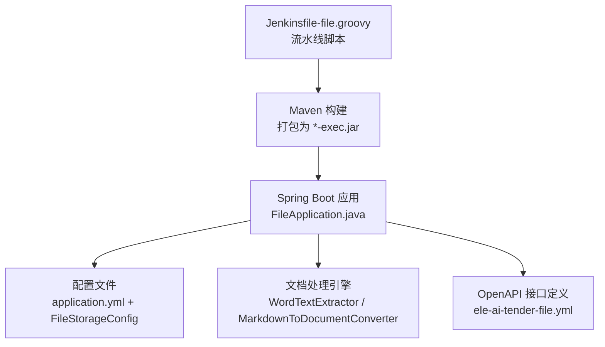
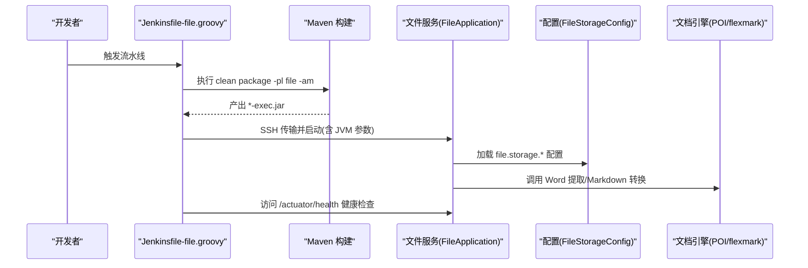
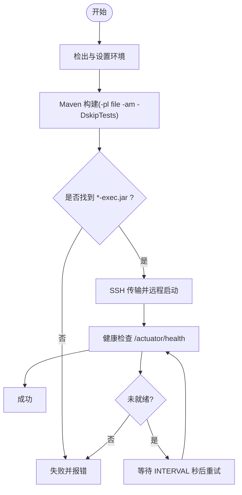
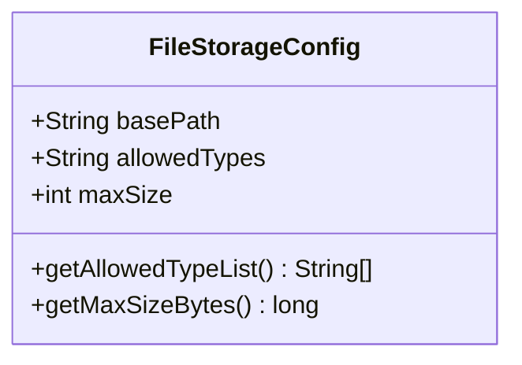
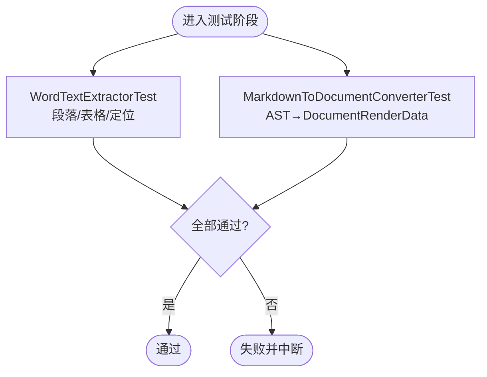
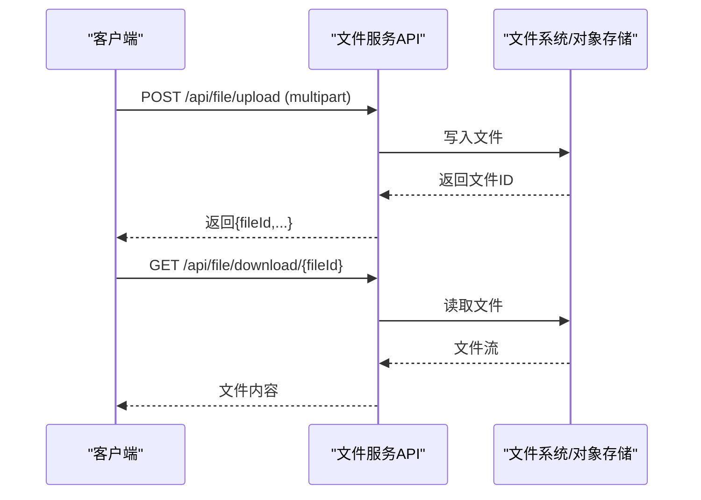
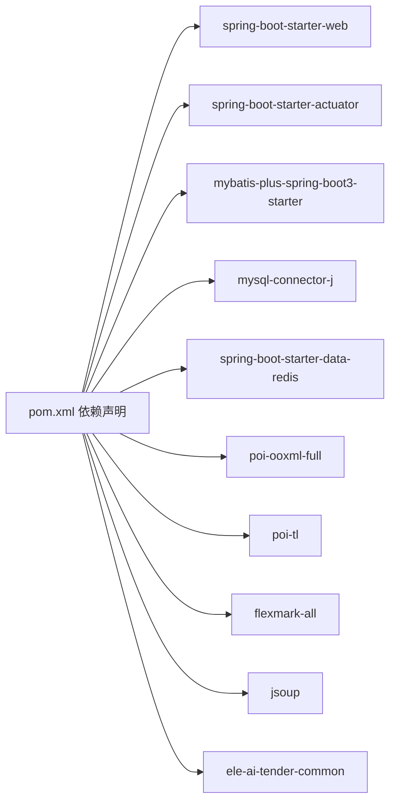

# 文件服务流水线

<cite>
**本文引用的文件**   
- [Jenkinsfile-file.groovy](file://Jenkinsfile-file.groovy)
- [pom.xml](file://ele-ai-tender-system/ele-ai-tender-file/pom.xml)
- [application.yml](file://ele-ai-tender-system/ele-ai-tender-file/src/main/resources/application.yml)
- [FileStorageConfig.java](file://ele-ai-tender-system/ele-ai-tender-file/src/main/java/com/jy/eleaitender/file/config/FileStorageConfig.java)
- [FileApplication.java](file://ele-ai-tender-system/ele-ai-tender-file/src/main/java/com/jy/eleaitender/file/FileApplication.java)
- [WordTextExtractor.java](file://ele-ai-tender-system/ele-ai-tender-file/src/main/java/com/jy/eleaitender/file/engine/WordTextExtractor.java)
- [MarkdownToDocumentConverter.java](file://ele-ai-tender-system/ele-ai-tender-file/src/main/java/com/jy/eleaitender/file/engine/MarkdownToDocumentConverter.java)
- [WordTextExtractorTest.java](file://ele-ai-tender-system/ele-ai-tender-file/src/test/java/com/jy/eleaitender/file/engine/WordTextExtractorTest.java)
- [MarkdownToDocumentConverterTest.java](file://ele-ai-tender-system/ele-ai-tender-file/src/test/java/com/jy/eleaitender/file/engine/MarkdownToDocumentConverterTest.java)
- [ele-ai-tender-file.yml](file://docs/guides/ele-ai-tender-file.yml)
</cite>

## 目录
1. [简介](#简介)
2. [项目结构](#项目结构)
3. [核心组件](#核心组件)
4. [架构总览](#架构总览)
5. [详细组件分析](#详细组件分析)
6. [依赖分析](#依赖分析)
7. [性能考虑](#性能考虑)
8. [故障排查指南](#故障排查指南)
9. [结论](#结论)
10. [附录](#附录)

## 简介
本文件面向 ele-ai-tender-file（文件服务）的 CI/CD 流水线与部署运维，聚焦以下目标：
- 构建特性：说明 Maven 构建、打包产物与主类入口。
- 文档处理库依赖：梳理 Apache POI、poi-tl、flexmark 等依赖在构建中的作用。
- 存储与环境变量：本地存储根路径、允许类型、大小限制及环境变量覆盖方式。
- 引擎测试与执行：Word 文本提取与 Markdown→Word 渲染的单元测试策略。
- 部署权限与空间规划：运行用户、目录权限与存储空间建议。
- 性能调优：大文件上传下载、并发与内存优化建议。
- 功能验证与连通性测试：健康检查、API 验证与存储连通性校验方法。

## 项目结构
文件服务模块位于 ele-ai-tender-system/ele-ai-tender-file，包含启动类、配置、引擎与测试代码；CI/CD 由 Jenkinsfile-file.groovy 驱动。

图表来源
- [Jenkinsfile-file.groovy:1-132](file://Jenkinsfile-file.groovy#L1-L132)
- [FileApplication.java:1-18](file://ele-ai-tender-system/ele-ai-tender-file/src/main/java/com/jy/eleaitender/file/FileApplication.java#L1-L18)
- [application.yml:1-63](file://ele-ai-tender-system/ele-ai-tender-file/src/main/resources/application.yml#L1-L63)
- [FileStorageConfig.java:1-47](file://ele-ai-tender-system/ele-ai-tender-file/src/main/java/com/jy/eleaitender/file/config/FileStorageConfig.java#L1-L47)
- [WordTextExtractor.java:1-202](file://ele-ai-tender-system/ele-ai-tender-file/src/main/java/com/jy/eleaitender/file/engine/WordTextExtractor.java#L1-L202)
- [MarkdownToDocumentConverter.java:1-481](file://ele-ai-tender-system/ele-ai-tender-file/src/main/java/com/jy/eleaitender/file/engine/MarkdownToDocumentConverter.java#L1-L481)
- [ele-ai-tender-file.yml:1-62](file://docs/guides/ele-ai-tender-file.yml#L1-L62)

章节来源
- [Jenkinsfile-file.groovy:1-132](file://Jenkinsfile-file.groovy#L1-L132)
- [pom.xml:1-131](file://ele-ai-tender-system/ele-ai-tender-file/pom.xml#L1-L131)

## 核心组件
- 启动入口：Spring Boot 主类扫描 Mapper 并启动 Web 服务。
- 配置绑定：通过 @ConfigurationProperties 将 file.storage.* 映射到配置对象。
- 文档引擎：
  - Word 文本提取与定位：基于 Apache POI 解析段落与表格，生成位置索引。
  - Markdown→Word 渲染：使用 flexmark 解析 AST，poi-tl 构建 DocumentRenderData。
- 构建与打包：spring-boot-maven-plugin 生成可执行 jar，指定主类。

章节来源
- [FileApplication.java:1-18](file://ele-ai-tender-system/ele-ai-tender-file/src/main/java/com/jy/eleaitender/file/FileApplication.java#L1-L18)
- [FileStorageConfig.java:1-47](file://ele-ai-tender-system/ele-ai-tender-file/src/main/java/com/jy/eleaitender/file/config/FileStorageConfig.java#L1-L47)
- [WordTextExtractor.java:1-202](file://ele-ai-tender-system/ele-ai-tender-file/src/main/java/com/jy/eleaitender/file/engine/WordTextExtractor.java#L1-L202)
- [MarkdownToDocumentConverter.java:1-481](file://ele-ai-tender-system/ele-ai-tender-file/src/main/java/com/jy/eleaitender/file/engine/MarkdownToDocumentConverter.java#L1-L481)
- [pom.xml:109-131](file://ele-ai-tender-system/ele-ai-tender-file/pom.xml#L109-L131)

## 架构总览
下图展示从流水线到运行时关键交互：构建、部署、健康检查与文件处理引擎调用。

图表来源
- [Jenkinsfile-file.groovy:46-131](file://Jenkinsfile-file.groovy#L46-L131)
- [FileApplication.java:1-18](file://ele-ai-tender-system/ele-ai-tender-file/src/main/java/com/jy/eleaitender/file/FileApplication.java#L1-L18)
- [FileStorageConfig.java:1-47](file://ele-ai-tender-system/ele-ai-tender-file/src/main/java/com/jy/eleaitender/file/config/FileStorageConfig.java#L1-L47)
- [WordTextExtractor.java:1-202](file://ele-ai-tender-system/ele-ai-tender-file/src/main/java/com/jy/eleaitender/file/engine/WordTextExtractor.java#L1-L202)
- [MarkdownToDocumentConverter.java:1-481](file://ele-ai-tender-system/ele-ai-tender-file/src/main/java/com/jy/eleaitender/file/engine/MarkdownToDocumentConverter.java#L1-L481)

## 详细组件分析

### 流水线阶段与构建特性
- 工具链：JDK21、Maven。
- 构建命令：仅构建当前模块及其上游依赖，跳过测试以加速流水线。
- 产物：spring-boot-maven-plugin 生成带 classifier=exec 的可执行 jar。
- 部署：SSH 传输至目标服务器，并通过外部脚本拉起进程（传递端口、JVM 选项等）。
- 健康检查：循环请求 /actuator/health，最多尝试次数与间隔可配置。

图表来源
- [Jenkinsfile-file.groovy:1-132](file://Jenkinsfile-file.groovy#L1-L132)
- [pom.xml:109-131](file://ele-ai-tender-system/ele-ai-tender-file/pom.xml#L109-L131)

章节来源
- [Jenkinsfile-file.groovy:1-132](file://Jenkinsfile-file.groovy#L1-L132)
- [pom.xml:109-131](file://ele-ai-tender-system/ele-ai-tender-file/pom.xml#L109-L131)

### 文档处理库依赖管理
- Apache POI：用于 Word 文档解析与文本提取（XWPFDocument、段落/表格遍历）。
- poi-tl（deepoove）：用于 Word 模板渲染与 DocumentRenderData 构建。
- flexmark-all：用于 Markdown 解析为 AST，支撑 Markdown→Word 渲染。
- jsoup/commons-io：HTML 解析与通用 IO 辅助。
- Spring Boot Starter Web/Actuator：提供 HTTP 服务与健康端点。
- MyBatis Plus/MySQL/Redis：数据持久化与缓存支持。

章节来源
- [pom.xml:19-107](file://ele-ai-tender-system/ele-ai-tender-file/pom.xml#L19-L107)
- [WordTextExtractor.java:1-202](file://ele-ai-tender-system/ele-ai-tender-file/src/main/java/com/jy/eleaitender/file/engine/WordTextExtractor.java#L1-L202)
- [MarkdownToDocumentConverter.java:1-481](file://ele-ai-tender-system/ele-ai-tender-file/src/main/java/com/jy/eleaitender/file/engine/MarkdownToDocumentConverter.java#L1-L481)

### 文件存储配置与环境变量
- 基础路径：file.storage.base-path，默认值可通过环境变量 FILE_STORAGE_BASE_PATH 覆盖。
- 允许类型：file.storage.allowed-types，逗号分隔的后缀列表。
- 最大大小：file.storage.max-size（MB），并提供字节级换算方法。
- 应用层上传限制：multipart max-file-size/max-request-size 受 application.yml 控制，也可通过环境变量覆盖。
- 可选本地覆盖：支持导入 user.home/.ele-ai-tender/ele-ai-tender-file-local.yml。

图表来源
- [FileStorageConfig.java:1-47](file://ele-ai-tender-system/ele-ai-tender-file/src/main/java/com/jy/eleaitender/file/config/FileStorageConfig.java#L1-L47)
- [application.yml:50-56](file://ele-ai-tender-system/ele-ai-tender-file/src/main/resources/application.yml#L50-L56)

章节来源
- [application.yml:1-63](file://ele-ai-tender-system/ele-ai-tender-file/src/main/resources/application.yml#L1-L63)
- [FileStorageConfig.java:1-47](file://ele-ai-tender-system/ele-ai-tender-file/src/main/java/com/jy/eleaitender/file/config/FileStorageConfig.java#L1-L47)

### 构建过程中的文件处理引擎测试与执行
- Word 文本提取器测试：
  - 单/多段落、含表格、空文档等场景。
  - 精确匹配与规范化匹配的定位能力。
- Markdown→Word 转换器测试：
  - 标题、段落、行内格式（加粗/斜体/代码）、列表、引用、代码块、表格（合并单元格/列数补齐）等。
  - 混合内容与边界条件（null/空白输入）。
- 建议在流水线中增加 test 阶段以保障质量（当前构建跳过测试）。

图表来源
- [WordTextExtractorTest.java:1-131](file://ele-ai-tender-system/ele-ai-tender-file/src/test/java/com/jy/eleaitender/file/engine/WordTextExtractorTest.java#L1-L131)
- [MarkdownToDocumentConverterTest.java:1-565](file://ele-ai-tender-system/ele-ai-tender-file/src/test/java/com/jy/eleaitender/file/engine/MarkdownToDocumentConverterTest.java#L1-L565)

章节来源
- [WordTextExtractorTest.java:1-131](file://ele-ai-tender-system/ele-ai-tender-file/src/test/java/com/jy/eleaitender/file/engine/WordTextExtractorTest.java#L1-L131)
- [MarkdownToDocumentConverterTest.java:1-565](file://ele-ai-tender-system/ele-ai-tender-file/src/test/java/com/jy/eleaitender/file/engine/MarkdownToDocumentConverterTest.java#L1-L565)

### 部署时的文件目录权限与存储空间规划
- 目录权限：
  - 确保运行用户对 file.storage.base-path 具备读写权限。
  - 若启用本地覆盖配置，需保证 ~/.ele-ai-tender/ 目录存在且可读。
- 存储空间规划：
  - 根据业务量预估：峰值并发 × 平均文件大小 × 保留周期。
  - 建议独立磁盘或挂载卷，监控磁盘使用率与 I/O 延迟。
- 进程与资源：
  - 通过流水线传入 JVM 参数（如堆大小、编码），结合容器或系统资源限制进行整体容量规划。

章节来源
- [application.yml:14-19](file://ele-ai-tender-system/ele-ai-tender-file/src/main/resources/application.yml#L14-L19)
- [application.yml:50-56](file://ele-ai-tender-system/ele-ai-tender-file/src/main/resources/application.yml#L50-L56)
- [Jenkinsfile-file.groovy:10-16](file://Jenkinsfile-file.groovy#L10-L16)

### 文件服务特有的性能调优建议
- 大文件处理
  - 调整 multipart 大小限制与应用层最大文件大小一致，避免中间截断。
  - 流式上传/下载，减少一次性驻留内存；对超大文件考虑分片与断点续传（服务端侧实现）。
- 并发与线程池
  - 合理设置 Tomcat 线程池与连接池；对文档解析任务引入异步队列与限流。
  - 针对 Word 解析与 Markdown 渲染等 CPU 密集操作，隔离线程池避免阻塞 IO。
- 缓存与去重
  - 对热点文件元信息、预览结果做缓存（Redis），降低重复计算与 IO。
- 存储后端
  - 本地盘：选择高吞吐 SSD，开启同步写策略与定期快照。
  - 云存储：使用对象存储（S3/OSS/COS），配合 CDN 加速下载。

[本节为通用指导，不直接分析具体文件]

### 部署后的功能验证与存储连通性测试
- 健康检查：访问 /actuator/health，确认状态为 UP。
- API 验证（参考 OpenAPI 定义）：
  - 上传：POST /api/file/upload（表单字段：file、bizType）
  - 下载：GET /api/file/download/{fileId}
  - 信息：GET /api/file/info/{fileId}
  - 删除：DELETE /api/file/delete/{fileId}
- 存储连通性：
  - 写入小文件并读取，校验返回内容与原始一致。
  - 模拟大文件上传与下载，观察耗时与错误码。
  - 校验允许类型与大小限制是否生效。

图表来源
- [ele-ai-tender-file.yml:1-62](file://docs/guides/ele-ai-tender-file.yml#L1-L62)
- [application.yml:16-19](file://ele-ai-tender-system/ele-ai-tender-file/src/main/resources/application.yml#L16-L19)

章节来源
- [ele-ai-tender-file.yml:1-62](file://docs/guides/ele-ai-tender-file.yml#L1-L62)
- [application.yml:16-19](file://ele-ai-tender-system/ele-ai-tender-file/src/main/resources/application.yml#L16-L19)

## 依赖分析
- 内部依赖：common 模块（通用 DTO、常量、异常等）。
- 外部依赖：
  - 文档处理：Apache POI、poi-tl、flexmark、jsoup。
  - Web 与可观测性：Spring Boot Web、Actuator、SpringDoc。
  - 数据：MyBatis Plus、MySQL、Redis。
- 构建插件：spring-boot-maven-plugin 负责 repackage 与主类注入。

图表来源
- [pom.xml:19-107](file://ele-ai-tender-system/ele-ai-tender-file/pom.xml#L19-L107)

章节来源
- [pom.xml:19-107](file://ele-ai-tender-system/ele-ai-tender-file/pom.xml#L19-L107)

## 性能考虑
- 上传/下载：
  - 增大 multipart 上限并与业务需求对齐。
  - 对大文件采用流式处理与后台任务拆分。
- 文档解析：
  - Word 解析与 Markdown 渲染属于 CPU 密集型，建议隔离线程池与限流。
  - 对相同内容的渲染结果进行缓存。
- 存储：
  - 本地存储优先选择高性能磁盘；云存储启用压缩与 CDN。
- 监控：
  - 暴露 Actuator 指标，关注 GC、线程池、磁盘 I/O 与慢请求。

[本节为通用指导，不直接分析具体文件]

## 故障排查指南
- 构建失败
  - 检查 Maven 版本与 JDK 版本是否符合要求。
  - 确认仓库网络与依赖下载是否正常。
- 部署失败
  - 检查 SSH 密钥与目标服务器可达性。
  - 核对远程启动脚本参数与端口占用。
- 启动失败
  - 查看日志输出，确认数据库、Redis 连接正常。
  - 校验 file.storage.base-path 是否存在且可写。
- 健康检查失败
  - 确认 /actuator/health 端口与防火墙策略。
  - 适当延长健康检查间隔与重试次数。

章节来源
- [Jenkinsfile-file.groovy:97-131](file://Jenkinsfile-file.groovy#L97-L131)
- [application.yml:20-31](file://ele-ai-tender-system/ele-ai-tender-file/src/main/resources/application.yml#L20-L31)
- [application.yml:50-56](file://ele-ai-tender-system/ele-ai-tender-file/src/main/resources/application.yml#L50-L56)

## 结论
本文件服务流水线围绕“快速构建—可靠部署—健康检查”的主线设计，结合文档处理引擎的单元测试保障质量。通过合理的存储配置、权限与空间规划，以及针对性的性能调优，可在生产环境中稳定支撑大文件与高并发场景。建议在后续迭代中引入测试阶段与更完善的监控告警，进一步提升交付质量与可观测性。

## 附录
- 环境变量速查（部分）
  - SERVER_PORT：服务端口
  - SPRING_DATASOURCE_URL/USERNAME/PASSWORD：数据库连接
  - SPRING_DATA_REDIS_HOST/PORT/DATABASE/PASSWORD：Redis 连接
  - FILE_STORAGE_BASE_PATH：文件存储根路径
  - APP_JWT_SECRET/EXPIRATION/EXTERNAL_EXPIRATION：JWT 相关
- 关键路径
  - 启动类：FileApplication.java
  - 存储配置：FileStorageConfig.java
  - 文档引擎：WordTextExtractor.java、MarkdownToDocumentConverter.java
  - 接口定义：ele-ai-tender-file.yml

章节来源
- [application.yml:1-63](file://ele-ai-tender-system/ele-ai-tender-file/src/main/resources/application.yml#L1-L63)
- [FileApplication.java:1-18](file://ele-ai-tender-system/ele-ai-tender-file/src/main/java/com/jy/eleaitender/file/FileApplication.java#L1-L18)
- [FileStorageConfig.java:1-47](file://ele-ai-tender-system/ele-ai-tender-file/src/main/java/com/jy/eleaitender/file/config/FileStorageConfig.java#L1-L47)
- [WordTextExtractor.java:1-202](file://ele-ai-tender-system/ele-ai-tender-file/src/main/java/com/jy/eleaitender/file/engine/WordTextExtractor.java#L1-L202)
- [MarkdownToDocumentConverter.java:1-481](file://ele-ai-tender-system/ele-ai-tender-file/src/main/java/com/jy/eleaitender/file/engine/MarkdownToDocumentConverter.java#L1-L481)
- [ele-ai-tender-file.yml:1-62](file://docs/guides/ele-ai-tender-file.yml#L1-L62)