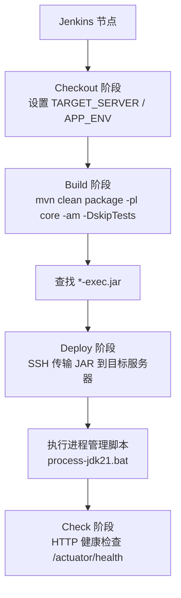
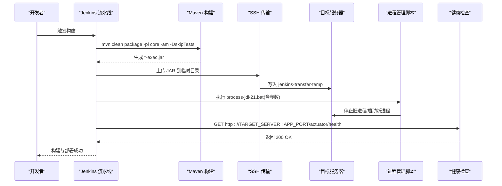
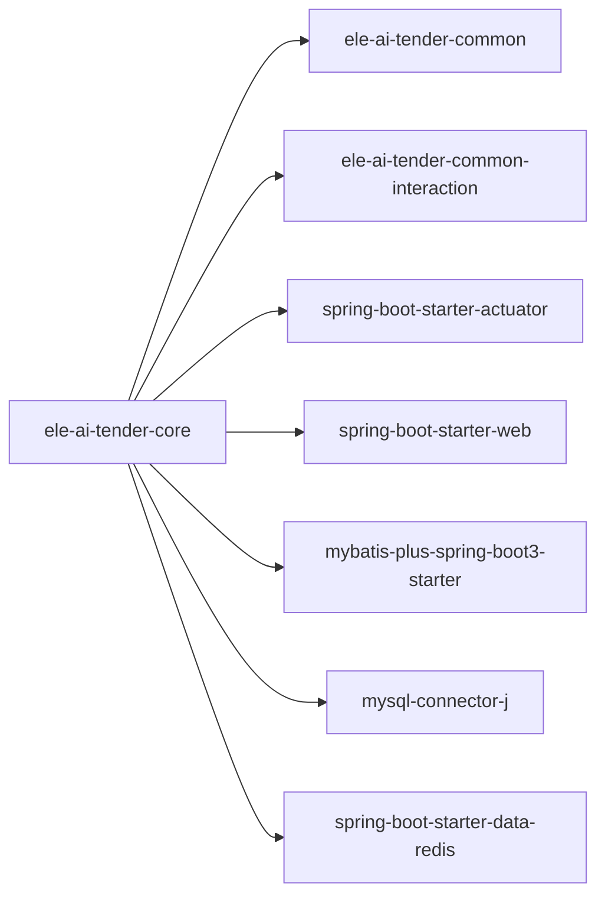

# 核心服务流水线

<cite>
**本文引用的文件**
- [Jenkinsfile-core.groovy](file://Jenkinsfile-core.groovy)
- [ele-ai-tender-core/pom.xml](file://ele-ai-tender-system/ele-ai-tender-core/pom.xml)
- [application.yml](file://ele-ai-tender-system/ele-ai-tender-core/src/main/resources/application.yml)
- [application-test.yml](file://ele-ai-tender-system/ele-ai-tender-core/src/main/resources/application-test.yml)
</cite>

## 目录
1. [简介](#简介)
2. [项目结构](#项目结构)
3. [核心组件](#核心组件)
4. [架构总览](#架构总览)
5. [详细组件分析](#详细组件分析)
6. [依赖关系分析](#依赖关系分析)
7. [性能与构建优化](#性能与构建优化)
8. [故障排查指南](#故障排查指南)
9. [结论](#结论)

## 简介
本文件面向核心服务 ele-ai-tender-core 的 CI/CD 流水线，聚焦 Jenkins 流水线的完整构建与部署流程。内容涵盖：代码拉取、Maven 依赖安装、模块编译打包、JAR 生成、环境参数说明（APP_NAME、APP_PORT、TARGET_SERVER 等）、构建优化策略（-am 自动构建上游依赖、-DskipTests 跳过测试）、部署流程（SSH 传输、进程管理脚本调用、健康检查），以及常见问题的排查建议。

## 项目结构
围绕核心服务的流水线主要涉及以下关键位置：
- 流水线定义：Jenkinsfile-core.groovy
- 核心服务 Maven 工程：ele-ai-tender-system/ele-ai-tender-core
- 应用配置：core 模块 resources 下的 application*.yml

图示来源
- [Jenkinsfile-core.groovy:27-96](file://Jenkinsfile-core.groovy#L27-L96)
- [ele-ai-tender-core/pom.xml:107-127](file://ele-ai-tender-system/ele-ai-tender-core/pom.xml#L107-L127)

章节来源
- [Jenkinsfile-core.groovy:1-132](file://Jenkinsfile-core.groovy#L1-L132)
- [ele-ai-tender-core/pom.xml:1-129](file://ele-ai-tender-system/ele-ai-tender-core/pom.xml#L1-L129)

## 核心组件
- 流水线入口与环境变量
  - APP_NAME：当前构建的服务名，用于定位模块路径与产物命名
  - APP_PORT：服务运行端口，用于健康检查与外部访问
  - TARGET_SERVER：目标部署服务器地址，用于 SSH 传输与健康检查
  - APP_REPO/BAP_REPO：本地仓库与备份目录路径，供部署脚本使用
  - JAR_OPTS：JVM 启动参数，如内存与编码
  - MAX_ATTEMPTS/INTERVAL：健康检查重试次数与间隔
- 工具链
  - JDK21、Maven 由 Jenkins tools 声明，确保构建环境一致
- 构建产物
  - Spring Boot Maven Plugin 将应用打包为可执行的 *-exec.jar，主类在 pom.xml 中指定

章节来源
- [Jenkinsfile-core.groovy:3-16](file://Jenkinsfile-core.groovy#L3-L16)
- [Jenkinsfile-core.groovy:17-25](file://Jenkinsfile-core.groovy#L17-L25)
- [ele-ai-tender-core/pom.xml:107-127](file://ele-ai-tender-system/ele-ai-tender-core/pom.xml#L107-L127)

## 架构总览
下图展示了从触发构建到健康检查的端到端流程，包括构建、传输、进程管理与验证环节。

图示来源
- [Jenkinsfile-core.groovy:46-96](file://Jenkinsfile-core.groovy#L46-L96)
- [Jenkinsfile-core.groovy:97-129](file://Jenkinsfile-core.groovy#L97-L129)

## 详细组件分析

### 构建阶段（Build）
- 工作目录切换至父工程 ele-ai-tender-system
- 执行命令：mvn clean package -pl ${APP_NAME} -am -DskipTests
  - -pl 指定仅构建 core 模块
  - -am 自动构建上游依赖（common、common-interaction 等）
  - -DskipTests 跳过单元测试，加速构建
- 产物发现：扫描 target 目录下 *-exec.jar 并记录到环境变量 JAR_NAME
- 失败处理：若未找到 JAR，直接报错终止流水线

章节来源
- [Jenkinsfile-core.groovy:46-71](file://Jenkinsfile-core.groovy#L46-L71)
- [ele-ai-tender-core/pom.xml:107-127](file://ele-ai-tender-system/ele-ai-tender-core/pom.xml#L107-L127)

### 部署阶段（Deploy）
- 通过 sshPublisher 将 JAR 传输到目标服务器的临时目录
- 同时执行远程命令：E:\java\process-jdk21.bat ${APP_NAME} ${APP_PORT} ${APP_DRIVE} ${APP_REPO} ${BAK_REPO} ${JAR_NAME} "${JAR_OPTS}"
  - 该脚本负责进程管理（停止旧实例、备份、替换、启动新实例）
- 日志输出包含最终部署标识（服务名+端口）

章节来源
- [Jenkinsfile-core.groovy:72-96](file://Jenkinsfile-core.groovy#L72-L96)

### 健康检查阶段（Check）
- 循环发起 HTTP GET 请求到 http://${TARGET_SERVER}:${APP_PORT}/actuator/health
- 最大尝试次数 MAX_ATTEMPTS，每次失败等待 INTERVAL 秒后重试
- 任一成功即视为部署成功；全部失败则报错

章节来源
- [Jenkinsfile-core.groovy:97-129](file://Jenkinsfile-core.groovy#L97-L129)

### 环境配置参数说明
- APP_NAME：服务名称，对应 Maven 模块名与部署标识
- APP_PORT：服务监听端口，默认在 test 环境覆盖为 28082
- TARGET_SERVER：目标服务器 IP，用于 SSH 传输与健康检查
- APP_REPO/BAK_REPO：本地源码与备份目录路径，供部署脚本使用
- JAR_OPTS：JVM 启动参数，例如 -Xmx1G -Dfile.encoding=utf-8
- MAX_ATTEMPTS/INTERVAL：健康检查重试策略

章节来源
- [Jenkinsfile-core.groovy:3-16](file://Jenkinsfile-core.groovy#L3-L16)
- [application-test.yml:1-3](file://ele-ai-tender-system/ele-ai-tender-core/src/main/resources/application-test.yml#L1-L3)

### 应用配置与环境
- 基础配置 application.yml 提供默认值与可选的外部配置文件导入
- 测试环境 application-test.yml 覆盖 server.port 及数据库、Redis、内部文件服务等连接信息
- 可通过环境变量注入敏感或差异化配置（如数据库、Redis、JWT 密钥等）

章节来源
- [application.yml:1-68](file://ele-ai-tender-system/ele-ai-tender-core/src/main/resources/application.yml#L1-L68)
- [application-test.yml:1-34](file://ele-ai-tender-system/ele-ai-tender-core/src/main/resources/application-test.yml#L1-L34)

## 依赖关系分析
- 构建期依赖
  - core 模块依赖 common 与 common-interaction，-am 会按 POM 依赖图自动构建这些上游模块
- 运行期依赖
  - Spring Boot Web、Actuator（健康检查）、MyBatis Plus、MySQL、Redis、SpringDoc、文档解析与 Markdown 处理等
- 产物形态
  - Spring Boot Maven Plugin 生成可执行 jar（classifier=exec），可直接 java -jar 运行

图示来源
- [ele-ai-tender-core/pom.xml:19-105](file://ele-ai-tender-system/ele-ai-tender-core/pom.xml#L19-L105)

章节来源
- [ele-ai-tender-core/pom.xml:19-105](file://ele-ai-tender-system/ele-ai-tender-core/pom.xml#L19-L105)

## 性能与构建优化
- 增量构建与并行
  - 使用 -pl 仅构建 core 模块，减少无关模块参与
  - -am 自动构建必要上游依赖，避免手动维护依赖列表
- 跳过测试
  - -DskipTests 显著缩短构建时间，适合快速迭代与预发验证
- 资源限制与超时
  - 流水线设置并发禁用与超时保护，避免长时间占用构建节点
- JVM 参数
  - 通过 JAR_OPTS 调整堆大小与编码，保障运行稳定性

章节来源
- [Jenkinsfile-core.groovy:21-25](file://Jenkinsfile-core.groovy#L21-L25)
- [Jenkinsfile-core.groovy:52-55](file://Jenkinsfile-core.groovy#L52-L55)
- [Jenkinsfile-core.groovy:11](file://Jenkinsfile-core.groovy#L11)

## 故障排查指南
- 构建失败
  - 现象：找不到 *-exec.jar
  - 排查：确认 Maven 构建是否成功、target 目录是否存在产物、-am 是否正确拉起上游依赖
  - 参考：[Jenkinsfile-core.groovy:57-68](file://Jenkinsfile-core.groovy#L57-L68)
- 依赖下载慢或失败
  - 现象：Maven 下载依赖超时或失败
  - 排查：检查 Jenkins 节点的 Maven 镜像源配置与网络连通性
- SSH 传输失败
  - 现象：sshPublisher 报错
  - 排查：确认 configName 对应的 SSH 凭据可用、目标服务器可达、远程目录存在且可写
  - 参考：[Jenkinsfile-core.groovy:77-90](file://Jenkinsfile-core.groovy#L77-L90)
- 进程管理脚本异常
  - 现象：部署后服务未启动或启动失败
  - 排查：核对 process-jdk21.bat 路径与参数、检查目标服务器磁盘空间与权限、查看脚本日志
  - 参考：[Jenkinsfile-core.groovy:84-86](file://Jenkinsfile-core.groovy#L84-L86)
- 健康检查失败
  - 现象：/actuator/health 无法访问或返回非 2xx
  - 排查：确认 TARGET_SERVER 与 APP_PORT 正确、防火墙放行、应用已启动且 Actuator 暴露
  - 参考：[Jenkinsfile-core.groovy:107-112](file://Jenkinsfile-core.groovy#L107-L112)
- 运行时配置错误
  - 现象：数据库/Redis 连接失败、端口冲突
  - 排查：核对 application-test.yml 中的连接信息与端口覆盖，必要时通过环境变量注入
  - 参考：[application-test.yml:1-34](file://ele-ai-tender-system/ele-ai-tender-core/src/main/resources/application-test.yml#L1-L34)

## 结论
本流水线以最小化构建范围与跳过测试为核心优化点，结合 SSH 传输与进程管理脚本实现自动化部署，并通过 Actuator 健康检查完成发布验证。合理配置环境变量与运行参数，可有效提升构建效率与部署成功率。建议在后续引入缓存与并行构建进一步缩短流水线时长，并完善部署回滚与灰度策略。