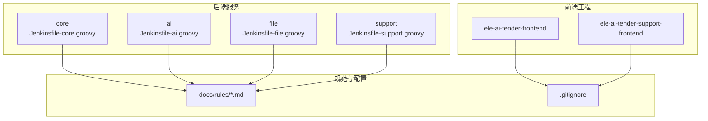
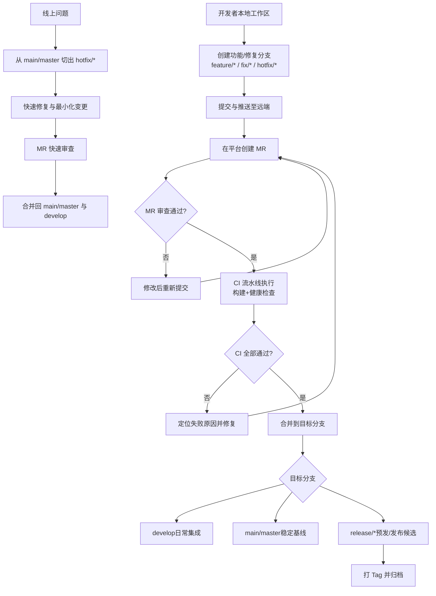
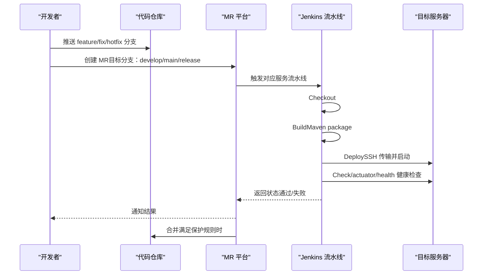
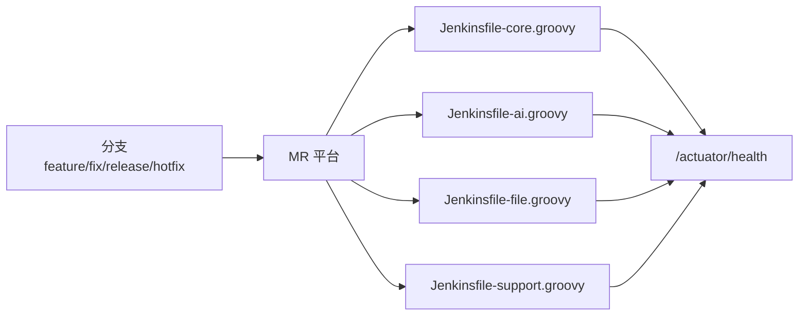

# 分支管理策略

<cite>
**本文引用的文件**   
- [Jenkinsfile-core.groovy](file://Jenkinsfile-core.groovy)
- [Jenkinsfile-ai.groovy](file://Jenkinsfile-ai.groovy)
- [Jenkinsfile-file.groovy](file://Jenkinsfile-file.groovy)
- [Jenkinsfile-support.groovy](file://Jenkinsfile-support.groovy)
- [CODE_CONVENTIONS.md](file://docs/rules/CODE_CONVENTIONS.md)
- [.gitignore](file://.gitignore)
</cite>

## 目录
1. [引言](#引言)
2. [项目结构](#项目结构)
3. [核心组件](#核心组件)
4. [架构总览](#架构总览)
5. [详细组件分析](#详细组件分析)
6. [依赖分析](#依赖分析)
7. [性能考虑](#性能考虑)
8. [故障排查指南](#故障排查指南)
9. [结论](#结论)
10. [附录](#附录)

## 引言
本策略为“招标文件AI编制系统”制定统一的 Git 分支管理与发布流程，覆盖主分支、开发分支、功能分支、修复分支与发布分支的命名、创建、合并、保护与同步规范；明确合并请求（MR）的审查与批准机制；定义冲突解决与分支同步最佳实践；并给出紧急修复与热发布的操作路径。该策略与现有持续集成流水线（Jenkins）协同，确保从代码提交到部署验证的可追溯性与稳定性。

## 项目结构
仓库采用多模块后端与双前端工程组织：
- 后端服务：core、ai、file、support 四个独立服务，各自拥有 Jenkinsfile 构建与部署脚本
- 前端工程：ele-ai-tender-frontend 与 ele-ai-tender-support-frontend
- 规则与规范：docs/rules 下包含编码规范等文档
- 根级 .gitignore 统一忽略产物与环境敏感文件

图表来源
- [Jenkinsfile-core.groovy:1-132](file://Jenkinsfile-core.groovy#L1-L132)
- [Jenkinsfile-ai.groovy:1-132](file://Jenkinsfile-ai.groovy#L1-L132)
- [Jenkinsfile-file.groovy:1-132](file://Jenkinsfile-file.groovy#L1-L132)
- [Jenkinsfile-support.groovy:1-132](file://Jenkinsfile-support.groovy#L1-L132)
- [.gitignore:1-106](file://.gitignore#L1-L106)

章节来源
- [Jenkinsfile-core.groovy:1-132](file://Jenkinsfile-core.groovy#L1-L132)
- [Jenkinsfile-ai.groovy:1-132](file://Jenkinsfile-ai.groovy#L1-L132)
- [Jenkinsfile-file.groovy:1-132](file://Jenkinsfile-file.groovy#L1-L132)
- [Jenkinsfile-support.groovy:1-132](file://Jenkinsfile-support.groovy#L1-L132)
- [.gitignore:1-106](file://.gitignore#L1-L106)

## 核心组件
- 分支模型：基于主干的长期稳定分支 + 短期特性/修复分支
- 命名约定：feature/*、fix/*、release/*、hotfix/*
- 合并流程：以 MR 为核心，强制审查与状态检查通过后合并
- 分支保护：对 main/master 与 release/* 启用保护规则
- CI 集成：Jenkins 流水线按分支触发构建与健康检查

章节来源
- [Jenkinsfile-core.groovy:26-130](file://Jenkinsfile-core.groovy#L26-L130)
- [Jenkinsfile-ai.groovy:26-130](file://Jenkinsfile-ai.groovy#L26-L130)
- [Jenkinsfile-file.groovy:26-130](file://Jenkinsfile-file.groovy#L26-L130)
- [Jenkinsfile-support.groovy:26-130](file://Jenkinsfile-support.groovy#L26-L130)

## 架构总览
下图展示分支生命周期与关键节点：从功能/修复分支开发，到 MR 审查与 CI 校验，再到合并入 develop/main/release，以及热修复流程。

[此图为概念性流程图，不直接映射具体源码文件]

## 详细组件分析

### 分支模型与命名约定
- 长期分支
  - main/master：生产可用基线，仅允许受保护的合并
  - develop：日常集成分支，所有 feature/fix 最终合并至此
- 短期分支
  - feature/*：新功能开发，如 feature/user-authentication
  - fix/*：非紧急缺陷修复，如 fix/login-bug
  - release/*：发布准备分支，如 release/v1.2.0
  - hotfix/*：紧急修复分支，如 hotfix/critical-login-issue
- 命名规范
  - 使用小写英文字母、数字与短横线
  - 前缀与描述清晰表达意图，避免过长
  - 示例：feature/project-template-editor、fix/detection-timeout、release/v2.1.0、hotfix/ai-model-connectivity

章节来源
- [CODE_CONVENTIONS.md:1-393](file://docs/rules/CODE_CONVENTIONS.md#L1-L393)

### 分支创建、合并与删除标准流程
- 创建
  - 从 develop 拉取最新代码，创建 feature/* 或 fix/*
  - 从 main/master 拉取最新代码，创建 release/* 或 hotfix/*
- 提交
  - 遵循原子提交原则，commit message 语义化（feat/fix/chore 等）
- 合并请求（MR）
  - 目标分支：feature/fix → develop；release/hotfix → main/master
  - 必须至少一名审查者批准
  - 必须通过 CI 状态检查（见下一节）
- 合并
  - 优先使用 Squash Merge 保持历史整洁（可选）
  - 合并后删除源分支
- 删除
  - 合并完成后立即删除已用分支，保持仓库整洁

章节来源
- [Jenkinsfile-core.groovy:26-130](file://Jenkinsfile-core.groovy#L26-L130)
- [Jenkinsfile-ai.groovy:26-130](file://Jenkinsfile-ai.groovy#L26-L130)
- [Jenkinsfile-file.groovy:26-130](file://Jenkinsfile-file.groovy#L26-L130)
- [Jenkinsfile-support.groovy:26-130](file://Jenkinsfile-support.groovy#L26-L130)

### 合并请求（MR）审查与批准机制
- 审查要求
  - 至少 1 名具备权限的审查者批准
  - 禁止自批自合（作者与审查者不可为同一人）
- 变更范围控制
  - MR 仅包含单一职责的变更，避免跨模块大改动
- 文档与注释
  - 涉及接口/配置变更需更新相关文档或注释
- 合并策略
  - 推荐 Squash Merge 或 Rebase + Fast-forward，避免无意义合并提交

章节来源
- [CODE_CONVENTIONS.md:1-393](file://docs/rules/CODE_CONVENTIONS.md#L1-L393)

### 分支保护规则
- 受保护分支
  - main/master、release/*
- 强制要求
  - 必须通过所有 CI 状态检查
  - 必须至少 1 名审查者批准
  - 禁止强制推送
- 额外建议
  - 限制合并权限至维护者
  - 要求 MR 关联需求/缺陷单号

章节来源
- [Jenkinsfile-core.groovy:26-130](file://Jenkinsfile-core.groovy#L26-L130)
- [Jenkinsfile-ai.groovy:26-130](file://Jenkinsfile-ai.groovy#L26-L130)
- [Jenkinsfile-file.groovy:26-130](file://Jenkinsfile-file.groovy#L26-L130)
- [Jenkinsfile-support.groovy:26-130](file://Jenkinsfile-support.groovy#L26-L130)

### 冲突解决策略与分支同步最佳实践
- 冲突预防
  - 频繁从目标分支 rebase/sync 到当前分支
  - 小步提交，降低冲突概率
- 冲突解决
  - 先 pull/rebase 最新目标分支，再本地解决冲突
  - 必要时与协作方沟通变更影响面
- 同步建议
  - develop 每日至少一次全量同步
  - release/* 与 hotfix/* 严格从 main/master 同步

章节来源
- [CODE_CONVENTIONS.md:1-393](file://docs/rules/CODE_CONVENTIONS.md#L1-L393)

### 紧急修复分支处理与热发布策略
- 触发条件
  - 线上严重缺陷或安全漏洞
- 操作流程
  - 从 main/master 切出 hotfix/*
  - 最小化变更，补充必要测试用例
  - 快速 MR 审查与合并
  - 同时合并回 develop，保证后续版本一致性
- 发布策略
  - 热修复可直接从 main/master 发布
  - 若需要回归验证，可先合并至 release/* 进行预发验证后再上生产

章节来源
- [Jenkinsfile-core.groovy:26-130](file://Jenkinsfile-core.groovy#L26-L130)
- [Jenkinsfile-ai.groovy:26-130](file://Jenkinsfile-ai.groovy#L26-L130)
- [Jenkinsfile-file.groovy:26-130](file://Jenkinsfile-file.groovy#L26-L130)
- [Jenkinsfile-support.groovy:26-130](file://Jenkinsfile-support.groovy#L26-L130)

### CI 流水线与状态检查
- 流水线阶段
  - Checkout：检出指定分支
  - Build：Maven 构建（跳过测试以提升速度，可按需开启）
  - Deploy：SSH 传输并启动服务
  - Check：健康检查（/actuator/health），多次重试直至成功或超时
- 状态检查要求
  - 所有服务的 Jenkins 任务必须通过，方可合并受保护分支
- 环境参数
  - APP_NAME、APP_PORT、TARGET_SERVER、JAR_OPTS 等由各 Jenkinsfile 定义

图表来源
- [Jenkinsfile-core.groovy:26-130](file://Jenkinsfile-core.groovy#L26-L130)
- [Jenkinsfile-ai.groovy:26-130](file://Jenkinsfile-ai.groovy#L26-L130)
- [Jenkinsfile-file.groovy:26-130](file://Jenkinsfile-file.groovy#L26-L130)
- [Jenkinsfile-support.groovy:26-130](file://Jenkinsfile-support.groovy#L26-L130)

章节来源
- [Jenkinsfile-core.groovy:26-130](file://Jenkinsfile-core.groovy#L26-L130)
- [Jenkinsfile-ai.groovy:26-130](file://Jenkinsfile-ai.groovy#L26-L130)
- [Jenkinsfile-file.groovy:26-130](file://Jenkinsfile-file.groovy#L26-L130)
- [Jenkinsfile-support.groovy:26-130](file://Jenkinsfile-support.groovy#L26-L130)

## 依赖分析
- 分支与流水线耦合
  - 每个后端服务有独立 Jenkinsfile，按 APP_NAME 区分构建与部署
  - 健康检查统一调用 /actuator/health，作为合并准入条件
- 外部依赖
  - Maven/JDK 工具链由 Jenkins tools 声明
  - SSH 传输与远程进程启动由 Jenkins 插件与脚本完成

图表来源
- [Jenkinsfile-core.groovy:26-130](file://Jenkinsfile-core.groovy#L26-L130)
- [Jenkinsfile-ai.groovy:26-130](file://Jenkinsfile-ai.groovy#L26-L130)
- [Jenkinsfile-file.groovy:26-130](file://Jenkinsfile-file.groovy#L26-L130)
- [Jenkinsfile-support.groovy:26-130](file://Jenkinsfile-support.groovy#L26-L130)

章节来源
- [Jenkinsfile-core.groovy:26-130](file://Jenkinsfile-core.groovy#L26-L130)
- [Jenkinsfile-ai.groovy:26-130](file://Jenkinsfile-ai.groovy#L26-L130)
- [Jenkinsfile-file.groovy:26-130](file://Jenkinsfile-file.groovy#L26-L130)
- [Jenkinsfile-support.groovy:26-130](file://Jenkinsfile-support.groovy#L26-L130)

## 性能考虑
- 构建优化
  - 使用 -am 自动构建上游依赖，减少重复打包
  - 合理设置 JVM 内存参数（JAR_OPTS）
- 健康检查
  - 最大尝试次数与间隔可调，避免误判
- 并发控制
  - 禁用并行构建，确保资源隔离与结果稳定

章节来源
- [Jenkinsfile-core.groovy:10-25](file://Jenkinsfile-core.groovy#L10-L25)
- [Jenkinsfile-ai.groovy:10-25](file://Jenkinsfile-ai.groovy#L10-L25)
- [Jenkinsfile-file.groovy:10-25](file://Jenkinsfile-file.groovy#L10-L25)
- [Jenkinsfile-support.groovy:10-25](file://Jenkinsfile-support.groovy#L10-L25)

## 故障排查指南
- 构建失败
  - 检查 Maven 依赖与编译错误日志
  - 确认上游模块是否已正确构建
- 部署失败
  - 核对 SSH 配置与目标服务器可达性
  - 检查端口占用与进程启动脚本
- 健康检查失败
  - 查看 /actuator/health 响应与日志
  - 调整 MAX_ATTEMPTS 与 INTERVAL 重试策略
- 分支保护阻止合并
  - 确认 MR 审查者与状态检查是否满足要求
  - 检查是否存在未解决的冲突

章节来源
- [Jenkinsfile-core.groovy:97-130](file://Jenkinsfile-core.groovy#L97-L130)
- [Jenkinsfile-ai.groovy:97-130](file://Jenkinsfile-ai.groovy#L97-L130)
- [Jenkinsfile-file.groovy:97-130](file://Jenkinsfile-file.groovy#L97-L130)
- [Jenkinsfile-support.groovy:97-130](file://Jenkinsfile-support.groovy#L97-L130)

## 结论
本分支管理策略以主干为中心，结合严格的 MR 审查与 CI 状态检查，保障代码质量与发布稳定性。通过规范的分支命名、保护规则与热发布流程，团队可在高效迭代的同时，快速应对线上问题。建议将本策略纳入团队入职培训与仓库 README，并在平台侧落地保护规则与流水线门禁。

## 附录
- 分支命名示例
  - feature/project-template-editor
  - fix/detection-timeout
  - release/v2.1.0
  - hotfix/ai-model-connectivity
- 忽略文件
  - 根级 .gitignore 统一忽略构建产物、IDE 配置与环境敏感文件，避免污染仓库

章节来源
- [.gitignore:1-106](file://.gitignore#L1-L106)