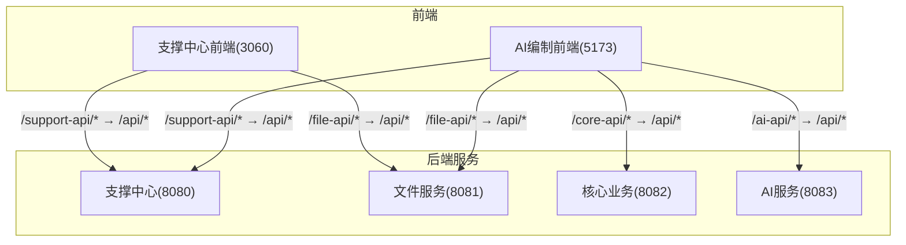
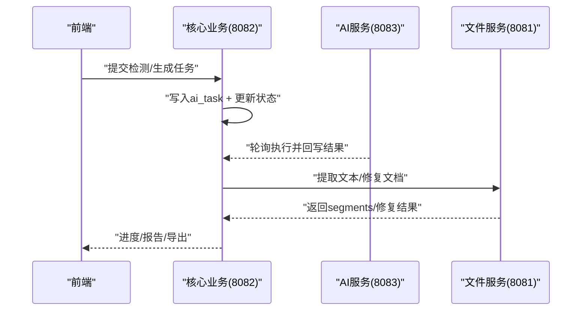
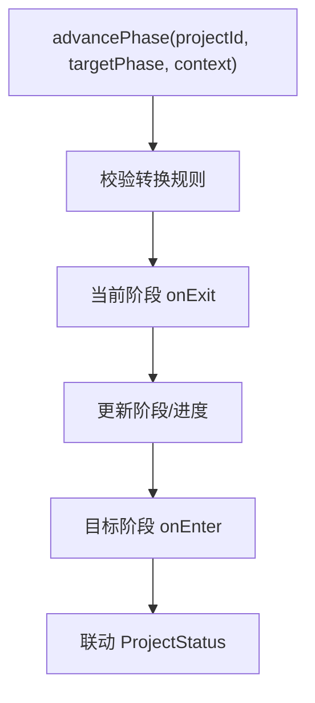
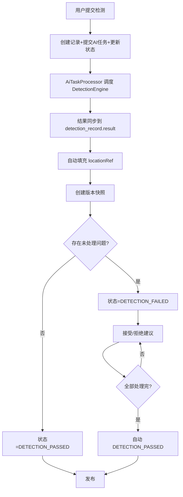
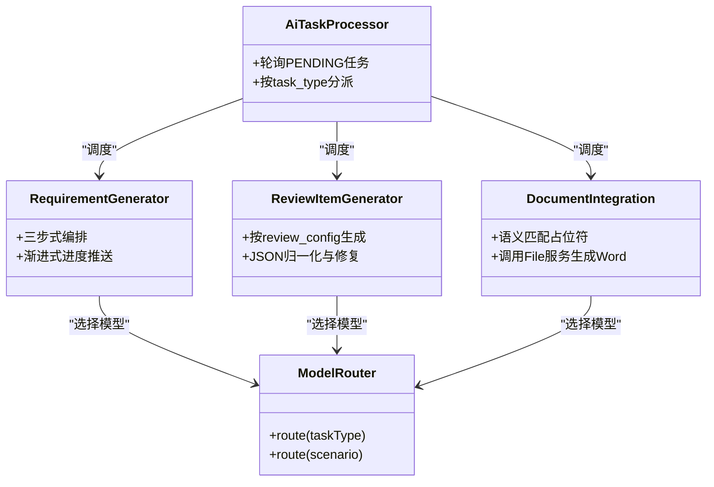
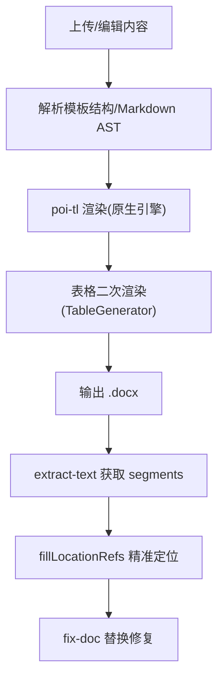
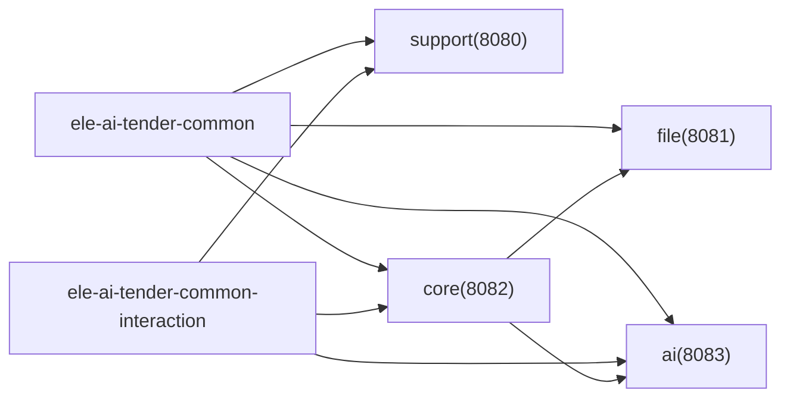

# 功能开发流程

<cite>
**本文引用的文件**   
- [PROJECT_SPEC_FINAL.md](file://docs/rules/PROJECT_SPEC_FINAL.md)
- [CODE_CONVENTIONS.md](file://docs/rules/CODE_CONVENTIONS.md)
- [FRONTEND_CONVENTIONS.md](file://docs/rules/FRONTEND_CONVENTIONS.md)
- [CORE_MODULE_SPEC.md](file://docs/rules/CORE_MODULE_SPEC.md)
- [AI_MODULE_SPEC.md](file://docs/rules/AI_MODULE_SPEC.md)
- [FILE_SERVICE_SPEC.md](file://docs/rules/FILE_SERVICE_SPEC.md)
- [SUPPORT_SYSTEM_SPEC.md](file://docs/rules/SUPPORT_SYSTEM_SPEC.md)
- [INTERACTION_INTEGRATION_SPEC.md](file://docs/rules/INTERACTION_INTEGRATION_SPEC.md)
- [DETECTION_FLOW_SPEC.md](file://docs/rules/DETECTION_FLOW_SPEC.md)
- [PHASE_FLOW_SPEC.md](file://docs/rules/PHASE_FLOW_SPEC.md)
- [Jenkinsfile-core.groovy](file://Jenkinsfile-core.groovy)
- [Jenkinsfile-ai.groovy](file://Jenkinsfile-ai.groovy)
</cite>

## 目录
1. [引言](#引言)
2. [项目结构](#项目结构)
3. [核心组件](#核心组件)
4. [架构总览](#架构总览)
5. [详细组件分析](#详细组件分析)
6. [依赖分析](#依赖分析)
7. [性能考虑](#性能考虑)
8. [故障排查指南](#故障排查指南)
9. [结论](#结论)
10. [附录：端到端开发流程与最佳实践](#附录端到端开发流程与最佳实践)

## 引言
本指南面向“招标文件AI编制系统”的功能开发，覆盖从需求分析到上线的完整周期。文档基于仓库内规范与实现，明确微服务模块边界、前后端并行开发模式、接口契约与数据模型规范、代码质量与安全要求，并提供常见场景的标准流程示例（新增API、数据库变更、前端页面等）。

## 项目结构
- 多模块后端：支撑中心(support)、核心业务(core)、AI服务(ai)、文件服务(file)、公共库(common)、交互协议库(common-interaction)。
- 双前端：支撑中心管理后台(3060)、AI编制业务前端(5173)，通过Vite代理转发至各后端服务。
- 持续集成：Jenkins流水线负责构建、部署与健康检查。

图表来源
- [FRONTEND_CONVENTIONS.md:27-44](file://docs/rules/FRONTEND_CONVENTIONS.md#L27-L44)
- [PROJECT_SPEC_FINAL.md:15-28](file://docs/rules/PROJECT_SPEC_FINAL.md#L15-L28)

章节来源
- [PROJECT_SPEC_FINAL.md:15-28](file://docs/rules/PROJECT_SPEC_FINAL.md#L15-L28)
- [FRONTEND_CONVENTIONS.md:1-70](file://docs/rules/FRONTEND_CONVENTIONS.md#L1-L70)

## 核心组件
- 支撑中心：认证、用户/角色/菜单、模板、知识库、模型配置与路由、系统参数、政策文件、消息、日志、版本、外部系统对接。
- 核心业务：项目管理、需求编制、评审项、文档集成、检测管理、AI任务编排、反馈、消息、政策文件、模板快照。
- AI服务：对话、优化、建议、文档匹配、知识库、智能检测、模型路由。
- 文件服务：上传下载、文本提取、Word模板渲染、Markdown转Word、文档修复。
- 公共库与交互协议：跨模块通用类型、对外交互协议与SPI、自动装配Starter。

章节来源
- [SUPPORT_SYSTEM_SPEC.md:1-258](file://docs/rules/SUPPORT_SYSTEM_SPEC.md#L1-L258)
- [CORE_MODULE_SPEC.md:1-358](file://docs/rules/CORE_MODULE_SPEC.md#L1-L358)
- [AI_MODULE_SPEC.md:1-211](file://docs/rules/AI_MODULE_SPEC.md#L1-L211)
- [FILE_SERVICE_SPEC.md:1-153](file://docs/rules/FILE_SERVICE_SPEC.md#L1-L153)
- [INTERACTION_INTEGRATION_SPEC.md:1-89](file://docs/rules/INTERACTION_INTEGRATION_SPEC.md#L1-L89)

## 架构总览
- 调用链路：前端→对应服务Controller→Service→Mapper；AI能力通过异步任务表解耦。
- 阶段推进：PhaseFlowController统一编排阶段流转与状态联动。
- 检测全链路：提交检测→AI执行→结果同步→定位填充→修复→发布。

图表来源
- [CORE_MODULE_SPEC.md:139-214](file://docs/rules/CORE_MODULE_SPEC.md#L139-L214)
- [AI_MODULE_SPEC.md:49-109](file://docs/rules/AI_MODULE_SPEC.md#L49-L109)
- [FILE_SERVICE_SPEC.md:86-93](file://docs/rules/FILE_SERVICE_SPEC.md#L86-L93)
- [DETECTION_FLOW_SPEC.md:1-217](file://docs/rules/DETECTION_FLOW_SPEC.md#L1-L217)

## 详细组件分析

### 阶段推进与状态机
- 控制器：PhaseFlowController统一校验转换规则、触发器onEnter/onExit、阶段/进度更新、Status联动。
- 触发器：BasicInfo/Requirement/ReviewItem/Document/Detection五类触发器，进入目标阶段时自动触发AI任务或前置校验。
- 状态机：ProjectStateMachine定义合法Status转换，确保不跳步、可重试。

图表来源
- [PHASE_FLOW_SPEC.md:72-85](file://docs/rules/PHASE_FLOW_SPEC.md#L72-L85)
- [PHASE_FLOW_SPEC.md:37-56](file://docs/rules/PHASE_FLOW_SPEC.md#L37-L56)

章节来源
- [PHASE_FLOW_SPEC.md:1-206](file://docs/rules/PHASE_FLOW_SPEC.md#L1-L206)
- [CORE_MODULE_SPEC.md:155-176](file://docs/rules/CORE_MODULE_SPEC.md#L155-L176)

### 检测全链路
- 提交入口：阶段推进自动触发或手动提交。
- 执行编排：AiTaskProcessor调度DetectionEngine，四种检测并行。
- 结果同步：AiTaskResultSyncHandler将检测结果落库并填充locationRef。
- 修复流程：accept/reject支持单条与批量，精准定位修改Word段落。

图表来源
- [DETECTION_FLOW_SPEC.md:9-29](file://docs/rules/DETECTION_FLOW_SPEC.md#L9-L29)
- [DETECTION_FLOW_SPEC.md:40-78](file://docs/rules/DETECTION_FLOW_SPEC.md#L40-L78)
- [DETECTION_FLOW_SPEC.md:98-146](file://docs/rules/DETECTION_FLOW_SPEC.md#L98-L146)

章节来源
- [DETECTION_FLOW_SPEC.md:1-217](file://docs/rules/DETECTION_FLOW_SPEC.md#L1-L217)

### AI生成与任务编排
- 生成器：需求生成三步式Agent编排（大纲→分章→审查修订），评审项按模板配置差异化生成，文档集成调用File服务生成Word。
- 任务表：ai_task承载任务生命周期与结果，result_synced标识业务同步终态。
- 模型路由：ModelRouter根据任务类型/使用场景选择主备模型，DynamicChatClientFactory动态创建客户端。

图表来源
- [AI_MODULE_SPEC.md:49-109](file://docs/rules/AI_MODULE_SPEC.md#L49-L109)
- [AI_MODULE_SPEC.md:129-141](file://docs/rules/AI_MODULE_SPEC.md#L129-L141)
- [CORE_MODULE_SPEC.md:187-214](file://docs/rules/CORE_MODULE_SPEC.md#L187-L214)

章节来源
- [AI_MODULE_SPEC.md:1-211](file://docs/rules/AI_MODULE_SPEC.md#L1-L211)
- [CORE_MODULE_SPEC.md:187-214](file://docs/rules/CORE_MODULE_SPEC.md#L187-L214)

### 文件服务与文档引擎
- 文档生成：Word模板(poi-tl)渲染、Markdown→Word转换、表格编程生成。
- 文本提取：段落级segments+fullText，供检测定位。
- 文档修复：基于locationRef精准替换，两级匹配策略。

图表来源
- [FILE_SERVICE_SPEC.md:18-93](file://docs/rules/FILE_SERVICE_SPEC.md#L18-L93)
- [FILE_SERVICE_SPEC.md:73-85](file://docs/rules/FILE_SERVICE_SPEC.md#L73-L85)

章节来源
- [FILE_SERVICE_SPEC.md:1-153](file://docs/rules/FILE_SERVICE_SPEC.md#L1-L153)

## 依赖分析
- 模块边界：非交互公共类型→common；交互协议→common-interaction；controller/facade显式转换，service不透传协议DTO。
- 服务间调用：core/support通过InternalFileServiceClient访问file服务；AI与core通过ai_task异步解耦。
- 前端代理：双前端分别按前缀映射到不同后端服务。

图表来源
- [PROJECT_SPEC_FINAL.md:40-46](file://docs/rules/PROJECT_SPEC_FINAL.md#L40-L46)
- [FILE_SERVICE_SPEC.md:129-137](file://docs/rules/FILE_SERVICE_SPEC.md#L129-L137)
- [INTERACTION_INTEGRATION_SPEC.md:1-89](file://docs/rules/INTERACTION_INTEGRATION_SPEC.md#L1-L89)

章节来源
- [PROJECT_SPEC_FINAL.md:40-46](file://docs/rules/PROJECT_SPEC_FINAL.md#L40-L46)
- [FILE_SERVICE_SPEC.md:129-137](file://docs/rules/FILE_SERVICE_SPEC.md#L129-L137)
- [INTERACTION_INTEGRATION_SPEC.md:1-89](file://docs/rules/INTERACTION_INTEGRATION_SPEC.md#L1-L89)

## 性能考虑
- AI任务并发：DynamicThreadPoolManager + UserConcurrencyManager双层控制，Semaphore限流。
- 文档渲染：原生poi-tl引擎避免反射开销；两阶段渲染提升容错与性能。
- 缓存与限流：Redis用于会话、任务缓存、Token用量统计与限流键。
- 超时与降级：SSE推荐60秒；AI不可用/失败走降级与重试机制。

章节来源
- [AI_MODULE_SPEC.md:143-161](file://docs/rules/AI_MODULE_SPEC.md#L143-L161)
- [FILE_SERVICE_SPEC.md:33-71](file://docs/rules/FILE_SERVICE_SPEC.md#L33-L71)
- [CORE_MODULE_SPEC.md:284-293](file://docs/rules/CORE_MODULE_SPEC.md#L284-L293)

## 故障排查指南
- 阶段推进异常：检查PhaseFlowController日志与canComplete校验。
- 检测相关问题：查看ai_task状态、detection_record.result、locationRef填充日志。
- AI生成卡住：检查ai_task.started_at、AiTaskProcessor日志、专用需求生成日志。
- 文件服务问题：确认白名单、大小限制、路径权限、SHA-256计算一致性。
- 安全与JWT：确认密钥配置、过期时间、签名算法与字符集。

章节来源
- [PHASE_FLOW_SPEC.md:193-206](file://docs/rules/PHASE_FLOW_SPEC.md#L193-L206)
- [DETECTION_FLOW_SPEC.md:198-210](file://docs/rules/DETECTION_FLOW_SPEC.md#L198-L210)
- [AI_MODULE_SPEC.md:189-205](file://docs/rules/AI_MODULE_SPEC.md#L189-L205)
- [FILE_SERVICE_SPEC.md:139-147](file://docs/rules/FILE_SERVICE_SPEC.md#L139-L147)
- [CODE_CONVENTIONS.md:323-382](file://docs/rules/CODE_CONVENTIONS.md#L323-L382)

## 结论
本指南以仓库规范为依据，明确了微服务边界、前后端并行协作方式、接口契约与数据模型规范、质量与安全要求，以及关键流程的最佳实践。遵循本流程可保障新功能高质量交付与稳定上线。

## 附录：端到端开发流程与最佳实践

### 全流程阶段
- 需求分析与评审：产出需求说明、验收标准、影响面评估（模块归属、接口变更、数据模型变更）。
- 技术方案设计：确定所属服务模块、接口契约、数据模型、时序图/流程图、风险与回滚方案。
- 代码实现：按分层与命名规范实现，补充Swagger注解与访问日志字段。
- 单元测试：覆盖核心逻辑与异常分支，保证关键路径可用。
- 集成测试：跨服务联调（core↔ai/file），验证阶段推进、检测链路、文档生成。
- 联调测试：前后端联调，验证代理规则、错误码、进度展示与用户体验。
- 代码质量与安全：静态分析、安全扫描、依赖漏洞检查。
- 构建与发布：Jenkins流水线构建、部署、健康检查。
- 上线与监控：灰度/观察期、指标与告警、问题复盘。

章节来源
- [PROJECT_SPEC_FINAL.md:77-91](file://docs/rules/PROJECT_SPEC_FINAL.md#L77-L91)
- [Jenkinsfile-core.groovy:46-129](file://Jenkinsfile-core.groovy#L46-L129)
- [Jenkinsfile-ai.groovy:46-129](file://Jenkinsfile-ai.groovy#L46-L129)

### 微服务模块划分原则
- 非交互公共类型放common；交互协议与SPI放common-interaction，单源维护。
- controller/facade边界做显式转换，service层不透传协议DTO。
- core负责业务编排与何时生成；ai负责如何生成；file提供文档能力。
- 新增模块需在项目规范中登记表前缀与端口。

章节来源
- [PROJECT_SPEC_FINAL.md:40-56](file://docs/rules/PROJECT_SPEC_FINAL.md#L40-L56)
- [CODE_CONVENTIONS.md:241-255](file://docs/rules/CODE_CONVENTIONS.md#L241-L255)

### 前后端并行开发与接口契约
- 前端双项目独立开发，按前缀代理到后端服务。
- 接口风格：kebab-case、资源复数、动作型动词后缀；统一返回结构与分页规范。
- 类型归属：跨模块通用类型在common，交互协议在common-interaction，模块内部DTO在各自dto包。
- Swagger注解：Controller/Method/DTO级别标注，便于文档与联调。

章节来源
- [FRONTEND_CONVENTIONS.md:27-57](file://docs/rules/FRONTEND_CONVENTIONS.md#L27-L57)
- [CODE_CONVENTIONS.md:67-183](file://docs/rules/CODE_CONVENTIONS.md#L67-L183)
- [CODE_CONVENTIONS.md:241-255](file://docs/rules/CODE_CONVENTIONS.md#L241-L255)

### 数据模型设计规范
- 表命名：snake_case并按模块加前缀（sup_/tb_/ai_/file_）。
- 实体继承BaseEntity，基础字段由MetaObjectHandlerImpl自动填充。
- 主键默认自增，必要时雪花算法；DDL放在模块sql/init.sql。
- 字段命名：数据库列snake_case，Java字段camelCase。

章节来源
- [CODE_CONVENTIONS.md:9-66](file://docs/rules/CODE_CONVENTIONS.md#L9-L66)

### 代码编写规范检查、静态分析与安全扫描
- 编码规范：分层职责、命名、事务、异常、安全、日志脱敏、链路追踪。
- 安全约束：UTF-8显式指定、配置快速失败、JWT密钥环境变量注入、密码哈希与HMAC签名工具。
- 建议接入：SonarQube静态分析、依赖漏洞扫描（SCA）、敏感信息扫描。

章节来源
- [CODE_CONVENTIONS.md:186-393](file://docs/rules/CODE_CONVENTIONS.md#L186-L393)

### 常见开发场景最佳实践

#### 新增API接口（后端）
- 在对应模块controller添加接口，遵循URL风格与HTTP语义。
- Service层实现业务逻辑，必要时开启事务；统一返回Result/InteractionResult。
- 补充Swagger注解与访问日志字段；抛BusinessException表达业务错误。
- 若涉及AI能力，写入ai_task并通过AiTaskProcessor异步执行。

章节来源
- [CODE_CONVENTIONS.md:67-183](file://docs/rules/CODE_CONVENTIONS.md#L67-L183)
- [CORE_MODULE_SPEC.md:9-138](file://docs/rules/CORE_MODULE_SPEC.md#L9-L138)
- [AI_MODULE_SPEC.md:12-47](file://docs/rules/AI_MODULE_SPEC.md#L12-L47)

#### 数据库表变更
- 在模块sql/init.sql新增或调整DDL；遵守表前缀与字段命名规范。
- 实体类继承BaseEntity，注意乐观锁与逻辑删除行为。
- 若为多选字段（如applicable_category），使用逗号分隔存储与CommaSeparatedFieldSql工具进行精确匹配。

章节来源
- [CODE_CONVENTIONS.md:9-66](file://docs/rules/CODE_CONVENTIONS.md#L9-L66)
- [CORE_MODULE_SPEC.md:275-283](file://docs/rules/CORE_MODULE_SPEC.md#L275-L283)

#### 前端页面开发
- 在src/api下新增接口函数，保持与后端路径一致。
- 使用Pinia store管理状态，组合式函数封装通用逻辑（如useLatestTask）。
- 按代理规则调用后端服务，统一错误处理与进度展示。

章节来源
- [FRONTEND_CONVENTIONS.md:1-70](file://docs/rules/FRONTEND_CONVENTIONS.md#L1-L70)

#### 引入AI能力（生成/检测）
- 在core侧组装参数并写入ai_task，设置bizId/bizType。
- ai侧AiTaskProcessor调度对应Generator/Detector执行，回写result。
- core侧AiTaskResultSyncHandler同步结果并推进业务状态。

章节来源
- [CORE_MODULE_SPEC.md:187-214](file://docs/rules/CORE_MODULE_SPEC.md#L187-L214)
- [AI_MODULE_SPEC.md:49-109](file://docs/rules/AI_MODULE_SPEC.md#L49-L109)

#### 文档生成与修复
- 使用WordTemplateEngine原生引擎渲染，避免SpringEL反射问题。
- Markdown→Word转换后，如需表格则二次渲染TableGenerator。
- 检测完成后调用extract-text获取segments，填充locationRef，再调用fix-doc精准修复。

章节来源
- [FILE_SERVICE_SPEC.md:33-93](file://docs/rules/FILE_SERVICE_SPEC.md#L33-L93)
- [DETECTION_FLOW_SPEC.md:98-146](file://docs/rules/DETECTION_FLOW_SPEC.md#L98-L146)

#### 构建与发布
- Jenkins流水线：Maven构建、SSH传输JAR、启动脚本执行、健康检查。
- 环境隔离：APP_ENV、端口、JAR_OPTS等通过环境变量配置。
- 失败重试：健康检查多次尝试，失败即终止流水线。

章节来源
- [Jenkinsfile-core.groovy:46-129](file://Jenkinsfile-core.groovy#L46-L129)
- [Jenkinsfile-ai.groovy:46-129](file://Jenkinsfile-ai.groovy#L46-L129)