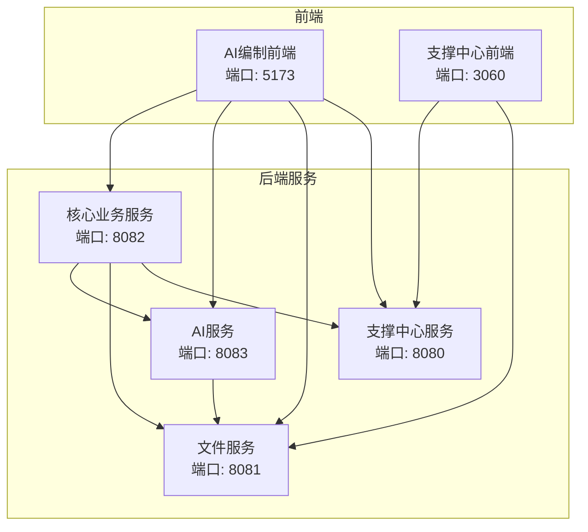
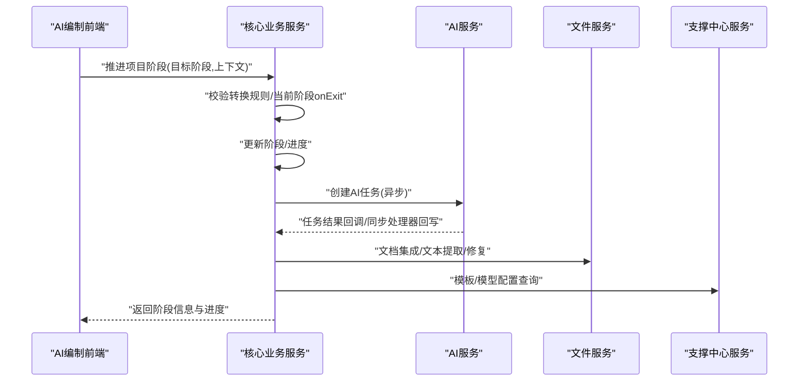
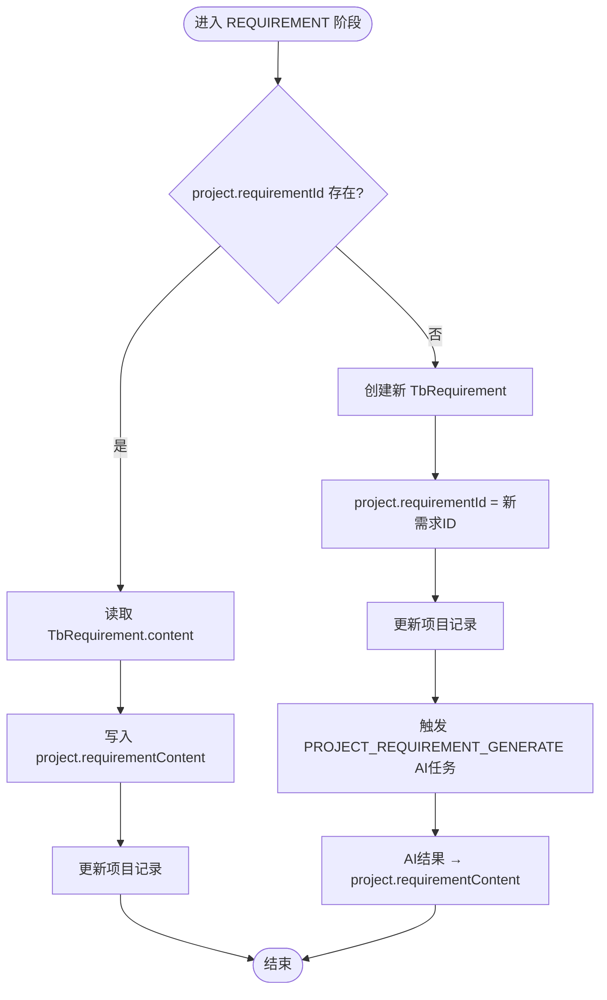
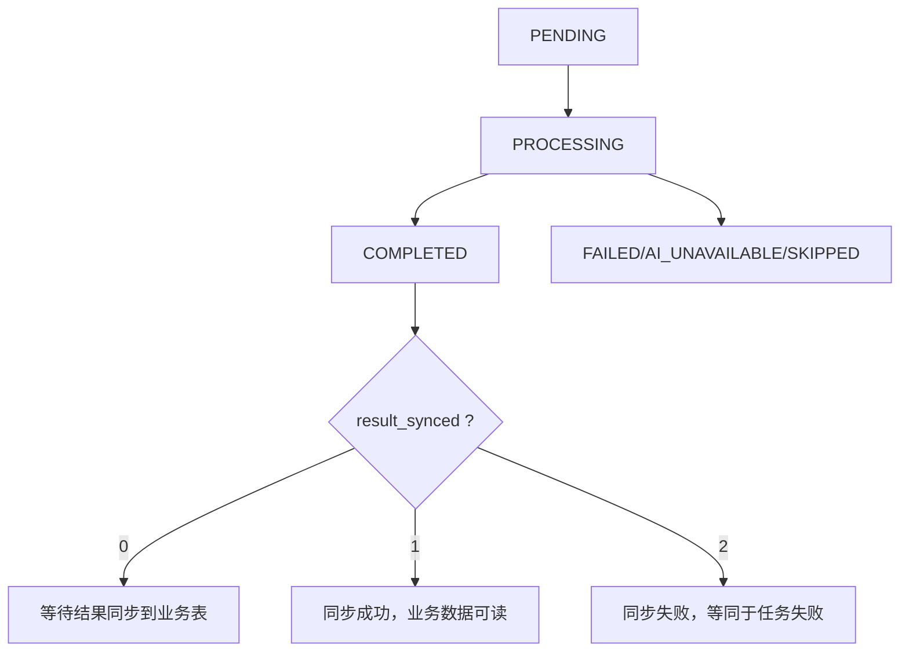
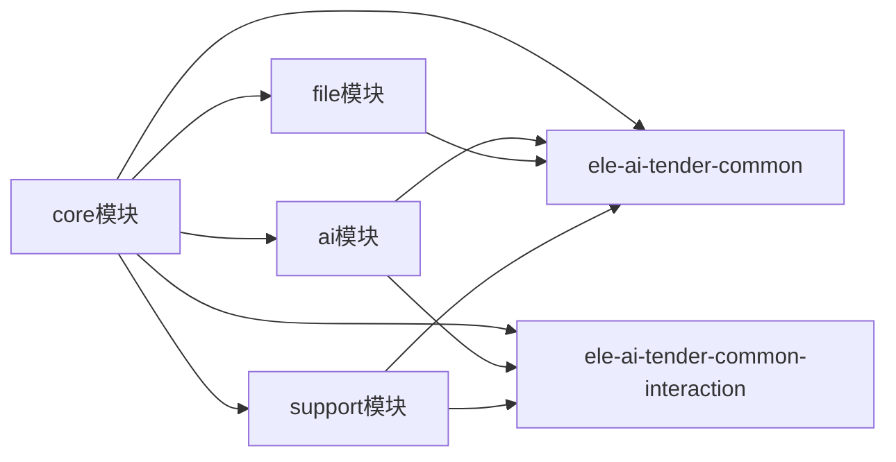

# 团队协作规范

<cite>
**本文引用的文件**   
- [项目规范总览](file://docs/rules/PROJECT_SPEC_FINAL.md)
- [后端编码规范](file://docs/rules/CODE_CONVENTIONS.md)
- [前端编码规范](file://docs/rules/FRONTEND_CONVENTIONS.md)
- [核心业务模块规范](file://docs/rules/CORE_MODULE_SPEC.md)
- [支撑中心模块规范](file://docs/rules/SUPPORT_SYSTEM_SPEC.md)
- [文件服务模块规范](file://docs/rules/FILE_SERVICE_SPEC.md)
- [阶段流程控制器规范](file://docs/rules/PHASE_FLOW_SPEC.md)
</cite>

## 目录
1. [引言](#引言)
2. [项目结构](#项目结构)
3. [核心角色与职责边界](#核心角色与职责边界)
4. [任务分配与管理流程](#任务分配与管理流程)
5. [沟通协作机制](#沟通协作机制)
6. [知识分享与技术沉淀](#知识分享与技术沉淀)
7. [绩效评估与质量考核](#绩效评估与质量考核)
8. [远程协作与项目管理工具使用规范](#远程协作与项目管理工具使用规范)
9. [架构概览（面向协作的视角）](#架构概览面向协作的视角)
10. [详细组件分析（与协作相关的关键点）](#详细组件分析与协作相关的关键点)
11. [依赖关系与协作边界](#依赖关系与协作边界)
12. [性能与稳定性协作要点](#性能与稳定性协作要点)
13. [故障排查与问题升级](#故障排查与问题升级)
14. [结论](#结论)

## 引言
本规范旨在为“招标文件AI编制系统”建立统一的团队协作标准，覆盖角色分工、任务管理、沟通机制、知识沉淀、质量与绩效评估以及工具使用。规范以仓库内现有工程规范为依据，确保团队在前后端协同、跨服务协作、AI能力集成等方面保持一致性、可追溯性与可维护性。

## 项目结构
本项目采用多模块微服务+双前端的架构：
- 后端服务：支撑中心、核心业务、AI服务、文件服务，通过统一接口规范与JWT认证互通
- 前端应用：支撑中心管理后台、AI编制业务前端，独立部署、统一代理规则
- 公共库：通用类型与交互协议定义，保证单源与一致性

图表来源
- [项目规范总览:1-91](file://docs/rules/PROJECT_SPEC_FINAL.md#L1-L91)
- [前端编码规范:1-70](file://docs/rules/FRONTEND_CONVENTIONS.md#L1-L70)

章节来源
- [项目规范总览:1-91](file://docs/rules/PROJECT_SPEC_FINAL.md#L1-L91)
- [前端编码规范:1-70](file://docs/rules/FRONTEND_CONVENTIONS.md#L1-L70)

## 核心角色与职责边界
为保证交付效率与质量，建议按以下角色划分职责，并与现有工程规范对齐：

- 产品经理
  - 负责需求收集、优先级排序、验收标准制定；输出PRD与原型，明确阶段推进与状态流转规则
  - 与核心业务模块规范对齐，确保“项目状态/阶段推进”的业务约束清晰可落地
  - 对AI生成内容的可用性、人工审核机制提出明确要求

- UI设计师
  - 提供高保真原型与交互说明，遵循双前端项目的组件与页面组织约定
  - 关注AI助手替换模式、渐进式生成渲染等复杂交互的可实现性与体验一致性

- 前端开发
  - 遵循前端编码规范：Vue 3 + TypeScript + Vite + Pinia + Vue Router
  - 严格遵循代理规则与API调用约定，统一封装请求与错误处理
  - 负责AI任务轮询、进度映射、终态判断、编辑器替换方案等关键交互

- 后端开发
  - 遵循后端编码规范：分层职责、命名规范、异常处理、安全与日志链路追踪
  - 遵守模块边界与表前缀规范，保持DTO单源与协议层隔离
  - 负责阶段推进、AI任务编排、检测全链路、文档生成引擎对接等

- 测试工程师
  - 基于接口清单与模块规范编写用例，覆盖正向、异常、边界与并发场景
  - 针对AI任务异步流程、结果同步、检测修复定位等进行专项验证
  - 参与回归与发布验收，保障版本质量

章节来源
- [后端编码规范:186-272](file://docs/rules/CODE_CONVENTIONS.md#L186-L272)
- [前端编码规范:1-70](file://docs/rules/FRONTEND_CONVENTIONS.md#L1-L70)
- [核心业务模块规范:1-154](file://docs/rules/CORE_MODULE_SPEC.md#L1-L154)
- [支撑中心模块规范:1-127](file://docs/rules/SUPPORT_SYSTEM_SPEC.md#L1-L127)

## 任务分配与管理流程
围绕“需求拆解—任务估算—进度跟踪—交付验收”的全流程，结合现有工程规范，建议如下：

- 需求拆解
  - 由产品经理输出PRD，明确阶段推进规则、状态机与校验条件
  - 技术侧依据核心业务模块规范进行功能拆分，识别跨服务协作点（core→ai/file/support）
  - 将需求拆分为用户故事与任务项，标注影响范围（前端/后端/数据库/配置）

- 任务估算
  - 前端根据组件与API变更估算工作量，考虑AI任务轮询与替换模式的复杂度
  - 后端根据分层职责与事务边界估算，注意外部HTTP调用避免长事务
  - 测试根据接口清单与异常路径估算用例数量与自动化覆盖率

- 进度跟踪
  - 每日站会同步阻塞点与风险，更新任务看板状态
  - 使用统一的状态与阶段推进接口，确保前后端一致理解
  - 对AI任务进度使用统一映射规则，避免歧义

- 交付验收
  - 代码评审通过后进入联调与测试阶段
  - 验收标准包含：接口契约、状态/阶段流转、异常处理、日志与链路追踪、安全与权限
  - 发布前完成回归测试与性能基线检查

章节来源
- [核心业务模块规范:155-271](file://docs/rules/CORE_MODULE_SPEC.md#L155-L271)
- [阶段流程控制器规范:1-151](file://docs/rules/PHASE_FLOW_SPEC.md#L1-L151)
- [后端编码规范:256-272](file://docs/rules/CODE_CONVENTIONS.md#L256-L272)

## 沟通协作机制
为保障信息透明与高效协作，建议如下会议与机制：

- 日常站会（15分钟）
  - 昨日进展、今日计划、阻塞问题
  - 聚焦跨服务协作点与风险暴露

- 周例会（60分钟）
  - 里程碑回顾、质量指标通报、下阶段计划
  - 讨论重大变更与架构调整的影响面

- 技术评审会议（按需）
  - 涉及阶段推进、AI任务编排、检测修复定位等复杂逻辑时进行评审
  - 评审产出需纳入规范或设计文档，并同步至知识库

- 问题升级机制
  - 一线支持无法解决时升级到二线研发
  - 严重问题启动应急流程，记录根因与改进措施

[本节为通用协作机制描述，不直接分析具体文件]

## 知识分享与技术沉淀
- 技术文档编写
  - 新增或变更接口需在对应模块规范中登记，保持接口清单与实现一致
  - 复杂流程（如阶段推进、检测全链路）需补充流程图与触发器说明

- 代码注释规范
  - 遵循后端编码规范的命名与分层约定，Service层方法需有清晰的入参出参与异常说明
  - 前端组合式函数与工具类需有用途说明与使用示例路径

- 内部培训安排
  - 定期开展AI任务进度与终态规则、检测修复定位策略等专题培训
  - 新人入职培训涵盖编码规范、代理规则、安全与日志链路追踪

章节来源
- [后端编码规范:186-272](file://docs/rules/CODE_CONVENTIONS.md#L186-L272)
- [前端编码规范:45-70](file://docs/rules/FRONTEND_CONVENTIONS.md#L45-L70)
- [核心业务模块规范:187-271](file://docs/rules/CORE_MODULE_SPEC.md#L187-L271)
- [阶段流程控制器规范:72-151](file://docs/rules/PHASE_FLOW_SPEC.md#L72-L151)

## 绩效评估与质量考核
- 代码质量
  - 遵循后端编码规范的分层职责、异常处理与安全规范
  - 前端遵循组件与状态管理规范，避免直接读写localStorage
  - 接口契约一致性、错误码与返回结构符合规范

- 工作效率
  - 按时交付率、缺陷密度、返工率
  - AI任务轮询与进度映射的正确性与用户体验

- 团队协作
  - 跨服务协作点是否清晰、文档是否及时更新
  - 问题响应速度与解决质量

- 指标采集
  - 通过访问日志、操作日志与链路追踪统计接口调用与耗时
  - 结合Jenkins流水线构建与测试结果形成质量报告

章节来源
- [后端编码规范:274-393](file://docs/rules/CODE_CONVENTIONS.md#L274-L393)
- [前端编码规范:1-70](file://docs/rules/FRONTEND_CONVENTIONS.md#L1-L70)
- [支撑中心模块规范:145-184](file://docs/rules/SUPPORT_SYSTEM_SPEC.md#L145-L184)

## 远程协作与项目管理工具使用规范
- 代码托管与分支策略
  - 主分支保护，特性分支开发，合并前必须通过评审与CI
  - 提交信息遵循约定，关联任务编号

- 持续集成与发布
  - 使用Jenkinsfile进行构建与测试，确保多模块一致构建
  - 发布前完成接口文档与配置变更同步

- 文档与知识库
  - 规范与指南存放于docs/rules与docs/guides，版本化维护
  - 重要决策与排障原则归档至知识库，便于检索与传承

[本节为通用工具使用规范描述，不直接分析具体文件]

## 架构概览（面向协作的视角）
从协作角度，核心在于“前后端契约、跨服务边界、AI异步解耦”。

图表来源
- [阶段流程控制器规范:72-151](file://docs/rules/PHASE_FLOW_SPEC.md#L72-L151)
- [核心业务模块规范:155-271](file://docs/rules/CORE_MODULE_SPEC.md#L155-L271)
- [文件服务模块规范:1-153](file://docs/rules/FILE_SERVICE_SPEC.md#L1-L153)
- [支撑中心模块规范:1-127](file://docs/rules/SUPPORT_SYSTEM_SPEC.md#L1-L127)

## 详细组件分析与协作相关的关键点
### 阶段推进与触发器（协作重点）
- 阶段只能顺序推进，每个阶段有独立的PhaseTrigger，进入新阶段自动触发AI任务
- 需求阶段存在两种路径：引入已有需求或直接触发AI生成，内容快照写入项目字段
- 前端按钮与后端advancePhase接口一一对应，确保交互与状态一致

图表来源
- [阶段流程控制器规范:94-106](file://docs/rules/PHASE_FLOW_SPEC.md#L94-L106)

章节来源
- [阶段流程控制器规范:1-151](file://docs/rules/PHASE_FLOW_SPEC.md#L1-L151)
- [核心业务模块规范:177-214](file://docs/rules/CORE_MODULE_SPEC.md#L177-L214)

### AI任务进度与终态（协作重点）
- 通过status与result_synced双维度判断真实进度，前端使用统一映射规则
- 检测场景例外，使用独立进度API，COMPLETED即100%
- 协作要求：前后端对进度语义达成一致，避免歧义

图表来源
- [核心业务模块规范:187-214](file://docs/rules/CORE_MODULE_SPEC.md#L187-L214)

章节来源
- [核心业务模块规范:187-214](file://docs/rules/CORE_MODULE_SPEC.md#L187-L214)

### 文件服务与文档生成（协作重点）
- 文件上传下载、文档生成引擎、Word修复引擎与文本提取器为协作关键
- 前端通过代理规则调用后端接口，后端通过InternalFileServiceClient进行服务间调用
- 协作要求：错误响应处理、服务间认证、ObjectMapper复用、fix-doc参数反序列化正确

章节来源
- [文件服务模块规范:1-153](file://docs/rules/FILE_SERVICE_SPEC.md#L1-L153)
- [前端编码规范:27-44](file://docs/rules/FRONTEND_CONVENTIONS.md#L27-L44)

## 依赖关系与协作边界
- 非交互公共类型放common模块，交互协议DTO放common-interaction，禁止复制
- controller/facade边界显式转换，service层不直接透传协议DTO
- core模块负责业务编排，ai模块提供AI能力，通过ai_task表异步解耦，无直接HTTP调用

图表来源
- [项目规范总览:40-46](file://docs/rules/PROJECT_SPEC_FINAL.md#L40-L46)
- [后端编码规范:241-255](file://docs/rules/CODE_CONVENTIONS.md#L241-L255)

章节来源
- [项目规范总览:40-46](file://docs/rules/PROJECT_SPEC_FINAL.md#L40-L46)
- [后端编码规范:241-255](file://docs/rules/CODE_CONVENTIONS.md#L241-L255)

## 性能与稳定性协作要点
- 避免在事务方法中调用外部HTTP接口，防止事务时长过长
- AI流式响应超时时间推荐60秒，必须处理客户端断开连接
- Token用量统计与限流缓存到Redis，按用户/项目设置上限
- 文档生成两阶段渲染，表格生成需设置边框，避免渲染异常

章节来源
- [后端编码规范:256-272](file://docs/rules/CODE_CONVENTIONS.md#L256-L272)
- [核心业务模块规范:246-271](file://docs/rules/CORE_MODULE_SPEC.md#L246-L271)
- [文件服务模块规范:33-72](file://docs/rules/FILE_SERVICE_SPEC.md#L33-L72)

## 故障排查与问题升级
- 项目状态异常：查tb_project.status，检查状态流转是否合法
- 阶段推进失败：查PhaseFlowController日志，核对canComplete与onEnter/onExit
- 需求阶段内容为空：查requirement_id与AI任务状态
- AI生成失败：查sup_model_config配置与Token用量
- 检测相关问题：详见检测全链路规范，检查locationRef与修复替换

章节来源
- [核心业务模块规范:342-350](file://docs/rules/CORE_MODULE_SPEC.md#L342-L350)
- [阶段流程控制器规范:72-151](file://docs/rules/PHASE_FLOW_SPEC.md#L72-L151)

## 结论
本规范以仓库内现有工程规范为基础，明确了团队协作的角色分工、任务管理、沟通机制、知识沉淀、质量与绩效评估以及工具使用。通过严格的契约与边界约束、统一的进度与终态语义、完善的排障与升级机制，确保项目在复杂AI能力与多服务协作环境下仍能高效、稳定地交付。