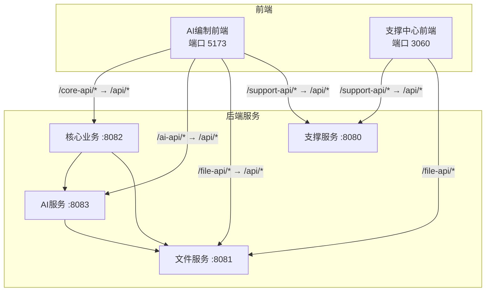
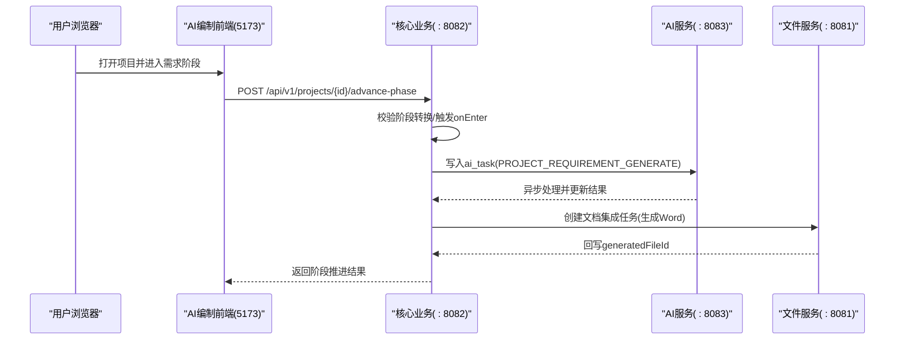
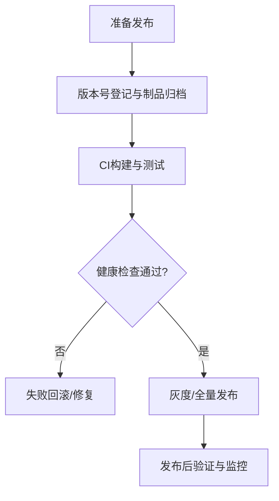
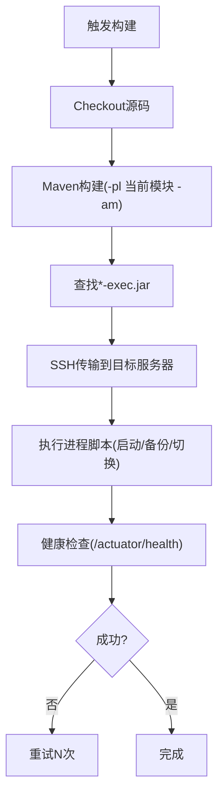
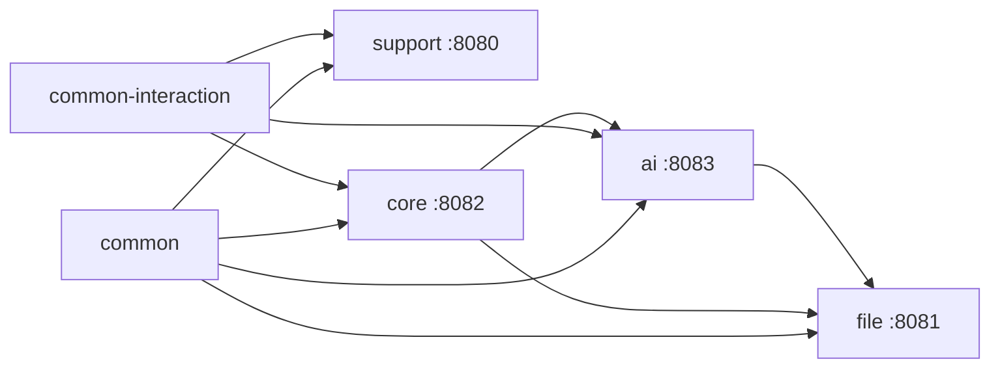
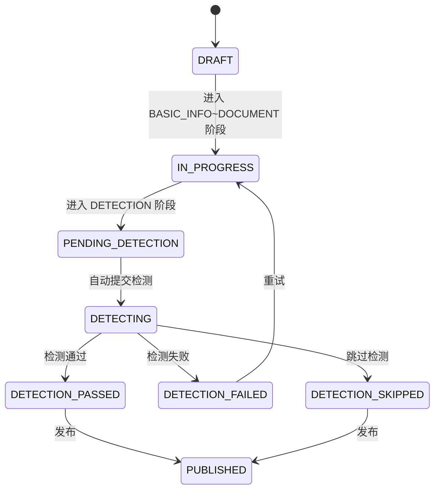

# 开发流程

<cite>
**本文引用的文件**   
- [CLAUDE.md](file://CLAUDE.md)
- [PROJECT_SPEC_FINAL.md](file://docs/rules/PROJECT_SPEC_FINAL.md)
- [CODE_CONVENTIONS.md](file://docs/rules/CODE_CONVENTIONS.md)
- [FRONTEND_CONVENTIONS.md](file://docs/rules/FRONTEND_CONVENTIONS.md)
- [PHASE_FLOW_SPEC.md](file://docs/rules/PHASE_FLOW_SPEC.md)
- [DETECTION_FLOW_SPEC.md](file://docs/rules/DETECTION_FLOW_SPEC.md)
- [Jenkinsfile-core.groovy](file://Jenkinsfile-core.groovy)
- [Jenkinsfile-ai.groovy](file://Jenkinsfile-ai.groovy)
- [Jenkinsfile-file.groovy](file://Jenkinsfile-file.groovy)
- [Jenkinsfile-support.groovy](file://Jenkinsfile-support.groovy)
- [index.vue（版本管理）](file://ele-ai-tender-support-frontend/src/views/version/index.vue)
- [IProjectVersionService.java](file://ele-ai-tender-system/ele-ai-tender-core/src/main/java/com/jy/eleaitender/core/service/IProjectVersionService.java)
- [ProjectController.java](file://ele-ai-tender-system/ele-ai-tender-core/src/main/java/com/jy/eleaitender/core/controller/ProjectController.java)
</cite>

## 目录
1. [引言](#引言)
2. [项目结构](#项目结构)
3. [核心组件](#核心组件)
4. [架构总览](#架构总览)
5. [详细组件分析](#详细组件分析)
6. [依赖分析](#依赖分析)
7. [性能考虑](#性能考虑)
8. [故障排查指南](#故障排查指南)
9. [结论](#结论)
10. [附录](#附录)

## 引言
本指南面向“招标文件AI编制系统”的开发者与运维人员，提供从需求到发布的全链路开发流程规范。内容覆盖：
- 新功能开发标准流程（需求分析、技术设计、编码实现、代码审查、测试验证）
- 分支管理与合并请求流程
- 版本发布流程（版本号管理、变更日志、发布检查清单）
- CI/CD流水线配置说明（自动化构建、测试执行、部署策略）
- Bug修复流程、紧急发布与回滚策略
- 团队协作规范（任务分配、进度跟踪、沟通机制）

## 项目结构
仓库采用前后端分离与多模块后端架构：
- 前端双应用：支撑中心管理后台与AI编制业务前端
- 后端多模块：公共库、交互协议库、支撑服务、文件服务、核心业务服务、AI服务
- 文档与规范集中于 docs/rules 与根级 CLAUDE.md

图表来源
- [CLAUDE.md:101-115](file://CLAUDE.md#L101-L115)
- [PROJECT_SPEC_FINAL.md:17-27](file://docs/rules/PROJECT_SPEC_FINAL.md#L17-L27)

章节来源
- [CLAUDE.md:1-192](file://CLAUDE.md#L1-L192)
- [PROJECT_SPEC_FINAL.md:1-91](file://docs/rules/PROJECT_SPEC_FINAL.md#L1-L91)

## 核心组件
- 公共库与交互协议：统一实体、异常、响应、工具类与对外交互DTO/SPI
- 支撑服务：认证、权限、用户、角色、菜单、模板、模型配置、消息、日志、版本管理等
- 文件服务：文件上传下载、文档生成引擎（Markdown→Word）、Word修复引擎
- 核心业务：项目管理、需求编制、评审项、检测、文档集成、AI任务编排
- AI服务：对话、知识库、文档匹配、智能检测、模型路由、连通性测试

章节来源
- [CLAUDE.md:17-28](file://CLAUDE.md#L17-L28)
- [PROJECT_SPEC_FINAL.md:15-27](file://docs/rules/PROJECT_SPEC_FINAL.md#L15-L27)

## 架构总览
系统通过统一的接口前缀与代理规则组织前后端交互；后端服务间通过HTTP或异步任务解耦协作。

图表来源
- [PHASE_FLOW_SPEC.md:72-85](file://docs/rules/PHASE_FLOW_SPEC.md#L72-L85)
- [CLAUDE.md:153-158](file://CLAUDE.md#L153-L158)

## 详细组件分析

### 新功能开发标准流程
- 需求分析
  - 在 docs/projects 下整理需求背景、范围、验收标准
  - 明确涉及模块边界与接口契约，必要时新增/修订 docs/rules 下的规范
- 技术设计
  - 输出实施计划至 docs/plans，包含数据模型变更、接口定义、状态机/流程图、风险与回滚方案
  - 遵循表前缀、命名、分层、异常与安全等规范
- 编码实现
  - 后端：按包结构分层，Service 接口以 I*Service 命名，使用统一 Result/InteractionResult 返回
  - 前端：API 调用集中 src/api，状态走 Pinia，组件与路由命名遵循约定
- 代码审查
  - 提交前自检：前端 npm run build；后端 mvn clean test
  - 审查要点：是否符合规范、是否引入安全/性能隐患、是否完善日志与错误码
- 测试验证
  - 单元测试覆盖关键逻辑；端到端联调覆盖主流程与异常路径
  - 对AI相关能力需人工审核机制与SSE超时/断连处理

章节来源
- [CLAUDE.md:99-99](file://CLAUDE.md#L99-L99)
- [CODE_CONVENTIONS.md:186-272](file://docs/rules/CODE_CONVENTIONS.md#L186-L272)
- [FRONTEND_CONVENTIONS.md:1-70](file://docs/rules/FRONTEND_CONVENTIONS.md#L1-L70)

### 分支管理策略
- 主分支保护
  - 建议启用 main/master 分支保护，禁止直接推送，仅允许通过合并请求合入
- 功能分支命名
  - 推荐格式：feature/<模块>-<简述> 或 fix/<问题编号>-<简述>
  - 分支粒度尽量小，聚焦单一职责
- 合并请求流程
  - 提交后发起MR，至少一名同行评审通过后合入
  - MR描述需包含改动范围、影响面、自测结果与回滚方案

[本节为通用流程说明，不直接分析具体文件]

### 版本发布流程
- 版本号管理
  - 建议使用语义化版本（主.次.修订），发布前在版本管理中登记版本信息与制品
- 变更日志生成
  - 基于Git提交信息自动生成变更摘要，并在版本页面展示
- 发布检查清单
  - 构建成功、健康检查通过、数据库脚本已就绪、配置项与环境变量核对、回滚脚本可用

章节来源
- [index.vue（版本管理）:1-360](file://ele-ai-tender-support-frontend/src/views/version/index.vue#L1-L360)
- [IProjectVersionService.java:1-22](file://ele-ai-tender-system/ele-ai-tender-core/src/main/java/com/jy/eleaitender/core/service/IProjectVersionService.java#L1-L22)

### CI/CD流水线配置说明
- 自动化构建
  - 各服务独立 Jenkinsfile，统一使用 Maven + JDK21，跳过测试以提升速度（可在正式环境开启测试）
- 部署策略
  - 通过SSH将JAR传输到目标服务器，调用进程脚本完成启动/备份/切换
- 健康检查
  - 部署后轮询 /actuator/health，最多尝试若干次，间隔等待

图表来源
- [Jenkinsfile-core.groovy:1-132](file://Jenkinsfile-core.groovy#L1-L132)
- [Jenkinsfile-ai.groovy:1-132](file://Jenkinsfile-ai.groovy#L1-L132)
- [Jenkinsfile-file.groovy:1-132](file://Jenkinsfile-file.groovy#L1-L132)
- [Jenkinsfile-support.groovy:1-132](file://Jenkinsfile-support.groovy#L1-L132)

章节来源
- [Jenkinsfile-core.groovy:1-132](file://Jenkinsfile-core.groovy#L1-L132)
- [Jenkinsfile-ai.groovy:1-132](file://Jenkinsfile-ai.groovy#L1-L132)
- [Jenkinsfile-file.groovy:1-132](file://Jenkinsfile-file.groovy#L1-L132)
- [Jenkinsfile-support.groovy:1-132](file://Jenkinsfile-support.groovy#L1-L132)

### Bug修复流程与紧急发布
- 常规Bug修复
  - 创建 fix/* 分支，修复后提交MR，经评审与测试通过后合入
- 紧急发布
  - 优先修复主干，快速构建与部署，先恢复服务可用性，再补充回归测试与变更记录
- 回滚策略
  - 基于进程脚本的备份目录进行快速回滚；若存在数据库变更，准备反向迁移脚本

章节来源
- [Jenkinsfile-core.groovy:72-96](file://Jenkinsfile-core.groovy#L72-L96)
- [Jenkinsfile-ai.groovy:72-96](file://Jenkinsfile-ai.groovy#L72-L96)
- [Jenkinsfile-file.groovy:72-96](file://Jenkinsfile-file.groovy#L72-L96)
- [Jenkinsfile-support.groovy:72-96](file://Jenkinsfile-support.groovy#L72-L96)

### 团队协作规范
- 任务分配
  - 在 docs/projects 中维护需求与任务拆分，明确负责人与里程碑
- 进度跟踪
  - 定期同步进展，记录阻塞点与风险；变更及时更新计划与文档
- 沟通机制
  - 重要决策沉淀于 docs/rules 或 docs/projects；代码注释与接口文档保持同步

章节来源
- [CLAUDE.md:160-172](file://CLAUDE.md#L160-L172)
- [PROJECT_SPEC_FINAL.md:81-91](file://docs/rules/PROJECT_SPEC_FINAL.md#L81-L91)

## 依赖分析
- 模块耦合
  - core 与 ai 通过 ai_task 表异步解耦，避免强依赖
  - core/file/ai 均依赖 common 与 common-interaction
- 外部依赖
  - MySQL、Redis、Milvus、大模型API
- 前端代理
  - 双前端通过Vite代理转发到不同后端服务

图表来源
- [CLAUDE.md:153-158](file://CLAUDE.md#L153-L158)
- [PROJECT_SPEC_FINAL.md:40-46](file://docs/rules/PROJECT_SPEC_FINAL.md#L40-L46)

章节来源
- [CLAUDE.md:153-158](file://CLAUDE.md#L153-L158)
- [PROJECT_SPEC_FINAL.md:40-46](file://docs/rules/PROJECT_SPEC_FINAL.md#L40-L46)

## 性能考虑
- 线程池与并发
  - AI任务处理器与动态线程池需根据负载调整参数，避免阻塞
- 缓存与限流
  - Redis用于会话、任务缓存与Token限流，合理设置过期与容量
- 文档生成
  - Markdown→Word与Word修复引擎应控制内存占用，避免大文档导致OOM
- 前端渲染
  - 渐进式生成与SSE需处理客户端断开与超时，避免长时间占用资源

章节来源
- [CLAUDE.md:119-131](file://CLAUDE.md#L119-L131)
- [FRONTEND_CONVENTIONS.md:45-57](file://docs/rules/FRONTEND_CONVENTIONS.md#L45-L57)

## 故障排查指南
- 健康检查失败
  - 检查进程脚本与健康端点，确认端口与网络可达
- 构建失败
  - 确认Maven/JDK版本与依赖安装；common变更后需重新install并clean compile依赖模块
- 启动失败
  - 检查JWT密钥、数据库/Redis/Milvus连接、配置文件缺失导致的快速失败
- 日志与追踪
  - 统一X-Trace-Id传播，定位跨服务问题

章节来源
- [Jenkinsfile-core.groovy:97-129](file://Jenkinsfile-core.groovy#L97-L129)
- [CLAUDE.md:92-98](file://CLAUDE.md#L92-L98)
- [CODE_CONVENTIONS.md:384-389](file://docs/rules/CODE_CONVENTIONS.md#L384-L389)

## 结论
本指南提供了从需求到发布的完整流程与规范，结合现有CI/CD与前后端架构，确保团队高效协作与稳定交付。建议在持续实践中不断完善规范与工具链，提升质量与效率。

## 附录

### 项目状态与阶段流转参考

图表来源
- [PHASE_FLOW_SPEC.md:37-56](file://docs/rules/PHASE_FLOW_SPEC.md#L37-L56)
- [DETECTION_FLOW_SPEC.md:159-196](file://docs/rules/DETECTION_FLOW_SPEC.md#L159-L196)

### 版本快照与导出
- 版本快照
  - 检测完成时自动创建 tb_project_version 快照，保存 contentSnapshot
- 项目导出
  - 提供导出招标文件的接口，便于归档与分发

章节来源
- [DETECTION_FLOW_SPEC.md:194-196](file://docs/rules/DETECTION_FLOW_SPEC.md#L194-L196)
- [ProjectController.java:97-100](file://ele-ai-tender-system/ele-ai-tender-core/src/main/java/com/jy/eleaitender/core/controller/ProjectController.java#L97-L100)