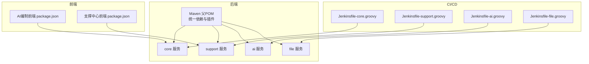
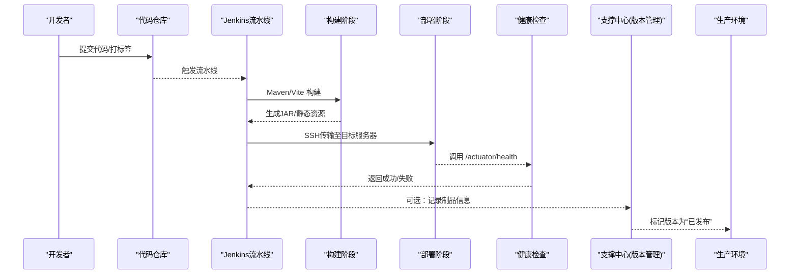
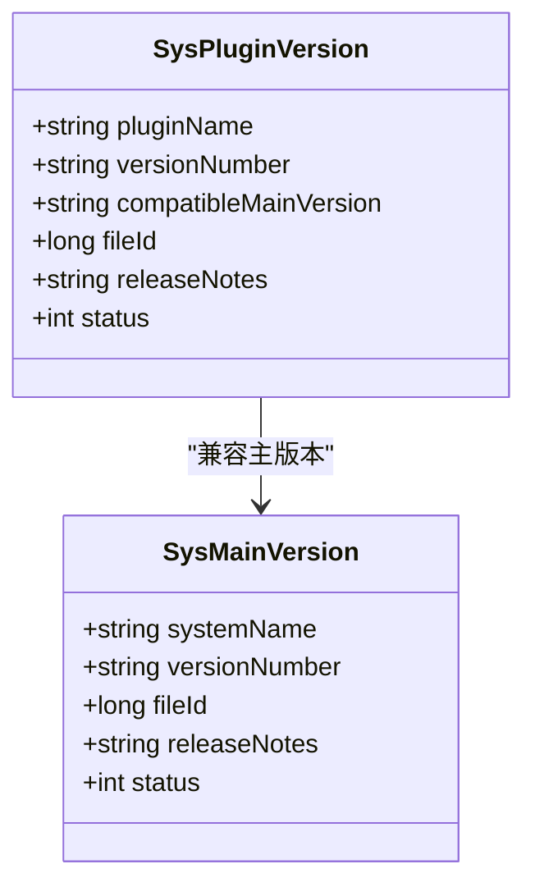
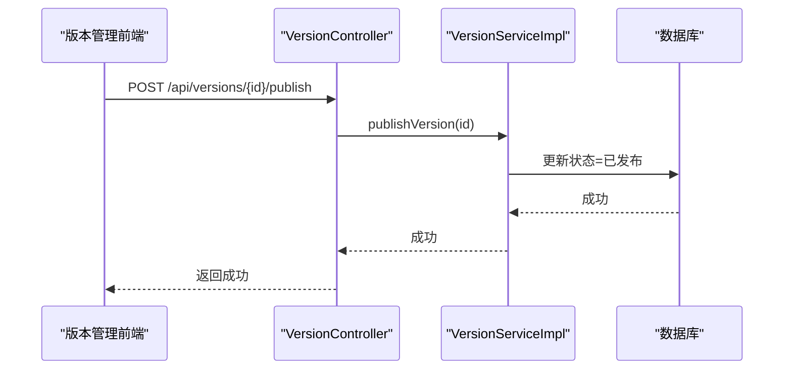
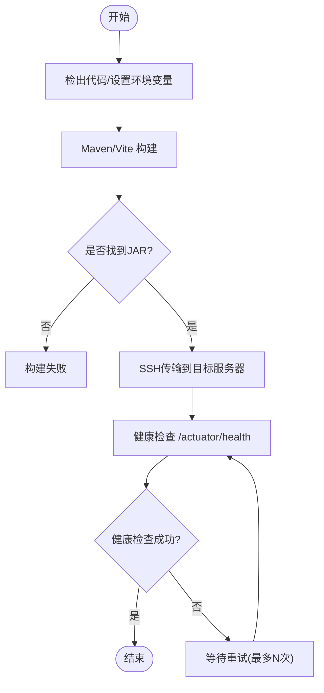
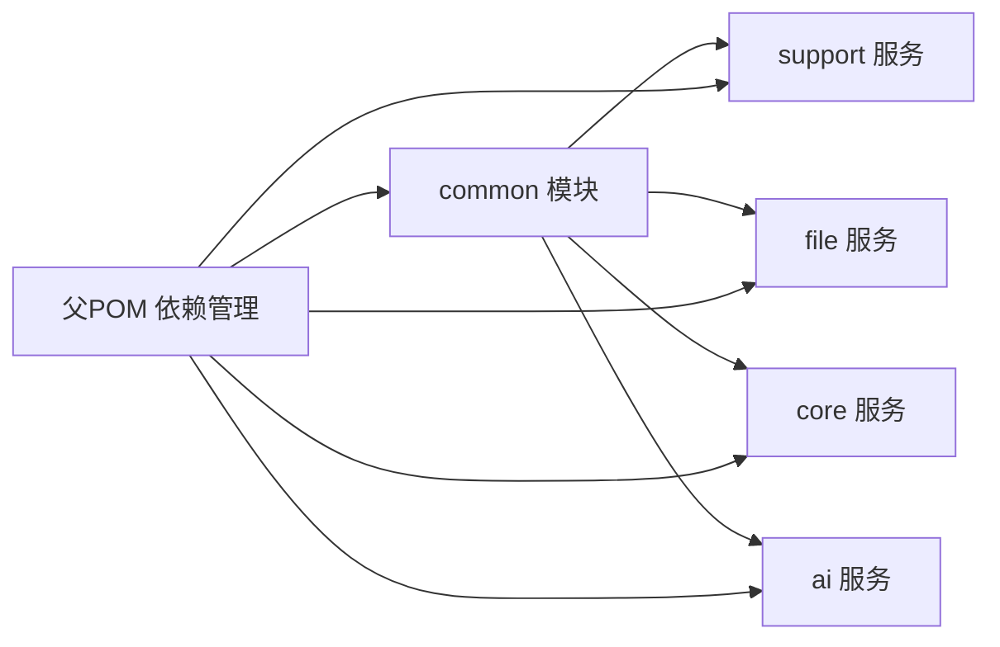

# 版本发布流程

<cite>
**本文引用的文件**   
- [ele-ai-tender-system/pom.xml](file://ele-ai-tender-system/pom.xml)
- [Jenkinsfile-core.groovy](file://Jenkinsfile-core.groovy)
- [Jenkinsfile-support.groovy](file://Jenkinsfile-support.groovy)
- [Jenkinsfile-ai.groovy](file://Jenkinsfile-ai.groovy)
- [Jenkinsfile-file.groovy](file://Jenkinsfile-file.groovy)
- [VersionController.java](file://ele-ai-tender-system/ele-ai-tender-support/src/main/java/com/jy/eleaitender/support/controller/VersionController.java)
- [VersionServiceImpl.java](file://ele-ai-tender-system/ele-ai-tender-support/src/main/java/com/jy/eleaitender/support/service/impl/VersionServiceImpl.java)
- [SysMainVersion.java](file://ele-ai-tender-system/ele-ai-tender-common/src/main/java/com/jy/eleaitender/common/entity/support/SysMainVersion.java)
- [SysPluginVersion.java](file://ele-ai-tender-system/ele-ai-tender-common/src/main/java/com/jy/eleaitender/common/entity/support/SysPluginVersion.java)
- [init.sql](file://ele-ai-tender-system/ele-ai-tender-support/sql/init.sql)
- [index.vue（版本管理）](file://ele-ai-tender-support-frontend/src/views/version/index.vue)
- [version.ts（前端API）](file://ele-ai-tender-support-frontend/src/api/version.ts)
- [package.json（AI编制前端）](file://ele-ai-tender-frontend/package.json)
- [package.json（支撑中心前端）](file://ele-ai-tender-support-frontend/package.json)
</cite>

## 目录
1. [引言](#引言)
2. [项目结构](#项目结构)
3. [核心组件](#核心组件)
4. [架构总览](#架构总览)
5. [详细组件分析](#详细组件分析)
6. [依赖分析](#依赖分析)
7. [性能考虑](#性能考虑)
8. [故障排查指南](#故障排查指南)
9. [结论](#结论)
10. [附录](#附录)

## 引言
本文件为“招标文件AI编制系统”建立标准化的版本发布流程，覆盖语义化版本控制、RC候选与验证、变更日志规范、发布检查清单、灰度与蓝绿策略、生产审批与回滚操作。文档同时结合仓库中现有能力（版本管理接口、CI流水线脚本、前后端构建脚本等），给出可落地的实施建议与图示说明。

## 项目结构
围绕版本发布的关键位置：
- 后端多模块工程：通过父POM统一版本管理与插件配置，各服务独立打包与部署。
- CI流水线：基于Jenkins Pipeline，完成构建、部署与健康检查。
- 版本管理：支撑中心提供主版本与插件版本管理能力，含状态流转（草稿/已发布/已下线）。
- 前端构建：两个前端项目均使用Vite构建，支持不同环境模式。

图表来源
- [ele-ai-tender-system/pom.xml:1-260](file://ele-ai-tender-system/pom.xml#L1-L260)
- [Jenkinsfile-core.groovy:1-132](file://Jenkinsfile-core.groovy#L1-L132)
- [Jenkinsfile-support.groovy:1-132](file://Jenkinsfile-support.groovy#L1-L132)
- [Jenkinsfile-ai.groovy:67-90](file://Jenkinsfile-ai.groovy#L67-L90)
- [Jenkinsfile-file.groovy:67-90](file://Jenkinsfile-file.groovy#L67-L90)
- [package.json（AI编制前端）:1-49](file://ele-ai-tender-frontend/package.json#L1-L49)
- [package.json（支撑中心前端）:1-35](file://ele-ai-tender-support-frontend/package.json#L1-L35)

章节来源
- [ele-ai-tender-system/pom.xml:1-260](file://ele-ai-tender-system/pom.xml#L1-L260)
- [Jenkinsfile-core.groovy:1-132](file://Jenkinsfile-core.groovy#L1-L132)
- [Jenkinsfile-support.groovy:1-132](file://Jenkinsfile-support.groovy#L1-L132)
- [Jenkinsfile-ai.groovy:67-90](file://Jenkinsfile-ai.groovy#L67-L90)
- [Jenkinsfile-file.groovy:67-90](file://Jenkinsfile-file.groovy#L67-L90)
- [package.json（AI编制前端）:1-49](file://ele-ai-tender-frontend/package.json#L1-L49)
- [package.json（支撑中心前端）:1-35](file://ele-ai-tender-support-frontend/package.json#L1-L35)

## 核心组件
- 版本管理接口与服务：提供主版本与插件版本的创建、更新、删除、发布、废弃等操作，并维护状态机（草稿/已发布/已下线）。
- 数据库模型：主版本表与插件版本表，包含版本号、适配关系、发布说明、状态等字段。
- 前端版本管理页面：提供搜索、创建、编辑、发布、废弃、删除等交互。
- CI流水线：按服务维度执行构建、部署与健康检查。
- 前端构建脚本：定义开发、测试与预览命令，便于本地与CI环境一致构建。

章节来源
- [VersionController.java:1-126](file://ele-ai-tender-system/ele-ai-tender-support/src/main/java/com/jy/eleaitender/support/controller/VersionController.java#L1-L126)
- [VersionServiceImpl.java:1-135](file://ele-ai-tender-system/ele-ai-tender-support/src/main/java/com/jy/eleaitender/support/service/impl/VersionServiceImpl.java#L1-L135)
- [SysMainVersion.java:1-35](file://ele-ai-tender-system/ele-ai-tender-common/src/main/java/com/jy/eleaitender/common/entity/support/SysMainVersion.java#L1-L35)
- [SysPluginVersion.java:1-38](file://ele-ai-tender-system/ele-ai-tender-common/src/main/java/com/jy/eleaitender/common/entity/support/SysPluginVersion.java#L1-L38)
- [init.sql:170-194](file://ele-ai-tender-system/ele-ai-tender-support/sql/init.sql#L170-L194)
- [index.vue（版本管理）:1-360](file://ele-ai-tender-support-frontend/src/views/version/index.vue#L1-L360)
- [version.ts（前端API）:102-145](file://ele-ai-tender-support-frontend/src/api/version.ts#L102-L145)

## 架构总览
版本发布端到端流程（从代码提交到线上可用）：
- 开发者在分支提交代码，触发CI流水线。
- Jenkins执行构建（Maven/Vite）、产物上传、远程部署与健康检查。
- 在支撑中心进行版本登记与发布（关联制品文件ID、填写发布说明）。
- 通过灰度或蓝绿策略逐步放量，监控指标与日志，必要时快速回滚。

图表来源
- [Jenkinsfile-core.groovy:46-132](file://Jenkinsfile-core.groovy#L46-L132)
- [Jenkinsfile-support.groovy:46-132](file://Jenkinsfile-support.groovy#L46-L132)
- [Jenkinsfile-ai.groovy:67-90](file://Jenkinsfile-ai.groovy#L67-L90)
- [Jenkinsfile-file.groovy:67-90](file://Jenkinsfile-file.groovy#L67-L90)
- [VersionController.java:72-86](file://ele-ai-tender-system/ele-ai-tender-support/src/main/java/com/jy/eleaitender/support/controller/VersionController.java#L72-L86)

## 详细组件分析

### 版本管理数据模型与状态机
- 主版本实体：包含系统名称、版本号、文件ID、发布说明、状态。
- 插件版本实体：包含插件名称、版本号、适配主系统版本、文件ID、发布说明、状态。
- 状态机：草稿(0) → 已发布(1)；已发布可回退为已下线(2)。

图表来源
- [SysMainVersion.java:1-35](file://ele-ai-tender-system/ele-ai-tender-common/src/main/java/com/jy/eleaitender/common/entity/support/SysMainVersion.java#L1-L35)
- [SysPluginVersion.java:1-38](file://ele-ai-tender-system/ele-ai-tender-common/src/main/java/com/jy/eleaitender/common/entity/support/SysPluginVersion.java#L1-L38)

章节来源
- [SysMainVersion.java:1-35](file://ele-ai-tender-system/ele-ai-tender-common/src/main/java/com/jy/eleaitender/common/entity/support/SysMainVersion.java#L1-L35)
- [SysPluginVersion.java:1-38](file://ele-ai-tender-system/ele-ai-tender-common/src/main/java/com/jy/eleaitender/common/entity/support/SysPluginVersion.java#L1-L38)
- [init.sql:170-194](file://ele-ai-tender-system/ele-ai-tender-support/sql/init.sql#L170-L194)

### 版本管理API与服务实现
- 控制器暴露REST接口：分页查询、详情、创建、更新、删除、发布、废弃；以及插件的CRUD与版本关联。
- 服务层实现：状态更新、分页过滤、插件与主版本兼容性查询。

图表来源
- [VersionController.java:72-86](file://ele-ai-tender-system/ele-ai-tender-support/src/main/java/com/jy/eleaitender/support/controller/VersionController.java#L72-L86)
- [VersionServiceImpl.java:72-86](file://ele-ai-tender-system/ele-ai-tender-support/src/main/java/com/jy/eleaitender/support/service/impl/VersionServiceImpl.java#L72-L86)

章节来源
- [VersionController.java:1-126](file://ele-ai-tender-system/ele-ai-tender-support/src/main/java/com/jy/eleaitender/support/controller/VersionController.java#L1-L126)
- [VersionServiceImpl.java:1-135](file://ele-ai-tender-system/ele-ai-tender-support/src/main/java/com/jy/eleaitender/support/service/impl/VersionServiceImpl.java#L1-L135)
- [index.vue（版本管理）:316-347](file://ele-ai-tender-support-frontend/src/views/version/index.vue#L316-L347)
- [version.ts（前端API）:139-145](file://ele-ai-tender-support-frontend/src/api/version.ts#L139-L145)

### CI流水线与部署流程
- 每个服务对应一个Jenkinsfile，包含Checkout、Build、Deploy、Check四个阶段。
- 构建阶段使用Maven打包（跳过测试以加速），查找*-exec.jar产物。
- 部署阶段通过SSH将JAR传输到目标服务器，并执行启动脚本。
- 健康检查阶段循环调用/actuator/health直至成功或达到最大尝试次数。

图表来源
- [Jenkinsfile-core.groovy:46-132](file://Jenkinsfile-core.groovy#L46-L132)
- [Jenkinsfile-support.groovy:46-132](file://Jenkinsfile-support.groovy#L46-L132)
- [Jenkinsfile-ai.groovy:67-90](file://Jenkinsfile-ai.groovy#L67-L90)
- [Jenkinsfile-file.groovy:67-90](file://Jenkinsfile-file.groovy#L67-L90)

章节来源
- [Jenkinsfile-core.groovy:1-132](file://Jenkinsfile-core.groovy#L1-L132)
- [Jenkinsfile-support.groovy:1-132](file://Jenkinsfile-support.groovy#L1-L132)
- [Jenkinsfile-ai.groovy:67-90](file://Jenkinsfile-ai.groovy#L67-L90)
- [Jenkinsfile-file.groovy:67-90](file://Jenkinsfile-file.groovy#L67-L90)

### 前端构建与环境
- AI编制前端与支撑中心前端均提供dev/build/test/preview脚本，便于本地开发与CI构建。
- 构建产物为静态资源，通常由网关或反向代理分发。

章节来源
- [package.json（AI编制前端）:1-49](file://ele-ai-tender-frontend/package.json#L1-L49)
- [package.json（支撑中心前端）:1-35](file://ele-ai-tender-support-frontend/package.json#L1-L35)

## 依赖分析
- 后端依赖：父POM集中管理Spring Boot、MyBatis-Plus、MySQL、JWT、Hutool、Redisson、SpringDoc、Apache POI/Tika/Flexmark等依赖版本。
- 模块耦合：common为公共基础，support/file/core/ai依赖common；support提供版本管理等通用能力。
- CI与部署：Jenkinsfile通过SSH与目标服务器交互，依赖外部process-jdk21.bat脚本进行进程管理。

图表来源
- [ele-ai-tender-system/pom.xml:68-223](file://ele-ai-tender-system/pom.xml#L68-L223)

章节来源
- [ele-ai-tender-system/pom.xml:1-260](file://ele-ai-tender-system/pom.xml#L1-L260)

## 性能考虑
- 构建优化：CI中跳过测试以提升速度；按需并行构建多个服务。
- 部署优化：仅传输必要产物；利用健康检查避免无效流量。
- 运行时优化：合理设置JVM参数（如-Xmx），确保服务稳定。

[本节为通用指导，不直接分析具体文件]

## 故障排查指南
- 构建失败：检查Maven/Vite构建输出与依赖安装情况，确认JAR产物是否存在。
- 部署失败：核对SSH配置、目标路径权限与启动脚本参数。
- 健康检查失败：查看服务日志与端口占用，确认/actuator/health可达。
- 版本状态异常：核查数据库记录与接口调用链路，确认状态更新是否生效。

章节来源
- [Jenkinsfile-core.groovy:97-132](file://Jenkinsfile-core.groovy#L97-L132)
- [Jenkinsfile-support.groovy:97-132](file://Jenkinsfile-support.groovy#L97-L132)
- [VersionServiceImpl.java:72-86](file://ele-ai-tender-system/ele-ai-tender-support/src/main/java/com/jy/eleaitender/support/service/impl/VersionServiceImpl.java#L72-L86)

## 结论
本流程以现有版本管理接口与CI流水线为基础，结合语义化版本控制、RC验证、变更日志规范、发布检查清单、灰度与蓝绿策略、生产审批与回滚机制，形成标准化、可追溯、可回滚的版本发布体系。建议在后续迭代中完善自动化检查与安全扫描，进一步提升发布质量与效率。

## 附录

### 一、语义化版本控制(SemVer)规范
- 格式：主版本.次版本.补丁版本[-预发布标识][+元数据]
- 主版本(MAJOR)：不兼容的API或数据结构变更，需升级依赖或迁移。
- 次版本(MINOR)：向后兼容的功能新增。
- 补丁版本(PATCH)：向后兼容的问题修复。
- 预发布标识：如RC、beta、alpha，用于候选版本与内部测试。
- 元数据：构建号、提交哈希等辅助信息。

[本节为通用规范说明，不直接分析具体文件]

### 二、RC候选版本创建与测试验证流程
- 创建RC：在测试环境构建并部署，标注为“候选版本”，同步更新版本管理系统中的发布说明与制品ID。
- 测试验证：执行功能回归、集成测试、性能基准与兼容性矩阵验证。
- 准入标准：关键用例通过率≥阈值、无严重缺陷、性能指标达标。
- 发布决策：测试通过后，在支撑中心将版本状态更新为“已发布”。

[本节为通用流程说明，不直接分析具体文件]

### 三、变更日志自动生成与维护规范
- 生成方式：基于Git提交信息与标签，自动聚合变更记录，输出Markdown格式。
- 内容要求：按功能、修复、破坏性变更分类；包含影响范围与迁移指引。
- 维护责任：Release负责人审核并补充人工说明，确保可读性与完整性。
- 归档位置：随版本制品一同归档，并在支撑中心版本管理中关联。

[本节为通用规范说明，不直接分析具体文件]

### 四、发布检查清单
- 代码质量：静态扫描、单元测试覆盖率、代码审查通过。
- 安全扫描：依赖漏洞扫描、敏感信息检测、签名校验。
- 性能测试：压测报告、资源使用基线对比。
- 兼容性验证：浏览器/操作系统矩阵、第三方系统对接验证。
- 文档与培训：用户手册更新、运维手册更新、回滚预案演练。

[本节为通用规范说明，不直接分析具体文件]

### 五、灰度发布与蓝绿部署策略
- 灰度发布：按用户比例或租户维度逐步放量，观察错误率与延迟指标。
- 蓝绿部署：准备两套相同环境，切换流量指向新版本，失败则快速切回。
- 流量切换：通过网关或负载均衡器进行路由规则调整。
- 监控告警：关键指标阈值告警，自动触发回滚。

[本节为通用策略说明，不直接分析具体文件]

### 六、生产环境发布审批与回滚操作指南
- 审批流程：需求评审→技术评审→安全评审→上线窗口审批。
- 回滚操作：优先恢复上一稳定版本制品，更新版本管理系统状态为“已下线”，并记录回滚原因与时间。
- 回滚验证：健康检查、业务冒烟测试、监控指标恢复正常。
- 复盘改进：问题根因分析与流程优化。

[本节为通用操作指南，不直接分析具体文件]