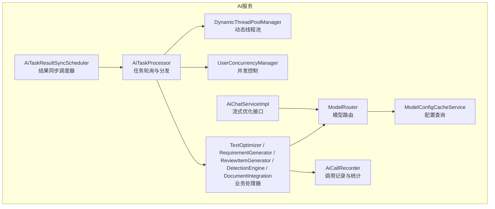
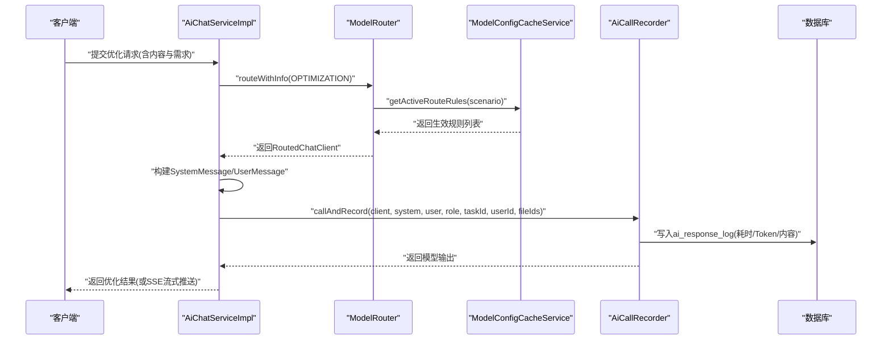
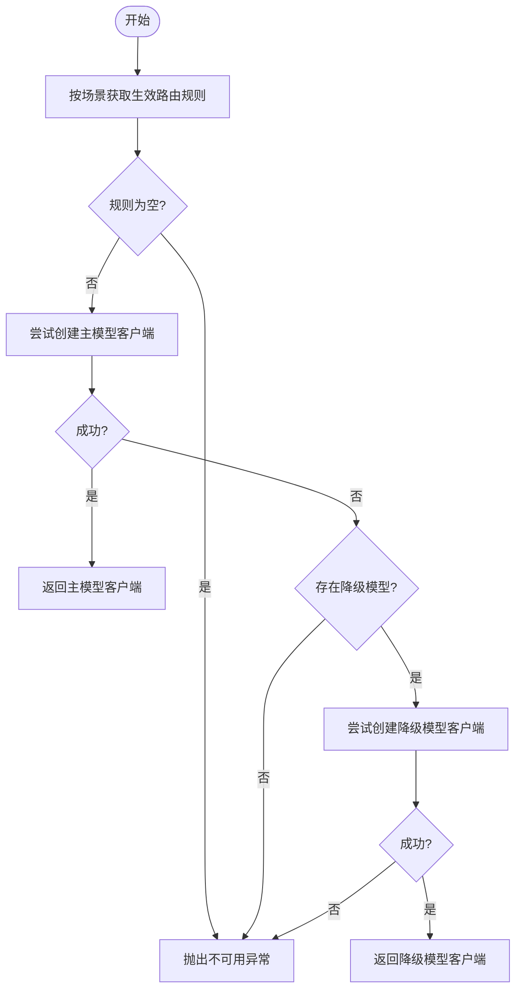
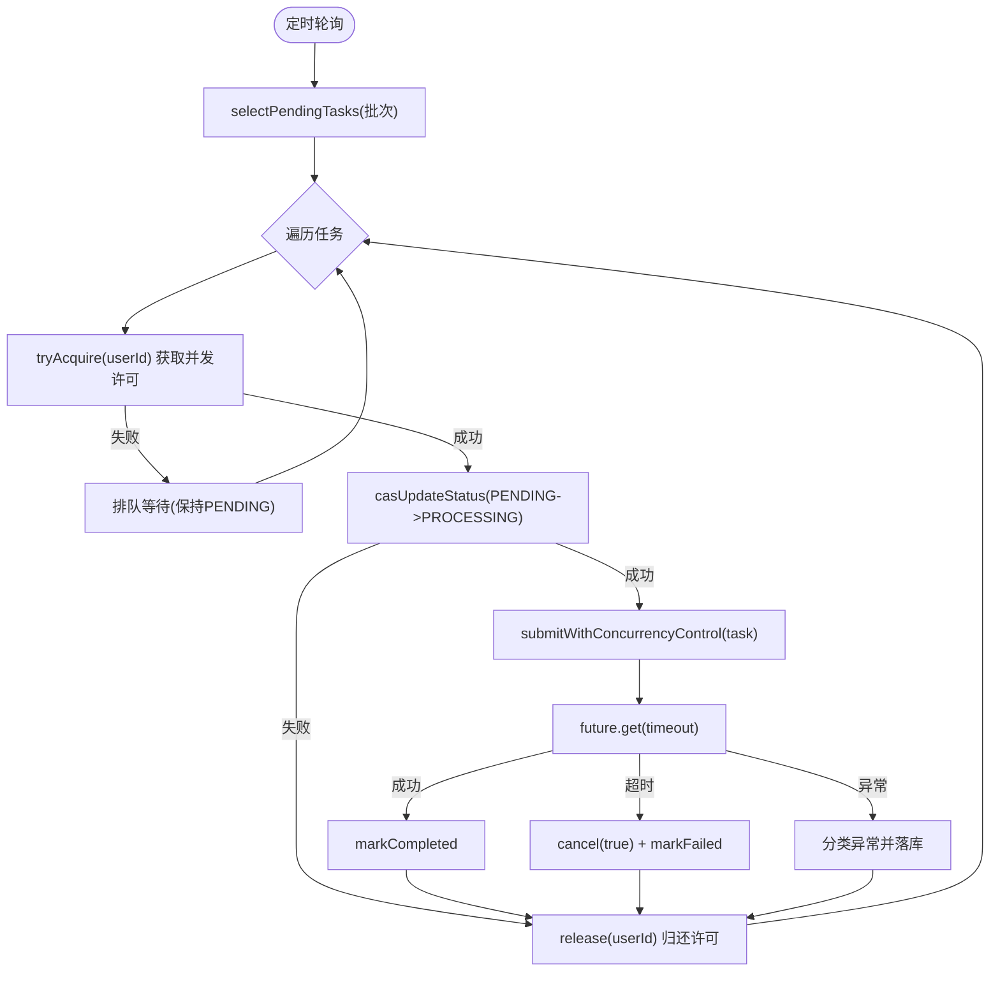
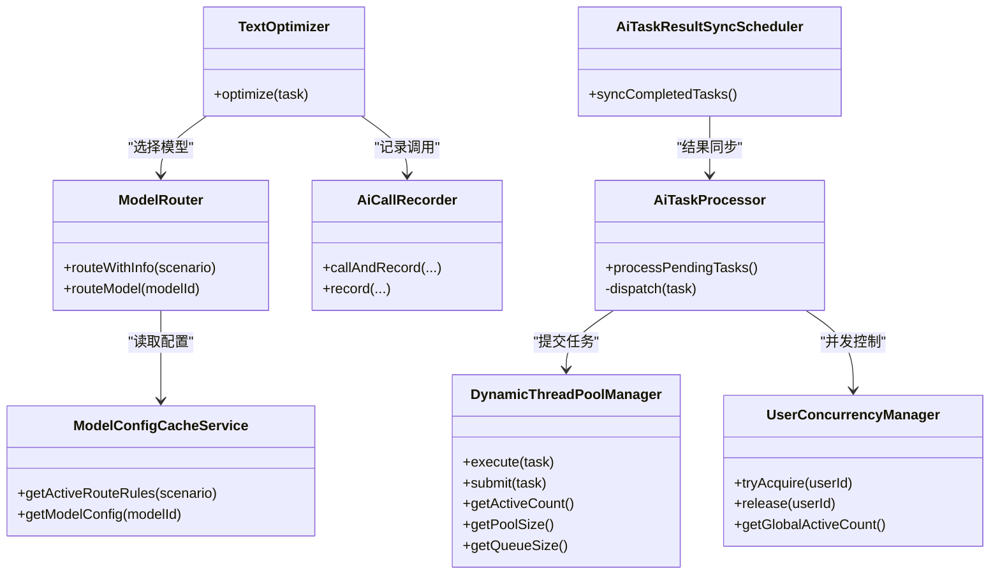

# AI服务性能优化

<cite>
**本文引用的文件**   
- [ModelRouter.java](file://ele-ai-tender-system/ele-ai-tender-ai/src/main/java/com/jy/eleaitender/ai/processor/model/ModelRouter.java)
- [ModelConfigCacheService.java](file://ele-ai-tender-system/ele-ai-tender-ai/src/main/java/com/jy/eleaitender/ai/processor/model/ModelConfigCacheService.java)
- [UserConcurrencyManager.java](file://ele-ai-tender-system/ele-ai-tender-ai/src/main/java/com/jy/eleaitender/ai/threadpool/UserConcurrencyManager.java)
- [DynamicThreadPoolManager.java](file://ele-ai-tender-system/ele-ai-tender-ai/src/main/java/com/jy/eleaitender/ai/threadpool/DynamicThreadPoolManager.java)
- [AiTaskProcessor.java](file://ele-ai-tender-system/ele-ai-tender-ai/src/main/java/com/jy/eleaitender/ai/processor/AiTaskProcessor.java)
- [AiCallRecorder.java](file://ele-ai-tender-system/ele-ai-tender-ai/src/main/java/com/jy/eleaitender/ai/processor/recorder/AiCallRecorder.java)
- [PromptBuilder.java](file://ele-ai-tender-system/ele-ai-tender-ai/src/main/java/com/jy/eleaitender/ai/processor/prompt/PromptBuilder.java)
- [AiChatServiceImpl.java](file://ele-ai-tender-system/ele-ai-tender-ai/src/main/java/com/jy/eleaitender/ai/service/impl/AiChatServiceImpl.java)
- [TextOptimizer.java](file://ele-ai-tender-system/ele-ai-tender-ai/src/main/java/com/jy/eleaitender/ai/processor/generator/TextOptimizer.java)
- [AiTaskResultSyncScheduler.java](file://ele-ai-tender-system/ele-ai-tender-core/src/main/java/com/jy/eleaitender/core/scheduler/AiTaskResultSyncScheduler.java)
- [init.sql](file://ele-ai-tender-system/ele-ai-tender-ai/sql/init.sql)
</cite>

## 目录
1. [引言](#引言)
2. [项目结构](#项目结构)
3. [核心组件](#核心组件)
4. [架构总览](#架构总览)
5. [详细组件分析](#详细组件分析)
6. [依赖关系分析](#依赖关系分析)
7. [性能考量](#性能考量)
8. [故障排查指南](#故障排查指南)
9. [结论](#结论)
10. [附录](#附录)

## 引言
本指南面向“招标文件AI编制系统”的AI服务，聚焦于模型调用、异步任务调度、向量数据库与提示词工程、以及监控指标等维度的性能优化。文档基于仓库现有实现进行提炼，给出可落地的优化策略与调优建议，帮助在保障稳定性的前提下提升吞吐、降低延迟并控制成本。

## 项目结构
AI服务相关能力集中在后端模块中，关键路径包括：
- 模型路由与配置读取：根据场景/任务类型选择最优模型，支持主备降级
- 动态线程池与并发控制：全局与用户级并发上限、队列容量、超时控制
- 任务轮询与执行：定时拉取待处理任务，按类型分发到具体处理器
- 调用记录与统计：统一封装模型调用，记录Token消耗、耗时、结果等
- 提示词构建：集中管理不同场景的提示词模板与拼接逻辑
- 结果同步：后台定时将已完成任务的结果同步至业务表

图表来源
- [AiTaskProcessor.java:1-196](file://ele-ai-tender-system/ele-ai-tender-ai/src/main/java/com/jy/eleaitender/ai/processor/AiTaskProcessor.java#L1-L196)
- [DynamicThreadPoolManager.java:1-190](file://ele-ai-tender-system/ele-ai-tender-ai/src/main/java/com/jy/eleaitender/ai/threadpool/DynamicThreadPoolManager.java#L1-L190)
- [UserConcurrencyManager.java:1-131](file://ele-ai-tender-system/ele-ai-tender-ai/src/main/java/com/jy/eleaitender/ai/threadpool/UserConcurrencyManager.java#L1-L131)
- [ModelRouter.java:1-106](file://ele-ai-tender-system/ele-ai-tender-ai/src/main/java/com/jy/eleaitender/ai/processor/model/ModelRouter.java#L1-L106)
- [ModelConfigCacheService.java:1-60](file://ele-ai-tender-system/ele-ai-tender-ai/src/main/java/com/jy/eleaitender/ai/processor/model/ModelConfigCacheService.java#L1-L60)
- [AiCallRecorder.java:1-206](file://ele-ai-tender-system/ele-ai-tender-ai/src/main/java/com/jy/eleaitender/ai/processor/recorder/AiCallRecorder.java#L1-L206)
- [AiChatServiceImpl.java:126-153](file://ele-ai-tender-system/ele-ai-tender-ai/src/main/java/com/jy/eleaitender/ai/service/impl/AiChatServiceImpl.java#L126-L153)
- [AiTaskResultSyncScheduler.java:1-64](file://ele-ai-tender-system/ele-ai-tender-core/src/main/java/com/jy/eleaitender/core/scheduler/AiTaskResultSyncScheduler.java#L1-L64)

章节来源
- [AiTaskProcessor.java:1-196](file://ele-ai-tender-system/ele-ai-tender-ai/src/main/java/com/jy/eleaitender/ai/processor/AiTaskProcessor.java#L1-L196)
- [DynamicThreadPoolManager.java:1-190](file://ele-ai-tender-system/ele-ai-tender-ai/src/main/java/com/jy/eleaitender/ai/threadpool/DynamicThreadPoolManager.java#L1-L190)
- [UserConcurrencyManager.java:1-131](file://ele-ai-tender-system/ele-ai-tender-ai/src/main/java/com/jy/eleaitender/ai/threadpool/UserConcurrencyManager.java#L1-L131)
- [ModelRouter.java:1-106](file://ele-ai-tender-system/ele-ai-tender-ai/src/main/java/com/jy/eleaitender/ai/processor/model/ModelRouter.java#L1-L106)
- [ModelConfigCacheService.java:1-60](file://ele-ai-tender-system/ele-ai-tender-ai/src/main/java/com/jy/eleaitender/ai/processor/model/ModelConfigCacheService.java#L1-L60)
- [AiCallRecorder.java:1-206](file://ele-ai-tender-system/ele-ai-tender-ai/src/main/java/com/jy/eleaitender/ai/processor/recorder/AiCallRecorder.java#L1-L206)
- [AiChatServiceImpl.java:126-153](file://ele-ai-tender-system/ele-ai-tender-ai/src/main/java/com/jy/eleaitender/ai/service/impl/AiChatServiceImpl.java#L126-L153)
- [AiTaskResultSyncScheduler.java:1-64](file://ele-ai-tender-system/ele-ai-tender-core/src/main/java/com/jy/eleaitender/core/scheduler/AiTaskResultSyncScheduler.java#L1-L64)

## 核心组件
- 模型路由与降级：按使用场景或任务类型选择模型，优先主模型，失败自动降级到备用模型，无可用则抛出不可用异常
- 动态线程池：从系统参数表加载核心/最大线程数、队列容量、保活时间、任务超时等，支持运行时热更新
- 并发控制：全局与用户级并发上限（信号量），发起数限制（数据库统计PENDING+PROCESSING）
- 任务调度：每5秒轮询待处理任务，CAS状态转换避免重复执行，带超时控制与异常分类落库
- 调用记录：统一封装调用，记录消息、内容、完成原因、Token用量、模型名、任务ID等
- 提示词工程：集中构建各场景提示词，避免模板变量冲突，保证输出格式稳定
- 结果同步：定时扫描终态任务，幂等同步到业务表

章节来源
- [ModelRouter.java:1-106](file://ele-ai-tender-system/ele-ai-tender-ai/src/main/java/com/jy/eleaitender/ai/processor/model/ModelRouter.java#L1-L106)
- [DynamicThreadPoolManager.java:1-190](file://ele-ai-tender-system/ele-ai-tender-ai/src/main/java/com/jy/eleaitender/ai/threadpool/DynamicThreadPoolManager.java#L1-L190)
- [UserConcurrencyManager.java:1-131](file://ele-ai-tender-system/ele-ai-tender-ai/src/main/java/com/jy/eleaitender/ai/threadpool/UserConcurrencyManager.java#L1-L131)
- [AiTaskProcessor.java:1-196](file://ele-ai-tender-system/ele-ai-tender-ai/src/main/java/com/jy/eleaitender/ai/processor/AiTaskProcessor.java#L1-L196)
- [AiCallRecorder.java:1-206](file://ele-ai-tender-system/ele-ai-tender-ai/src/main/java/com/jy/eleaitender/ai/processor/recorder/AiCallRecorder.java#L1-L206)
- [PromptBuilder.java:1-173](file://ele-ai-tender-system/ele-ai-tender-ai/src/main/java/com/jy/eleaitender/ai/processor/prompt/PromptBuilder.java#L1-L173)
- [AiTaskResultSyncScheduler.java:1-64](file://ele-ai-tender-system/ele-ai-tender-core/src/main/java/com/jy/eleaitender/core/scheduler/AiTaskResultSyncScheduler.java#L1-L64)

## 架构总览
下图展示一次典型文本优化任务的端到端流程：前端请求进入后，服务层通过模型路由选择模型，构造提示词，调用模型并记录响应；同时，后台任务调度器负责批量/异步任务的拉取、并发控制与超时处理。

图表来源
- [AiChatServiceImpl.java:126-153](file://ele-ai-tender-system/ele-ai-tender-ai/src/main/java/com/jy/eleaitender/ai/service/impl/AiChatServiceImpl.java#L126-L153)
- [ModelRouter.java:1-106](file://ele-ai-tender-system/ele-ai-tender-ai/src/main/java/com/jy/eleaitender/ai/processor/model/ModelRouter.java#L1-L106)
- [ModelConfigCacheService.java:1-60](file://ele-ai-tender-system/ele-ai-tender-ai/src/main/java/com/jy/eleaitender/ai/processor/model/ModelConfigCacheService.java#L1-L60)
- [AiCallRecorder.java:1-206](file://ele-ai-tender-system/ele-ai-tender-ai/src/main/java/com/jy/eleaitender/ai/processor/recorder/AiCallRecorder.java#L1-L206)

## 详细组件分析

### 模型路由与负载均衡
- 路由策略：按使用场景获取生效规则，按优先级尝试主模型，失败再尝试降级模型，均失败抛不可用异常
- 负载均衡：当前为顺序优先+降级策略，未实现加权轮询或一致性哈希；可在规则层扩展权重字段并在路由器中实现加权选择
- 故障转移：当主模型创建失败或不可用时自动切换到备用模型，提高可用性

图表来源
- [ModelRouter.java:1-106](file://ele-ai-tender-system/ele-ai-tender-ai/src/main/java/com/jy/eleaitender/ai/processor/model/ModelRouter.java#L1-L106)
- [ModelConfigCacheService.java:1-60](file://ele-ai-tender-system/ele-ai-tender-ai/src/main/java/com/jy/eleaitender/ai/processor/model/ModelConfigCacheService.java#L1-L60)

章节来源
- [ModelRouter.java:1-106](file://ele-ai-tender-system/ele-ai-tender-ai/src/main/java/com/jy/eleaitender/ai/processor/model/ModelRouter.java#L1-L106)
- [ModelConfigCacheService.java:1-60](file://ele-ai-tender-system/ele-ai-tender-ai/src/main/java/com/jy/eleaitender/ai/processor/model/ModelConfigCacheService.java#L1-L60)

### 异步任务调度与资源隔离
- 任务轮询：每5秒拉取待处理任务，按类型分发到对应处理器
- 并发控制：用户级与全局并发上限由信号量控制；发起数上限通过数据库统计PENDING+PROCESSING数量判断
- 超时控制：任务提交后以Future.get(timeout)方式等待，超时取消并标记失败
- 资源隔离：用户维度Semaphore隔离，避免单用户独占资源；全局Semaphore保护整体负载

图表来源
- [AiTaskProcessor.java:1-196](file://ele-ai-tender-system/ele-ai-tender-ai/src/main/java/com/jy/eleaitender/ai/processor/AiTaskProcessor.java#L1-L196)
- [UserConcurrencyManager.java:1-131](file://ele-ai-tender-system/ele-ai-tender-ai/src/main/java/com/jy/eleaitender/ai/threadpool/UserConcurrencyManager.java#L1-L131)
- [DynamicThreadPoolManager.java:1-190](file://ele-ai-tender-system/ele-ai-tender-ai/src/main/java/com/jy/eleaitender/ai/threadpool/DynamicThreadPoolManager.java#L1-L190)

章节来源
- [AiTaskProcessor.java:1-196](file://ele-ai-tender-system/ele-ai-tender-ai/src/main/java/com/jy/eleaitender/ai/processor/AiTaskProcessor.java#L1-L196)
- [UserConcurrencyManager.java:1-131](file://ele-ai-tender-system/ele-ai-tender-ai/src/main/java/com/jy/eleaitender/ai/threadpool/UserConcurrencyManager.java#L1-L131)
- [DynamicThreadPoolManager.java:1-190](file://ele-ai-tender-system/ele-ai-tender-ai/src/main/java/com/jy/eleaitender/ai/threadpool/DynamicThreadPoolManager.java#L1-L190)

### 批量处理优化（合并、缓存、增量）
- 批量请求合并：当前采用分批拉取（每次固定条数）与逐条处理模式。建议在处理器层引入批处理窗口（如N条或T秒），对相似任务进行合并，减少模型调用次数
- 结果缓存：对相同输入（经规范化后的Prompt指纹）命中缓存直接返回，降低重复计算与Token消耗
- 增量更新：对长文档生成类任务，采用分块/分步生成（大纲→章节→评审项），仅对变更部分重新生成，结合版本化存储减少全量重建

说明：上述为通用优化策略，可在现有处理器（如RequirementGenerator、ReviewItemGenerator、DocumentIntegration）基础上扩展批处理与缓存层。

[本节为概念性建议，不直接分析具体文件]

### 向量数据库优化（Milvus）
- 索引优化：根据查询模式选择合适的向量索引（如HNSW、IVF_PQ），平衡召回率与延迟
- 查询性能调优：合理设置topK、距离度量、预过滤条件，利用元数据索引加速筛选
- 存储结构优化：按业务域划分集合，控制单集合规模；对高频访问数据建立独立集合或分区

说明：知识库文档表包含向量ID字段，表明已集成向量检索能力。实际索引与查询策略需结合Milvus部署与数据分布进行调优。

章节来源
- [init.sql:59-79](file://ele-ai-tender-system/ele-ai-tender-ai/sql/init.sql#L59-L79)

### 提示词工程优化（上下文长度、Token、格式）
- 上下文长度控制：在PromptBuilder中按需裁剪历史上下文，避免超出模型上下文窗口
- Token使用优化：通过AiCallRecorder记录的prompt_tokens、completion_tokens、total_tokens进行成本分析与Prompt精简
- 响应格式标准化：在SystemPrompt中明确输出格式约束（如JSON Schema），并结合修复提示词（如review item JSON修复）提升解析成功率

章节来源
- [PromptBuilder.java:1-173](file://ele-ai-tender-system/ele-ai-tender-ai/src/main/java/com/jy/eleaitender/ai/processor/prompt/PromptBuilder.java#L1-L173)
- [AiCallRecorder.java:1-206](file://ele-ai-tender-system/ele-ai-tender-ai/src/main/java/com/jy/eleaitender/ai/processor/recorder/AiCallRecorder.java#L1-L206)

### AI服务监控（延迟、成功率、资源）
- 调用延迟统计：在AiCallRecorder中记录开始时间与结束时间，结合finish_reason与token用量形成SLA指标
- 成功率监控：统计成功/失败/不可用比例，结合异常分类（AiUnavailableException、AiErrorContentException）定位问题
- 资源使用分析：通过DynamicThreadPoolManager暴露活跃线程数、队列长度、池大小等指标，评估扩缩容效果

章节来源
- [AiCallRecorder.java:1-206](file://ele-ai-tender-system/ele-ai-tender-ai/src/main/java/com/jy/eleaitender/ai/processor/recorder/AiCallRecorder.java#L1-L206)
- [DynamicThreadPoolManager.java:1-190](file://ele-ai-tender-system/ele-ai-tender-ai/src/main/java/com/jy/eleaitender/ai/threadpool/DynamicThreadPoolManager.java#L1-L190)

## 依赖关系分析
- AiTaskProcessor依赖DynamicThreadPoolManager与UserConcurrencyManager进行任务提交与并发控制
- TextOptimizer等处理器依赖ModelRouter进行模型选择，并通过AiCallRecorder记录调用详情
- ModelRouter依赖ModelConfigCacheService读取生效路由规则与模型配置
- AiTaskResultSyncScheduler定时扫描终态任务，确保结果持久化到业务表

图表来源
- [AiTaskProcessor.java:1-196](file://ele-ai-tender-system/ele-ai-tender-ai/src/main/java/com/jy/eleaitender/ai/processor/AiTaskProcessor.java#L1-L196)
- [DynamicThreadPoolManager.java:1-190](file://ele-ai-tender-system/ele-ai-tender-ai/src/main/java/com/jy/eleaitender/ai/threadpool/DynamicThreadPoolManager.java#L1-L190)
- [UserConcurrencyManager.java:1-131](file://ele-ai-tender-system/ele-ai-tender-ai/src/main/java/com/jy/eleaitender/ai/threadpool/UserConcurrencyManager.java#L1-L131)
- [TextOptimizer.java:37-62](file://ele-ai-tender-system/ele-ai-tender-ai/src/main/java/com/jy/eleaitender/ai/processor/generator/TextOptimizer.java#L37-L62)
- [ModelRouter.java:1-106](file://ele-ai-tender-system/ele-ai-tender-ai/src/main/java/com/jy/eleaitender/ai/processor/model/ModelRouter.java#L1-L106)
- [ModelConfigCacheService.java:1-60](file://ele-ai-tender-system/ele-ai-tender-ai/src/main/java/com/jy/eleaitender/ai/processor/model/ModelConfigCacheService.java#L1-L60)
- [AiCallRecorder.java:1-206](file://ele-ai-tender-system/ele-ai-tender-ai/src/main/java/com/jy/eleaitender/ai/processor/recorder/AiCallRecorder.java#L1-L206)
- [AiTaskResultSyncScheduler.java:1-64](file://ele-ai-tender-system/ele-ai-tender-core/src/main/java/com/jy/eleaitender/core/scheduler/AiTaskResultSyncScheduler.java#L1-L64)

章节来源
- [AiTaskProcessor.java:1-196](file://ele-ai-tender-system/ele-ai-tender-ai/src/main/java/com/jy/eleaitender/ai/processor/AiTaskProcessor.java#L1-L196)
- [DynamicThreadPoolManager.java:1-190](file://ele-ai-tender-system/ele-ai-tender-ai/src/main/java/com/jy/eleaitender/ai/threadpool/DynamicThreadPoolManager.java#L1-L190)
- [UserConcurrencyManager.java:1-131](file://ele-ai-tender-system/ele-ai-tender-ai/src/main/java/com/jy/eleaitender/ai/threadpool/UserConcurrencyManager.java#L1-L131)
- [TextOptimizer.java:37-62](file://ele-ai-tender-system/ele-ai-tender-ai/src/main/java/com/jy/eleaitender/ai/processor/generator/TextOptimizer.java#L37-L62)
- [ModelRouter.java:1-106](file://ele-ai-tender-system/ele-ai-tender-ai/src/main/java/com/jy/eleaitender/ai/processor/model/ModelRouter.java#L1-L106)
- [ModelConfigCacheService.java:1-60](file://ele-ai-tender-system/ele-ai-tender-ai/src/main/java/com/jy/eleaitender/ai/processor/model/ModelConfigCacheService.java#L1-L60)
- [AiCallRecorder.java:1-206](file://ele-ai-tender-system/ele-ai-tender-ai/src/main/java/com/jy/eleaitender/ai/processor/recorder/AiCallRecorder.java#L1-L206)
- [AiTaskResultSyncScheduler.java:1-64](file://ele-ai-tender-system/ele-ai-tender-core/src/main/java/com/jy/eleaitender/core/scheduler/AiTaskResultSyncScheduler.java#L1-L64)

## 性能考量
- 模型路由与降级：在主模型不稳定时快速切换，降低P99延迟抖动
- 并发与队列：根据CPU与I/O特征调整core/max/queue，避免队列过长导致尾延迟上升
- 超时控制：合理设置任务超时，防止长尾任务占用资源；结合重试与熔断策略
- 提示词精简：减少冗余上下文与示例，降低Token与延迟
- 结果同步：批量拉取与幂等标记，避免重复同步造成额外开销

[本节提供通用指导，不直接分析具体文件]

## 故障排查指南
- 模型不可用：检查路由规则是否生效、模型配置是否启用、创建客户端是否异常
- 任务超时：查看任务超时配置与实际执行时长，必要时扩容线程池或拆分任务
- 并发受限：观察用户级与全局并发上限，确认是否存在热点用户独占资源
- 记录缺失：核对AiCallRecorder写入是否成功，关注日志中的错误堆栈

章节来源
- [ModelRouter.java:1-106](file://ele-ai-tender-system/ele-ai-tender-ai/src/main/java/com/jy/eleaitender/ai/processor/model/ModelRouter.java#L1-L106)
- [AiTaskProcessor.java:1-196](file://ele-ai-tender-system/ele-ai-tender-ai/src/main/java/com/jy/eleaitender/ai/processor/AiTaskProcessor.java#L1-L196)
- [UserConcurrencyManager.java:1-131](file://ele-ai-tender-system/ele-ai-tender-ai/src/main/java/com/jy/eleaitender/ai/threadpool/UserConcurrencyManager.java#L1-L131)
- [AiCallRecorder.java:1-206](file://ele-ai-tender-system/ele-ai-tender-ai/src/main/java/com/jy/eleaitender/ai/processor/recorder/AiCallRecorder.java#L1-L206)

## 结论
通过在模型路由、并发控制、任务调度、提示词工程与监控记录等方面的系统化优化，可显著提升AI服务的稳定性与性能。建议结合线上指标持续迭代，逐步引入批处理、缓存与更精细的负载均衡策略，以实现更高的吞吐与更低的成本。

[本节为总结性内容，不直接分析具体文件]

## 附录
- 数据库表结构参考：知识库文档表与AI响应记录表定义，便于理解向量ID关联与调用记录字段
- 流式优化接口：SSE流式推送优化体验，结合chatResponse获取Token信息用于统计

章节来源
- [init.sql:59-79](file://ele-ai-tender-system/ele-ai-tender-ai/sql/init.sql#L59-L79)
- [AiChatServiceImpl.java:126-153](file://ele-ai-tender-system/ele-ai-tender-ai/src/main/java/com/jy/eleaitender/ai/service/impl/AiChatServiceImpl.java#L126-L153)