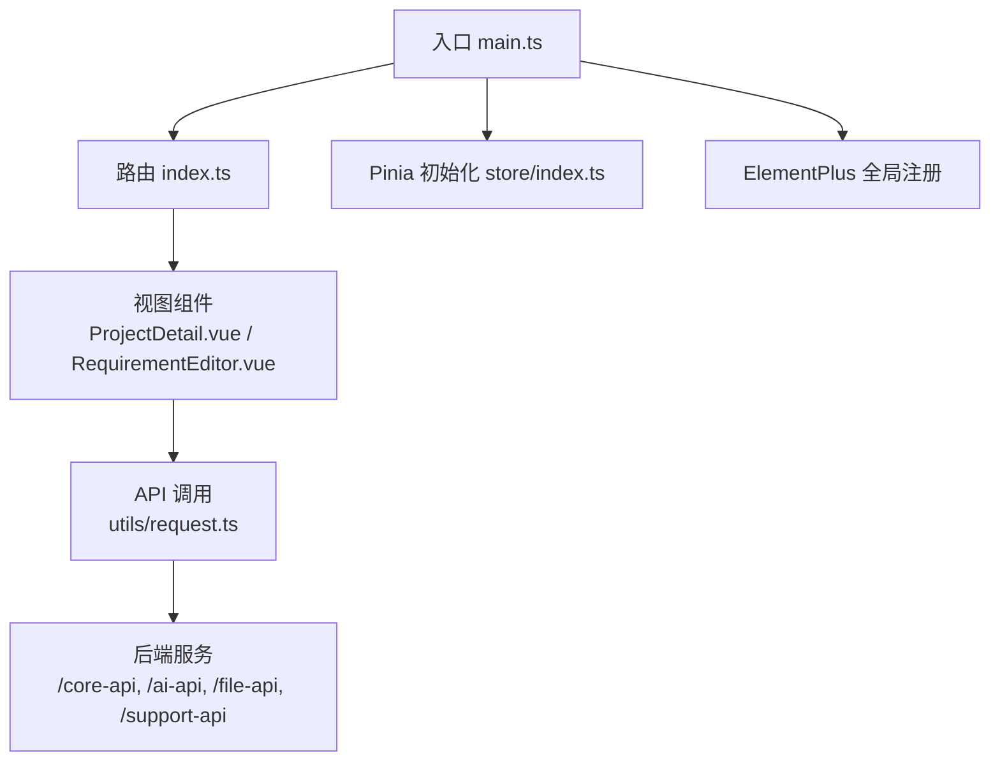
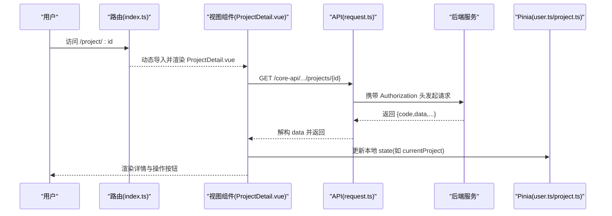
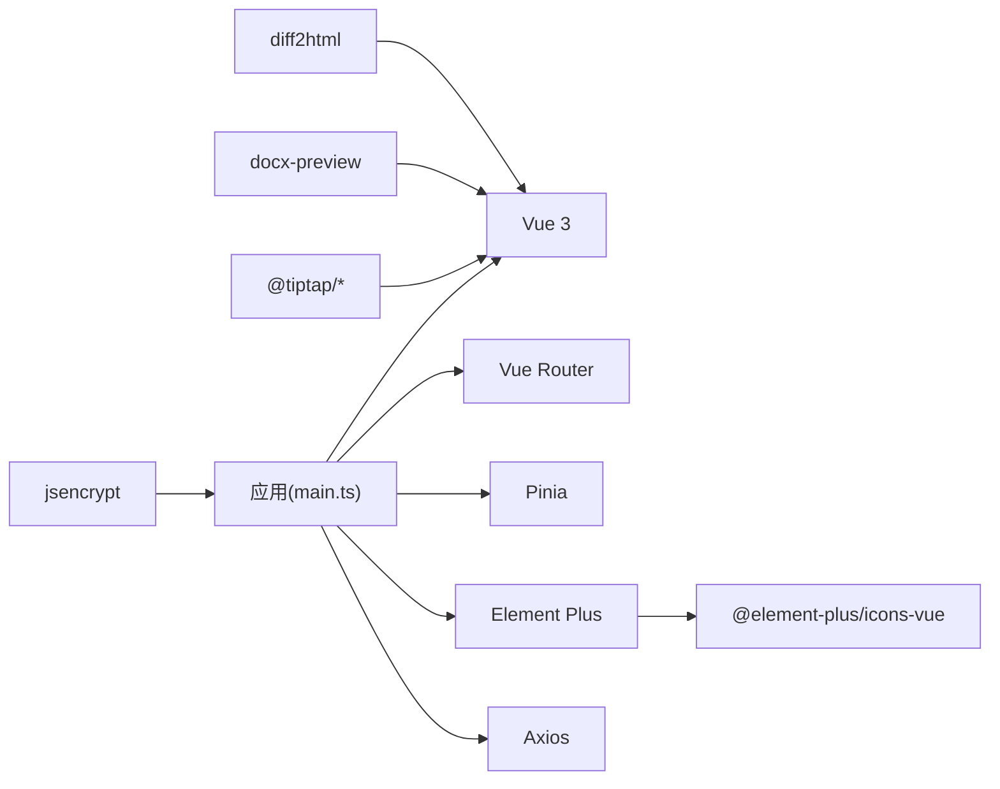

# 前端性能优化

<cite>
**本文引用的文件**
- [vite.config.ts](file://ele-ai-tender-frontend/vite.config.ts)
- [package.json](file://ele-ai-tender-frontend/package.json)
- [main.ts](file://ele-ai-tender-frontend/src/main.ts)
- [index.ts（路由）](file://ele-ai-tender-frontend/src/router/index.ts)
- [request.ts](file://ele-ai-tender-frontend/src/utils/request.ts)
- [index.ts（Pinia 初始化）](file://ele-ai-tender-frontend/src/store/index.ts)
- [user.ts（用户状态）](file://ele-ai-tender-frontend/src/store/user.ts)
- [project.ts（项目状态）](file://ele-ai-tender-frontend/src/store/project.ts)
- [requirement.ts（需求状态）](file://ele-ai-tender-frontend/src/store/requirement.ts)
- [theme.ts（主题状态）](file://ele-ai-tender-frontend/src/store/theme.ts)
- [ProjectDetail.vue](file://ele-ai-tender-frontend/src/views/project/ProjectDetail.vue)
- [RequirementEditor.vue](file://ele-ai-tender-frontend/src/views/requirement/RequirementEditor.vue)
</cite>

## 目录
1. [引言](#引言)
2. [项目结构](#项目结构)
3. [核心组件](#核心组件)
4. [架构总览](#架构总览)
5. [详细组件分析](#详细组件分析)
6. [依赖分析](#依赖分析)
7. [性能考虑](#性能考虑)
8. [故障排查指南](#故障排查指南)
9. [结论](#结论)
10. [附录](#附录)

## 引言
本指南面向“招标文件AI编制系统”的前端工程，聚焦构建期与运行期的性能优化。内容覆盖代码分割与懒加载、资源优化策略、Vue 渲染与事件优化、Pinia 状态管理优化、网络请求优化以及浏览器性能监控与内存泄漏治理。所有建议均结合仓库现有实现进行落地说明，并给出可操作的配置与路径指引。

## 项目结构
前端采用 Vite + Vue 3 + Vue Router + Pinia + Element Plus 技术栈。构建产物输出到 ele-ai-tender-web 目录，生产环境 base 路径为 /ele-ai-tender-web/。路由已使用动态 import 实现路由级懒加载；Element Plus 作为全局插件引入；Pinia 在应用启动时注册；Axios 封装了统一拦截器处理鉴权与错误提示。

图表来源
- [main.ts:1-15](file://ele-ai-tender-frontend/src/main.ts#L1-L15)
- [index.ts（路由）:1-132](file://ele-ai-tender-frontend/src/router/index.ts#L1-L132)
- [index.ts（Pinia 初始化）:1-6](file://ele-ai-tender-frontend/src/store/index.ts#L1-L6)
- [request.ts:1-80](file://ele-ai-tender-frontend/src/utils/request.ts#L1-L80)

章节来源
- [vite.config.ts:60-105](file://ele-ai-tender-frontend/vite.config.ts#L60-L105)
- [package.json:1-49](file://ele-ai-tender-frontend/package.json#L1-L49)
- [main.ts:1-15](file://ele-ai-tender-frontend/src/main.ts#L1-L15)
- [index.ts（路由）:1-132](file://ele-ai-tender-frontend/src/router/index.ts#L1-L132)

## 核心组件
- 构建与打包：Vite 构建配置中已启用 chunkSizeWarningLimit 与 manualChunks，将 element-plus 与 vue/vue-router/pinia 拆分为独立 vendor 包，利于浏览器缓存与并行加载。
- 路由懒加载：所有业务路由均采用 () => import(...) 的按需加载方式，减少首屏体积。
- 网络层：Axios 实例统一注入 Authorization 头，响应拦截器对 401 做幂等弹窗与登出处理，并对 blob 类型响应直接透传。
- 状态管理：Pinia store 按模块拆分（user、project、requirement、theme），提供持久化与计算属性派生状态。

章节来源
- [vite.config.ts:87-105](file://ele-ai-tender-frontend/vite.config.ts#L87-L105)
- [index.ts（路由）:1-132](file://ele-ai-tender-frontend/src/router/index.ts#L1-L132)
- [request.ts:1-80](file://ele-ai-tender-frontend/src/utils/request.ts#L1-L80)
- [index.ts（Pinia 初始化）:1-6](file://ele-ai-tender-frontend/src/store/index.ts#L1-L6)
- [user.ts:1-75](file://ele-ai-tender-frontend/src/store/user.ts#L1-L75)
- [project.ts:1-44](file://ele-ai-tender-frontend/src/store/project.ts#L1-L44)
- [requirement.ts:1-41](file://ele-ai-tender-frontend/src/store/requirement.ts#L1-L41)
- [theme.ts:1-28](file://ele-ai-tender-frontend/src/store/theme.ts#L1-L28)

## 架构总览
下图展示从页面访问到数据获取与状态更新的端到端流程，体现懒加载、请求拦截与状态同步的关键点。

图表来源
- [index.ts（路由）:1-132](file://ele-ai-tender-frontend/src/router/index.ts#L1-L132)
- [ProjectDetail.vue:185-390](file://ele-ai-tender-frontend/src/views/project/ProjectDetail.vue#L185-L390)
- [request.ts:1-80](file://ele-ai-tender-frontend/src/utils/request.ts#L1-L80)
- [project.ts:1-44](file://ele-ai-tender-frontend/src/store/project.ts#L1-L44)

## 详细组件分析

### 代码分割与懒加载
- 路由级代码分割：所有子路由通过动态 import 实现按需加载，避免首屏一次性加载全部视图。
- Vendor 分包：manualChunks 将 element-plus 与 vue/vue-router/pinia 分离为独立 chunk，提升缓存命中率与并行下载效率。
- 建议扩展：
  - 对大型第三方库（如编辑器、预览组件）进一步按功能模块拆分或延迟加载。
  - 对图标按需引入，避免全量引入 @element-plus/icons-vue。

章节来源
- [index.ts（路由）:1-132](file://ele-ai-tender-frontend/src/router/index.ts#L1-L132)
- [vite.config.ts:87-105](file://ele-ai-tender-frontend/vite.config.ts#L87-L105)
- [package.json:14-32](file://ele-ai-tender-frontend/package.json#L14-L32)

### 资源优化策略
- 图片与媒体：
  - 优先使用 WebP/AVIF 格式，配合 <picture> 标签回退。
  - 大图使用懒加载与缩略图占位，长列表使用虚拟滚动。
- 字体优化：
  - 使用 font-display: swap 或 preload 关键字体，减少 FOIT/FOUT。
  - 仅加载必要字重与字符集，必要时使用 subset 工具裁剪。
- 静态资源 CDN：
  - 将 vendor 与静态资源部署至 CDN，开启强缓存与协商缓存。
  - 利用文件名哈希与版本化，确保缓存失效可控。

[本节为通用策略说明，不直接分析具体文件]

### Vue 应用性能优化
- 组件渲染优化：
  - 合理使用 v-memo 与 computed 缓存复杂计算结果，避免重复计算。
  - 大列表使用虚拟滚动，分页加载数据，避免一次性渲染过多节点。
  - 条件渲染与惰性初始化：仅在需要时挂载重型组件（如编辑器、预览）。
- 计算属性使用：
  - 将派生状态放入 computed，减少模板内表达式复杂度。
- 事件监听优化：
  - 防抖/节流高频事件（输入、滚动、窗口 resize）。
  - 及时移除不再使用的监听器，避免内存泄漏。

章节来源
- [ProjectDetail.vue:221-279](file://ele-ai-tender-frontend/src/views/project/ProjectDetail.vue#L221-L279)
- [RequirementEditor.vue:317-365](file://ele-ai-tender-frontend/src/views/requirement/RequirementEditor.vue#L317-L365)

### 状态管理优化（Pinia）
- Store 拆分与职责单一：当前 user、project、requirement、theme 已按领域拆分，便于按需引入与测试。
- 数据持久化：
  - user 与 theme 已将 token、userInfo、主题模式写入 localStorage，保证刷新后状态恢复。
- 状态同步策略：
  - 登录成功后集中设置 token 与 userInfo，并在 request 拦截器自动注入 Authorization。
  - 401 场景下统一弹窗并执行登出，避免多处重复处理。
- 建议：
  - 对敏感信息（token）增加过期时间校验与自动刷新逻辑。
  - 对频繁变更的状态（如 loading、error）保持最小粒度，避免不必要的 re-render。

章节来源
- [index.ts（Pinia 初始化）:1-6](file://ele-ai-tender-frontend/src/store/index.ts#L1-L6)
- [user.ts:1-75](file://ele-ai-tender-frontend/src/store/user.ts#L1-L75)
- [theme.ts:1-28](file://ele-ai-tender-frontend/src/store/theme.ts#L1-L28)
- [request.ts:1-80](file://ele-ai-tender-frontend/src/utils/request.ts#L1-L80)

### 网络请求优化
- 请求合并与去重：
  - 针对相同 key 的请求进行合并，避免重复拉取。
  - 短轮询场景（如任务进度）使用指数退避与最大重试次数。
- 缓存策略：
  - 读多写少接口使用 HTTP 缓存头或前端内存缓存（带 TTL）。
  - 列表页支持分页与增量更新，避免整页刷新。
- 错误重试机制：
  - 对瞬时错误（超时、5xx）进行有限次重试，区分网络错误与服务端错误。
  - 401 统一处理，避免多次触发登出弹窗。

章节来源
- [request.ts:1-80](file://ele-ai-tender-frontend/src/utils/request.ts#L1-L80)

### 浏览器性能优化
- 内存泄漏检测：
  - 检查定时器、事件监听、SSE/WebSocket 连接是否在组件卸载时清理。
  - 使用浏览器 Performance/Memory 面板观察堆快照与分配趋势。
- 渲染性能监控：
  - 关注长任务与主线程阻塞，避免在渲染周期中进行 I/O 或密集计算。
  - 使用 React/Vue DevTools 的 Profiler 定位重渲染热点。
- 用户体验优化：
  - 骨架屏与占位图提升感知速度。
  - 关键交互反馈（loading、成功/失败提示）及时可见。

章节来源
- [RequirementEditor.vue:179-183](file://ele-ai-tender-frontend/src/views/requirement/RequirementEditor.vue#L179-L183)
- [RequirementEditor.vue:317-365](file://ele-ai-tender-frontend/src/views/requirement/RequirementEditor.vue#L317-L365)

## 依赖分析
- 运行时依赖：vue、vue-router、pinia、axios、element-plus、@tiptap/*、docx-preview、diff2html、md-editor-v3、jsencrypt 等。
- 构建依赖：vite、@vitejs/plugin-vue、typescript、vue-tsc。
- 目标浏览器：Chrome >= 70、Firefox >= 68、Safari >= 12、Edge >= 79，排除 IE11。

图表来源
- [package.json:14-49](file://ele-ai-tender-frontend/package.json#L14-L49)
- [main.ts:1-15](file://ele-ai-tender-frontend/src/main.ts#L1-L15)

章节来源
- [package.json:1-49](file://ele-ai-tender-frontend/package.json#L1-L49)
- [main.ts:1-15](file://ele-ai-tender-frontend/src/main.ts#L1-L15)

## 性能考虑
- 构建期
  - 继续细化 manualChunks，将大型编辑器与预览组件单独分包。
  - 开启 gzip/brotli 压缩，CDN 开启缓存与预取。
- 运行期
  - 路由级懒加载已生效，建议在二级页面也采用组件级懒加载。
  - 列表与表格数据分页加载，避免一次性渲染大量 DOM。
  - 对 SSE 流式生成（如 AI 生成/优化）做好断线重连与错误降级。
- 监控与度量
  - 接入前端性能埋点（FCP/LCP/CLS/TTFB），持续评估优化效果。
  - 定期审查 bundle 大小与依赖树，剔除未使用代码。

[本节为通用指导，不直接分析具体文件]

## 故障排查指南
- 401 重复弹窗问题：
  - 现象：多个并发 401 同时触发登出弹窗。
  - 现状：已通过 isShowing401Dialog 锁防止重复弹窗。
  - 建议：在 Promise 链上统一捕获，避免上层再次抛出导致二次触发。
- 自动保存与定时器泄漏：
  - 现象：组件销毁后定时器仍在运行。
  - 现状：onBeforeUnmount 中 stopAutoSave 清理定时器。
  - 建议：统一封装 useTimer 组合式函数，确保生命周期安全。
- SSE 连接未关闭：
  - 现象：切换页面后 SSE 仍活跃，造成资源占用。
  - 现状：在组件卸载时 closeGenerateSSE/closeOptimizeSSE。
  - 建议：封装统一的 createSSEConnection 钩子，内部处理异常与清理。

章节来源
- [request.ts:14-76](file://ele-ai-tender-frontend/src/utils/request.ts#L14-L76)
- [RequirementEditor.vue:179-183](file://ele-ai-tender-frontend/src/views/requirement/RequirementEditor.vue#L179-L183)
- [RequirementEditor.vue:317-365](file://ele-ai-tender-frontend/src/views/requirement/RequirementEditor.vue#L317-L365)

## 结论
本项目已在路由懒加载、vendor 分包、统一请求拦截与基础状态持久化方面具备良好基础。下一步重点在于：细化分包策略、完善网络层缓存与重试、强化 SSE 与定时器的生命周期管理，并通过性能监控闭环持续优化。

## 附录
- 常用优化清单
  - 构建：手动分包、Tree Shaking、压缩、SourceMap 控制
  - 资源：图片/字体优化、CDN 部署、缓存策略
  - 渲染：computed 缓存、v-memo、虚拟列表、惰性加载
  - 状态：Pinia 模块化、持久化、最小化 re-render
  - 网络：请求合并/去重、缓存、重试与降级
  - 监控：性能指标、内存泄漏检测、错误上报

[本节为通用清单，不直接分析具体文件]