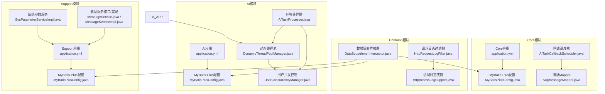
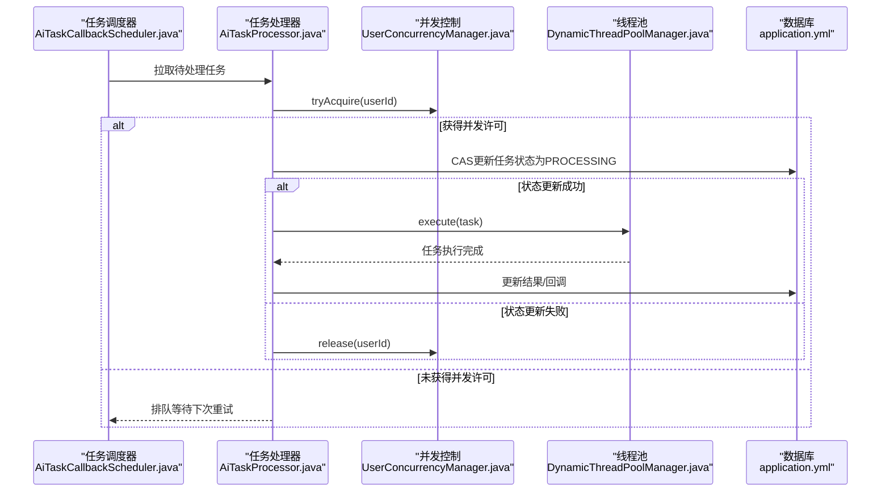
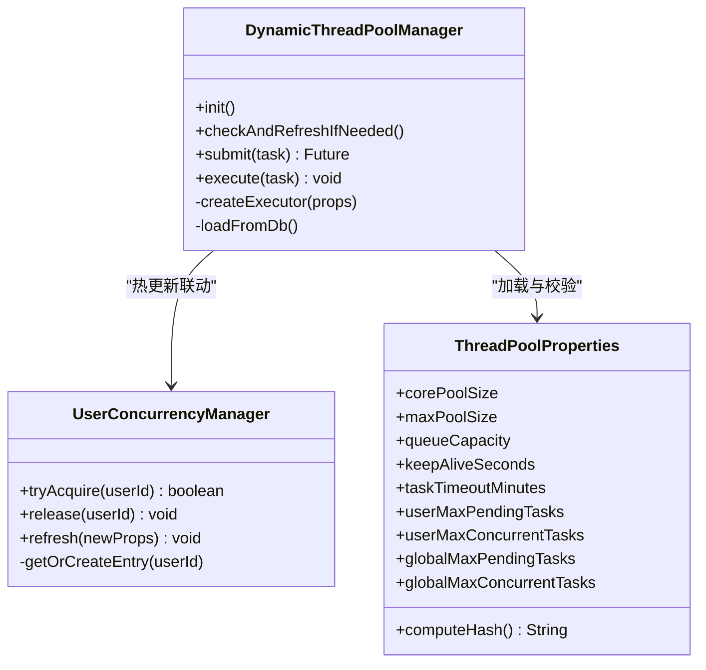
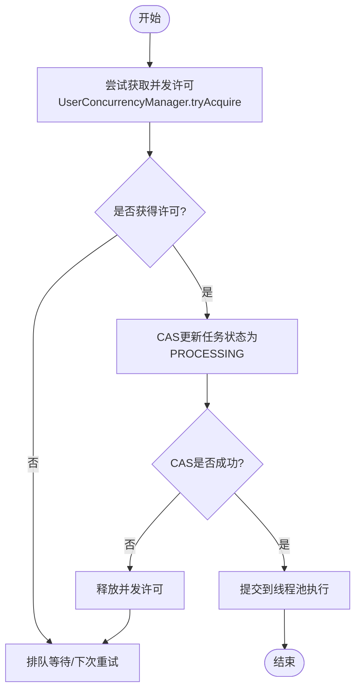
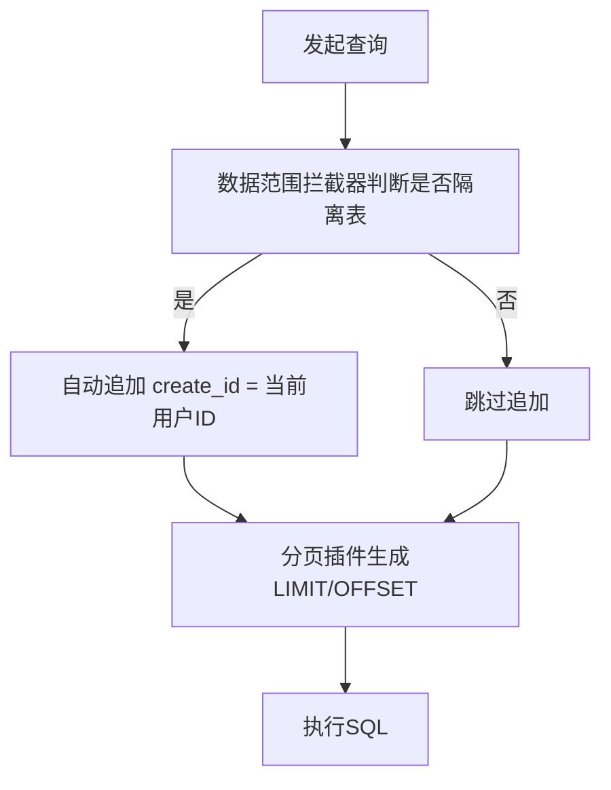
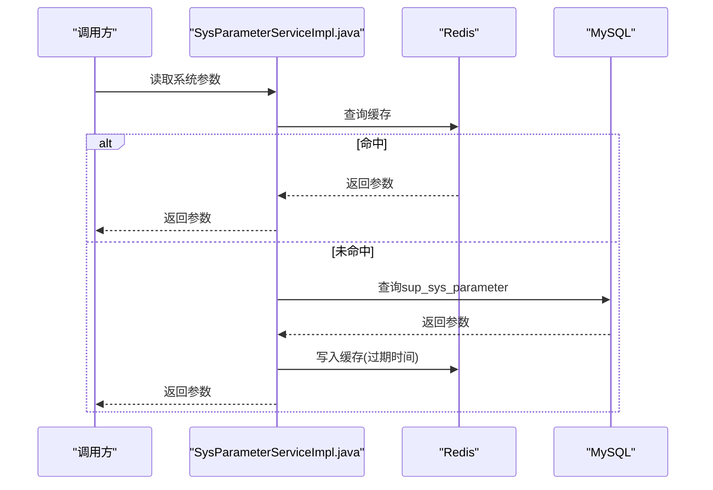
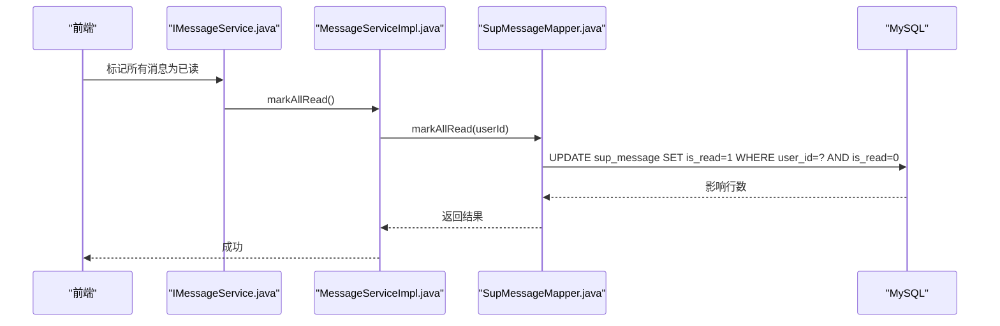
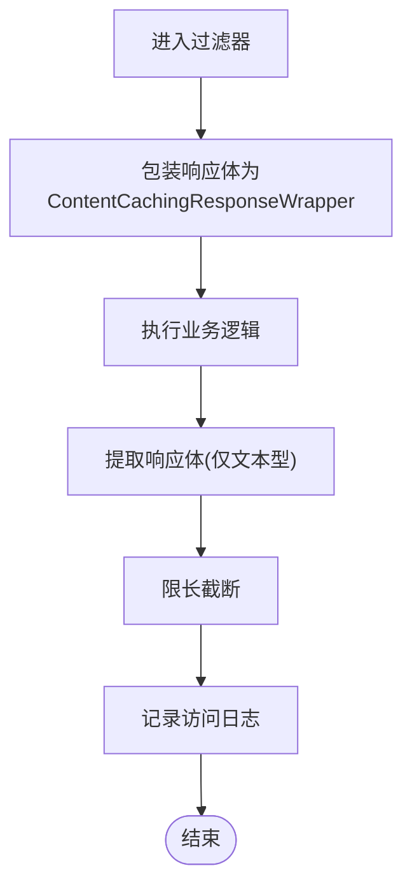
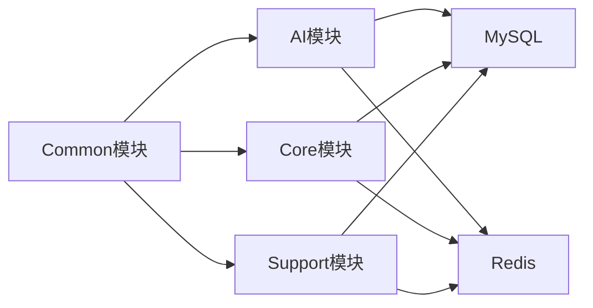

# 后端性能优化

<cite>
**本文引用的文件**   
- [application.yml](file://ele-ai-tender-system/ele-ai-tender-ai/src/main/resources/application.yml)
- [application.yml](file://ele-ai-tender-system/ele-ai-tender-core/src/main/resources/application.yml)
- [application.yml](file://ele-ai-tender-system/ele-ai-tender-file/src/main/resources/application.yml)
- [application.yml](file://ele-ai-tender-system/ele-ai-tender-support/src/main/resources/application.yml)
- [MyBatisPlusConfig.java](file://ele-ai-tender-system/ele-ai-tender-ai/src/main/java/com/jy/eleaitender/ai/config/MyBatisPlusConfig.java)
- [MyBatisPlusConfig.java](file://ele-ai-tender-system/ele-ai-tender-core/src/main/java/com/jy/eleaitender/core/config/MyBatisPlusConfig.java)
- [MyBatisPlusConfig.java](file://ele-ai-tender-system/ele-ai-tender-support/src/main/java/com/jy/eleaitender/support/config/MyBatisPlusConfig.java)
- [DataScopeInnerInterceptor.java](file://ele-ai-tender-system/ele-ai-tender-common/src/main/java/com/jy/eleaitender/common/datascope/DataScopeInnerInterceptor.java)
- [DynamicThreadPoolManager.java](file://ele-ai-tender-system/ele-ai-tender-ai/src/main/java/com/jy/eleaitender/ai/threadpool/DynamicThreadPoolManager.java)
- [UserConcurrencyManager.java](file://ele-ai-tender-system/ele-ai-tender-ai/src/main/java/com/jy/eleaitender/ai/threadpool/UserConcurrencyManager.java)
- [ThreadPoolProperties.java](file://ele-ai-tender-system/ele-ai-tender-ai/src/main/java/com/jy/eleaitender/ai/config/ThreadPoolProperties.java)
- [SysParameterServiceImpl.java](file://ele-ai-tender-system/ele-ai-tender-support/src/main/java/com/jy/eleaitender/support/service/impl/SysParameterServiceImpl.java)
- [AiTaskProcessor.java](file://ele-ai-tender-system/ele-ai-tender-ai/src/main/java/com/jy/eleaitender/ai/processor/AiTaskProcessor.java)
- [AiTaskCallbackScheduler.java](file://ele-ai-tender-system/ele-ai-tender-core/src/main/java/com/jy/eleaitender/core/scheduler/AiTaskCallbackScheduler.java)
- [SupMessageMapper.java](file://ele-ai-tender-system/ele-ai-tender-core/src/main/java/com/jy/eleaitender/core/mapper/SupMessageMapper.java)
- [IMessageService.java](file://ele-ai-tender-system/ele-ai-tender-support/src/main/java/com/jy/eleaitender/support/service/IMessageService.java)
- [MessageServiceImpl.java](file://ele-ai-tender-system/ele-ai-tender-support/src/main/java/com/jy/eleaitender/support/service/impl/MessageServiceImpl.java)
- [HttpRequestLogFilter.java](file://ele-ai-tender-system/ele-ai-tender-common/src/main/java/com/jy/eleaitender/common/logging/HttpRequestLogFilter.java)
- [HttpAccessLogSupport.java](file://ele-ai-tender-system/ele-ai-tender-common/src/main/java/com/jy/eleaitender/common/logging/HttpAccessLogSupport.java)
</cite>

## 目录
1. [简介](#简介)
2. [项目结构](#项目结构)
3. [核心组件](#核心组件)
4. [架构总览](#架构总览)
5. [详细组件分析](#详细组件分析)
6. [依赖关系分析](#依赖关系分析)
7. [性能考虑](#性能考虑)
8. [故障排查指南](#故障排查指南)
9. [结论](#结论)
10. [附录](#附录)

## 简介
本指南面向“招标文件AI编制系统”的后端性能优化，聚焦以下方面：数据库查询优化（索引、SQL、分页、连接池）、缓存策略（Redis使用模式、失效与一致性）、线程池调优（动态参数、并发控制、队列与内存管理）、异步处理（消息队列、批量、调度器）、JVM调优（堆、GC、监控）以及API响应优化（序列化、压缩、HTTP复用）。文档结合仓库中现有实现进行落地指导，并提供可视化图示帮助理解。

## 项目结构
本项目采用多模块微服务化组织，关键后端模块包括：
- AI任务处理与服务编排（AI模块）
- 核心业务与调度（Core模块）
- 支撑系统与通用能力（Support模块与Common）
- 文件服务（File模块）

各模块均包含Spring Boot应用配置（application.yml），并集成MyBatis-Plus、Redis等基础设施。AI模块提供动态线程池与用户级并发控制；Core模块提供定时回调与批处理；Support模块提供系统参数与消息中心；Common模块提供数据权限拦截与访问日志采集。

图表来源
- [application.yml:1-72](file://ele-ai-tender-system/ele-ai-tender-ai/src/main/resources/application.yml#L1-L72)
- [application.yml:1-59](file://ele-ai-tender-system/ele-ai-tender-core/src/main/resources/application.yml#L1-L59)
- [application.yml:1-63](file://ele-ai-tender-system/ele-ai-tender-file/src/main/resources/application.yml#L1-L63)
- [application.yml:1-68](file://ele-ai-tender-system/ele-ai-tender-support/src/main/resources/application.yml#L1-L68)
- [MyBatisPlusConfig.java:1-21](file://ele-ai-tender-system/ele-ai-tender-ai/src/main/java/com/jy/eleaitender/ai/config/MyBatisPlusConfig.java#L1-L21)
- [MyBatisPlusConfig.java:1-23](file://ele-ai-tender-system/ele-ai-tender-core/src/main/java/com/jy/eleaitender/core/config/MyBatisPlusConfig.java#L1-L23)
- [MyBatisPlusConfig.java:1-28](file://ele-ai-tender-system/ele-ai-tender-support/src/main/java/com/jy/eleaitender/support/config/MyBatisPlusConfig.java#L1-L28)
- [DataScopeInnerInterceptor.java:1-33](file://ele-ai-tender-system/ele-ai-tender-common/src/main/java/com/jy/eleaitender/common/datascope/DataScopeInnerInterceptor.java#L1-L33)
- [DynamicThreadPoolManager.java:1-189](file://ele-ai-tender-system/ele-ai-tender-ai/src/main/java/com/jy/eleaitender/ai/threadpool/DynamicThreadPoolManager.java#L1-L189)
- [UserConcurrencyManager.java:1-130](file://ele-ai-tender-system/ele-ai-tender-ai/src/main/java/com/jy/eleaitender/ai/threadpool/UserConcurrencyManager.java#L1-L130)
- [AiTaskProcessor.java:75-111](file://ele-ai-tender-system/ele-ai-tender-ai/src/main/java/com/jy/eleaitender/ai/processor/AiTaskProcessor.java#L75-L111)
- [AiTaskCallbackScheduler.java:1-35](file://ele-ai-tender-system/ele-ai-tender-core/src/main/java/com/jy/eleaitender/core/scheduler/AiTaskCallbackScheduler.java#L1-L35)
- [SupMessageMapper.java:1-21](file://ele-ai-tender-system/ele-ai-tender-core/src/main/java/com/jy/eleaitender/core/mapper/SupMessageMapper.java#L1-L21)
- [SysParameterServiceImpl.java:1-34](file://ele-ai-tender-system/ele-ai-tender-support/src/main/java/com/jy/eleaitender/support/service/impl/SysParameterServiceImpl.java#L1-L34)
- [IMessageService.java:1-55](file://ele-ai-tender-system/ele-ai-tender-support/src/main/java/com/jy/eleaitender/support/service/IMessageService.java#L1-L55)
- [MessageServiceImpl.java:66-90](file://ele-ai-tender-system/ele-ai-tender-support/src/main/java/com/jy/eleaitender/support/service/impl/MessageServiceImpl.java#L66-L90)
- [HttpRequestLogFilter.java:125-136](file://ele-ai-tender-system/ele-ai-tender-common/src/main/java/com/jy/eleaitender/common/logging/HttpRequestLogFilter.java#L125-L136)
- [HttpAccessLogSupport.java:227-257](file://ele-ai-tender-system/ele-ai-tender-common/src/main/java/com/jy/eleaitender/common/logging/HttpAccessLogSupport.java#L227-L257)

章节来源
- [application.yml:1-72](file://ele-ai-tender-system/ele-ai-tender-ai/src/main/resources/application.yml#L1-L72)
- [application.yml:1-59](file://ele-ai-tender-system/ele-ai-tender-core/src/main/resources/application.yml#L1-L59)
- [application.yml:1-63](file://ele-ai-tender-system/ele-ai-tender-file/src/main/resources/application.yml#L1-L63)
- [application.yml:1-68](file://ele-ai-tender-system/ele-ai-tender-support/src/main/resources/application.yml#L1-L68)

## 核心组件
- 动态线程池管理器：从系统参数表加载线程池参数，支持运行时热更新，自动重建或调整线程池大小与队列容量，并联动用户并发控制刷新。
- 用户并发控制管理器：基于信号量实现全局与用户维度的并发限制，支持热更新且保证刷新后并发控制不失效。
- MyBatis-Plus分页与数据隔离：统一配置分页插件与乐观锁，并在查询时按数据范围自动追加过滤条件，避免全表扫描。
- 系统参数服务：通过Redis缓存系统参数，降低DB读取压力，提高动态配置生效速度。
- 任务处理器与调度器：任务提交前进行并发许可检查与状态CAS更新，避免重复执行；定时调度器周期性拉取待处理任务并批量推进。
- 访问日志与请求包装：对请求/响应体进行选择性采集与限长，避免大对象导致的内存抖动。

章节来源
- [DynamicThreadPoolManager.java:1-189](file://ele-ai-tender-system/ele-ai-tender-ai/src/main/java/com/jy/eleaitender/ai/threadpool/DynamicThreadPoolManager.java#L1-L189)
- [UserConcurrencyManager.java:1-130](file://ele-ai-tender-system/ele-ai-tender-ai/src/main/java/com/jy/eleaitender/ai/threadpool/UserConcurrencyManager.java#L1-L130)
- [MyBatisPlusConfig.java:1-21](file://ele-ai-tender-system/ele-ai-tender-ai/src/main/java/com/jy/eleaitender/ai/config/MyBatisPlusConfig.java#L1-L21)
- [MyBatisPlusConfig.java:1-23](file://ele-ai-tender-system/ele-ai-tender-core/src/main/java/com/jy/eleaitender/core/config/MyBatisPlusConfig.java#L1-L23)
- [MyBatisPlusConfig.java:1-28](file://ele-ai-tender-system/ele-ai-tender-support/src/main/java/com/jy/eleaitender/support/config/MyBatisPlusConfig.java#L1-L28)
- [DataScopeInnerInterceptor.java:1-33](file://ele-ai-tender-system/ele-ai-tender-common/src/main/java/com/jy/eleaitender/common/datascope/DataScopeInnerInterceptor.java#L1-L33)
- [SysParameterServiceImpl.java:1-34](file://ele-ai-tender-system/ele-ai-tender-support/src/main/java/com/jy/eleaitender/support/service/impl/SysParameterServiceImpl.java#L1-L34)
- [AiTaskProcessor.java:75-111](file://ele-ai-tender-system/ele-ai-tender-ai/src/main/java/com/jy/eleaitender/ai/processor/AiTaskProcessor.java#L75-L111)
- [AiTaskCallbackScheduler.java:1-35](file://ele-ai-tender-system/ele-ai-tender-core/src/main/java/com/jy/eleaitender/core/scheduler/AiTaskCallbackScheduler.java#L1-L35)
- [HttpRequestLogFilter.java:125-136](file://ele-ai-tender-system/ele-ai-tender-common/src/main/java/com/jy/eleaitender/common/logging/HttpRequestLogFilter.java#L125-L136)
- [HttpAccessLogSupport.java:227-257](file://ele-ai-tender-system/ele-ai-tender-common/src/main/java/com/jy/eleaitender/common/logging/HttpAccessLogSupport.java#L227-L257)

## 架构总览
下图展示AI任务从调度到执行的端到端流程，体现并发控制、线程池与数据库交互的关键路径。

图表来源
- [AiTaskCallbackScheduler.java:1-35](file://ele-ai-tender-system/ele-ai-tender-core/src/main/java/com/jy/eleaitender/core/scheduler/AiTaskCallbackScheduler.java#L1-L35)
- [AiTaskProcessor.java:75-111](file://ele-ai-tender-system/ele-ai-tender-ai/src/main/java/com/jy/eleaitender/ai/processor/AiTaskProcessor.java#L75-L111)
- [UserConcurrencyManager.java:1-130](file://ele-ai-tender-system/ele-ai-tender-ai/src/main/java/com/jy/eleaitender/ai/threadpool/UserConcurrencyManager.java#L1-L130)
- [DynamicThreadPoolManager.java:1-189](file://ele-ai-tender-system/ele-ai-tender-ai/src/main/java/com/jy/eleaitender/ai/threadpool/DynamicThreadPoolManager.java#L1-L189)
- [application.yml:1-72](file://ele-ai-tender-system/ele-ai-tender-ai/src/main/resources/application.yml#L1-L72)

## 详细组件分析

### 动态线程池与用户并发控制
- 动态线程池管理器负责从系统参数表加载线程池参数，计算参数哈希以检测变更，必要时重建线程池或调整核心/最大线程数、队列容量与存活时间，同时联动用户并发控制刷新。
- 用户并发控制管理器维护全局与用户维度的信号量，确保全局与单用户的并发上限；在热更新时根据当前活跃数重新计算可用许可，避免并发控制失效。

图表来源
- [DynamicThreadPoolManager.java:1-189](file://ele-ai-tender-system/ele-ai-tender-ai/src/main/java/com/jy/eleaitender/ai/threadpool/DynamicThreadPoolManager.java#L1-L189)
- [UserConcurrencyManager.java:1-130](file://ele-ai-tender-system/ele-ai-tender-ai/src/main/java/com/jy/eleaitender/ai/threadpool/UserConcurrencyManager.java#L1-L130)
- [ThreadPoolProperties.java:1-39](file://ele-ai-tender-system/ele-ai-tender-ai/src/main/java/com/jy/eleaitender/ai/config/ThreadPoolProperties.java#L1-L39)

章节来源
- [DynamicThreadPoolManager.java:1-189](file://ele-ai-tender-system/ele-ai-tender-ai/src/main/java/com/jy/eleaitender/ai/threadpool/DynamicThreadPoolManager.java#L1-L189)
- [UserConcurrencyManager.java:1-130](file://ele-ai-tender-system/ele-ai-tender-ai/src/main/java/com/jy/eleaitender/ai/threadpool/UserConcurrencyManager.java#L1-L130)
- [ThreadPoolProperties.java:1-39](file://ele-ai-tender-system/ele-ai-tender-ai/src/main/java/com/jy/eleaitender/ai/config/ThreadPoolProperties.java#L1-L39)

### 任务处理与并发控制流程
任务处理器在执行前进行并发许可检查与状态CAS更新，避免重复执行与并发超限；若未获得许可则返回等待，由调度器轮询重试。

图表来源
- [AiTaskProcessor.java:75-111](file://ele-ai-tender-system/ele-ai-tender-ai/src/main/java/com/jy/eleaitender/ai/processor/AiTaskProcessor.java#L75-L111)
- [UserConcurrencyManager.java:1-130](file://ele-ai-tender-system/ele-ai-tender-ai/src/main/java/com/jy/eleaitender/ai/threadpool/UserConcurrencyManager.java#L1-L130)

章节来源
- [AiTaskProcessor.java:75-111](file://ele-ai-tender-system/ele-ai-tender-ai/src/main/java/com/jy/eleaitender/ai/processor/AiTaskProcessor.java#L75-L111)
- [UserConcurrencyManager.java:1-130](file://ele-ai-tender-system/ele-ai-tender-ai/src/main/java/com/jy/eleaitender/ai/threadpool/UserConcurrencyManager.java#L1-L130)

### 分页与数据隔离
- 各模块统一注册MyBatis-Plus分页插件与乐观锁插件，确保分页查询与并发写安全。
- 数据隔离拦截器在SELECT时自动追加用户维度过滤条件，避免全表扫描与越权访问。

图表来源
- [MyBatisPlusConfig.java:1-21](file://ele-ai-tender-system/ele-ai-tender-ai/src/main/java/com/jy/eleaitender/ai/config/MyBatisPlusConfig.java#L1-L21)
- [MyBatisPlusConfig.java:1-23](file://ele-ai-tender-system/ele-ai-tender-core/src/main/java/com/jy/eleaitender/core/config/MyBatisPlusConfig.java#L1-L23)
- [MyBatisPlusConfig.java:1-28](file://ele-ai-tender-system/ele-ai-tender-support/src/main/java/com/jy/eleaitender/support/config/MyBatisPlusConfig.java#L1-L28)
- [DataScopeInnerInterceptor.java:1-33](file://ele-ai-tender-system/ele-ai-tender-common/src/main/java/com/jy/eleaitender/common/datascope/DataScopeInnerInterceptor.java#L1-L33)

章节来源
- [MyBatisPlusConfig.java:1-21](file://ele-ai-tender-system/ele-ai-tender-ai/src/main/java/com/jy/eleaitender/ai/config/MyBatisPlusConfig.java#L1-L21)
- [MyBatisPlusConfig.java:1-23](file://ele-ai-tender-system/ele-ai-tender-core/src/main/java/com/jy/eleaitender/core/config/MyBatisPlusConfig.java#L1-L23)
- [MyBatisPlusConfig.java:1-28](file://ele-ai-tender-system/ele-ai-tender-support/src/main/java/com/jy/eleaitender/support/config/MyBatisPlusConfig.java#L1-L28)
- [DataScopeInnerInterceptor.java:1-33](file://ele-ai-tender-system/ele-ai-tender-common/src/main/java/com/jy/eleaitender/common/datascope/DataScopeInnerInterceptor.java#L1-L33)

### 系统参数与缓存
- 系统参数服务通过Redis缓存系统参数，缩短读取延迟，配合动态线程池的哈希检测机制，实现参数变更的快速感知与热更新。

图表来源
- [SysParameterServiceImpl.java:1-34](file://ele-ai-tender-system/ele-ai-tender-support/src/main/java/com/jy/eleaitender/support/service/impl/SysParameterServiceImpl.java#L1-L34)
- [application.yml:1-68](file://ele-ai-tender-system/ele-ai-tender-support/src/main/resources/application.yml#L1-L68)

章节来源
- [SysParameterServiceImpl.java:1-34](file://ele-ai-tender-system/ele-ai-tender-support/src/main/java/com/jy/eleaitender/support/service/impl/SysParameterServiceImpl.java#L1-L34)
- [application.yml:1-68](file://ele-ai-tender-system/ele-ai-tender-support/src/main/resources/application.yml#L1-L68)

### 消息中心与批量操作
- 消息服务提供分页查询、未读计数、已读标记与批量已读等功能；批量已读通过一条UPDATE语句减少往返与锁竞争。

图表来源
- [IMessageService.java:1-55](file://ele-ai-tender-system/ele-ai-tender-support/src/main/java/com/jy/eleaitender/support/service/IMessageService.java#L1-L55)
- [MessageServiceImpl.java:66-90](file://ele-ai-tender-system/ele-ai-tender-support/src/main/java/com/jy/eleaitender/support/service/impl/MessageServiceImpl.java#L66-L90)
- [SupMessageMapper.java:1-21](file://ele-ai-tender-system/ele-ai-tender-core/src/main/java/com/jy/eleaitender/core/mapper/SupMessageMapper.java#L1-L21)

章节来源
- [IMessageService.java:1-55](file://ele-ai-tender-system/ele-ai-tender-support/src/main/java/com/jy/eleaitender/support/service/IMessageService.java#L1-L55)
- [MessageServiceImpl.java:66-90](file://ele-ai-tender-system/ele-ai-tender-support/src/main/java/com/jy/eleaitender/support/service/impl/MessageServiceImpl.java#L66-L90)
- [SupMessageMapper.java:1-21](file://ele-ai-tender-system/ele-ai-tender-core/src/main/java/com/jy/eleaitender/core/mapper/SupMessageMapper.java#L1-L21)

### 访问日志与响应采集
- 请求日志过滤器对响应体进行选择性采集，仅对文本类型响应进行正文提取与限长，避免二进制大对象导致内存占用过高。

图表来源
- [HttpRequestLogFilter.java:125-136](file://ele-ai-tender-system/ele-ai-tender-common/src/main/java/com/jy/eleaitender/common/logging/HttpRequestLogFilter.java#L125-L136)
- [HttpAccessLogSupport.java:227-257](file://ele-ai-tender-system/ele-ai-tender-common/src/main/java/com/jy/eleaitender/common/logging/HttpAccessLogSupport.java#L227-L257)

章节来源
- [HttpRequestLogFilter.java:125-136](file://ele-ai-tender-system/ele-ai-tender-common/src/main/java/com/jy/eleaitender/common/logging/HttpRequestLogFilter.java#L125-L136)
- [HttpAccessLogSupport.java:227-257](file://ele-ai-tender-system/ele-ai-tender-common/src/main/java/com/jy/eleaitender/common/logging/HttpAccessLogSupport.java#L227-L257)

## 依赖关系分析
- 模块内依赖：AI模块依赖Common的数据隔离与日志能力；Core模块依赖Support的消息服务；各模块共享MyBatis-Plus与Redis配置。
- 外部依赖：MySQL作为持久化存储，Redis用于缓存与分布式锁（可扩展），外部AI模型服务通过配置接入。

图表来源
- [application.yml:1-72](file://ele-ai-tender-system/ele-ai-tender-ai/src/main/resources/application.yml#L1-L72)
- [application.yml:1-59](file://ele-ai-tender-system/ele-ai-tender-core/src/main/resources/application.yml#L1-L59)
- [application.yml:1-68](file://ele-ai-tender-system/ele-ai-tender-support/src/main/resources/application.yml#L1-L68)

章节来源
- [application.yml:1-72](file://ele-ai-tender-system/ele-ai-tender-ai/src/main/resources/application.yml#L1-L72)
- [application.yml:1-59](file://ele-ai-tender-system/ele-ai-tender-core/src/main/resources/application.yml#L1-L59)
- [application.yml:1-68](file://ele-ai-tender-system/ele-ai-tender-support/src/main/resources/application.yml#L1-L68)

## 性能考虑
- 数据库查询优化
  - 索引设计：为高频查询字段建立复合索引，如消息表的(user_id, is_read, create_time)，任务表的(status, type, create_time)。
  - SQL优化：避免SELECT *，只选择必要字段；使用覆盖索引减少回表；将复杂条件下推到数据库层。
  - 分页策略：优先使用基于游标或主键的范围分页替代OFFSET深分页；对于大数据集，采用分批拉取与流式处理。
  - 连接池配置：根据CPU核数与IO特性设置合理的最小/最大连接数与超时；启用连接健康检查与泄漏检测。
- 缓存策略
  - Redis使用模式：热点数据（系统参数、字典、模板）采用Cache-Aside模式；短生命周期数据设置合理TTL；对高并发读场景考虑本地缓存+二级缓存。
  - 失效策略：采用主动失效（更新后删除/更新缓存）与被动失效（TTL）结合；对强一致要求高的数据采用版本号或分布式锁保护。
  - 一致性保证：使用分布式锁或Lua脚本保证原子性；对热点Key采用分段缓存与随机过期避免雪崩。
- 线程池调优
  - 动态线程池：通过系统参数表驱动核心/最大线程数、队列容量与存活时间；队列容量变化时重建线程池，其他参数直接调整。
  - 用户并发控制：全局与用户维度信号量控制并发上限；热更新时根据当前活跃数重新计算可用许可，避免并发失控。
  - 任务队列与内存管理：合理设置队列容量与拒绝策略；监控队列长度与活跃线程数，避免OOM与背压。
- 异步处理
  - 消息队列：引入可靠消息中间件（如RabbitMQ/Kafka）解耦耗时任务；实现幂等消费与重试补偿。
  - 批量处理：批量拉取任务与批量更新状态，减少DB往返与锁竞争。
  - 调度器配置：固定延迟与可配置间隔；失败重试与告警；分片与并行度控制。
- JVM调优
  - 堆内存设置：根据应用规模与GC目标设置初始与最大堆大小；预留操作系统与NIO缓冲空间。
  - GC算法选择：低延迟场景优先G1/ZGC；吞吐优先场景使用Parallel GC；监控停顿时间与吞吐量指标。
  - 性能监控：启用JMX与Prometheus/Grafana；关注Full GC次数、堆使用率、线程阻塞与队列积压。
- API响应优化
  - 序列化优化：使用高效JSON库（Jackson）并关闭不必要的字段序列化；对大对象进行按需加载。
  - 响应压缩：开启GZIP/Deflate压缩，针对文本型响应提升带宽利用率。
  - HTTP连接复用：启用连接池与Keep-Alive；合理设置最大连接数与空闲超时。

[本节为通用指导，无需具体文件引用]

## 故障排查指南
- 线程池问题
  - 现象：任务堆积、响应变慢、CPU飙升。
  - 排查：观察线程池活跃数、队列长度与拒绝策略触发情况；检查动态参数是否异常；确认用户并发控制是否过紧。
  - 参考实现：动态线程池与用户并发控制的热更新逻辑。
- 数据库慢查询
  - 现象：分页卡顿、全表扫描、锁等待。
  - 排查：查看慢查询日志与执行计划；确认索引是否命中；评估分页深度与条件复杂度。
  - 参考实现：MyBatis-Plus分页与数据隔离拦截器的行为。
- 缓存不一致
  - 现象：参数更新后旧值仍被读取。
  - 排查：检查缓存失效策略与TTL；确认更新链路是否删除/更新缓存；验证哈希检测与热更新是否生效。
  - 参考实现：系统参数服务的Redis缓存与过期时间。
- 日志开销过大
  - 现象：磁盘I/O高、响应延迟增加。
  - 排查：检查响应体采集与限长策略；确认日志级别与滚动策略；避免对二进制响应进行全文解析。
  - 参考实现：请求日志过滤器与访问日志支持的响应体提取逻辑。

章节来源
- [DynamicThreadPoolManager.java:1-189](file://ele-ai-tender-system/ele-ai-tender-ai/src/main/java/com/jy/eleaitender/ai/threadpool/DynamicThreadPoolManager.java#L1-L189)
- [UserConcurrencyManager.java:1-130](file://ele-ai-tender-system/ele-ai-tender-ai/src/main/java/com/jy/eleaitender/ai/threadpool/UserConcurrencyManager.java#L1-L130)
- [MyBatisPlusConfig.java:1-21](file://ele-ai-tender-system/ele-ai-tender-ai/src/main/java/com/jy/eleaitender/ai/config/MyBatisPlusConfig.java#L1-L21)
- [DataScopeInnerInterceptor.java:1-33](file://ele-ai-tender-system/ele-ai-tender-common/src/main/java/com/jy/eleaitender/common/datascope/DataScopeInnerInterceptor.java#L1-L33)
- [SysParameterServiceImpl.java:1-34](file://ele-ai-tender-system/ele-ai-tender-support/src/main/java/com/jy/eleaitender/support/service/impl/SysParameterServiceImpl.java#L1-L34)
- [HttpRequestLogFilter.java:125-136](file://ele-ai-tender-system/ele-ai-tender-common/src/main/java/com/jy/eleaitender/common/logging/HttpRequestLogFilter.java#L125-L136)
- [HttpAccessLogSupport.java:227-257](file://ele-ai-tender-system/ele-ai-tender-common/src/main/java/com/jy/eleaitender/common/logging/HttpAccessLogSupport.java#L227-L257)

## 结论
通过动态线程池与用户并发控制、MyBatis-Plus分页与数据隔离、Redis缓存与系统参数热更新、批量与调度优化、访问日志精细化采集等手段，可在不改动业务逻辑的前提下显著提升系统吞吐与稳定性。建议在生产环境持续监控关键指标，并结合业务特征迭代优化参数与策略。

[本节为总结，无需具体文件引用]

## 附录
- 配置项参考
  - 服务器端口与编码：各模块application.yml中的server与servlet配置。
  - 数据源与Redis：spring.datasource与spring.data.redis相关属性。
  - MyBatis-Plus：mapper-locations、type-aliases-package、全局配置与插件。
  - 内部文件服务：internal.file-service.base-url与jwt-secret。
  - 日志：logging.level与pattern。

章节来源
- [application.yml:1-72](file://ele-ai-tender-system/ele-ai-tender-ai/src/main/resources/application.yml#L1-L72)
- [application.yml:1-59](file://ele-ai-tender-system/ele-ai-tender-core/src/main/resources/application.yml#L1-L59)
- [application.yml:1-63](file://ele-ai-tender-system/ele-ai-tender-file/src/main/resources/application.yml#L1-L63)
- [application.yml:1-68](file://ele-ai-tender-system/ele-ai-tender-support/src/main/resources/application.yml#L1-L68)