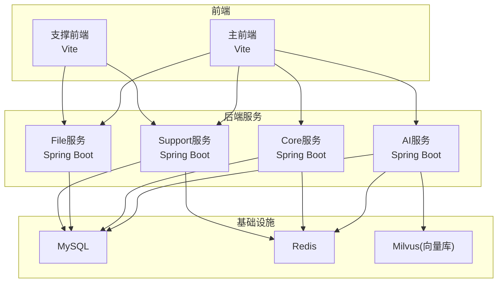
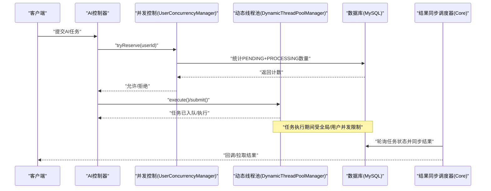
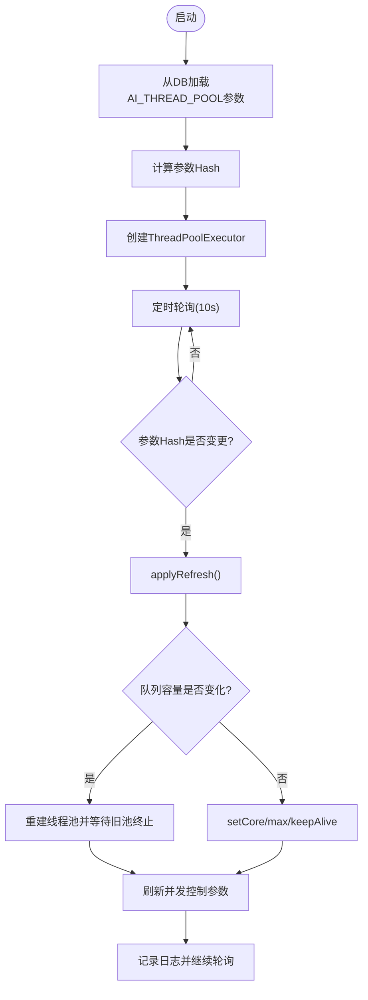
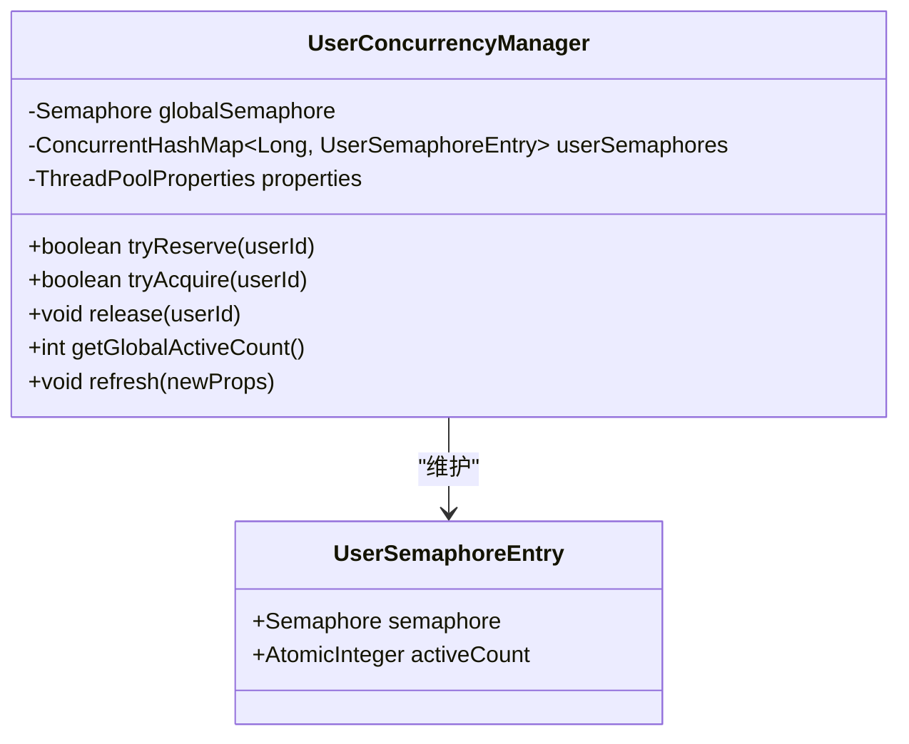
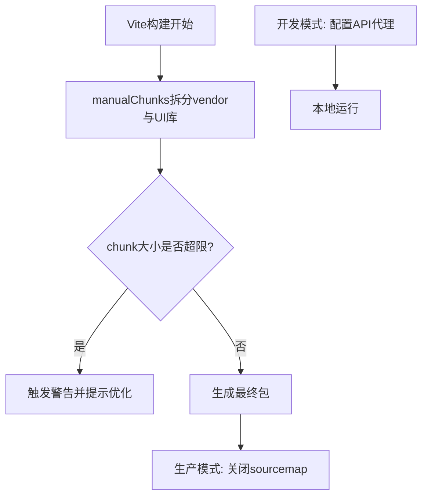
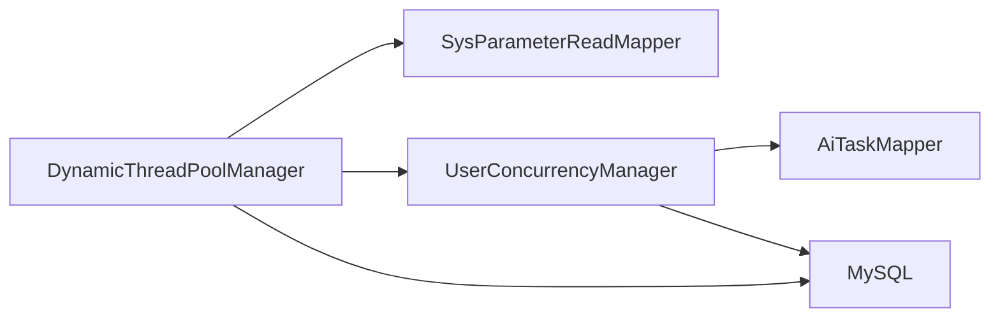

# 性能优化

<cite>
**本文引用的文件**   
- [DynamicThreadPoolManager.java](file://ele-ai-tender-system/ele-ai-tender-ai/src/main/java/com/jy/eleaitender/ai/threadpool/DynamicThreadPoolManager.java)
- [UserConcurrencyManager.java](file://ele-ai-tender-system/ele-ai-tender-ai/src/main/java/com/jy/eleaitender/ai/threadpool/UserConcurrencyManager.java)
- [ThreadPoolProperties.java](file://ele-ai-tender-system/ele-ai-tender-ai/src/main/java/com/jy/eleaitender/ai/config/ThreadPoolProperties.java)
- [MyBatisPlusConfig.java](file://ele-ai-tender-system/ele-ai-tender-ai/src/main/java/com/jy/eleaitender/ai/config/MyBatisPlusConfig.java)
- [application.yml（AI服务）](file://ele-ai-tender-system/ele-ai-tender-ai/src/main/resources/application.yml)
- [application.yml（Core服务）](file://ele-ai-tender-system/ele-ai-tender-core/src/main/resources/application.yml)
- [vite.config.ts（主前端）](file://ele-ai-tender-frontend/vite.config.ts)
- [vite.config.ts（支撑前端）](file://ele-ai-tender-support-frontend/vite.config.ts)
</cite>

## 目录
1. [简介](#简介)
2. [项目结构](#项目结构)
3. [核心组件](#核心组件)
4. [架构总览](#架构总览)
5. [详细组件分析](#详细组件分析)
6. [依赖关系分析](#依赖关系分析)
7. [性能考虑](#性能考虑)
8. [故障排查指南](#故障排查指南)
9. [结论](#结论)
10. [附录](#附录)

## 简介
本指南面向“招标文件AI编制系统”的性能优化，覆盖后端数据库与缓存、线程池与并发控制、AI服务调用优化、前端构建与加载优化、内存管理与GC调优、监控指标与告警配置等。文档结合仓库中现有实现，给出可落地的优化策略与最佳实践，帮助在保障稳定性的前提下提升吞吐、降低延迟并减少资源消耗。

## 项目结构
本项目采用前后端分离与多模块微服务化组织：
- AI服务（ele-ai-tender-ai）：提供AI能力、任务处理、动态线程池与并发控制、向量检索（Milvus）、外部模型接入等。
- Core服务（ele-ai-tender-core）：核心业务编排、状态机、调度器、数据访问等。
- File服务（ele-ai-tender-file）：文件解析、转换、预览等。
- Support服务（ele-ai-tender-support）：支撑能力（用户、权限、模板、知识库等）。
- 前端应用：主前端（ele-ai-tender-frontend）与支撑前端（ele-ai-tender-support-frontend），使用Vite构建与开发代理。

[无图表来源；该图为概念性架构图]

## 核心组件
本节聚焦与性能密切相关的核心组件：动态线程池管理器、用户级并发控制、MyBatis Plus分页与乐观锁、以及前后端构建与代理配置。

- 动态线程池管理器：从数据库参数表热加载线程池配置，支持运行时调整核心/最大线程数、队列容量、KeepAlive等，并通过定时任务检测变更自动刷新。
- 用户级并发控制：基于信号量实现全局与用户维度的并发上限控制，配合数据库统计发起数（PENDING+PROCESSING）进行限流与排队。
- MyBatis Plus配置：启用分页拦截器与乐观锁拦截器，避免全表扫描与无效更新导致的性能问题。
- 前端构建与代理：通过Vite的manualChunks进行代码分割，生产环境关闭sourcemap，合理设置chunkSizeWarningLimit，开发期统一API代理。

**章节来源**
- [DynamicThreadPoolManager.java:1-190](file://ele-ai-tender-system/ele-ai-tender-ai/src/main/java/com/jy/eleaitender/ai/threadpool/DynamicThreadPoolManager.java#L1-L190)
- [UserConcurrencyManager.java:1-131](file://ele-ai-tender-system/ele-ai-tender-ai/src/main/java/com/jy/eleaitender/ai/threadpool/UserConcurrencyManager.java#L1-L131)
- [ThreadPoolProperties.java:1-40](file://ele-ai-tender-system/ele-ai-tender-ai/src/main/java/com/jy/eleaitender/ai/config/ThreadPoolProperties.java#L1-L40)
- [MyBatisPlusConfig.java:1-22](file://ele-ai-tender-system/ele-ai-tender-ai/src/main/java/com/jy/eleaitender/ai/config/MyBatisPlusConfig.java#L1-L22)
- [vite.config.ts（主前端）:1-106](file://ele-ai-tender-frontend/vite.config.ts#L1-L106)
- [vite.config.ts（支撑前端）:1-75](file://ele-ai-tender-support-frontend/vite.config.ts#L1-L75)

## 架构总览
下图展示AI任务从提交到执行的关键路径，包括并发控制、线程池调度与结果同步环节。

**图表来源**
- [DynamicThreadPoolManager.java:68-145](file://ele-ai-tender-system/ele-ai-tender-ai/src/main/java/com/jy/eleaitender/ai/threadpool/DynamicThreadPoolManager.java#L68-L145)
- [UserConcurrencyManager.java:43-88](file://ele-ai-tender-system/ele-ai-tender-ai/src/main/java/com/jy/eleaitender/ai/threadpool/UserConcurrencyManager.java#L43-L88)

## 详细组件分析

### 动态线程池管理器（DynamicThreadPoolManager）
- 功能要点
  - 启动时从sup_sys_parameter表加载AI_THREAD_POOL组参数，构造ThreadPoolExecutor。
  - 每10秒轮询参数Hash变化，若变更则按规则热更新：队列容量变化需重建线程池，否则直接setCorePoolSize/setMaximumPoolSize/setKeepAliveTime。
  - 暴露getActiveCount/getPoolSize/getQueueSize用于监控。
  - 与UserConcurrencyManager联动，刷新并发控制参数。
- 关键流程
  - 初始化：读取参数→计算Hash→创建线程池。
  - 定时刷新：比较Hash→applyRefresh→必要时shutdown旧池并awaitTermination。
  - 任务提交：execute/submit委托给底层ThreadPoolExecutor。
- 复杂度与影响
  - 轮询为O(1)哈希比较；参数刷新涉及线程池重建时的等待与中断处理，应避免频繁变更。
  - CallerRunsPolicy在队列满时回退调用者线程执行，有助于背压但可能阻塞请求线程，需结合并发控制使用。
- 优化建议
  - 将队列容量与CPU核数、I/O比例匹配；对CPU密集型任务优先增大maxPoolSize，对I/O密集型适当增大queueCapacity。
  - 监控active/pool/queue指标，结合业务SLA设定阈值告警。
  - 避免在生产环境高频修改参数，批量变更后重启或合并刷新。

**图表来源**
- [DynamicThreadPoolManager.java:46-82](file://ele-ai-tender-system/ele-ai-tender-ai/src/main/java/com/jy/eleaitender/ai/threadpool/DynamicThreadPoolManager.java#L46-L82)
- [DynamicThreadPoolManager.java:113-145](file://ele-ai-tender-system/ele-ai-tender-ai/src/main/java/com/jy/eleaitender/ai/threadpool/DynamicThreadPoolManager.java#L113-L145)

**章节来源**
- [DynamicThreadPoolManager.java:1-190](file://ele-ai-tender-system/ele-ai-tender-ai/src/main/java/com/jy/eleaitender/ai/threadpool/DynamicThreadPoolManager.java#L1-L190)
- [ThreadPoolProperties.java:1-40](file://ele-ai-tender-system/ele-ai-tender-ai/src/main/java/com/jy/eleaitender/ai/config/ThreadPoolProperties.java#L1-L40)

### 用户级并发控制（UserConcurrencyManager）
- 功能要点
  - tryReserve：基于数据库统计全局与用户的PENDING+PROCESSING数量，超过上限直接拒绝。
  - tryAcquire/release：使用Semaphore控制用户与全局并发执行数（PROCESSING），未获得许可的任务进入排队等待。
  - refresh：热更新并发上限，新信号量许可数=新上限-当前活跃数，确保刷新后不失效。
- 并发模型
  - 全局信号量：限制整体并发。
  - 用户信号量：防止单用户独占资源。
  - 活跃计数：记录每个用户当前并发执行数。
- 优化建议
  - 将并发上限与下游AI服务QPS/超时/错误率联动，结合灰度与熔断策略。
  - 对高延迟任务，适当降低并发上限，提高整体稳定性。
  - 监控globalActiveCount与队列长度，结合告警动态调整。

**图表来源**
- [UserConcurrencyManager.java:23-131](file://ele-ai-tender-system/ele-ai-tender-ai/src/main/java/com/jy/eleaitender/ai/threadpool/UserConcurrencyManager.java#L23-L131)

**章节来源**
- [UserConcurrencyManager.java:1-131](file://ele-ai-tender-system/ele-ai-tender-ai/src/main/java/com/jy/eleaitender/ai/threadpool/UserConcurrencyManager.java#L1-L131)

### 数据库与ORM优化（MyBatis Plus）
- 分页与乐观锁
  - 启用PaginationInnerInterceptor，避免全表扫描与超大结果集传输。
  - 启用OptimisticLockerInnerInterceptor，减少锁竞争与重复更新开销。
- 连接与日志
  - 根据application.yml配置合理的连接池与超时；生产环境建议关闭SQL输出日志，改用审计或采样。
- 索引与查询
  - 针对高频过滤字段建立合适索引；避免SELECT *，仅选择必要列。
  - 复杂查询拆分为多次简单查询，利用应用层聚合。

**章节来源**
- [MyBatisPlusConfig.java:10-21](file://ele-ai-tender-system/ele-ai-tender-ai/src/main/java/com/jy/eleaitender/ai/config/MyBatisPlusConfig.java#L10-L21)
- [application.yml（Core服务）:16-41](file://ele-ai-tender-system/ele-ai-tender-core/src/main/resources/application.yml#L16-L41)
- [application.yml（AI服务）:36-48](file://ele-ai-tender-system/ele-ai-tender-ai/src/main/resources/application.yml#L36-L48)

### AI服务性能优化
- 模型调用优化
  - 合理设置OpenAI/DeepSeek等模型的base-url、超时与重试策略；对大响应体启用流式处理（如适用）。
  - 使用连接池与HTTP客户端复用，避免频繁握手。
- 批量处理
  - 将多个小任务合并为批量请求，减少网络往返与上下文切换。
  - 对长文本分块处理，控制单次请求大小，避免超时与OOM。
- 异步任务调度
  - 通过动态线程池承载AI任务，结合UserConcurrencyManager限流。
  - 使用Core服务的调度器轮询任务结果，解耦生成与消费。

**章节来源**
- [application.yml（AI服务）:28-35](file://ele-ai-tender-system/ele-ai-tender-ai/src/main/resources/application.yml#L28-L35)
- [DynamicThreadPoolManager.java:86-108](file://ele-ai-tender-system/ele-ai-tender-ai/src/main/java/com/jy/eleaitender/ai/threadpool/DynamicThreadPoolManager.java#L86-L108)
- [UserConcurrencyManager.java:43-88](file://ele-ai-tender-system/ele-ai-tender-ai/src/main/java/com/jy/eleaitender/ai/threadpool/UserConcurrencyManager.java#L43-L88)

### 前端性能优化
- 代码分割与懒加载
  - 使用Vite的manualChunks将第三方库（element-plus、vue、vue-router、pinia）独立打包，提升缓存命中率与并行下载。
  - 路由级按需加载大型页面组件，减少首屏体积。
- 资源压缩与构建
  - 生产环境关闭sourcemap，减小产物体积。
  - 设置chunkSizeWarningLimit，避免单个chunk过大导致加载缓慢。
- 开发代理
  - 统一/api前缀代理至各后端服务，便于本地联调与跨域处理。

**图表来源**
- [vite.config.ts（主前端）:87-103](file://ele-ai-tender-frontend/vite.config.ts#L87-L103)
- [vite.config.ts（支撑前端）:60-72](file://ele-ai-tender-support-frontend/vite.config.ts#L60-L72)

**章节来源**
- [vite.config.ts（主前端）:1-106](file://ele-ai-tender-frontend/vite.config.ts#L1-L106)
- [vite.config.ts（支撑前端）:1-75](file://ele-ai-tender-support-frontend/vite.config.ts#L1-L75)

## 依赖关系分析
- 组件耦合
  - DynamicThreadPoolManager依赖SysParameterReadMapper读取参数，并与UserConcurrencyManager协作刷新并发控制。
  - UserConcurrencyManager依赖AiTaskMapper统计任务状态，作为限流依据。
- 外部依赖
  - MySQL：持久化任务与参数。
  - Redis：会话、缓存与分布式锁（可在后续扩展）。
  - Milvus：向量检索，用于知识召回与相似度匹配。
- 潜在风险
  - 参数刷新频繁导致线程池重建抖动。
  - 并发控制与线程池容量不匹配造成排队过长或背压不足。
  - 前端chunk过大导致首屏加载慢。

**图表来源**
- [DynamicThreadPoolManager.java:33-38](file://ele-ai-tender-system/ele-ai-tender-ai/src/main/java/com/jy/eleaitender/ai/threadpool/DynamicThreadPoolManager.java#L33-L38)
- [UserConcurrencyManager.java:25-35](file://ele-ai-tender-system/ele-ai-tender-ai/src/main/java/com/jy/eleaitender/ai/threadpool/UserConcurrencyManager.java#L25-L35)

**章节来源**
- [DynamicThreadPoolManager.java:1-190](file://ele-ai-tender-system/ele-ai-tender-ai/src/main/java/com/jy/eleaitender/ai/threadpool/DynamicThreadPoolManager.java#L1-L190)
- [UserConcurrencyManager.java:1-131](file://ele-ai-tender-system/ele-ai-tender-ai/src/main/java/com/jy/eleaitender/ai/threadpool/UserConcurrencyManager.java#L1-L131)

## 性能考虑
- 数据库查询优化
  - 使用分页与只读列，避免N+1查询；对高频条件加索引；复杂查询物化视图或汇总表。
- 缓存策略设计
  - 热点配置（如AI线程池参数）可引入Redis缓存，缩短读取延迟；注意缓存一致性与过期策略。
  - 对外部模型响应做短期缓存（相同Prompt去重），降低重复调用成本。
- 线程池调优
  - CPU密集型：core≈CPU核数，max≈2×CPU核数；I/O密集型：core较大，max更大，队列适度放大。
  - 监控active/pool/queue/Rejected，结合业务SLA动态调整。
- AI服务优化
  - 批量合并、分块处理、流式响应；合理设置超时与重试；失败快速失败与降级。
- 前端优化
  - 路由懒加载、组件按需引入、静态资源CDN与缓存；开启Gzip/Brotli。
- 内存管理与GC
  - 堆内存监控：关注Heap Used、Max、Young/Old Gen占比；设置合适的-Xms/-Xmx。
  - GC调优：CMS/G1/ZGC选择与参数调优；避免大对象分配与频繁Full GC。
  - 泄漏检测：定期分析Heap Dump与GC日志，定位持有引用链。
- 并发编程优化
  - 锁优化：缩小临界区、使用无锁数据结构（ConcurrentHashMap、Atomic*）；避免长时间持锁。
  - 异步处理：以CompletableFuture/线程池替代阻塞等待；消息队列削峰填谷。
  - 背压与限流：令牌桶/漏桶算法，保护下游服务。

[本节为通用指导，无需特定文件来源]

## 故障排查指南
- 线程池相关
  - 现象：任务堆积、响应变慢。
  - 排查：查看getActiveCount/getPoolSize/getQueueSize；检查队列容量与并发上限是否匹配；观察CallerRunsPolicy是否频繁触发。
  - 参考：[DynamicThreadPoolManager.java:98-108](file://ele-ai-tender-system/ele-ai-tender-ai/src/main/java/com/jy/eleaitender/ai/threadpool/DynamicThreadPoolManager.java#L98-L108)
- 并发控制相关
  - 现象：大量任务被拒绝或排队。
  - 排查：检查tryReserve与tryAcquire返回值；核对全局/用户并发上限；确认AiTaskMapper统计是否正确。
  - 参考：[UserConcurrencyManager.java:43-88](file://ele-ai-tender-system/ele-ai-tender-ai/src/main/java/com/jy/eleaitender/ai/threadpool/UserConcurrencyManager.java#L43-L88)
- 数据库相关
  - 现象：慢查询、连接池耗尽。
  - 排查：检查分页与索引；查看连接池配置与等待时间；关闭生产SQL日志。
  - 参考：[application.yml（Core服务）:16-41](file://ele-ai-tender-system/ele-ai-tender-core/src/main/resources/application.yml#L16-L41)
- 前端构建相关
  - 现象：首屏加载慢、chunk过大。
  - 排查：检查chunkSizeWarningLimit与manualChunks拆分；确认sourcemap在生产关闭。
  - 参考：[vite.config.ts（主前端）:87-103](file://ele-ai-tender-frontend/vite.config.ts#L87-L103)

**章节来源**
- [DynamicThreadPoolManager.java:98-108](file://ele-ai-tender-system/ele-ai-tender-ai/src/main/java/com/jy/eleaitender/ai/threadpool/DynamicThreadPoolManager.java#L98-L108)
- [UserConcurrencyManager.java:43-88](file://ele-ai-tender-system/ele-ai-tender-ai/src/main/java/com/jy/eleaitender/ai/threadpool/UserConcurrencyManager.java#L43-L88)
- [application.yml（Core服务）:16-41](file://ele-ai-tender-system/ele-ai-tender-core/src/main/resources/application.yml#L16-L41)
- [vite.config.ts（主前端）:87-103](file://ele-ai-tender-frontend/vite.config.ts#L87-L103)

## 结论
通过对动态线程池与并发控制的精细化治理、数据库与ORM的合理使用、AI服务调用的批量化与异步化、以及前端构建的代码分割与资源优化，可以显著提升系统的吞吐与稳定性。建议在生产环境持续采集关键性能指标，结合告警与自动化调参机制，形成闭环的性能优化体系。

[本节为总结性内容，无需特定文件来源]

## 附录
- 关键配置项参考
  - AI服务：端口、数据源、Redis、AI模型基础URL、JWT、内部文件服务地址、日志级别。
  - Core服务：端口、数据源、Redis、MyBatis Plus映射与逻辑删除、JWT、内部文件服务地址、日志级别。
- 监控指标建议
  - 线程池：activeCount、poolSize、queueSize、rejectedCount。
  - 并发控制：globalActiveCount、userActiveCount、reserveRejectRate、acquireWaitTime。
  - 数据库：连接池活跃/空闲、慢查询数、事务等待时间。
  - 前端：首屏时间、TTFB、资源体积、错误率。

**章节来源**
- [application.yml（AI服务）:1-72](file://ele-ai-tender-system/ele-ai-tender-ai/src/main/resources/application.yml#L1-L72)
- [application.yml（Core服务）:1-59](file://ele-ai-tender-system/ele-ai-tender-core/src/main/resources/application.yml#L1-L59)