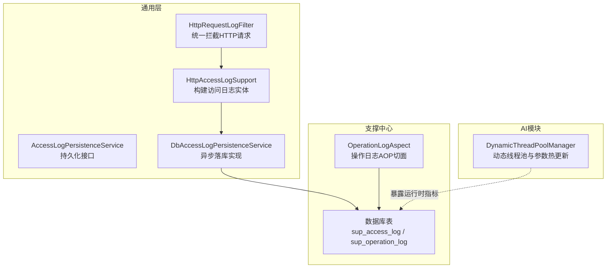
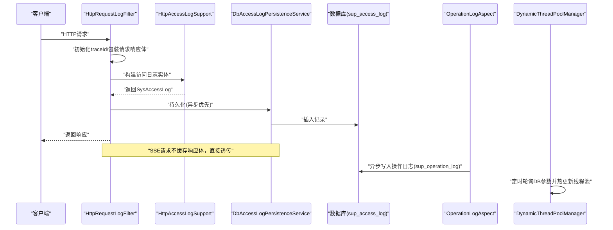
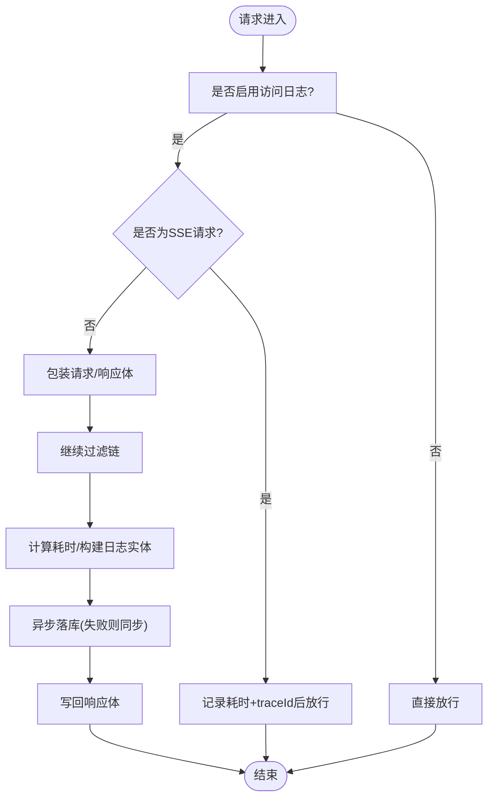
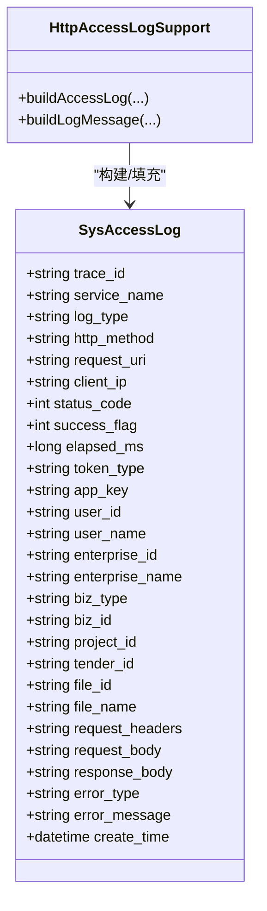
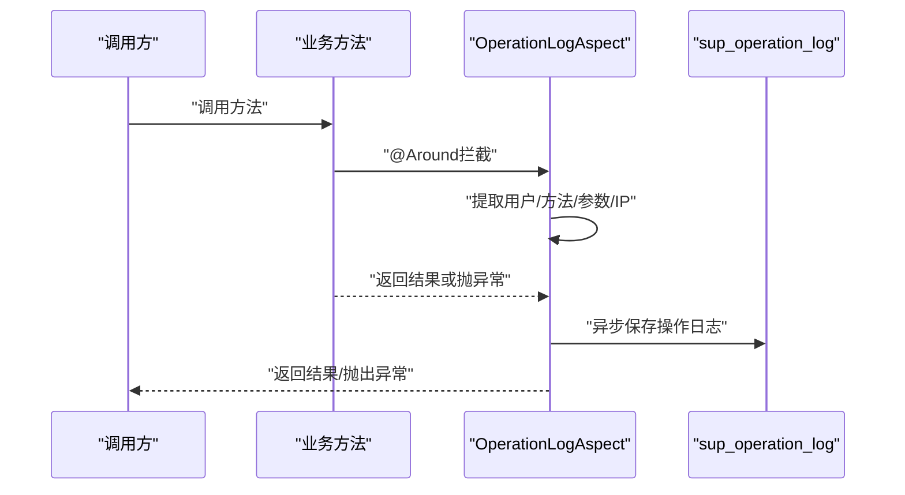
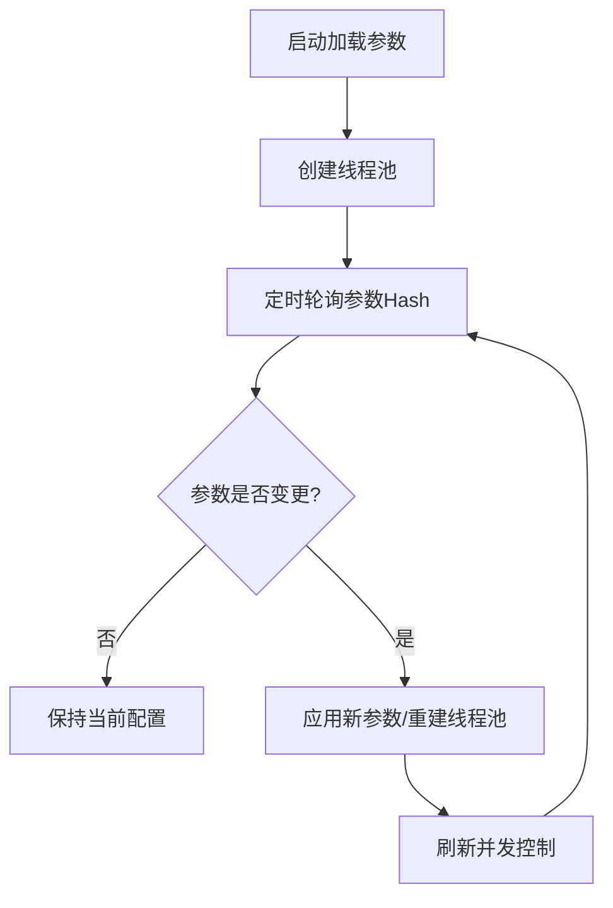
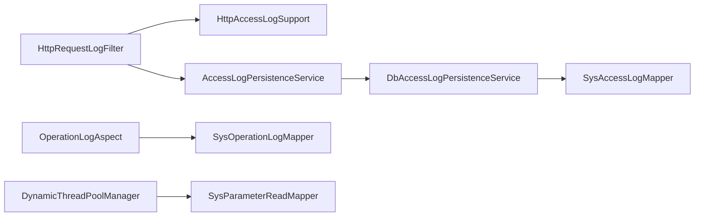

# 监控与指标

<cite>
**本文引用的文件**
- [HttpRequestLogFilter.java](file://ele-ai-tender-system/ele-ai-tender-common/src/main/java/com/jy/eleaitender/common/logging/HttpRequestLogFilter.java)
- [HttpAccessLogSupport.java](file://ele-ai-tender-system/ele-ai-tender-common/src/main/java/com/jy/eleaitender/common/logging/HttpAccessLogSupport.java)
- [AccessLogPersistenceService.java](file://ele-ai-tender-system/ele-ai-tender-common/src/main/java/com/jy/eleaitender/common/logging/AccessLogPersistenceService.java)
- [DbAccessLogPersistenceService.java](file://ele-ai-tender-system/ele-ai-tender-common/src/main/java/com/jy/eleaitender/common/logging/DbAccessLogPersistenceService.java)
- [OperationLogAspect.java](file://ele-ai-tender-system/ele-ai-tender-support/src/main/java/com/jy/eleaitender/support/aspect/OperationLogAspect.java)
- [init.sql（支撑中心）](file://ele-ai-tender-system/ele-ai-tender-support/sql/init.sql)
- [DynamicThreadPoolManager.java](file://ele-ai-tender-system/ele-ai-tender-ai/src/main/java/com/jy/eleaitender/ai/threadpool/DynamicThreadPoolManager.java)
</cite>

## 目录
1. [引言](#引言)
2. [项目结构](#项目结构)
3. [核心组件](#核心组件)
4. [架构总览](#架构总览)
5. [详细组件分析](#详细组件分析)
6. [依赖分析](#依赖分析)
7. [性能考虑](#性能考虑)
8. [故障排查指南](#故障排查指南)
9. [结论](#结论)
10. [附录](#附录)

## 引言
本指南面向“招标文件AI编制系统”的监控与指标管理，目标是建立一套可观测、可诊断、可扩展的体系。内容覆盖：
- 关键性能指标定义：响应时间、吞吐量、错误率、资源使用率等
- 监控系统架构：数据采集、传输、存储与展示方案
- 日志收集与分析：结构化日志设计、日志聚合与异常检测
- 告警规则配置：阈值设置、告警级别与通知渠道
- 性能瓶颈分析方法：链路追踪、热点分析与容量规划
- 业务指标监控：用户行为分析、功能使用统计与业务健康度评估

## 项目结构
本项目在通用层提供HTTP访问日志采集能力，在支撑中心提供操作日志切面与持久化表，AI模块提供动态线程池管理能力，便于进行资源与并发层面的监控与调优。

图表来源
- [HttpRequestLogFilter.java:41-106](file://ele-ai-tender-system/ele-ai-tender-common/src/main/java/com/jy/eleaitender/common/logging/HttpRequestLogFilter.java#L41-L106)
- [HttpAccessLogSupport.java:37-69](file://ele-ai-tender-system/ele-ai-tender-common/src/main/java/com/jy/eleaitender/common/logging/HttpAccessLogSupport.java#L37-L69)
- [AccessLogPersistenceService.java:8-11](file://ele-ai-tender-system/ele-ai-tender-common/src/main/java/com/jy/eleaitender/common/logging/AccessLogPersistenceService.java#L8-L11)
- [DbAccessLogPersistenceService.java:28-63](file://ele-ai-tender-system/ele-ai-tender-common/src/main/java/com/jy/eleaitender/common/logging/DbAccessLogPersistenceService.java#L28-L63)
- [OperationLogAspect.java:39-66](file://ele-ai-tender-system/ele-ai-tender-support/src/main/java/com/jy/eleaitender/support/aspect/OperationLogAspect.java#L39-L66)
- [init.sql（支撑中心）:218-272](file://ele-ai-tender-system/ele-ai-tender-support/sql/init.sql#L218-L272)
- [DynamicThreadPoolManager.java:68-82](file://ele-ai-tender-system/ele-ai-tender-ai/src/main/java/com/jy/eleaitender/ai/threadpool/DynamicThreadPoolManager.java#L68-L82)

章节来源
- [HttpRequestLogFilter.java:41-106](file://ele-ai-tender-system/ele-ai-tender-common/src/main/java/com/jy/eleaitender/common/logging/HttpRequestLogFilter.java#L41-L106)
- [HttpAccessLogSupport.java:37-69](file://ele-ai-tender-system/ele-ai-tender-common/src/main/java/com/jy/eleaitender/common/logging/HttpAccessLogSupport.java#L37-L69)
- [AccessLogPersistenceService.java:8-11](file://ele-ai-tender-system/ele-ai-tender-common/src/main/java/com/jy/eleaitender/common/logging/AccessLogPersistenceService.java#L8-L11)
- [DbAccessLogPersistenceService.java:28-63](file://ele-ai-tender-system/ele-ai-tender-common/src/main/java/com/jy/eleaitender/common/logging/DbAccessLogPersistenceService.java#L28-L63)
- [OperationLogAspect.java:39-66](file://ele-ai-tender-system/ele-ai-tender-support/src/main/java/com/jy/eleaitender/support/aspect/OperationLogAspect.java#L39-L66)
- [init.sql（支撑中心）:218-272](file://ele-ai-tender-system/ele-ai-tender-support/sql/init.sql#L218-L272)
- [DynamicThreadPoolManager.java:68-82](file://ele-ai-tender-system/ele-ai-tender-ai/src/main/java/com/jy/eleaitender/ai/threadpool/DynamicThreadPoolManager.java#L68-L82)

## 核心组件
- HTTP访问日志过滤器：统一拦截请求，注入traceId，记录耗时、状态码、客户端IP、请求/响应摘要，并支持SSE流式场景的特殊处理。
- 访问日志构建器：从请求/响应中抽取上下文（认证、业务键、文件ID等），生成结构化SysAccessLog实体，并输出固定字段的摘要日志。
- 访问日志持久化服务：提供异步优先、同步降级的落库策略，避免丢日志。
- 操作日志切面：基于注解拦截方法执行，异步记录操作人、方法名、参数摘要、执行时长等。
- 动态线程池管理器：从DB加载线程池参数，定时轮询变更并热更新，暴露活跃线程数、队列长度等运行时指标。

章节来源
- [HttpRequestLogFilter.java:41-106](file://ele-ai-tender-system/ele-ai-tender-common/src/main/java/com/jy/eleaitender/common/logging/HttpRequestLogFilter.java#L41-L106)
- [HttpAccessLogSupport.java:37-69](file://ele-ai-tender-system/ele-ai-tender-common/src/main/java/com/jy/eleaitender/common/logging/HttpAccessLogSupport.java#L37-L69)
- [DbAccessLogPersistenceService.java:28-63](file://ele-ai-tender-system/ele-ai-tender-common/src/main/java/com/jy/eleaitender/common/logging/DbAccessLogPersistenceService.java#L28-L63)
- [OperationLogAspect.java:39-66](file://ele-ai-tender-system/ele-ai-tender-support/src/main/java/com/jy/eleaitender/support/aspect/OperationLogAspect.java#L39-L66)
- [DynamicThreadPoolManager.java:68-82](file://ele-ai-tender-system/ele-ai-tender-ai/src/main/java/com/jy/eleaitender/ai/threadpool/DynamicThreadPoolManager.java#L68-L82)

## 架构总览
下图展示了从请求进入、日志采集、持久化到查询展示的完整链路，以及操作日志与线程池指标的补充。

图表来源
- [HttpRequestLogFilter.java:41-106](file://ele-ai-tender-system/ele-ai-tender-common/src/main/java/com/jy/eleaitender/common/logging/HttpRequestLogFilter.java#L41-L106)
- [HttpAccessLogSupport.java:37-69](file://ele-ai-tender-system/ele-ai-tender-common/src/main/java/com/jy/eleaitender/common/logging/HttpAccessLogSupport.java#L37-L69)
- [DbAccessLogPersistenceService.java:28-63](file://ele-ai-tender-system/ele-ai-tender-common/src/main/java/com/jy/eleaitender/common/logging/DbAccessLogPersistenceService.java#L28-L63)
- [OperationLogAspect.java:39-66](file://ele-ai-tender-system/ele-ai-tender-support/src/main/java/com/jy/eleaitender/support/aspect/OperationLogAspect.java#L39-L66)
- [DynamicThreadPoolManager.java:68-82](file://ele-ai-tender-system/ele-ai-tender-ai/src/main/java/com/jy/eleaitender/ai/threadpool/DynamicThreadPoolManager.java#L68-L82)

## 详细组件分析

### HTTP访问日志采集与持久化
- 采集点：过滤器在请求进入时注入traceId，记录开始时间；在finally块中计算耗时，提取请求/响应摘要，填充认证与业务上下文。
- SSE兼容：对text/event-stream请求不包装响应体，避免异步事件丢失。
- 持久化：默认异步落库，线程池不可用时自动降级为同步，确保不丢日志。

图表来源
- [HttpRequestLogFilter.java:41-106](file://ele-ai-tender-system/ele-ai-tender-common/src/main/java/com/jy/eleaitender/common/logging/HttpRequestLogFilter.java#L41-L106)
- [DbAccessLogPersistenceService.java:28-63](file://ele-ai-tender-system/ele-ai-tender-common/src/main/java/com/jy/eleaitender/common/logging/DbAccessLogPersistenceService.java#L28-L63)

章节来源
- [HttpRequestLogFilter.java:41-106](file://ele-ai-tender-system/ele-ai-tender-common/src/main/java/com/jy/eleaitender/common/logging/HttpRequestLogFilter.java#L41-L106)
- [DbAccessLogPersistenceService.java:28-63](file://ele-ai-tender-system/ele-ai-tender-common/src/main/java/com/jy/eleaitender/common/logging/DbAccessLogPersistenceService.java#L28-L63)

### 访问日志实体与上下文补全
- 字段来源：traceId、service_name、http_method、request_uri、client_ip、status_code、elapsed_ms、headers/body摘要、error_type/message等。
- 上下文补全：从Authorization解析token类型与用户信息，从query或JSON body提取bizType/bizId/projectId/tenderId/fileId等，URI尾段数字兜底识别fileId。
- 敏感信息脱敏：对Token与签名做掩码处理，二进制与multipart请求体采用占位符，避免日志爆量与泄露。

图表来源
- [HttpAccessLogSupport.java:37-69](file://ele-ai-tender-system/ele-ai-tender-common/src/main/java/com/jy/eleaitender/common/logging/HttpAccessLogSupport.java#L37-L69)
- [init.sql（支撑中心）:237-272](file://ele-ai-tender-system/ele-ai-tender-support/sql/init.sql#L237-L272)

章节来源
- [HttpAccessLogSupport.java:37-69](file://ele-ai-tender-system/ele-ai-tender-common/src/main/java/com/jy/eleaitender/common/logging/HttpAccessLogSupport.java#L37-L69)
- [init.sql（支撑中心）:237-272](file://ele-ai-tender-system/ele-ai-tender-support/sql/init.sql#L237-L272)

### 操作日志切面
- 触发方式：通过注解拦截目标方法，记录操作人、方法名、参数摘要、客户端IP与执行时长。
- 异步落库：主线程快速返回，后台异步写入操作日志表，降低对业务延迟的影响。
- 参数安全：过滤Servlet/Spring对象，限制序列化长度，避免异常与超大日志。

图表来源
- [OperationLogAspect.java:39-66](file://ele-ai-tender-system/ele-ai-tender-support/src/main/java/com/jy/eleaitender/support/aspect/OperationLogAspect.java#L39-L66)
- [init.sql（支撑中心）:218-232](file://ele-ai-tender-system/ele-ai-tender-support/sql/init.sql#L218-L232)

章节来源
- [OperationLogAspect.java:39-66](file://ele-ai-tender-system/ele-ai-tender-support/src/main/java/com/jy/eleaitender/support/aspect/OperationLogAspect.java#L39-L66)
- [init.sql（支撑中心）:218-232](file://ele-ai-tender-system/ele-ai-tender-support/sql/init.sql#L218-L232)

### 动态线程池与运行时指标
- 参数来源：从系统参数表加载线程池配置，支持core/max/queue/keepAlive/超时等。
- 热更新：定时轮询DB参数Hash，变化时重建或调整线程池，同时刷新用户级并发控制。
- 指标暴露：提供活跃线程数、池大小、队列长度等运行时指标，用于容量与瓶颈分析。

图表来源
- [DynamicThreadPoolManager.java:68-82](file://ele-ai-tender-system/ele-ai-tender-ai/src/main/java/com/jy/eleaitender/ai/threadpool/DynamicThreadPoolManager.java#L68-L82)

章节来源
- [DynamicThreadPoolManager.java:68-82](file://ele-ai-tender-system/ele-ai-tender-ai/src/main/java/com/jy/eleaitender/ai/threadpool/DynamicThreadPoolManager.java#L68-L82)

## 依赖分析
- 组件耦合
  - HttpRequestLogFilter 依赖 AccessLogProperties 与 AccessLogPersistenceService 接口，松耦合便于替换实现。
  - DbAccessLogPersistenceService 依赖 TaskExecutor 与 Mapper，具备异步优先与同步降级能力。
  - OperationLogAspect 依赖 SecurityContextHolder 与 Mapper，异步落库减少主流程开销。
  - DynamicThreadPoolManager 依赖系统参数读取与并发控制器，具备热更新能力。
- 外部依赖
  - 数据库：sup_access_log、sup_operation_log、sup_sys_parameter 等表。
  - JSON序列化：ObjectMapper 用于参数与正文摘要。
  - JWT解析：用于认证上下文提取。

图表来源
- [HttpRequestLogFilter.java:41-106](file://ele-ai-tender-system/ele-ai-tender-common/src/main/java/com/jy/eleaitender/common/logging/HttpRequestLogFilter.java#L41-L106)
- [DbAccessLogPersistenceService.java:28-63](file://ele-ai-tender-system/ele-ai-tender-common/src/main/java/com/jy/eleaitender/common/logging/DbAccessLogPersistenceService.java#L28-L63)
- [OperationLogAspect.java:39-66](file://ele-ai-tender-system/ele-ai-tender-support/src/main/java/com/jy/eleaitender/support/aspect/OperationLogAspect.java#L39-L66)
- [DynamicThreadPoolManager.java:68-82](file://ele-ai-tender-system/ele-ai-tender-ai/src/main/java/com/jy/eleaitender/ai/threadpool/DynamicThreadPoolManager.java#L68-L82)

章节来源
- [HttpRequestLogFilter.java:41-106](file://ele-ai-tender-system/ele-ai-tender-common/src/main/java/com/jy/eleaitender/common/logging/HttpRequestLogFilter.java#L41-L106)
- [DbAccessLogPersistenceService.java:28-63](file://ele-ai-tender-system/ele-ai-tender-common/src/main/java/com/jy/eleaitender/common/logging/DbAccessLogPersistenceService.java#L28-L63)
- [OperationLogAspect.java:39-66](file://ele-ai-tender-system/ele-ai-tender-support/src/main/java/com/jy/eleaitender/support/aspect/OperationLogAspect.java#L39-L66)
- [DynamicThreadPoolManager.java:68-82](file://ele-ai-tender-system/ele-ai-tender-ai/src/main/java/com/jy/eleaitender/ai/threadpool/DynamicThreadPoolManager.java#L68-L82)

## 性能考虑
- 指标定义建议
  - 响应时间：P50/P90/P99、慢请求占比（如>1s）、SSE首字节时间
  - 吞吐量：QPS、并发连接数、任务提交速率
  - 错误率：HTTP 4xx/5xx比例、业务异常率、第三方调用失败率
  - 资源使用率：CPU、内存、GC、磁盘IO、网络带宽、线程池活跃数与队列长度
- 采集与存储
  - 访问日志已包含elapsed_ms、status_code、success_flag等关键字段，可直接用于SLI计算
  - 操作日志提供execute_time与方法维度统计
  - 线程池指标可通过管理器暴露，结合系统参数表进行容量规划
- 优化建议
  - 合理设置日志体长度限制与采样策略，避免日志风暴
  - 对高频接口开启慢请求采样与热点分析
  - 将异步落库线程池与业务线程池隔离，避免相互影响

[本节为通用指导，无需特定文件引用]

## 故障排查指南
- 常见问题定位
  - 高延迟：查看sup_access_log中elapsed_ms分布，按service_name、request_uri、user_id分组定位热点接口
  - 高错误率：筛选status_code>=400或success_flag=0的记录，结合error_type/error_message分析根因
  - 线程池拥塞：观察DynamicThreadPoolManager的活跃线程数与队列长度，结合系统参数表中的core/max/queue配置
  - 操作异常：通过sup_operation_log的method与params快速复现问题
- 排查步骤
  - 使用trace_id串联跨服务调用链路
  - 针对SSE接口，确认未缓存响应体导致的事件丢失问题
  - 检查异步落库是否降级为同步，必要时扩容TaskExecutor
  - 对比不同环境下的系统参数Hash，确认热更新是否生效

章节来源
- [HttpRequestLogFilter.java:41-106](file://ele-ai-tender-system/ele-ai-tender-common/src/main/java/com/jy/eleaitender/common/logging/HttpRequestLogFilter.java#L41-L106)
- [HttpAccessLogSupport.java:37-69](file://ele-ai-tender-system/ele-ai-tender-common/src/main/java/com/jy/eleaitender/common/logging/HttpAccessLogSupport.java#L37-L69)
- [DbAccessLogPersistenceService.java:28-63](file://ele-ai-tender-system/ele-ai-tender-common/src/main/java/com/jy/eleaitender/common/logging/DbAccessLogPersistenceService.java#L28-L63)
- [OperationLogAspect.java:39-66](file://ele-ai-tender-system/ele-ai-tender-support/src/main/java/com/jy/eleaitender/support/aspect/OperationLogAspect.java#L39-L66)
- [DynamicThreadPoolManager.java:68-82](file://ele-ai-tender-system/ele-ai-tender-ai/src/main/java/com/jy/eleaitender/ai/threadpool/DynamicThreadPoolManager.java#L68-L82)
- [init.sql（支撑中心）:218-272](file://ele-ai-tender-system/ele-ai-tender-support/sql/init.sql#L218-L272)

## 结论
通过统一的HTTP访问日志采集、操作日志切面与动态线程池管理，系统具备了完善的可观测基础。建议在现有基础上完善指标面板、告警规则与异常检测，形成闭环的监控与运维体系。

[本节为总结性内容，无需特定文件引用]

## 附录

### 关键性能指标定义
- 响应时间
  - 定义：从请求进入到响应返回的总耗时
  - 数据来源：sup_access_log.elapsed_ms
  - 参考阈值：P95<500ms（常规接口），P99<1s（复杂接口）
- 吞吐量
  - 定义：单位时间内的请求处理数量
  - 数据来源：sup_access_log.create_time聚合
  - 参考阈值：根据容量规划设定，关注峰值与均值差异
- 错误率
  - 定义：失败请求占总请求的比例
  - 数据来源：sup_access_log.success_flag/status_code
  - 参考阈值：<1%（生产环境）
- 资源使用率
  - 定义：CPU、内存、线程池活跃数、队列长度等
  - 数据来源：DynamicThreadPoolManager暴露指标与系统监控
  - 参考阈值：CPU<70%，队列长度接近上限需扩容

章节来源
- [init.sql（支撑中心）:237-272](file://ele-ai-tender-system/ele-ai-tender-support/sql/init.sql#L237-L272)
- [DynamicThreadPoolManager.java:68-82](file://ele-ai-tender-system/ele-ai-tender-ai/src/main/java/com/jy/eleaitender/ai/threadpool/DynamicThreadPoolManager.java#L68-L82)

### 监控系统架构说明
- 数据采集
  - HTTP访问日志：HttpRequestLogFilter统一采集，HttpAccessLogSupport构建实体
  - 操作日志：OperationLogAspect异步记录
  - 运行时指标：DynamicThreadPoolManager暴露线程池与并发控制指标
- 数据传输
  - 本地异步落库为主，必要时接入消息队列或日志采集Agent
- 数据存储
  - sup_access_log、sup_operation_log、sup_sys_parameter等表
- 数据展示
  - 基于数据库直连或BI工具进行可视化展示

章节来源
- [HttpRequestLogFilter.java:41-106](file://ele-ai-tender-system/ele-ai-tender-common/src/main/java/com/jy/eleaitender/common/logging/HttpRequestLogFilter.java#L41-L106)
- [HttpAccessLogSupport.java:37-69](file://ele-ai-tender-system/ele-ai-tender-common/src/main/java/com/jy/eleaitender/common/logging/HttpAccessLogSupport.java#L37-L69)
- [OperationLogAspect.java:39-66](file://ele-ai-tender-system/ele-ai-tender-support/src/main/java/com/jy/eleaitender/support/aspect/OperationLogAspect.java#L39-L66)
- [init.sql（支撑中心）:218-272](file://ele-ai-tender-system/ele-ai-tender-support/sql/init.sql#L218-L272)

### 日志收集与分析
- 结构化日志设计
  - 固定字段顺序与脱敏策略，便于检索与合规
  - 二进制与multipart请求体采用占位符，避免日志爆炸
- 日志聚合
  - 建议接入集中式日志平台，按trace_id与服务名索引
- 异常检测
  - 基于错误类型与消息模式进行规则匹配与机器学习检测

章节来源
- [HttpAccessLogSupport.java:37-69](file://ele-ai-tender-system/ele-ai-tender-common/src/main/java/com/jy/eleaitender/common/logging/HttpAccessLogSupport.java#L37-L69)

### 告警规则配置
- 阈值设置
  - 响应时间：P95>500ms持续5分钟
  - 错误率：>1%持续5分钟
  - 线程池：队列长度>阈值的80%持续3分钟
- 告警级别
  - 紧急：影响核心业务流程
  - 重要：潜在风险或性能退化
  - 一般：提示性告警
- 通知渠道
  - 邮件、短信、IM群机器人等

[本节为通用指导，无需特定文件引用]

### 性能瓶颈分析方法
- 链路追踪
  - 使用trace_id串联跨服务调用，定位慢节点
- 热点分析
  - 按service_name、request_uri、user_id聚合耗时与错误率
- 容量规划
  - 基于线程池参数与系统负载趋势，动态调整core/max/queue

章节来源
- [DynamicThreadPoolManager.java:68-82](file://ele-ai-tender-system/ele-ai-tender-ai/src/main/java/com/jy/eleaitender/ai/threadpool/DynamicThreadPoolManager.java#L68-L82)

### 业务指标监控
- 用户行为分析
  - 基于sup_access_log的用户维度统计，分析活跃用户与功能偏好
- 功能使用统计
  - 按biz_type/biz_id聚合，评估功能使用热度
- 业务健康度评估
  - 综合错误率、延迟、成功率与用户反馈，形成健康评分

章节来源
- [init.sql（支撑中心）:237-272](file://ele-ai-tender-system/ele-ai-tender-support/sql/init.sql#L237-L272)