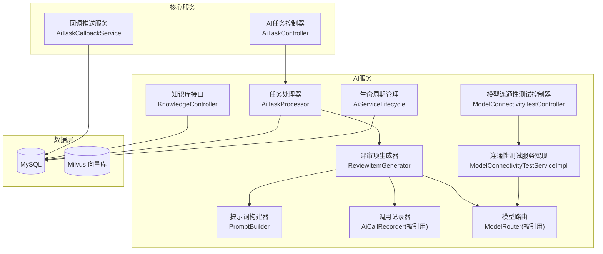
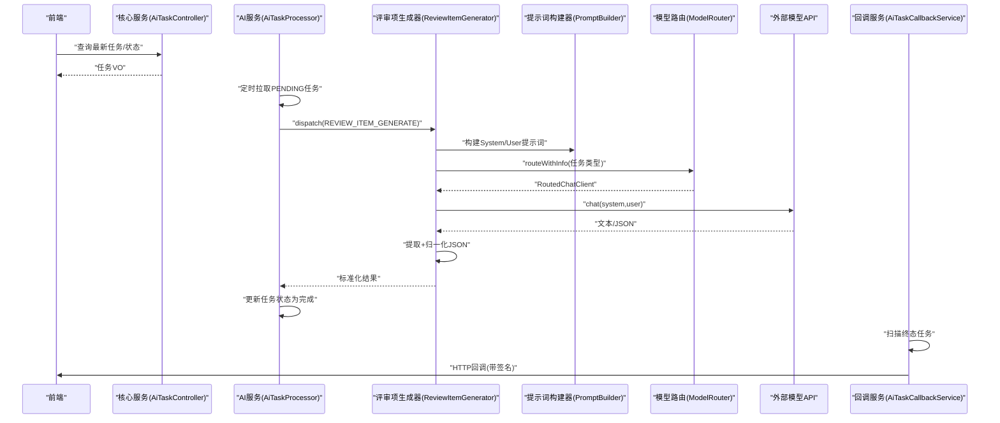
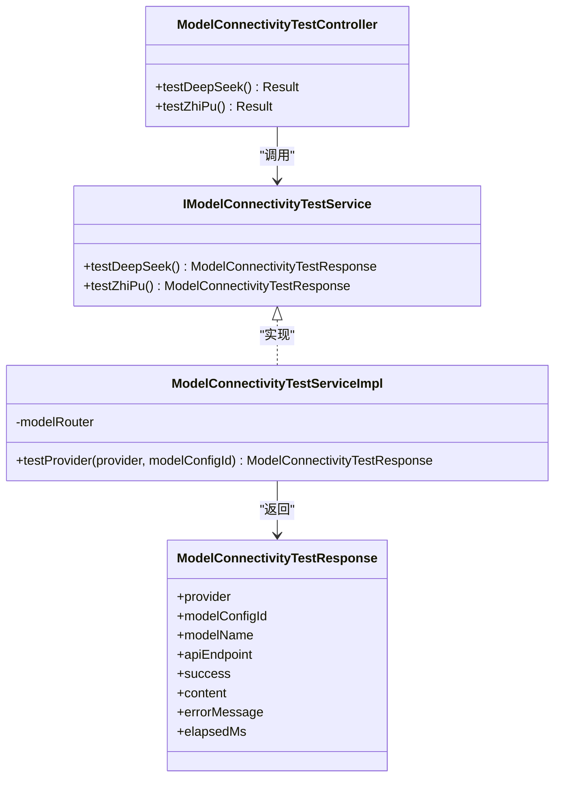
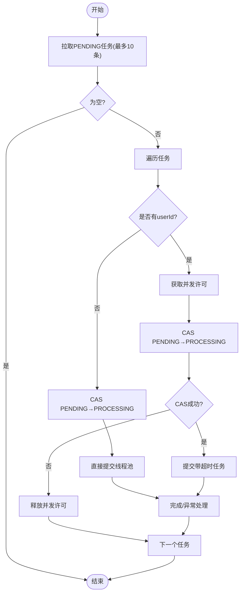
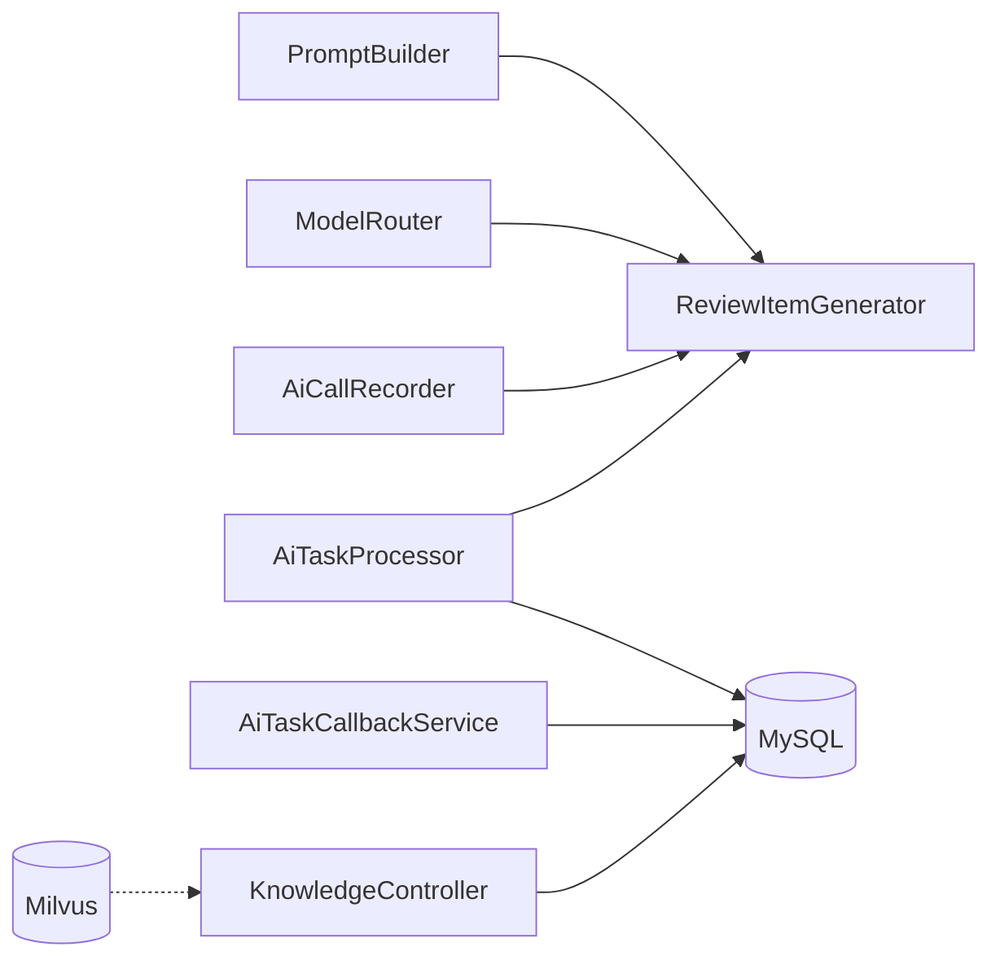

# AI功能测试

<cite>
**本文引用的文件**   
- [PromptBuilder.java](file://ele-ai-tender-system/ele-ai-tender-ai/src/main/java/com/jy/eleaitender/ai/processor/prompt/PromptBuilder.java)
- [ReviewItemGenerator.java](file://ele-ai-tender-system/ele-ai-tender-ai/src/main/java/com/jy/eleaitender/ai/processor/generator/ReviewItemGenerator.java)
- [ReviewItemPromptTemplatesTest.java](file://ele-ai-tender-system/ele-ai-tender-ai/src/test/java/com/jy/eleaitender/ai/processor/prompt/ReviewItemPromptTemplatesTest.java)
- [AiTaskController.java](file://ele-ai-tender-system/ele-ai-tender-core/src/main/java/com/jy/eleaitender/core/controller/AiTaskController.java)
- [AiTaskProcessor.java](file://ele-ai-tender-system/ele-ai-tender-ai/src/main/java/com/jy/eleaitender/ai/processor/AiTaskProcessor.java)
- [AiServiceLifecycle.java](file://ele-ai-tender-system/ele-ai-tender-ai/src/main/java/com/jy/eleaitender/ai/handler/AiServiceLifecycle.java)
- [ModelConnectivityTestController.java](file://ele-ai-tender-system/ele-ai-tender-ai/src/main/java/com/jy/eleaitender/ai/controller/ModelConnectivityTestController.java)
- [IModelConnectivityTestService.java](file://ele-ai-tender-system/ele-ai-tender-ai/src/main/java/com/jy/eleaitender/ai/service/IModelConnectivityTestService.java)
- [ModelConnectivityTestServiceImpl.java](file://ele-ai-tender-system/ele-ai-tender-ai/src/main/java/com/jy/eleaitender/ai/service/impl/ModelConnectivityTestServiceImpl.java)
- [ModelConnectivityTestResponse.java](file://ele-ai-tender-system/ele-ai-tender-ai/src/main/java/com/jy/eleaitender/ai/dto/response/ModelConnectivityTestResponse.java)
- [AiTaskCallbackService.java](file://ele-ai-tender-system/ele-ai-tender-core/src/main/java/com/jy/eleaitender/core/service/external/AiTaskCallbackService.java)
- [KnowledgeController.java](file://ele-ai-tender-system/ele-ai-tender-ai/src/main/java/com/jy/eleaitender/ai/controller/KnowledgeController.java)
- [IKnowledgeDocumentService.java](file://ele-ai-tender-system/ele-ai-tender-ai/src/main/java/com/jy/eleaitender/ai/service/IKnowledgeDocumentService.java)
- [init.sql（知识库与响应日志）](file://ele-ai-tender-system/ele-ai-tender-ai/sql/init.sql)
</cite>

## 目录
1. [引言](#引言)
2. [项目结构](#项目结构)
3. [核心组件](#核心组件)
4. [架构总览](#架构总览)
5. [详细组件分析](#详细组件分析)
6. [依赖关系分析](#依赖关系分析)
7. [性能考量](#性能考量)
8. [故障排查指南](#故障排查指南)
9. [结论](#结论)
10. [附录](#附录)

## 引言
本测试文档面向“招标文件AI编制系统”的AI能力，覆盖以下关键测试域：
- 提示词工程测试：模板完整性、输入输出约束、质量评估
- AI模型响应测试：格式校验、内容质量、错误处理
- 向量知识库测试：Milvus操作、相似度计算、索引性能
- AI任务流程测试：异步处理、状态同步、回调机制
- 结果准确性评估：人工指标与自动化评分
- 回归测试与模型版本管理

## 项目结构
围绕AI功能的后端模块主要位于 ele-ai-tender-ai 与 ele-ai-tender-core。前端提供知识库管理与模型连通性测试入口。数据库脚本包含知识库文档表与AI响应记录表等基础结构。

图表来源
- [KnowledgeController.java:1-55](file://ele-ai-tender-system/ele-ai-tender-ai/src/main/java/com/jy/eleaitender/ai/controller/KnowledgeController.java#L1-L55)
- [AiTaskProcessor.java:1-196](file://ele-ai-tender-system/ele-ai-tender-ai/src/main/java/com/jy/eleaitender/ai/processor/AiTaskProcessor.java#L1-L196)
- [ReviewItemGenerator.java:1-305](file://ele-ai-tender-system/ele-ai-tender-ai/src/main/java/com/jy/eleaitender/ai/processor/generator/ReviewItemGenerator.java#L1-L305)
- [PromptBuilder.java:1-173](file://ele-ai-tender-system/ele-ai-tender-ai/src/main/java/com/jy/eleaitender/ai/processor/prompt/PromptBuilder.java#L1-L173)
- [AiTaskController.java:1-52](file://ele-ai-tender-system/ele-ai-tender-core/src/main/java/com/jy/eleaitender/core/controller/AiTaskController.java#L1-L52)
- [AiTaskCallbackService.java:1-167](file://ele-ai-tender-system/ele-ai-tender-core/src/main/java/com/jy/eleaitender/core/service/external/AiTaskCallbackService.java#L1-L167)
- [ModelConnectivityTestController.java:1-36](file://ele-ai-tender-system/ele-ai-tender-ai/src/main/java/com/jy/eleaitender/ai/controller/ModelConnectivityTestController.java#L1-L36)
- [ModelConnectivityTestServiceImpl.java:1-59](file://ele-ai-tender-system/ele-ai-tender-ai/src/main/java/com/jy/eleaitender/ai/service/impl/ModelConnectivityTestServiceImpl.java#L1-L59)
- [AiServiceLifecycle.java:1-36](file://ele-ai-tender-system/ele-ai-tender-ai/src/main/java/com/jy/eleaitender/ai/handler/AiServiceLifecycle.java#L1-L36)

章节来源
- [KnowledgeController.java:1-55](file://ele-ai-tender-system/ele-ai-tender-ai/src/main/java/com/jy/eleaitender/ai/controller/KnowledgeController.java#L1-L55)
- [AiTaskProcessor.java:1-196](file://ele-ai-tender-system/ele-ai-tender-ai/src/main/java/com/jy/eleaitender/ai/processor/AiTaskProcessor.java#L1-L196)
- [ReviewItemGenerator.java:1-305](file://ele-ai-tender-system/ele-ai-tender-ai/src/main/java/com/jy/eleaitender/ai/processor/generator/ReviewItemGenerator.java#L1-L305)
- [PromptBuilder.java:1-173](file://ele-ai-tender-system/ele-ai-tender-ai/src/main/java/com/jy/eleaitender/ai/processor/prompt/PromptBuilder.java#L1-L173)
- [AiTaskController.java:1-52](file://ele-ai-tender-system/ele-ai-tender-core/src/main/java/com/jy/eleaitender/core/controller/AiTaskController.java#L1-L52)
- [AiTaskCallbackService.java:1-167](file://ele-ai-tender-system/ele-ai-tender-core/src/main/java/com/jy/eleaitender/core/service/external/AiTaskCallbackService.java#L1-L167)
- [ModelConnectivityTestController.java:1-36](file://ele-ai-tender-system/ele-ai-tender-ai/src/main/java/com/jy/eleaitender/ai/controller/ModelConnectivityTestController.java#L1-L36)
- [ModelConnectivityTestServiceImpl.java:1-59](file://ele-ai-tender-system/ele-ai-tender-ai/src/main/java/com/jy/eleaitender/ai/service/impl/ModelConnectivityTestServiceImpl.java#L1-L59)
- [AiServiceLifecycle.java:1-36](file://ele-ai-tender-system/ele-ai-tender-ai/src/main/java/com/jy/eleaitender/ai/handler/AiServiceLifecycle.java#L1-L36)

## 核心组件
- 提示词构建器：按场景组装User Prompt，避免Spring AI模板变量冲突，确保JSON示例与正则中的花括号不被解析。
- 评审项生成器：根据配置选择评分或权重模式，构造System/User提示词，调用模型并归一化JSON输出，失败时触发修复流程。
- 任务处理器：定时拉取PENDING任务，并发控制后提交执行，统一异常分类与状态落库。
- 模型连通性测试：固定模型ID进行最小可用调用，返回供应商、耗时、成功标志与错误信息。
- 知识库接口：提供文档列表、详情、创建与删除；数据库含向量集合字段用于标识向量化状态。
- 任务回调服务：对终态任务进行签名并HTTP推送，支持重试与最大重试次数限制。

章节来源
- [PromptBuilder.java:1-173](file://ele-ai-tender-system/ele-ai-tender-ai/src/main/java/com/jy/eleaitender/ai/processor/prompt/PromptBuilder.java#L1-L173)
- [ReviewItemGenerator.java:1-305](file://ele-ai-tender-system/ele-ai-tender-ai/src/main/java/com/jy/eleaitender/ai/processor/generator/ReviewItemGenerator.java#L1-L305)
- [AiTaskProcessor.java:1-196](file://ele-ai-tender-system/ele-ai-tender-ai/src/main/java/com/jy/eleaitender/ai/processor/AiTaskProcessor.java#L1-L196)
- [ModelConnectivityTestController.java:1-36](file://ele-ai-tender-system/ele-ai-tender-ai/src/main/java/com/jy/eleaitender/ai/controller/ModelConnectivityTestController.java#L1-L36)
- [ModelConnectivityTestServiceImpl.java:1-59](file://ele-ai-tender-system/ele-ai-tender-ai/src/main/java/com/jy/eleaitender/ai/service/impl/ModelConnectivityTestServiceImpl.java#L1-L59)
- [KnowledgeController.java:1-55](file://ele-ai-tender-system/ele-ai-tender-ai/src/main/java/com/jy/eleaitender/ai/controller/KnowledgeController.java#L1-L55)
- [AiTaskCallbackService.java:1-167](file://ele-ai-tender-system/ele-ai-tender-core/src/main/java/com/jy/eleaitender/core/service/external/AiTaskCallbackService.java#L1-L167)

## 架构总览
下图展示从前端到AI服务的端到端交互，包括任务轮询、模型调用、结果归一化与回调推送。

图表来源
- [AiTaskController.java:1-52](file://ele-ai-tender-system/ele-ai-tender-core/src/main/java/com/jy/eleaitender/core/controller/AiTaskController.java#L1-L52)
- [AiTaskProcessor.java:1-196](file://ele-ai-tender-system/ele-ai-tender-ai/src/main/java/com/jy/eleaitender/ai/processor/AiTaskProcessor.java#L1-L196)
- [ReviewItemGenerator.java:1-305](file://ele-ai-tender-system/ele-ai-tender-ai/src/main/java/com/jy/eleaitender/ai/processor/generator/ReviewItemGenerator.java#L1-L305)
- [PromptBuilder.java:1-173](file://ele-ai-tender-system/ele-ai-tender-ai/src/main/java/com/jy/eleaitender/ai/processor/prompt/PromptBuilder.java#L1-L173)
- [AiTaskCallbackService.java:1-167](file://ele-ai-tender-system/ele-ai-tender-core/src/main/java/com/jy/eleaitender/core/service/external/AiTaskCallbackService.java#L1-L167)

## 详细组件分析

### 提示词工程测试
- 目标
  - 验证System与User提示词模板是否包含必要规则与占位符
  - 确保评分模式强制100分合计、禁止Markdown代码块、根节点必须为reviewItems
  - 验证权重模式包含权重与百分比规则
- 方法
  - 模板断言：使用现有单元测试断言关键字符串存在与否
  - 输入覆盖：针对不同类型的项目类型、类别、预算、需求内容与评审方法进行组合
  - 输出约束：通过生成器归一化逻辑与修复流程验证最终JSON结构
- 用例建议
  - 评分模式：断言“符合性审查不计入100分”“叶子节点score合计必须正好等于100分”“不要输出总分不等于目标分的JSON”
  - 权重模式：断言包含“权重”“100%”等关键词
  - 修复提示词：断言“只修复JSON格式”“不得重新生成”“只能输出一个合法JSON对象”
- 质量评估
  - 覆盖率：关键规则断言全部命中
  - 稳定性：多次运行不出现断言抖动
  - 可维护性：新增评审类型或评分规则时，需同步更新断言

章节来源
- [ReviewItemPromptTemplatesTest.java:1-86](file://ele-ai-tender-system/ele-ai-tender-ai/src/test/java/com/jy/eleaitender/ai/processor/prompt/ReviewItemPromptTemplatesTest.java#L1-L86)
- [PromptBuilder.java:1-173](file://ele-ai-tender-system/ele-ai-tender-ai/src/main/java/com/jy/eleaitender/ai/processor/prompt/PromptBuilder.java#L1-L173)

### AI模型响应测试
- 目标
  - 验证模型连通性与基本可用性
  - 验证响应格式与内容质量
  - 验证错误处理路径
- 方法
  - 连通性测试：通过固定模型ID发起最小调用，检查success、elapsedMs、errorMessage
  - 格式校验：评审项生成器对JSON进行提取与归一化，缺失reviewItems数组则抛出内容异常
  - 错误处理：不可用异常、超时、内容异常分别映射到不同任务状态
- 用例建议
  - 连通性：DeepSeek/OpenAI兼容与智谱两个端点分别测试
  - 格式：构造多种非标准JSON输出，验证归一化与修复流程
  - 错误：模拟网络异常、鉴权失败、业务拒绝等场景，验证状态落库与错误信息截断

图表来源
- [ModelConnectivityTestController.java:1-36](file://ele-ai-tender-system/ele-ai-tender-ai/src/main/java/com/jy/eleaitender/ai/controller/ModelConnectivityTestController.java#L1-L36)
- [IModelConnectivityTestService.java:1-10](file://ele-ai-tender-system/ele-ai-tender-ai/src/main/java/com/jy/eleaitender/ai/service/IModelConnectivityTestService.java#L1-L10)
- [ModelConnectivityTestServiceImpl.java:1-59](file://ele-ai-tender-system/ele-ai-tender-ai/src/main/java/com/jy/eleaitender/ai/service/impl/ModelConnectivityTestServiceImpl.java#L1-L59)
- [ModelConnectivityTestResponse.java:1-36](file://ele-ai-tender-system/ele-ai-tender-ai/src/main/java/com/jy/eleaitender/ai/dto/response/ModelConnectivityTestResponse.java#L1-L36)

章节来源
- [ModelConnectivityTestController.java:1-36](file://ele-ai-tender-system/ele-ai-tender-ai/src/main/java/com/jy/eleaitender/ai/controller/ModelConnectivityTestController.java#L1-L36)
- [ModelConnectivityTestServiceImpl.java:1-59](file://ele-ai-tender-system/ele-ai-tender-ai/src/main/java/com/jy/eleaitender/ai/service/impl/ModelConnectivityTestServiceImpl.java#L1-L59)
- [ReviewItemGenerator.java:1-305](file://ele-ai-tender-system/ele-ai-tender-ai/src/main/java/com/jy/eleaitender/ai/processor/generator/ReviewItemGenerator.java#L1-305)
- [AiTaskProcessor.java:1-196](file://ele-ai-tender-system/ele-ai-tender-ai/src/main/java/com/jy/eleaitender/ai/processor/AiTaskProcessor.java#L1-196)

### 向量知识库测试
- 目标
  - 验证知识库文档CRUD接口可用性
  - 验证向量化状态字段vector_collection在入库后正确标记
  - 验证相似度检索与索引性能（结合Milvus）
- 方法
  - 接口测试：分页查询、详情获取、创建与删除
  - 数据一致性：创建成功后检查vector_collection是否为空或已填充
  - 性能测试：批量插入与检索延迟、QPS、内存占用
- 用例建议
  - 正常路径：上传文档→向量化→查询列表显示“已向量化”
  - 异常路径：重复上传、非法参数、权限不足
  - 性能路径：千级文档索引构建时间、Top-K检索延迟分布

章节来源
- [KnowledgeController.java:1-55](file://ele-ai-tender-system/ele-ai-tender-ai/src/main/java/com/jy/eleaitender/ai/controller/KnowledgeController.java#L1-L55)
- [IKnowledgeDocumentService.java:1-13](file://ele-ai-tender-system/ele-ai-tender-ai/src/main/java/com/jy/eleaitender/ai/service/IKnowledgeDocumentService.java#L1-L13)
- [init.sql（知识库与响应日志）:59-79](file://ele-ai-tender-system/ele-ai-tender-ai/sql/init.sql#L59-L79)

### AI任务流程测试
- 目标
  - 验证异步任务调度、并发控制与超时处理
  - 验证状态机流转与终态回调
  - 验证服务启停时的任务清理
- 方法
  - 调度：每5秒拉取PENDING任务，CAS更新为PROCESSING
  - 并发：用户维度并发许可，失败释放
  - 超时：Future.get超时取消并标记失败
  - 回调：仅对终态任务进行签名推送，失败重试至上限
  - 生命周期：启动清理残留PROCESSING，关闭标记为不可用
- 流程图

图表来源
- [AiTaskProcessor.java:1-196](file://ele-ai-tender-system/ele-ai-tender-ai/src/main/java/com/jy/eleaitender/ai/processor/AiTaskProcessor.java#L1-L196)
- [AiServiceLifecycle.java:1-36](file://ele-ai-tender-system/ele-ai-tender-ai/src/main/java/com/jy/eleaitender/ai/handler/AiServiceLifecycle.java#L1-L36)
- [AiTaskCallbackService.java:1-167](file://ele-ai-tender-system/ele-ai-tender-core/src/main/java/com/jy/eleaitender/core/service/external/AiTaskCallbackService.java#L1-L167)

章节来源
- [AiTaskProcessor.java:1-196](file://ele-ai-tender-system/ele-ai-tender-ai/src/main/java/com/jy/eleaitender/ai/processor/AiTaskProcessor.java#L1-L196)
- [AiServiceLifecycle.java:1-36](file://ele-ai-tender-system/ele-ai-tender-ai/src/main/java/com/jy/eleaitender/ai/handler/AiServiceLifecycle.java#L1-L36)
- [AiTaskCallbackService.java:1-167](file://ele-ai-tender-system/ele-ai-tender-core/src/main/java/com/jy/eleaitender/core/service/external/AiTaskCallbackService.java#L1-L167)

### AI结果准确性评估
- 人工评估指标
  - 合规性：是否符合招标法规与行业规范
  - 完整性：是否覆盖技术、商务、资信等维度
  - 合理性：分值分配是否合理、是否存在倾向性条款
  - 可读性：表述清晰、无歧义
- 自动化评分算法
  - JSON结构校验：根节点reviewItems存在且为数组
  - 分数合计校验：评分模式下叶子节点score合计为目标分
  - 分类映射校验：中文分类名映射到枚举值一致
  - 去重与层级校验：父子层级关系与排序稳定
- 评估流程
  - 先自动评分，再人工抽检；对自动判定为不合格的结果进行二次复核

章节来源
- [ReviewItemGenerator.java:1-305](file://ele-ai-tender-system/ele-ai-tender-ai/src/main/java/com/jy/eleaitender/ai/processor/generator/ReviewItemGenerator.java#L1-305)

### 回归测试与模型版本管理测试
- 回归测试
  - 提示词变更回归：断言关键规则仍存在于模板中
  - 生成器逻辑回归：归一化与修复流程对历史输出兼容
  - 任务流程回归：并发、超时、回调链路不变
- 模型版本管理
  - 连通性测试固定模型ID，确保每次回归使用相同版本
  - 记录elapsedMs与content摘要，便于对比不同版本的响应差异

章节来源
- [ModelConnectivityTestServiceImpl.java:1-59](file://ele-ai-tender-system/ele-ai-tender-ai/src/main/java/com/jy/eleaitender/ai/service/impl/ModelConnectivityTestServiceImpl.java#L1-L59)
- [ReviewItemPromptTemplatesTest.java:1-86](file://ele-ai-tender-system/ele-ai-tender-ai/src/test/java/com/jy/eleaitender/ai/processor/prompt/ReviewItemPromptTemplatesTest.java#L1-L86)

## 依赖关系分析
- 低耦合高内聚
  - 生成器依赖提示词构建器与模型路由，职责单一
  - 任务处理器集中分发，异常分类明确
  - 回调服务独立于业务生成逻辑，仅关注终态推送
- 外部依赖
  - 模型路由对接外部LLM API
  - Milvus用于向量检索（由知识库服务间接使用）
  - MySQL持久化任务、知识库与响应日志

图表来源
- [ReviewItemGenerator.java:1-305](file://ele-ai-tender-system/ele-ai-tender-ai/src/main/java/com/jy/eleaitender/ai/processor/generator/ReviewItemGenerator.java#L1-305)
- [AiTaskProcessor.java:1-196](file://ele-ai-tender-system/ele-ai-tender-ai/src/main/java/com/jy/eleaitender/ai/processor/AiTaskProcessor.java#L1-L196)
- [AiTaskCallbackService.java:1-167](file://ele-ai-tender-system/ele-ai-tender-core/src/main/java/com/jy/eleaitender/core/service/external/AiTaskCallbackService.java#L1-L167)
- [KnowledgeController.java:1-55](file://ele-ai-tender-system/ele-ai-tender-ai/src/main/java/com/jy/eleaitender/ai/controller/KnowledgeController.java#L1-L55)

## 性能考量
- 并发控制
  - 用户维度并发许可避免单用户过载
  - CAS更新状态减少多实例竞争导致的弹跳
- 超时与资源回收
  - Future.get设置分钟级超时，防止长尾任务占用线程
- 批处理与分页
  - 任务拉取与回调推送采用分页限制，降低单次IO压力
- 向量索引
  - 分批写入与增量更新，避免全量重建导致抖动

## 故障排查指南
- 常见问题
  - 模型不可用：查看AiUnavailableException分支与状态标记
  - 内容异常：AiErrorContentException携带原始内容，便于定位
  - 回调失败：检查签名、AppKey、system_url与重试计数
  - 任务卡住：使用跳过接口降级手动处理
- 诊断步骤
  - 查看ai_response_log记录，确认请求与响应摘要
  - 核对vector_collection字段，确认向量化状态
  - 检查AiServiceLifecycle启停日志，确认残留任务清理

章节来源
- [AiTaskProcessor.java:1-196](file://ele-ai-tender-system/ele-ai-tender-ai/src/main/java/com/jy/eleaitender/ai/processor/AiTaskProcessor.java#L1-L196)
- [AiTaskCallbackService.java:1-167](file://ele-ai-tender-system/ele-ai-tender-core/src/main/java/com/jy/eleaitender/core/service/external/AiTaskCallbackService.java#L1-L167)
- [AiServiceLifecycle.java:1-36](file://ele-ai-tender-system/ele-ai-tender-ai/src/main/java/com/jy/eleaitender/ai/handler/AiServiceLifecycle.java#L1-L36)
- [init.sql（知识库与响应日志）:59-79](file://ele-ai-tender-system/ele-ai-tender-ai/sql/init.sql#L59-L79)

## 结论
本测试文档围绕提示词工程、模型响应、向量知识库、任务流程与结果评估构建了系统化测试策略。通过模板断言、连通性测试、并发与超时控制、回调可靠性以及结构化结果校验，可有效保障AI功能的质量与稳定性。建议在持续集成中加入上述用例，形成常态化回归与版本管理闭环。

## 附录
- 测试环境准备
  - 配置模型路由与密钥
  - 初始化数据库表结构与索引
  - 部署Milvus并确保连接可达
- 参考接口
  - 模型连通性测试：POST /api/v1/ai/model-test/deepseek、/zhipu
  - 知识库管理：GET/POST/DELETE /api/v1/knowledge/documents
  - AI任务管理：GET /api/v1/ai-tasks/{id}、/latest，POST /{id}/skip