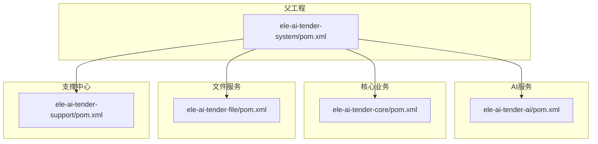
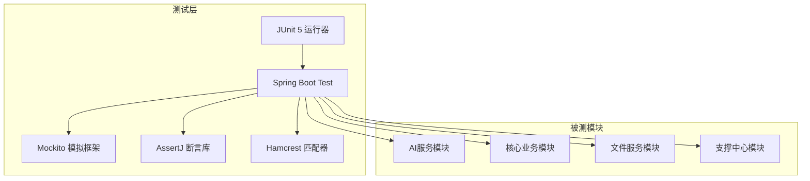
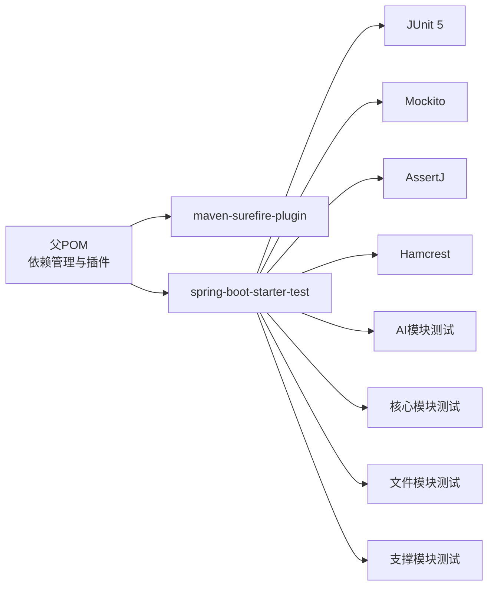

# 单元测试

<cite>
**本文引用的文件**
- [ele-ai-tender-system/pom.xml](file://ele-ai-tender-system/pom.xml)
- [ele-ai-tender-system/ele-ai-tender-ai/pom.xml](file://ele-ai-tender-system/ele-ai-tender-ai/pom.xml)
- [ele-ai-tender-system/ele-ai-tender-core/pom.xml](file://ele-ai-tender-system/ele-ai-tender-core/pom.xml)
- [ele-ai-tender-system/ele-ai-tender-file/pom.xml](file://ele-ai-tender-system/ele-ai-tender-file/pom.xml)
- [ele-ai-tender-system/ele-ai-tender-support/pom.xml](file://ele-ai-tender-system/ele-ai-tender-support/pom.xml)
</cite>

## 目录
1. [简介](#简介)
2. [项目结构](#项目结构)
3. [核心组件](#核心组件)
4. [架构总览](#架构总览)
5. [详细组件分析](#详细组件分析)
6. [依赖分析](#依赖分析)
7. [性能考虑](#性能考虑)
8. [故障排查指南](#故障排查指南)
9. [结论](#结论)
10. [附录](#附录)

## 简介
本文件为“招标文件AI编制系统”的单元测试规范与最佳实践文档，面向Java后端模块。内容覆盖：
- JUnit 5使用规范与最佳实践（测试类组织、命名约定、注解使用）
- Mockito集成与用法（模拟对象创建、行为验证、异常测试）
- 断言库指南（Hamcrest匹配器与AssertJ流式断言）
- 测试数据准备策略（@ExtendWith、@BeforeEach、测试工厂模式）
- 异步代码测试方法（CompletableFuture与响应式编程测试）
- 测试覆盖率要求与质量检查工具集成

## 项目结构
本项目采用多模块Maven工程，各业务子模块均包含独立的测试目录与依赖声明。测试相关依赖通过spring-boot-starter-test引入，统一由父POM管理版本与插件。

图表来源
- [ele-ai-tender-system/pom.xml:1-260](file://ele-ai-tender-system/pom.xml#L1-L260)
- [ele-ai-tender-system/ele-ai-tender-ai/pom.xml:1-129](file://ele-ai-tender-system/ele-ai-tender-ai/pom.xml#L1-L129)
- [ele-ai-tender-system/ele-ai-tender-core/pom.xml:1-129](file://ele-ai-tender-system/ele-ai-tender-core/pom.xml#L1-L129)
- [ele-ai-tender-system/ele-ai-tender-file/pom.xml:1-131](file://ele-ai-tender-system/ele-ai-tender-file/pom.xml#L1-L131)
- [ele-ai-tender-system/ele-ai-tender-support/pom.xml:1-115](file://ele-ai-tender-system/ele-ai-tender-support/pom.xml#L1-L115)

章节来源
- [ele-ai-tender-system/pom.xml:1-260](file://ele-ai-tender-system/pom.xml#L1-L260)

## 核心组件
- 测试框架与运行器
  - 基于JUnit 5与Spring Boot Test，使用maven-surefire-plugin执行测试。
- 依赖注入与扩展点
  - 通过spring-boot-starter-test提供Mockito、AssertJ、Hamcrest等能力。
- 构建与执行
  - 父POM统一管理spring-boot-dependencies与maven-surefire-plugin版本，确保跨模块一致。

章节来源
- [ele-ai-tender-system/pom.xml:225-260](file://ele-ai-tender-system/pom.xml#L225-L260)
- [ele-ai-tender-system/ele-ai-tender-ai/pom.xml:42-47](file://ele-ai-tender-system/ele-ai-tender-ai/pom.xml#L42-L47)
- [ele-ai-tender-system/ele-ai-tender-core/pom.xml:46-51](file://ele-ai-tender-system/ele-ai-tender-core/pom.xml#L46-L51)
- [ele-ai-tender-system/ele-ai-tender-file/pom.xml:42-47](file://ele-ai-tender-system/ele-ai-tender-file/pom.xml#L42-L47)
- [ele-ai-tender-system/ele-ai-tender-support/pom.xml:85-90](file://ele-ai-tender-system/ele-ai-tender-support/pom.xml#L85-L90)

## 架构总览
下图展示测试在模块中的位置与依赖关系，以及测试运行时关键组件的交互。

图表来源
- [ele-ai-tender-system/pom.xml:68-124](file://ele-ai-tender-system/pom.xml#L68-L124)
- [ele-ai-tender-system/ele-ai-tender-ai/pom.xml:42-47](file://ele-ai-tender-system/ele-ai-tender-ai/pom.xml#L42-L47)
- [ele-ai-tender-system/ele-ai-tender-core/pom.xml:46-51](file://ele-ai-tender-system/ele-ai-tender-core/pom.xml#L46-L51)
- [ele-ai-tender-system/ele-ai-tender-file/pom.xml:42-47](file://ele-ai-tender-system/ele-ai-tender-file/pom.xml#L42-L47)
- [ele-ai-tender-system/ele-ai-tender-support/pom.xml:85-90](file://ele-ai-tender-system/ele-ai-tender-support/pom.xml#L85-L90)

## 详细组件分析

### JUnit 5 使用规范与最佳实践
- 测试类组织
  - 按包结构与被测类保持一致，便于定位与维护。
  - 每个业务域或Service/Controller/Processor可对应一个测试类。
- 测试方法命名约定
  - 建议采用“方法名_场景_期望结果”的形式，如“当输入为空时抛出异常”。
- 测试注解使用
  - @Test：定义测试用例。
  - @DisplayName：为测试用例提供可读性强的描述。
  - @ParameterizedTest/@CsvSource/@MethodSource：参数化测试。
  - @RepeatedTest：重复执行同一用例以增强稳定性。
  - @Nested：对复杂测试进行分组。
  - @Disabled：临时禁用不稳定或阻塞的测试。
  - @Tag：为测试打标签，支持选择性执行。
- 生命周期钩子
  - @BeforeEach/@AfterEach：用例级前后置逻辑。
  - @BeforeAll/@AfterAll：类级前后置逻辑。
  - @ExtendWith：注册自定义扩展（如Spring上下文、数据库初始化等）。

章节来源
- [ele-ai-tender-system/pom.xml:225-260](file://ele-ai-tender-system/pom.xml#L225-L260)

### Mockito 集成与使用方法
- 模拟对象创建
  - 使用@MockBean（Spring上下文）或@Mock（纯JUnit环境）创建模拟对象。
  - 使用@Spy对真实对象进行部分模拟。
- 行为配置
  - when(...).thenReturn(...) / thenThrow(...) / doNothing() 等用于设定返回值或异常。
- 行为验证
  - verify(mock, times(n)).method(...) 验证调用次数与参数。
  - verifyNoInteractions(...) 验证无交互。
- 异常测试
  - assertThrows(...) 捕获并校验抛出的异常类型与消息。
- 注意事项
  - 避免过度模拟接口；优先隔离外部依赖（网络、DB、消息队列）。
  - 谨慎使用thenAnswer，仅在需要动态计算返回值时使用。

章节来源
- [ele-ai-tender-system/ele-ai-tender-ai/pom.xml:42-47](file://ele-ai-tender-system/ele-ai-tender-ai/pom.xml#L42-L47)
- [ele-ai-tender-system/ele-ai-tender-core/pom.xml:46-51](file://ele-ai-tender-system/ele-ai-tender-core/pom.xml#L46-L51)
- [ele-ai-tender-system/ele-ai-tender-file/pom.xml:42-47](file://ele-ai-tender-system/ele-ai-tender-file/pom.xml#L42-L47)
- [ele-ai-tender-system/ele-ai-tender-support/pom.xml:85-90](file://ele-ai-tender-system/ele-ai-tender-support/pom.xml#L85-L90)

### 断言库使用指南（Hamcrest 与 AssertJ）
- Hamcrest 匹配器
  - 适用于简洁的条件匹配，如字符串、集合、数值范围等。
  - 适合在复杂条件判断中提升可读性。
- AssertJ 流式断言
  - 提供链式API，语义清晰，错误信息友好。
  - 推荐用于集合、Optional、异常、时间等复杂对象的断言。
- 选择建议
  - 简单场景可用Hamcrest；复杂对象与集合优先使用AssertJ。
  - 在同一项目中保持风格一致，避免混用造成维护成本上升。

章节来源
- [ele-ai-tender-system/pom.xml:68-124](file://ele-ai-tender-system/pom.xml#L68-L124)

### 测试数据准备策略
- @ExtendWith
  - 用于注册自定义扩展，例如加载Spring上下文、初始化测试数据库、清理资源等。
- @BeforeEach
  - 在每个测试方法前执行，适合重置状态、构造轻量测试数据。
- 测试工厂模式
  - 将复杂对象构造封装到工厂方法或Builder中，提高可读性与复用性。
  - 针对领域实体、DTO、请求体等建立专用工厂，减少样板代码。
- 分层策略
  - 单元层：尽量使用内存对象与模拟数据，避免IO。
  - 集成层：结合嵌入式数据库或测试容器，保证数据一致性。

章节来源
- [ele-ai-tender-system/pom.xml:225-260](file://ele-ai-tender-system/pom.xml#L225-L260)

### 异步代码测试方法
- CompletableFuture
  - 使用join()/get()等待完成，或使用@TestInstance(PER_CLASS)配合静态等待。
  - 注意设置合理的超时，避免测试挂起。
- 响应式编程（如WebFlux）
  - 使用StepVerifier进行流式断言，验证onNext/onError/onComplete。
- 线程与并发
  - 使用CountDownLatch或CyclicBarrier协调多个线程的测试时序。
  - 避免在测试中使用全局共享可变状态。

章节来源
- [ele-ai-tender-system/pom.xml:225-260](file://ele-ai-tender-system/pom.xml#L225-L260)

### 测试覆盖率要求与质量检查工具集成
- 覆盖率目标
  - 建议行覆盖率≥80%，分支覆盖率≥70%；核心业务模块可提高阈值。
- 工具集成
  - 使用JaCoCo生成覆盖率报告，并在CI中阻断低覆盖率提交。
- 质量检查
  - 结合静态分析（如SpotBugs、Checkstyle）与单元测试共同保障质量。
- 报告输出
  - 在Maven构建阶段输出HTML与XML报告，便于归档与可视化。

章节来源
- [ele-ai-tender-system/pom.xml:225-260](file://ele-ai-tender-system/pom.xml#L225-L260)

## 依赖分析
- 测试依赖统一来源于spring-boot-starter-test，各模块通过父POM继承。
- maven-surefire-plugin负责发现与执行测试用例。
- 各模块的pom.xml中显式声明了test作用域的spring-boot-starter-test，确保测试依赖仅作用于测试编译与运行。

图表来源
- [ele-ai-tender-system/pom.xml:68-124](file://ele-ai-tender-system/pom.xml#L68-L124)
- [ele-ai-tender-system/pom.xml:225-260](file://ele-ai-tender-system/pom.xml#L225-L260)
- [ele-ai-tender-system/ele-ai-tender-ai/pom.xml:42-47](file://ele-ai-tender-system/ele-ai-tender-ai/pom.xml#L42-L47)
- [ele-ai-tender-system/ele-ai-tender-core/pom.xml:46-51](file://ele-ai-tender-system/ele-ai-tender-core/pom.xml#L46-L51)
- [ele-ai-tender-system/ele-ai-tender-file/pom.xml:42-47](file://ele-ai-tender-system/ele-ai-tender-file/pom.xml#L42-L47)
- [ele-ai-tender-system/ele-ai-tender-support/pom.xml:85-90](file://ele-ai-tender-system/ele-ai-tender-support/pom.xml#L85-L90)

章节来源
- [ele-ai-tender-system/pom.xml:68-124](file://ele-ai-tender-system/pom.xml#L68-L124)
- [ele-ai-tender-system/pom.xml:225-260](file://ele-ai-tender-system/pom.xml#L225-L260)

## 性能考虑
- 控制测试数据规模，避免在单元层进行大数据量处理。
- 合理设置超时与重试，防止外部依赖抖动导致测试不稳定。
- 使用并行执行需谨慎，避免共享状态导致的竞态条件。
- 对耗时操作（如文件解析、模型调用）进行模拟或降级，缩短测试周期。

## 故障排查指南
- 测试无法发现
  - 确认测试类与方法符合JUnit 5命名与注解规范。
  - 检查maven-surefire-plugin版本与配置是否生效。
- 依赖缺失或冲突
  - 核对spring-boot-starter-test是否在模块中声明且scope为test。
  - 检查父POM的dependencyManagement是否覆盖了必要版本。
- 模拟对象未生效
  - 确认使用@MockBean注入到Spring上下文，或在纯JUnit环境下使用@Mock。
  - 检查被模拟的方法是否为public且非final。
- 异步测试超时
  - 增加等待时间或改用更合适的断言方式（如StepVerifier）。
  - 避免在测试中启动不必要的长耗时任务。

章节来源
- [ele-ai-tender-system/pom.xml:225-260](file://ele-ai-tender-system/pom.xml#L225-L260)
- [ele-ai-tender-system/ele-ai-tender-ai/pom.xml:42-47](file://ele-ai-tender-system/ele-ai-tender-ai/pom.xml#L42-L47)
- [ele-ai-tender-system/ele-ai-tender-core/pom.xml:46-51](file://ele-ai-tender-system/ele-ai-tender-core/pom.xml#L46-L51)
- [ele-ai-tender-system/ele-ai-tender-file/pom.xml:42-47](file://ele-ai-tender-system/ele-ai-tender-file/pom.xml#L42-L47)
- [ele-ai-tender-system/ele-ai-tender-support/pom.xml:85-90](file://ele-ai-tender-system/ele-ai-tender-support/pom.xml#L85-L90)

## 结论
通过统一的测试框架与依赖管理、规范的测试编写实践、完善的模拟与断言策略，以及对异步与覆盖率的关注，可有效提升“招标文件AI编制系统”的可维护性与交付质量。建议在CI流水线中固化覆盖率门禁与质量检查，持续改进测试有效性。

## 附录
- 常用命令
  - 执行全部测试：mvn test
  - 跳过测试：mvn package -DskipTests
  - 指定测试类：mvn test -Dtest=YourTestClass
- 参考路径
  - 父POM依赖管理与插件配置：[ele-ai-tender-system/pom.xml](file://ele-ai-tender-system/pom.xml)
  - 各模块测试依赖声明：见各模块pom.xml的test依赖段