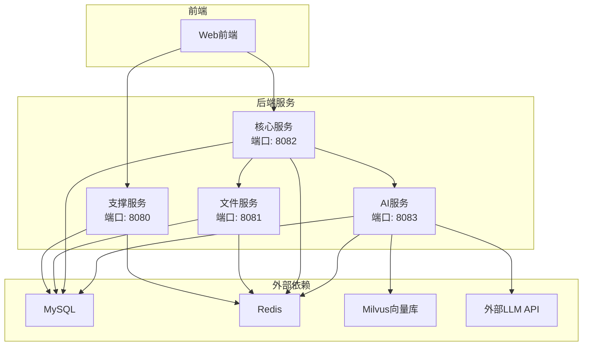
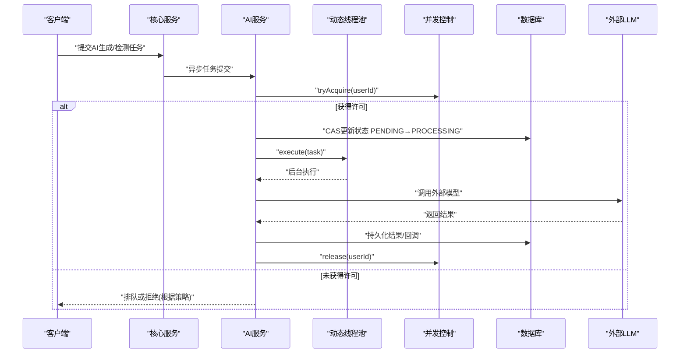
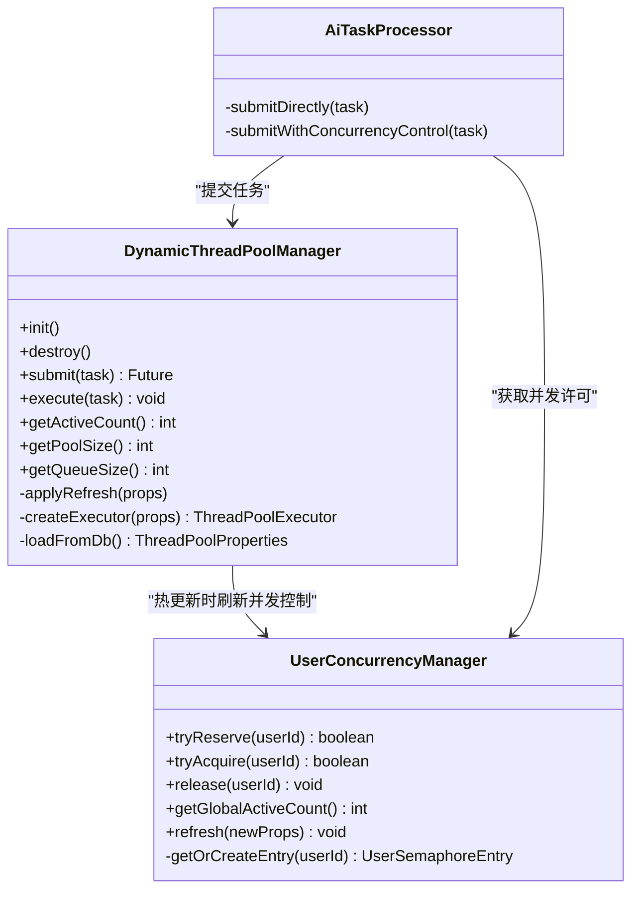
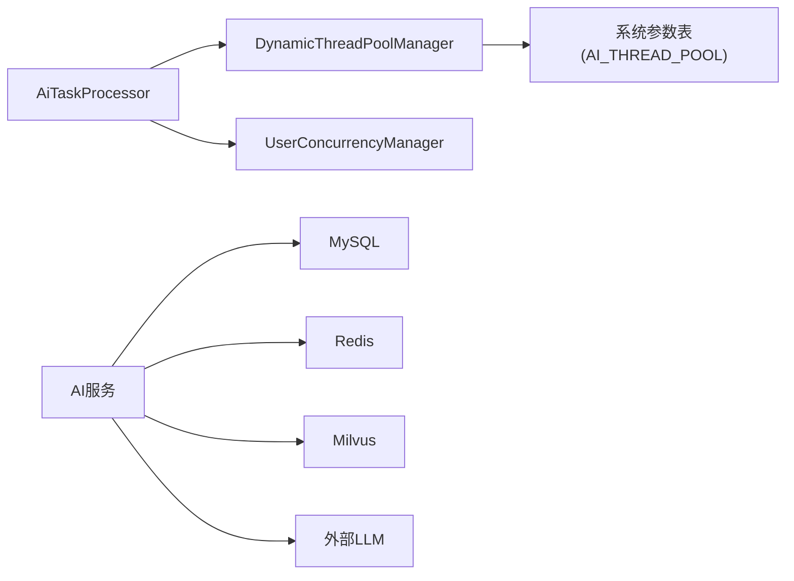

# 性能测试

<cite>
**本文引用的文件**   
- [DynamicThreadPoolManager.java](file://ele-ai-tender-system/ele-ai-tender-ai/src/main/java/com/jy/eleaitender/ai/threadpool/DynamicThreadPoolManager.java)
- [UserConcurrencyManager.java](file://ele-ai-tender-system/ele-ai-tender-ai/src/main/java/com/jy/eleaitender/ai/threadpool/UserConcurrencyManager.java)
- [AiTaskProcessor.java](file://ele-ai-tender-system/ele-ai-tender-ai/src/main/java/com/jy/eleaitender/ai/processor/AiTaskProcessor.java)
- [application.yml（AI服务）](file://ele-ai-tender-system/ele-ai-tender-ai/src/main/resources/application.yml)
- [application.yml（核心服务）](file://ele-ai-tender-system/ele-ai-tender-core/src/main/resources/application.yml)
- [application.yml（文件服务）](file://ele-ai-tender-system/ele-ai-tender-file/src/main/resources/application.yml)
- [application.yml（支撑服务）](file://ele-ai-tender-system/ele-ai-tender-support/src/main/resources/application.yml)
- [ele-ai-tender-ai.yml（OpenAPI）](file://docs/guides/ele-ai-tender-ai.yml)
- [ele-ai-tender-core.yml（OpenAPI）](file://docs/guides/ele-ai-tender-core.yml)
- [ele-ai-tender-file.yml（OpenAPI）](file://docs/guides/ele-ai-tender-file.yml)
- [ele-ai-tender-support.yml（OpenAPI）](file://docs/guides/ele-ai-tender-support.yml)
</cite>

## 目录
1. [简介](#简介)
2. [项目结构](#项目结构)
3. [核心组件](#核心组件)
4. [架构总览](#架构总览)
5. [详细组件分析](#详细组件分析)
6. [依赖分析](#依赖分析)
7. [性能考虑](#性能考虑)
8. [故障排查指南](#故障排查指南)
9. [结论](#结论)
10. [附录](#附录)

## 简介
本指导面向“招标文件AI编制系统”的性能测试与优化，覆盖负载测试方法、基准指标与阈值、数据库性能测试、AI服务性能测试、内存泄漏与CPU分析工具使用、结果分析与优化建议，以及持续性能监控集成方案。文档结合仓库中AI任务处理线程池与并发控制、各服务配置与对外接口定义，给出可落地的测试策略与实践路径。

## 项目结构
系统采用多模块微服务形态：
- AI服务：提供AI对话、文本优化、检测等能力，内置动态线程池与用户级并发控制。
- 核心服务：项目管理、需求、评审项、文档集成与导出等业务编排。
- 文件服务：大文件上传下载、预览与存储。
- 支撑服务：认证、菜单、模型路由、访问日志等通用能力。

图表来源
- [application.yml（AI服务）:1-72](file://ele-ai-tender-system/ele-ai-tender-ai/src/main/resources/application.yml#L1-L72)
- [application.yml（核心服务）:1-68](file://ele-ai-tender-system/ele-ai-tender-core/src/main/resources/application.yml#L1-L68)
- [application.yml（文件服务）:1-63](file://ele-ai-tender-system/ele-ai-tender-file/src/main/resources/application.yml#L1-L63)
- [application.yml（支撑服务）:1-68](file://ele-ai-tender-system/ele-ai-tender-support/src/main/resources/application.yml#L1-L68)

章节来源
- [application.yml（AI服务）:1-72](file://ele-ai-tender-system/ele-ai-tender-ai/src/main/resources/application.yml#L1-L72)
- [application.yml（核心服务）:1-68](file://ele-ai-tender-system/ele-ai-tender-core/src/main/resources/application.yml#L1-L68)
- [application.yml（文件服务）:1-63](file://ele-ai-tender-system/ele-ai-tender-file/src/main/resources/application.yml#L1-L63)
- [application.yml（支撑服务）:1-68](file://ele-ai-tender-system/ele-ai-tender-support/src/main/resources/application.yml#L1-L68)

## 核心组件
- 动态线程池管理器：从数据库参数组加载线程池配置，定时轮询变更并热更新；暴露活跃数、队列长度等观测指标。
- 用户级并发控制：基于信号量实现全局与用户维度的并发上限控制，支持热更新且保持当前活跃并发不失效。
- AI任务处理器：在提交前进行并发许可获取与状态CAS，避免并发弹跳，保证一致性。

章节来源
- [DynamicThreadPoolManager.java:1-190](file://ele-ai-tender-system/ele-ai-tender-ai/src/main/java/com/jy/eleaitender/ai/threadpool/DynamicThreadPoolManager.java#L1-L190)
- [UserConcurrencyManager.java:1-131](file://ele-ai-tender-system/ele-ai-tender-ai/src/main/java/com/jy/eleaitender/ai/threadpool/UserConcurrencyManager.java#L1-L131)
- [AiTaskProcessor.java:75-111](file://ele-ai-tender-system/ele-ai-tender-ai/src/main/java/com/jy/eleaitender/ai/processor/AiTaskProcessor.java#L75-L111)

## 架构总览
下图展示AI任务从入口到执行的关键流程，包括并发控制、线程池调度与外部调用。

图表来源
- [AiTaskProcessor.java:75-111](file://ele-ai-tender-system/ele-ai-tender-ai/src/main/java/com/jy/eleaitender/ai/processor/AiTaskProcessor.java#L75-L111)
- [UserConcurrencyManager.java:57-88](file://ele-ai-tender-system/ele-ai-tender-ai/src/main/java/com/jy/eleaitender/ai/threadpool/UserConcurrencyManager.java#L57-L88)
- [DynamicThreadPoolManager.java:147-161](file://ele-ai-tender-system/ele-ai-tender-ai/src/main/java/com/jy/eleaitender/ai/threadpool/DynamicThreadPoolManager.java#L147-L161)

## 详细组件分析

### 动态线程池与并发控制类图

图表来源
- [DynamicThreadPoolManager.java:1-190](file://ele-ai-tender-system/ele-ai-tender-ai/src/main/java/com/jy/eleaitender/ai/threadpool/DynamicThreadPoolManager.java#L1-L190)
- [UserConcurrencyManager.java:1-131](file://ele-ai-tender-system/ele-ai-tender-ai/src/main/java/com/jy/eleaitender/ai/threadpool/UserConcurrencyManager.java#L1-L131)
- [AiTaskProcessor.java:75-111](file://ele-ai-tender-system/ele-ai-tender-ai/src/main/java/com/jy/eleaitender/ai/processor/AiTaskProcessor.java#L75-L111)

章节来源
- [DynamicThreadPoolManager.java:1-190](file://ele-ai-tender-system/ele-ai-tender-ai/src/main/java/com/jy/eleaitender/ai/threadpool/DynamicThreadPoolManager.java#L1-L190)
- [UserConcurrencyManager.java:1-131](file://ele-ai-tender-system/ele-ai-tender-ai/src/main/java/com/jy/eleaitender/ai/threadpool/UserConcurrencyManager.java#L1-L131)
- [AiTaskProcessor.java:75-111](file://ele-ai-tender-system/ele-ai-tender-ai/src/main/java/com/jy/eleaitender/ai/processor/AiTaskProcessor.java#L75-L111)

### 负载测试方法与场景设计
- 工具选择
  - JMeter：适合HTTP/SSE接口压测、CSV数据驱动、聚合报告与Jenkins集成。
  - Gatling：适合高并发场景、细粒度指标采集与代码化脚本。
- 关键接口（来自OpenAPI）
  - AI服务：对话SSE、文本优化SSE、同步建议、检测启动/结果/确认、知识文档上传等。
  - 核心服务：任务查询/重试/跳过、检测提交/进度/报告、文档集成/预览/导出、项目/需求/评审项管理等。
  - 文件服务：上传/下载/信息/删除。
  - 支撑服务：登录、菜单、消息、模型配置与路由等。
- 典型场景
  - 基线场景：单用户逐步加压，建立RT/P95/P99、吞吐、错误率基线。
  - 峰值场景：模拟业务高峰的突发流量，观察线程池与队列堆积情况。
  - 稳定性场景：长时间运行（如4-8小时），关注内存增长与GC行为。
  - 降级场景：外部LLM限流/超时，验证重试与熔断策略。
- 并发与数据准备
  - 使用CSV驱动不同userId、projectId、content大小，覆盖小/中/大文件与长文本。
  - 对SSE接口需按协议录制与回放，确保连接复用与心跳。
- 指标采集
  - 应用层：QPS、RT分位、错误率、线程池活跃/队列长度、并发许可占用。
  - 系统层：CPU、内存、磁盘IO、网络IO、上下文切换。
  - 中间件：MySQL慢查询、连接池等待、Redis命中率、Milvus向量检索耗时。
  - 外部依赖：LLM调用成功率、首包时间、端到端延迟。

章节来源
- [ele-ai-tender-ai.yml（OpenAPI）:1-255](file://docs/guides/ele-ai-tender-ai.yml#L1-L255)
- [ele-ai-tender-core.yml（OpenAPI）:1-800](file://docs/guides/ele-ai-tender-core.yml#L1-L800)
- [ele-ai-tender-file.yml（OpenAPI）:1-62](file://docs/guides/ele-ai-tender-file.yml#L1-L62)
- [ele-ai-tender-support.yml（OpenAPI）:1-800](file://docs/guides/ele-ai-tender-support.yml#L1-L800)

### 性能基准与阈值设定
- 基准指标
  - 响应时间：P95≤X ms，P99≤Y ms（按接口类型区分）。
  - 吞吐量：稳定态下QPS≥Z，抖动不超过±10%。
  - 错误率：<0.1%（不含预期业务错误）。
  - 资源水位：CPU<75%，堆内存使用率<70%，Full GC次数为0或极低。
- 阈值来源建议
  - 以基线场景的稳定值作为阈值，结合SLA目标与容量规划。
  - 针对AI任务，设置线程池活跃/队列长度告警阈值，防止背压失控。
- 回归判定
  - 任何版本发布后，回归基线场景，若关键指标劣化超过阈值则阻断发布。

[本节为通用方法论，无需源码引用]

### 数据库性能测试
- 测试要点
  - 慢查询识别：开启慢查询日志，定位热点SQL与缺失索引。
  - 连接池调优：根据并发与事务时长调整最大连接数与等待超时。
  - 读写分离与缓存：热点读走缓存，写放大场景评估批量与合并写入。
- 参考配置位置
  - MySQL连接串、字符集与时区、MyBatis-Plus全局配置。
  - Redis主机、端口、密码、库号与超时。
- 建议步骤
  - 使用sysbench或业务数据构造压测数据集。
  - 通过EXPLAIN分析关键查询，补充复合索引与覆盖索引。
  - 监控连接池等待与锁等待，必要时拆分事务或引入批处理。

章节来源
- [application.yml（AI服务）:16-27](file://ele-ai-tender-system/ele-ai-tender-ai/src/main/resources/application.yml#L16-L27)
- [application.yml（核心服务）:16-27](file://ele-ai-tender-system/ele-ai-tender-core/src/main/resources/application.yml#L16-L27)
- [application.yml（文件服务）:20-31](file://ele-ai-tender-system/ele-ai-tender-file/src/main/resources/application.yml#L20-L31)
- [application.yml（支撑服务）:16-27](file://ele-ai-tender-system/ele-ai-tender-support/src/main/resources/application.yml#L16-L27)

### AI服务性能测试
- 大文件处理
  - 文件服务最大请求体与文件大小限制需与压测数据匹配。
  - 上传/下载链路端到端RT与吞吐是重点，注意分片与断点续传。
- 并发AI调用
  - 利用动态线程池与并发控制，调节全局与用户维度并发上限。
  - 关注外部LLM限流与超时，合理设置重试与退避。
- 响应时间优化
  - 对SSE接口优化首包时间与增量传输。
  - 减少不必要的序列化与对象创建，预热模型客户端。

章节来源
- [application.yml（文件服务）:16-19](file://ele-ai-tender-system/ele-ai-tender-file/src/main/resources/application.yml#L16-L19)
- [DynamicThreadPoolManager.java:147-161](file://ele-ai-tender-system/ele-ai-tender-ai/src/main/java/com/jy/eleaitender/ai/threadpool/DynamicThreadPoolManager.java#L147-L161)
- [UserConcurrencyManager.java:105-116](file://ele-ai-tender-system/ele-ai-tender-ai/src/main/java/com/jy/eleaitender/ai/threadpool/UserConcurrencyManager.java#L105-L116)

### 内存泄漏检测与CPU使用率分析
- 内存泄漏检测
  - 压测期间定期dump堆，使用MAT或JProfiler分析大对象与持有链。
  - 关注线程池任务对象、SSE会话、临时大字符串与字节数组。
- CPU使用率分析
  - 使用top/htop或jstack定位热点线程，结合火焰图分析热点方法。
  - 对AI任务中的解析、正则匹配、JSON序列化进行热点优化。
- 常用命令与工具
  - jstat、jmap、jcmd、async-profiler、Arthas。

[本节为通用方法论，无需源码引用]

### 测试结果分析与优化建议
- 分析维度
  - 吞吐-延迟曲线：寻找拐点，确定最佳并发度。
  - 资源瓶颈：CPU、内存、IO、网络、外部依赖。
  - 队列堆积：线程池队列长度持续增长说明下游不可用或处理能力不足。
- 优化建议
  - 调整线程池核心/最大线程数与队列容量，平衡吞吐与延迟。
  - 增加并发控制的用户级上限，避免个别用户独占资源。
  - 对热点SQL加索引、改写复杂查询、引入缓存。
  - 对大文件上传启用分片与并行校验，降低单次请求体积。

章节来源
- [DynamicThreadPoolManager.java:113-145](file://ele-ai-tender-system/ele-ai-tender-ai/src/main/java/com/jy/eleaitender/ai/threadpool/DynamicThreadPoolManager.java#L113-L145)
- [UserConcurrencyManager.java:105-116](file://ele-ai-tender-system/ele-ai-tender-ai/src/main/java/com/jy/eleaitender/ai/threadpool/UserConcurrencyManager.java#L105-L116)

### 持续性能监控集成方案
- 指标埋点
  - 暴露线程池活跃数、队列长度、并发许可占用、任务成功/失败计数。
  - 记录接口级RT分位、错误码分布、外部调用耗时。
- 可视化与告警
  - 将指标接入Prometheus+Grafana，设置阈值告警（如队列长度>阈值、P99>阈值）。
  - 结合日志traceId串联全链路，便于问题定位。
- CI/CD集成
  - 在流水线中加入性能回归用例，失败阻断发布。
  - 自动生成报告并与历史对比，趋势预警。

[本节为通用方法论，无需源码引用]

## 依赖分析
- 组件耦合
  - AI任务处理器依赖动态线程池与并发控制，二者通过配置中心（数据库参数）解耦。
  - 各服务共享统一的数据源与Redis配置，便于集中监控与容量规划。
- 外部依赖
  - 外部LLMAPI：影响端到端延迟与可用性，需在压测中模拟异常与限流。
  - Milvus向量库：用于知识检索，需关注向量相似度计算耗时。

图表来源
- [AiTaskProcessor.java:75-111](file://ele-ai-tender-system/ele-ai-tender-ai/src/main/java/com/jy/eleaitender/ai/processor/AiTaskProcessor.java#L75-L111)
- [DynamicThreadPoolManager.java:166-187](file://ele-ai-tender-system/ele-ai-tender-ai/src/main/java/com/jy/eleaitender/ai/threadpool/DynamicThreadPoolManager.java#L166-L187)
- [application.yml（AI服务）:16-54](file://ele-ai-tender-system/ele-ai-tender-ai/src/main/resources/application.yml#L16-L54)

章节来源
- [AiTaskProcessor.java:75-111](file://ele-ai-tender-system/ele-ai-tender-ai/src/main/java/com/jy/eleaitender/ai/processor/AiTaskProcessor.java#L75-L111)
- [DynamicThreadPoolManager.java:166-187](file://ele-ai-tender-system/ele-ai-tender-ai/src/main/java/com/jy/eleaitender/ai/threadpool/DynamicThreadPoolManager.java#L166-L187)
- [application.yml（AI服务）:16-54](file://ele-ai-tender-system/ele-ai-tender-ai/src/main/resources/application.yml#L16-L54)

## 性能考虑
- 线程池与并发
  - 根据业务特征调整core/max/queue，避免队列过长导致延迟飙升。
  - 用户级并发上限保护单个用户占满全局资源。
- 外部依赖容错
  - 对LLM调用设置超时、重试与熔断，避免雪崩。
- 大文件与SSE
  - 大文件分片上传，SSE首包快速返回，增量推送。
- 数据库与缓存
  - 热点读入缓存，写操作批量合并，避免频繁小事务。

[本节为通用方法论，无需源码引用]

## 故障排查指南
- 常见问题
  - 任务堆积：检查线程池队列长度与活跃数，确认下游是否限流。
  - 并发受限：查看用户级与全局并发许可占用，排查个别用户异常。
  - 外部调用失败：核对LLM密钥、BaseURL与网络连通性。
- 定位手段
  - 通过traceId关联日志，定位具体任务链路。
  - 抓取线程快照与堆转储，分析阻塞点与大对象。
  - 检查数据库慢查询与锁等待，优化SQL与索引。

章节来源
- [DynamicThreadPoolManager.java:98-108](file://ele-ai-tender-system/ele-ai-tender-ai/src/main/java/com/jy/eleaitender/ai/threadpool/DynamicThreadPoolManager.java#L98-L108)
- [UserConcurrencyManager.java:93-99](file://ele-ai-tender-system/ele-ai-tender-ai/src/main/java/com/jy/eleaitender/ai/threadpool/UserConcurrencyManager.java#L93-L99)

## 结论
通过合理的负载测试设计与持续监控，结合动态线程池与并发控制的弹性调节，可有效保障系统在高峰期的稳定性与性能表现。建议在CI/CD中固化性能回归，形成“基线—回归—告警—优化”的闭环。

[本节为总结性内容，无需源码引用]

## 附录
- 压测脚本模板（示例思路）
  - JMeter：HTTP请求采样器+SSE监听器+CSV数据文件+聚合报告。
  - Gatling：Scala脚本定义用户行为、并发阶梯与指标断言。
- 关键指标看板
  - QPS、RT分位、错误率、线程池活跃/队列长度、并发许可占用、外部调用耗时。
- 参考配置键位
  - 线程池参数组：AI_THREAD_POOL（全局/用户并发与队列上限、任务超时）。
  - 文件服务：multipart大小限制、存储路径与允许类型。
  - 外部依赖：Redis/Milvus/LLM连接与超时。

章节来源
- [DynamicThreadPoolManager.java:166-187](file://ele-ai-tender-system/ele-ai-tender-ai/src/main/java/com/jy/eleaitender/ai/threadpool/DynamicThreadPoolManager.java#L166-L187)
- [application.yml（文件服务）:16-19](file://ele-ai-tender-system/ele-ai-tender-file/src/main/resources/application.yml#L16-L19)
- [application.yml（AI服务）:21-54](file://ele-ai-tender-system/ele-ai-tender-ai/src/main/resources/application.yml#L21-L54)