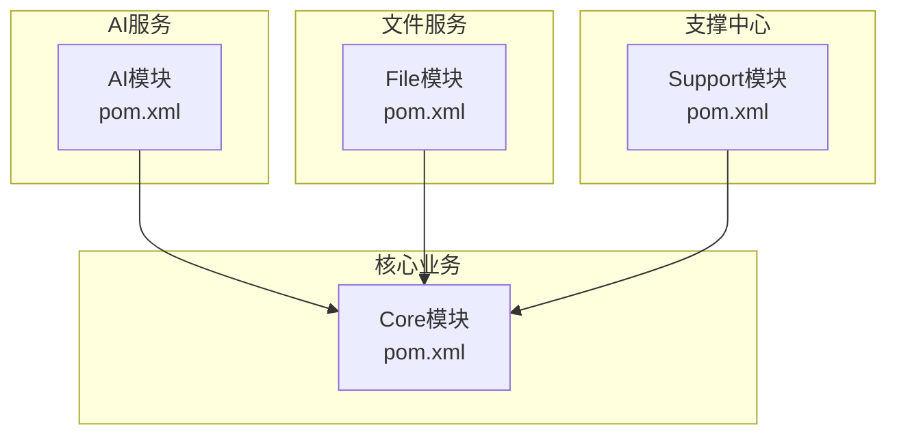
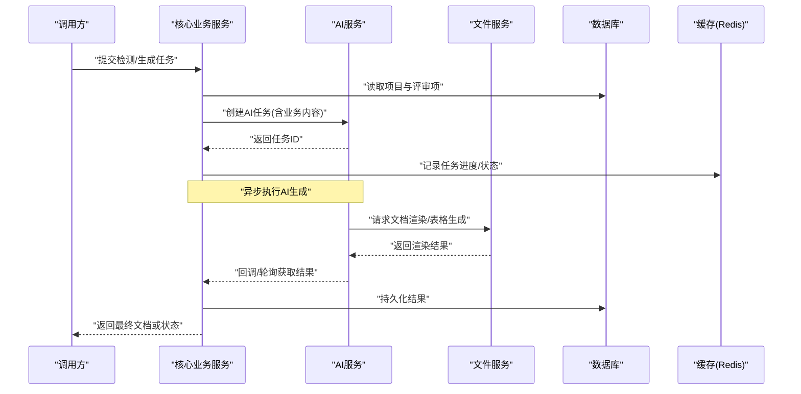
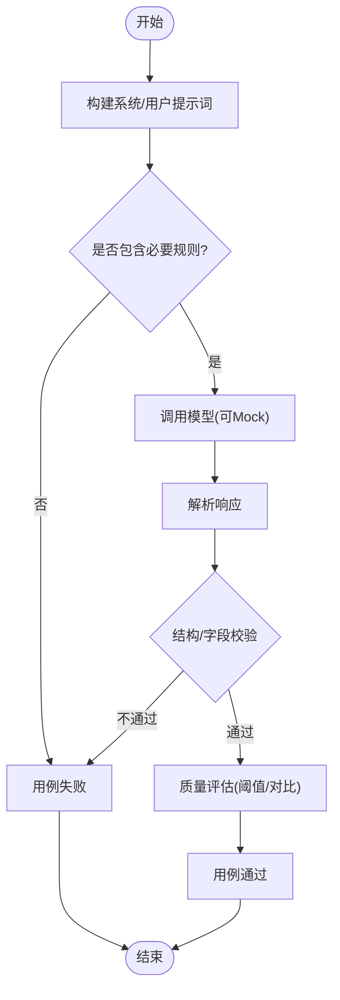
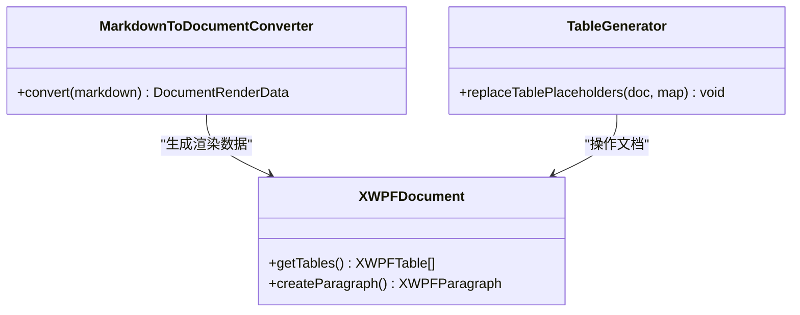
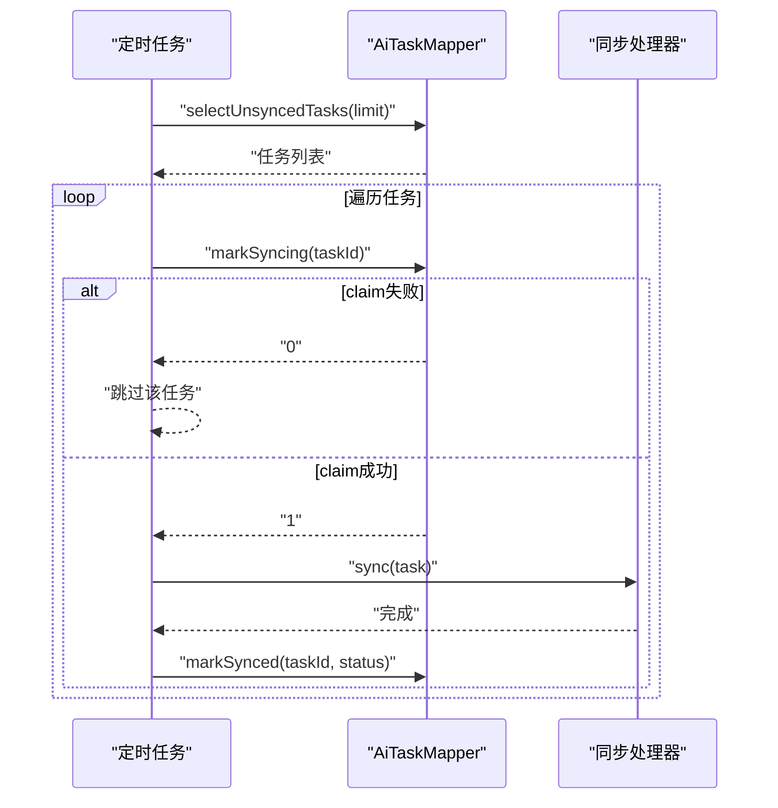
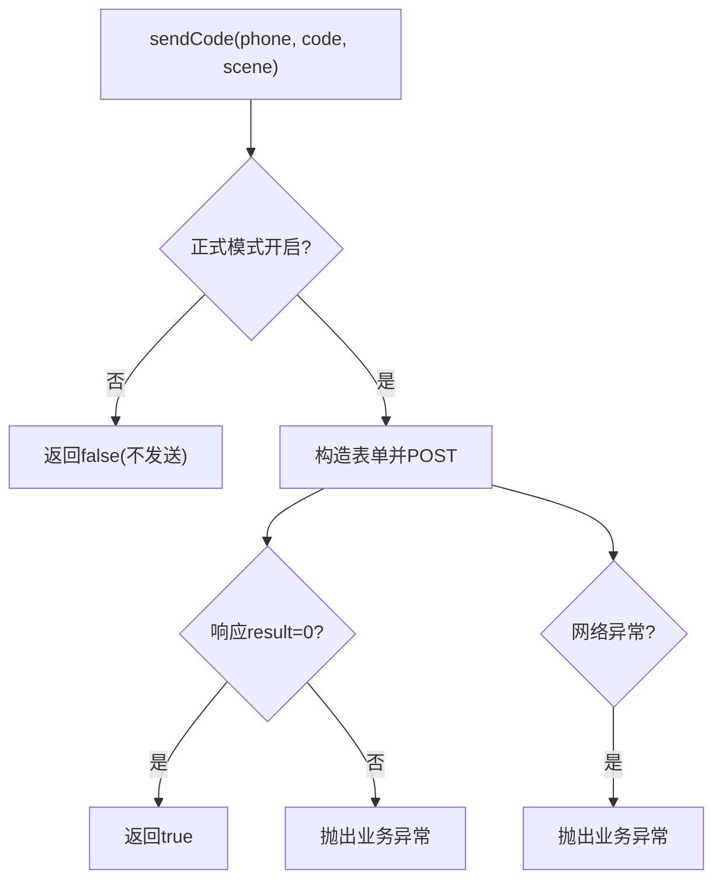
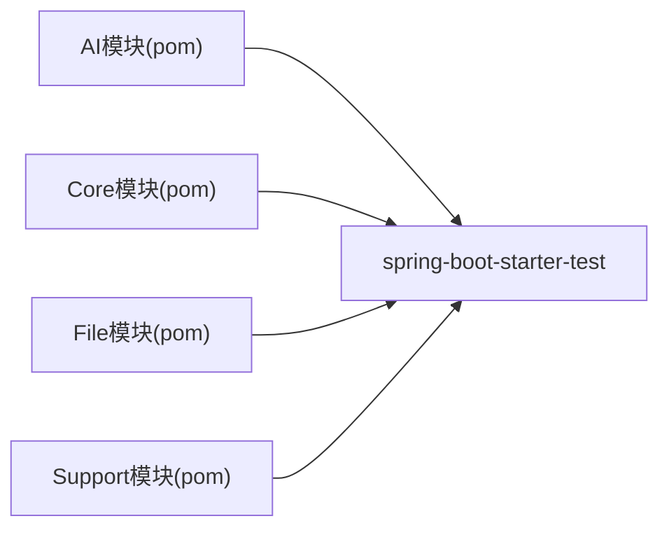

# 测试策略

<cite>
**本文引用的文件**   
- [ele-ai-tender-ai/pom.xml](file://ele-ai-tender-system/ele-ai-tender-ai/pom.xml)
- [ele-ai-tender-core/pom.xml](file://ele-ai-tender-system/ele-ai-tender-core/pom.xml)
- [ele-ai-tender-file/pom.xml](file://ele-ai-tender-system/ele-ai-tender-file/pom.xml)
- [ele-ai-tender-support/pom.xml](file://ele-ai-tender-system/ele-ai-tender-support/pom.xml)
- [AiChatServiceImplTest.java](file://ele-ai-tender-system/ele-ai-tender-ai/src/test/java/com/jy/eleaitender/ai/service/impl/AiChatServiceImplTest.java)
- [RequirementPromptTemplatesTest.java](file://ele-ai-tender-system/ele-ai-tender-ai/src/test/java/com/jy/eleaitender/ai/processor/prompt/RequirementPromptTemplatesTest.java)
- [DetectionServiceImplTest.java](file://ele-ai-tender-system/ele-ai-tender-core/src/test/java/com/jy/eleaitender/core/service/impl/DetectionServiceImplTest.java)
- [AiTaskResultSyncSchedulerTest.java](file://ele-ai-tender-system/ele-ai-tender-core/src/test/java/com/jy/eleaitender/core/scheduler/AiTaskResultSyncSchedulerTest.java)
- [MarkdownToDocumentConverterTest.java](file://ele-ai-tender-system/ele-ai-tender-file/src/test/java/com/jy/eleaitender/file/engine/MarkdownToDocumentConverterTest.java)
- [TableGeneratorTest.java](file://ele-ai-tender-system/ele-ai-tender-file/src/test/java/com/jy/eleaitender/file/engine/TableGeneratorTest.java)
- [SmsGatewayClientTest.java](file://ele-ai-tender-system/ele-ai-tender-support/src/test/java/com/jy/eleaitender/support/service/SmsGatewayClientTest.java)
- [SmsServiceImplTest.java](file://ele-ai-tender-system/ele-ai-tender-support/src/test/java/com/jy/eleaitender/support/service/impl/SmsServiceImplTest.java)
</cite>

## 目录
1. [引言](#引言)
2. [项目结构](#项目结构)
3. [核心组件](#核心组件)
4. [架构总览](#架构总览)
5. [详细组件分析](#详细组件分析)
6. [依赖分析](#依赖分析)
7. [性能考虑](#性能考虑)
8. [故障排查指南](#故障排查指南)
9. [结论](#结论)
10. [附录](#附录)

## 引言
本测试策略面向“招标文件AI编制系统”，覆盖单元测试、集成测试、端到端测试、AI功能测试与性能测试，并给出覆盖率要求、测试数据管理、环境配置以及CI/CD流水线集成与报告规范。目标是在保证质量的前提下提升交付效率，确保AI生成内容、文档处理与外部服务交互的稳定性与可观测性。

## 项目结构
后端采用多模块Maven工程，按业务域划分：
- AI服务（模型接入、知识库、检测）
- 核心业务（项目、任务调度、状态机）
- 文件服务（文档解析、模板渲染、表格生成）
- 支撑中心（认证、短信、系统参数等）

各模块均包含test源码目录，使用JUnit 5与Mockito进行单测；部分模块引入spring-boot-starter-test以支持Spring上下文与Web层测试。

图表来源
- [ele-ai-tender-ai/pom.xml:1-129](file://ele-ai-tender-system/ele-ai-tender-ai/pom.xml#L1-L129)
- [ele-ai-tender-core/pom.xml:1-125](file://ele-ai-tender-system/ele-ai-tender-core/pom.xml#L1-L125)
- [ele-ai-tender-file/pom.xml:1-131](file://ele-ai-tender-system/ele-ai-tender-file/pom.xml#L1-L131)
- [ele-ai-tender-support/pom.xml:1-115](file://ele-ai-tender-system/ele-ai-tender-support/pom.xml#L1-L115)

章节来源
- [ele-ai-tender-ai/pom.xml:1-129](file://ele-ai-tender-system/ele-ai-tender-ai/pom.xml#L1-L129)
- [ele-ai-tender-core/pom.xml:1-125](file://ele-ai-tender-system/ele-ai-tender-core/pom.xml#L1-L125)
- [ele-ai-tender-file/pom.xml:1-131](file://ele-ai-tender-system/ele-ai-tender-file/pom.xml#L1-L131)
- [ele-ai-tender-support/pom.xml:1-115](file://ele-ai-tender-system/ele-ai-tender-support/pom.xml#L1-L115)

## 核心组件
围绕AI能力、文档生成与外部服务调用，现有测试覆盖了以下关键路径：
- AI提示词构建与模板校验：验证不同模式下的用户提示词结构与占位符标记
- 检测流程编排：基于业务内容组装任务参数，避免误用已生成文件
- 定时同步任务：幂等性与失败重试边界条件
- Markdown到Word转换：标题、段落、列表、引用、代码块、表格及混合内容的正确渲染
- 表格占位符替换：在Word中插入结构化表格并清理占位符
- 短信网关客户端：表单构造、响应解析与异常处理
- 短信服务实现：Redis限流、场景化Key、持久化与回退逻辑

章节来源
- [AiChatServiceImplTest.java:1-52](file://ele-ai-tender-system/ele-ai-tender-ai/src/test/java/com/jy/eleaitender/ai/service/impl/AiChatServiceImplTest.java#L1-L52)
- [RequirementPromptTemplatesTest.java:1-70](file://ele-ai-tender-system/ele-ai-tender-ai/src/test/java/com/jy/eleaitender/ai/processor/prompt/RequirementPromptTemplatesTest.java#L1-L70)
- [DetectionServiceImplTest.java:1-133](file://ele-ai-tender-system/ele-ai-tender-core/src/test/java/com/jy/eleaitender/core/service/impl/DetectionServiceImplTest.java#L1-L133)
- [AiTaskResultSyncSchedulerTest.java:1-59](file://ele-ai-tender-system/ele-ai-tender-core/src/test/java/com/jy/eleaitender/core/scheduler/AiTaskResultSyncSchedulerTest.java#L1-L59)
- [MarkdownToDocumentConverterTest.java:1-565](file://ele-ai-tender-system/ele-ai-tender-file/src/test/java/com/jy/eleaitender/file/engine/MarkdownToDocumentConverterTest.java#L1-L565)
- [TableGeneratorTest.java:1-48](file://ele-ai-tender-system/ele-ai-tender-file/src/test/java/com/jy/eleaitender/file/engine/TableGeneratorTest.java#L1-L48)
- [SmsGatewayClientTest.java:1-118](file://ele-ai-tender-system/ele-ai-tender-support/src/test/java/com/jy/eleaitender/support/service/SmsGatewayClientTest.java#L1-L118)
- [SmsServiceImplTest.java:1-123](file://ele-ai-tender-system/ele-ai-tender-support/src/test/java/com/jy/eleaitender/support/service/impl/SmsServiceImplTest.java#L1-L123)

## 架构总览
下图展示AI生成与文档渲染的关键调用链，便于理解测试应覆盖的边界与交互点。

图表来源
- [DetectionServiceImplTest.java:1-133](file://ele-ai-tender-system/ele-ai-tender-core/src/test/java/com/jy/eleaitender/core/service/impl/DetectionServiceImplTest.java#L1-L133)
- [MarkdownToDocumentConverterTest.java:1-565](file://ele-ai-tender-system/ele-ai-tender-file/src/test/java/com/jy/eleaitender/file/engine/MarkdownToDocumentConverterTest.java#L1-L565)
- [TableGeneratorTest.java:1-48](file://ele-ai-tender-system/ele-ai-tender-file/src/test/java/com/jy/eleaitender/file/engine/TableGeneratorTest.java#L1-L48)

## 详细组件分析

### 单元测试编写规范（JUnit 5 + Mockito + 断言库）
- 框架与依赖
  - 统一使用JUnit 5组织用例，结合@ExtendWith(MockitoExtension.class)启用Mockito
  - 断言优先使用AssertJ风格（assertThat），可读性强且链式表达清晰
  - 对HTTP客户端、Redis、Mapper等外部依赖通过Mock隔离
- 命名与结构
  - 类名以被测类名+Test结尾；方法名描述行为与预期结果
  - 使用@Test标签，必要时配合@DisplayName增强可读性
- Mock最佳实践
  - 使用@Mock声明依赖，@InjectMocks注入被测对象
  - 对返回值使用when(...).thenReturn(...)，对异常使用thenThrow(...)
  - 使用ArgumentCaptor捕获入参，验证复杂对象构造是否正确
- 断言要点
  - 不仅断言返回值，还要断言副作用（如Mapper/Redis调用次数与参数）
  - 对集合、字符串片段、枚举值进行细粒度断言，避免模糊断言

章节来源
- [DetectionServiceImplTest.java:1-133](file://ele-ai-tender-system/ele-ai-tender-core/src/test/java/com/jy/eleaitender/core/service/impl/DetectionServiceImplTest.java#L1-L133)
- [SmsServiceImplTest.java:1-123](file://ele-ai-tender-system/ele-ai-tender-support/src/test/java/com/jy/eleaitender/support/service/impl/SmsServiceImplTest.java#L1-L123)
- [SmsGatewayClientTest.java:1-118](file://ele-ai-tender-system/ele-ai-tender-support/src/test/java/com/jy/eleaitender/support/service/SmsGatewayClientTest.java#L1-L118)

### 集成测试策略（数据库、外部服务、端到端）
- 数据库测试
  - 针对Mapper与事务边界，建议采用内存数据库或测试专用Schema，并在用例前后进行数据准备与清理
  - 对分页、批量更新、并发claim等场景需补充用例
- 外部服务模拟
  - 使用Mock替代第三方API（如短信网关、向量数据库、AI模型）
  - 对网络异常、超时、非法响应进行健壮性验证
- 端到端场景
  - 从前端发起请求，贯穿Controller→Service→Mapper/Redis→外部服务→返回结果的全链路
  - 建议使用@SpringBootTest启动最小上下文，仅加载必要Bean

章节来源
- [SmsGatewayClientTest.java:1-118](file://ele-ai-tender-system/ele-ai-tender-support/src/test/java/com/jy/eleaitender/support/service/SmsGatewayClientTest.java#L1-L118)
- [SmsServiceImplTest.java:1-123](file://ele-ai-tender-system/ele-ai-tender-support/src/test/java/com/jy/eleaitender/support/service/impl/SmsServiceImplTest.java#L1-L123)

### AI功能测试方法（提示词、模型响应、质量评估）
- 提示词测试
  - 验证系统提示词是否包含必要的业务规则、标准与约束
  - 验证用户提示词在不同模式下（如替换模式开关）的结构与占位符
- 模型响应验证
  - 对输出结构进行JSON Schema或正则校验
  - 对关键指标（如评分权重、资质门槛）进行范围与一致性检查
- 质量评估
  - 建立回归样本集，对比历史版本输出差异
  - 对敏感字段进行白名单/黑名单校验

章节来源
- [RequirementPromptTemplatesTest.java:1-70](file://ele-ai-tender-system/ele-ai-tender-ai/src/test/java/com/jy/eleaitender/ai/processor/prompt/RequirementPromptTemplatesTest.java#L1-L70)
- [AiChatServiceImplTest.java:1-52](file://ele-ai-tender-system/ele-ai-tender-ai/src/test/java/com/jy/eleaitender/ai/service/impl/AiChatServiceImplTest.java#L1-L52)

### 文档处理与渲染测试（Markdown→Word、表格生成）
- 标题、段落、行内格式、列表、引用、代码块、表格与混合内容
- 合并单元格与不规则表格的列对齐保护
- Word占位符替换为真实表格，并确保占位符被清理

图表来源
- [MarkdownToDocumentConverterTest.java:1-565](file://ele-ai-tender-system/ele-ai-tender-file/src/test/java/com/jy/eleaitender/file/engine/MarkdownToDocumentConverterTest.java#L1-L565)
- [TableGeneratorTest.java:1-48](file://ele-ai-tender-system/ele-ai-tender-file/src/test/java/com/jy/eleaitender/file/engine/TableGeneratorTest.java#L1-L48)

章节来源
- [MarkdownToDocumentConverterTest.java:1-565](file://ele-ai-tender-system/ele-ai-tender-file/src/test/java/com/jy/eleaitender/file/engine/MarkdownToDocumentConverterTest.java#L1-L565)
- [TableGeneratorTest.java:1-48](file://ele-ai-tender-system/ele-ai-tender-file/src/test/java/com/jy/eleaitender/file/engine/TableGeneratorTest.java#L1-L48)

### 任务调度与幂等性测试
- 未同步任务选择与claim机制
- claim失败时不应触发后续处理与状态更新
- claim成功后才执行同步并标记成功

图表来源
- [AiTaskResultSyncSchedulerTest.java:1-59](file://ele-ai-tender-system/ele-ai-tender-core/src/test/java/com/jy/eleaitender/core/scheduler/AiTaskResultSyncSchedulerTest.java#L1-L59)

章节来源
- [AiTaskResultSyncSchedulerTest.java:1-59](file://ele-ai-tender-system/ele-ai-tender-core/src/test/java/com/jy/eleaitender/core/scheduler/AiTaskResultSyncSchedulerTest.java#L1-L59)

### 外部服务交互测试（短信网关）
- 正式模式开关控制是否真正调用网关
- 表单字段完整性与Content-Type校验
- 响应解析容错（包含等号的值）
- 网络异常与错误码的业务异常抛出

图表来源
- [SmsGatewayClientTest.java:1-118](file://ele-ai-tender-system/ele-ai-tender-support/src/test/java/com/jy/eleaitender/support/service/SmsGatewayClientTest.java#L1-L118)

章节来源
- [SmsGatewayClientTest.java:1-118](file://ele-ai-tender-system/ele-ai-tender-support/src/test/java/com/jy/eleaitender/support/service/SmsGatewayClientTest.java#L1-L118)

## 依赖分析
- 测试依赖
  - 所有模块均引入spring-boot-starter-test，提供JUnit 5、Mockito与Spring Test工具
- 运行时依赖
  - MyBatis Plus、MySQL驱动、Redis、OpenAPI、Spring AI、Milvus SDK等
- 潜在耦合
  - AI模块与文件服务、核心模块存在跨模块调用，建议在集成测试中通过Mock或容器化服务解耦

图表来源
- [ele-ai-tender-ai/pom.xml:1-129](file://ele-ai-tender-system/ele-ai-tender-ai/pom.xml#L1-L129)
- [ele-ai-tender-core/pom.xml:1-125](file://ele-ai-tender-system/ele-ai-tender-core/pom.xml#L1-L125)
- [ele-ai-tender-file/pom.xml:1-131](file://ele-ai-tender-system/ele-ai-tender-file/pom.xml#L1-L131)
- [ele-ai-tender-support/pom.xml:1-115](file://ele-ai-tender-system/ele-ai-tender-support/pom.xml#L1-L115)

章节来源
- [ele-ai-tender-ai/pom.xml:1-129](file://ele-ai-tender-system/ele-ai-tender-ai/pom.xml#L1-L129)
- [ele-ai-tender-core/pom.xml:1-125](file://ele-ai-tender-system/ele-ai-tender-core/pom.xml#L1-L125)
- [ele-ai-tender-file/pom.xml:1-131](file://ele-ai-tender-system/ele-ai-tender-file/pom.xml#L1-L131)
- [ele-ai-tender-support/pom.xml:1-115](file://ele-ai-tender-system/ele-ai-tender-support/pom.xml#L1-L115)

## 性能考虑
- 负载与压力测试
  - 使用JMeter或k6对核心接口（检测提交、文档生成、消息推送）进行并发压测
  - 关注CPU、内存、GC、线程池与数据库连接池指标
- 基准建立
  - 对Markdown转Word、表格生成、AI提示词构建等热点路径建立基准用例
  - 记录P95/P99延迟与吞吐，纳入回归门禁
- 资源隔离
  - 压测环境与生产环境隔离，避免污染线上数据
  - 对AI模型调用设置超时与熔断策略，防止雪崩

[本节为通用指导，无需特定文件来源]

## 故障排查指南
- 常见失败定位
  - 断言失败：检查Mock返回值与期望是否一致，确认ArgumentCaptor捕获的参数
  - 外部服务异常：查看日志中的HTTP状态码与响应体，确认解析逻辑
  - 数据库问题：核对SQL与实体映射，检查事务与索引
- 调试技巧
  - 使用@DirtiesContext在破坏上下文的用例后重置
  - 对长耗时任务增加超时与重试策略的可观察性（日志、指标）

章节来源
- [SmsServiceImplTest.java:1-123](file://ele-ai-tender-system/ele-ai-tender-support/src/test/java/com/jy/eleaitender/support/service/impl/SmsServiceImplTest.java#L1-L123)
- [SmsGatewayClientTest.java:1-118](file://ele-ai-tender-system/ele-ai-tender-support/src/test/java/com/jy/eleaitender/support/service/SmsGatewayClientTest.java#L1-L118)

## 结论
本测试策略以现有单测为基础，明确了AI提示词与模板、文档渲染、任务调度与外部服务交互的测试重点。通过分层测试、严格断言与完善的异常覆盖，可有效保障系统在复杂业务与AI不确定性下的稳定性与可维护性。

[本节为总结，无需特定文件来源]

## 附录

### 覆盖率要求
- 行覆盖率≥80%，分支覆盖率≥70%
- 关键路径（AI生成、文档渲染、任务调度、外部服务）覆盖率≥90%
- 新增代码必须附带对应用例，否则不予合并

### 测试数据管理
- 使用工厂方法或夹具生成稳定、可复用的测试数据
- 对敏感信息脱敏，避免泄露
- 数据库测试前准备、结束后清理，保证用例独立

### 测试环境配置
- 开发/测试环境分离，配置文件按环境区分
- Redis、MySQL、AI模型、向量数据库等依赖通过环境变量或配置中心注入
- 对外部服务提供Mock开关，便于本地快速验证

### CI/CD集成与报告
- 在流水线中并行执行各模块测试，缩短反馈时间
- 收集JUnit XML与JaCoCo覆盖率报告，设置质量门禁
- 对失败用例自动归档日志与产物，便于回溯

[本节为通用指导，无需特定文件来源]