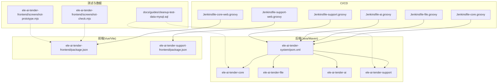
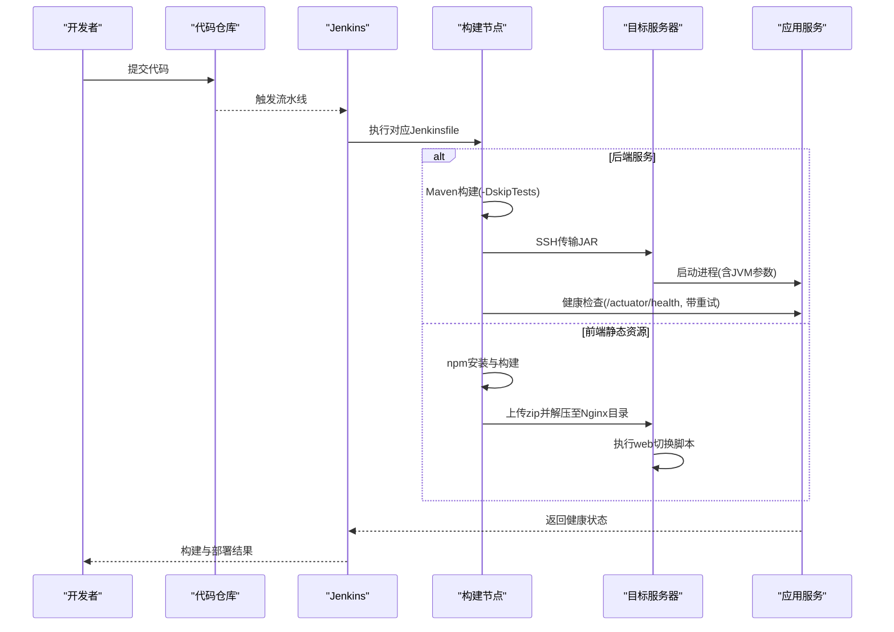
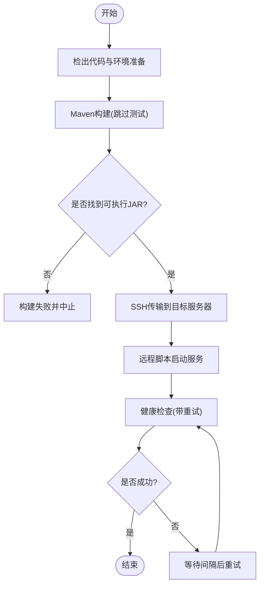
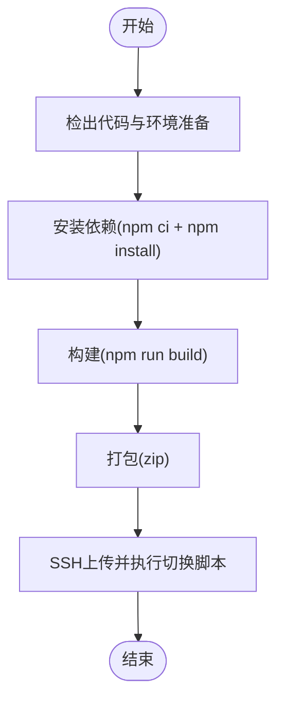
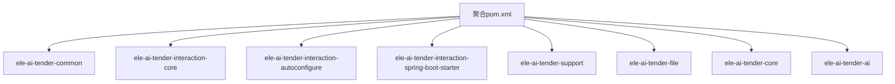

# 测试自动化

<cite>
**本文引用的文件**   
- [Jenkinsfile-core.groovy](file://Jenkinsfile-core.groovy)
- [Jenkinsfile-file.groovy](file://Jenkinsfile-file.groovy)
- [Jenkinsfile-ai.groovy](file://Jenkinsfile-ai.groovy)
- [Jenkinsfile-support.groovy](file://Jenkinsfile-support.groovy)
- [Jenkinsfile-core-web.groovy](file://Jenkinsfile-core-web.groovy)
- [Jenkinsfile-support-web.groovy](file://Jenkinsfile-support-web.groovy)
- [pom.xml（系统聚合）](file://ele-ai-tender-system/pom.xml)
- [package.json（主前端）](file://ele-ai-tender-frontend/package.json)
- [package.json（支持前端）](file://ele-ai-tender-support-frontend/package.json)
- [cleanup-test-data-mysql.sql](file://docs/guides/cleanup-test-data-mysql.sql)
- [screenshot-check.mjs](file://ele-ai-tender-frontend/screenshot-check.mjs)
- [screenshot-prototype.mjs](file://ele-ai-tender-frontend/screenshot-prototype.mjs)
</cite>

## 目录
1. [简介](#简介)
2. [项目结构](#项目结构)
3. [核心组件](#核心组件)
4. [架构总览](#架构总览)
5. [详细组件分析](#详细组件分析)
6. [依赖分析](#依赖分析)
7. [性能考虑](#性能考虑)
8. [故障排查指南](#故障排查指南)
9. [结论](#结论)
10. [附录](#附录)

## 简介
本文件面向“招标文件AI编制系统”的测试自动化，聚焦于CI/CD流水线中的测试集成、多模块并行与结果收集、容器化测试环境搭建、测试报告与覆盖率、测试数据管理策略、跨浏览器与移动端自动化方案，以及失败告警、重试机制与进度跟踪。文档基于仓库中现有的Jenkins管道脚本、Maven与Node构建配置、截图脚本与数据库清理脚本进行系统化梳理，并给出可落地的扩展建议。

## 项目结构
- 后端为多模块Maven工程，包含common、core、file、ai、support等子模块；根聚合pom定义了统一版本与插件管理，包括maven-surefire-plugin用于单元测试执行。
- 前端包含两个独立Vue应用：主前端与支持前端，分别通过各自的package.json定义构建脚本。
- CI/CD使用多个Jenkinsfile按服务维度拆分，覆盖后端JAR包构建部署与前端静态资源构建部署。
- 测试相关资产包括：
  - 数据库清理脚本：用于生产或测试环境的数据清洗预演与执行。
  - Playwright截图脚本：用于原型与运行态页面的可视化回归检查。

图表来源
- [pom.xml（系统聚合）:1-260](file://ele-ai-tender-system/pom.xml#L1-L260)
- [Jenkinsfile-core.groovy:1-132](file://Jenkinsfile-core.groovy#L1-L132)
- [Jenkinsfile-file.groovy:1-132](file://Jenkinsfile-file.groovy#L1-L132)
- [Jenkinsfile-ai.groovy:1-132](file://Jenkinsfile-ai.groovy#L1-L132)
- [Jenkinsfile-support.groovy:1-132](file://Jenkinsfile-support.groovy#L1-L132)
- [Jenkinsfile-core-web.groovy:1-104](file://Jenkinsfile-core-web.groovy#L1-L104)
- [Jenkinsfile-support-web.groovy:1-104](file://Jenkinsfile-support-web.groovy#L1-L104)
- [package.json（主前端）:1-49](file://ele-ai-tender-frontend/package.json#L1-L49)
- [package.json（支持前端）:1-35](file://ele-ai-tender-support-frontend/package.json#L1-L35)
- [cleanup-test-data-mysql.sql:1-241](file://docs/guides/cleanup-test-data-mysql.sql#L1-L241)
- [screenshot-check.mjs:1-147](file://ele-ai-tender-frontend/screenshot-check.mjs#L1-L147)
- [screenshot-prototype.mjs:1-47](file://ele-ai-tender-frontend/screenshot-prototype.mjs#L1-L47)

章节来源
- [pom.xml（系统聚合）:1-260](file://ele-ai-tender-system/pom.xml#L1-L260)
- [Jenkinsfile-core.groovy:1-132](file://Jenkinsfile-core.groovy#L1-L132)
- [Jenkinsfile-file.groovy:1-132](file://Jenkinsfile-file.groovy#L1-L132)
- [Jenkinsfile-ai.groovy:1-132](file://Jenkinsfile-ai.groovy#L1-L132)
- [Jenkinsfile-support.groovy:1-132](file://Jenkinsfile-support.groovy#L1-L132)
- [Jenkinsfile-core-web.groovy:1-104](file://Jenkinsfile-core-web.groovy#L1-L104)
- [Jenkinsfile-support-web.groovy:1-104](file://Jenkinsfile-support-web.groovy#L1-L104)
- [package.json（主前端）:1-49](file://ele-ai-tender-frontend/package.json#L1-L49)
- [package.json（支持前端）:1-35](file://ele-ai-tender-support-frontend/package.json#L1-L35)
- [cleanup-test-data-mysql.sql:1-241](file://docs/guides/cleanup-test-data-mysql.sql#L1-L241)
- [screenshot-check.mjs:1-147](file://ele-ai-tender-frontend/screenshot-check.mjs#L1-L147)
- [screenshot-prototype.mjs:1-47](file://ele-ai-tender-frontend/screenshot-prototype.mjs#L1-L47)

## 核心组件
- 后端构建与部署
  - 每个后端服务对应一个Jenkinsfile，流程包含：检出、构建（跳过测试）、打包、SSH传输到目标服务器、调用远程脚本启动进程、健康检查（带重试）。
  - 构建命令在聚合pom下以“-pl 当前模块 -am -DskipTests”方式执行，确保仅构建当前服务及其上游依赖。
- 前端构建与部署
  - 两个前端各自有Jenkinsfile，流程包含：初始化依赖、构建、打包压缩、SSH传输至Nginx静态目录、执行远程切换脚本完成发布。
- 测试基础设施
  - Maven Surefire插件已声明，可用于执行单元测试与生成标准测试结果。
  - 数据库清理脚本提供事务化预演与可选自增重置能力，便于测试数据治理。
  - Playwright截图脚本可用于页面级视觉回归与登录态验证。

章节来源
- [Jenkinsfile-core.groovy:46-96](file://Jenkinsfile-core.groovy#L46-L96)
- [Jenkinsfile-file.groovy:46-96](file://Jenkinsfile-file.groovy#L46-L96)
- [Jenkinsfile-ai.groovy:46-96](file://Jenkinsfile-ai.groovy#L46-L96)
- [Jenkinsfile-support.groovy:46-96](file://Jenkinsfile-support.groovy#L46-L96)
- [Jenkinsfile-core-web.groovy:38-77](file://Jenkinsfile-core-web.groovy#L38-L77)
- [Jenkinsfile-support-web.groovy:38-77](file://Jenkinsfile-support-web.groovy#L38-L77)
- [pom.xml（系统聚合）:225-258](file://ele-ai-tender-system/pom.xml#L225-L258)
- [cleanup-test-data-mysql.sql:1-241](file://docs/guides/cleanup-test-data-mysql.sql#L1-L241)
- [screenshot-check.mjs:1-147](file://ele-ai-tender-frontend/screenshot-check.mjs#L1-L147)
- [screenshot-prototype.mjs:1-47](file://ele-ai-tender-frontend/screenshot-prototype.mjs#L1-L47)

## 架构总览
下图展示从代码提交到服务可用与健康检查的端到端流程，涵盖后端JAR与前端静态资源的构建、部署与校验路径。

图表来源
- [Jenkinsfile-core.groovy:46-129](file://Jenkinsfile-core.groovy#L46-L129)
- [Jenkinsfile-file.groovy:46-129](file://Jenkinsfile-file.groovy#L46-L129)
- [Jenkinsfile-ai.groovy:46-129](file://Jenkinsfile-ai.groovy#L46-L129)
- [Jenkinsfile-support.groovy:46-129](file://Jenkinsfile-support.groovy#L46-L129)
- [Jenkinsfile-core-web.groovy:38-101](file://Jenkinsfile-core-web.groovy#L38-L101)
- [Jenkinsfile-support-web.groovy:38-101](file://Jenkinsfile-support-web.groovy#L38-L101)

## 详细组件分析

### 后端服务流水线（core/file/ai/support）
- 构建阶段
  - 使用聚合pom指定模块与依赖，执行“clean package -pl 当前模块 -am -DskipTests”，避免在构建阶段执行测试。
- 部署阶段
  - 通过sshPublisher将产物传输到目标服务器的临时目录，并调用远程批处理脚本以指定JVM参数启动服务。
- 健康检查阶段
  - 循环调用HTTP GET /actuator/health，设置最大尝试次数与间隔，成功即退出，失败则记录日志并在达到上限时报错。

图表来源
- [Jenkinsfile-core.groovy:46-129](file://Jenkinsfile-core.groovy#L46-L129)
- [Jenkinsfile-file.groovy:46-129](file://Jenkinsfile-file.groovy#L46-L129)
- [Jenkinsfile-ai.groovy:46-129](file://Jenkinsfile-ai.groovy#L46-L129)
- [Jenkinsfile-support.groovy:46-129](file://Jenkinsfile-support.groovy#L46-L129)

章节来源
- [Jenkinsfile-core.groovy:1-132](file://Jenkinsfile-core.groovy#L1-L132)
- [Jenkinsfile-file.groovy:1-132](file://Jenkinsfile-file.groovy#L1-L132)
- [Jenkinsfile-ai.groovy:1-132](file://Jenkinsfile-ai.groovy#L1-L132)
- [Jenkinsfile-support.groovy:1-132](file://Jenkinsfile-support.groovy#L1-L132)

### 前端流水线（core-web/support-web）
- 初始化阶段
  - 使用nvm切换到指定Node版本，执行npm ci与npm install确保依赖稳定。
- 构建阶段
  - 执行npm run build，输出静态资源。
- 打包与部署
  - 使用7-Zip对构建产物打包，通过sshPublisher上传至Nginx静态目录，并调用远程脚本完成发布切换。

图表来源
- [Jenkinsfile-core-web.groovy:38-101](file://Jenkinsfile-core-web.groovy#L38-L101)
- [Jenkinsfile-support-web.groovy:38-101](file://Jenkinsfile-support-web.groovy#L38-L101)

章节来源
- [Jenkinsfile-core-web.groovy:1-104](file://Jenkinsfile-core-web.groovy#L1-L104)
- [Jenkinsfile-support-web.groovy:1-104](file://Jenkinsfile-support-web.groovy#L1-L104)
- [package.json（主前端）:1-49](file://ele-ai-tender-frontend/package.json#L1-L49)
- [package.json（支持前端）:1-35](file://ele-ai-tender-support-frontend/package.json#L1-L35)

### 测试集成与多模块并行
- 现状
  - 现有后端Jenkinsfile在构建阶段显式跳过测试（-DskipTests），未集成Surefire测试执行与结果收集。
  - 聚合pom已声明maven-surefire-plugin，具备执行单元测试与生成标准结果的能力。
- 建议方案
  - 新增“Test”阶段：在构建前执行“mvn test”，由Surefire生成JUnit XML与HTML报告。
  - 多模块并行：在聚合层使用“mvn -T 1C test”实现线程级并行，或在Jenkins中使用parallel块并行执行各服务模块的测试任务。
  - 结果收集：使用Jenkins内置的“Publish JUnit test result report”与“Archive artifacts”归档HTML报告。
  - 质量门禁：根据测试结果与覆盖率阈值决定是否阻断后续部署。

章节来源
- [pom.xml（系统聚合）:225-258](file://ele-ai-tender-system/pom.xml#L225-L258)

### Docker容器化测试环境
- 建议内容
  - 使用docker-compose编排MySQL、Redis、MinIO等依赖服务，配合环境变量注入不同测试环境配置。
  - 为每个服务提供独立的测试镜像，包含JDK、Maven与必要工具链，确保构建与测试环境一致。
  - 在流水线中先拉起依赖服务，再执行测试，最后销毁容器释放资源。
- 注意
  - 当前仓库未提供Dockerfile与compose文件，上述为落地建议，可按需补充。

[本节为概念性说明，不直接分析具体文件]

### 测试报告与覆盖率
- 现状
  - 未在当前Jenkinsfile中看到Surefire结果发布与覆盖率统计步骤。
- 建议方案
  - 单元测试报告：启用Surefire默认输出，结合Jenkins插件归档与展示。
  - HTML报告：引入JaCoCo生成覆盖率HTML报告，并在Jenkins中归档。
  - 覆盖率阈值：在流水线中加入质量门禁，低于阈值时标记失败。

章节来源
- [pom.xml（系统聚合）:225-258](file://ele-ai-tender-system/pom.xml#L225-L258)

### 测试数据管理策略
- 数据工厂与隔离
  - 建议在测试类中采用工厂方法或注解驱动的方式生成测试数据，保证用例间数据隔离。
  - 使用事务边界与回滚策略，确保测试完成后数据自动清理。
- 数据库清理
  - 使用提供的SQL脚本进行生产或测试环境的数据清理预演与执行，支持条件判断与事务回滚，降低误操作风险。
- 建议
  - 在CI中增加“Pre-test Data Reset”步骤，执行清理脚本后再运行测试，确保环境一致性。

章节来源
- [cleanup-test-data-mysql.sql:1-241](file://docs/guides/cleanup-test-data-mysql.sql#L1-L241)

### 跨浏览器与移动端测试自动化
- 现状
  - 存在Playwright截图脚本，支持本地Chrome实例与headless模式，可用于原型与运行态页面的视觉回归。
- 建议方案
  - 跨浏览器：在流水线中并行启动Chromium、Firefox、WebKit，执行相同用例集，对比截图差异。
  - 移动端：使用Playwright的mobile emulation或真实设备云，模拟主流机型与分辨率，验证响应式布局与交互。
  - 结果归档：将截图与差异报告作为构建产物归档，便于回溯。

章节来源
- [screenshot-check.mjs:1-147](file://ele-ai-tender-frontend/screenshot-check.mjs#L1-L147)
- [screenshot-prototype.mjs:1-47](file://ele-ai-tender-frontend/screenshot-prototype.mjs#L1-L47)

### 失败告警、重试机制与进度跟踪
- 失败告警
  - 在Jenkins中配置邮件、企业微信或钉钉通知，当构建或测试失败时即时推送。
- 重试机制
  - 健康检查已实现带最大次数与间隔的重试逻辑；测试阶段可对不稳定用例配置自动重试。
- 进度跟踪
  - 利用Jenkins控制台输出与测试报告，实时查看构建与测试进度；结合覆盖率趋势图评估质量变化。

章节来源
- [Jenkinsfile-core.groovy:97-129](file://Jenkinsfile-core.groovy#L97-L129)
- [Jenkinsfile-file.groovy:97-129](file://Jenkinsfile-file.groovy#L97-L129)
- [Jenkinsfile-ai.groovy:97-129](file://Jenkinsfile-ai.groovy#L97-L129)
- [Jenkinsfile-support.groovy:97-129](file://Jenkinsfile-support.groovy#L97-L129)

## 依赖分析
- 后端模块依赖关系
  - 聚合pom统一管理Spring Boot、MyBatis Plus、JWT、Hutool、MySQL、Redisson、SpringDoc等依赖版本，并通过dependencyManagement集中控制。
  - 各业务模块（core、file、ai、support）通过内部依赖引用common与interaction相关包。
- 前端依赖
  - 主前端与支持前端均基于Vue3生态，使用Vite构建，依赖Element Plus、Pinia、Axios等。

图表来源
- [pom.xml（系统聚合）:15-124](file://ele-ai-tender-system/pom.xml#L15-L124)

章节来源
- [pom.xml（系统聚合）:1-260](file://ele-ai-tender-system/pom.xml#L1-L260)

## 性能考虑
- 构建优化
  - 使用Maven缓存与增量编译，减少重复构建时间。
  - 前端使用npm ci锁定依赖版本，提升安装稳定性与速度。
- 测试优化
  - 多线程并行执行测试用例，缩短整体耗时。
  - 针对慢用例进行分层与隔离，优先快速反馈。
- 资源限制
  - 合理设置JVM内存参数，避免OOM导致构建或测试失败。

[本节为通用指导，不直接分析具体文件]

## 故障排查指南
- 构建失败
  - 检查Maven与JDK版本是否与pipeline声明一致。
  - 确认依赖下载与网络代理配置。
- 部署失败
  - 核对SSH密钥与目标服务器权限。
  - 检查远程脚本路径与执行权限。
- 健康检查失败
  - 确认端口与服务名是否正确。
  - 查看应用日志定位启动异常。
- 前端构建失败
  - 检查Node版本与依赖安装日志。
  - 确认构建脚本与资源路径。

章节来源
- [Jenkinsfile-core.groovy:46-129](file://Jenkinsfile-core.groovy#L46-L129)
- [Jenkinsfile-file.groovy:46-129](file://Jenkinsfile-file.groovy#L46-L129)
- [Jenkinsfile-ai.groovy:46-129](file://Jenkinsfile-ai.groovy#L46-L129)
- [Jenkinsfile-support.groovy:46-129](file://Jenkinsfile-support.groovy#L46-L129)
- [Jenkinsfile-core-web.groovy:38-101](file://Jenkinsfile-core-web.groovy#L38-L101)
- [Jenkinsfile-support-web.groovy:38-101](file://Jenkinsfile-support-web.groovy#L38-L101)

## 结论
当前仓库已具备完善的后端与前端构建与部署流水线，但尚未集成测试执行与结果收集。建议尽快在Jenkinsfile中引入Surefire测试执行、多模块并行与结果归档，并结合JaCoCo实现覆盖率统计。同时完善Docker化测试环境与跨浏览器/移动端自动化方案，建立失败告警与重试机制，形成闭环的质量保障体系。

[本节为总结性内容，不直接分析具体文件]

## 附录
- 关键路径参考
  - 后端构建与部署：见各Jenkinsfile的构建与部署阶段。
  - 前端构建与部署：见前端Jenkinsfile的Init、Build、Dryrun、Deploy阶段。
  - 测试执行与报告：参考聚合pom中的Surefire插件配置。
  - 数据清理：参考cleanup-test-data-mysql.sql的事务化预演与执行流程。
  - 视觉回归：参考screenshot-check.mjs与screenshot-prototype.mjs的用例组织与截图策略。

章节来源
- [Jenkinsfile-core.groovy:1-132](file://Jenkinsfile-core.groovy#L1-L132)
- [Jenkinsfile-file.groovy:1-132](file://Jenkinsfile-file.groovy#L1-L132)
- [Jenkinsfile-ai.groovy:1-132](file://Jenkinsfile-ai.groovy#L1-L132)
- [Jenkinsfile-support.groovy:1-132](file://Jenkinsfile-support.groovy#L1-L132)
- [Jenkinsfile-core-web.groovy:1-104](file://Jenkinsfile-core-web.groovy#L1-L104)
- [Jenkinsfile-support-web.groovy:1-104](file://Jenkinsfile-support-web.groovy#L1-L104)
- [pom.xml（系统聚合）:225-258](file://ele-ai-tender-system/pom.xml#L225-L258)
- [cleanup-test-data-mysql.sql:1-241](file://docs/guides/cleanup-test-data-mysql.sql#L1-L241)
- [screenshot-check.mjs:1-147](file://ele-ai-tender-frontend/screenshot-check.mjs#L1-L147)
- [screenshot-prototype.mjs:1-47](file://ele-ai-tender-frontend/screenshot-prototype.mjs#L1-L47)