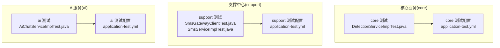
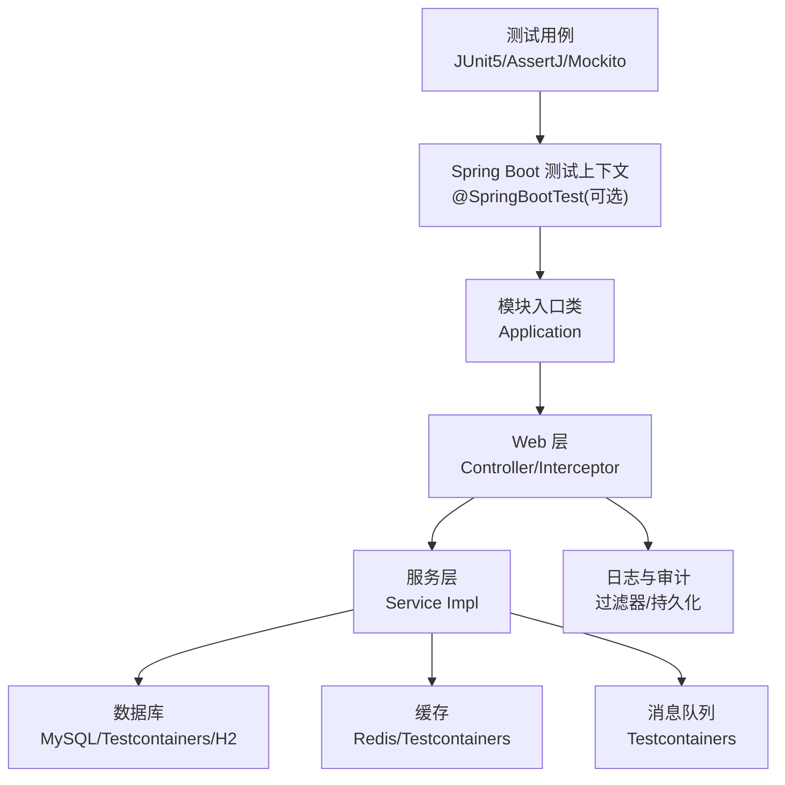
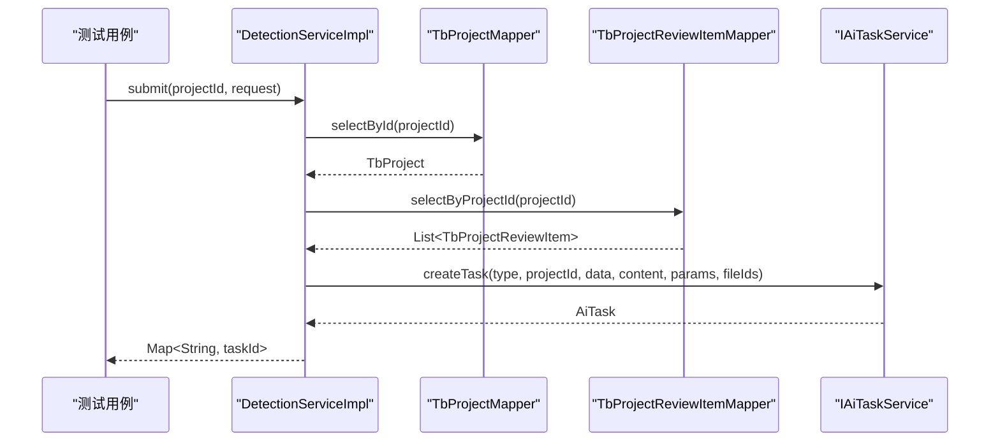
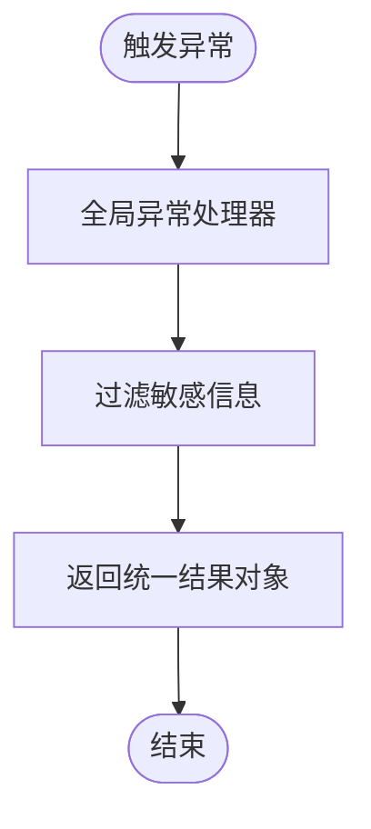
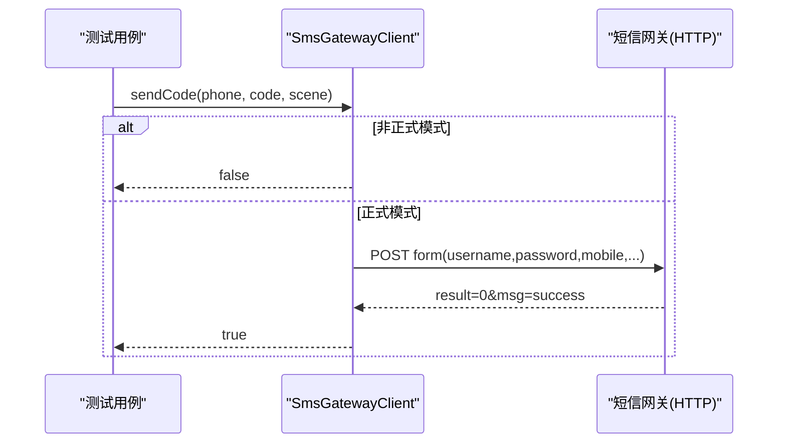
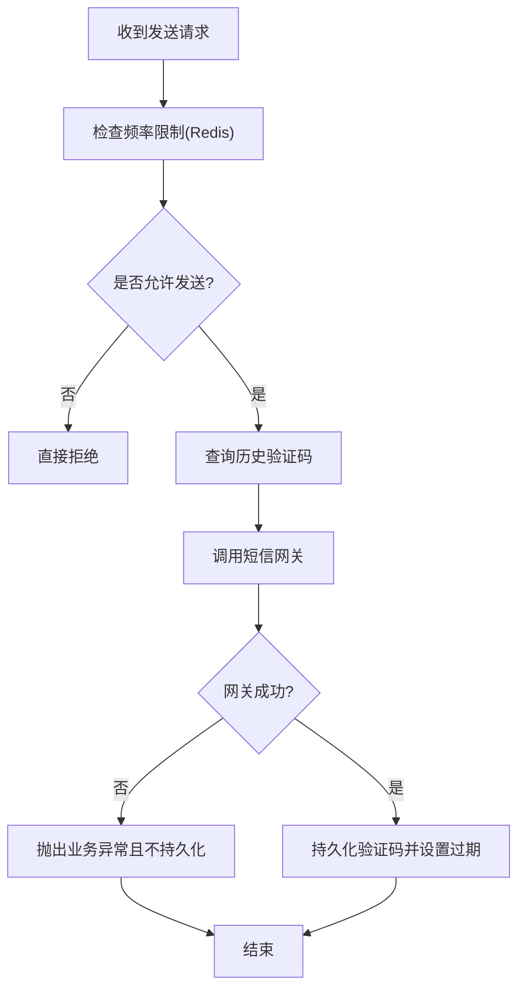
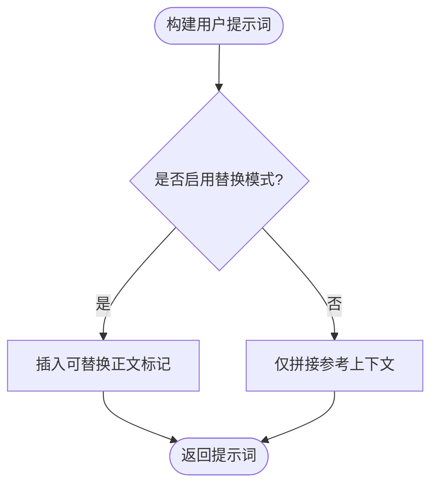
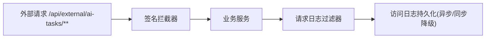
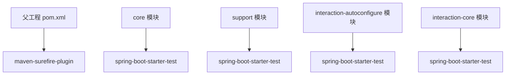

# 集成测试

<cite>
**本文引用的文件**   
- [ele-ai-tender-core/DetectionServiceImplTest.java](file://ele-ai-tender-system/ele-ai-tender-core/src/test/java/com/jy/eleaitender/core/service/impl/DetectionServiceImplTest.java)
- [ele-ai-tender-core/GlobalExceptionHandlerTest.java](file://ele-ai-tender-system/ele-ai-tender-core/src/test/java/com/jy/eleaitender/core/handler/GlobalExceptionHandlerTest.java)
- [ele-ai-tender-support/SmsGatewayClientTest.java](file://ele-ai-tender-system/ele-ai-tender-support/src/test/java/com/jy/eleaitender/support/service/SmsGatewayClientTest.java)
- [ele-ai-tender-support/SmsServiceImplTest.java](file://ele-ai-tender-system/ele-ai-tender-support/src/test/java/com/jy/eleaitender/support/service/impl/SmsServiceImplTest.java)
- [ele-ai-tender-ai/AiChatServiceImplTest.java](file://ele-ai-tender-system/ele-ai-tender-ai/src/test/java/com/jy/eleaitender/ai/service/impl/AiChatServiceImplTest.java)
- [core/application-test.yml](file://ele-ai-tender-system/ele-ai-tender-core/src/main/resources/application-test.yml)
- [support/application-test.yml](file://ele-ai-tender-system/ele-ai-tender-support/src/main/resources/application-test.yml)
- [ai/application-test.yml](file://ele-ai-tender-system/ele-ai-tender-ai/src/main/resources/application-test.yml)
- [pom.xml（父工程）](file://ele-ai-tender-system/pom.xml)
- [interaction-autoconfigure/pom.xml](file://ele-ai-tender-system/ele-ai-tender-interaction/ele-ai-tender-interaction-autoconfigure/pom.xml)
- [interaction-core/pom.xml](file://ele-ai-tender-system/ele-ai-tender-interaction/ele-ai-tender-interaction-core/pom.xml)
- [ExternalApiWebConfig.java](file://ele-ai-tender-system/ele-ai-tender-core/src/main/java/com/jy/eleaitender/core/config/ExternalApiWebConfig.java)
- [HttpRequestLogFilter.java](file://ele-ai-tender-system/ele-ai-tender-common/src/main/java/com/jy/eleaitender/common/logging/HttpRequestLogFilter.java)
- [LoggingAutoConfiguration.java](file://ele-ai-tender-system/ele-ai-tender-common/src/main/java/com/jy/eleaitender/common/logging/LoggingAutoConfiguration.java)
- [DbAccessLogPersistenceService.java](file://ele-ai-tender-system/ele-ai-tender-common/src/main/java/com/jy/eleaitender/common/logging/DbAccessLogPersistenceService.java)
</cite>

## 目录
1. [简介](#简介)
2. [项目结构](#项目结构)
3. [核心组件](#核心组件)
4. [架构总览](#架构总览)
5. [详细组件分析](#详细组件分析)
6. [依赖分析](#依赖分析)
7. [性能考虑](#性能考虑)
8. [故障排查指南](#故障排查指南)
9. [结论](#结论)
10. [附录](#附录)

## 简介
本文件面向“招标文件AI编制系统”的集成测试实践，聚焦于：
- Spring Boot 测试框架与测试上下文配置
- 数据库集成测试策略（含容器化、内存库与迁移）
- 外部服务模拟（HTTP、缓存、消息队列）
- API 接口测试（REST、WebSocket）
- 微服务间通信测试（Feign、服务发现）
- 测试环境隔离与数据清理策略

说明：仓库中已存在大量单元测试与部分集成测试用例；本文在现有基础上补充端到端集成测试方案与最佳实践，确保可落地执行。

## 项目结构
当前仓库采用多模块结构，测试代码主要位于各模块的 test 目录下，配置文件通过 application-test.yml 提供测试环境参数。

图表来源
- [core/application-test.yml:1-34](file://ele-ai-tender-system/ele-ai-tender-core/src/main/resources/application-test.yml#L1-L34)
- [support/application-test.yml:1-39](file://ele-ai-tender-system/ele-ai-tender-support/src/main/resources/application-test.yml#L1-L39)
- [ai/application-test.yml:1-43](file://ele-ai-tender-system/ele-ai-tender-ai/src/main/resources/application-test.yml#L1-L43)

章节来源
- [core/application-test.yml:1-34](file://ele-ai-tender-system/ele-ai-tender-core/src/main/resources/application-test.yml#L1-L34)
- [support/application-test.yml:1-39](file://ele-ai-tender-system/ele-ai-tender-support/src/main/resources/application-test.yml#L1-L39)
- [ai/application-test.yml:1-43](file://ele-ai-tender-system/ele-ai-tender-ai/src/main/resources/application-test.yml#L1-L43)

## 核心组件
- 测试框架与依赖
  - 使用 JUnit 5 + AssertJ + Mockito 进行断言与依赖注入/模拟。
  - 父工程统一管理 maven-surefire-plugin 版本，保证测试执行一致性。
- 测试配置
  - 各模块通过 application-test.yml 指定端口、数据源、Redis、内部服务地址等，避免污染开发/生产环境。
- 典型测试类型
  - 单元测试：覆盖业务逻辑分支、异常处理、边界条件。
  - 集成测试：结合真实或容器化的中间件（MySQL、Redis、MQ），验证跨层调用与事务行为。
  - 接口测试：基于 RestAssured 对 REST 端点进行请求级验证。
  - WebSocket 测试：对实时交互场景建立连接并校验消息流。
  - 外部依赖模拟：WireMock 模拟 HTTP 下游；Redis/MQ 使用 Testcontainers 或内存替代。

章节来源
- [pom.xml（父工程）:231-259](file://ele-ai-tender-system/pom.xml#L231-L259)
- [core/application-test.yml:1-34](file://ele-ai-tender-system/ele-ai-tender-core/src/main/resources/application-test.yml#L1-L34)
- [support/application-test.yml:1-39](file://ele-ai-tender-system/ele-ai-tender-support/src/main/resources/application-test.yml#L1-L39)
- [ai/application-test.yml:1-43](file://ele-ai-tender-system/ele-ai-tender-ai/src/main/resources/application-test.yml#L1-L43)

## 架构总览
下图展示集成测试在系统中的位置与关键路径：测试驱动应用启动，访问控制器，进入服务层，落库/缓存/消息，并通过拦截器与日志记录链路完成观测。

图表来源
- [ExternalApiWebConfig.java:1-32](file://ele-ai-tender-system/ele-ai-tender-core/src/main/java/com/jy/eleaitender/core/config/ExternalApiWebConfig.java#L1-L32)
- [HttpRequestLogFilter.java:125-136](file://ele-ai-tender-system/ele-ai-tender-common/src/main/java/com/jy/eleaitender/common/logging/HttpRequestLogFilter.java#L125-L136)
- [LoggingAutoConfiguration.java:73-81](file://ele-ai-tender-system/ele-ai-tender-common/src/main/java/com/jy/eleaitender/common/logging/LoggingAutoConfiguration.java#L73-L81)
- [DbAccessLogPersistenceService.java:1-39](file://ele-ai-tender-system/ele-ai-tender-common/src/main/java/com/jy/eleaitender/common/logging/DbAccessLogPersistenceService.java#L1-L39)

## 详细组件分析

### 检测提交流程（单元测试视角）
该用例验证检测任务提交时，优先使用业务内容而非生成文件ID，并在选择政策文件时包含政策审查任务。

图表来源
- [DetectionServiceImplTest.java:1-133](file://ele-ai-tender-system/ele-ai-tender-core/src/test/java/com/jy/eleaitender/core/service/impl/DetectionServiceImplTest.java#L1-L133)

章节来源
- [DetectionServiceImplTest.java:1-133](file://ele-ai-tender-system/ele-ai-tender-core/src/test/java/com/jy/eleaitender/core/service/impl/DetectionServiceImplTest.java#L1-L133)

### 全局异常处理器（安全与健壮性）
该用例验证异常信息不泄露内部 SQL 细节，对外返回统一错误码与友好提示。

图表来源
- [GlobalExceptionHandlerTest.java:1-22](file://ele-ai-tender-system/ele-ai-tender-core/src/test/java/com/jy/eleaitender/core/handler/GlobalExceptionHandlerTest.java#L1-L22)

章节来源
- [GlobalExceptionHandlerTest.java:1-22](file://ele-ai-tender-system/ele-ai-tender-core/src/test/java/com/jy/eleaitender/core/handler/GlobalExceptionHandlerTest.java#L1-L22)

### 短信网关客户端（外部HTTP模拟）
该用例覆盖正式模式开关、表单构造、响应解析与异常场景，适合用 WireMock 替换真实网关。

图表来源
- [SmsGatewayClientTest.java:1-118](file://ele-ai-tender-system/ele-ai-tender-support/src/test/java/com/jy/eleaitender/support/service/SmsGatewayClientTest.java#L1-L118)

章节来源
- [SmsGatewayClientTest.java:1-118](file://ele-ai-tender-system/ele-ai-tender-support/src/test/java/com/jy/eleaitender/support/service/SmsGatewayClientTest.java#L1-L118)

### 短信服务（Redis限流与持久化）
该用例验证当网关失败时不持久化可用验证码，体现幂等与一致性约束。

图表来源
- [SmsServiceImplTest.java:1-68](file://ele-ai-tender-system/ele-ai-tender-support/src/test/java/com/jy/eleaitender/support/service/impl/SmsServiceImplTest.java#L1-L68)

章节来源
- [SmsServiceImplTest.java:1-68](file://ele-ai-tender-system/ele-ai-tender-support/src/test/java/com/jy/eleaitender/support/service/impl/SmsServiceImplTest.java#L1-L68)

### AI聊天提示词构建（纯逻辑验证）
该用例验证在不同模式下提示词组装是否符合预期，属于无状态逻辑验证。

图表来源
- [AiChatServiceImplTest.java:1-52](file://ele-ai-tender-system/ele-ai-tender-ai/src/test/java/com/jy/eleaitender/ai/service/impl/AiChatServiceImplTest.java#L1-L52)

章节来源
- [AiChatServiceImplTest.java:1-52](file://ele-ai-tender-system/ele-ai-tender-ai/src/test/java/com/jy/eleaitender/ai/service/impl/AiChatServiceImplTest.java#L1-L52)

### 外部API签名拦截与请求日志
- 外部API签名拦截器注册路径，用于对外暴露的AI任务接口做签名校验。
- 请求日志过滤器负责包装响应体以便后续记录，避免重复包装。
- 访问日志持久化自动装配，缺失 Mapper 时禁用落库，线程池不可用时降级为同步写入。

图表来源
- [ExternalApiWebConfig.java:1-32](file://ele-ai-tender-system/ele-ai-tender-core/src/main/java/com/jy/eleaitender/core/config/ExternalApiWebConfig.java#L1-L32)
- [HttpRequestLogFilter.java:125-136](file://ele-ai-tender-system/ele-ai-tender-common/src/main/java/com/jy/eleaitender/common/logging/HttpRequestLogFilter.java#L125-L136)
- [LoggingAutoConfiguration.java:73-81](file://ele-ai-tender-system/ele-ai-tender-common/src/main/java/com/jy/eleaitender/common/logging/LoggingAutoConfiguration.java#L73-L81)
- [DbAccessLogPersistenceService.java:1-39](file://ele-ai-tender-system/ele-ai-tender-common/src/main/java/com/jy/eleaitender/common/logging/DbAccessLogPersistenceService.java#L1-L39)

章节来源
- [ExternalApiWebConfig.java:1-32](file://ele-ai-tender-system/ele-ai-tender-core/src/main/java/com/jy/eleaitender/core/config/ExternalApiWebConfig.java#L1-L32)
- [HttpRequestLogFilter.java:125-136](file://ele-ai-tender-system/ele-ai-tender-common/src/main/java/com/jy/eleaitender/common/logging/HttpRequestLogFilter.java#L125-L136)
- [LoggingAutoConfiguration.java:73-81](file://ele-ai-tender-system/ele-ai-tender-common/src/main/java/com/jy/eleaitender/common/logging/LoggingAutoConfiguration.java#L73-L81)
- [DbAccessLogPersistenceService.java:1-39](file://ele-ai-tender-system/ele-ai-tender-common/src/main/java/com/jy/eleaitender/common/logging/DbAccessLogPersistenceService.java#L1-L39)

## 依赖分析
- 测试依赖
  - 各模块 pom 引入 spring-boot-starter-test，便于使用 @SpringBootTest、RestAssured、WireMock、Testcontainers 等。
- 插件与执行
  - 父工程统一管理 surefire 插件，保障 CI 执行一致。

图表来源
- [pom.xml（父工程）:231-259](file://ele-ai-tender-system/pom.xml#L231-L259)
- [interaction-autoconfigure/pom.xml:34-55](file://ele-ai-tender-system/ele-ai-tender-interaction/ele-ai-tender-interaction-autoconfigure/pom.xml#L34-L55)
- [interaction-core/pom.xml:35-54](file://ele-ai-tender-system/ele-ai-tender-interaction/ele-ai-tender-interaction-core/pom.xml#L35-L54)

章节来源
- [pom.xml（父工程）:231-259](file://ele-ai-tender-system/pom.xml#L231-L259)
- [interaction-autoconfigure/pom.xml:34-55](file://ele-ai-tender-system/ele-ai-tender-interaction/ele-ai-tender-interaction-autoconfigure/pom.xml#L34-L55)
- [interaction-core/pom.xml:35-54](file://ele-ai-tender-system/ele-ai-tender-interaction/ele-ai-tender-interaction-core/pom.xml#L35-L54)

## 性能考虑
- 测试数据库与缓存
  - 优先使用内存数据库（H2）或轻量容器（Testcontainers）降低IO开销。
  - Redis 使用独立实例或容器，避免与开发共享导致竞争。
- 外部依赖
  - 使用 WireMock 本地模拟，避免网络抖动影响稳定性。
- 日志与审计
  - 测试环境关闭非必要日志输出，减少磁盘IO。
  - 访问日志持久化在测试环境建议禁用或降级为内存存储。

## 故障排查指南
- 外部API签名失败
  - 确认拦截器路径匹配与密钥配置，必要时在测试中注入固定签名。
- 请求日志为空
  - 检查过滤器是否正确包装响应体，避免重复包装导致丢失。
- 访问日志未落库
  - 检查自动装配是否因缺少 Mapper 而禁用，或线程池不可用导致的同步降级。

章节来源
- [ExternalApiWebConfig.java:1-32](file://ele-ai-tender-system/ele-ai-tender-core/src/main/java/com/jy/eleaitender/core/config/ExternalApiWebConfig.java#L1-L32)
- [HttpRequestLogFilter.java:125-136](file://ele-ai-tender-system/ele-ai-tender-common/src/main/java/com/jy/eleaitender/common/logging/HttpRequestLogFilter.java#L125-L136)
- [LoggingAutoConfiguration.java:73-81](file://ele-ai-tender-system/ele-ai-tender-common/src/main/java/com/jy/eleaitender/common/logging/LoggingAutoConfiguration.java#L73-L81)
- [DbAccessLogPersistenceService.java:1-39](file://ele-ai-tender-system/ele-ai-tender-common/src/main/java/com/jy/eleaitender/common/logging/DbAccessLogPersistenceService.java#L1-L39)

## 结论
本项目已具备完善的单元测试基础，建议在以下方面补齐集成测试能力：
- 引入 Testcontainers 实现 MySQL/Redis/MQ 的容器化测试，提升环境一致性。
- 使用 WireMock 模拟外部HTTP服务，稳定测试外部依赖。
- 基于 RestAssured 对 REST 接口进行端到端验证，结合 @SpringBootTest 启动最小化上下文。
- 针对 WebSocket 场景编写连接与消息流测试。
- 完善测试数据初始化与清理策略，确保测试隔离与可重复性。

## 附录

### Spring Boot 测试上下文与注解
- 推荐用法
  - 使用 @SpringBootTest 启动完整上下文，配合 @AutoConfigureTestDatabase 切换数据源。
  - 使用 @TestPropertySource 或 application-test.yml 注入测试配置。
  - 使用 @DirtiesContext 控制上下文销毁，避免状态污染。
- 适用场景
  - 需要加载 Web 层、服务层、配置类的端到端验证。

章节来源
- [core/application-test.yml:1-34](file://ele-ai-tender-system/ele-ai-tender-core/src/main/resources/application-test.yml#L1-L34)
- [support/application-test.yml:1-39](file://ele-ai-tender-system/ele-ai-tender-support/src/main/resources/application-test.yml#L1-L39)
- [ai/application-test.yml:1-43](file://ele-ai-tender-system/ele-ai-tender-ai/src/main/resources/application-test.yml#L1-L43)

### 数据库集成测试方法
- Testcontainers
  - 启动 MySQL/PostgreSQL 容器，自动执行 Flyway 迁移，测试后自动销毁。
- H2 内存数据库
  - 适用于快速回归，注意方言差异与函数兼容性。
- Flyway 迁移测试
  - 在测试环境中启用迁移脚本，确保结构与数据一致。

### 外部服务模拟策略
- WireMock HTTP 模拟
  - 定义期望请求与响应，支持延迟、随机失败、条件匹配。
- Redis 缓存测试
  - 使用 Testcontainers 启动 Redis，或使用内存替代；验证缓存命中与失效。
- 消息队列测试
  - 使用 Testcontainers 启动 RabbitMQ/Kafka，验证生产者/消费者端到端流程。

### API 接口测试方法
- RestAssured REST 测试
  - 基于 @SpringBootTest 启动服务器，发送 HTTP 请求并断言状态码与响应体。
- WebSocket 连接测试
  - 使用 Spring WebSocket Test 或原生 JSR-356 客户端建立连接，验证消息收发。

### 微服务间通信测试
- Feign 客户端测试
  - 使用 @FeignClient 的 stub 或 WireMock 模拟下游服务。
- 服务发现测试
  - 使用嵌入式注册中心或 Mock 服务发现，验证路由与负载均衡。

### 测试环境隔离与数据清理
- 隔离策略
  - 每个模块使用独立端口与数据库 schema，避免相互干扰。
- 数据清理
  - 使用事务回滚、SQL 清理脚本或容器生命周期管理，确保每次测试前环境干净。