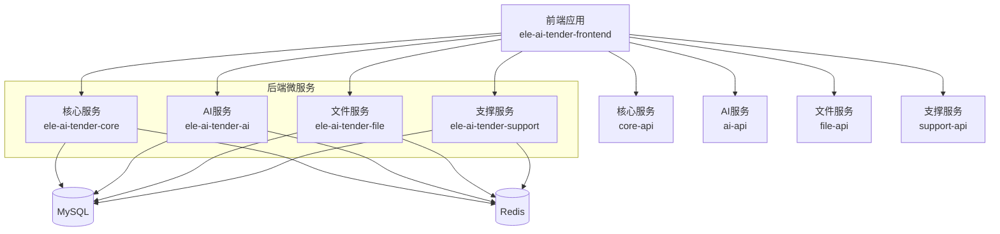
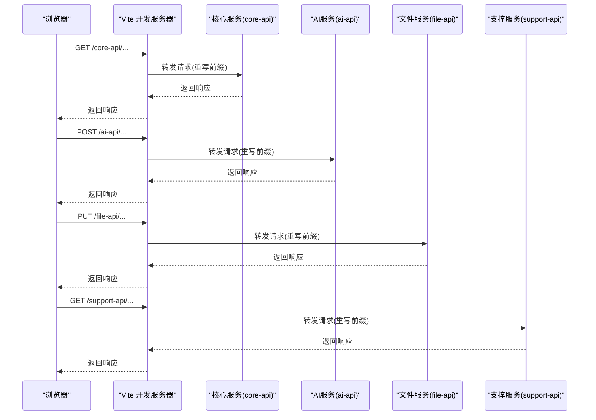
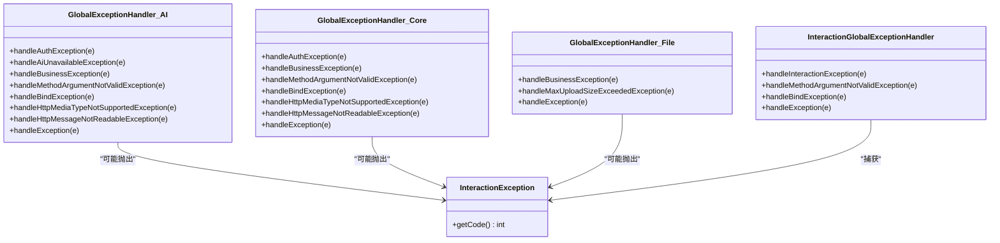
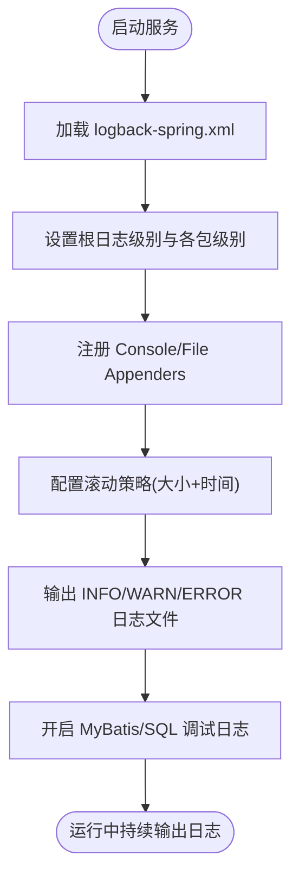
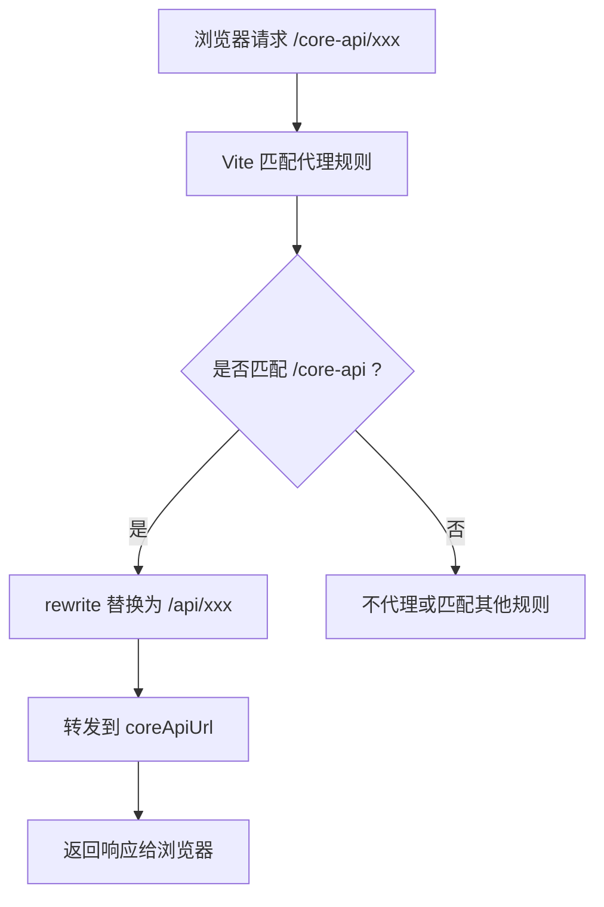
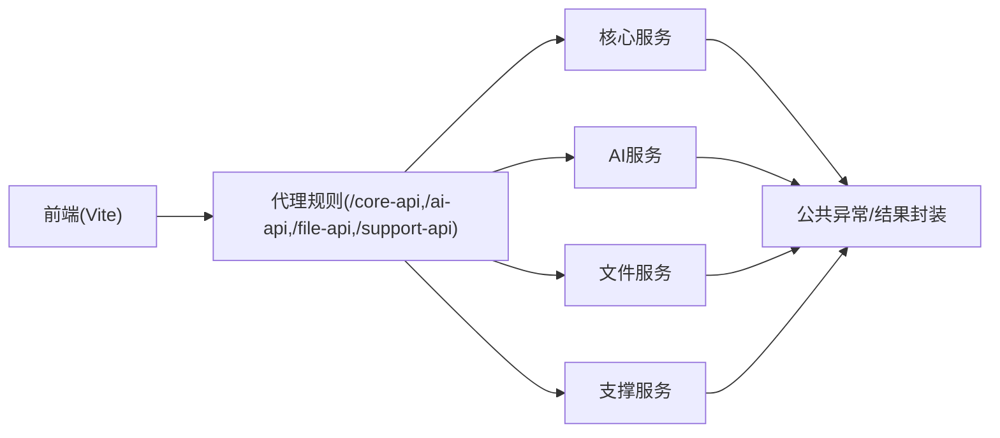

# 调试指南

<cite>
**本文引用的文件**   
- [ele-ai-tender-system/ele-ai-tender-ai/src/main/resources/application-dev.yml](file://ele-ai-tender-system/ele-ai-tender-ai/src/main/resources/application-dev.yml)
- [ele-ai-tender-system/ele-ai-tender-core/src/main/resources/application-dev.yml](file://ele-ai-tender-system/ele-ai-tender-core/src/main/resources/application-dev.yml)
- [ele-ai-tender-system/ele-ai-tender-file/src/main/resources/application-dev.yml](file://ele-ai-tender-system/ele-ai-tender-file/src/main/resources/application-dev.yml)
- [ele-ai-tender-system/ele-ai-tender-support/src/main/resources/application-dev.yml](file://ele-ai-tender-system/ele-ai-tender-support/src/main/resources/application-dev.yml)
- [ele-ai-tender-system/ele-ai-tender-ai/src/main/resources/logback-spring.xml](file://ele-ai-tender-system/ele-ai-tender-ai/src/main/resources/logback-spring.xml)
- [ele-ai-tender-system/ele-ai-tender-ai/src/main/resources/logging-spring.xml](file://ele-ai-tender-system/ele-ai-tender-ai/src/main/resources/logging-spring.xml)
- [ele-ai-tender-system/ele-ai-tender-core/src/main/resources/logback-spring.xml](file://ele-ai-tender-system/ele-ai-tender-core/src/main/resources/logback-spring.xml)
- [ele-ai-tender-system/ele-ai-tender-file/src/main/resources/logback-spring.xml](file://ele-ai-tender-system/ele-ai-tender-file/src/main/resources/logback-spring.xml)
- [ele-ai-tender-system/ele-ai-tender-support/src/main/resources/logback-spring.xml](file://ele-ai-tender-system/ele-ai-tender-support/src/main/resources/logback-spring.xml)
- [ele-ai-tender-system/ele-ai-tender-ai/src/main/java/com/jy/eleaitender/ai/handler/GlobalExceptionHandler.java](file://ele-ai-tender-system/ele-ai-tender-ai/src/main/java/com/jy/eleaitender/ai/handler/GlobalExceptionHandler.java)
- [ele-ai-tender-system/ele-ai-tender-core/src/main/java/com/jy/eleaitender/core/handler/GlobalExceptionHandler.java](file://ele-ai-tender-system/ele-ai-tender-core/src/main/java/com/jy/eleaitender/core/handler/GlobalExceptionHandler.java)
- [ele-ai-tender-system/ele-ai-tender-file/src/main/java/com/jy/eleaitender/file/handler/GlobalExceptionHandler.java](file://ele-ai-tender-system/ele-ai-tender-file/src/main/java/com/jy/eleaitender/file/handler/GlobalExceptionHandler.java)
- [ele-ai-tender-system/ele-ai-tender-common-interaction/src/main/java/com/jy/eleaitender/common/interaction/exception/InteractionException.java](file://ele-ai-tender-system/ele-ai-tender-common-interaction/src/main/java/com/jy/eleaitender/common/interaction/exception/InteractionException.java)
- [ele-ai-tender-system/ele-ai-tender-interaction/ele-ai-tender-interaction-autoconfigure/src/main/java/com/jy/eleaitender/interaction/autoconfigure/handler/InteractionGlobalExceptionHandler.java](file://ele-ai-tender-system/ele-ai-tender-interaction/ele-ai-tender-interaction-autoconfigure/src/main/java/com/jy/eleaitender/interaction/autoconfigure/handler/InteractionGlobalExceptionHandler.java)
- [ele-ai-tender-frontend/vite.config.ts](file://ele-ai-tender-frontend/vite.config.ts)
- [ele-ai-tender-support-frontend/vite.config.ts](file://ele-ai-tender-support-frontend/vite.config.ts)
</cite>

## 目录
1. [简介](#简介)
2. [项目结构](#项目结构)
3. [核心组件](#核心组件)
4. [架构总览](#架构总览)
5. [详细组件分析](#详细组件分析)
6. [依赖关系分析](#依赖关系分析)
7. [性能考虑](#性能考虑)
8. [故障排查指南](#故障排查指南)
9. [结论](#结论)
10. [附录](#附录)

## 简介
本调试指南面向“招标文件AI编制系统”的开发者与运维人员，覆盖以下方面：
- IDE 调试配置（IntelliJ IDEA、VS Code）
- 断点调试与变量监控
- 微服务间调用追踪、日志关联分析与分布式问题定位
- 数据库调试技巧（SQL 性能分析、慢查询优化、数据一致性检查）
- 前端调试方法（Vue DevTools、网络请求调试、性能分析）
- 常见问题排查（连接超时、内存泄漏、并发问题）
- 生产环境日志收集与分析（错误追踪、性能监控）

## 项目结构
本项目采用前后端分离与多后端微服务架构：
- 前端应用：ele-ai-tender-frontend（主业务）、ele-ai-tender-support-frontend（支撑中心）
- 后端微服务：ele-ai-tender-ai（AI能力）、ele-ai-tender-core（核心业务）、ele-ai-tender-file（文件服务）、ele-ai-tender-support（支撑中心）
- 公共模块：ele-ai-tender-common、ele-ai-tender-common-interaction、ele-ai-tender-interaction（交互层）

图表来源
- [ele-ai-tender-frontend/vite.config.ts:60-86](file://ele-ai-tender-frontend/vite.config.ts#L60-L86)
- [ele-ai-tender-support-frontend/vite.config.ts:24-59](file://ele-ai-tender-support-frontend/vite.config.ts#L24-L59)

章节来源
- [ele-ai-tender-frontend/vite.config.ts:60-86](file://ele-ai-tender-frontend/vite.config.ts#L60-L86)
- [ele-ai-tender-support-frontend/vite.config.ts:24-59](file://ele-ai-tender-support-frontend/vite.config.ts#L24-L59)

## 核心组件
- 全局异常处理：各服务均提供统一异常处理器，将业务异常、参数校验异常等转换为标准响应体并记录错误日志。
- 日志框架：基于 Logback，按级别输出到控制台与滚动文件；支持按模块细化日志级别与输出路径。
- 数据库与缓存：使用 MySQL 与 Redis，开发环境通过 application-dev.yml 配置连接信息。
- 前端代理：Vite 在开发期对 /core-api、/ai-api、/file-api、/support-api 进行反向代理，便于本地联调。

章节来源
- [ele-ai-tender-system/ele-ai-tender-ai/src/main/java/com/jy/eleaitender/ai/handler/GlobalExceptionHandler.java:25-101](file://ele-ai-tender-system/ele-ai-tender-ai/src/main/java/com/jy/eleaitender/ai/handler/GlobalExceptionHandler.java#L25-L101)
- [ele-ai-tender-system/ele-ai-tender-core/src/main/java/com/jy/eleaitender/core/handler/GlobalExceptionHandler.java:24-91](file://ele-ai-tender-system/ele-ai-tender-core/src/main/java/com/jy/eleaitender/core/handler/GlobalExceptionHandler.java#L24-L91)
- [ele-ai-tender-system/ele-ai-tender-file/src/main/java/com/jy/eleaitender/file/handler/GlobalExceptionHandler.java:33-63](file://ele-ai-tender-system/ele-ai-tender-file/src/main/java/com/jy/eleaitender/file/handler/GlobalExceptionHandler.java#L33-L63)
- [ele-ai-tender-system/ele-ai-tender-ai/src/main/resources/logback-spring.xml:55-83](file://ele-ai-tender-system/ele-ai-tender-ai/src/main/resources/logback-spring.xml#L55-L83)
- [ele-ai-tender-system/ele-ai-tender-core/src/main/resources/logback-spring.xml:55-87](file://ele-ai-tender-system/ele-ai-tender-core/src/main/resources/logback-spring.xml#L55-L87)
- [ele-ai-tender-system/ele-ai-tender-file/src/main/resources/logback-spring.xml:55-87](file://ele-ai-tender-system/ele-ai-tender-file/src/main/resources/logback-spring.xml#L55-L87)
- [ele-ai-tender-system/ele-ai-tender-support/src/main/resources/logback-spring.xml:55-87](file://ele-ai-tender-system/ele-ai-tender-support/src/main/resources/logback-spring.xml#L55-L87)
- [ele-ai-tender-system/ele-ai-tender-ai/src/main/resources/application-dev.yml:1-40](file://ele-ai-tender-system/ele-ai-tender-ai/src/main/resources/application-dev.yml#L1-L40)
- [ele-ai-tender-system/ele-ai-tender-core/src/main/resources/application-dev.yml:1-31](file://ele-ai-tender-system/ele-ai-tender-core/src/main/resources/application-dev.yml#L1-L31)
- [ele-ai-tender-system/ele-ai-tender-file/src/main/resources/application-dev.yml:1-27](file://ele-ai-tender-system/ele-ai-tender-file/src/main/resources/application-dev.yml#L1-L27)
- [ele-ai-tender-system/ele-ai-tender-support/src/main/resources/application-dev.yml:1-27](file://ele-ai-tender-system/ele-ai-tender-support/src/main/resources/application-dev.yml#L1-L27)

## 架构总览
下图展示了从浏览器发起请求到后端微服务的典型链路，以及 Vite 代理的作用。

图表来源
- [ele-ai-tender-frontend/vite.config.ts:60-86](file://ele-ai-tender-frontend/vite.config.ts#L60-L86)
- [ele-ai-tender-support-frontend/vite.config.ts:24-59](file://ele-ai-tender-support-frontend/vite.config.ts#L24-L59)

## 详细组件分析

### 全局异常处理与错误追踪
各服务的全局异常处理器负责捕获认证异常、业务异常、参数绑定/校验异常、HTTP 媒体类型异常、消息体解析异常等，并统一返回结构化结果与错误日志。

图表来源
- [ele-ai-tender-system/ele-ai-tender-ai/src/main/java/com/jy/eleaitender/ai/handler/GlobalExceptionHandler.java:25-101](file://ele-ai-tender-system/ele-ai-tender-ai/src/main/java/com/jy/eleaitender/ai/handler/GlobalExceptionHandler.java#L25-L101)
- [ele-ai-tender-system/ele-ai-tender-core/src/main/java/com/jy/eleaitender/core/handler/GlobalExceptionHandler.java:24-91](file://ele-ai-tender-system/ele-ai-tender-core/src/main/java/com/jy/eleaitender/core/handler/GlobalExceptionHandler.java#L24-L91)
- [ele-ai-tender-system/ele-ai-tender-file/src/main/java/com/jy/eleaitender/file/handler/GlobalExceptionHandler.java:33-63](file://ele-ai-tender-system/ele-ai-tender-file/src/main/java/com/jy/eleaitender/file/handler/GlobalExceptionHandler.java#L33-L63)
- [ele-ai-tender-system/ele-ai-tender-common-interaction/src/main/java/com/jy/eleaitender/common/interaction/exception/InteractionException.java:1-43](file://ele-ai-tender-system/ele-ai-tender-common-interaction/src/main/java/com/jy/eleaitender/common/interaction/exception/InteractionException.java#L1-L43)
- [ele-ai-tender-system/ele-ai-tender-interaction/ele-ai-tender-interaction-autoconfigure/src/main/java/com/jy/eleaitender/interaction/autoconfigure/handler/InteractionGlobalExceptionHandler.java:20-81](file://ele-ai-tender-system/ele-ai-tender-interaction/ele-ai-tender-interaction-autoconfigure/src/main/java/com/jy/eleaitender/interaction/autoconfigure/handler/InteractionGlobalExceptionHandler.java#L20-L81)

章节来源
- [ele-ai-tender-system/ele-ai-tender-ai/src/main/java/com/jy/eleaitender/ai/handler/GlobalExceptionHandler.java:25-101](file://ele-ai-tender-system/ele-ai-tender-ai/src/main/java/com/jy/eleaitender/ai/handler/GlobalExceptionHandler.java#L25-L101)
- [ele-ai-tender-system/ele-ai-tender-core/src/main/java/com/jy/eleaitender/core/handler/GlobalExceptionHandler.java:24-91](file://ele-ai-tender-system/ele-ai-tender-core/src/main/java/com/jy/eleaitender/core/handler/GlobalExceptionHandler.java#L24-L91)
- [ele-ai-tender-system/ele-ai-tender-file/src/main/java/com/jy/eleaitender/file/handler/GlobalExceptionHandler.java:33-63](file://ele-ai-tender-system/ele-ai-tender-file/src/main/java/com/jy/eleaitender/file/handler/GlobalExceptionHandler.java#L33-L63)
- [ele-ai-tender-system/ele-ai-tender-common-interaction/src/main/java/com/jy/eleaitender/common/interaction/exception/InteractionException.java:1-43](file://ele-ai-tender-system/ele-ai-tender-common-interaction/src/main/java/com/jy/eleaitender/common/interaction/exception/InteractionException.java#L1-L43)
- [ele-ai-tender-system/ele-ai-tender-interaction/ele-ai-tender-interaction-autoconfigure/src/main/java/com/jy/eleaitender/interaction/autoconfigure/handler/InteractionGlobalExceptionHandler.java:20-81](file://ele-ai-tender-system/ele-ai-tender-interaction/ele-ai-tender-interaction-autoconfigure/src/main/java/com/jy/eleaitender/interaction/autoconfigure/handler/InteractionGlobalExceptionHandler.java#L20-L81)

### 日志系统与生产日志收集
- 日志输出：Logback 配置包含 console、INFO/WARN/ERROR 文件输出，并按大小和时间滚动。
- SQL 日志：开启 MyBatis 相关包的 debug 级别，便于查看 SQL 执行细节。
- 特殊日志：AI 服务包含需求生成专用日志 appender，便于追踪提示词与耗时。
- 环境差异：dev/test/product 不同 profile 下 root logger 与包级别日志策略不同。

图表来源
- [ele-ai-tender-system/ele-ai-tender-ai/src/main/resources/logback-spring.xml:55-83](file://ele-ai-tender-system/ele-ai-tender-ai/src/main/resources/logback-spring.xml#L55-L83)
- [ele-ai-tender-system/ele-ai-tender-core/src/main/resources/logback-spring.xml:55-87](file://ele-ai-tender-system/ele-ai-tender-core/src/main/resources/logback-spring.xml#L55-L87)
- [ele-ai-tender-system/ele-ai-tender-file/src/main/resources/logback-spring.xml:55-87](file://ele-ai-tender-system/ele-ai-tender-file/src/main/resources/logback-spring.xml#L55-L87)
- [ele-ai-tender-system/ele-ai-tender-support/src/main/resources/logback-spring.xml:55-87](file://ele-ai-tender-system/ele-ai-tender-support/src/main/resources/logback-spring.xml#L55-L87)
- [ele-ai-tender-system/ele-ai-tender-ai/src/main/resources/logging-spring.xml:97-120](file://ele-ai-tender-system/ele-ai-tender-ai/src/main/resources/logging-spring.xml#L97-L120)

章节来源
- [ele-ai-tender-system/ele-ai-tender-ai/src/main/resources/logback-spring.xml:55-83](file://ele-ai-tender-system/ele-ai-tender-ai/src/main/resources/logback-spring.xml#L55-L83)
- [ele-ai-tender-system/ele-ai-tender-core/src/main/resources/logback-spring.xml:55-87](file://ele-ai-tender-system/ele-ai-tender-core/src/main/resources/logback-spring.xml#L55-L87)
- [ele-ai-tender-system/ele-ai-tender-file/src/main/resources/logback-spring.xml:55-87](file://ele-ai-tender-system/ele-ai-tender-file/src/main/resources/logback-spring.xml#L55-L87)
- [ele-ai-tender-system/ele-ai-tender-support/src/main/resources/logback-spring.xml:55-87](file://ele-ai-tender-system/ele-ai-tender-support/src/main/resources/logback-spring.xml#L55-L87)
- [ele-ai-tender-system/ele-ai-tender-ai/src/main/resources/logging-spring.xml:97-120](file://ele-ai-tender-system/ele-ai-tender-ai/src/main/resources/logging-spring.xml#L97-L120)

### 前端开发与代理调试
- 开发端口：主前端默认 5173，支撑前端默认 3060。
- 代理规则：/core-api、/ai-api、/file-api、/support-api 分别转发至对应后端服务地址，并在 rewrite 阶段调整路径前缀。
- 代理日志：主前端将代理请求写入 logs/vite-proxy.log；支撑前端在 proxyReq 事件中打印目标 URL。

图表来源
- [ele-ai-tender-frontend/vite.config.ts:60-86](file://ele-ai-tender-frontend/vite.config.ts#L60-L86)
- [ele-ai-tender-support-frontend/vite.config.ts:24-59](file://ele-ai-tender-support-frontend/vite.config.ts#L24-L59)

章节来源
- [ele-ai-tender-frontend/vite.config.ts:60-86](file://ele-ai-tender-frontend/vite.config.ts#L60-L86)
- [ele-ai-tender-support-frontend/vite.config.ts:24-59](file://ele-ai-tender-support-frontend/vite.config.ts#L24-L59)

## 依赖关系分析
- 前端依赖 Vite 代理，根据环境变量或默认值指向各后端服务。
- 后端服务共享公共异常模型与交互层异常，便于跨服务统一错误码与消息。
- 日志与数据库配置在各服务独立维护，便于按环境差异化调试。

图表来源
- [ele-ai-tender-frontend/vite.config.ts:60-86](file://ele-ai-tender-frontend/vite.config.ts#L60-L86)
- [ele-ai-tender-system/ele-ai-tender-ai/src/main/java/com/jy/eleaitender/ai/handler/GlobalExceptionHandler.java:25-101](file://ele-ai-tender-system/ele-ai-tender-ai/src/main/java/com/jy/eleaitender/ai/handler/GlobalExceptionHandler.java#L25-L101)
- [ele-ai-tender-system/ele-ai-tender-core/src/main/java/com/jy/eleaitender/core/handler/GlobalExceptionHandler.java:24-91](file://ele-ai-tender-system/ele-ai-tender-core/src/main/java/com/jy/eleaitender/core/handler/GlobalExceptionHandler.java#L24-L91)
- [ele-ai-tender-system/ele-ai-tender-file/src/main/java/com/jy/eleaitender/file/handler/GlobalExceptionHandler.java:33-63](file://ele-ai-tender-system/ele-ai-tender-file/src/main/java/com/jy/eleaitender/file/handler/GlobalExceptionHandler.java#L33-L63)

章节来源
- [ele-ai-tender-frontend/vite.config.ts:60-86](file://ele-ai-tender-frontend/vite.config.ts#L60-L86)
- [ele-ai-tender-system/ele-ai-tender-ai/src/main/java/com/jy/eleaitender/ai/handler/GlobalExceptionHandler.java:25-101](file://ele-ai-tender-system/ele-ai-tender-ai/src/main/java/com/jy/eleaitender/ai/handler/GlobalExceptionHandler.java#L25-L101)
- [ele-ai-tender-system/ele-ai-tender-core/src/main/java/com/jy/eleaitender/core/handler/GlobalExceptionHandler.java:24-91](file://ele-ai-tender-system/ele-ai-tender-core/src/main/java/com/jy/eleaitender/core/handler/GlobalExceptionHandler.java#L24-L91)
- [ele-ai-tender-system/ele-ai-tender-file/src/main/java/com/jy/eleaitender/file/handler/GlobalExceptionHandler.java:33-63](file://ele-ai-tender-system/ele-ai-tender-file/src/main/java/com/jy/eleaitender/file/handler/GlobalExceptionHandler.java#L33-L63)

## 性能考虑
- 日志级别控制：仅在需要时开启 DEBUG 级别，避免 I/O 压力过大。
- SQL 调试开关：按需启用 MyBatis SQL 日志，结合 EXPLAIN 分析慢查询。
- 前端构建与分包：合理拆分 vendor 与第三方库，减少首屏体积。
- 代理日志：生产环境建议关闭或限制代理日志写入，避免磁盘占用。

## 故障排查指南

### IDE 调试配置（IntelliJ IDEA）
- 启动配置
  - 为每个后端服务创建独立的 Run/Debug Configuration，指定 application-dev.yml 作为激活配置文件。
  - 设置 JVM 参数以启用远程调试（如需），如 -agentlib:jdwp=transport=dt_socket,server=y,suspend=n,address=*:5005。
- 断点与变量监控
  - 在控制器、服务层、异常处理器处设置断点，观察入参、出参与异常堆栈。
  - 使用条件断点过滤特定请求（如按用户ID、任务ID）。
- 日志联动
  - 在异常处理器中已记录错误日志，可在控制台快速定位问题。

章节来源
- [ele-ai-tender-system/ele-ai-tender-ai/src/main/java/com/jy/eleaitender/ai/handler/GlobalExceptionHandler.java:25-101](file://ele-ai-tender-system/ele-ai-tender-ai/src/main/java/com/jy/eleaitender/ai/handler/GlobalExceptionHandler.java#L25-L101)
- [ele-ai-tender-system/ele-ai-tender-core/src/main/java/com/jy/eleaitender/core/handler/GlobalExceptionHandler.java:24-91](file://ele-ai-tender-system/ele-ai-tender-core/src/main/java/com/jy/eleaitender/core/handler/GlobalExceptionHandler.java#L24-L91)
- [ele-ai-tender-system/ele-ai-tender-file/src/main/java/com/jy/eleaitender/file/handler/GlobalExceptionHandler.java:33-63](file://ele-ai-tender-system/ele-ai-tender-file/src/main/java/com/jy/eleaitender/file/handler/GlobalExceptionHandler.java#L33-L63)

### VS Code 调试配置
- 后端调试
  - 使用 Spring Boot 扩展或 Java Debugger 插件，配置 launch.json 指向服务入口类与 dev profile。
  - 添加断点并启动调试会话，观察变量与调用栈。
- 前端调试
  - 使用 Chrome/Edge 的 Vue DevTools 与 Sources 面板，配合 Vite 热更新进行断点调试。
  - 在 Network 面板查看代理前后的请求与响应。

章节来源
- [ele-ai-tender-frontend/vite.config.ts:60-86](file://ele-ai-tender-frontend/vite.config.ts#L60-L86)
- [ele-ai-tender-support-frontend/vite.config.ts:24-59](file://ele-ai-tender-support-frontend/vite.config.ts#L24-L59)

### 微服务调试方法
- 服务间调用追踪
  - 在 Vite 代理日志中查看请求转发路径与目标 URL，确认路由是否正确。
  - 在后端异常处理器中查看错误日志，定位具体服务与异常原因。
- 日志关联分析
  - 使用统一的 Result 结构与错误码，结合请求 ID（可自定义）串联跨服务日志。
- 分布式问题定位
  - 先在前端 Network 确认接口状态码与响应体，再逐层下沉到后端服务日志与数据库日志。

章节来源
- [ele-ai-tender-frontend/vite.config.ts:60-86](file://ele-ai-tender-frontend/vite.config.ts#L60-L86)
- [ele-ai-tender-system/ele-ai-tender-ai/src/main/java/com/jy/eleaitender/ai/handler/GlobalExceptionHandler.java:25-101](file://ele-ai-tender-system/ele-ai-tender-ai/src/main/java/com/jy/eleaitender/ai/handler/GlobalExceptionHandler.java#L25-L101)
- [ele-ai-tender-system/ele-ai-tender-core/src/main/java/com/jy/eleaitender/core/handler/GlobalExceptionHandler.java:24-91](file://ele-ai-tender-system/ele-ai-tender-core/src/main/java/com/jy/eleaitender/core/handler/GlobalExceptionHandler.java#L24-L91)
- [ele-ai-tender-system/ele-ai-tender-file/src/main/java/com/jy/eleaitender/file/handler/GlobalExceptionHandler.java:33-63](file://ele-ai-tender-system/ele-ai-tender-file/src/main/java/com/jy/eleaitender/file/handler/GlobalExceptionHandler.java#L33-L63)

### 数据库调试技巧
- SQL 性能分析
  - 在 logback 中开启 MyBatis 与 JDBC 相关包的 debug 级别，获取 SQL 语句与执行上下文。
  - 使用数据库工具执行 EXPLAIN 分析执行计划，关注全表扫描与索引缺失。
- 慢查询优化
  - 针对高频查询增加合适索引，避免 SELECT *，尽量只取必要字段。
  - 分页查询确保排序字段有索引，避免临时表与文件排序。
- 数据一致性检查
  - 对比关键表的计数与关键字段分布，验证数据迁移与同步的正确性。
  - 使用事务边界与回滚测试，确保异常路径下的数据一致性。

章节来源
- [ele-ai-tender-system/ele-ai-tender-ai/src/main/resources/logback-spring.xml:55-83](file://ele-ai-tender-system/ele-ai-tender-ai/src/main/resources/logback-spring.xml#L55-L83)
- [ele-ai-tender-system/ele-ai-tender-core/src/main/resources/logback-spring.xml:55-87](file://ele-ai-tender-system/ele-ai-tender-core/src/main/resources/logback-spring.xml#L55-L87)
- [ele-ai-tender-system/ele-ai-tender-file/src/main/resources/logback-spring.xml:55-87](file://ele-ai-tender-system/ele-ai-tender-file/src/main/resources/logback-spring.xml#L55-L87)
- [ele-ai-tender-system/ele-ai-tender-support/src/main/resources/logback-spring.xml:55-87](file://ele-ai-tender-system/ele-ai-tender-support/src/main/resources/logback-spring.xml#L55-L87)

### 前端调试方法
- Vue DevTools
  - 安装浏览器插件，查看组件树、状态与事件触发。
- 网络请求调试
  - 使用 Network 面板查看代理前后的 URL、请求头与响应体，确认 Content-Type 与 JSON 结构。
- 性能分析
  - 使用 Performance 面板录制页面行为，识别重渲染与阻塞操作。
  - 结合 Vite 的分包策略，评估 vendor 与业务代码体积。

章节来源
- [ele-ai-tender-frontend/vite.config.ts:60-86](file://ele-ai-tender-frontend/vite.config.ts#L60-L86)
- [ele-ai-tender-support-frontend/vite.config.ts:24-59](file://ele-ai-tender-support-frontend/vite.config.ts#L24-L59)

### 常见问题排查步骤
- 连接超时
  - 检查 application-dev.yml 中的数据库与 Redis 地址、端口与密码。
  - 确认防火墙与安全组放行相应端口。
- 内存泄漏
  - 使用 JProfiler/VisualVM 抓取堆快照，分析大对象与未释放引用。
  - 关注长生命周期集合与静态变量的增长趋势。
- 并发问题
  - 检查线程池配置与队列容量，避免任务堆积导致 OOM。
  - 使用锁与幂等设计避免重复提交与竞态条件。

章节来源
- [ele-ai-tender-system/ele-ai-tender-ai/src/main/resources/application-dev.yml:1-40](file://ele-ai-tender-system/ele-ai-tender-ai/src/main/resources/application-dev.yml#L1-L40)
- [ele-ai-tender-system/ele-ai-tender-core/src/main/resources/application-dev.yml:1-31](file://ele-ai-tender-system/ele-ai-tender-core/src/main/resources/application-dev.yml#L1-L31)
- [ele-ai-tender-system/ele-ai-tender-file/src/main/resources/application-dev.yml:1-27](file://ele-ai-tender-system/ele-ai-tender-file/src/main/resources/application-dev.yml#L1-L27)
- [ele-ai-tender-system/ele-ai-tender-support/src/main/resources/application-dev.yml:1-27](file://ele-ai-tender-system/ele-ai-tender-support/src/main/resources/application-dev.yml#L1-L27)

### 生产环境日志收集与分析
- 日志收集
  - 使用集中式日志平台（如 ELK/EFK）采集各服务的 INFO/WARN/ERROR 文件。
  - 保留滚动策略与最大历史数量，避免磁盘爆满。
- 错误追踪
  - 基于统一异常处理器输出的错误码与消息，建立告警规则与工单流转。
- 性能监控
  - 结合应用指标（QPS、延迟、错误率）与数据库慢查询日志，持续优化热点接口。

章节来源
- [ele-ai-tender-system/ele-ai-tender-ai/src/main/resources/logback-spring.xml:55-83](file://ele-ai-tender-system/ele-ai-tender-ai/src/main/resources/logback-spring.xml#L55-L83)
- [ele-ai-tender-system/ele-ai-tender-core/src/main/resources/logback-spring.xml:55-87](file://ele-ai-tender-system/ele-ai-tender-core/src/main/resources/logback-spring.xml#L55-L87)
- [ele-ai-tender-system/ele-ai-tender-file/src/main/resources/logback-spring.xml:55-87](file://ele-ai-tender-system/ele-ai-tender-file/src/main/resources/logback-spring.xml#L55-L87)
- [ele-ai-tender-system/ele-ai-tender-support/src/main/resources/logback-spring.xml:55-87](file://ele-ai-tender-system/ele-ai-tender-support/src/main/resources/logback-spring.xml#L55-L87)

## 结论
通过统一的异常处理、完善的日志体系与清晰的前端代理策略，本项目的调试与排障具备良好基础。建议在开发阶段充分利用 IDE 断点与前端 DevTools，在生产环境强化日志采集与性能监控，形成闭环的问题定位与优化机制。

## 附录
- 常用命令
  - 启动前端：npm run dev（端口见 vite.config.ts）
  - 启动后端：mvn spring-boot:run -Dspring.profiles.active=dev
- 参考配置
  - 前端代理与打包策略见 vite.config.ts
  - 后端日志与数据库配置见各模块 resources 目录