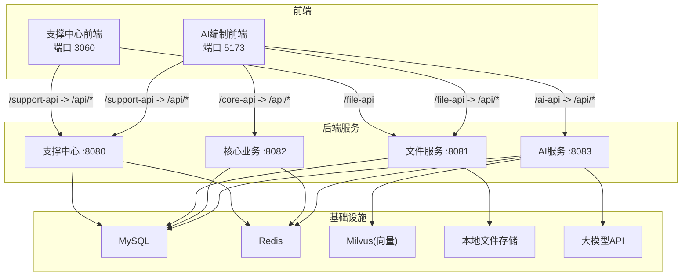
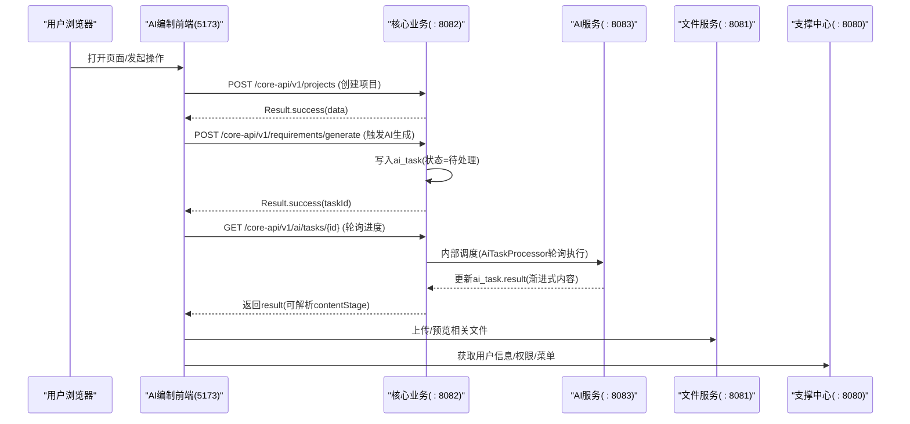
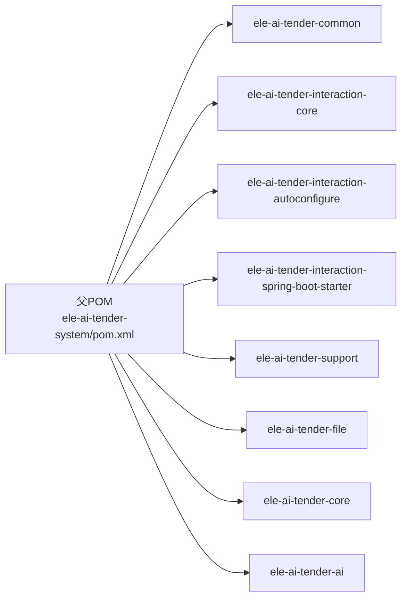

# 贡献指南

<cite>
**本文引用的文件**   
- [CLAUDE.md](file://CLAUDE.md)
- [PROJECT_SPEC_FINAL.md](file://docs/rules/PROJECT_SPEC_FINAL.md)
- [CODE_CONVENTIONS.md](file://docs/rules/CODE_CONVENTIONS.md)
- [FRONTEND_CONVENTIONS.md](file://docs/rules/FRONTEND_CONVENTIONS.md)
- [ele-ai-tender-support-frontend README.md](file://ele-ai-tender-support-frontend/README.md)
- [ele-ai-tender-frontend package.json](file://ele-ai-tender-frontend/package.json)
- [ele-ai-tender-system/pom.xml](file://ele-ai-tender-system/pom.xml)
</cite>

## 目录
1. [简介](#简介)
2. [项目结构](#项目结构)
3. [核心组件](#核心组件)
4. [架构总览](#架构总览)
5. [详细组件分析](#详细组件分析)
6. [依赖分析](#依赖分析)
7. [性能考虑](#性能考虑)
8. [故障排查指南](#故障排查指南)
9. [结论](#结论)
10. [附录](#附录)

## 简介
本贡献指南面向希望参与“招标文件AI编制系统”开发的贡献者，涵盖环境搭建、代码克隆与启动、代码贡献流程、代码质量标准、文档贡献规范、问题报告与功能请求流程、社区行为准则与沟通渠道等内容。目标是帮助新贡献者快速融入并高效协作。

## 项目结构
仓库采用前后端分离与多模块后端架构：
- 前端双应用：支撑中心管理后台（端口 3060）与 AI 编制业务前端（端口 5173），均基于 Vue 3 + TypeScript + Vite + Pinia + Element Plus。
- 后端 Maven 多模块：common、common-interaction、interaction、support、file、core、ai 等模块，分别承担公共库、交互协议、接入 Starter、支撑中心、文件服务、核心业务与 AI 能力。
- 基础设施：MySQL、Redis、Milvus（向量数据库）、本地文件存储与大模型 API。

图表来源
- [CLAUDE.md:101-116](file://CLAUDE.md#L101-L116)
- [FRONTEND_CONVENTIONS.md:27-44](file://docs/rules/FRONTEND_CONVENTIONS.md#L27-L44)

章节来源
- [CLAUDE.md:1-192](file://CLAUDE.md#L1-L192)
- [PROJECT_SPEC_FINAL.md:1-91](file://docs/rules/PROJECT_SPEC_FINAL.md#L1-L91)

## 核心组件
- 支撑中心（support）：认证、用户/角色/菜单、模板、模型配置与路由、消息、日志、版本管理等。
- 文件服务（file）：文件上传/下载/查询/删除、文档生成引擎（Markdown→Word）。
- 核心业务（core）：项目管理、需求编制、AI任务编排、检测管理、评审项、文档集成、消息、政策文件、项目模板快照等。
- AI服务（ai）：AI对话、知识库管理、文档匹配、智能检测、模型路由、连通性测试。
- 公共库（common/common-interaction/interaction）：通用实体、工具类、异常、统一响应；对外交互协议 DTO/SPI/路径常量；第三方接入 Starter。

章节来源
- [CLAUDE.md:17-28](file://CLAUDE.md#L17-L28)
- [PROJECT_SPEC_FINAL.md:15-27](file://docs/rules/PROJECT_SPEC_FINAL.md#L15-L27)

## 架构总览
整体为前后端分离的多服务架构，前端通过代理将不同前缀的请求转发到对应后端服务；后端服务之间通过异步任务表解耦（core 写入 ai_task，ai 处理完成后 core 读取结果），避免直接 HTTP 耦合。

图表来源
- [CLAUDE.md:101-116](file://CLAUDE.md#L101-L116)
- [FRONTEND_CONVENTIONS.md:27-44](file://docs/rules/FRONTEND_CONVENTIONS.md#L27-L44)

## 详细组件分析

### 开发环境与本地启动
- 前置条件
  - JDK 21（Spring Boot 3.2.2 要求）
  - Node.js（用于前端构建与运行）
  - MySQL、Redis、Milvus 已就绪（或按本地配置覆盖）
- 后端启动
  - 在 ele-ai-tender-system 目录下安装依赖模块
  - 在各子模块下分别启动 support/file/core/ai
- 前端启动
  - 支撑中心前端：npm install → npm run dev（默认端口 3060）
  - AI编制前端：npm install → npm run dev（默认端口 5173）
- 打包
  - 后端：mvn package（在父 POM 指定模块打包）
  - 前端：npm run build

章节来源
- [CLAUDE.md:68-100](file://CLAUDE.md#L68-L100)
- [ele-ai-tender-support-frontend README.md:16-35](file://ele-ai-tender-support-frontend/README.md#L16-L35)
- [ele-ai-tender-frontend package.json:6-12](file://ele-ai-tender-frontend/package.json#L6-L12)
- [ele-ai-tender-system/pom.xml:225-258](file://ele-ai-tender-system/pom.xml#L225-L258)

### 代码贡献流程（Fork → 分支 → 提交 → PR）
- Fork 仓库到你的账号
- 创建功能分支（建议以 feature/xxx 命名）
- 提交代码遵循编码规范与单测要求
- 推送分支后发起 Pull Request，填写变更说明与影响范围
- 等待审查与 CI 检查通过后合并

提示
- 提交前检查：前端 npm run build；后端 mvn clean test
- common 模块变更后需重新 install 并 clean compile 依赖模块

章节来源
- [CLAUDE.md:99-99](file://CLAUDE.md#L99-L99)
- [CLAUDE.md:92-98](file://CLAUDE.md#L92-L98)

### 代码质量标准
- 后端编码规范
  - 包结构与分层职责（Controller/Service/Mapper/DTO/Entity/Enum/Util）
  - 接口风格（kebab-case、资源复数、HTTP 语义）
  - 统一返回结构（Result/InteractionResult）
  - 分页规范（BasePageRequest + Page<T>）
  - 错误码分配与全局异常处理器
  - 安全（JWT、密码哈希、签名、字符集显式 UTF-8、敏感信息脱敏）
  - 链路追踪（X-Trace-Id、MDC traceId）
- 前端编码规范
  - 双前端架构与代理规则
  - 组件与状态管理（Vue 3 script setup、Pinia）
  - API 调用集中化（src/api/）
  - 常用组合式函数与工具（任务轮询、阶段推进、AI替换、渐进式渲染）
  - 第三方库使用约定

章节来源
- [CODE_CONVENTIONS.md:1-393](file://docs/rules/CODE_CONVENTIONS.md#L1-L393)
- [FRONTEND_CONVENTIONS.md:1-70](file://docs/rules/FRONTEND_CONVENTIONS.md#L1-L70)

### 静态分析与代码审查
- 静态分析
  - 后端：Maven Surefire 插件执行单元测试；编译期 Lombok 注解处理
  - 前端：TypeScript 类型检查（vue-tsc）与构建（vite build）
- 代码审查
  - 所有变更需通过 PR 审查，关注是否符合规范、是否引入回归、是否完善单测与文档
  - 涉及公共库（common）或交互协议（common-interaction）的变更需特别谨慎，确保向后兼容

章节来源
- [ele-ai-tender-system/pom.xml:251-256](file://ele-ai-tender-system/pom.xml#L251-L256)
- [ele-ai-tender-frontend package.json:10-11](file://ele-ai-tender-frontend/package.json#L10-L11)
- [CLAUDE.md:99-99](file://CLAUDE.md#L99-L99)

### 文档贡献规范
- 文档目录治理
  - docs/rules：权威规范（编码、前端、模块规范等）
  - docs/guides：接入指南、接口文档、工具说明
  - docs/projects：需求整理、问题分析
  - docs/plans：实施计划
- 更新流程
  - 先对齐代码再修文档；若实现与文档冲突，以代码为准
  - 新增/修改规范需在 docs/rules 中登记，保持索引一致
- 审核标准
  - 术语与命名与 CODE_CONVENTIONS 保持一致
  - 架构图与流程图需与实际代码/配置映射

章节来源
- [PROJECT_SPEC_FINAL.md:81-91](file://docs/rules/PROJECT_SPEC_FINAL.md#L81-L91)
- [CLAUDE.md:160-172](file://CLAUDE.md#L160-L172)

### 问题报告与功能请求
- Issue 模板与标签分类
  - 建议使用清晰标题与复现步骤，标注模块（support/file/core/ai/前端）与环境信息（JDK/Node/DB/Redis/Milvus）
  - 关联相关规范文档（如检测流程、阶段流程、AI模块规范）
- 处理流程
  - 确认是否为重复问题
  - 最小复现与日志收集（含 X-Trace-Id）
  - 评估影响面与优先级，指派负责人
  - 修复后回归验证并关闭 Issue

[本节为通用流程说明，不直接分析具体文件]

### 社区行为准则与沟通渠道
- 尊重与包容：遵守开源社区基本礼仪，理性讨论分歧
- 透明与协作：在 Issue/PR 中公开讨论，避免私下决策
- 责任与质量：对变更负责，提供必要测试与文档
- 沟通渠道：Issue 用于问题与需求；PR 用于变更；必要时在团队频道同步关键进展

[本节为通用流程说明，不直接分析具体文件]

## 依赖分析
后端采用 Maven 多模块，版本集中在父 POM 的 dependencyManagement 统一管理，子模块仅声明 groupId 与 artifactId，不写 version。

图表来源
- [ele-ai-tender-system/pom.xml:15-23](file://ele-ai-tender-system/pom.xml#L15-L23)
- [ele-ai-tender-system/pom.xml:68-124](file://ele-ai-tender-system/pom.xml#L68-L124)

章节来源
- [ele-ai-tender-system/pom.xml:1-260](file://ele-ai-tender-system/pom.xml#L1-L260)

## 性能考虑
- 合理控制事务边界，避免在事务内调用外部 HTTP 接口
- 只读查询不加回滚事务或使用 readOnly=true
- AI 流式响应注意超时与客户端断开处理
- 向量化过程异步执行，检索 Top-K 合理设置
- Token 用量统计与限流缓存至 Redis

章节来源
- [CODE_CONVENTIONS.md:256-266](file://docs/rules/CODE_CONVENTIONS.md#L256-L266)
- [CORE_MODULE_SPEC.md:246-263](file://docs/rules/CORE_MODULE_SPEC.md#L246-L263)

## 故障排查指南
- 常见问题
  - common 模块变更后未重新 install/clean compile 导致运行时找不到符号
  - 在父 POM 目录执行 spring-boot:run 报错（应在子模块目录执行）
  - JWT 密钥未配置导致启动失败
- 定位方法
  - 查看各服务日志中的 X-Trace-Id
  - 核对代理规则与后端路径重写
  - 检查数据库连接、Redis/Milvus 可达性与凭证

章节来源
- [CLAUDE.md:92-98](file://CLAUDE.md#L92-L98)
- [CLAUDE.md:101-116](file://CLAUDE.md#L101-L116)
- [CODE_CONVENTIONS.md:335-347](file://docs/rules/CODE_CONVENTIONS.md#L335-L347)

## 结论
通过遵循本贡献指南中的环境搭建、贡献流程、代码与文档规范、问题处理与社区协作原则，贡献者可以高效地参与项目开发并确保交付质量。建议在首次贡献前先阅读相关规范文档并在本地完成完整联调。

## 附录
- 技术基线与术语速查见 CLAUDE.md
- 前后端代理与联调见 FRONTEND_CONVENTIONS.md
- 模块清单与端口见 PROJECT_SPEC_FINAL.md

章节来源
- [CLAUDE.md:1-192](file://CLAUDE.md#L1-L192)
- [FRONTEND_CONVENTIONS.md:1-70](file://docs/rules/FRONTEND_CONVENTIONS.md#L1-L70)
- [PROJECT_SPEC_FINAL.md:1-91](file://docs/rules/PROJECT_SPEC_FINAL.md#L1-L91)