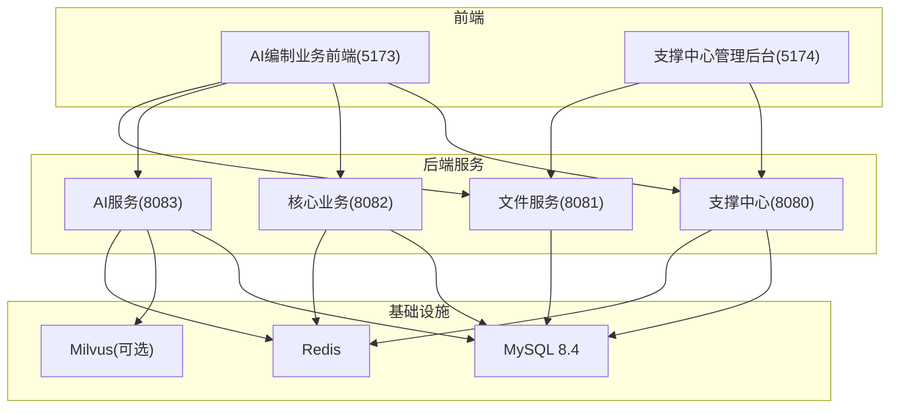
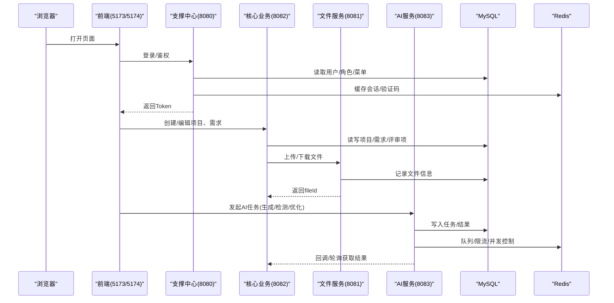
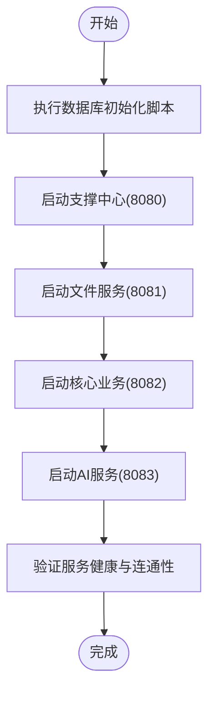
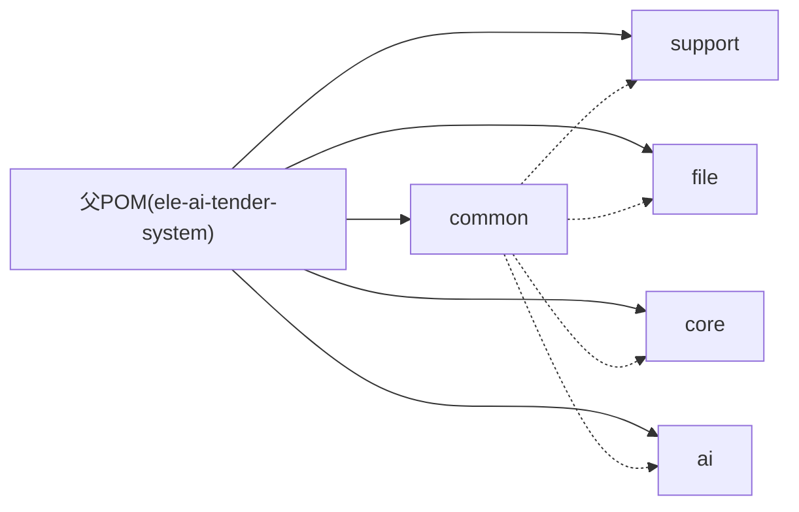

# 快速开始

<cite>
**本文引用的文件**   
- [README.md](file://README.md)
- [ele-ai-tender-system/pom.xml](file://ele-ai-tender-system/pom.xml)
- [ele-ai-tender-support/src/main/resources/application.yml](file://ele-ai-tender-system/ele-ai-tender-support/src/main/resources/application.yml)
- [ele-ai-tender-core/src/main/resources/application.yml](file://ele-ai-tender-system/ele-ai-tender-core/src/main/resources/application.yml)
- [ele-ai-tender-file/src/main/resources/application.yml](file://ele-ai-tender-system/ele-ai-tender-file/src/main/resources/application.yml)
- [ele-ai-tender-ai/src/main/resources/application.yml](file://ele-ai-tender-system/ele-ai-tender-ai/src/main/resources/application.yml)
- [ele-ai-tender-support/sql/init.sql](file://ele-ai-tender-system/ele-ai-tender-support/sql/init.sql)
- [ele-ai-tender-core/sql/init.sql](file://ele-ai-tender-system/ele-ai-tender-core/sql/init.sql)
- [ele-ai-tender-file/sql/init.sql](file://ele-ai-tender-system/ele-ai-tender-file/sql/init.sql)
- [ele-ai-tender-ai/sql/init.sql](file://ele-ai-tender-system/ele-ai-tender-ai/sql/init.sql)
- [ele-ai-tender-support/src/main/java/com/jy/eleaitender/support/SupportApplication.java](file://ele-ai-tender-system/ele-ai-tender-support/src/main/java/com/jy/eleaitender/support/SupportApplication.java)
- [ele-ai-tender-core/src/main/java/com/jy/eleaitender/core/CoreApplication.java](file://ele-ai-tender-system/ele-ai-tender-core/src/main/java/com/jy/eleaitender/core/CoreApplication.java)
- [ele-ai-tender-file/src/main/java/com/jy/eleaitender/file/FileApplication.java](file://ele-ai-tender-system/ele-ai-tender-file/src/main/java/com/jy/eleaitender/file/FileApplication.java)
- [ele-ai-tender-ai/src/main/java/com/jy/eleaitender/ai/AiApplication.java](file://ele-ai-tender-system/ele-ai-tender-ai/src/main/java/com/jy/eleaitender/ai/AiApplication.java)
- [ele-ai-tender-frontend/package.json](file://ele-ai-tender-frontend/package.json)
- [ele-ai-tender-support-frontend/package.json](file://ele-ai-tender-support-frontend/package.json)
</cite>

## 目录
1. [简介](#简介)
2. [项目结构](#项目结构)
3. [核心组件](#核心组件)
4. [架构总览](#架构总览)
5. [详细组件分析](#详细组件分析)
6. [依赖分析](#依赖分析)
7. [性能考虑](#性能考虑)
8. [故障排查指南](#故障排查指南)
9. [结论](#结论)
10. [附录](#附录)

## 简介
本指南面向首次接触“招标文件AI编制系统”的开发者，提供从零到一的环境搭建、后端微服务启动、前端构建运行、数据库初始化与基础数据准备，以及常见问题排查方法。通过本指南，你将能够在本地快速拉起支撑中心、文件服务、核心业务与AI服务，并运行主应用与管理后台，完成端到端联调。

## 项目结构
仓库采用前后端分离与多模块后端架构：
- 前端
  - AI编制业务前端（端口 5173）
  - 支撑中心管理后台（端口 5174）
- 后端（Maven 多模块）
  - common：公共实体、工具类、异常、统一响应
  - support：认证、用户、角色、菜单、模板、知识库、统计分析、消息中心、操作日志等
  - file：文件上传/下载/查询/删除
  - core：项目管理、需求编制、评审项、文档生成
  - ai：AI助手、知识库检索、智能检测、模型路由
- 文档与规范位于 docs 目录

图表来源
- [ele-ai-tender-support/src/main/resources/application.yml:1-68](file://ele-ai-tender-system/ele-ai-tender-support/src/main/resources/application.yml#L1-L68)
- [ele-ai-tender-core/src/main/resources/application.yml:1-59](file://ele-ai-tender-system/ele-ai-tender-core/src/main/resources/application.yml#L1-L59)
- [ele-ai-tender-file/src/main/resources/application.yml:1-63](file://ele-ai-tender-system/ele-ai-tender-file/src/main/resources/application.yml#L1-L63)
- [ele-ai-tender-ai/src/main/resources/application.yml:1-72](file://ele-ai-tender-system/ele-ai-tender-ai/src/main/resources/application.yml#L1-L72)

章节来源
- [README.md:1-167](file://README.md#L1-L167)

## 核心组件
- 支撑中心（8080）
  - 负责认证授权、RBAC权限、系统参数、模板与知识库管理、消息中心、操作日志等
  - 默认连接 MySQL 与 Redis，支持内部文件服务客户端
- 文件服务（8081）
  - 通用文件上传/下载/查询/删除，最大文件大小 500MB，存储路径可配置
- 核心业务（8082）
  - 项目管理、需求编制、评审项、文档生成；调用 AI 服务进行增强
- AI服务（8083）
  - AI助手、知识库检索、智能检测、模型路由；可选接入 Milvus 向量库

章节来源
- [ele-ai-tender-support/src/main/resources/application.yml:11-27](file://ele-ai-tender-system/ele-ai-tender-support/src/main/resources/application.yml#L11-L27)
- [ele-ai-tender-file/src/main/resources/application.yml:16-31](file://ele-ai-tender-system/ele-ai-tender-file/src/main/resources/application.yml#L16-L31)
- [ele-ai-tender-core/src/main/resources/application.yml:11-27](file://ele-ai-tender-system/ele-ai-tender-core/src/main/resources/application.yml#L11-L27)
- [ele-ai-tender-ai/src/main/resources/application.yml:11-27](file://ele-ai-tender-system/ele-ai-tender-ai/src/main/resources/application.yml#L11-L27)

## 架构总览
下图展示了前后端与服务之间的请求流向与关键依赖关系。

图表来源
- [ele-ai-tender-support/src/main/resources/application.yml:11-27](file://ele-ai-tender-system/ele-ai-tender-support/src/main/resources/application.yml#L11-L27)
- [ele-ai-tender-core/src/main/resources/application.yml:11-27](file://ele-ai-tender-system/ele-ai-tender-core/src/main/resources/application.yml#L11-L27)
- [ele-ai-tender-file/src/main/resources/application.yml:16-31](file://ele-ai-tender-system/ele-ai-tender-file/src/main/resources/application.yml#L16-L31)
- [ele-ai-tender-ai/src/main/resources/application.yml:11-27](file://ele-ai-tender-system/ele-ai-tender-ai/src/main/resources/application.yml#L11-L27)

## 详细组件分析

### 环境准备与安装
- JDK 21
  - 后端基于 Spring Boot 3.2.x，要求 JDK 21
- Maven
  - 用于构建与运行后端多模块工程
- MySQL 8.4
  - 所有服务共用数据库 ele_ai_tender，各模块表前缀不同
- Redis
  - 支撑中心、核心业务、AI服务均使用 Redis（默认 db=6）
- Milvus（可选）
  - AI服务知识库向量化检索需要 Milvus（默认 host/port/db 见配置）

章节来源
- [ele-ai-tender-system/pom.xml:25-66](file://ele-ai-tender-system/pom.xml#L25-L66)
- [ele-ai-tender-support/src/main/resources/application.yml:16-27](file://ele-ai-tender-system/ele-ai-tender-support/src/main/resources/application.yml#L16-L27)
- [ele-ai-tender-core/src/main/resources/application.yml:16-27](file://ele-ai-tender-system/ele-ai-tender-core/src/main/resources/application.yml#L16-L27)
- [ele-ai-tender-ai/src/main/resources/application.yml:16-27](file://ele-ai-tender-system/ele-ai-tender-ai/src/main/resources/application.yml#L16-L27)
- [ele-ai-tender-ai/src/main/resources/application.yml:50-54](file://ele-ai-tender-system/ele-ai-tender-ai/src/main/resources/application.yml#L50-L54)

### 数据库初始化与基础数据
按顺序执行以下脚本，确保数据库与基础数据就绪：
1) 支撑中心脚本（包含 RBAC、系统参数、菜单、模板、模型配置等）
   - 路径：[ele-ai-tender-support/sql/init.sql](file://ele-ai-tender-system/ele-ai-tender-support/sql/init.sql)
2) AI服务脚本（AI任务、知识库文档、响应记录）
   - 路径：[ele-ai-tender-ai/sql/init.sql](file://ele-ai-tender-system/ele-ai-tender-ai/sql/init.sql)
3) 核心业务脚本（项目、需求、评审项、检测记录等）
   - 路径：[ele-ai-tender-core/sql/init.sql](file://ele-ai-tender-system/ele-ai-tender-core/sql/init.sql)
4) 文件服务脚本（文件信息表）
   - 路径：[ele-ai-tender-file/sql/init.sql](file://ele-ai-tender-system/ele-ai-tender-file/sql/init.sql)

说明
- 所有脚本默认在数据库 ele_ai_tender 下建表
- 支撑中心脚本已内置管理员与业务用户、菜单与权限、系统参数等基础数据
- 若独立部署文件服务且需访问日志，可按注释启用 sup_access_log 建表语句

章节来源
- [ele-ai-tender-support/sql/init.sql:1-682](file://ele-ai-tender-system/ele-ai-tender-support/sql/init.sql#L1-L682)
- [ele-ai-tender-ai/sql/init.sql:1-119](file://ele-ai-tender-system/ele-ai-tender-ai/sql/init.sql#L1-L119)
- [ele-ai-tender-core/sql/init.sql:1-246](file://ele-ai-tender-system/ele-ai-tender-core/sql/init.sql#L1-L246)
- [ele-ai-tender-file/sql/init.sql:1-80](file://ele-ai-tender-system/ele-ai-tender-file/sql/init.sql#L1-L80)

### 后端服务启动流程
建议启动顺序：支撑中心 → 文件服务 → 核心业务 → AI服务

- 支撑中心（8080）
  - 启动类：[SupportApplication.java](file://ele-ai-tender-system/ele-ai-tender-support/src/main/java/com/jy/eleaitender/support/SupportApplication.java)
  - 关键配置：数据源、Redis、JWT、内部文件服务地址
- 文件服务（8081）
  - 启动类：[FileApplication.java](file://ele-ai-tender-system/ele-ai-tender-file/src/main/java/com/jy/eleaitender/file/FileApplication.java)
  - 关键配置：multipart大小限制、文件存储路径、允许类型
- 核心业务（8082）
  - 启动类：[CoreApplication.java](file://ele-ai-tender-system/ele-ai-tender-core/src/main/java/com/jy/eleaitender/core/CoreApplication.java)
  - 关键配置：数据源、Redis、内部文件服务地址
- AI服务（8083）
  - 启动类：[AiApplication.java](file://ele-ai-tender-system/ele-ai-tender-ai/src/main/java/com/jy/eleaitender/ai/AiApplication.java)
  - 关键配置：数据源、Redis、OpenAI兼容接口、Milvus

图表来源
- [ele-ai-tender-support/src/main/java/com/jy/eleaitender/support/SupportApplication.java:1-21](file://ele-ai-tender-system/ele-ai-tender-support/src/main/java/com/jy/eleaitender/support/SupportApplication.java#L1-L21)
- [ele-ai-tender-file/src/main/java/com/jy/eleaitender/file/FileApplication.java:1-18](file://ele-ai-tender-system/ele-ai-tender-file/src/main/java/com/jy/eleaitender/file/FileApplication.java#L1-L18)
- [ele-ai-tender-core/src/main/java/com/jy/eleaitender/core/CoreApplication.java:1-24](file://ele-ai-tender-system/ele-ai-tender-core/src/main/java/com/jy/eleaitender/core/CoreApplication.java#L1-L24)
- [ele-ai-tender-ai/src/main/java/com/jy/eleaitender/ai/AiApplication.java:1-26](file://ele-ai-tender-system/ele-ai-tender-ai/src/main/java/com/jy/eleaitender/ai/AiApplication.java#L1-L26)

章节来源
- [ele-ai-tender-support/src/main/resources/application.yml:1-68](file://ele-ai-tender-system/ele-ai-tender-support/src/main/resources/application.yml#L1-L68)
- [ele-ai-tender-file/src/main/resources/application.yml:1-63](file://ele-ai-tender-system/ele-ai-tender-file/src/main/resources/application.yml#L1-L63)
- [ele-ai-tender-core/src/main/resources/application.yml:1-59](file://ele-ai-tender-system/ele-ai-tender-core/src/main/resources/application.yml#L1-L59)
- [ele-ai-tender-ai/src/main/resources/application.yml:1-72](file://ele-ai-tender-system/ele-ai-tender-ai/src/main/resources/application.yml#L1-L72)

### 前端应用构建与运行
- 主应用（AI编制业务前端，端口 5173）
  - 安装依赖：npm install
  - 开发模式：npm run dev
  - 构建产物：npm run build
- 管理后台（支撑中心前端，端口 5174）
  - 安装依赖：npm install
  - 开发模式：npm run dev
  - 构建产物：npm run build

注意
- 开发模式下，前端通过 Vite 代理将 /core-api、/ai-api、/support-api、/file-api 转发至对应后端服务
- 生产部署时，请根据实际域名与网关规则调整代理或静态资源路径

章节来源
- [ele-ai-tender-frontend/package.json:1-49](file://ele-ai-tender-frontend/package.json#L1-L49)
- [ele-ai-tender-support-frontend/package.json:1-35](file://ele-ai-tender-support-frontend/package.json#L1-L35)
- [README.md:90-122](file://README.md#L90-L122)

### 关键配置要点与环境变量
- 数据库连接
  - 支撑中心/核心业务/AI服务均通过环境变量覆盖 JDBC URL、用户名、密码
- Redis
  - 支撑中心/核心业务/AI服务通过环境变量覆盖 host、port、database、password
- JWT
  - 各服务共享 APP_JWT_SECRET，保证跨服务鉴权一致
- 内部文件服务
  - 支撑中心/核心业务/AI服务通过 INTERNAL_FILE_SERVICE_URL 指向文件服务
- 文件存储
  - 文件服务通过 FILE_STORAGE_BASE_PATH 指定本地存储根目录
- AI 模型
  - AI服务通过 DEEPSEEK_API_KEY、DEEPSEEK_BASE_URL 配置 OpenAI 兼容接口
- Milvus
  - AI服务通过 MILVUS_HOST/MILVUS_PORT/MILVUS_DATABASE 配置向量库

章节来源
- [ele-ai-tender-support/src/main/resources/application.yml:16-27](file://ele-ai-tender-system/ele-ai-tender-support/src/main/resources/application.yml#L16-L27)
- [ele-ai-tender-core/src/main/resources/application.yml:16-27](file://ele-ai-tender-system/ele-ai-tender-core/src/main/resources/application.yml#L16-L27)
- [ele-ai-tender-file/src/main/resources/application.yml:20-31](file://ele-ai-tender-system/ele-ai-tender-file/src/main/resources/application.yml#L20-L31)
- [ele-ai-tender-ai/src/main/resources/application.yml:16-27](file://ele-ai-tender-system/ele-ai-tender-ai/src/main/resources/application.yml#L16-L27)
- [ele-ai-tender-ai/src/main/resources/application.yml:28-35](file://ele-ai-tender-system/ele-ai-tender-ai/src/main/resources/application.yml#L28-L35)
- [ele-ai-tender-ai/src/main/resources/application.yml:50-54](file://ele-ai-tender-system/ele-ai-tender-ai/src/main/resources/application.yml#L50-L54)

## 依赖分析
后端为 Maven 多模块工程，版本由父 POM 统一管理，关键基线如下：
- Java 21
- Spring Boot 3.2.2
- MyBatis-Plus 3.5.5
- MySQL 8.4.0
- Redisson 3.27.2
- Spring AI 1.1.0、Milvus SDK 2.3.3、Apache Tika 2.9.0、poi-tl 1.12.2、flexmark-java 0.64.0

图表来源
- [ele-ai-tender-system/pom.xml:15-23](file://ele-ai-tender-system/pom.xml#L15-L23)
- [ele-ai-tender-system/pom.xml:25-66](file://ele-ai-tender-system/pom.xml#L25-L66)

章节来源
- [ele-ai-tender-system/pom.xml:1-260](file://ele-ai-tender-system/pom.xml#L1-L260)

## 性能考虑
- 文件上传
  - 文件服务默认最大单文件与请求体均为 500MB，可根据磁盘与网络情况调整
- 线程池与并发
  - AI服务具备动态线程池与用户并发控制能力，可通过系统参数或配置调节全局/用户级并发与排队上限
- 缓存与会话
  - 支撑中心使用 Redis 缓存会话与验证码，合理设置过期时间可降低数据库压力
- 日志级别
  - 开发阶段可开启 debug 便于定位问题，生产建议降低日志级别以减少 IO 开销

章节来源
- [ele-ai-tender-file/src/main/resources/application.yml:16-19](file://ele-ai-tender-system/ele-ai-tender-file/src/main/resources/application.yml#L16-L19)
- [ele-ai-tender-support/src/main/resources/application.yml:65-68](file://ele-ai-tender-system/ele-ai-tender-support/src/main/resources/application.yml#L65-L68)
- [ele-ai-tender-core/src/main/resources/application.yml:53-59](file://ele-ai-tender-system/ele-ai-tender-core/src/main/resources/application.yml#L53-L59)
- [ele-ai-tender-ai/src/main/resources/application.yml:66-72](file://ele-ai-tender-system/ele-ai-tender-ai/src/main/resources/application.yml#L66-L72)

## 故障排查指南
- 无法连接数据库
  - 检查 SPRING_DATASOURCE_URL/USERNAME/PASSWORD 是否正确
  - 确认数据库已创建 ele_ai_tender 且已执行对应模块 init.sql
- Redis 连接失败
  - 检查 SPRING_DATA_REDIS_HOST/PORT/DATABASE/PASSWORD
  - 确认 Redis 服务可达且未开启强校验导致拒绝
- 文件上传失败
  - 检查 FILE_STORAGE_BASE_PATH 是否存在且可写
  - 确认 multipart 大小限制与磁盘空间充足
- 内部文件服务不可用
  - 检查 INTERNAL_FILE_SERVICE_URL 是否指向正确的文件服务地址
  - 确认文件服务已启动且端口可达
- AI 服务不可用
  - 检查 DEEPSEEK_API_KEY/DEEPSEEK_BASE_URL 配置
  - 如启用 Milvus，检查 MILVUS_* 配置与连接
- 前端无法访问后端
  - 确认 Vite 代理路径与后端端口一致
  - 检查跨域与网关转发规则

章节来源
- [ele-ai-tender-support/src/main/resources/application.yml:16-27](file://ele-ai-tender-system/ele-ai-tender-support/src/main/resources/application.yml#L16-L27)
- [ele-ai-tender-core/src/main/resources/application.yml:16-27](file://ele-ai-tender-system/ele-ai-tender-core/src/main/resources/application.yml#L16-L27)
- [ele-ai-tender-file/src/main/resources/application.yml:16-31](file://ele-ai-tender-system/ele-ai-tender-file/src/main/resources/application.yml#L16-L31)
- [ele-ai-tender-ai/src/main/resources/application.yml:16-35](file://ele-ai-tender-system/ele-ai-tender-ai/src/main/resources/application.yml#L16-L35)
- [ele-ai-tender-ai/src/main/resources/application.yml:50-54](file://ele-ai-tender-system/ele-ai-tender-ai/src/main/resources/application.yml#L50-L54)

## 结论
按照本指南完成环境准备、数据库初始化、后端服务启动与前端构建后，即可在本地完整运行“招标文件AI编制系统”。建议在开发过程中优先保障支撑中心与文件服务的稳定，再逐步引入核心业务与 AI 能力，以便快速定位问题与迭代功能。

## 附录
- 快速命令参考
  - 后端测试与打包：参见 README 中的 Maven 命令
  - 前端开发与构建：参见 package.json 的 scripts
- 常用端口
  - 支撑中心前端：5174
  - AI编制前端：5173
  - 支撑中心：8080
  - 文件服务：8081
  - 核心业务：8082
  - AI服务：8083

章节来源
- [README.md:108-158](file://README.md#L108-L158)
- [ele-ai-tender-frontend/package.json:6-12](file://ele-ai-tender-frontend/package.json#L6-L12)
- [ele-ai-tender-support-frontend/package.json:6-13](file://ele-ai-tender-support-frontend/package.json#L6-L13)