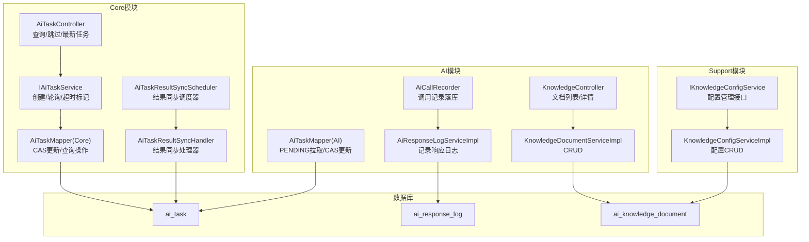
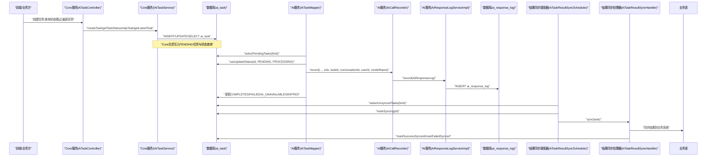
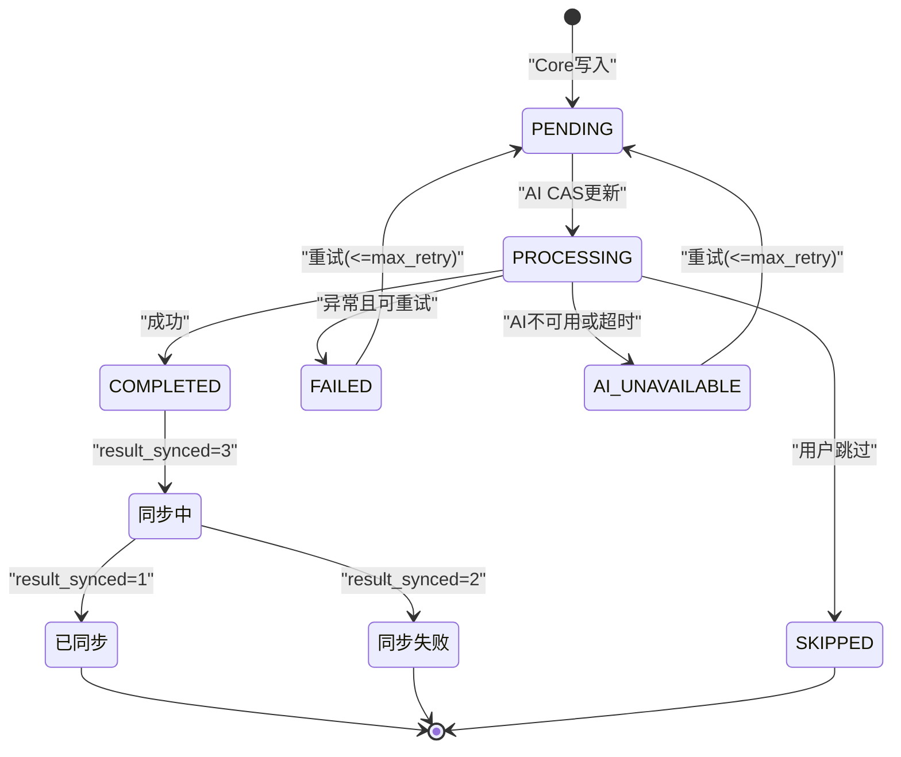
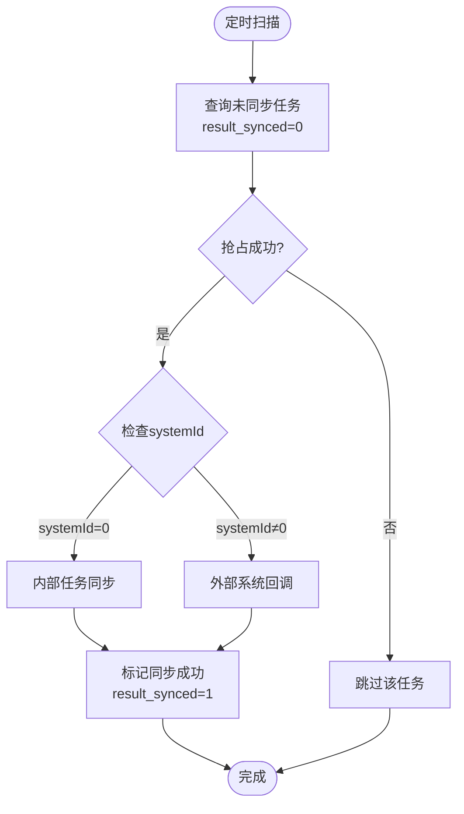
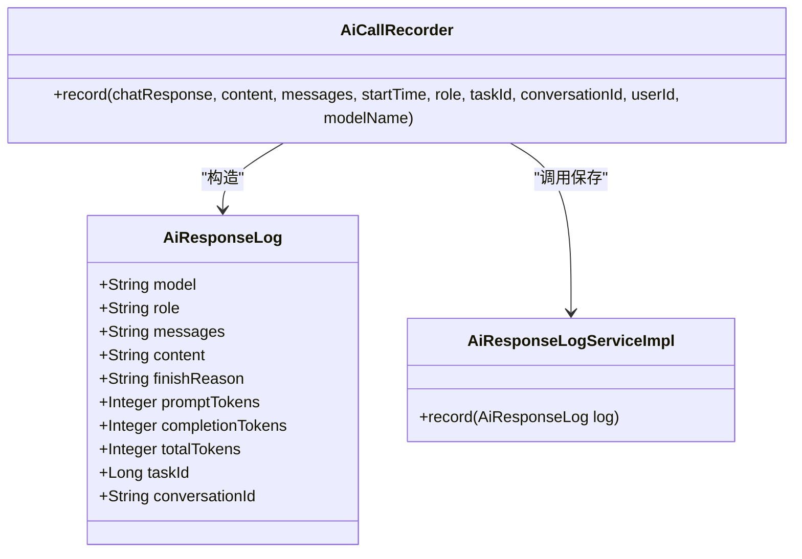
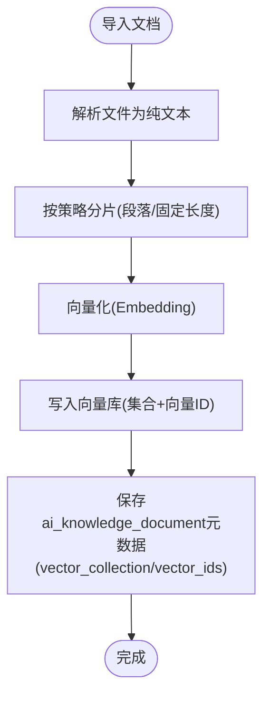
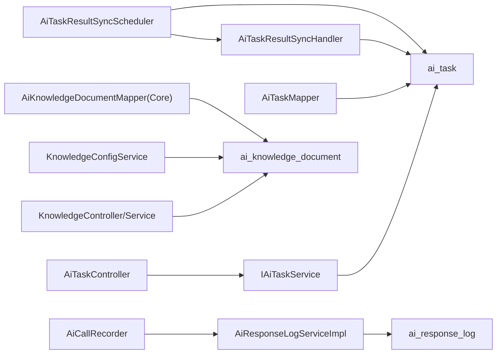

# AI任务相关数据

<cite>
**本文引用的文件**
- [ele-ai-tender-system/ele-ai-tender-ai/sql/init.sql](file://ele-ai-tender-system/ele-ai-tender-ai/sql/init.sql)
- [ele-ai-tender-system/ele-ai-tender-common/src/main/java/com/jy/eleaitender/common/entity/ai/AiTask.java](file://ele-ai-tender-system/ele-ai-tender-common/src/main/java/com/jy/eleaitender/common/entity/ai/AiTask.java)
- [ele-ai-tender-system/ele-ai-tender-common/src/main/java/com/jy/eleaitender/common/entity/ai/AiResponseLog.java](file://ele-ai-tender-system/ele-ai-tender-common/src/main/java/com/jy/eleaitender/common/entity/ai/AiResponseLog.java)
- [ele-ai-tender-system/ele-ai-tender-common/src/main/java/com/jy/eleaitender/common/entity/ai/AiKnowledgeDocument.java](file://ele-ai-tender-system/ele-ai-tender-common/src/main/java/com/jy/eleaitender/common/entity/ai/AiKnowledgeDocument.java)
- [ele-ai-tender-system/ele-ai-tender-common/src/main/java/com/jy/eleaitender/common/enums/AiTaskStatus.java](file://ele-ai-tender-system/ele-ai-tender-common/src/main/java/com/jy/eleaitender/common/enums/AiTaskStatus.java)
- [ele-ai-tender-system/ele-ai-tender-common/src/main/java/com/jy/eleaitender/common/enums/AiTaskType.java](file://ele-ai-tender-system/ele-ai-tender-common/src/main/java/com/jy/eleaitender/common/enums/AiTaskType.java)
- [ele-ai-tender-system/ele-ai-tender-common/src/main/java/com/jy/eleaitender/common/enums/AiTaskSource.java](file://ele-ai-tender-system/ele-ai-tender-common/src/main/java/com/jy/eleaitender/common/enums/AiTaskSource.java)
- [ele-ai-tender-system/ele-ai-tender-common/src/main/java/com/jy/eleaitender/common/enums/BizType.java](file://ele-ai-tender-system/ele-ai-tender-common/src/main/java/com/jy/eleaitender/common/enums/BizType.java)
- [ele-ai-tender-system/ele-ai-tender-common/src/main/java/com/jy/eleaitender/common/exception/AiSyncedException.java](file://ele-ai-tender-system/ele-ai-tender-common/src/main/java/com/jy/eleaitender/common/exception/AiSyncedException.java)
- [ele-ai-tender-system/ele-ai-tender-core/src/main/java/com/jy/eleaitender/core/scheduler/AiTaskResultSyncScheduler.java](file://ele-ai-tender-system/ele-ai-tender-core/src/main/java/com/jy/eleaitender/core/scheduler/AiTaskResultSyncScheduler.java)
- [ele-ai-tender-system/ele-ai-tender-core/src/main/java/com/jy/eleaitender/core/scheduler/AiTaskResultSyncHandler.java](file://ele-ai-tender-system/ele-ai-tender-core/src/main/java/com/jy/eleaitender/core/scheduler/AiTaskResultSyncHandler.java)
- [ele-ai-tender-system/ele-ai-tender-core/src/main/java/com/jy/eleaitender/core/mapper/AiTaskMapper.java](file://ele-ai-tender-system/ele-ai-tender-core/src/main/java/com/jy/eleaitender/core/mapper/AiTaskMapper.java)
- [sql/20260713_bizId字段改为str.sql](file://sql/20260713_bizId字段改为str.sql)
</cite>

## 更新摘要
**变更内容**
- AiTask实体新增systemId字段用于区分内外任务来源
- bizId字段类型从数值改为varchar(64)，支持更灵活的业务ID格式
- 新增AiTaskSource枚举类，明确内部任务和外部任务的来源标识
- 新增BizType枚举类，规范业务类型定义（REQUIREMENT/PROJECT/DOCUMENT/REVIEW_ITEM/DETECTION）
- 新增AiSyncedException异常处理机制，统一AI同步异常处理
- 数据库表结构相应调整，增加system_id字段和biz_id字段类型修改

## 目录
1. [简介](#简介)
2. [项目结构](#项目结构)
3. [核心组件](#核心组件)
4. [架构总览](#架构总览)
5. [详细组件分析](#详细组件分析)
6. [依赖关系分析](#依赖关系分析)
7. [性能考虑](#性能考虑)
8. [故障排查指南](#故障排查指南)
9. [结论](#结论)
10. [附录](#附录)

## 简介
本文件聚焦于AI任务相关数据模型与数据流，围绕以下核心表展开：
- AI任务表（ai_task）
- 响应日志表（ai_response_log）
- 知识文档表（ai_knowledge_document）

内容涵盖：
- 任务状态流转、任务参数存储、结果记录格式
- 向量知识库的数据结构设计、文档分片策略与相似度计算支持
- Spring AI集成时的数据访问模式、异步任务持久化方案
- 成本统计、错误重试机制与数据清理策略的实现指导
- 内外任务区分机制与安全验证

## 项目结构
AI相关数据定义集中在SQL初始化脚本与通用实体类中；任务调度与处理逻辑分布在Core与AI模块；知识库管理在AI与Support模块均有实现。

**图表来源**
- [ele-ai-tender-system/ele-ai-tender-core/src/main/java/com/jy/eleaitender/core/controller/AiTaskController.java:1-51](file://ele-ai-tender-system/ele-ai-tender-core/src/main/java/com/jy/eleaitender/core/controller/AiTaskController.java#L1-L51)
- [ele-ai-tender-system/ele-ai-tender-core/src/main/java/com/jy/eleaitender/core/service/IAiTaskService.java:1-43](file://ele-ai-tender-system/ele-ai-tender-core/src/main/java/com/jy/eleaitender/core/service/IAiTaskService.java#L1-L43)
- [ele-ai-tender-system/ele-ai-tender-core/src/main/java/com/jy/eleaitender/core/scheduler/AiTaskResultSyncScheduler.java:17-71](file://ele-ai-tender-system/ele-ai-tender-core/src/main/java/com/jy/eleaitender/core/scheduler/AiTaskResultSyncScheduler.java#L17-L71)
- [ele-ai-tender-system/ele-ai-tender-core/src/main/java/com/jy/eleaitender/core/mapper/AiTaskMapper.java:1-113](file://ele-ai-tender-system/ele-ai-tender-core/src/main/java/com/jy/eleaitender/core/mapper/AiTaskMapper.java#L1-L113)
- [ele-ai-tender-system/ele-ai-tender-ai/src/main/java/com/jy/eleaitender/ai/mapper/AiTaskMapper.java:1-40](file://ele-ai-tender-system/ele-ai-tender-ai/src/main/java/com/jy/eleaitender/ai/mapper/AiTaskMapper.java#L1-L40)

章节来源
- [ele-ai-tender-system/ele-ai-tender-ai/sql/init.sql:1-119](file://ele-ai-tender-system/ele-ai-tender-ai/sql/init.sql#L1-L119)

## 核心组件
- AI任务表（ai_task）
  - 作用：承载AI任务的元信息、参数、状态、结果与重试控制
  - 关键字段：task_type、system_id、project_id、biz_id、biz_type、request_params、file_ids、status、result、error_msg、retry_count、max_retry、started_at、completed_at、timeout_minutes、result_synced、synced_at
  - 索引：idx_status、idx_project、idx_biz、idx_task_type_status
- 响应日志表（ai_response_log）
  - 作用：记录每次AI模型调用的请求/响应、token消耗、完成原因等
  - 关键字段：model、role、messages、content、finish_reason、prompt_tokens、completion_tokens、total_tokens、task_id、conversation_id
  - 索引：idx_task_id、idx_conversation_id、idx_role、idx_create_time、idx_model
- 知识文档表（ai_knowledge_document）
  - 作用：知识库文档元信息与文本内容、向量集合与ID映射
  - 关键字段：doc_name、doc_category、file_id、file_type、content、vector_collection、vector_ids、status
  - 索引：idx_category、idx_status、idx_file_id

章节来源
- [ele-ai-tender-system/ele-ai-tender-ai/sql/init.sql:17-46](file://ele-ai-tender-system/ele-ai-tender-ai/sql/init.sql#L17-L46)
- [ele-ai-tender-system/ele-ai-tender-ai/sql/init.sql:51-73](file://ele-ai-tender-system/ele-ai-tender-ai/sql/init.sql#L51-L73)
- [ele-ai-tender-system/ele-ai-tender-ai/sql/init.sql:79-105](file://ele-ai-tender-system/ele-ai-tender-ai/sql/init.sql#L79-L105)

## 架构总览
AI任务从Core侧创建并写入ai_task，AI侧通过定时或轮询拉取待处理任务，使用CAS更新为处理中，执行完成后写回结果与耗时；同时通过AiCallRecorder将每次模型调用写入ai_response_log用于成本与可观测性分析。知识库文档由AI或Support模块维护，关联外部向量库（如Milvus）的集合与向量ID。系统通过systemId字段区分内外任务来源，并通过AiTaskResultSyncScheduler定时调度结果同步到业务系统。

**图表来源**
- [ele-ai-tender-system/ele-ai-tender-core/src/main/java/com/jy/eleaitender/core/controller/AiTaskController.java:1-51](file://ele-ai-tender-system/ele-ai-tender-core/src/main/java/com/jy/eleaitender/core/controller/AiTaskController.java#L1-L51)
- [ele-ai-tender-system/ele-ai-tender-core/src/main/java/com/jy/eleaitender/core/service/IAiTaskService.java:1-43](file://ele-ai-tender-system/ele-ai-tender-core/src/main/java/com/jy/eleaitender/core/service/IAiTaskService.java#L1-L43)
- [ele-ai-tender-system/ele-ai-tender-core/src/main/java/com/jy/eleaitender/core/scheduler/AiTaskResultSyncScheduler.java:33-71](file://ele-ai-tender-system/ele-ai-tender-core/src/main/java/com/jy/eleaitender/core/scheduler/AiTaskResultSyncScheduler.java#L33-L71)
- [ele-ai-tender-system/ele-ai-tender-core/src/main/java/com/jy/eleaitender/core/scheduler/AiTaskResultSyncHandler.java:71-100](file://ele-ai-tender-system/ele-ai-tender-core/src/main/java/com/jy/eleaitender/core/scheduler/AiTaskResultSyncHandler.java#L71-L100)
- [ele-ai-tender-system/ele-ai-tender-core/src/main/java/com/jy/eleaitender/core/mapper/AiTaskMapper.java:75-110](file://ele-ai-tender-system/ele-ai-tender-core/src/main/java/com/jy/eleaitender/core/mapper/AiTaskMapper.java#L75-L110)

## 详细组件分析

### AI任务表（ai_task）设计
- 任务类型与参数
  - AiTaskType定义了多种任务类型（需求生成、评审项生成、检测、文本优化等），每个类型附带默认超时时间与参数类约束（AiTaskParams）。
  - request_params字段以JSON形式存储具体任务参数，便于扩展不同任务类型的入参结构。
- 任务来源区分
  - systemId字段用于区分内外任务来源，配合AiTaskSource枚举（INTERNAL/EXTERNAL）实现任务来源标识
  - 内部任务systemId为0，外部任务systemId为对应的外部系统标识
- 业务ID灵活性
  - bizId字段类型从数值改为varchar(64)，支持更灵活的业务ID格式，兼容外部系统的各种ID格式
  - bizType字段使用BizType枚举（REQUIREMENT/PROJECT/DOCUMENT/REVIEW_ITEM/DETECTION）规范业务类型
- 状态机与终态
  - AiTaskStatus定义了PENDING/PROCESSING/COMPLETED/FAILED/AI_UNAVAILABLE/SKIPPED六种状态，并提供isTerminal与isRetryable方法辅助流程控制。
  - 终态包括已完成、失败、不可用与已跳过；可重试状态为失败与不可用。
- 并发与幂等
  - AI侧通过CAS更新（旧状态=新状态条件）确保同一任务不会被重复消费。
- 结果与错误
  - result字段保存执行结果（JSON），error_msg记录错误信息，便于问题定位与重试策略。
- 重试与超时
  - retry_count与max_retry控制重试次数；timeout_minutes配合定时任务标记超时为AI_UNAVAILABLE。
- 结果同步机制
  - result_synced字段跟踪结果同步状态（0-未同步 1-已同步 2-同步失败 3-同步中）
  - syncedAt字段记录同步时间，配合AiTaskResultSyncScheduler实现异步结果同步

**图表来源**
- [ele-ai-tender-system/ele-ai-tender-common/src/main/java/com/jy/eleaitender/common/enums/AiTaskStatus.java:1-46](file://ele-ai-tender-system/ele-ai-tender-common/src/main/java/com/jy/eleaitender/common/enums/AiTaskStatus.java#L1-L46)
- [ele-ai-tender-system/ele-ai-tender-common/src/main/java/com/jy/eleaitender/common/enums/AiTaskType.java:1-52](file://ele-ai-tender-system/ele-ai-tender-common/src/main/java/com/jy/eleaitender/common/enums/AiTaskType.java#L1-L52)
- [ele-ai-tender-system/ele-ai-tender-core/src/main/java/com/jy/eleaitender/core/mapper/AiTaskMapper.java:23-37](file://ele-ai-tender-system/ele-ai-tender-core/src/main/java/com/jy/eleaitender/core/mapper/AiTaskMapper.java#L23-L37)

章节来源
- [ele-ai-tender-system/ele-ai-tender-ai/sql/init.sql:17-46](file://ele-ai-tender-system/ele-ai-tender-ai/sql/init.sql#L17-L46)
- [ele-ai-tender-system/ele-ai-tender-common/src/main/java/com/jy/eleaitender/common/entity/ai/AiTask.java:18-82](file://ele-ai-tender-system/ele-ai-tender-common/src/main/java/com/jy/eleaitender/common/entity/ai/AiTask.java#L18-L82)
- [ele-ai-tender-system/ele-ai-tender-common/src/main/java/com/jy/eleaitender/common/enums/AiTaskSource.java:9-29](file://ele-ai-tender-system/ele-ai-tender-common/src/main/java/com/jy/eleaitender/common/enums/AiTaskSource.java#L9-L29)
- [ele-ai-tender-system/ele-ai-tender-common/src/main/java/com/jy/eleaitender/common/enums/BizType.java:9-32](file://ele-ai-tender-system/ele-ai-tender-common/src/main/java/com/jy/eleaitender/common/enums/BizType.java#L9-L32)
- [ele-ai-tender-system/ele-ai-tender-common/src/main/java/com/jy/eleaitender/common/enums/AiTaskStatus.java:1-46](file://ele-ai-tender-system/ele-ai-tender-common/src/main/java/com/jy/eleaitender/common/enums/AiTaskStatus.java#L1-L46)
- [ele-ai-tender-system/ele-ai-tender-common/src/main/java/com/jy/eleaitender/common/enums/AiTaskType.java:1-52](file://ele-ai-tender-system/ele-ai-tender-common/src/main/java/com/jy/eleaitender/common/enums/AiTaskType.java#L1-L52)

### 任务来源区分机制
- 内外任务标识
  - systemId字段区分任务来源：内部任务systemId=0，外部任务systemId=外部系统标识
  - AiTaskSource枚举提供INTERNAL和EXTERNAL两种任务来源类型
- 业务类型规范化
  - BizType枚举规范业务类型：REQUIREMENT（需求）、PROJECT（项目）、DOCUMENT（文档）、REVIEW_ITEM（评审项）、DETECTION（检测）
  - 替代原有的字符串类型bizType，提供更强的类型安全性
- 业务ID灵活性
  - bizId字段从数值类型改为varchar(64)，支持外部系统的各种ID格式
  - 兼容UUID、字符串编码等多种业务ID格式

章节来源
- [ele-ai-tender-system/ele-ai-tender-common/src/main/java/com/jy/eleaitender/common/entity/ai/AiTask.java:27-37](file://ele-ai-tender-system/ele-ai-tender-common/src/main/java/com/jy/eleaitender/common/entity/ai/AiTask.java#L27-L37)
- [ele-ai-tender-system/ele-ai-tender-common/src/main/java/com/jy/eleaitender/common/enums/AiTaskSource.java:11-18](file://ele-ai-tender-system/ele-ai-tender-common/src/main/java/com/jy/eleaitender/common/enums/AiTaskSource.java#L11-L18)
- [ele-ai-tender-system/ele-ai-tender-common/src/main/java/com/jy/eleaitender/common/enums/BizType.java:11-21](file://ele-ai-tender-system/ele-ai-tender-common/src/main/java/com/jy/eleaitender/common/enums/BizType.java#L11-L21)

### 结果同步机制
- 同步调度器
  - AiTaskResultSyncScheduler每10秒扫描未同步的终态AI任务
  - 使用markSyncing方法进行任务抢占，防止多实例重复同步
- 同步处理器
  - AiTaskResultSyncHandler根据任务类型分发不同的同步逻辑
  - 内部任务（systemId=0）直接同步到业务表
  - 外部任务（systemId≠0）通过回调机制通知外部系统
- 同步状态跟踪
  - result_synced字段跟踪同步状态：0-未同步 1-已同步 2-同步失败 3-同步中
  - syncedAt字段记录同步时间戳
- 异常处理
  - AiSyncedException统一处理AI同步过程中的异常情况
  - 支持自定义错误码和消息传递

**图表来源**
- [ele-ai-tender-system/ele-ai-tender-core/src/main/java/com/jy/eleaitender/core/scheduler/AiTaskResultSyncScheduler.java:33-71](file://ele-ai-tender-system/ele-ai-tender-core/src/main/java/com/jy/eleaitender/core/scheduler/AiTaskResultSyncScheduler.java#L33-L71)
- [ele-ai-tender-system/ele-ai-tender-core/src/main/java/com/jy/eleaitender/core/scheduler/AiTaskResultSyncHandler.java:71-100](file://ele-ai-tender-system/ele-ai-tender-core/src/main/java/com/jy/eleaitender/core/scheduler/AiTaskResultSyncHandler.java#L71-L100)
- [ele-ai-tender-system/ele-ai-tender-core/src/main/java/com/jy/eleaitender/core/mapper/AiTaskMapper.java:83-110](file://ele-ai-tender-system/ele-ai-tender-core/src/main/java/com/jy/eleaitender/core/mapper/AiTaskMapper.java#L83-L110)

章节来源
- [ele-ai-tender-system/ele-ai-tender-core/src/main/java/com/jy/eleaitender/core/scheduler/AiTaskResultSyncScheduler.java:17-71](file://ele-ai-tender-system/ele-ai-tender-core/src/main/java/com/jy/eleaitender/core/scheduler/AiTaskResultSyncScheduler.java#L17-L71)
- [ele-ai-tender-system/ele-ai-tender-core/src/main/java/com/jy/eleaitender/core/scheduler/AiTaskResultSyncHandler.java:36-100](file://ele-ai-tender-system/ele-ai-tender-core/src/main/java/com/jy/eleaitender/core/scheduler/AiTaskResultSyncHandler.java#L36-L100)
- [ele-ai-tender-system/ele-ai-tender-common/src/main/java/com/jy/eleaitender/common/exception/AiSyncedException.java:10-31](file://ele-ai-tender-system/ele-ai-tender-common/src/main/java/com/jy/eleaitender/common/exception/AiSyncedException.java#L10-L31)
- [ele-ai-tender-system/ele-ai-tender-core/src/main/java/com/jy/eleaitender/core/mapper/AiTaskMapper.java:75-110](file://ele-ai-tender-system/ele-ai-tender-core/src/main/java/com/jy/eleaitender/core/mapper/AiTaskMapper.java#L75-L110)

### 响应日志表（ai_response_log）设计与成本统计
- 字段说明
  - model：模型名称
  - role：角色（GENERATION/OPTIMIZATION/DETECTION/CHAT）
  - messages：对话消息（JSON）
  - content：AI响应内容
  - finish_reason：完成原因
  - prompt_tokens、completion_tokens、total_tokens：Token用量统计
  - task_id：关联任务ID（对话类为空）
  - conversation_id：会话ID（聊天场景）
- 记录时机
  - AiCallRecorder在每次AI调用后组装AiResponseLog并通过AiResponseLogServiceImpl持久化。
- 成本统计
  - 基于total_tokens进行计费统计；可按model、role、task_id、conversation_id维度聚合。
- 容错
  - 记录失败仅打日志，不影响主流程。

**图表来源**
- [ele-ai-tender-system/ele-ai-tender-common/src/main/java/com/jy/eleaitender/common/entity/ai/AiResponseLog.java:1-49](file://ele-ai-tender-system/ele-ai-tender-common/src/main/java/com/jy/eleaitender/common/entity/ai/AiResponseLog.java#L1-L49)
- [ele-ai-tender-system/ele-ai-tender-ai/src/main/java/com/jy/eleaitender/ai/processor/recorder/AiCallRecorder.java:96-149](file://ele-ai-tender-system/ele-ai-tender-ai/src/main/java/com/jy/eleaitender/ai/processor/recorder/AiCallRecorder.java#L96-L149)
- [ele-ai-tender-system/ele-ai-tender-ai/src/main/java/com/jy/eleaitender/ai/service/impl/AiResponseLogServiceImpl.java:1-29](file://ele-ai-tender-system/ele-ai-tender-ai/src/main/java/com/jy/eleaitender/ai/service/impl/AiResponseLogServiceImpl.java#L1-L29)

章节来源
- [ele-ai-tender-system/ele-ai-tender-ai/sql/init.sql:79-105](file://ele-ai-tender-system/ele-ai-tender-ai/sql/init.sql#L79-L105)
- [ele-ai-tender-system/ele-ai-tender-common/src/main/java/com/jy/eleaitender/common/entity/ai/AiResponseLog.java:1-49](file://ele-ai-tender-system/ele-ai-tender-common/src/main/java/com/jy/eleaitender/common/entity/ai/AiResponseLog.java#L1-L49)

### 知识文档表（ai_knowledge_document）与向量库
- 数据结构
  - doc_name/doc_category：文档名称与类别（政策/历史模板/标准规范/其他）
  - file_id/file_type：关联文件服务与类型
  - content：解析后的纯文本内容
  - vector_collection/vector_ids：向量集合名与向量ID列表（JSON）
  - status：ACTIVE/ARCHIVED/PROCESSING/FAILED
- 分片与相似度
  - 建议按doc_category或时间范围对向量集合进行分片（collection命名规则体现分片）
  - 相似度检索通过外部向量库（如Milvus）完成，本地仅保存集合名与向量ID映射
- 管理入口
  - AI模块提供列表与详情接口；Support模块提供完整CRUD能力；Core模块提供只读Mapper供业务查询

[此图为概念流程，不直接映射到具体源码文件]

章节来源
- [ele-ai-tender-system/ele-ai-tender-ai/sql/init.sql:51-73](file://ele-ai-tender-system/ele-ai-tender-ai/sql/init.sql#L51-L73)
- [ele-ai-tender-system/ele-ai-tender-common/src/main/java/com/jy/eleaitender/common/entity/ai/AiKnowledgeDocument.java:1-30](file://ele-ai-tender-system/ele-ai-tender-common/src/main/java/com/jy/eleaitender/common/entity/ai/AiKnowledgeDocument.java#L1-L30)

## 依赖关系分析
- Core与AI解耦
  - Core通过REST暴露任务查询与操作接口；AI通过数据库队列与CAS机制消费任务，避免强耦合。
- 日志与监控
  - AiCallRecorder统一封装AI调用记录，降低各处理器重复代码；AiResponseLogServiceImpl保证记录失败不影响主流程。
- 知识库多模块协作
  - AI模块提供基础列表/详情；Support模块提供完整配置管理；Core模块只读访问。
- 结果同步机制
  - AiTaskResultSyncScheduler定时扫描未同步任务，AiTaskResultSyncHandler处理具体的同步逻辑
  - 支持内部任务直接同步和外部任务回调推送两种模式

**图表来源**
- [ele-ai-tender-system/ele-ai-tender-core/src/main/java/com/jy/eleaitender/core/controller/AiTaskController.java:1-51](file://ele-ai-tender-system/ele-ai-tender-core/src/main/java/com/jy/eleaitender/core/controller/AiTaskController.java#L1-L51)
- [ele-ai-tender-system/ele-ai-tender-core/src/main/java/com/jy/eleaitender/core/service/IAiTaskService.java:1-43](file://ele-ai-tender-system/ele-ai-tender-core/src/main/java/com/jy/eleaitender/core/service/IAiTaskService.java#L1-L43)
- [ele-ai-tender-system/ele-ai-tender-core/src/main/java/com/jy/eleaitender/core/scheduler/AiTaskResultSyncScheduler.java:17-71](file://ele-ai-tender-system/ele-ai-tender-core/src/main/java/com/jy/eleaitender/core/scheduler/AiTaskResultSyncScheduler.java#L17-L71)
- [ele-ai-tender-system/ele-ai-tender-core/src/main/java/com/jy/eleaitender/core/scheduler/AiTaskResultSyncHandler.java:36-100](file://ele-ai-tender-system/ele-ai-tender-core/src/main/java/com/jy/eleaitender/core/scheduler/AiTaskResultSyncHandler.java#L36-L100)

## 性能考虑
- 任务拉取与CAS
  - 使用LIMIT限制批量拉取数量，结合CAS更新避免重复消费与锁竞争。
- 索引优化
  - ai_task：按status、project_id、biz_id+biz_type、task_type+status建立复合索引，提升轮询与查询效率。
  - ai_response_log：按task_id、conversation_id、role、create_time、model建索引，支撑多维统计与回放。
  - ai_knowledge_document：按category、status、file_id建索引，提高筛选与关联查询性能。
- 大字段与JSON
  - request_params/result/messages/content使用LONGTEXT，注意分页与导出时避免全量加载；必要时拆分或归档。
- 异步与批处理
  - 向量入库与文本解析可异步化，减少主流程延迟；批量插入日志与任务结果以提升吞吐。
- 结果同步性能
  - 使用markSyncing方法进行任务抢占，避免多实例重复处理
  - 定时调度器采用固定延迟执行，平衡实时性与性能

## 故障排查指南
- 任务卡住或无进展
  - 检查ai_task.status是否为PROCESSING且长时间未更新；确认是否触发超时标记为AI_UNAVAILABLE。
  - 查看ai_response_log是否存在对应task_id的记录，判断AI调用是否成功。
- 重试风暴
  - 核对retry_count与max_retry；若频繁失败，优先排查AI服务可用性与网络抖动。
- 日志缺失
  - AiResponseLogServiceImpl捕获异常仅记录日志，不会中断主流程；需检查应用日志输出路径与权限。
- 知识库同步失败
  - 关注ai_knowledge_document.status为PROCESSING/FAILED的记录；检查向量库连接与集合权限。
- 结果同步问题
  - 检查result_synced字段状态，确认同步调度器是否正常运行
  - 查看syncedAt字段，确认同步时间戳是否正确更新
  - 检查AiTaskResultSyncScheduler日志，确认任务抢占和同步逻辑是否正常

章节来源
- [ele-ai-tender-system/ele-ai-tender-ai/src/main/java/com/jy/eleaitender/ai/service/impl/AiResponseLogServiceImpl.java:20-29](file://ele-ai-tender-system/ele-ai-tender-ai/src/main/java/com/jy/eleaitender/ai/service/impl/AiResponseLogServiceImpl.java#L20-L29)
- [ele-ai-tender-system/ele-ai-tender-core/src/main/java/com/jy/eleaitender/core/scheduler/AiTaskResultSyncScheduler.java:33-71](file://ele-ai-tender-system/ele-ai-tender-core/src/main/java/com/jy/eleaitender/core/scheduler/AiTaskResultSyncScheduler.java#L33-L71)

## 结论
本数据模型围绕"任务驱动+可观测+安全隔离"的设计思路构建：
- ai_task作为任务队列与状态中枢，配合CAS与重试/超时机制保障可靠性
- ai_response_log提供完整的调用轨迹与成本统计基础
- ai_knowledge_document对接外部向量库，支撑相似检索与知识复用
- 新增的systemId字段和AiTaskSource枚举实现了内外任务的清晰区分
- 改进的bizId字段类型提供了更灵活的业务ID支持
- AiTaskResultSyncScheduler实现了可靠的结果同步机制

建议在后续迭代中完善：
- 任务优先级与资源配额
- 日志归档与冷热分层
- 向量库分片与索引策略优化
- 外部系统认证与限流机制
- 回调推送的监控与告警

## 附录

### Spring AI集成数据访问模式
- 记录器模式
  - 通过AiCallRecorder统一收集ChatResponse与上下文，构造AiResponseLog并持久化。
- 事务边界
  - 任务状态更新与结果落库建议在同一事务内；日志记录采用独立事务或异步落库，避免阻塞主流程。
- 分页与过滤
  - 知识库列表与任务查询均使用分页与条件过滤，避免全表扫描。

章节来源
- [ele-ai-tender-system/ele-ai-tender-ai/src/main/java/com/jy/eleaitender/ai/processor/recorder/AiCallRecorder.java:96-149](file://ele-ai-tender-system/ele-ai-tender-ai/src/main/java/com/jy/eleaitender/ai/processor/recorder/AiCallRecorder.java#L96-L149)
- [ele-ai-tender-system/ele-ai-tender-ai/src/main/java/com/jy/eleaitender/ai/service/impl/AiResponseLogServiceImpl.java:1-29](file://ele-ai-tender-system/ele-ai-tender-ai/src/main/java/com/jy/eleaitender/ai/service/impl/AiResponseLogServiceImpl.java#L1-L29)

### 异步任务处理的数据持久化方案
- 任务生命周期
  - Core写入PENDING -> AI拉取并CAS为PROCESSING -> 执行 -> 更新COMPLETED/FAILED/AI_UNAVAILABLE/SKIPPED
- 结果与日志分离
  - 任务结果写入ai_task.result；调用细节写入ai_response_log，便于独立分析与归档。
- 结果同步流程
  - 定时调度器扫描终态任务 -> 抢占任务 -> 根据systemId选择同步方式 -> 更新同步状态

章节来源
- [ele-ai-tender-system/ele-ai-tender-core/src/main/java/com/jy/eleaitender/core/service/IAiTaskService.java:1-43](file://ele-ai-tender-system/ele-ai-tender-core/src/main/java/com/jy/eleaitender/core/service/IAiTaskService.java#L1-L43)
- [ele-ai-tender-system/ele-ai-tender-core/src/main/java/com/jy/eleaitender/core/scheduler/AiTaskResultSyncScheduler.java:33-71](file://ele-ai-tender-system/ele-ai-tender-core/src/main/java/com/jy/eleaitender/core/scheduler/AiTaskResultSyncScheduler.java#L33-L71)

### 性能监控指标收集
- 任务级
  - 任务数（按状态）、平均处理时长、成功率、重试率、超时率
- 调用级
  - 模型调用次数、tokens总量、平均耗时、失败原因分布
- 知识库
  - 文档入库成功率、向量库写入耗时、集合大小与分片均衡度
- 结果同步监控
  - 同步任务数量、同步成功率、同步耗时、抢占冲突率

### AI调用成本统计
- 依据ai_response_log.total_tokens聚合成本；可按model、role、task_id、conversation_id维度统计。
- 建议增加单价配置与币种字段，以便跨模型对比与预算管控。

章节来源
- [ele-ai-tender-system/ele-ai-tender-ai/sql/init.sql:79-105](file://ele-ai-tender-system/ele-ai-tender-ai/sql/init.sql#L79-L105)
- [ele-ai-tender-system/ele-ai-tender-common/src/main/java/com/jy/eleaitender/common/entity/ai/AiResponseLog.java:1-49](file://ele-ai-tender-system/ele-ai-tender-common/src/main/java/com/jy/eleaitender/common/entity/ai/AiResponseLog.java#L1-L49)

### 错误重试机制
- 触发条件
  - 任务状态为FAILED或AI_UNAVAILABLE且retry_count < max_retry
- 策略建议
  - 指数退避、限流与熔断；区分可重试与不可重试错误；记录重试原因与间隔。
- 同步异常处理
  - AiSyncedException统一处理同步过程中的异常情况
  - 支持自定义错误码和消息传递

章节来源
- [ele-ai-tender-system/ele-ai-tender-common/src/main/java/com/jy/eleaitender/common/enums/AiTaskStatus.java:35-44](file://ele-ai-tender-system/ele-ai-tender-common/src/main/java/com/jy/eleaitender/common/enums/AiTaskStatus.java#L35-L44)
- [ele-ai-tender-system/ele-ai-tender-common/src/main/java/com/jy/eleaitender/common/exception/AiSyncedException.java:10-31](file://ele-ai-tender-system/ele-ai-tender-common/src/main/java/com/jy/eleaitender/common/exception/AiSyncedException.java#L10-L31)

### 数据清理策略
- 响应日志
  - 按时间窗口归档（如保留90天在线，其余转冷存储）；按conversation_id或task_id批量删除。
- 任务记录
  - 终态任务超过阈值后归档；保留必要审计字段（状态、耗时、错误摘要）。
- 知识库
  - 归档或删除失效文档；清理向量库中孤立向量ID，保持集合整洁。

### 内外任务区分实现
- 任务来源标识
  - systemId字段区分任务来源：内部任务systemId=0，外部任务systemId=外部系统标识
  - AiTaskSource枚举提供INTERNAL和EXTERNAL两种任务来源类型
- 业务类型规范化
  - BizType枚举规范业务类型：REQUIREMENT（需求）、PROJECT（项目）、DOCUMENT（文档）、REVIEW_ITEM（评审项）、DETECTION（检测）
- 业务ID灵活性
  - bizId字段从数值类型改为varchar(64)，支持外部系统的各种ID格式

章节来源
- [ele-ai-tender-system/ele-ai-tender-common/src/main/java/com/jy/eleaitender/common/entity/ai/AiTask.java:27-37](file://ele-ai-tender-system/ele-ai-tender-common/src/main/java/com/jy/eleaitender/common/entity/ai/AiTask.java#L27-L37)
- [ele-ai-tender-system/ele-ai-tender-common/src/main/java/com/jy/eleaitender/common/enums/AiTaskSource.java:11-18](file://ele-ai-tender-system/ele-ai-tender-common/src/main/java/com/jy/eleaitender/common/enums/AiTaskSource.java#L11-L18)
- [ele-ai-tender-system/ele-ai-tender-common/src/main/java/com/jy/eleaitender/common/enums/BizType.java:11-21](file://ele-ai-tender-system/ele-ai-tender-common/src/main/java/com/jy/eleaitender/common/enums/BizType.java#L11-L21)
- [sql/20260713_bizId字段改为str.sql:1-12](file://sql/20260713_bizId字段改为str.sql#L1-L12)