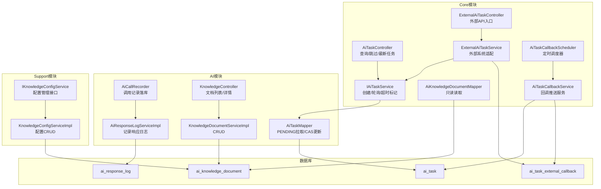
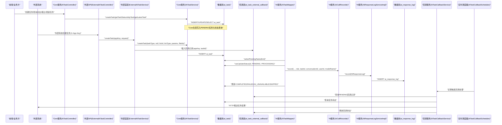
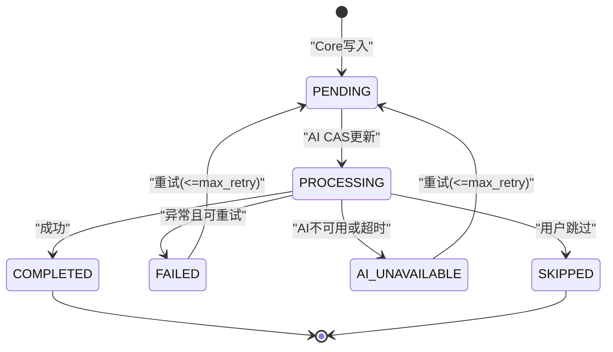
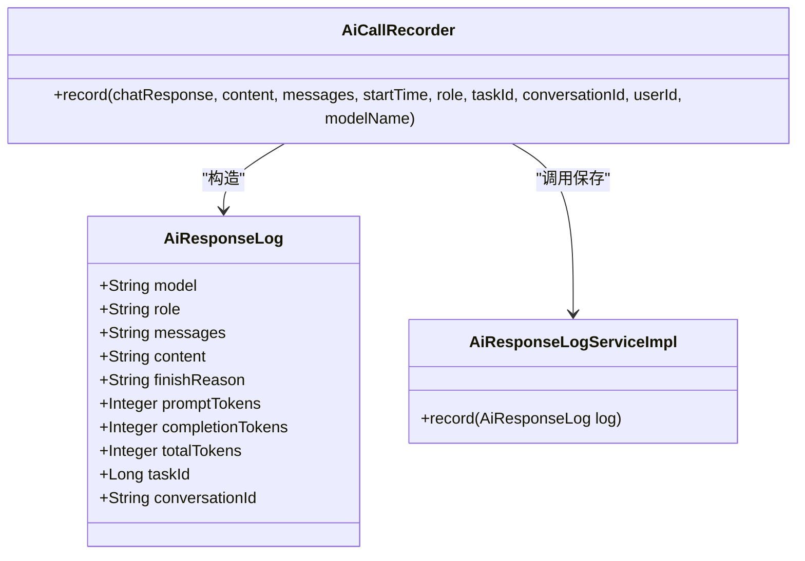
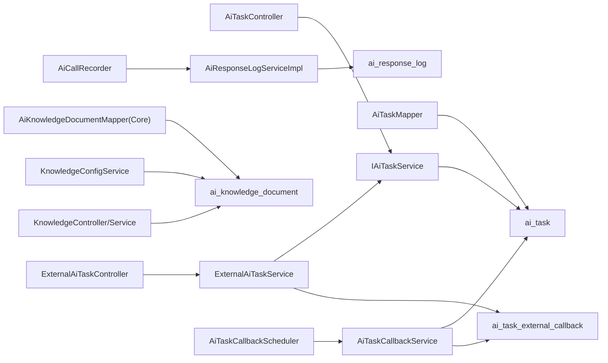

# AI任务相关数据

<cite>
**本文引用的文件**
- [ele-ai-tender-system/ele-ai-tender-ai/sql/init.sql](file://ele-ai-tender-system/ele-ai-tender-ai/sql/init.sql)
- [ele-ai-tender-system/ele-ai-tender-core/sql/init.sql](file://ele-ai-tender-system/ele-ai-tender-core/sql/init.sql)
- [ele-ai-tender-system/ele-ai-tender-common/src/main/java/com/jy/eleaitender/common/entity/ai/AiResponseLog.java](file://ele-ai-tender-system/ele-ai-tender-common/src/main/java/com/jy/eleaitender/common/entity/ai/AiResponseLog.java)
- [ele-ai-tender-system/ele-ai-tender-common/src/main/java/com/jy/eleaitender/common/entity/ai/AiKnowledgeDocument.java](file://ele-ai-tender-system/ele-ai-tender-common/src/main/java/com/jy/eleaitender/common/entity/ai/AiKnowledgeDocument.java)
- [ele-ai-tender-system/ele-ai-tender-common/src/main/java/com/jy/eleaitender/common/enums/AiTaskStatus.java](file://ele-ai-tender-system/ele-ai-tender-common/src/main/java/com/jy/eleaitender/common/enums/AiTaskStatus.java)
- [ele-ai-tender-system/ele-ai-tender-common/src/main/java/com/jy/eleaitender/common/enums/AiTaskType.java](file://ele-ai-tender-system/ele-ai-tender-common/src/main/java/com/jy/eleaitender/common/enums/AiTaskType.java)
- [ele-ai-tender-system/ele-ai-tender-common/src/main/java/com/jy/eleaitender/common/dto/ai/AiTaskParams.java](file://ele-ai-tender-system/ele-ai-tender-common/src/main/java/com/jy/eleaitender/common/dto/ai/AiTaskParams.java)
- [ele-ai-tender-system/ele-ai-tender-ai/src/main/java/com/jy/eleaitender/ai/mapper/AiTaskMapper.java](file://ele-ai-tender-system/ele-ai-tender-ai/src/main/java/com/jy/eleaitender/ai/mapper/AiTaskMapper.java)
- [ele-ai-tender-system/ele-ai-tender-core/src/main/java/com/jy/eleaitender/core/service/IAiTaskService.java](file://ele-ai-tender-system/ele-ai-tender-core/src/main/java/com/jy/eleaitender/core/service/IAiTaskService.java)
- [ele-ai-tender-system/ele-ai-tender-core/src/main/java/com/jy/eleaitender/core/controller/AiTaskController.java](file://ele-ai-tender-system/ele-ai-tender-core/src/main/java/com/jy/eleaitender/core/controller/AiTaskController.java)
- [ele-ai-tender-system/ele-ai-tender-ai/src/main/java/com/jy/eleaitender/ai/service/IAiResponseLogService.java](file://ele-ai-tender-system/ele-ai-tender-ai/src/main/java/com/jy/eleaitender/ai/service/IAiResponseLogService.java)
- [ele-ai-tender-system/ele-ai-tender-ai/src/main/java/com/jy/eleaitender/ai/service/impl/AiResponseLogServiceImpl.java](file://ele-ai-tender-system/ele-ai-tender-ai/src/main/java/com/jy/eleaitender/ai/service/impl/AiResponseLogServiceImpl.java)
- [ele-ai-tender-system/ele-ai-tender-ai/src/main/java/com/jy/eleaitender/ai/mapper/AiResponseLogMapper.java](file://ele-ai-tender-system/ele-ai-tender-ai/src/main/java/com/jy/eleaitender/ai/mapper/AiResponseLogMapper.java)
- [ele-ai-tender-system/ele-ai-tender-ai/src/main/java/com/jy/eleaitender/ai/processor/recorder/AiCallRecorder.java](file://ele-ai-tender-system/ele-ai-tender-ai/src/main/java/com/jy/eleaitender/ai/processor/recorder/AiCallRecorder.java)
- [ele-ai-tender-system/ele-ai-tender-ai/src/main/java/com/jy/eleaitender/ai/controller/KnowledgeController.java](file://ele-ai-tender-system/ele-ai-tender-ai/src/main/java/com/jy/eleaitender/ai/controller/KnowledgeController.java)
- [ele-ai-tender-system/ele-ai-tender-ai/src/main/java/com/jy/eleaitender/ai/service/IKnowledgeDocumentService.java](file://ele-ai-tender-system/ele-ai-tender-ai/src/main/java/com/jy/eleaitender/ai/service/IKnowledgeDocumentService.java)
- [ele-ai-tender-system/ele-ai-tender-ai/src/main/java/com/jy/eleaitender/ai/service/impl/KnowledgeDocumentServiceImpl.java](file://ele-ai-tender-system/ele-ai-tender-ai/src/main/java/com/jy/eleaitender/ai/service/impl/KnowledgeDocumentServiceImpl.java)
- [ele-ai-tender-system/ele-ai-tender-support/src/main/java/com/jy/eleaitender/support/service/IKnowledgeConfigService.java](file://ele-ai-tender-system/ele-ai-tender-support/src/main/java/com/jy/eleaitender/support/service/IKnowledgeConfigService.java)
- [ele-ai-tender-system/ele-ai-tender-support/src/main/java/com/jy/eleaitender/support/service/impl/KnowledgeConfigServiceImpl.java](file://ele-ai-tender-system/ele-ai-tender-support/src/main/java/com/jy/eleaitender/support/service/impl/KnowledgeConfigServiceImpl.java)
- [ele-ai-tender-system/ele-ai-tender-core/src/main/java/com/jy/eleaitender/core/mapper/AiKnowledgeDocumentMapper.java](file://ele-ai-tender-system/ele-ai-tender-core/src/main/java/com/jy/eleaitender/core/mapper/AiKnowledgeDocumentMapper.java)
- [ele-ai-tender-system/ele-ai-tender-core/src/main/java/com/jy/eleaitender/core/dto/request/AiTaskCreateRequest.java](file://ele-ai-tender-system/ele-ai-tender-core/src/main/java/com/jy/eleaitender/core/dto/request/AiTaskCreateRequest.java)
- [ele-ai-tender-system/ele-ai-tender-common-interaction/src/main/java/com/jy/eleaitender/common/interaction/dto/AiTaskCreateRequest.java](file://ele-ai-tender-system/ele-ai-tender-common-interaction/src/main/java/com/jy/eleaitender/common/interaction/dto/AiTaskCreateRequest.java)
- [ele-ai-tender-system/ele-ai-tender-common/src/main/java/com/jy/eleaitender/common/entity/ai/AiTaskExternalCallback.java](file://ele-ai-tender-system/ele-ai-tender-common/src/main/java/com/jy/eleaitender/common/entity/ai/AiTaskExternalCallback.java)
- [ele-ai-tender-system/ele-ai-tender-core/src/main/java/com/jy/eleaitender/core/mapper/AiTaskExternalCallbackMapper.java](file://ele-ai-tender-system/ele-ai-tender-core/src/main/java/com/jy/eleaitender/core/mapper/AiTaskExternalCallbackMapper.java)
- [ele-ai-tender-system/ele-ai-tender-core/src/main/java/com/jy/eleaitender/core/service/external/ExternalAiTaskService.java](file://ele-ai-tender-system/ele-ai-tender-core/src/main/java/com/jy/eleaitender/core/service/external/ExternalAiTaskService.java)
- [ele-ai-tender-system/ele-ai-tender-core/src/main/java/com/jy/eleaitender/core/controller/external/ExternalAiTaskController.java](file://ele-ai-tender-system/ele-ai-tender-core/src/main/java/com/jy/eleaitender/core/controller/external/ExternalAiTaskController.java)
- [ele-ai-tender-system/ele-ai-tender-core/src/main/java/com/jy/eleaitender/core/service/external/AiTaskCallbackService.java](file://ele-ai-tender-system/ele-ai-tender-core/src/main/java/com/jy/eleaitender/core/service/external/AiTaskCallbackService.java)
- [ele-ai-tender-system/ele-ai-tender-core/src/main/java/com/jy/eleaitender/core/scheduler/AiTaskCallbackScheduler.java](file://ele-ai-tender-system/ele-ai-tender-core/src/main/java/com/jy/eleaitender/core/scheduler/AiTaskCallbackScheduler.java)
</cite>

## 更新摘要
**变更内容**
- 移除了AI任务外部回调表(ai_task_external_callback)的数据库初始化脚本定义，但保留了相关的Java实体类、服务层和调度器实现
- 更新了外部回调功能的相关说明，明确该表仍存在于Core模块的初始化脚本中
- 修正了架构图和相关组件分析中的表结构引用

## 目录
1. [简介](#简介)
2. [项目结构](#项目结构)
3. [核心组件](#核心组件)
4. [架构总览](#架构总览)
5. [详细组件分析](#详细组件分析)
6. [依赖关系分析](#依赖关系分析)
7. [性能考虑](#性能考虑)
8. [故障排查指南](#故障排查指南)
9. [结论](#结论)
10. [附录](#附录)

## 简介
本文件聚焦于AI任务相关数据模型与数据流，围绕以下核心表展开：
- AI任务表（ai_task）
- 响应日志表（ai_response_log）
- 知识文档表（ai_knowledge_document）
- 外部回调记录表（ai_task_external_callback）

内容涵盖：
- 任务状态流转、任务参数存储、结果记录格式
- 向量知识库的数据结构设计、文档分片策略与相似度计算支持
- Spring AI集成时的数据访问模式、异步任务持久化方案
- 成本统计、错误重试机制与数据清理策略的实现指导
- 外部系统数据隔离机制与安全验证

## 项目结构
AI相关数据定义集中在SQL初始化脚本与通用实体类中；任务调度与处理逻辑分布在Core与AI模块；知识库管理在AI与Support模块均有实现；外部系统集成通过专门的适配服务实现。

**图表来源**
- [ele-ai-tender-system/ele-ai-tender-core/src/main/java/com/jy/eleaitender/core/controller/AiTaskController.java:1-51](file://ele-ai-tender-system/ele-ai-tender-core/src/main/java/com/jy/eleaitender/core/controller/AiTaskController.java#L1-L51)
- [ele-ai-tender-system/ele-ai-tender-core/src/main/java/com/jy/eleaitender/core/service/IAiTaskService.java:1-43](file://ele-ai-tender-system/ele-ai-tender-core/src/main/java/com/jy/eleaitender/core/service/IAiTaskService.java#L1-L43)
- [ele-ai-tender-system/ele-ai-tender-ai/src/main/java/com/jy/eleaitender/ai/mapper/AiTaskMapper.java:1-40](file://ele-ai-tender-system/ele-ai-tender-ai/src/main/java/com/jy/eleaitender/ai/mapper/AiTaskMapper.java#L1-L40)
- [ele-ai-tender-system/ele-ai-tender-core/src/main/java/com/jy/eleaitender/core/service/external/ExternalAiTaskService.java:1-166](file://ele-ai-tender-system/ele-ai-tender-core/src/main/java/com/jy/eleaitender/core/service/external/ExternalAiTaskService.java#L1-L166)
- [ele-ai-tender-system/ele-ai-tender-core/src/main/java/com/jy/eleaitender/core/controller/external/ExternalAiTaskController.java:1-59](file://ele-ai-tender-system/ele-ai-tender-core/src/main/java/com/jy/eleaitender/core/controller/external/ExternalAiTaskController.java#L1-L59)
- [ele-ai-tender-system/ele-ai-tender-core/src/main/java/com/jy/eleaitender/core/service/external/AiTaskCallbackService.java:1-191](file://ele-ai-tender-system/ele-ai-tender-core/src/main/java/com/jy/eleaitender/core/service/external/AiTaskCallbackService.java#L1-L191)
- [ele-ai-tender-system/ele-ai-tender-core/src/main/java/com/jy/eleaitender/core/scheduler/AiTaskCallbackScheduler.java:1-36](file://ele-ai-tender-system/ele-ai-tender-core/src/main/java/com/jy/eleaitender/core/scheduler/AiTaskCallbackScheduler.java#L1-L36)

章节来源
- [ele-ai-tender-system/ele-ai-tender-ai/sql/init.sql:1-119](file://ele-ai-tender-system/ele-ai-tender-ai/sql/init.sql#L1-L119)
- [ele-ai-tender-system/ele-ai-tender-core/sql/init.sql:1-272](file://ele-ai-tender-system/ele-ai-tender-core/sql/init.sql#L1-L272)

## 核心组件
- AI任务表（ai_task）
  - 作用：承载AI任务的元信息、参数、状态、结果与重试控制
  - 关键字段：task_type、project_id、biz_id、biz_type、request_params、file_ids、status、result、error_msg、retry_count、max_retry、started_at、completed_at、timeout_minutes
  - 索引：idx_status、idx_project、idx_biz、idx_task_type_status
- 响应日志表（ai_response_log）
  - 作用：记录每次AI模型调用的请求/响应、token消耗、完成原因等
  - 关键字段：model、role、messages、content、finish_reason、prompt_tokens、completion_tokens、total_tokens、task_id、conversation_id
  - 索引：idx_task_id、idx_conversation_id、idx_role、idx_create_time、idx_model
- 知识文档表（ai_knowledge_document）
  - 作用：知识库文档元信息与文本内容、向量集合与ID映射
  - 关键字段：doc_name、doc_category、file_id、file_type、content、vector_collection、vector_ids、status
  - 索引：idx_category、idx_status、idx_file_id
- 外部回调记录表（ai_task_external_callback）
  - 作用：记录外部系统任务回调状态，实现数据隔离和权限控制
  - 关键字段：task_id、app_key、callback_status、retry_count、last_callback_time、error_msg
  - 索引：idx_callback_status、idx_task_id

章节来源
- [ele-ai-tender-system/ele-ai-tender-ai/sql/init.sql:17-46](file://ele-ai-tender-system/ele-ai-tender-ai/sql/init.sql#L17-L46)
- [ele-ai-tender-system/ele-ai-tender-ai/sql/init.sql:51-73](file://ele-ai-tender-system/ele-ai-tender-ai/sql/init.sql#L51-L73)
- [ele-ai-tender-system/ele-ai-tender-ai/sql/init.sql:79-105](file://ele-ai-tender-system/ele-ai-tender-ai/sql/init.sql#L79-L105)
- [ele-ai-tender-system/ele-ai-tender-core/sql/init.sql:251-272](file://ele-ai-tender-system/ele-ai-tender-core/sql/init.sql#L251-L272)

## 架构总览
AI任务从Core侧创建并写入ai_task，AI侧通过定时或轮询拉取待处理任务，使用CAS更新为处理中，执行完成后写回结果与耗时；同时通过AiCallRecorder将每次模型调用写入ai_response_log用于成本与可观测性分析。知识库文档由AI或Support模块维护，关联外部向量库（如Milvus）的集合与向量ID。外部系统通过专用API创建任务，系统自动创建回调记录实现数据隔离，并通过定时调度器推送任务结果到外部系统。

**图表来源**
- [ele-ai-tender-system/ele-ai-tender-core/src/main/java/com/jy/eleaitender/core/controller/AiTaskController.java:1-51](file://ele-ai-tender-system/ele-ai-tender-core/src/main/java/com/jy/eleaitender/core/controller/AiTaskController.java#L1-L51)
- [ele-ai-tender-system/ele-ai-tender-core/src/main/java/com/jy/eleaitender/core/service/IAiTaskService.java:1-43](file://ele-ai-tender-system/ele-ai-tender-core/src/main/java/com/jy/eleaitender/core/service/IAiTaskService.java#L1-L43)
- [ele-ai-tender-system/ele-ai-tender-core/src/main/java/com/jy/eleaitender/core/controller/external/ExternalAiTaskController.java:1-59](file://ele-ai-tender-system/ele-ai-tender-core/src/main/java/com/jy/eleaitender/core/controller/external/ExternalAiTaskController.java#L1-L59)
- [ele-ai-tender-system/ele-ai-tender-core/src/main/java/com/jy/eleaitender/core/service/external/ExternalAiTaskService.java:52-105](file://ele-ai-tender-system/ele-ai-tender-core/src/main/java/com/jy/eleaitender/core/service/external/ExternalAiTaskService.java#L52-L105)
- [ele-ai-tender-system/ele-ai-tender-ai/src/main/java/com/jy/eleaitender/ai/mapper/AiTaskMapper.java:1-40](file://ele-ai-tender-system/ele-ai-tender-ai/src/main/java/com/jy/eleaitender/ai/mapper/AiTaskMapper.java#L1-L40)
- [ele-ai-tender-system/ele-ai-tender-ai/src/main/java/com/jy/eleaitender/ai/processor/recorder/AiCallRecorder.java:96-149](file://ele-ai-tender-system/ele-ai-tender-ai/src/main/java/com/jy/eleaitender/ai/processor/recorder/AiCallRecorder.java#L96-L149)
- [ele-ai-tender-system/ele-ai-tender-ai/src/main/java/com/jy/eleaitender/ai/service/impl/AiResponseLogServiceImpl.java:1-29](file://ele-ai-tender-system/ele-ai-tender-ai/src/main/java/com/jy/eleaitender/ai/service/impl/AiResponseLogServiceImpl.java#L1-L29)
- [ele-ai-tender-system/ele-ai-tender-core/src/main/java/com/jy/eleaitender/core/service/external/AiTaskCallbackService.java:58-72](file://ele-ai-tender-system/ele-ai-tender-core/src/main/java/com/jy/eleaitender/core/service/external/AiTaskCallbackService.java#L58-L72)
- [ele-ai-tender-system/ele-ai-tender-core/src/main/java/com/jy/eleaitender/core/scheduler/AiTaskCallbackScheduler.java:24-34](file://ele-ai-tender-system/ele-ai-tender-core/src/main/java/com/jy/eleaitender/core/scheduler/AiTaskCallbackScheduler.java#L24-L34)

## 详细组件分析

### AI任务表（ai_task）设计
- 任务类型与参数
  - AiTaskType定义了多种任务类型（需求生成、评审项生成、检测、文本优化等），每个类型附带默认超时时间与参数类约束（AiTaskParams）。
  - request_params字段以JSON形式存储具体任务参数，便于扩展不同任务类型的入参结构。
- 状态机与终态
  - AiTaskStatus定义了PENDING/PROCESSING/COMPLETED/FAILED/AI_UNAVAILABLE/SKIPPED六种状态，并提供isTerminal与isRetryable方法辅助流程控制。
  - 终态包括已完成、失败、不可用与已跳过；可重试状态为失败与不可用。
- 并发与幂等
  - AI侧通过CAS更新（旧状态=新状态条件）确保同一任务不会被重复消费。
- 结果与错误
  - result字段保存执行结果（JSON），error_msg记录错误信息，便于问题定位与重试策略。
- 重试与超时
  - retry_count与max_retry控制重试次数；timeout_minutes配合定时任务标记超时为AI_UNAVAILABLE。

**图表来源**
- [ele-ai-tender-system/ele-ai-tender-common/src/main/java/com/jy/eleaitender/common/enums/AiTaskStatus.java:1-46](file://ele-ai-tender-system/ele-ai-tender-common/src/main/java/com/jy/eleaitender/common/enums/AiTaskStatus.java#L1-L46)
- [ele-ai-tender-system/ele-ai-tender-common/src/main/java/com/jy/eleaitender/common/enums/AiTaskType.java:1-52](file://ele-ai-tender-system/ele-ai-tender-common/src/main/java/com/jy/eleaitender/common/enums/AiTaskType.java#L1-L52)
- [ele-ai-tender-system/ele-ai-tender-ai/src/main/java/com/jy/eleaitender/ai/mapper/AiTaskMapper.java:23-37](file://ele-ai-tender-system/ele-ai-tender-ai/src/main/java/com/jy/eleaitender/ai/mapper/AiTaskMapper.java#L23-L37)

章节来源
- [ele-ai-tender-system/ele-ai-tender-ai/sql/init.sql:17-46](file://ele-ai-tender-system/ele-ai-tender-ai/sql/init.sql#L17-L46)
- [ele-ai-tender-system/ele-ai-tender-common/src/main/java/com/jy/eleaitender/common/enums/AiTaskStatus.java:1-46](file://ele-ai-tender-system/ele-ai-tender-common/src/main/java/com/jy/eleaitender/common/enums/AiTaskStatus.java#L1-L46)
- [ele-ai-tender-system/ele-ai-tender-common/src/main/java/com/jy/eleaitender/common/enums/AiTaskType.java:1-52](file://ele-ai-tender-system/ele-ai-tender-common/src/main/java/com/jy/eleaitender/common/enums/AiTaskType.java#L1-L52)
- [ele-ai-tender-system/ele-ai-tender-common/src/main/java/com/jy/eleaitender/common/dto/ai/AiTaskParams.java:1-8](file://ele-ai-tender-system/ele-ai-tender-common/src/main/java/com/jy/eleaitender/common/dto/ai/AiTaskParams.java#L1-L8)
- [ele-ai-tender-system/ele-ai-tender-core/src/main/java/com/jy/eleaitender/core/service/IAiTaskService.java:1-43](file://ele-ai-tender-system/ele-ai-tender-core/src/main/java/com/jy/eleaitender/core/service/IAiTaskService.java#L1-L43)
- [ele-ai-tender-system/ele-ai-tender-core/src/main/java/com/jy/eleaitender/core/controller/AiTaskController.java:1-51](file://ele-ai-tender-system/ele-ai-tender-core/src/main/java/com/jy/eleaitender/core/controller/AiTaskController.java#L1-L51)
- [ele-ai-tender-system/ele-ai-tender-ai/src/main/java/com/jy/eleaitender/ai/mapper/AiTaskMapper.java:1-40](file://ele-ai-tender-system/ele-ai-tender-ai/src/main/java/com/jy/eleaitender/ai/mapper/AiTaskMapper.java#L1-L40)

### 外部回调记录表（ai_task_external_callback）与数据隔离机制
- 数据结构
  - task_id：关联的AI任务ID
  - app_key：外部系统的唯一标识密钥
  - callback_status：回调状态（PENDING/PROCESSING/SUCCESS/FAILED）
  - retry_count：重试次数计数
  - last_callback_time：最后回调时间戳
  - error_msg：错误信息记录
- 数据隔离机制
  - 所有外部系统创建的任务都会自动生成回调记录，建立app_key与taskId的绑定关系
  - 查询任务时强制校验app_key与taskId的归属关系，防止跨系统访问
  - 无回调URL的外部系统也会创建记录，仅用于数据隔离目的
- 权限控制
  - verifyOwnership方法确保只有拥有对应app_key的外部系统才能查询特定任务
  - 未授权访问直接返回403禁止访问错误
- 回调推送机制
  - AiTaskCallbackService定时扫描PENDING状态的回调记录
  - 检查关联任务是否达到终态，构建回调请求并签名验证
  - 通过HTTP推送任务结果到外部系统配置的system_url
  - 支持重试机制，达到最大重试次数后标记为FAILED

**更新** 外部回调记录实现了完整的数据隔离机制和异步回调推送功能，确保多租户环境下的数据安全

章节来源
- [ele-ai-tender-system/ele-ai-tender-core/sql/init.sql:251-272](file://ele-ai-tender-system/ele-ai-tender-core/sql/init.sql#L251-L272)
- [ele-ai-tender-system/ele-ai-tender-common/src/main/java/com/jy/eleaitender/common/entity/ai/AiTaskExternalCallback.java:14-37](file://ele-ai-tender-system/ele-ai-tender-common/src/main/java/com/jy/eleaitender/common/entity/ai/AiTaskExternalCallback.java#L14-L37)
- [ele-ai-tender-system/ele-ai-tender-core/src/main/java/com/jy/eleaitender/core/mapper/AiTaskExternalCallbackMapper.java:1-31](file://ele-ai-tender-system/ele-ai-tender-core/src/main/java/com/jy/eleaitender/core/mapper/AiTaskExternalCallbackMapper.java#L1-L31)
- [ele-ai-tender-system/ele-ai-tender-core/src/main/java/com/jy/eleaitender/core/service/external/ExternalAiTaskService.java:83-96](file://ele-ai-tender-system/ele-ai-tender-core/src/main/java/com/jy/eleaitender/core/service/external/ExternalAiTaskService.java#L83-L96)
- [ele-ai-tender-system/ele-ai-tender-core/src/main/java/com/jy/eleaitender/core/service/external/AiTaskCallbackService.java:74-140](file://ele-ai-tender-system/ele-ai-tender-core/src/main/java/com/jy/eleaitender/core/service/external/AiTaskCallbackService.java#L74-L140)

### 响应日志表（ai_response_log）设计与成本统计
- 字段说明
  - model：模型名称
  - role：角色（GENERATION/OPTIMIZATION/DETECTION/CHAT）
  - messages：对话消息（JSON）
  - content：AI响应内容
  - finish_reason：完成原因
  - prompt_tokens、completion_tokens、total_tokens：Token用量统计
  - task_id：关联任务ID（对话类为空）
  - conversation_id：会话ID（聊天场景）
- 记录时机
  - AiCallRecorder在每次AI调用后组装AiResponseLog并通过AiResponseLogServiceImpl持久化。
- 成本统计
  - 基于total_tokens进行计费统计；可按model、role、task_id、conversation_id维度聚合。
- 容错
  - 记录失败仅打日志，不影响主流程。

**图表来源**
- [ele-ai-tender-system/ele-ai-tender-common/src/main/java/com/jy/eleaitender/common/entity/ai/AiResponseLog.java:1-49](file://ele-ai-tender-system/ele-ai-tender-common/src/main/java/com/jy/eleaitender/common/entity/ai/AiResponseLog.java#L1-L49)
- [ele-ai-tender-system/ele-ai-tender-ai/src/main/java/com/jy/eleaitender/ai/processor/recorder/AiCallRecorder.java:96-149](file://ele-ai-tender-system/ele-ai-tender-ai/src/main/java/com/jy/eleaitender/ai/processor/recorder/AiCallRecorder.java#L96-L149)
- [ele-ai-tender-system/ele-ai-tender-ai/src/main/java/com/jy/eleaitender/ai/service/impl/AiResponseLogServiceImpl.java:1-29](file://ele-ai-tender-system/ele-ai-tender-ai/src/main/java/com/jy/eleaitender/ai/service/impl/AiResponseLogServiceImpl.java#L1-L29)

章节来源
- [ele-ai-tender-system/ele-ai-tender-ai/sql/init.sql:79-105](file://ele-ai-tender-system/ele-ai-tender-ai/sql/init.sql#L79-L105)
- [ele-ai-tender-system/ele-ai-tender-common/src/main/java/com/jy/eleaitender/common/entity/ai/AiResponseLog.java:1-49](file://ele-ai-tender-system/ele-ai-tender-common/src/main/java/com/jy/eleaitender/common/entity/ai/AiResponseLog.java#L1-L49)
- [ele-ai-tender-system/ele-ai-tender-ai/src/main/java/com/jy/eleaitender/ai/processor/recorder/AiCallRecorder.java:96-149](file://ele-ai-tender-system/ele-ai-tender-ai/src/main/java/com/jy/eleaitender/ai/processor/recorder/AiCallRecorder.java#L96-L149)
- [ele-ai-tender-system/ele-ai-tender-ai/src/main/java/com/jy/eleaitender/ai/service/IAiResponseLogService.java:1-14](file://ele-ai-tender-system/ele-ai-tender-ai/src/main/java/com/jy/eleaitender/ai/service/IAiResponseLogService.java#L1-L14)
- [ele-ai-tender-system/ele-ai-tender-ai/src/main/java/com/jy/eleaitender/ai/service/impl/AiResponseLogServiceImpl.java:1-29](file://ele-ai-tender-system/ele-ai-tender-ai/src/main/java/com/jy/eleaitender/ai/service/impl/AiResponseLogServiceImpl.java#L1-L29)
- [ele-ai-tender-system/ele-ai-tender-ai/src/main/java/com/jy/eleaitender/ai/mapper/AiResponseLogMapper.java:1-12](file://ele-ai-tender-system/ele-ai-tender-ai/src/main/java/com/jy/eleaitender/ai/mapper/AiResponseLogMapper.java#L1-L12)

### 知识文档表（ai_knowledge_document）与向量库
- 数据结构
  - doc_name/doc_category：文档名称与类别（政策/历史模板/标准规范/其他）
  - file_id/file_type：关联文件服务与类型
  - content：解析后的纯文本内容
  - vector_collection/vector_ids：向量集合名与向量ID列表（JSON）
  - status：ACTIVE/ARCHIVED/PROCESSING/FAILED
- 分片与相似度
  - 建议按doc_category或时间范围对向量集合进行分片（collection命名规则体现分片）
  - 相似度检索通过外部向量库（如Milvus）完成，本地仅保存集合名与向量ID映射
- 管理入口
  - AI模块提供列表与详情接口；Support模块提供完整CRUD能力；Core模块提供只读Mapper供业务查询

[此图为概念流程，不直接映射到具体源码文件]

章节来源
- [ele-ai-tender-system/ele-ai-tender-ai/sql/init.sql:51-73](file://ele-ai-tender-system/ele-ai-tender-ai/sql/init.sql#L51-73)
- [ele-ai-tender-system/ele-ai-tender-common/src/main/java/com/jy/eleaitender/common/entity/ai/AiKnowledgeDocument.java:1-30](file://ele-ai-tender-system/ele-ai-tender-common/src/main/java/com/jy/eleaitender/common/entity/ai/AiKnowledgeDocument.java#L1-L30)
- [ele-ai-tender-system/ele-ai-tender-ai/src/main/java/com/jy/eleaitender/ai/controller/KnowledgeController.java:1-33](file://ele-ai-tender-system/ele-ai-tender-ai/src/main/java/com/jy/eleaitender/ai/controller/KnowledgeController.java#L1-33)
- [ele-ai-tender-system/ele-ai-tender-ai/src/main/java/com/jy/eleaitender/ai/service/IKnowledgeDocumentService.java:1-12](file://ele-ai-tender-system/ele-ai-tender-ai/src/main/java/com/jy/eleaitender/ai/service/IKnowledgeDocumentService.java#L1-12)
- [ele-ai-tender-system/ele-ai-tender-ai/src/main/java/com/jy/eleaitender/ai/service/impl/KnowledgeDocumentServiceImpl.java:27-60](file://ele-ai-tender-system/ele-ai-tender-ai/src/main/java/com/jy/eleaitender/ai/service/impl/KnowledgeDocumentServiceImpl.java#L27-L60)
- [ele-ai-tender-system/ele-ai-tender-support/src/main/java/com/jy/eleaitender/support/service/IKnowledgeConfigService.java:1-12](file://ele-ai-tender-system/ele-ai-tender-support/src/main/java/com/jy/eleaitender/support/service/IKnowledgeConfigService.java#L1-12)
- [ele-ai-tender-system/ele-ai-tender-support/src/main/java/com/jy/eleaitender/support/service/impl/KnowledgeConfigServiceImpl.java:28-62](file://ele-ai-tender-system/ele-ai-tender-support/src/main/java/com/jy/eleaitender/support/service/impl/KnowledgeConfigServiceImpl.java#L28-L62)
- [ele-ai-tender-system/ele-ai-tender-core/src/main/java/com/jy/eleaitender/core/mapper/AiKnowledgeDocumentMapper.java:1-12](file://ele-ai-tender-system/ele-ai-tender-core/src/main/java/com/jy/eleaitender/core/mapper/AiKnowledgeDocumentMapper.java#L1-12)

### API变更：bizId字段类型升级
**重要变更**：AI任务创建请求中的bizId字段已从String类型升级为Long类型，这是一个破坏性变更。

- 内部API变更
  - AiTaskCreateRequest.bizId：String → Long
  - 影响范围：Core模块内部API调用
- 外部API变更  
  - ExternalAiTaskController接收的AiTaskCreateRequest.bizId：String → Long
  - 影响范围：所有外部系统调用
- 数据库兼容性
  - ai_task表的biz_id字段原本就是BIGINT类型，无需DDL变更
  - 但需要确保所有调用方都传递Long类型的bizId值

**破坏性影响**：
- 外部系统必须更新客户端代码，将bizId参数从字符串转换为长整型
- 前端调用也需要相应修改类型定义
- 旧的字符串格式bizId将无法被接受

章节来源
- [ele-ai-tender-system/ele-ai-tender-core/src/main/java/com/jy/eleaitender/core/dto/request/AiTaskCreateRequest.java:19-20](file://ele-ai-tender-system/ele-ai-tender-core/src/main/java/com/jy/eleaitender/core/dto/request/AiTaskCreateRequest.java#L19-L20)
- [ele-ai-tender-system/ele-ai-tender-common-interaction/src/main/java/com/jy/eleaitender/common/interaction/dto/AiTaskCreateRequest.java:22-23](file://ele-ai-tender-system/ele-ai-tender-common-interaction/src/main/java/com/jy/eleaitender/common/interaction/dto/AiTaskCreateRequest.java#L22-L23)
- [ele-ai-tender-system/ele-ai-tender-common/src/main/java/com/jy/eleaitender/common/entity/ai/AiTask.java:30-31](file://ele-ai-tender-system/ele-ai-tender-common/src/main/java/com/jy/eleaitender/common/entity/ai/AiTask.java#L30-L31)
- [ele-ai-tender-system/ele-ai-tender-ai/sql/init.sql:20](file://ele-ai-tender-system/ele-ai-tender-ai/sql/init.sql#L20)

## 依赖关系分析
- Core与AI解耦
  - Core通过REST暴露任务查询与操作接口；AI通过数据库队列与CAS机制消费任务，避免强耦合。
- 日志与监控
  - AiCallRecorder统一封装AI调用记录，降低各处理器重复代码；AiResponseLogServiceImpl保证记录失败不影响主流程。
- 知识库多模块协作
  - AI模块提供基础列表/详情；Support模块提供完整配置管理；Core模块只读访问。
- 外部系统集成
  - ExternalAiTaskService作为适配器层，处理外部DTO转换、数据隔离验证和回调记录管理。
  - AiTaskCallbackService负责异步回调推送，支持重试和错误处理。
  - AiTaskCallbackScheduler定时调度回调处理任务。

**图表来源**
- [ele-ai-tender-system/ele-ai-tender-core/src/main/java/com/jy/eleaitender/core/controller/AiTaskController.java:1-51](file://ele-ai-tender-system/ele-ai-tender-core/src/main/java/com/jy/eleaitender/core/controller/AiTaskController.java#L1-L51)
- [ele-ai-tender-system/ele-ai-tender-core/src/main/java/com/jy/eleaitender/core/service/IAiTaskService.java:1-43](file://ele-ai-tender-system/ele-ai-tender-core/src/main/java/com/jy/eleaitender/core/service/IAiTaskService.java#L1-L43)
- [ele-ai-tender-system/ele-ai-tender-ai/src/main/java/com/jy/eleaitender/ai/mapper/AiTaskMapper.java:1-40](file://ele-ai-tender-system/ele-ai-tender-ai/src/main/java/com/jy/eleaitender/ai/mapper/AiTaskMapper.java#L1-L40)
- [ele-ai-tender-system/ele-ai-tender-ai/src/main/java/com/jy/eleaitender/ai/processor/recorder/AiCallRecorder.java:96-149](file://ele-ai-tender-system/ele-ai-tender-ai/src/main/java/com/jy/eleaitender/ai/processor/recorder/AiCallRecorder.java#L96-L149)
- [ele-ai-tender-system/ele-ai-tender-ai/src/main/java/com/jy/eleaitender/ai/service/impl/AiResponseLogServiceImpl.java:1-29](file://ele-ai-tender-system/ele-ai-tender-ai/src/main/java/com/jy/eleaitender/ai/service/impl/AiResponseLogServiceImpl.java#L1-L29)
- [ele-ai-tender-system/ele-ai-tender-ai/src/main/java/com/jy/eleaitender/ai/controller/KnowledgeController.java:1-33](file://ele-ai-tender-system/ele-ai-tender-ai/src/main/java/com/jy/eleaitender/ai/controller/KnowledgeController.java#L1-33)
- [ele-ai-tender-system/ele-ai-tender-ai/src/main/java/com/jy/eleaitender/ai/service/impl/KnowledgeDocumentServiceImpl.java:27-60](file://ele-ai-tender-system/ele-ai-tender-ai/src/main/java/com/jy/eleaitender/ai/service/impl/KnowledgeDocumentServiceImpl.java#L27-L60)
- [ele-ai-tender-system/ele-ai-tender-support/src/main/java/com/jy/eleaitender/support/service/IKnowledgeConfigService.java:1-12](file://ele-ai-tender-system/ele-ai-tender-support/src/main/java/com/jy/eleaitender/support/service/IKnowledgeConfigService.java#L1-12)
- [ele-ai-tender-system/ele-ai-tender-support/src/main/java/com/jy/eleaitender/support/service/impl/KnowledgeConfigServiceImpl.java:28-62](file://ele-ai-tender-system/ele-ai-tender-support/src/main/java/com/jy/eleaitender/support/service/impl/KnowledgeConfigServiceImpl.java#L28-L62)
- [ele-ai-tender-system/ele-ai-tender-core/src/main/java/com/jy/eleaitender/core/mapper/AiKnowledgeDocumentMapper.java:1-12](file://ele-ai-tender-system/ele-ai-tender-core/src/main/java/com/jy/eleaitender/core/mapper/AiKnowledgeDocumentMapper.java#L1-12)
- [ele-ai-tender-system/ele-ai-tender-core/src/main/java/com/jy/eleaitender/core/controller/external/ExternalAiTaskController.java:1-59](file://ele-ai-tender-system/ele-ai-tender-core/src/main/java/com/jy/eleaitender/core/controller/external/ExternalAiTaskController.java#L1-L59)
- [ele-ai-tender-system/ele-ai-tender-core/src/main/java/com/jy/eleaitender/core/service/external/ExternalAiTaskService.java:1-166](file://ele-ai-tender-system/ele-ai-tender-core/src/main/java/com/jy/eleaitender/core/service/external/ExternalAiTaskService.java#L1-L166)
- [ele-ai-tender-system/ele-ai-tender-core/src/main/java/com/jy/eleaitender/core/service/external/AiTaskCallbackService.java:1-191](file://ele-ai-tender-system/ele-ai-tender-core/src/main/java/com/jy/eleaitender/core/service/external/AiTaskCallbackService.java#L1-L191)
- [ele-ai-tender-system/ele-ai-tender-core/src/main/java/com/jy/eleaitender/core/scheduler/AiTaskCallbackScheduler.java:1-36](file://ele-ai-tender-system/ele-ai-tender-core/src/main/java/com/jy/eleaitender/core/scheduler/AiTaskCallbackScheduler.java#L1-L36)

## 性能考虑
- 任务拉取与CAS
  - 使用LIMIT限制批量拉取数量，结合CAS更新避免重复消费与锁竞争。
- 索引优化
  - ai_task：按status、project_id、biz_id+biz_type、task_type+status建立复合索引，提升轮询与查询效率。
  - ai_response_log：按task_id、conversation_id、role、create_time、model建索引，支撑多维统计与回放。
  - ai_knowledge_document：按category、status、file_id建索引，提高筛选与关联查询性能。
  - ai_task_external_callback：按callback_status、task_id建索引，优化回调处理和权限验证。
- 大字段与JSON
  - request_params/result/messages/content使用LONGTEXT，注意分页与导出时避免全量加载；必要时拆分或归档。
- 异步与批处理
  - 向量入库与文本解析可异步化，减少主流程延迟；批量插入日志与任务结果以提升吞吐。
- 外部系统性能
  - 回调记录创建采用同步方式，避免阻塞任务创建主流程。
  - 回调推送采用定时调度，支持批量处理和多实例并发控制。

## 故障排查指南
- 任务卡住或无进展
  - 检查ai_task.status是否为PROCESSING且长时间未更新；确认是否触发超时标记为AI_UNAVAILABLE。
  - 查看ai_response_log是否存在对应task_id的记录，判断AI调用是否成功。
- 重试风暴
  - 核对retry_count与max_retry；若频繁失败，优先排查AI服务可用性与网络抖动。
- 日志缺失
  - AiResponseLogServiceImpl捕获异常仅记录日志，不会中断主流程；需检查应用日志输出路径与权限。
- 知识库同步失败
  - 关注ai_knowledge_document.status为PROCESSING/FAILED的记录；检查向量库连接与集合权限。
- 外部系统访问问题
  - 检查ai_task_external_callback表中对应app_key的记录是否存在
  - 确认X-App-Key请求头是否正确传递
  - 验证verifyOwnership方法的权限校验逻辑
- 回调推送失败
  - 检查AiTaskCallbackScheduler是否正常运行
  - 查看回调记录的retry_count和callback_status
  - 确认外部系统配置的system_url可达且签名验证通过

章节来源
- [ele-ai-tender-system/ele-ai-tender-ai/src/main/java/com/jy/eleaitender/ai/service/impl/AiResponseLogServiceImpl.java:20-29](file://ele-ai-tender-system/ele-ai-tender-ai/src/main/java/com/jy/eleaitender/ai/service/impl/AiResponseLogServiceImpl.java#L20-L29)
- [ele-ai-tender-system/ele-ai-tender-ai/src/main/java/com/jy/eleaitender/ai/processor/recorder/AiCallRecorder.java:134-137](file://ele-ai-tender-system/ele-ai-tender-ai/src/main/java/com/jy/eleaitender/ai/processor/recorder/AiCallRecorder.java#L134-L137)
- [ele-ai-tender-system/ele-ai-tender-ai/sql/init.sql:17-46](file://ele-ai-tender-system/ele-ai-tender-ai/sql/init.sql#L17-L46)
- [ele-ai-tender-system/ele-ai-tender-ai/sql/init.sql:79-105](file://ele-ai-tender-system/ele-ai-tender-ai/sql/init.sql#L79-L105)
- [ele-ai-tender-system/ele-ai-tender-ai/sql/init.sql:51-73](file://ele-ai-tender-system/ele-ai-tender-ai/sql/init.sql#L51-L73)
- [ele-ai-tender-system/ele-ai-tender-core/src/main/java/com/jy/eleaitender/core/service/external/ExternalAiTaskService.java:126-135](file://ele-ai-tender-system/ele-ai-tender-core/src/main/java/com/jy/eleaitender/core/service/external/ExternalAiTaskService.java#L126-L135)
- [ele-ai-tender-system/ele-ai-tender-core/src/main/java/com/jy/eleaitender/core/service/external/AiTaskCallbackService.java:167-185](file://ele-ai-tender-system/ele-ai-tender-core/src/main/java/com/jy/eleaitender/core/service/external/AiTaskCallbackService.java#L167-L185)

## 结论
本数据模型围绕"任务驱动+可观测+安全隔离"的设计思路构建：
- ai_task作为任务队列与状态中枢，配合CAS与重试/超时机制保障可靠性
- ai_response_log提供完整的调用轨迹与成本统计基础
- ai_knowledge_document对接外部向量库，支撑相似检索与知识复用
- ai_task_external_callback实现外部系统数据隔离与异步回调推送
建议在后续迭代中完善：
- 任务优先级与资源配额
- 日志归档与冷热分层
- 向量库分片与索引策略优化
- 外部系统认证与限流机制
- 回调推送的监控与告警

## 附录

### Spring AI集成数据访问模式
- 记录器模式
  - 通过AiCallRecorder统一收集ChatResponse与上下文，构造AiResponseLog并持久化。
- 事务边界
  - 任务状态更新与结果落库建议在同一事务内；日志记录采用独立事务或异步落库，避免阻塞主流程。
- 分页与过滤
  - 知识库列表与任务查询均使用分页与条件过滤，避免全表扫描。

章节来源
- [ele-ai-tender-system/ele-ai-tender-ai/src/main/java/com/jy/eleaitender/ai/processor/recorder/AiCallRecorder.java:96-149](file://ele-ai-tender-system/ele-ai-tender-ai/src/main/java/com/jy/eleaitender/ai/processor/recorder/AiCallRecorder.java#L96-L149)
- [ele-ai-tender-system/ele-ai-tender-ai/src/main/java/com/jy/eleaitender/ai/service/impl/AiResponseLogServiceImpl.java:1-29](file://ele-ai-tender-system/ele-ai-tender-ai/src/main/java/com/jy/eleaitender/ai/service/impl/AiResponseLogServiceImpl.java#L1-L29)
- [ele-ai-tender-system/ele-ai-tender-ai/src/main/java/com/jy/eleaitender/ai/controller/KnowledgeController.java:1-33](file://ele-ai-tender-system/ele-ai-tender-ai/src/main/java/com/jy/eleaitender/ai/controller/KnowledgeController.java#L1-33)

### 异步任务处理的数据持久化方案
- 任务生命周期
  - Core写入PENDING -> AI拉取并CAS为PROCESSING -> 执行 -> 更新COMPLETED/FAILED/AI_UNAVAILABLE/SKIPPED
- 结果与日志分离
  - 任务结果写入ai_task.result；调用细节写入ai_response_log，便于独立分析与归档。
- 外部系统任务流程
  - 外部系统创建任务 -> 自动创建回调记录 -> 内部任务创建 -> 返回任务ID
  - 定时调度器扫描终态任务 -> 构建回调请求 -> HTTP推送 -> 更新回调状态

章节来源
- [ele-ai-tender-system/ele-ai-tender-core/src/main/java/com/jy/eleaitender/core/service/IAiTaskService.java:1-43](file://ele-ai-tender-system/ele-ai-tender-core/src/main/java/com/jy/eleaitender/core/service/IAiTaskService.java#L1-L43)
- [ele-ai-tender-system/ele-ai-tender-ai/src/main/java/com/jy/eleaitender/ai/mapper/AiTaskMapper.java:23-37](file://ele-ai-tender-system/ele-ai-tender-ai/src/main/java/com/jy/eleaitender/ai/mapper/AiTaskMapper.java#L23-L37)
- [ele-ai-tender-system/ele-ai-tender-ai/sql/init.sql:17-46](file://ele-ai-tender-system/ele-ai-tender-ai/sql/init.sql#L17-L46)
- [ele-ai-tender-system/ele-ai-tender-ai/sql/init.sql:79-105](file://ele-ai-tender-system/ele-ai-tender-ai/sql/init.sql#L79-L105)
- [ele-ai-tender-system/ele-ai-tender-core/src/main/java/com/jy/eleaitender/core/service/external/ExternalAiTaskService.java:83-96](file://ele-ai-tender-system/ele-ai-tender-core/src/main/java/com/jy/eleaitender/core/service/external/ExternalAiTaskService.java#L83-L96)
- [ele-ai-tender-system/ele-ai-tender-core/src/main/java/com/jy/eleaitender/core/service/external/AiTaskCallbackService.java:58-72](file://ele-ai-tender-system/ele-ai-tender-core/src/main/java/com/jy/eleaitender/core/service/external/AiTaskCallbackService.java#L58-L72)

### 性能监控指标收集
- 任务级
  - 任务数（按状态）、平均处理时长、成功率、重试率、超时率
- 调用级
  - 模型调用次数、tokens总量、平均耗时、失败原因分布
- 知识库
  - 文档入库成功率、向量库写入耗时、集合大小与分片均衡度
- 外部系统监控
  - 外部任务创建成功率、回调记录创建耗时、权限验证失败率
  - 回调推送成功率、重试次数分布、外部系统响应时间

### AI调用成本统计
- 依据ai_response_log.total_tokens聚合成本；可按model、role、task_id、conversation_id维度统计。
- 建议增加单价配置与币种字段，以便跨模型对比与预算管控。

章节来源
- [ele-ai-tender-system/ele-ai-tender-ai/sql/init.sql:79-105](file://ele-ai-tender-system/ele-ai-tender-ai/sql/init.sql#L79-L105)
- [ele-ai-tender-system/ele-ai-tender-common/src/main/java/com/jy/eleaitender/common/entity/ai/AiResponseLog.java:1-49](file://ele-ai-tender-system/ele-ai-tender-common/src/main/java/com/jy/eleaitender/common/entity/ai/AiResponseLog.java#L1-L49)

### 错误重试机制
- 触发条件
  - 任务状态为FAILED或AI_UNAVAILABLE且retry_count < max_retry
- 策略建议
  - 指数退避、限流与熔断；区分可重试与不可重试错误；记录重试原因与间隔。
- 外部回调重试
  - 回调推送失败时递增retry_count，达到最大重试次数后标记为FAILED
  - 支持手动重试和自动重试机制

章节来源
- [ele-ai-tender-system/ele-ai-tender-common/src/main/java/com/jy/eleaitender/common/enums/AiTaskStatus.java:35-44](file://ele-ai-tender-system/ele-ai-tender-common/src/main/java/com/jy/eleaitender/common/enums/AiTaskStatus.java#L35-L44)
- [ele-ai-tender-system/ele-ai-tender-ai/sql/init.sql:17-46](file://ele-ai-tender-system/ele-ai-tender-ai/sql/init.sql#L17-L46)
- [ele-ai-tender-system/ele-ai-tender-core/src/main/java/com/jy/eleaitender/core/service/external/AiTaskCallbackService.java:167-185](file://ele-ai-tender-system/ele-ai-tender-core/src/main/java/com/jy/eleaitender/core/service/external/AiTaskCallbackService.java#L167-L185)

### 数据清理策略
- 响应日志
  - 按时间窗口归档（如保留90天在线，其余转冷存储）；按conversation_id或task_id批量删除。
- 任务记录
  - 终态任务超过阈值后归档；保留必要审计字段（状态、耗时、错误摘要）。
- 知识库
  - 归档或删除失效文档；清理向量库中孤立向量ID，保持集合整洁。
- 外部回调记录
  - 定期清理已完成的外部回调记录；保留最近30天的活跃记录用于审计。

### 外部系统数据隔离实现
- 数据隔离机制
  - 每个外部系统通过唯一的app_key标识，创建任务时自动生成回调记录
  - 所有查询操作都必须携带X-App-Key请求头进行身份验证
  - verifyOwnership方法确保任务与外部系统的归属关系
- 安全验证流程
  - 请求到达ExternalAiTaskController -> 提取appKey -> 调用verifyOwnership -> 验证通过才允许访问
  - 未授权的访问直接返回403禁止访问错误
- 回调记录用途
  - 有回调URL的系统：记录回调状态，支持异步回调通知
  - 无回调URL的系统：仅用于数据隔离，标记为SUCCESS状态
- 回调推送机制
  - AiTaskCallbackScheduler定时扫描PENDING状态的回调记录
  - 检查关联任务是否达到终态，构建回调请求并签名验证
  - 通过HTTP推送任务结果到外部系统配置的system_url
  - 支持重试机制，达到最大重试次数后标记为FAILED

章节来源
- [ele-ai-tender-system/ele-ai-tender-core/src/main/java/com/jy/eleaitender/core/service/external/ExternalAiTaskService.java:83-96](file://ele-ai-tender-system/ele-ai-tender-core/src/main/java/com/jy/eleaitender/core/service/external/ExternalAiTaskService.java#L83-L96)
- [ele-ai-tender-system/ele-ai-tender-core/src/main/java/com/jy/eleaitender/core/service/external/ExternalAiTaskService.java:126-135](file://ele-ai-tender-system/ele-ai-tender-core/src/main/java/com/jy/eleaitender/core/service/external/ExternalAiTaskService.java#L126-L135)
- [ele-ai-tender-system/ele-ai-tender-core/src/main/java/com/jy/eleaitender/core/controller/external/ExternalAiTaskController.java:29-35](file://ele-ai-tender-system/ele-ai-tender-core/src/main/java/com/jy/eleaitender/core/controller/external/ExternalAiTaskController.java#L29-L35)
- [ele-ai-tender-system/ele-ai-tender-core/src/main/java/com/jy/eleaitender/core/service/external/AiTaskCallbackService.java:74-140](file://ele-ai-tender-system/ele-ai-tender-core/src/main/java/com/jy/eleaitender/core/service/external/AiTaskCallbackService.java#L74-L140)
- [ele-ai-tender-system/ele-ai-tender-core/src/main/java/com/jy/eleaitender/core/scheduler/AiTaskCallbackScheduler.java:24-34](file://ele-ai-tender-system/ele-ai-tender-core/src/main/java/com/jy/eleaitender/core/scheduler/AiTaskCallbackScheduler.java#L24-L34)