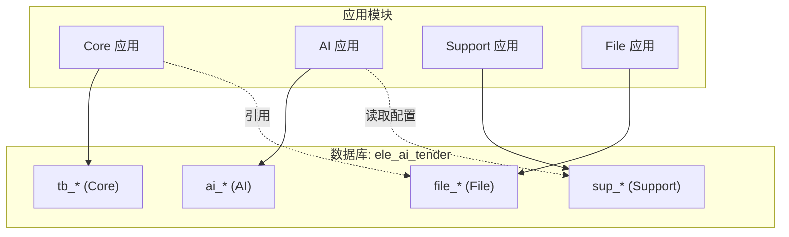
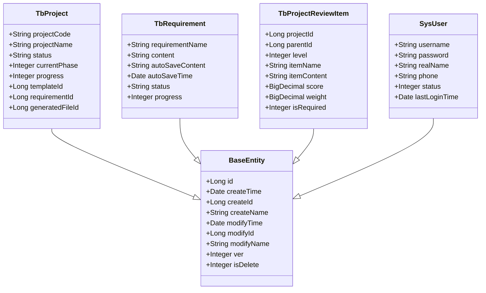
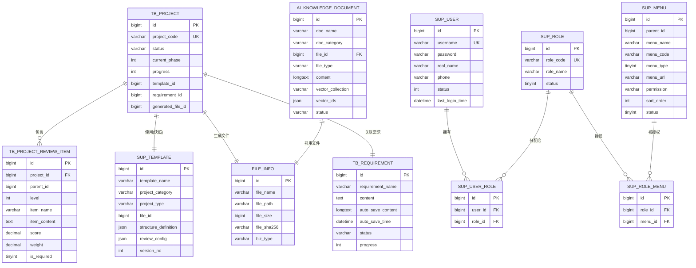
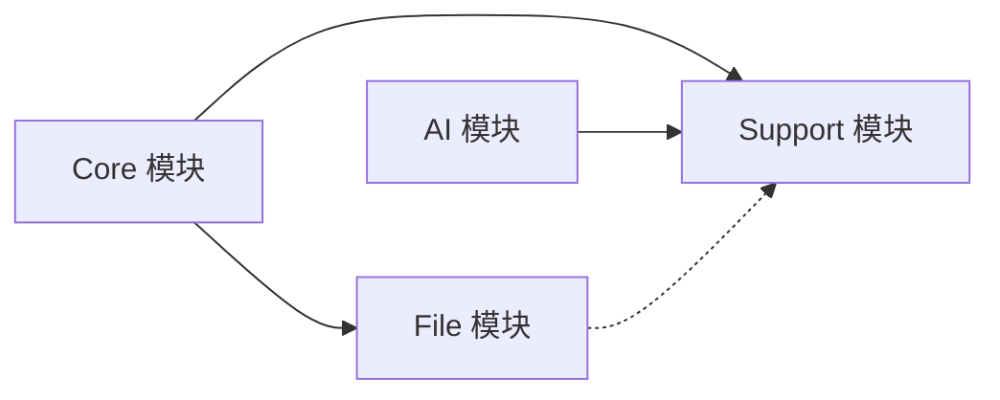

# 数据关系与约束

<cite>
**本文引用的文件**
- [BaseEntity.java](file://ele-ai-tender-system/ele-ai-tender-common/src/main/java/com/jy/eleaitender/common/entity/base/BaseEntity.java)
- [TbProject.java](file://ele-ai-tender-system/ele-ai-tender-common/src/main/java/com/jy/eleaitender/common/entity/core/TbProject.java)
- [TbRequirement.java](file://ele-ai-tender-system/ele-ai-tender-common/src/main/java/com/jy/eleaitender/common/entity/core/TbRequirement.java)
- [TbProjectReviewItem.java](file://ele-ai-tender-system/ele-ai-tender-common/src/main/java/com/jy/eleaitender/common/entity/core/TbProjectReviewItem.java)
- [SysUser.java](file://ele-ai-tender-system/ele-ai-tender-common/src/main/java/com/jy/eleaitender/common/entity/support/SysUser.java)
- [init.sql（Core）](file://ele-ai-tender-system/ele-ai-tender-core/sql/init.sql)
- [init.sql（Support）](file://ele-ai-tender-system/ele-ai-tender-support/sql/init.sql)
- [init.sql（AI）](file://ele-ai-tender-system/ele-ai-tender-ai/sql/init.sql)
- [init.sql（File）](file://ele-ai-tender-system/ele-ai-tender-file/sql/init.sql)
- [CODE_CONVENTIONS.md](file://docs/rules/CODE_CONVENTIONS.md)
- [MetaObjectHandlerImpl.java（AI模块）](file://ele-ai-tender-system/ele-ai-tender-ai/src/main/java/com/jy/eleaitender/ai/handler/MetaObjectHandlerImpl.java)
- [MetaObjectHandlerImpl.java（Core模块）](file://ele-ai-tender-system/ele-ai-tender-core/src/main/java/com/jy/eleaitender/core/handler/MetaObjectHandlerImpl.java)
- [MetaObjectHandlerImpl.java（Support模块）](file://ele-ai-tender-system/ele-ai-tender-support/src/main/java/com/jy/eleaitender/support/handler/MetaObjectHandlerImpl.java)
</cite>

## 目录
1. [引言](#引言)
2. [项目结构](#项目结构)
3. [核心组件](#核心组件)
4. [架构总览](#架构总览)
5. [详细组件分析](#详细组件分析)
6. [依赖分析](#依赖分析)
7. [性能考虑](#性能考虑)
8. [故障排查指南](#故障排查指南)
9. [结论](#结论)
10. [附录](#附录)

## 引言
本文件聚焦于系统的数据关系与约束，覆盖以下关键主题：
- 各模块间的数据关联关系、外键约束设计与数据完整性保证机制
- 主从表关系、一对多和多对多的数据库实现方案
- 软删除机制、乐观锁并发控制、审计字段自动填充的数据层实现
- 跨模块数据同步策略、分布式事务处理与最终一致性保证的技术方案
- 数据迁移脚本管理、版本升级兼容性与回滚策略的实施指导
- 数据质量检查、异常数据处理与监控告警的配置方法

## 项目结构
本项目采用多模块微服务化组织，数据库统一在 ele_ai_tender 库中，按业务域划分表前缀：
- tb_：编制中心（Core）
- ai_：AI能力（AI）
- sup_：支撑中心（Support）
- file_：文件服务（File）

图表来源
- [init.sql（Core）:1-272](file://ele-ai-tender-system/ele-ai-tender-core/sql/init.sql#L1-L272)
- [init.sql（AI）:1-119](file://ele-ai-tender-system/ele-ai-tender-ai/sql/init.sql#L1-L119)
- [init.sql（Support）:1-682](file://ele-ai-tender-system/ele-ai-tender-support/sql/init.sql#L1-L682)
- [init.sql（File）:1-80](file://ele-ai-tender-system/ele-ai-tender-file/sql/init.sql#L1-L80)

章节来源
- [init.sql（Core）:1-272](file://ele-ai-tender-system/ele-ai-tender-core/sql/init.sql#L1-L272)
- [init.sql（Support）:1-682](file://ele-ai-tender-system/ele-ai-tender-support/sql/init.sql#L1-L682)
- [init.sql（AI）:1-119](file://ele-ai-tender-system/ele-ai-tender-ai/sql/init.sql#L1-L119)
- [init.sql（File）:1-80](file://ele-ai-tender-system/ele-ai-tender-file/sql/init.sql#L1-L80)

## 核心组件
- 基础实体 BaseEntity：提供统一的审计字段、乐观锁与逻辑删除能力，所有业务实体均继承该类。
- 核心业务实体：
  - TbProject：项目主表，承载项目基本信息、状态、阶段、进度等
  - TbRequirement：业务需求表，支持草稿自动保存与状态推进
  - TbProjectReviewItem：评审项表，支持三级嵌套结构
- 支撑实体：
  - SysUser：系统用户，角色与菜单权限由支撑中心管理
- 公共基础设施：
  - MetaObjectHandlerImpl（各模块实现）：自动填充审计字段
  - SQL 初始化脚本：定义表结构、索引与初始数据

章节来源
- [BaseEntity.java:1-74](file://ele-ai-tender-system/ele-ai-tender-common/src/main/java/com/jy/eleaitender/common/entity/base/BaseEntity.java#L1-L74)
- [TbProject.java:1-100](file://ele-ai-tender-system/ele-ai-tender-common/src/main/java/com/jy/eleaitender/common/entity/core/TbProject.java#L1-L100)
- [TbRequirement.java:1-67](file://ele-ai-tender-system/ele-ai-tender-common/src/main/java/com/jy/eleaitender/common/entity/core/TbRequirement.java#L1-L67)
- [TbProjectReviewItem.java:1-67](file://ele-ai-tender-system/ele-ai-tender-common/src/main/java/com/jy/eleaitender/common/entity/core/TbProjectReviewItem.java#L1-L67)
- [SysUser.java:1-53](file://ele-ai-tender-system/ele-ai-tender-common/src/main/java/com/jy/eleaitender/common/entity/support/SysUser.java#L1-L53)
- [MetaObjectHandlerImpl.java（AI模块）](file://ele-ai-tender-system/ele-ai-tender-ai/src/main/java/com/jy/eleaitender/ai/handler/MetaObjectHandlerImpl.java)
- [MetaObjectHandlerImpl.java（Core模块）](file://ele-ai-tender-system/ele-ai-tender-core/src/main/java/com/jy/eleaitender/core/handler/MetaObjectHandlerImpl.java)
- [MetaObjectHandlerImpl.java（Support模块）](file://ele-ai-tender-system/ele-ai-tender-support/src/main/java/com/jy/eleaitender/support/handler/MetaObjectHandlerImpl.java)

## 架构总览
数据层以 MyBatis-Plus 为 ORM，结合注解完成：
- 主键自增、逻辑删除、乐观锁
- 审计字段自动填充
- 查询时自动追加 is_delete=0 条件

图表来源
- [BaseEntity.java:1-74](file://ele-ai-tender-system/ele-ai-tender-common/src/main/java/com/jy/eleaitender/common/entity/base/BaseEntity.java#L1-L74)
- [TbProject.java:1-100](file://ele-ai-tender-system/ele-ai-tender-common/src/main/java/com/jy/eleaitender/common/entity/core/TbProject.java#L1-L100)
- [TbRequirement.java:1-67](file://ele-ai-tender-system/ele-ai-tender-common/src/main/java/com/jy/eleaitender/common/entity/core/TbRequirement.java#L1-L67)
- [TbProjectReviewItem.java:1-67](file://ele-ai-tender-system/ele-ai-tender-common/src/main/java/com/jy/eleaitender/common/entity/core/TbProjectReviewItem.java#L1-L67)
- [SysUser.java:1-53](file://ele-ai-tender-system/ele-ai-tender-common/src/main/java/com/jy/eleaitender/common/entity/support/SysUser.java#L1-L53)

## 详细组件分析

### 数据模型与关系设计
- 主从表关系（一对多）
  - 项目与评审项：TbProjectReviewItem.projectId → TbProject.id
  - 项目与模板快照：TbProject.templateId → sup_template.id（只读快照）
  - 项目与生成文件：TbProject.generatedFileId → file_info.id
  - 项目与需求：TbProject.requirementId → TbRequirement.id
  - 知识库文档与文件：ai_knowledge_document.file_id → file_info.id
- 多对多关系（通过中间表）
  - 用户与角色：sup_user_role(user_id, role_id)
  - 角色与菜单：sup_role_menu(role_id, menu_id)
- 自引用树形结构
  - 评审项：parent_id 指向自身 id，level 表示层级（1/2/3）
- 共享表与跨模块引用
  - tb_detection_record：Core 与 AI 共享，分别定义不同实体字段
  - sup_access_log：Support 创建，File 可复用（注释说明）

图表来源
- [init.sql（Core）:1-272](file://ele-ai-tender-system/ele-ai-tender-core/sql/init.sql#L1-L272)
- [init.sql（AI）:1-119](file://ele-ai-tender-system/ele-ai-tender-ai/sql/init.sql#L1-L119)
- [init.sql（Support）:1-682](file://ele-ai-tender-system/ele-ai-tender-support/sql/init.sql#L1-L682)
- [init.sql（File）:1-80](file://ele-ai-tender-system/ele-ai-tender-file/sql/init.sql#L1-L80)

章节来源
- [init.sql（Core）:1-272](file://ele-ai-tender-system/ele-ai-tender-core/sql/init.sql#L1-L272)
- [init.sql（AI）:1-119](file://ele-ai-tender-system/ele-ai-tender-ai/sql/init.sql#L1-L119)
- [init.sql（Support）:1-682](file://ele-ai-tender-system/ele-ai-tender-support/sql/init.sql#L1-L682)
- [init.sql（File）:1-80](file://ele-ai-tender-system/ele-ai-tender-file/sql/init.sql#L1-L80)

### 软删除机制
- 注解驱动：BaseEntity 的 isDelete 字段标注 @TableLogic，MyBatis-Plus 在执行删除与查询时自动处理
- 行为约定：
  - 删除操作实际更新 is_delete=1
  - 查询默认追加 AND is_delete = 0
- 注意事项：
  - 某些场景需绕过逻辑删除（如批量清理），应使用原生 SQL 并明确说明影响范围

章节来源
- [BaseEntity.java:60-74](file://ele-ai-tender-system/ele-ai-tender-common/src/main/java/com/jy/eleaitender/common/entity/base/BaseEntity.java#L60-L74)
- [CODE_CONVENTIONS.md:24-56](file://docs/rules/CODE_CONVENTIONS.md#L24-L56)

### 乐观锁并发控制
- 注解驱动：BaseEntity 的 ver 字段标注 @Version，更新时自动 ver+1
- 冲突处理：
  - 当并发更新导致版本号不一致时，抛出 OptimisticLockException
- 适用场景：
  - 评审项编辑、项目状态推进、模板快照更新等需要强一致性的写路径

章节来源
- [BaseEntity.java:60-66](file://ele-ai-tender-system/ele-ai-tender-common/src/main/java/com/jy/eleaitender/common/entity/base/BaseEntity.java#L60-L66)
- [CODE_CONVENTIONS.md:24-56](file://docs/rules/CODE_CONVENTIONS.md#L24-L56)

### 审计字段自动填充
- 填充时机：
  - INSERT：createTime、createId、createName、ver、isDelete
  - INSERT_UPDATE：modifyTime、modifyId、modifyName
- 实现方式：
  - 各模块 MetaObjectHandlerImpl 实现 MyBatis-Plus 的 MetaObjectHandler 接口
- 建议：
  - 确保请求上下文携带当前用户信息，避免未登录场景下审计字段为空

章节来源
- [BaseEntity.java:24-59](file://ele-ai-tender-system/ele-ai-tender-common/src/main/java/com/jy/eleaitender/common/entity/base/BaseEntity.java#L24-L59)
- [MetaObjectHandlerImpl.java（AI模块）](file://ele-ai-tender-system/ele-ai-tender-ai/src/main/java/com/jy/eleaitender/ai/handler/MetaObjectHandlerImpl.java)
- [MetaObjectHandlerImpl.java（Core模块）](file://ele-ai-tender-system/ele-ai-tender-core/src/main/java/com/jy/eleaitender/core/handler/MetaObjectHandlerImpl.java)
- [MetaObjectHandlerImpl.java（Support模块）](file://ele-ai-tender-system/ele-ai-tender-support/src/main/java/com/jy/eleaitender/support/handler/MetaObjectHandlerImpl.java)
- [CODE_CONVENTIONS.md:24-56](file://docs/rules/CODE_CONVENTIONS.md#L24-L56)

### 跨模块数据同步策略
- 同步模式
  - 直接引用：通过外键 ID 引用其他模块表（如 TbProject.generatedFileId → file_info）
  - 共享表：tb_detection_record 被 Core 与 AI 共同使用，各自维护不同实体字段
  - 异步回调：ai_task_external_callback 记录外部系统回调状态与重试次数
- 一致性保障
  - 本地事务：同一模块内多表写入使用数据库事务
  - 最终一致性：跨模块通过任务队列与回调表进行补偿与重试
  - 幂等性：回调接口需基于 task_id 或唯一业务键实现幂等

章节来源
- [init.sql（Core）:213-272](file://ele-ai-tender-system/ele-ai-tender-core/sql/init.sql#L213-L272)
- [init.sql（AI）:1-119](file://ele-ai-tender-system/ele-ai-tender-ai/sql/init.sql#L1-L119)

### 分布式事务与最终一致性
- 推荐方案
  - Saga/补偿：将长事务拆分为多个本地事务，失败时执行补偿动作
  - 事件驱动：通过消息队列或任务表驱动下游消费，达到最终一致
  - 重试与死信：对失败回调进行指数退避重试，超过阈值进入死信队列人工介入
- 监控与观测
  - 访问日志：sup_access_log 记录链路追踪、耗时、错误类型
  - 任务日志：ai_response_log 记录模型调用详情与 token 消耗

章节来源
- [init.sql（Support）:234-272](file://ele-ai-tender-system/ele-ai-tender-support/sql/init.sql#L234-L272)
- [init.sql（AI）:75-105](file://ele-ai-tender-system/ele-ai-tender-ai/sql/init.sql#L75-L105)

### 数据迁移脚本管理与版本升级
- 脚本组织
  - 按模块拆分 init.sql，统一在 ele_ai_tender 库执行
  - 顺序：support → ai → core → file（参考脚本注释）
- 兼容性策略
  - 新增字段优先允许 NULL 并提供默认值
  - 变更枚举值时保留旧值兼容查询
  - 索引按需添加，避免全表扫描
- 回滚策略
  - 提供反向补丁脚本（如重命名列、删除索引）
  - 发布前在测试环境验证回滚脚本可行性

章节来源
- [init.sql（AI）:1-10](file://ele-ai-tender-system/ele-ai-tender-ai/sql/init.sql#L1-L10)
- [init.sql（Support）:1-10](file://ele-ai-tender-system/ele-ai-tender-support/sql/init.sql#L1-L10)
- [init.sql（Core）:1-10](file://ele-ai-tender-system/ele-ai-tender-core/sql/init.sql#L1-L10)

### 数据质量检查与异常处理
- 数据质量
  - 唯一约束：项目编号、用户名、角色编码等设置 UNIQUE INDEX
  - 非空校验：关键字段 NOT NULL，配合前端与服务端双重校验
  - 范围校验：金额 DECIMAL(15,2)、百分比 INT 0-100
- 异常处理
  - 乐观锁冲突：捕获 OptimisticLockException 并提示用户重试
  - 逻辑删除误用：避免在统计报表中遗漏已删除数据，必要时显式查询 is_delete
  - 回调失败：根据 retry_count 与 last_callback_time 判断是否重试或告警

章节来源
- [init.sql（Core）:22-63](file://ele-ai-tender-system/ele-ai-tender-core/sql/init.sql#L22-L63)
- [init.sql（Support）:23-45](file://ele-ai-tender-system/ele-ai-tender-support/sql/init.sql#L23-L45)
- [init.sql（AI）:17-46](file://ele-ai-tender-system/ele-ai-tender-ai/sql/init.sql#L17-L46)

### 监控告警配置
- 指标采集
  - 访问日志：trace_id、service_name、elapsed_ms、error_type
  - 任务日志：task_id、model、total_tokens、finish_reason
- 告警规则
  - 高错误率：error_type 非空且占比超过阈值
  - 慢查询：elapsed_ms 超过阈值
  - 任务积压：ai_task.status=PENDING 数量持续增长

章节来源
- [init.sql（Support）:234-272](file://ele-ai-tender-system/ele-ai-tender-support/sql/init.sql#L234-L272)
- [init.sql（AI）:75-105](file://ele-ai-tender-system/ele-ai-tender-ai/sql/init.sql#L75-L105)

## 依赖分析
- 模块耦合
  - Core 依赖 File（生成文件）、Support（模板、参数）
  - AI 依赖 Support（模型配置、路由规则）
  - File 独立部署，但与其他模块共享 sup_access_log（可选）
- 外部依赖
  - MyBatis-Plus：注解驱动数据层行为
  - MySQL：InnoDB 引擎，utf8mb4 字符集

图表来源
- [init.sql（Core）:1-272](file://ele-ai-tender-system/ele-ai-tender-core/sql/init.sql#L1-L272)
- [init.sql（AI）:1-119](file://ele-ai-tender-system/ele-ai-tender-ai/sql/init.sql#L1-L119)
- [init.sql（Support）:1-682](file://ele-ai-tender-system/ele-ai-tender-support/sql/init.sql#L1-L682)
- [init.sql（File）:1-80](file://ele-ai-tender-system/ele-ai-tender-file/sql/init.sql#L1-L80)

章节来源
- [init.sql（Core）:1-272](file://ele-ai-tender-system/ele-ai-tender-core/sql/init.sql#L1-L272)
- [init.sql（AI）:1-119](file://ele-ai-tender-system/ele-ai-tender-ai/sql/init.sql#L1-L119)
- [init.sql（Support）:1-682](file://ele-ai-tender-system/ele-ai-tender-support/sql/init.sql#L1-L682)
- [init.sql（File）:1-80](file://ele-ai-tender-system/ele-ai-tender-file/sql/init.sql#L1-L80)

## 性能考虑
- 索引优化
  - 高频查询字段建立索引（如 status、project_id、user_id、menu_code）
  - 复合索引用于常见过滤组合（biz_type+biz_id+project_id+tender_id）
- 存储选型
  - JSON 字段用于灵活扩展（如结构定义、评审配置、向量ID列表）
  - LONGTEXT/TEXT 用于大文本内容（检测结果、响应内容）
- 读写分离与缓存
  - 读多写少场景引入 Redis 缓存热点数据（如菜单、参数）
  - 写路径保持短事务，减少锁竞争

[本节为通用性能建议，不直接分析具体文件]

## 故障排查指南
- 常见问题
  - 乐观锁冲突：检查并发更新路径，增加重试与用户提示
  - 逻辑删除误用：确认查询是否显式包含 is_delete 条件
  - 回调失败：查看 ai_task_external_callback 的 retry_count 与 error_msg
- 定位手段
  - 通过 trace_id 串联访问日志与业务日志
  - 使用 ai_response_log 分析模型调用耗时与错误原因

章节来源
- [BaseEntity.java:60-74](file://ele-ai-tender-system/ele-ai-tender-common/src/main/java/com/jy/eleaitender/common/entity/base/BaseEntity.java#L60-L74)
- [init.sql（AI）:247-272](file://ele-ai-tender-system/ele-ai-tender-ai/sql/init.sql#L247-L272)
- [init.sql（Support）:234-272](file://ele-ai-tender-system/ele-ai-tender-support/sql/init.sql#L234-L272)

## 结论
本系统通过统一的 BaseEntity 规范、严格的索引设计与清晰的模块边界，实现了高内聚低耦合的数据架构。软删除与乐观锁保障了数据一致性与并发安全；跨模块通过共享表与回调机制达成最终一致性。配合完善的迁移脚本与监控体系，系统在可扩展性与可运维性方面具备良好基础。

[本节为总结性内容，不直接分析具体文件]

## 附录
- 术语
  - 软删除：逻辑删除，is_delete=1 表示已删除
  - 乐观锁：基于版本号 ver 的并发控制
  - 审计字段：创建/修改时间与人信息的自动填充
- 最佳实践
  - 新增字段遵循向后兼容原则
  - 复杂查询尽量使用复合索引
  - 跨模块操作优先异步化与幂等化

[本节为补充说明，不直接分析具体文件]