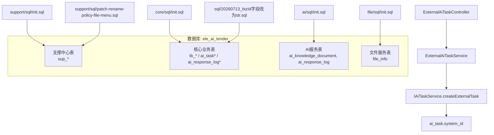
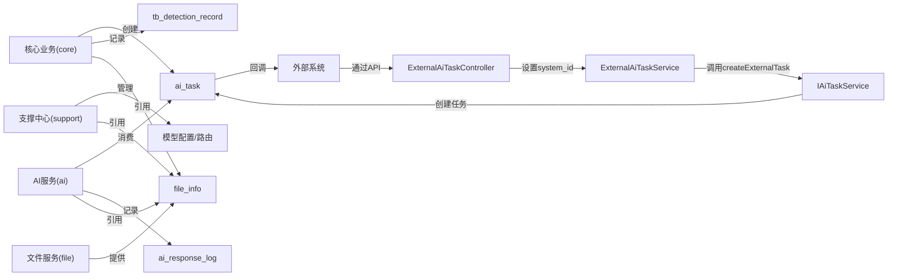

# 数据库架构变更

<cite>
**本文引用的文件**   
- [ele-ai-tender-system/ele-ai-tender-support/sql/init.sql](file://ele-ai-tender-system/ele-ai-tender-support/sql/init.sql)
- [ele-ai-tender-system/ele-ai-tender-core/sql/init.sql](file://ele-ai-tender-system/ele-ai-tender-core/sql/init.sql)
- [ele-ai-tender-system/ele-ai-tender-ai/sql/init.sql](file://ele-ai-tender-system/ele-ai-tender-ai/sql/init.sql)
- [ele-ai-tender-system/ele-ai-tender-file/sql/init.sql](file://ele-ai-tender-system/ele-ai-tender-file/sql/init.sql)
- [ele-ai-tender-system/ele-ai-tender-support/sql/patch-rename-policy-file-menu.sql](file://ele-ai-tender-system/ele-ai-tender-support/sql/patch-rename-policy-file-menu.sql)
- [docs/guides/cleanup-test-data-mysql.sql](file://docs/guides/cleanup-test-data-mysql.sql)
- [sql/20260713_bizId字段改为str.sql](file://sql/20260713_bizId字段改为str.sql)
- [ele-ai-tender-system/ele-ai-tender-common/src/main/java/com/jy/eleaitender/common/entity/ai/AiTask.java](file://ele-ai-tender-system/ele-ai-tender-common/src/main/java/com/jy/eleaitender/common/entity/ai/AiTask.java)
- [ele-ai-tender-system/ele-ai-tender-core/src/main/java/com/jy/eleaitender/core/service/external/ExternalAiTaskService.java](file://ele-ai-tender-system/ele-ai-tender-core/src/main/java/com/jy/eleaitender/core/service/external/ExternalAiTaskService.java)
- [ele-ai-tender-system/ele-ai-tender-core/src/main/java/com/jy/eleaitender/core/controller/external/ExternalAiTaskController.java](file://ele-ai-tender-system/ele-ai-tender-core/src/main/java/com/jy/eleaitender/core/controller/external/ExternalAiTaskController.java)
- [ele-ai-tender-system/ele-ai-tender-core/src/main/java/com/jy/eleaitender/core/service/IAiTaskService.java](file://ele-ai-tender-system/ele-ai-tender-core/src/main/java/com/jy/eleaitender/core/service/IAiTaskService.java)
- [ele-ai-tender-system/ele-ai-tender-interaction/ele-ai-tender-common-interaction/src/main/java/com/jy/eleaitender/common/interaction/dto/AiTaskResultCallbackRequest.java](file://ele-ai-tender-system/ele-ai-tender-interaction/ele-ai-tender-common-interaction/src/main/java/com/jy/eleaitender/common/interaction/dto/AiTaskResultCallbackRequest.java)
</cite>

## 更新摘要
**所做更改**   
- 新增了bizId字段类型从数值型升级为varchar(64)的详细迁移说明和性能影响分析
- 补充了system_id字段的完整实现细节，包括外部系统集成追踪机制
- 更新了AI任务表(ai_task)的字段结构变更对索引设计和查询性能的影响
- 增强了外部系统集成的架构说明，包含完整的回调机制
- 补充了字段迁移的执行顺序、注意事项和回滚策略

## 目录
1. [引言](#引言)
2. [项目结构](#项目结构)
3. [核心组件](#核心组件)
4. [架构总览](#架构总览)
5. [详细组件分析](#详细组件分析)
6. [依赖关系分析](#依赖关系分析)
7. [性能与索引建议](#性能与索引建议)
8. [故障排查指南](#故障排查指南)
9. [结论](#结论)
10. [附录：初始化与迁移执行顺序](#附录初始化与迁移执行顺序)

## 引言
本文件聚焦于"招标文件AI编制工具"的数据库架构变更，梳理支撑中心、核心业务、AI服务与文件服务的表结构、索引设计、跨模块共享表、以及补丁脚本的执行策略。文档旨在为DBA与研发提供一致的建库建表规范、变更路径与回滚注意事项，确保多模块在同一数据库实例下的数据一致性与可维护性。

**最新更新**：AI任务表(ai_task)已完成重要的字段结构调整，biz_id字段从数值类型升级为varchar(64)，并新增system_id字段以支持外部系统集成追踪功能。这些变更显著增强了系统的外部集成能力和业务ID格式的灵活性。

## 项目结构
本项目采用多模块拆分，每个模块包含独立的SQL初始化脚本，统一使用同一数据库实例 ele_ai_tender。关键SQL位置如下：
- 支撑中心（用户、角色、菜单、系统参数、模板、消息等）：support/sql/init.sql
- 核心业务（项目、需求、评审项、检测记录、外部回调等）：core/sql/init.sql
- AI服务（任务队列、知识库文档、响应日志等）：ai/sql/init.sql
- 文件服务（文件信息表）：file/sql/init.sql
- 补丁脚本（菜单名称修正等）：support/sql/patch-rename-policy-file-menu.sql
- 测试数据清理参考：docs/guides/cleanup-test-data-mysql.sql
- **重要更新**：字段迁移脚本：sql/20260713_bizId字段改为str.sql

**图表来源**
- [ele-ai-tender-system/ele-ai-tender-support/sql/init.sql:1-682](file://ele-ai-tender-system/ele-ai-tender-support/sql/init.sql#L1-L682)
- [ele-ai-tender-system/ele-ai-tender-core/sql/init.sql:1-246](file://ele-ai-tender-system/ele-ai-tender-core/sql/init.sql#L1-L246)
- [ele-ai-tender-system/ele-ai-tender-ai/sql/init.sql:1-119](file://ele-ai-tender-system/ele-ai-tender-ai/sql/init.sql#L1-L119)
- [ele-ai-tender-system/ele-ai-tender-file/sql/init.sql:1-80](file://ele-ai-tender-system/ele-ai-tender-file/sql/init.sql#L1-L80)
- [ele-ai-tender-system/ele-ai-tender-support/sql/patch-rename-policy-file-menu.sql:1-7](file://ele-ai-tender-system/ele-ai-tender-support/sql/patch-rename-policy-file-menu.sql#L1-L7)
- [sql/20260713_bizId字段改为str.sql:1-12](file://sql/20260713_bizId字段改为str.sql#L1-L12)
- [ele-ai-tender-system/ele-ai-tender-core/src/main/java/com/jy/eleaitender/core/controller/external/ExternalAiTaskController.java:17-32](file://ele-ai-tender-system/ele-ai-tender-core/src/main/java/com/jy/eleaitender/core/controller/external/ExternalAiTaskController.java#L17-L32)
- [ele-ai-tender-system/ele-ai-tender-core/src/main/java/com/jy/eleaitender/core/service/external/ExternalAiTaskService.java:45-90](file://ele-ai-tender-system/ele-ai-tender-core/src/main/java/com/jy/eleaitender/core/service/external/ExternalAiTaskService.java#L45-L90)
- [ele-ai-tender-system/ele-ai-tender-core/src/main/java/com/jy/eleaitender/core/service/IAiTaskService.java:22-23](file://ele-ai-tender-system/ele-ai-tender-core/src/main/java/com/jy/eleaitender/core/service/IAiTaskService.java#L22-L23)

章节来源
- [ele-ai-tender-system/ele-ai-tender-support/sql/init.sql:1-682](file://ele-ai-tender-system/ele-ai-tender-support/sql/init.sql#L1-L682)
- [ele-ai-tender-system/ele-ai-tender-core/sql/init.sql:1-246](file://ele-ai-tender-system/ele-ai-tender-core/sql/init.sql#L1-L246)
- [ele-ai-tender-system/ele-ai-tender-ai/sql/init.sql:1-119](file://ele-ai-tender-system/ele-ai-tender-ai/sql/init.sql#L1-L119)
- [ele-ai-tender-system/ele-ai-tender-file/sql/init.sql:1-80](file://ele-ai-tender-system/ele-ai-tender-file/sql/init.sql#L1-L80)
- [ele-ai-tender-system/ele-ai-tender-support/sql/patch-rename-policy-file-menu.sql:1-7](file://ele-ai-tender-system/ele-ai-tender-support/sql/patch-rename-policy-file-menu.sql#L1-L7)
- [sql/20260713_bizId字段改为str.sql:1-12](file://sql/20260713_bizId字段改为str.sql#L1-L12)

## 核心组件
本节按模块梳理关键表及其职责、关键字段与索引设计要点。

- 支撑中心（support）
  - 用户与权限：sup_user、sup_role、sup_user_role、sup_menu、sup_role_menu
  - 接入系统与版本：sup_access_system、sup_main_version、sup_plugin_version
  - 日志与参数：sup_operation_log、sup_access_log、sup_sys_parameter
  - 政策文件与模板：sup_policy_file、sup_template
  - AI模型配置与路由：sup_model_config、sup_model_route_rule
  - 消息与短信：sup_message、sup_sms_code
  - **重要更新**：sup_access_system表的system_name和app_key字段长度已调整为varchar(50)

- 核心业务（core）
  - 项目与版本：tb_project、tb_project_version
  - 需求与模板快照：tb_requirement、tb_project_template
  - 评审项：tb_project_review_item（支持三级嵌套）
  - 用户政策文件：tb_policy_file
  - 检测记录：tb_detection_record（Core/AI共享）

- AI服务（ai）
  - 任务队列：ai_task（PENDING/PROCESSING/COMPLETED/FAILED/AI_UNAVAILABLE/SKIPPED）
    - **重大更新**：biz_id字段已从数值类型升级为varchar(64)，支持UUID、外部系统ID等灵活格式
    - **新增字段**：system_id用于标识调用系统的ID，实现完整的外部系统集成追踪
    - 索引设计：status、project_id、biz_id+biz_type、task_type+status索引，支撑轮询与批量处理
  - 知识库文档：ai_knowledge_document（含向量集合与ID）
  - 响应日志：ai_response_log（记录每次模型调用详情）

- 文件服务（file）
  - 文件信息：file_info（存储路径、SHA-256、业务类型等）

章节来源
- [ele-ai-tender-system/ele-ai-tender-support/sql/init.sql:20-467](file://ele-ai-tender-system/ele-ai-tender-support/sql/init.sql#L20-L467)
- [ele-ai-tender-system/ele-ai-tender-core/sql/init.sql:18-246](file://ele-ai-tender-system/ele-ai-tender-core/sql/init.sql#L18-L246)
- [ele-ai-tender-system/ele-ai-tender-ai/sql/init.sql:12-119](file://ele-ai-tender-system/ele-ai-tender-ai/sql/init.sql#L12-L119)
- [ele-ai-tender-system/ele-ai-tender-file/sql/init.sql:12-35](file://ele-ai-tender-system/ele-ai-tender-file/sql/init.sql#L12-L35)
- [sql/20260713_bizId字段改为str.sql:7-11](file://sql/20260713_bizId字段改为str.sql#L7-L11)

## 架构总览
下图展示各模块在数据库层面的表分布与共享关系，突出跨模块共享表与读写边界。

```mermaid
erDiagram
SUP_USER {
bigint id PK
string username UK
string phone UK
tinyint status
}
SUP_ROLE {
bigint id PK
string role_code UK
tinyint status
}
SUP_USER_ROLE {
bigint id PK
bigint user_id FK
bigint role_id FK
}
SUP_MENU {
bigint id PK
bigint parent_id
string menu_code
tinyint status
}
SUP_ROLE_MENU {
bigint id PK
bigint role_id FK
bigint menu_id FK
}
SUP_ACCESS_SYSTEM {
bigint id PK
string system_name
string system_url
string app_key UK
tinyint status
}
SUP_MAIN_VERSION {
bigint id PK
string system_name
string version_number
bigint file_id
tinyint status
}
SUP_PLUGIN_VERSION {
bigint id PK
string plugin_name
string version_number
string compatible_main_version
bigint file_id
tinyint status
}
SUP_OPERATION_LOG {
bigint id PK
bigint user_id
string operation
datetime create_time
}
SUP_ACCESS_LOG {
bigint id PK
string trace_id
string service_name
datetime create_time
}
SUP_SYS_PARAMETER {
bigint id PK
string param_group
string param_key UK
string param_value
string param_type
}
SUP_POLICY_FILE {
bigint id PK
string file_category
string applicable_category
bigint file_id
tinyint status
}
SUP_TEMPLATE {
bigint id PK
string template_name
string project_category
string project_type
bigint file_id
tinyint is_default
string status
}
SUP_MODEL_CONFIG {
bigint id PK
string model_name
string model_type
string provider
json model_params
string usage_scenario
tinyint is_active
}
SUP_MODEL_ROUTE_RULE {
bigint id PK
string usage_scenario
bigint primary_model_id
bigint fallback_model_id
int priority
tinyint is_active
}
SUP_MESSAGE {
bigint id PK
bigint user_id
string title
text content
string message_type
bigint biz_id
string biz_type
tinyint is_read
}
SUP_SMS_CODE {
bigint id PK
string phone
string code
string scene
string status
datetime expire_time
}
TB_PROJECT {
bigint id PK
string project_code UK
string project_name
string project_category
string project_type
decimal budget
string status
int current_phase
int progress
bigint template_id
string match_mode
bigint matched_file_id
decimal matched_similarity
bigint uploaded_file_id
bigint requirement_id
string requirement_source
longtext requirement_content
bigint generated_file_id
}
TB_PROJECT_VERSION {
bigint id PK
bigint project_id
int version_no
json content_snapshot
string change_description
}
TB_REQUIREMENT {
bigint id PK
string requirement_name
string project_category
string project_type
string service_sub_type
decimal budget
string requirement_description
string match_mode
bigint matched_file_id
decimal matched_similarity
bigint uploaded_file_id
text content
longtext auto_save_content
datetime auto_save_time
string status
int progress
}
TB_PROJECT_TEMPLATE {
bigint id PK
bigint project_id UK
bigint template_id
string template_name
string project_category
string project_type
bigint file_id
text content
json structure_definition
json review_config
int version_no
}
TB_PROJECT_REVIEW_ITEM {
bigint id PK
bigint project_id
bigint parent_id
int level
string item_name
text item_content
int sort_order
string review_type
decimal score
decimal max_score
decimal weight
string subjectivity
tinyint is_required
}
TB_POLICY_FILE {
bigint id PK
string file_name
string file_category
string applicable_category
bigint file_id
bigint file_size
string file_type
string description
bigint user_id
tinyint status
}
TB_DETECTION_RECORD {
bigint id PK
bigint requirement_id
bigint project_id
string detection_type
text content_snapshot
longtext result
string status
bigint task_id
string policy_file_ids
datetime started_at
datetime completed_at
}
AI_TASK {
bigint id PK
string task_type
bigint system_id
bigint project_id
string biz_id
string biz_type
text request_params
string file_ids
string status
longtext result
string error_msg
int retry_count
int max_retry
datetime started_at
datetime completed_at
int timeout_minutes
}
AI_KNOWLEDGE_DOCUMENT {
bigint id PK
string doc_name
string doc_category
bigint file_id
string file_type
longtext content
string vector_collection
json vector_ids
string status
}
AI_RESPONSE_LOG {
bigint id PK
string model
string role
longtext messages
longtext content
string finish_reason
int prompt_tokens
int completion_tokens
int total_tokens
bigint task_id
string conversation_id
}
FILE_INFO {
bigint id PK
string file_name
string file_path
bigint file_size
string file_sha256
string biz_type
}
SUP_USER ||--o{ SUP_USER_ROLE : "拥有"
SUP_ROLE ||--o{ SUP_USER_ROLE : "分配"
SUP_MENU ||--o{ SUP_ROLE_MENU : "授权"
SUP_ROLE ||--o{ SUP_ROLE_MENU : "关联"
TB_PROJECT ||--o{ TB_PROJECT_VERSION : "包含版本"
TB_PROJECT ||--o{ TB_PROJECT_TEMPLATE : "快照模板"
TB_PROJECT ||--o{ TB_PROJECT_REVIEW_ITEM : "包含评审项"
TB_PROJECT ||--o{ TB_DETECTION_RECORD : "产生检测记录"
TB_REQUIREMENT ||--o{ TB_DETECTION_RECORD : "需求级检测"
TB_PROJECT_TEMPLATE }o--|| SUP_TEMPLATE : "引用源模板"
TB_POLICY_FILE }o--|| FILE_INFO : "引用文件"
SUP_POLICY_FILE }o--|| FILE_INFO : "引用文件"
AI_KNOWLEDGE_DOCUMENT }o--|| FILE_INFO : "引用文件"
TB_PROJECT }o--|| FILE_INFO : "生成文件"
TB_DETECTION_RECORD }o--|| AI_TASK : "关联任务"
AI_TASK ||--o{ AI_RESPONSE_LOG : "记录响应"
```

**图表来源**
- [ele-ai-tender-system/ele-ai-tender-support/sql/init.sql:20-467](file://ele-ai-tender-system/ele-ai-tender-support/sql/init.sql#L20-L467)
- [ele-ai-tender-system/ele-ai-tender-core/sql/init.sql:18-246](file://ele-ai-tender-system/ele-ai-tender-core/sql/init.sql#L18-L246)
- [ele-ai-tender-system/ele-ai-tender-ai/sql/init.sql:12-119](file://ele-ai-tender-system/ele-ai-tender-ai/sql/init.sql#L12-L119)
- [ele-ai-tender-system/ele-ai-tender-file/sql/init.sql:12-35](file://ele-ai-tender-system/ele-ai-tender-file/sql/init.sql#L12-L35)

## 详细组件分析

### 支撑中心（support）
- 用户与权限
  - sup_user：用户名、手机号唯一索引；状态索引便于筛选启用用户。
  - sup_role：角色编码唯一索引。
  - sup_user_role：联合唯一索引避免重复分配；role_id索引加速查询。
  - sup_menu：parent_id与menu_code索引用于树形加载与权限匹配。
  - sup_role_menu：联合唯一索引防止重复授权；menu_id索引加速反向查询。
- 接入系统与版本
  - sup_access_system：app_key唯一索引；status+expire_time复合索引用于快速定位有效系统。
  - **重要更新**：system_name和app_key字段长度已调整为varchar(50)，优化存储空间。
  - sup_main_version/sup_plugin_version：system_name+version_number、plugin_name+version_number复合索引；status索引用于发布态过滤。
- 日志与参数
  - sup_operation_log：user_id与create_time索引便于审计检索。
  - sup_access_log：trace_id、service_name、create_time与biz_context复合索引用于链路追踪与聚合统计。
  - sup_sys_parameter：param_key唯一索引；param_group索引用于分组查询。
- 政策文件与模板
  - sup_policy_file：file_category、applicable_category、status索引便于分类与启用过滤。
  - sup_template：project_category+project_type复合索引；status与file_id索引提升选择效率。
- AI模型配置与路由
  - sup_model_config：model_type、usage_scenario、is_active索引便于场景化选择与启停控制。
  - sup_model_route_rule：usage_scenario与is_active索引用于路由规则快速匹配。
- 消息与短信
  - sup_message：user_id、message_type、is_read、create_time索引优化消息列表与未读筛选。
  - sup_sms_code：phone+status复合索引；expire_time与create_time索引用于过期清理与发送频次控制。

章节来源
- [ele-ai-tender-system/ele-ai-tender-support/sql/init.sql:20-467](file://ele-ai-tender-system/ele-ai-tender-support/sql/init.sql#L20-L467)
- [sql/20260713_bizId字段改为str.sql:7-11](file://sql/20260713_bizId字段改为str.sql#L7-L11)

### 核心业务（core）
- 项目与版本
  - tb_project：project_code唯一索引；status、project_category、create_id索引用于列表与筛选。
  - tb_project_version：project_id+version_no复合索引用于版本回溯。
- 需求与模板快照
  - tb_requirement：status、create_id索引；auto_save_content字段支持草稿保存。
  - tb_project_template：project_id唯一索引保证单项目单快照；template_id索引用于溯源。
- 评审项
  - tb_project_review_item：project_id、parent_id、review_type索引支持树形结构与类型筛选。
- 用户政策文件
  - tb_policy_file：user_id、applicable_category、status索引便于用户维度与适用类别检索。
- 检测记录
  - tb_detection_record：requirement_id、project_id、status、detection_type、task_id索引覆盖常见查询路径。

章节来源
- [ele-ai-tender-system/ele-ai-tender-core/sql/init.sql:18-246](file://ele-ai-tender-system/ele-ai-tender-core/sql/init.sql#L18-L246)

### AI服务（ai）
- 任务队列
  - ai_task：**重大架构更新** - 字段结构已调整以支持外部系统集成
    - **biz_id字段升级**：从数值类型改为varchar(64)，支持更灵活的业务ID格式（如UUID、外部系统ID、组合ID等）
    - **新增system_id字段**：bigint类型，位于task_type之后，用于标识调用系统的ID，实现完整的外部系统集成追踪
    - 索引设计：status、project_id、biz_id+biz_type、task_type+status索引，支撑轮询与批量处理
    - **外部系统集成**：通过ExternalAiTaskService和IAiTaskService.createExternalTask方法支持外部系统创建任务
  - **重要影响**：biz_id字段类型变更可能导致相关查询性能变化，需要重新评估索引效率
- 知识库文档
  - ai_knowledge_document：doc_category、status、file_id索引便于入库与检索。
- 响应日志
  - ai_response_log：task_id、conversation_id、role、create_time、model索引用于审计与成本统计。

**更新** AI任务表已完成重要的字段结构调整，显著增强了对外部系统集成的支持能力。biz_id字段的varchar(64)类型变更提供了更大的灵活性，而system_id字段的添加实现了完整的外部系统集成追踪。

章节来源
- [ele-ai-tender-system/ele-ai-tender-ai/sql/init.sql:12-46](file://ele-ai-tender-system/ele-ai-tender-ai/sql/init.sql#L12-L46)
- [sql/20260713_bizId字段改为str.sql:1-5](file://sql/20260713_bizId字段改为str.sql#L1-L5)
- [ele-ai-tender-system/ele-ai-tender-common/src/main/java/com/jy/eleaitender/common/entity/ai/AiTask.java:24-34](file://ele-ai-tender-system/ele-ai-tender-common/src/main/java/com/jy/eleaitender/common/entity/ai/AiTask.java#L24-L34)
- [ele-ai-tender-system/ele-ai-tender-core/src/main/java/com/jy/eleaitender/core/service/IAiTaskService.java:22-23](file://ele-ai-tender-system/ele-ai-tender-core/src/main/java/com/jy/eleaitender/core/service/IAiTaskService.java#L22-L23)

### 文件服务（file）
- 文件信息
  - file_info：file_sha256、biz_type、create_time索引用于去重、业务分类与时间排序。

章节来源
- [ele-ai-tender-system/ele-ai-tender-file/sql/init.sql:12-35](file://ele-ai-tender-system/ele-ai-tender-file/sql/init.sql#L12-L35)

### 补丁脚本
- 菜单名称修正
  - patch-rename-policy-file-menu.sql：将policy-file菜单显示名更新为"政策文件审查库"，避免历史不一致。
- **重要更新**：字段迁移脚本
  - 20260713_bizId字段改为str.sql：执行ai_task表的biz_id字段类型升级和system_id字段添加操作，同时调整sup_access_system表的字段长度

章节来源
- [ele-ai-tender-system/ele-ai-tender-support/sql/patch-rename-policy-file-menu.sql:1-7](file://ele-ai-tender-system/ele-ai-tender-support/sql/patch-rename-policy-file-menu.sql#L1-L7)
- [sql/20260713_bizId字段改为str.sql:1-12](file://sql/20260713_bizId字段改为str.sql#L1-L12)

## 依赖关系分析
- 跨模块共享表
  - ai_task与ai_response_log：由core写入任务并触发AI处理，AI写入响应日志；检测记录通过task_id关联。
  - file_info：被core、ai、support共同引用，作为文件元数据集中管理。
  - sup_model_config与sup_model_route_rule：由support管理，AI只读。
- 读写边界
  - support：写用户、角色、菜单、参数、模板、模型配置；读方包括AI与前端。
  - core：写项目、需求、评审项、检测记录、外部回调；读方包括AI与前端。
  - ai：写任务、知识库文档、响应日志；读模型配置与文件信息。
  - file：写文件信息；其他模块读文件信息。
- **重大更新**：外部系统集成架构
  - ExternalAiTaskController提供外部API接口，接收来自外部系统的任务创建请求
  - ExternalAiTaskService处理外部请求，验证系统身份并设置system_id
  - IAiTaskService.createExternalTask方法专门处理外部任务创建，区分内部和外部任务来源
  - 通过appKey验证外部系统身份，确保安全性
  - AiTaskResultCallbackRequest支持任务完成后的结果回调机制

**图表来源**
- [ele-ai-tender-system/ele-ai-tender-core/sql/init.sql:219-246](file://ele-ai-tender-system/ele-ai-tender-core/sql/init.sql#L219-L246)
- [ele-ai-tender-system/ele-ai-tender-ai/sql/init.sql:12-119](file://ele-ai-tender-system/ele-ai-tender-ai/sql/init.sql#L12-L119)
- [ele-ai-tender-system/ele-ai-tender-file/sql/init.sql:12-35](file://ele-ai-tender-system/ele-ai-tender-file/sql/init.sql#L12-L35)
- [ele-ai-tender-system/ele-ai-tender-support/sql/init.sql:142-163](file://ele-ai-tender-system/ele-ai-tender-support/sql/init.sql#L142-L163)
- [ele-ai-tender-system/ele-ai-tender-core/src/main/java/com/jy/eleaitender/core/controller/external/ExternalAiTaskController.java:17-32](file://ele-ai-tender-system/ele-ai-tender-core/src/main/java/com/jy/eleaitender/core/controller/external/ExternalAiTaskController.java#L17-L32)
- [ele-ai-tender-system/ele-ai-tender-core/src/main/java/com/jy/eleaitender/core/service/external/ExternalAiTaskService.java:45-90](file://ele-ai-tender-system/ele-ai-tender-core/src/main/java/com/jy/eleaitender/core/service/external/ExternalAiTaskService.java#L45-L90)
- [ele-ai-tender-system/ele-ai-tender-core/src/main/java/com/jy/eleaitender/core/service/IAiTaskService.java:22-23](file://ele-ai-tender-system/ele-ai-tender-core/src/main/java/com/jy/eleaitender/core/service/IAiTaskService.java#L22-L23)
- [ele-ai-tender-system/ele-ai-tender-interaction/ele-ai-tender-common-interaction/src/main/java/com/jy/eleaitender/common/interaction/dto/AiTaskResultCallbackRequest.java:11-54](file://ele-ai-tender-system/ele-ai-tender-interaction/ele-ai-tender-common-interaction/src/main/java/com/jy/eleaitender/common/interaction/dto/AiTaskResultCallbackRequest.java#L11-L54)

## 性能与索引建议
- 高频查询路径
  - 任务轮询：ai_task.status + ai_task.task_type组合索引已存在，建议监控扫描行数与慢查询。
  - 检测记录：按project_id与status分页查询较多，现有索引满足常规需求；若需按detection_type细分，可考虑复合索引。
  - 访问日志：sup_access_log的biz_context复合索引有助于按业务上下文聚合，注意大字段摘要对索引体积的影响。
  - **外部系统查询**：新增system_id字段可用于按调用系统维度进行任务统计和性能监控。
- JSON字段
  - 多处JSON字段（如content_snapshot、structure_definition、review_config、model_params）适合结构化查询时建立虚拟列或应用层条件过滤，避免全表扫描。
- 大文本字段
  - LONGTEXT/TEXT字段不宜放入WHERE条件，应通过主键或索引字段定位后再读取。
- 自增ID重置
  - 清理测试数据后可按需重置自增ID，参考清理脚本中的注释部分。
- **重大性能影响分析**
  - biz_id从数值类型改为varchar(64)后，索引大小会增加约50%，但提供了更大的灵活性
  - 建议在大数据量环境下监控相关查询的性能表现，特别是基于biz_id的查询
  - system_id字段的添加为外部系统集成提供了更好的查询支持，建议建立相应的查询索引
  - 对于历史数据迁移，需要考虑数据转换的时间和锁表影响

章节来源
- [docs/guides/cleanup-test-data-mysql.sql:219-235](file://docs/guides/cleanup-test-data-mysql.sql#L219-L235)
- [sql/20260713_bizId字段改为str.sql:1-12](file://sql/20260713_bizId字段改为str.sql#L1-L12)

## 故障排查指南
- 初始化失败
  - 检查数据库字符集与排序规则是否为utf8mb4_general_ci；确认ele_ai_tender库是否存在。
  - 关注各模块init.sql中CREATE DATABASE IF NOT EXISTS与USE语句顺序，避免跨库误操作。
- 菜单显示异常
  - 若菜单名称不一致，执行patch-rename-policy-file-menu.sql进行修正。
- 任务无进展
  - 检查ai_task.status是否为PENDING/PROCESSING；核对ai_task.timeout_minutes与重试次数；查看ai_response_log是否记录错误。
  - **外部系统任务**：检查ai_task.system_id是否正确设置，确认外部系统认证是否成功。
- 文件引用缺失
  - 校验file_info.file_sha256与biz_type是否正确；确认各模块引用逻辑是否一致。
- **字段迁移问题**
  - 如果biz_id字段类型升级失败，检查是否有应用程序仍在尝试插入数值类型的biz_id
  - 确认所有相关代码已更新以支持varchar(64)类型的biz_id
  - 检查外部系统调用是否正确使用新的system_id字段
  - 验证回调机制中的biz_id字段传递是否正确

章节来源
- [ele-ai-tender-system/ele-ai-tender-support/sql/patch-rename-policy-file-menu.sql:1-7](file://ele-ai-tender-system/ele-ai-tender-support/sql/patch-rename-policy-file-menu.sql#L1-L7)
- [ele-ai-tender-system/ele-ai-tender-ai/sql/init.sql:12-119](file://ele-ai-tender-system/ele-ai-tender-ai/sql/init.sql#L12-L119)
- [ele-ai-tender-system/ele-ai-tender-file/sql/init.sql:12-35](file://ele-ai-tender-system/ele-ai-tender-file/sql/init.sql#L12-L35)
- [sql/20260713_bizId字段改为str.sql:1-12](file://sql/20260713_bizId字段改为str.sql#L1-L12)

## 结论
本项目在多模块共用单一数据库的前提下，通过清晰的表前缀与索引设计实现了良好的解耦与扩展性。支撑中心承担系统基础能力与AI模型配置管理，核心业务承载项目、需求与评审项等主数据，AI服务专注任务调度与知识增强，文件服务统一管理文件元数据。

**重大架构更新**：本次架构变更显著增强了AI任务系统的外部集成能力。通过将biz_id字段升级为varchar(64)并新增system_id字段，系统现在能够支持更灵活的业务ID格式和完整的外部系统集成追踪。ExternalAiTaskService和IAiTaskService.createExternalTask方法的引入，配合AiTaskResultCallbackRequest的回调机制，构建了完整的外部系统集成解决方案。建议在后续演进中持续完善JSON字段的查询策略与大文本字段的归档方案，并结合慢查询日志优化热点索引，同时重点关注新字段带来的性能影响和数据迁移的稳定性。

## 附录：初始化与迁移执行顺序
- 推荐顺序
  1) 支撑中心：support/sql/init.sql（建库、建表、基础数据、菜单与权限）
  2) AI服务：ai/sql/init.sql（AI相关表）
  3) 核心业务：core/sql/init.sql（核心业务表与外部回调）
  4) 文件服务：file/sql/init.sql（文件信息表）
  5) 补丁脚本：support/sql/patch-rename-policy-file-menu.sql（菜单名称修正）
  6) **重要更新**：字段迁移：sql/20260713_bizId字段改为str.sql（biz_id字段类型升级、system_id字段添加、sup_access_system字段长度调整）
- 注意事项
  - 所有脚本均指向同一数据库ele_ai_tender，请勿重复执行导致幂等问题。
  - 如需重置自增ID，参考清理脚本注释中的ALTER TABLE示例。
  - **字段迁移重要注意事项**：在执行biz_id字段类型升级前，请确保备份数据并停止相关服务，以避免数据不一致。迁移过程中需要特别注意：
    - 停止所有写入ai_task表的业务逻辑
    - 验证历史数据的biz_id值是否都能转换为varchar(64)格式
    - 监控迁移过程中的锁表和性能影响
    - 准备回滚方案以应对迁移失败的情况
    - 更新所有相关的API接口和客户端代码以支持新的字段结构

章节来源
- [ele-ai-tender-system/ele-ai-tender-support/sql/init.sql:1-682](file://ele-ai-tender-system/ele-ai-tender-support/sql/init.sql#L1-L682)
- [ele-ai-tender-system/ele-ai-tender-ai/sql/init.sql:1-119](file://ele-ai-tender-system/ele-ai-tender-ai/sql/init.sql#L1-L119)
- [ele-ai-tender-system/ele-ai-tender-core/sql/init.sql:1-246](file://ele-ai-tender-system/ele-ai-tender-core/sql/init.sql#L1-L246)
- [ele-ai-tender-system/ele-ai-tender-file/sql/init.sql:1-80](file://ele-ai-tender-system/ele-ai-tender-file/sql/init.sql#L1-L80)
- [ele-ai-tender-system/ele-ai-tender-support/sql/patch-rename-policy-file-menu.sql:1-7](file://ele-ai-tender-system/ele-ai-tender-support/sql/patch-rename-policy-file-menu.sql#L1-L7)
- [docs/guides/cleanup-test-data-mysql.sql:219-235](file://docs/guides/cleanup-test-data-mysql.sql#L219-L235)
- [sql/20260713_bizId字段改为str.sql:1-12](file://sql/20260713_bizId字段改为str.sql#L1-L12)