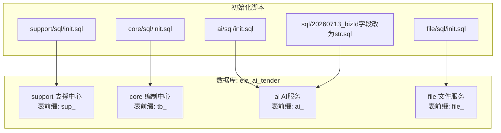
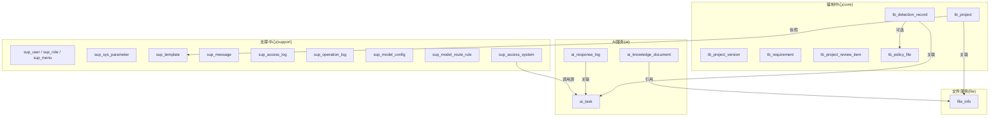
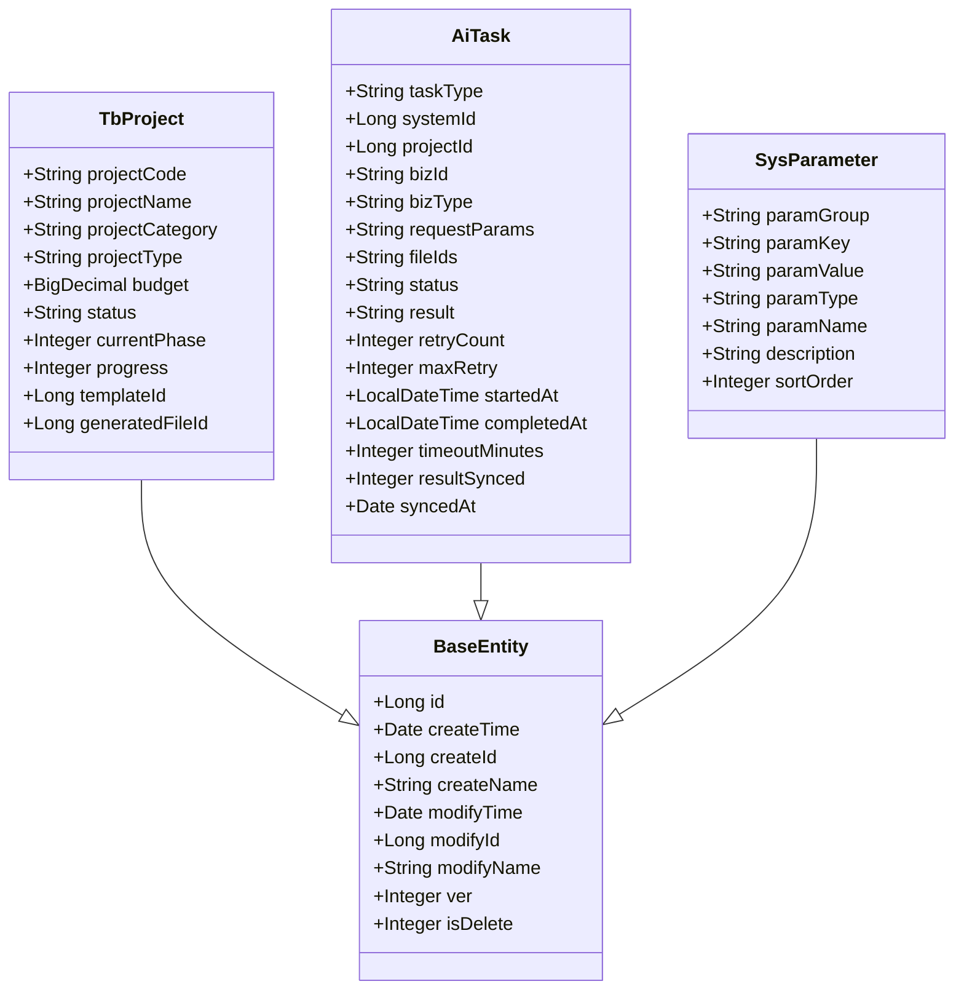
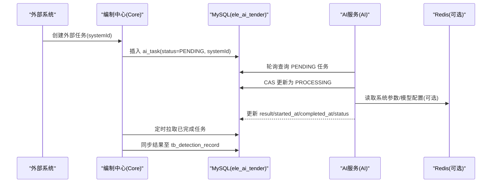
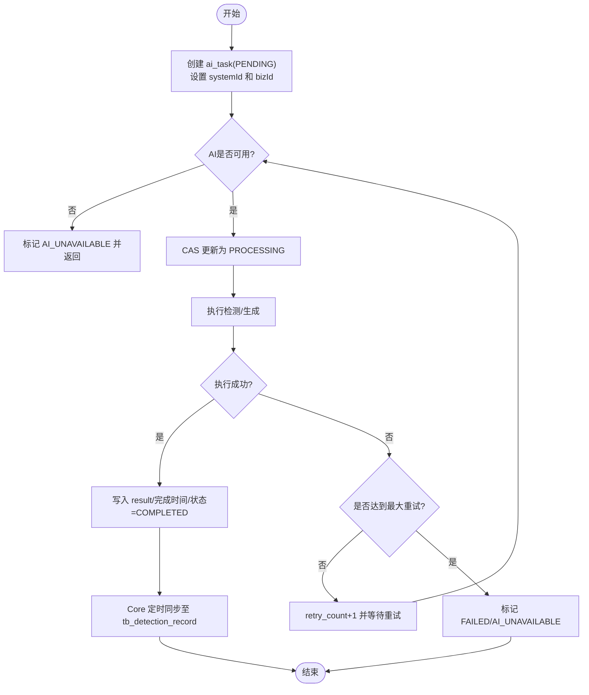
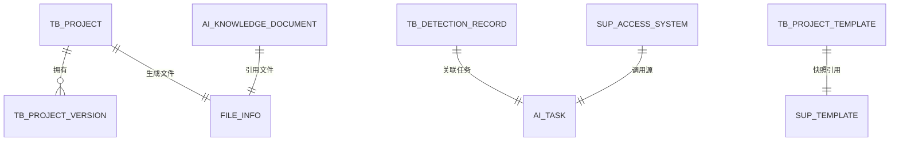

# 数据库设计

<cite>
**本文引用的文件**
- [ele-ai-tender-system/ele-ai-tender-support/sql/init.sql](file://ele-ai-tender-system/ele-ai-tender-support/sql/init.sql)
- [ele-ai-tender-system/ele-ai-tender-core/sql/init.sql](file://ele-ai-tender-system/ele-ai-tender-core/sql/init.sql)
- [ele-ai-tender-system/ele-ai-tender-ai/sql/init.sql](file://ele-ai-tender-system/ele-ai-tender-ai/sql/init.sql)
- [ele-ai-tender-system/ele-ai-tender-file/sql/init.sql](file://ele-ai-tender-system/ele-ai-tender-file/sql/init.sql)
- [sql/20260713_bizId字段改为str.sql](file://sql/20260713_bizId字段改为str.sql)
- [ele-ai-tender-system/ele-ai-tender-common/src/main/java/com/jy/eleaitender/common/entity/base/BaseEntity.java](file://ele-ai-tender-system/ele-ai-tender-common/src/main/java/com/jy/eleaitender/common/entity/base/BaseEntity.java)
- [ele-ai-tender-system/ele-ai-tender-common/src/main/java/com/jy/eleaitender/common/entity/core/TbProject.java](file://ele-ai-tender-system/ele-ai-tender-common/src/main/java/com/jy/eleaitender/common/entity/core/TbProject.java)
- [ele-ai-tender-system/ele-ai-tender-common/src/main/java/com/jy/eleaitender/common/entity/ai/AiTask.java](file://ele-ai-tender-system/ele-ai-tender-common/src/main/java/com/jy/eleaitender/common/entity/ai/AiTask.java)
- [ele-ai-tender-system/ele-ai-tender-common/src/main/java/com/jy/eleaitender/common/entity/support/SysParameter.java](file://ele-ai-tender-system/ele-ai-tender-common/src/main/java/com/jy/eleaitender/common/entity/support/SysParameter.java)
- [ele-ai-tender-system/ele-ai-tender-support/src/main/java/com/jy/eleaitender/support/mapper/SysParameterMapper.java](file://ele-ai-tender-system/ele-ai-tender-support/src/main/java/com/jy/eleaitender/support/mapper/SysParameterMapper.java)
- [ele-ai-tender-system/ele-ai-tender-support/src/main/java/com/jy/eleaitender/support/service/impl/SysParameterServiceImpl.java](file://ele-ai-tender-system/ele-ai-tender-support/src/main/java/com/jy/eleaitender/support/service/impl/SysParameterServiceImpl.java)
</cite>

## 更新摘要
**变更内容**
- 更新了AI任务表(ai_task)的字段说明，包含新增的system_id字段和biz_id字段类型变更
- 更新了支撑中心(support)关键表说明，包含sup_access_system表的字段长度优化
- 完善了实体类映射关系图，反映最新的字段结构

## 目录
1. [引言](#引言)
2. [项目结构](#项目结构)
3. [核心组件](#核心组件)
4. [架构总览](#架构总览)
5. [详细组件分析](#详细组件分析)
6. [依赖关系分析](#依赖关系分析)
7. [性能考虑](#性能考虑)
8. [故障排查指南](#故障排查指南)
9. [结论](#结论)
10. [附录](#附录)

## 引言
本文件为"招标文件AI编制系统"的数据库设计文档，基于 MySQL 8.4 与 MyBatis Plus。内容覆盖：
- 核心业务表、AI任务表、文件信息表、系统配置表等关键数据模型
- 实体关系设计、主外键约束、索引优化策略与数据完整性保证
- MyBatis Plus 的数据访问层实现（Mapper接口、实体映射、查询条件构建）
- 分布式环境下的数据一致性方案、缓存策略与性能优化
- 数据库迁移管理、备份恢复策略与监控告警配置

## 项目结构
本项目采用多模块拆分，数据库脚本按模块划分，统一使用同一数据库 ele_ai_tender，并通过表前缀区分领域：
- support 支撑中心：sup_ 前缀（用户、角色、菜单、参数、模板、消息、日志等）
- core 编制中心：tb_ 前缀（项目、需求、评审项、检测记录、政策文件等）
- ai AI服务：ai_ 前缀（AI任务、知识库文档、响应日志等）
- file 文件服务：file_ 前缀（文件信息）

**图表来源**
- [ele-ai-tender-system/ele-ai-tender-support/sql/init.sql:1-682](file://ele-ai-tender-system/ele-ai-tender-support/sql/init.sql#L1-L682)
- [ele-ai-tender-system/ele-ai-tender-core/sql/init.sql:1-246](file://ele-ai-tender-system/ele-ai-tender-core/sql/init.sql#L1-L246)
- [ele-ai-tender-system/ele-ai-tender-ai/sql/init.sql:1-119](file://ele-ai-tender-system/ele-ai-tender-ai/sql/init.sql#L1-L119)
- [ele-ai-tender-system/ele-ai-tender-file/sql/init.sql:1-80](file://ele-ai-tender-system/ele-ai-tender-file/sql/init.sql#L1-L80)
- [sql/20260713_bizId字段改为str.sql:1-12](file://sql/20260713_bizId字段改为str.sql#L1-L12)

## 核心组件
- 基础实体 BaseEntity：提供 id、创建/修改时间、创建/修改人、乐观锁 ver、逻辑删除 is_delete 等通用字段，配合自动填充与逻辑删除。
- 核心业务实体 TbProject：对应 tb_project，承载项目全生命周期信息与阶段进度。
- AI任务实体 AiTask：对应 ai_task，作为 Core 与 AI 之间的异步任务载体，支持外部系统集成。
- 系统参数实体 SysParameter：对应 sup_sys_parameter，支撑运行时开关与规则配置。

**章节来源**
- [ele-ai-tender-system/ele-ai-tender-common/src/main/java/com/jy/eleaitender/common/entity/base/BaseEntity.java:1-74](file://ele-ai-tender-system/ele-ai-tender-common/src/main/java/com/jy/eleaitender/common/entity/base/BaseEntity.java#L1-L74)
- [ele-ai-tender-system/ele-ai-tender-common/src/main/java/com/jy/eleaitender/common/entity/core/TbProject.java:1-100](file://ele-ai-tender-system/ele-ai-tender-common/src/main/java/com/jy/eleaitender/common/entity/core/TbProject.java#L1-L100)
- [ele-ai-tender-system/ele-ai-tender-common/src/main/java/com/jy/eleaitender/common/entity/ai/AiTask.java:1-83](file://ele-ai-tender-system/ele-ai-tender-common/src/main/java/com/jy/eleaitender/common/entity/ai/AiTask.java#L1-L83)
- [ele-ai-tender-system/ele-ai-tender-common/src/main/java/com/jy/eleaitender/common/entity/support/SysParameter.java:1-39](file://ele-ai-tender-system/ele-ai-tender-common/src/main/java/com/jy/eleaitender/common/entity/support/SysParameter.java#L1-L39)

## 架构总览
下图展示数据库与主要模块的关系，以及跨模块共享表的使用方式。

**图表来源**
- [ele-ai-tender-system/ele-ai-tender-support/sql/init.sql:1-682](file://ele-ai-tender-system/ele-ai-tender-support/sql/init.sql#L1-L682)
- [ele-ai-tender-system/ele-ai-tender-core/sql/init.sql:1-246](file://ele-ai-tender-system/ele-ai-tender-core/sql/init.sql#L1-L246)
- [ele-ai-tender-system/ele-ai-tender-ai/sql/init.sql:1-119](file://ele-ai-tender-system/ele-ai-tender-ai/sql/init.sql#L1-L119)
- [ele-ai-tender-system/ele-ai-tender-file/sql/init.sql:1-80](file://ele-ai-tender-system/ele-ai-tender-file/sql/init.sql#L1-L80)

## 详细组件分析

### 支撑中心（support）关键表
- 用户/角色/菜单/权限：sup_user、sup_role、sup_user_role、sup_menu、sup_role_menu
- 接入系统与版本：sup_access_system、sup_main_version、sup_plugin_version
- 日志：sup_operation_log、sup_access_log
- 系统参数：sup_sys_parameter（含分组、类型、排序）
- 政策文件：sup_policy_file
- AI模型配置与路由：sup_model_config、sup_model_route_rule
- 消息：sup_message
- 模板：sup_template（供 core 快照引用）

**更新** 支撑中心表进行了字段长度优化以提升存储效率

要点
- 所有表均包含审计字段与乐观锁、逻辑删除
- 常用查询列建立索引，如状态、分类、创建时间、业务上下文组合索引
- 模型配置支持 JSON 参数与使用场景维度路由
- sup_access_system 表字段长度优化：system_name 从 VARCHAR(100) 优化为 VARCHAR(50)，app_key 从 VARCHAR(64) 优化为 VARCHAR(50)

**章节来源**
- [ele-ai-tender-system/ele-ai-tender-support/sql/init.sql:1-682](file://ele-ai-tender-system/ele-ai-tender-support/sql/init.sql#L1-L682)
- [sql/20260713_bizId字段改为str.sql:7-12](file://sql/20260713_bizId字段改为str.sql#L7-L12)

### 编制中心（core）关键表
- 项目：tb_project（唯一编号、状态机、阶段、进度、匹配与生成文件ID）
- 项目版本：tb_project_version（JSON 快照）
- 需求：tb_requirement（草稿自动保存、匹配历史文件）
- 评审项：tb_project_review_item（三级嵌套，父级自引用）
- 用户政策文件：tb_policy_file（与平台侧 sup_policy_file 互补）
- 检测记录：tb_detection_record（与 ai_task 关联，结果 JSON）

要点
- 评审项通过 parent_id 实现树形结构
- 检测记录与 AI 任务解耦，便于重试与回溯
- 项目模板以只读快照形式落库，避免上游变更影响已关联项目

**章节来源**
- [ele-ai-tender-system/ele-ai-tender-core/sql/init.sql:1-246](file://ele-ai-tender-system/ele-ai-tender-core/sql/init.sql#L1-L246)

### AI服务（ai）关键表
- AI任务队列表：ai_task（状态机、重试、超时、结果同步标记、外部系统集成）
- 知识库文档：ai_knowledge_document（文本解析、向量集合与ID）
- AI响应记录：ai_response_log（对话/调用明细、token统计）

**更新** AI任务表进行了重要字段优化，增强外部系统集成能力

要点
- ai_task 由 Core 写入 PENDING，AI 轮询并 CAS 更新为 PROCESSING
- ai_response_log 可关联 task_id 或 conversation_id，用于追踪与计费
- 知识库文档与外部向量库（Milvus）联动，DB仅存元数据与ID
- **新增 system_id 字段**：标识调用系统ID，支持多系统外部集成
- **biz_id 字段类型变更**：从数值类型改为 VARCHAR(64)，支持更灵活的业务ID格式

**章节来源**
- [ele-ai-tender-system/ele-ai-tender-ai/sql/init.sql:1-119](file://ele-ai-tender-system/ele-ai-tender-ai/sql/init.sql#L1-L119)
- [sql/20260713_bizId字段改为str.sql:1-6](file://sql/20260713_bizId字段改为str.sql#L1-L6)

### 文件服务（file）关键表
- 文件信息：file_info（文件名、路径、大小、SHA-256、业务类型）

要点
- 通过 SHA-256 去重与溯源
- biz_type 标识不同业务域（main-version/plugin/ai-document）

**章节来源**
- [ele-ai-tender-system/ele-ai-tender-file/sql/init.sql:1-80](file://ele-ai-tender-system/ele-ai-tender-file/sql/init.sql#L1-L80)

### 实体类与MyBatis Plus映射
- 基础实体 BaseEntity：统一主键、审计字段、乐观锁、逻辑删除
- 业务实体示例：TbProject、AiTask、SysParameter 均继承 BaseEntity，并使用 @TableName 指定表名
- Mapper 接口：以 BaseMapper 为基础，无需手写 SQL 即可实现 CRUD

**更新** 完善了实体类映射关系图，反映最新的字段结构

**图表来源**
- [ele-ai-tender-system/ele-ai-tender-common/src/main/java/com/jy/eleaitender/common/entity/base/BaseEntity.java:1-74](file://ele-ai-tender-system/ele-ai-tender-common/src/main/java/com/jy/eleaitender/common/entity/base/BaseEntity.java#L1-L74)
- [ele-ai-tender-system/ele-ai-tender-common/src/main/java/com/jy/eleaitender/common/entity/core/TbProject.java:1-100](file://ele-ai-tender-system/ele-ai-tender-common/src/main/java/com/jy/eleaitender/common/entity/core/TbProject.java#L1-L100)
- [ele-ai-tender-system/ele-ai-tender-common/src/main/java/com/jy/eleaitender/common/entity/ai/AiTask.java:1-83](file://ele-ai-tender-system/ele-ai-tender-common/src/main/java/com/jy/eleaitender/common/entity/ai/AiTask.java#L1-L83)
- [ele-ai-tender-system/ele-ai-tender-common/src/main/java/com/jy/eleaitender/common/entity/support/SysParameter.java:1-39](file://ele-ai-tender-system/ele-ai-tender-common/src/main/java/com/jy/eleaitender/common/entity/support/SysParameter.java#L1-L39)

**章节来源**
- [ele-ai-tender-system/ele-ai-tender-common/src/main/java/com/jy/eleaitender/common/entity/base/BaseEntity.java:1-74](file://ele-ai-tender-system/ele-ai-tender-common/src/main/java/com/jy/eleaitender/common/entity/base/BaseEntity.java#L1-L74)
- [ele-ai-tender-system/ele-ai-tender-common/src/main/java/com/jy/eleaitender/common/entity/core/TbProject.java:1-100](file://ele-ai-tender-system/ele-ai-tender-common/src/main/java/com/jy/eleaitender/common/entity/core/TbProject.java#L1-L100)
- [ele-ai-tender-system/ele-ai-tender-common/src/main/java/com/jy/eleaitender/common/entity/ai/AiTask.java:1-83](file://ele-ai-tender-system/ele-ai-tender-common/src/main/java/com/jy/eleaitender/common/entity/ai/AiTask.java#L1-L83)
- [ele-ai-tender-system/ele-ai-tender-common/src/main/java/com/jy/eleaitender/common/entity/support/SysParameter.java:1-39](file://ele-ai-tender-system/ele-ai-tender-common/src/main/java/com/jy/eleaitender/common/entity/support/SysParameter.java#L1-L39)

### 数据访问层使用指南（MyBatis Plus）
- Mapper 接口定义：继承 BaseMapper<T>，即可获得标准 CRUD 能力
- 实体映射：使用 @TableName 指定表名；BaseEntity 提供通用字段注解
- 查询条件构建：使用 LambdaQueryWrapper/LambdaUpdateWrapper 进行类型安全构造
- 分页与排序：结合 Page 对象与 orderByAsc/orderByDesc
- 逻辑删除与乐观锁：自动处理 is_delete 过滤与 ver 版本控制

示例参考路径
- Mapper 接口：[SysParameterMapper.java:1-13](file://ele-ai-tender-system/ele-ai-tender-support/src/main/java/com/jy/eleaitender/support/mapper/SysParameterMapper.java#L1-L13)
- 实体类：[SysParameter.java:1-39](file://ele-ai-tender-system/ele-ai-tender-common/src/main/java/com/jy/eleaitender/common/entity/support/SysParameter.java#L1-L39)
- 服务层使用（含 Redis 缓存）：[SysParameterServiceImpl.java:1-34](file://ele-ai-tender-system/ele-ai-tender-support/src/main/java/com/jy/eleaitender/support/service/impl/SysParameterServiceImpl.java#L1-L34)

**章节来源**
- [ele-ai-tender-system/ele-ai-tender-support/src/main/java/com/jy/eleaitender/support/mapper/SysParameterMapper.java:1-13](file://ele-ai-tender-system/ele-ai-tender-support/src/main/java/com/jy/eleaitender/support/mapper/SysParameterMapper.java#L1-L13)
- [ele-ai-tender-system/ele-ai-tender-common/src/main/java/com/jy/eleaitender/common/entity/support/SysParameter.java:1-39](file://ele-ai-tender-system/ele-ai-tender-common/src/main/java/com/jy/eleaitender/common/entity/support/SysParameter.java#L1-L39)
- [ele-ai-tender-system/ele-ai-tender-support/src/main/java/com/jy/eleaitender/support/service/impl/SysParameterServiceImpl.java:1-34](file://ele-ai-tender-system/ele-ai-tender-support/src/main/java/com/jy/eleaitender/support/service/impl/SysParameterServiceImpl.java#L1-L34)

### 跨模块数据流与一致性（Core ↔ AI）
- Core 写入 ai_task（PENDING），AI 轮询并 CAS 更新为 PROCESSING
- AI 完成后写回 result 与完成时间，Core 定时任务拉取并同步到 tb_detection_record
- 失败重试：依据 retry_count 与 max_retry 控制，避免无限重试
- **外部系统集成**：通过 system_id 字段支持多系统外部调用

**图表来源**
- [ele-ai-tender-system/ele-ai-tender-core/sql/init.sql:219-246](file://ele-ai-tender-system/ele-ai-tender-core/sql/init.sql#L219-L246)
- [ele-ai-tender-system/ele-ai-tender-ai/sql/init.sql:17-46](file://ele-ai-tender-system/ele-ai-tender-ai/sql/init.sql#L17-L46)
- [ele-ai-tender-system/ele-ai-tender-support/src/main/java/com/jy/eleaitender/support/service/impl/SysParameterServiceImpl.java:1-34](file://ele-ai-tender-system/ele-ai-tender-support/src/main/java/com/jy/eleaitender/support/service/impl/SysParameterServiceImpl.java#L1-L34)

**章节来源**
- [ele-ai-tender-system/ele-ai-tender-core/sql/init.sql:219-246](file://ele-ai-tender-system/ele-ai-tender-core/sql/init.sql#L219-L246)
- [ele-ai-tender-system/ele-ai-tender-ai/sql/init.sql:17-46](file://ele-ai-tender-system/ele-ai-tender-ai/sql/init.sql#L17-L46)
- [ele-ai-tender-system/ele-ai-tender-support/src/main/java/com/jy/eleaitender/support/service/impl/SysParameterServiceImpl.java:1-34](file://ele-ai-tender-system/ele-ai-tender-support/src/main/java/com/jy/eleaitender/support/service/impl/SysParameterServiceImpl.java#L1-L34)

### 复杂逻辑流程（检测记录与任务）

**图表来源**
- [ele-ai-tender-system/ele-ai-tender-ai/sql/init.sql:17-46](file://ele-ai-tender-system/ele-ai-tender-ai/sql/init.sql#L17-L46)
- [ele-ai-tender-system/ele-ai-tender-core/sql/init.sql:219-246](file://ele-ai-tender-system/ele-ai-tender-core/sql/init.sql#L219-L246)

**章节来源**
- [ele-ai-tender-system/ele-ai-tender-ai/sql/init.sql:17-46](file://ele-ai-tender-system/ele-ai-tender-ai/sql/init.sql#L17-L46)
- [ele-ai-tender-system/ele-ai-tender-core/sql/init.sql:219-246](file://ele-ai-tender-system/ele-ai-tender-core/sql/init.sql#L219-L246)

## 依赖关系分析
- 表间关系
  - tb_project 与 file_info：通过 generated_file_id 关联生成的招标文件
  - tb_detection_record 与 ai_task：通过 task_id 关联具体任务
  - ai_knowledge_document 与 file_info：通过 file_id 引用文件元数据
  - tb_project_template 与 sup_template：只读快照，避免上游变更影响
  - **sup_access_system 与 ai_task**：通过 system_id 关联调用系统
- 索引与约束
  - 主键均为 BIGINT 自增
  - 高频查询列建立单列或复合索引（如 status、project_id、biz_id+biz_type、create_time 等）
  - 逻辑删除与乐观锁贯穿所有表，保障一致性与并发安全

**图表来源**
- [ele-ai-tender-system/ele-ai-tender-core/sql/init.sql:22-85](file://ele-ai-tender-system/ele-ai-tender-core/sql/init.sql#L22-L85)
- [ele-ai-tender-system/ele-ai-tender-ai/sql/init.sql:51-73](file://ele-ai-tender-system/ele-ai-tender-ai/sql/init.sql#L51-L73)
- [ele-ai-tender-system/ele-ai-tender-file/sql/init.sql:16-35](file://ele-ai-tender-system/ele-ai-tender-file/sql/init.sql#L16-L35)
- [ele-ai-tender-system/ele-ai-tender-support/sql/init.sql:443-467](file://ele-ai-tender-system/ele-ai-tender-support/sql/init.sql#L443-L467)

**章节来源**
- [ele-ai-tender-system/ele-ai-tender-core/sql/init.sql:22-85](file://ele-ai-tender-system/ele-ai-tender-core/sql/init.sql#L22-L85)
- [ele-ai-tender-system/ele-ai-tender-ai/sql/init.sql:51-73](file://ele-ai-tender-system/ele-ai-tender-ai/sql/init.sql#L51-L73)
- [ele-ai-tender-system/ele-ai-tender-file/sql/init.sql:16-35](file://ele-ai-tender-system/ele-ai-tender-file/sql/init.sql#L16-L35)
- [ele-ai-tender-system/ele-ai-tender-support/sql/init.sql:443-467](file://ele-ai-tender-system/ele-ai-tender-support/sql/init.sql#L443-L467)

## 性能考虑
- 索引策略
  - 状态/类型/时间类字段建立索引，如 ai_task.status、ai_task.task_type+status、tb_detection_record.status+detection_type
  - 组合索引优先于多单列索引，例如 biz_context(biz_type,biz_id,project_id,tender_id)
  - **新增 system_id 索引**：支持按调用系统快速查询任务
- 读写分离与分库分表
  - 对大表（如 sup_access_log、ai_response_log）建议按时间分区或按月归档
  - 热点表（如 sys_parameter）通过 Redis 缓存，降低数据库压力
- 连接池与SQL优化
  - 合理设置连接池大小与超时
  - 避免 SELECT *，按需选择字段；使用覆盖索引减少回表
- 批量操作
  - 大批量写入使用批量插入，减少事务开销
- 慢查询治理
  - 开启慢查询日志，定期分析 TOP SQL，优化索引与语句

## 故障排查指南
- 常见问题定位
  - AI 任务长时间不推进：检查 ai_task.status 与 retry_count，确认 AI 可用性
  - 检测结果未同步：核对 tb_detection_record.task_id 与 ai_task.result_synced
  - 系统参数未生效：检查 Redis 缓存命中与过期时间
  - **外部系统集成问题**：检查 ai_task.system_id 与 sup_access_system 的关联关系
- 日志与监控
  - 访问日志：sup_access_log（trace_id、service_name、elapsed_ms、错误摘要）
  - 操作日志：sup_operation_log（用户、方法、参数、耗时）
  - 应用日志：logback-spring.xml 中配置了错误日志与特定业务日志滚动策略

**章节来源**
- [ele-ai-tender-system/ele-ai-tender-support/sql/init.sql:218-272](file://ele-ai-tender-system/ele-ai-tender-support/sql/init.sql#L218-L272)
- [ele-ai-tender-system/ele-ai-tender-ai/src/main/resources/logback-spring.xml:55-83](file://ele-ai-tender-system/ele-ai-tender-ai/src/main/resources/logback-spring.xml#L55-L83)

## 结论
本数据库设计围绕"支撑中心-编制中心-AI服务-文件服务"四大领域展开，采用统一的审计与并发控制机制，并通过索引与缓存提升性能。Core 与 AI 之间以 ai_task 为纽带，确保异步任务的可观测与可重试。**最新优化增强了外部系统集成能力，通过 system_id 字段和多系统支持，提升了系统的扩展性和灵活性**。整体架构清晰、扩展性强，适合在分布式环境下稳定运行。

## 附录

### 数据一致性方案（分布式）
- 最终一致性
  - Core 写入 ai_task，AI 消费并更新结果，Core 定时拉取并同步到业务表
- 幂等与重试
  - 通过 retry_count/max_retry 与状态机控制，避免重复处理
- 事务边界
  - 单服务内使用本地事务；跨服务通过消息/轮询达成最终一致
- **外部系统集成**
  - 通过 system_id 字段实现多系统隔离和权限控制

### 缓存策略
- 系统参数缓存
  - 使用 Redis 缓存 sup_sys_parameter，缩短读取延迟
  - 更新时主动失效或设置较短 TTL，保证时效性

**章节来源**
- [ele-ai-tender-system/ele-ai-tender-support/src/main/java/com/jy/eleaitender/support/service/impl/SysParameterServiceImpl.java:1-34](file://ele-ai-tender-system/ele-ai-tender-support/src/main/java/com/jy/eleaitender/support/service/impl/SysParameterServiceImpl.java#L1-L34)

### 迁移管理与版本控制
- 初始化脚本
  - 各模块独立 init.sql，明确执行顺序与依赖
- 增量升级
  - 新增 patch 脚本，命名体现版本号与变更点
  - **最新变更**：bizId字段类型优化和systemId字段新增
- 回滚策略
  - 保留上一版本脚本与数据快照，必要时回滚

**章节来源**
- [ele-ai-tender-system/ele-ai-tender-support/sql/init.sql:1-682](file://ele-ai-tender-system/ele-ai-tender-support/sql/init.sql#L1-L682)
- [ele-ai-tender-system/ele-ai-tender-core/sql/init.sql:1-246](file://ele-ai-tender-system/ele-ai-tender-core/sql/init.sql#L1-L246)
- [ele-ai-tender-system/ele-ai-tender-ai/sql/init.sql:1-119](file://ele-ai-tender-system/ele-ai-tender-ai/sql/init.sql#L1-L119)
- [ele-ai-tender-system/ele-ai-tender-file/sql/init.sql:1-80](file://ele-ai-tender-system/ele-ai-tender-file/sql/init.sql#L1-L80)
- [sql/20260713_bizId字段改为str.sql:1-12](file://sql/20260713_bizId字段改为str.sql#L1-L12)

### 备份恢复策略
- 全量备份
  - 每日凌晨 mysqldump 全量导出，异地存储
- 增量备份
  - 开启 binlog，按小时归档，支持时间点恢复
- 恢复演练
  - 定期在测试环境验证恢复流程与RTO/RPO指标

### 监控告警配置
- 数据库监控
  - QPS、TPS、连接数、慢查询、锁等待、复制延迟
- 应用监控
  - 接口耗时、错误率、线程池与队列长度
- 告警阈值
  - 慢查询比例、错误率突增、任务积压超过阈值触发告警
- **外部系统集成监控**
  - 按 system_id 维度监控各外部系统的调用成功率和处理时长