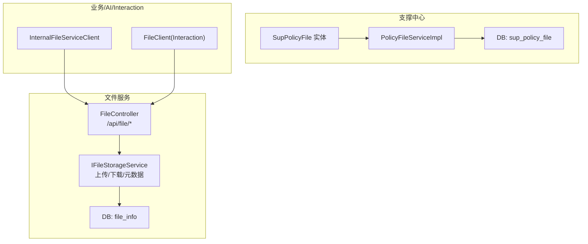
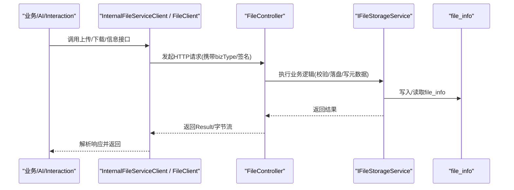
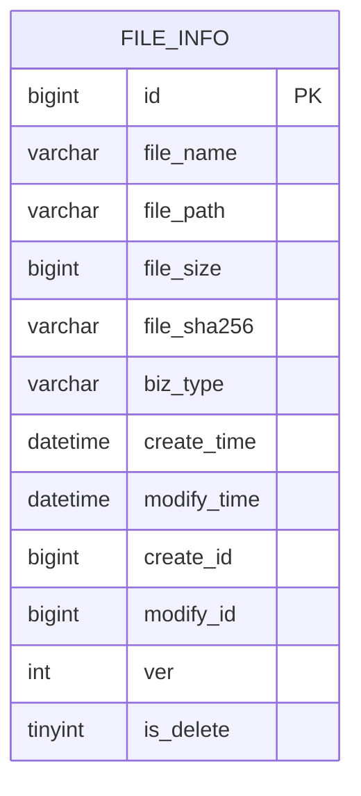
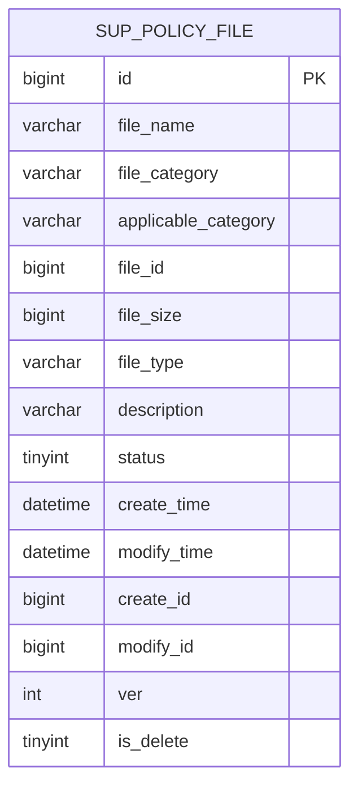
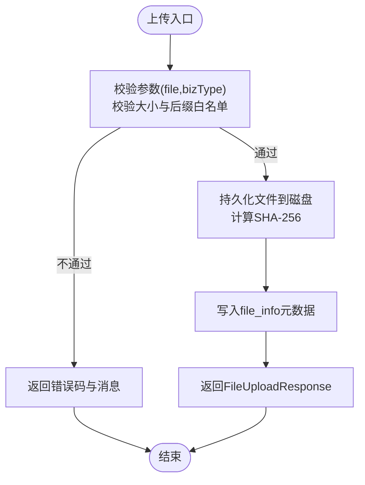
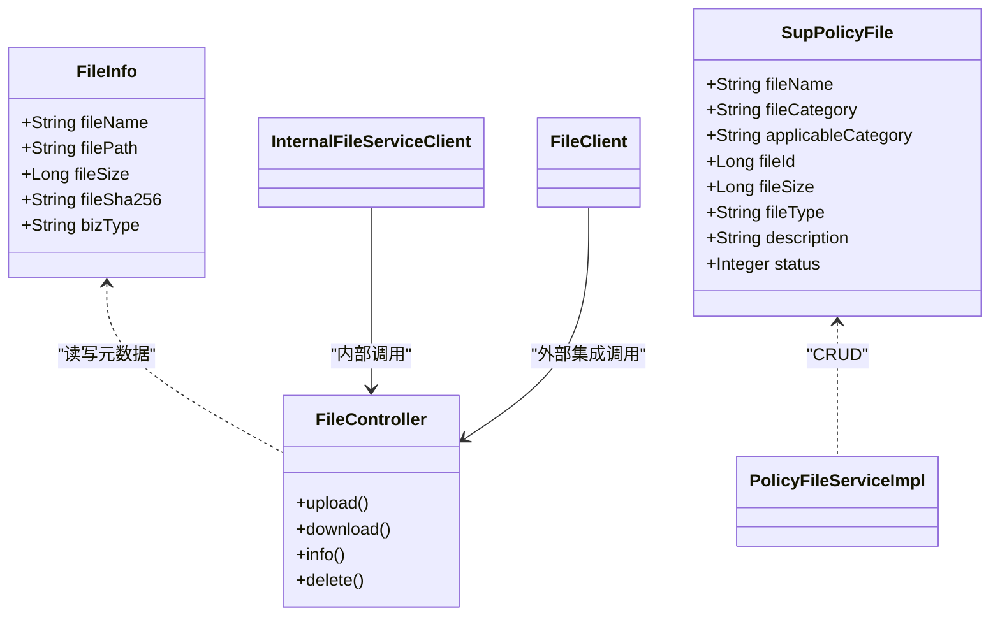

# 文件管理数据模型

<cite>
**本文引用的文件**   
- [FILE_SERVICE_SPEC.md](file://docs/rules/FILE_SERVICE_SPEC.md)
- [init.sql（文件服务）](file://ele-ai-tender-system/ele-ai-tender-file/sql/init.sql)
- [init.sql（支撑中心）](file://ele-ai-tender-system/ele-ai-tender-support/sql/init.sql)
- [FileInfo.java](file://ele-ai-tender-system/ele-ai-tender-common/src/main/java/com/jy/eleaitender/common/entity/file/FileInfo.java)
- [SupPolicyFile.java](file://ele-ai-tender-system/ele-ai-tender-common/src/main/java/com/jy/eleaitender/common/entity/support/SupPolicyFile.java)
- [FileController.java](file://ele-ai-tender-system/ele-ai-tender-file/src/main/java/com/jy/eleaitender/file/controller/FileController.java)
- [InternalFileServiceClient.java](file://ele-ai-tender-system/ele-ai-tender-common/src/main/java/com/jy/eleaitender/common/client/InternalFileServiceClient.java)
- [FileClient.java](file://ele-ai-tender-system/ele-ai-tender-interaction/ele-ai-tender-interaction-core/src/main/java/com/jy/eleaitender/interaction/core/client/FileClient.java)
- [PolicyFileServiceImpl.java](file://ele-ai-tender-system/ele-ai-tender-support/src/main/java/com/jy/eleaitender/support/service/impl/PolicyFileServiceImpl.java)
</cite>

## 目录
1. [引言](#引言)
2. [项目结构](#项目结构)
3. [核心组件](#核心组件)
4. [架构总览](#架构总览)
5. [详细组件分析](#详细组件分析)
6. [依赖关系分析](#依赖关系分析)
7. [性能与存储优化](#性能与存储优化)
8. [故障排查指南](#故障排查指南)
9. [结论](#结论)
10. [附录：API 交互规范与安全合规记录方案](#附录api-交互规范与安全合规记录方案)

## 引言
本文件围绕“文件管理数据模型”展开，聚焦于文件信息表（file_info）、政策文件表（sup_policy_file）等与文件相关的数据结构设计，系统阐述文件元数据存储、版本控制、权限管理与存储路径规划；并说明多格式文件支持、大文件分片上传的进度跟踪、文件预览缩略图存储策略；同时给出文件服务 API 的数据交互规范、分布式一致性保证与存储空间优化建议，以及安全扫描、病毒检测与合规性检查的记录方案。

## 项目结构
- 文件服务模块提供统一的文件能力：上传、下载、查询、删除，以及文档生成引擎（Markdown→Word、Word模板→Word）。
- 数据库初始化脚本定义 file_info 与 sup_policy_file 等核心表结构。
- 通用实体类 FileInfo、SupPolicyFile 映射到对应表，供各模块复用。
- 控制器 FileController 暴露文件服务接口；内部客户端 InternalFileServiceClient 和 Interaction 层 FileClient 封装跨服务调用。

图表来源
- [FileController.java](file://ele-ai-tender-system/ele-ai-tender-file/src/main/java/com/jy/eleaitender/file/controller/FileController.java)
- [init.sql（文件服务）](file://ele-ai-tender-system/ele-ai-tender-file/sql/init.sql)
- [init.sql（支撑中心）](file://ele-ai-tender-system/ele-ai-tender-support/sql/init.sql)
- [InternalFileServiceClient.java](file://ele-ai-tender-system/ele-ai-tender-common/src/main/java/com/jy/eleaitender/common/client/InternalFileServiceClient.java)
- [FileClient.java](file://ele-ai-tender-system/ele-ai-tender-interaction/ele-ai-tender-interaction-core/src/main/java/com/jy/eleaitender/interaction/core/client/FileClient.java)
- [PolicyFileServiceImpl.java](file://ele-ai-tender-system/ele-ai-tender-support/src/main/java/com/jy/eleaitender/support/service/impl/PolicyFileServiceImpl.java)

章节来源
- [FILE_SERVICE_SPEC.md](file://docs/rules/FILE_SERVICE_SPEC.md)
- [init.sql（文件服务）](file://ele-ai-tender-system/ele-ai-tender-file/sql/init.sql)
- [init.sql（支撑中心）](file://ele-ai-tender-system/ele-ai-tender-support/sql/init.sql)

## 核心组件
- 文件信息实体 FileInfo：映射 file_info 表，承载原始文件名、服务端存储路径、文件大小、SHA-256 摘要、业务类型等元数据。
- 政策文件实体 SupPolicyFile：映射 sup_policy_file 表，承载系统级政策文件的名称、分类、适用类别、关联 file_id、大小、格式、描述、状态等。
- 文件服务控制器 FileController：提供上传、下载、信息查询、删除等 HTTP 接口。
- 内部客户端 InternalFileServiceClient：core/support 模块通过该客户端调用文件服务，遵循统一错误处理与服务间认证约束。
- Interaction 层 FileClient：对外部系统集成提供签名化文件访问能力（上传、下载、获取信息）。
- 政策文件服务 PolicyFileServiceImpl：实现 sup_policy_file 的增删改查与状态管理。

章节来源
- [FileInfo.java](file://ele-ai-tender-system/ele-ai-tender-common/src/main/java/com/jy/eleaitender/common/entity/file/FileInfo.java)
- [SupPolicyFile.java](file://ele-ai-tender-system/ele-ai-tender-common/src/main/java/com/jy/eleaitender/common/entity/support/SupPolicyFile.java)
- [FileController.java](file://ele-ai-tender-system/ele-ai-tender-file/src/main/java/com/jy/eleaitender/file/controller/FileController.java)
- [InternalFileServiceClient.java](file://ele-ai-tender-system/ele-ai-tender-common/src/main/java/com/jy/eleaitender/common/client/InternalFileServiceClient.java)
- [FileClient.java](file://ele-ai-tender-system/ele-ai-tender-interaction/ele-ai-tender-interaction-core/src/main/java/com/jy/eleaitender/interaction/core/client/FileClient.java)
- [PolicyFileServiceImpl.java](file://ele-ai-tender-system/ele-ai-tender-support/src/main/java/com/jy/eleaitender/support/service/impl/PolicyFileServiceImpl.java)

## 架构总览
文件服务作为独立微服务，提供统一文件能力；支撑中心维护系统级政策文件清单；业务/AI/Interaction 模块通过内部或外部客户端访问文件服务。

图表来源
- [FileController.java](file://ele-ai-tender-system/ele-ai-tender-file/src/main/java/com/jy/eleaitender/file/controller/FileController.java)
- [InternalFileServiceClient.java](file://ele-ai-tender-system/ele-ai-tender-common/src/main/java/com/jy/eleaitender/common/client/InternalFileServiceClient.java)
- [FileClient.java](file://ele-ai-tender-system/ele-ai-tender-interaction/ele-ai-tender-interaction-core/src/main/java/com/jy/eleaitender/interaction/core/client/FileClient.java)
- [init.sql（文件服务）](file://ele-ai-tender-system/ele-ai-tender-file/sql/init.sql)

## 详细组件分析

### 数据模型：file_info（文件信息表）
- 主键 id：即对外暴露的 fileId。
- 基础字段：继承 BaseEntity，包含 create_time、modify_time、create_id、modify_id、ver、is_delete 等审计与乐观锁字段。
- 关键业务字段：
  - file_name：原始文件名
  - file_path：服务端存储路径
  - file_size：文件大小（字节）
  - file_sha256：文件 SHA-256 摘要（十六进制字符串）
  - biz_type：业务类型（如 main-version/plugin/ai-document），用于分类存储与检索
- 索引设计：对 file_sha256、biz_type、create_time 建立索引，便于去重、按业务类型检索与时间范围查询。

图表来源
- [init.sql（文件服务）](file://ele-ai-tender-system/ele-ai-tender-file/sql/init.sql)
- [FileInfo.java](file://ele-ai-tender-system/ele-ai-tender-common/src/main/java/com/jy/eleaitender/common/entity/file/FileInfo.java)

章节来源
- [init.sql（文件服务）](file://ele-ai-tender-system/ele-ai-tender-file/sql/init.sql)
- [FileInfo.java](file://ele-ai-tender-system/ele-ai-tender-common/src/main/java/com/jy/eleaitender/common/entity/file/FileInfo.java)

### 数据模型：sup_policy_file（系统政策文件表）
- 主键 id：自增主键。
- 业务字段：
  - file_name：文件名称
  - file_category：文件分类（LAW/REGULATION/POLICY）
  - applicable_category：适用项目类别（逗号分隔）
  - file_id：关联文件服务的 file_id
  - file_size：文件大小（字节）
  - file_type：文件格式（PDF/DOCX/DOC/XLSX）
  - description：文件描述
  - status：状态（0-禁用，1-启用）
- 索引设计：针对 file_category、applicable_category、status 建索引，便于分类筛选与状态过滤。

图表来源
- [init.sql（支撑中心）](file://ele-ai-tender-system/ele-ai-tender-support/sql/init.sql)
- [SupPolicyFile.java](file://ele-ai-tender-system/ele-ai-tender-common/src/main/java/com/jy/eleaitender/common/entity/support/SupPolicyFile.java)

章节来源
- [init.sql（支撑中心）](file://ele-ai-tender-system/ele-ai-tender-support/sql/init.sql)
- [SupPolicyFile.java](file://ele-ai-tender-system/ele-ai-tender-common/src/main/java/com/jy/eleaitender/common/entity/support/SupPolicyFile.java)

### 文件服务 API 与数据交互规范
- 上传：POST /api/file/upload，参数包含 file 与 bizType，默认最大文件大小 500MB，白名单后缀包括 .doc/.docx/.pdf/.txt/.md/.jar/.war/.zip/.tar.gz 等。
- 下载：GET /api/file/download/{fileId}，返回二进制流与 Content-Disposition。
- 信息：GET /api/file/info/{fileId}，返回文件元数据（含 fileId、fileName、fileSize、bizType 等）。
- 删除：DELETE /api/file/delete/{fileId}。
- 文本提取：POST /api/file/extract-text，接收 fileId，返回 fullText 与 segments（段落+位置索引）。
- 文档修复：POST /api/file/fix-doc，接收 fileId 与 replacements（支持 locationRef 精准定位）。
- 结构解析：GET /api/file/structure/{fileId}，用于解析 Word 模板结构。
- 文档生成：POST /api/file/generate-doc，基于模板渲染生成文档。

图表来源
- [FILE_SERVICE_SPEC.md](file://docs/rules/FILE_SERVICE_SPEC.md)
- [FileController.java](file://ele-ai-tender-system/ele-ai-tender-file/src/main/java/com/jy/eleaitender/file/controller/FileController.java)
- [init.sql（文件服务）](file://ele-ai-tender-system/ele-ai-tender-file/sql/init.sql)

章节来源
- [FILE_SERVICE_SPEC.md](file://docs/rules/FILE_SERVICE_SPEC.md)
- [FileController.java](file://ele-ai-tender-system/ele-ai-tender-file/src/main/java/com/jy/eleaitender/file/controller/FileController.java)

### 多格式文件支持与文档生成
- 支持格式：当前上传白名单包含 .doc/.docx/.pdf/.txt/.md 等；表格生成与 Word 修复引擎主要面向 .docx。
- 文档生成引擎：
  - WordTemplateEngine：基于 poi-tl 原生引擎进行模板填充与渲染，禁止使用 SpringEL。
  - MarkdownToDocumentConverter：将 Markdown AST 转换为 DocumentRenderData，再由 poi-tl 渲染为格式化段落。
  - TableGenerator：POI 编程生成表格，规避循环标签限制。
  - WordDocumentFixEngine：基于 Apache POI 执行文本替换，支持 locationRef 精准定位与两级匹配。
  - WordTextExtractor：提取段落级文本与位置索引，供检测位置匹配使用。

章节来源
- [FILE_SERVICE_SPEC.md](file://docs/rules/FILE_SERVICE_SPEC.md)

### 版本控制与只读快照
- 项目模板在 core 模块以只读快照形式保存至 tb_project_template，后续源模板变更不影响已关联项目。
- 项目版本 tb_project_version 以 JSON 内容快照方式记录变更历史。
- 文件层面未引入独立的“文件版本表”，通常通过 biz_type 与 file_info 的创建时间、SHA-256 区分不同产出物；如需强版本语义，可在上层业务表（如 tb_project_template）中体现。

章节来源
- [init.sql（编制中心）](file://ele-ai-tender-system/ele-ai-tender-core/sql/init.sql)

### 权限管理与访问控制
- 文件服务接口受登录鉴权保护（RequireLogin）。
- 服务间调用采用 TOKEN_TYPE_SERVICE 类型的 JWT，密钥复用 APP_JWT_SECRET，视为管理员权限。
- 外部系统集成通过 Interaction 层的 FileClient 进行签名化访问，确保跨系统调用的安全性。

章节来源
- [FILE_SERVICE_SPEC.md](file://docs/rules/FILE_SERVICE_SPEC.md)
- [FileClient.java](file://ele-ai-tender-system/ele-ai-tender-interaction/ele-ai-tender-interaction-core/src/main/java/com/jy/eleaitender/interaction/core/client/FileClient.java)

### 存储路径规划与缩略图存储
- 存储路径：file_info.file_path 记录服务端存储路径，结合 file.storage.base-path 配置确定根目录。
- 缩略图存储：当前未在 file_info 中定义缩略图字段；建议在文件服务扩展时新增 thumbnail_path 字段，并按文件类型与业务类型分层组织目录，避免单目录过大。

章节来源
- [FILE_SERVICE_SPEC.md](file://docs/rules/FILE_SERVICE_SPEC.md)
- [init.sql（文件服务）](file://ele-ai-tender-system/ele-ai-tender-file/sql/init.sql)

### 大文件分片上传与进度跟踪
- 当前文件服务未提供分片上传接口；若需支持大文件，可参考以下方案：
  - 前端分片并发上传，后端提供分片合并接口，合并完成后更新 file_info 元数据。
  - 进度跟踪：使用 Redis 记录分片上传进度（key 包含 fileId、分片序号、完成状态），前端轮询获取进度。
  - 断点续传：利用 file_sha256 与分片哈希校验，避免重复上传。
  - 幂等性：同一分片多次上传应幂等，合并前校验所有分片完整性。

[本节为概念性方案，无需代码来源]

## 依赖关系分析

图表来源
- [FileInfo.java](file://ele-ai-tender-system/ele-ai-tender-common/src/main/java/com/jy/eleaitender/common/entity/file/FileInfo.java)
- [SupPolicyFile.java](file://ele-ai-tender-system/ele-ai-tender-common/src/main/java/com/jy/eleaitender/common/entity/support/SupPolicyFile.java)
- [FileController.java](file://ele-ai-tender-system/ele-ai-tender-file/src/main/java/com/jy/eleaitender/file/controller/FileController.java)
- [InternalFileServiceClient.java](file://ele-ai-tender-system/ele-ai-tender-common/src/main/java/com/jy/eleaitender/common/client/InternalFileServiceClient.java)
- [FileClient.java](file://ele-ai-tender-system/ele-ai-tender-interaction/ele-ai-tender-interaction-core/src/main/java/com/jy/eleaitender/interaction/core/client/FileClient.java)
- [PolicyFileServiceImpl.java](file://ele-ai-tender-system/ele-ai-tender-support/src/main/java/com/jy/eleaitender/support/service/impl/PolicyFileServiceImpl.java)

章节来源
- [FileInfo.java](file://ele-ai-tender-system/ele-ai-tender-common/src/main/java/com/jy/eleaitender/common/entity/file/FileInfo.java)
- [SupPolicyFile.java](file://ele-ai-tender-system/ele-ai-tender-common/src/main/java/com/jy/eleaitender/common/entity/support/SupPolicyFile.java)
- [FileController.java](file://ele-ai-tender-system/ele-ai-tender-file/src/main/java/com/jy/eleaitender/file/controller/FileController.java)
- [InternalFileServiceClient.java](file://ele-ai-tender-system/ele-ai-tender-common/src/main/java/com/jy/eleaitender/common/client/InternalFileServiceClient.java)
- [FileClient.java](file://ele-ai-tender-system/ele-ai-tender-interaction/ele-ai-tender-interaction-core/src/main/java/com/jy/eleaitender/interaction/core/client/FileClient.java)
- [PolicyFileServiceImpl.java](file://ele-ai-tender-system/ele-ai-tender-support/src/main/java/com/jy/eleaitender/support/service/impl/PolicyFileServiceImpl.java)

## 性能与存储优化
- 去重与增量：利用 file_sha256 做全局去重，相同文件仅保留一份物理存储，减少冗余。
- 索引优化：对 file_sha256、biz_type、create_time 建立合适索引，提升查询效率。
- 冷热分离：将近期频繁访问的文件与历史归档文件分区存放，降低热点目录压力。
- 压缩与转码：对 PDF/图片等生成缩略图或轻量预览版，减少带宽与 IO 开销。
- 对象存储：考虑迁移至对象存储（如 MinIO/OSS），配合 CDN 加速下载。
- 清理策略：对逻辑删除（is_delete=1）的文件定期清理物理存储，释放空间。

[本节为通用指导，无需代码来源]

## 故障排查指南
- 上传失败：检查文件扩展名是否在白名单内、文件大小是否超过 500MB、file.storage.base-path 目录是否有写权限。
- 下载 404：确认 file_info.file_path 对应文件在磁盘上实际存在，检查 file.storage.base-path 配置是否正确。
- SHA-256 校验失败：确认调用方计算方式与服务端一致（UTF-8 编码、十六进制字符串）。
- locationRef 定位失败：检查 elementIndex 是否越界（段落/表格共享索引空间）、WordTextExtractor 是否已执行、DetectionResultParser.fillLocationRefs() 日志是否报匹配失败。
- 检测修复替换了错误位置：检查 FixReplacement.locationRef 是否为空（为空走全文档替换会替换所有匹配项）、elementIndex 对应的 IBodyElement 类型是否与 type 字段一致。

章节来源
- [FILE_SERVICE_SPEC.md](file://docs/rules/FILE_SERVICE_SPEC.md)

## 结论
本文件管理数据模型以 file_info 为核心元数据载体，辅以 sup_policy_file 管理系统级政策文件清单；通过统一的文件服务 API 与内部/外部客户端实现跨模块与跨系统访问。当前实现覆盖上传、下载、信息查询、删除与文档生成/修复/文本提取等能力；在版本控制方面通过业务表快照体现，文件层面以 SHA-256 与业务类型区分。未来可扩展分片上传、缩略图存储、安全扫描与合规性检查记录等能力，以满足更复杂的生产场景。

## 附录：API 交互规范与安全合规记录方案

### 文件服务 API 汇总
- POST /api/file/upload：上传文件，参数 file、bizType
- GET /api/file/download/{fileId}：下载文件
- GET /api/file/info/{fileId}：获取文件信息
- DELETE /api/file/delete/{fileId}：删除文件
- POST /api/file/extract-text：提取文本与位置索引
- POST /api/file/fix-doc：文档修复（支持 locationRef）
- GET /api/file/structure/{fileId}：解析 Word 模板结构
- POST /api/file/generate-doc：基于模板生成文档

章节来源
- [FILE_SERVICE_SPEC.md](file://docs/rules/FILE_SERVICE_SPEC.md)
- [FileController.java](file://ele-ai-tender-system/ele-ai-tender-file/src/main/java/com/jy/eleaitender/file/controller/FileController.java)

### 分布式环境下的文件一致性保证
- 唯一性与幂等：基于 file_sha256 去重，上传接口具备幂等性；合并分片前校验分片完整性。
- 事务边界：元数据写入与物理文件落盘需保证最终一致性；必要时引入补偿任务清理不一致状态。
- 服务间认证：InternalFileServiceClient 使用 TOKEN_TYPE_SERVICE 的 JWT，密钥复用 APP_JWT_SECRET，避免越权访问。
- 外部集成安全：Interaction 层 FileClient 对请求进行签名，防止篡改与重放。

章节来源
- [FILE_SERVICE_SPEC.md](file://docs/rules/FILE_SERVICE_SPEC.md)
- [InternalFileServiceClient.java](file://ele-ai-tender-system/ele-ai-tender-common/src/main/java/com/jy/eleaitender/common/client/InternalFileServiceClient.java)
- [FileClient.java](file://ele-ai-tender-system/ele-ai-tender-interaction/ele-ai-tender-interaction-core/src/main/java/com/jy/eleaitender/interaction/core/client/FileClient.java)

### 安全扫描、病毒检测与合规性检查的记录方案
- 安全扫描：在上传流程中接入静态扫描（如恶意代码、敏感词），扫描结果记录到 sup_access_log 或专用扫描结果表（scan_result），包含 file_id、scan_status、findings、scan_time。
- 病毒检测：对接杀毒引擎，异步扫描并回调更新文件状态；记录 scan_engine、scan_result、scan_duration_ms。
- 合规性检查：结合 AI 规则（如公平竞争、合规性规则），将检测结果与引用条款写入 tb_detection_record 或专用合规检查表，关联 policy_file_ids 与 detection_type。
- 审计追踪：所有文件操作均记录 sup_access_log，包含 trace_id、service_name、http_method、request_uri、file_id、file_name、error_message 等，便于问题定位与合规审计。

章节来源
- [FILE_SERVICE_SPEC.md](file://docs/rules/FILE_SERVICE_SPEC.md)
- [init.sql（支撑中心）](file://ele-ai-tender-system/ele-ai-tender-support/sql/init.sql)
- [init.sql（编制中心）](file://ele-ai-tender-system/ele-ai-tender-core/sql/init.sql)