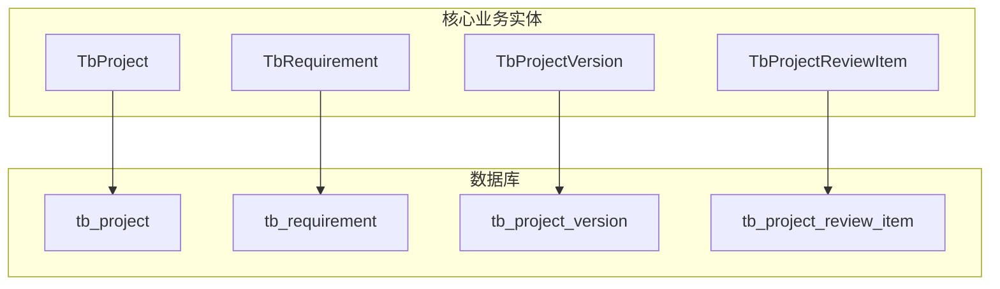
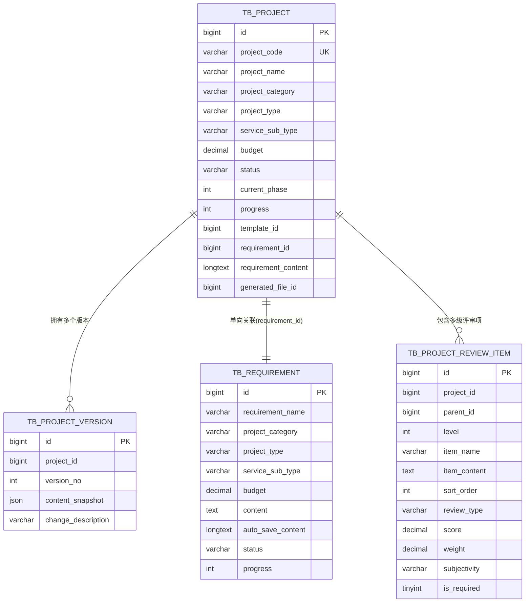
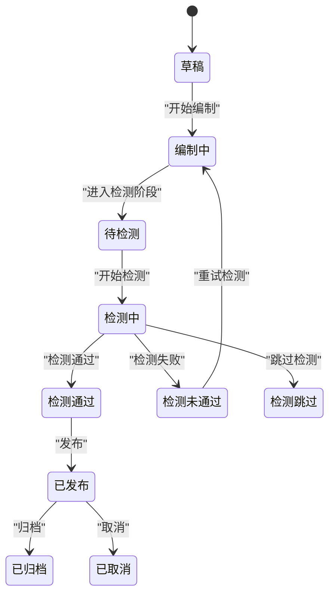
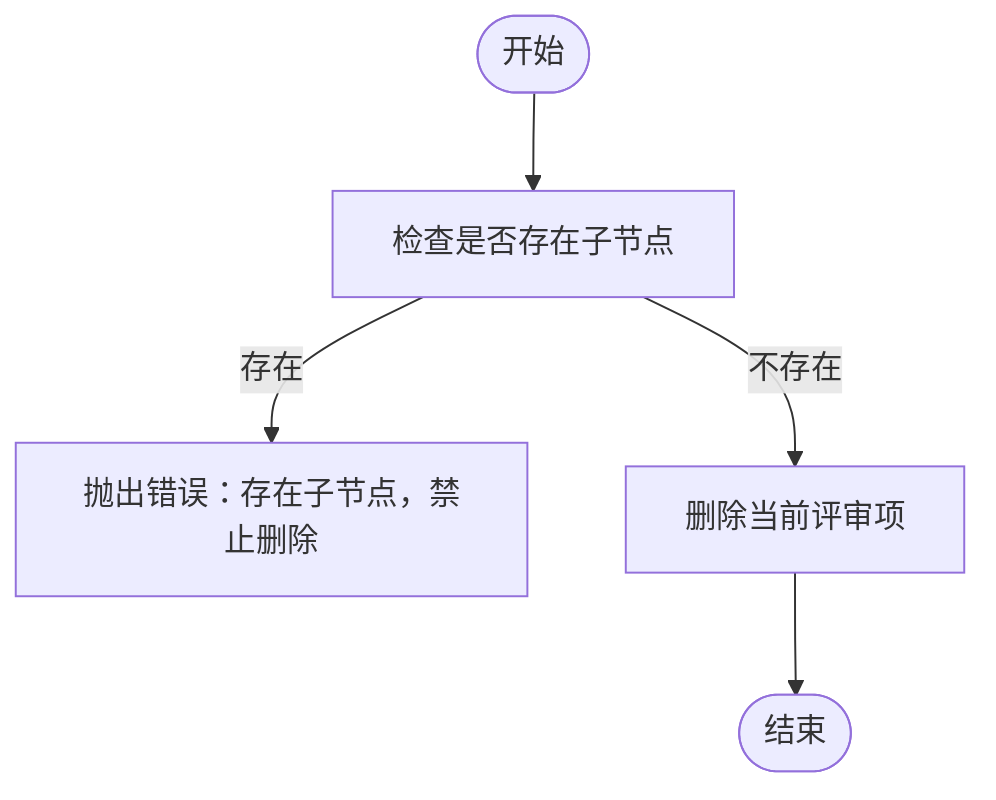
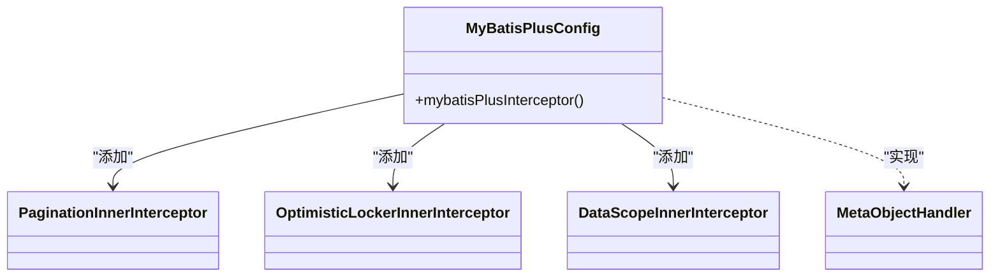
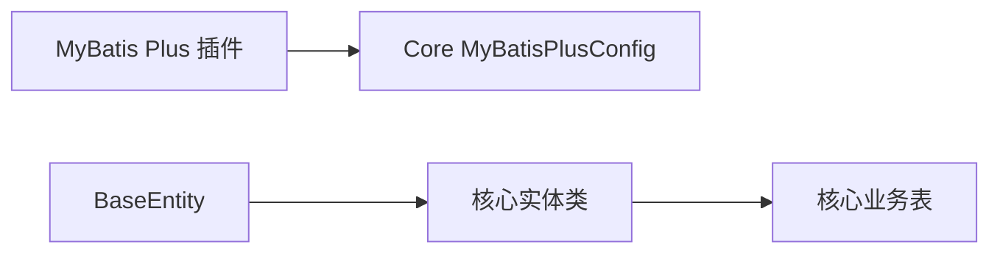

# 核心业务数据模型

<cite>
**本文引用的文件**
- [CORE_MODULE_SPEC.md](file://docs/rules/CORE_MODULE_SPEC.md)
- [init.sql（core模块）](file://ele-ai-tender-system/ele-ai-tender-core/sql/init.sql)
- [TbProject.java](file://ele-ai-tender-system/ele-ai-tender-common/src/main/java/com/jy/eleaitender/common/entity/core/TbProject.java)
- [TbRequirement.java](file://ele-ai-tender-system/ele-ai-tender-common/src/main/java/com/jy/eleaitender/common/entity/core/TbRequirement.java)
- [TbProjectVersion.java](file://ele-ai-tender-system/ele-ai-tender-common/src/main/java/com/jy/eleaitender/common/entity/core/TbProjectVersion.java)
- [TbProjectReviewItem.java](file://ele-ai-tender-system/ele-ai-tender-common/src/main/java/com/jy/eleaitender/common/entity/core/TbProjectReviewItem.java)
- [MyBatisPlusConfig（core模块）](file://ele-ai-tender-system/ele-ai-tender-core/src/main/java/com/jy/eleaitender/core/config/MyBatisPlusConfig.java)
- [RequirementServiceImpl.java](file://ele-ai-tender-system/ele-ai-tender-core/src/main/java/com/jy/eleaitender/core/service/impl/RequirementServiceImpl.java)
</cite>

## 目录
1. [引言](#引言)
2. [项目结构](#项目结构)
3. [核心组件](#核心组件)
4. [架构总览](#架构总览)
5. [详细组件分析](#详细组件分析)
6. [依赖分析](#依赖分析)
7. [性能考虑](#性能考虑)
8. [故障排查指南](#故障排查指南)
9. [结论](#结论)
10. [附录](#附录)

## 引言
本文件聚焦于招标文件AI编制系统的核心业务数据模型，围绕项目实体(TbProject)、需求实体(TbRequirement)、评审项实体(TbProjectReviewItem)等关键表进行深度说明。内容涵盖字段定义、数据类型选择、约束与索引、生命周期状态管理、版本控制机制、三级嵌套评审项建模方案、MyBatis Plus映射配置、查询条件构建示例、常见SQL实现以及性能优化建议。目标是帮助读者快速理解并正确使用这些核心数据模型。

## 项目结构
核心业务数据模型主要位于 common 模块的实体类与 core 模块的初始化脚本中：
- 实体类：TbProject、TbRequirement、TbProjectVersion、TbProjectReviewItem
- 数据库建表脚本：core 模块 init.sql
- 规范文档：CORE_MODULE_SPEC.md 对关键表、状态流转、评审项结构与模板配置进行了约定

图表来源
- [TbProject.java:1-100](file://ele-ai-tender-system/ele-ai-tender-common/src/main/java/com/jy/eleaitender/common/entity/core/TbProject.java#L1-L100)
- [TbRequirement.java:1-67](file://ele-ai-tender-system/ele-ai-tender-common/src/main/java/com/jy/eleaitender/common/entity/core/TbRequirement.java#L1-L67)
- [TbProjectVersion.java:1-30](file://ele-ai-tender-system/ele-ai-tender-common/src/main/java/com/jy/eleaitender/common/entity/core/TbProjectVersion.java#L1-L30)
- [TbProjectReviewItem.java:1-67](file://ele-ai-tender-system/ele-ai-tender-common/src/main/java/com/jy/eleaitender/common/entity/core/TbProjectReviewItem.java#L1-L67)
- [init.sql（core模块）:1-246](file://ele-ai-tender-system/ele-ai-tender-core/sql/init.sql#L1-L246)

章节来源
- [CORE_MODULE_SPEC.md:139-153](file://docs/rules/CORE_MODULE_SPEC.md#L139-L153)
- [init.sql（core模块）:1-246](file://ele-ai-tender-system/ele-ai-tender-core/sql/init.sql#L1-L246)

## 核心组件
本节概述四个核心实体的职责与关系：
- TbProject：项目主记录，承载项目基本信息、阶段与状态、模板引用、需求快照、生成文件ID等
- TbRequirement：独立的需求实体，支持自动保存草稿、匹配历史模板、状态与进度
- TbProjectVersion：项目版本快照，用于归档变更历史
- TbProjectReviewItem：评审项树，采用 parent_id + level 表示三级嵌套结构

章节来源
- [TbProject.java:1-100](file://ele-ai-tender-system/ele-ai-tender-common/src/main/java/com/jy/eleaitender/common/entity/core/TbProject.java#L1-L100)
- [TbRequirement.java:1-67](file://ele-ai-tender-system/ele-ai-tender-common/src/main/java/com/jy/eleaitender/common/entity/core/TbRequirement.java#L1-L67)
- [TbProjectVersion.java:1-30](file://ele-ai-tender-system/ele-ai-tender-common/src/main/java/com/jy/eleaitender/common/entity/core/TbProjectVersion.java#L1-L30)
- [TbProjectReviewItem.java:1-67](file://ele-ai-tender-system/ele-ai-tender-common/src/main/java/com/jy/eleaitender/common/entity/core/TbProjectReviewItem.java#L1-L67)

## 架构总览
下图展示核心实体与数据库表的映射关系及关键索引设计，体现一对一、一对多与自关联的结构。

图表来源
- [init.sql（core模块）:22-246](file://ele-ai-tender-system/ele-ai-tender-core/sql/init.sql#L22-L246)

章节来源
- [init.sql（core模块）:22-246](file://ele-ai-tender-system/ele-ai-tender-core/sql/init.sql#L22-L246)

## 详细组件分析

### 项目实体 TbProject
- 关键字段与含义
  - 项目编号 project_code：唯一标识，具备唯一索引 uk_project_code
  - 项目类别 project_category / 项目类型 project_type / 服务子类型 service_sub_type：分类维度
  - 预算金额 budget：DECIMAL(15,2)，可为空
  - 状态 status：项目全生命周期状态（见“状态流转”小节）
  - 当前编制阶段 current_phase：1-基础信息 2-招标需求 3-评审项 4-文档集成 5-智能检测
  - 完成进度 progress：百分比 0-100
  - 模板引用 template_id：关联 tb_project_template
  - 需求关联 requirement_id：指向 TbRequirement.id；进入需求阶段后，将需求内容复制到 requirement_content，后续阶段以快照为准
  - 生成文件ID generated_file_id：最终生成的招标文件ID（关联文件服务）
- 索引策略
  - 唯一索引 uk_project_code：保证编号全局唯一
  - 普通索引 idx_status、idx_category、idx_create_id：支撑列表筛选与统计
- 约束与完整性
  - 逻辑删除 is_delete、乐观锁 ver、审计字段 create_time/modify_time 等由 BaseEntity 统一提供
  - 创建时校验项目编号唯一性（含已删除），并发冲突通过唯一索引捕获并转为友好异常
- MyBatis Plus 映射
  - @TableName("tb_project") 指定表名
  - 继承 BaseEntity，自动填充审计字段与乐观锁
- 常见查询场景
  - 按状态、类别、创建人分页查询
  - 根据项目编号精确查询
  - 获取项目详情并附带需求快照

章节来源
- [TbProject.java:1-100](file://ele-ai-tender-system/ele-ai-tender-common/src/main/java/com/jy/eleaitender/common/entity/core/TbProject.java#L1-L100)
- [init.sql（core模块）:22-63](file://ele-ai-tender-system/ele-ai-tender-core/sql/init.sql#L22-L63)
- [CORE_MODULE_SPEC.md:139-153](file://docs/rules/CORE_MODULE_SPEC.md#L139-L153)

### 需求实体 TbRequirement
- 关键字段与含义
  - 需求名称 requirement_name、描述 requirement_description
  - 分类与预算：project_category、project_type、service_sub_type、budget
  - 匹配模式 match_mode、匹配历史文件 matched_file_id、相似度 matched_similarity、上传文件 uploaded_file_id
  - 内容 content：正式内容；auto_save_content/auto_save_time：未提交草稿
  - 状态 status：IN_PROGRESS/COMPLETED；progress：0-100
- 与项目的关系
  - 无 projectId 字段，项目通过 tb_project.requirement_id 单向关联
  - 进入需求阶段后，项目复制需求内容到 requirement_content，后续阶段不再依赖 TbRequirement
- 索引策略
  - idx_status、idx_create_id：支撑列表与权限过滤
- 常见查询场景
  - 按名称模糊、状态、项目类型、时间范围组合分页查询
  - 检查名称唯一性（排除自身）

章节来源
- [TbRequirement.java:1-67](file://ele-ai-tender-system/ele-ai-tender-common/src/main/java/com/jy/eleaitender/common/entity/core/TbRequirement.java#L1-L67)
- [init.sql（core模块）:91-119](file://ele-ai-tender-system/ele-ai-tender-core/sql/init.sql#L91-L119)
- [RequirementServiceImpl.java:67-102](file://ele-ai-tender-system/ele-ai-tender-core/src/main/java/com/jy/eleaitender/core/service/impl/RequirementServiceImpl.java#L67-L102)
- [CORE_MODULE_SPEC.md:139-153](file://docs/rules/CORE_MODULE_SPEC.md#L139-L153)

### 项目版本实体 TbProjectVersion
- 关键字段与含义
  - project_id：归属项目
  - version_no：版本号
  - content_snapshot：JSON 内容快照
  - change_description：变更说明
- 用途
  - 固化每次重要变更的内容快照，便于回溯与对比
- 索引策略
  - (project_id, version_no) 复合索引：高效定位某项目的版本序列

章节来源
- [TbProjectVersion.java:1-30](file://ele-ai-tender-system/ele-ai-tender-common/src/main/java/com/jy/eleaitender/common/entity/core/TbProjectVersion.java#L1-L30)
- [init.sql（core模块）:69-85](file://ele-ai-tender-system/ele-ai-tender-core/sql/init.sql#L69-L85)

### 评审项实体 TbProjectReviewItem（三级嵌套）
- 关键字段与含义
  - project_id：所属项目
  - parent_id：父节点ID（顶级为0或NULL，依实现而定）
  - level：层级 1/2/3
  - item_name/item_content：名称与内容
  - sort_order：排序号
  - review_type：评审类型（合规/技术/信用/商务）
  - score/max_score/weight：分值与权重
  - subjectivity：客观/主观
  - is_required：是否必审项
- 数据结构与约束
  - 一级：level=1，parent_id=0（或NULL）
  - 二级：level=2，parent_id=一级ID
  - 三级：level=3，parent_id=二级ID
  - 删除父级需检查是否存在子级，避免悬挂节点
- 索引策略
  - idx_project：按项目检索整棵树
  - idx_parent：按父节点查找子节点
  - idx_review_type：按评审类型筛选
- 常见操作
  - 批量重建评审项树（替换全部节点并重新映射临时父ID）
  - 按项目获取评审项树（递归组装）

章节来源
- [TbProjectReviewItem.java:1-67](file://ele-ai-tender-system/ele-ai-tender-common/src/main/java/com/jy/eleaitender/common/entity/core/TbProjectReviewItem.java#L1-L67)
- [init.sql（core模块）:155-181](file://ele-ai-tender-system/ele-ai-tender-core/sql/init.sql#L155-L181)
- [CORE_MODULE_SPEC.md:215-221](file://docs/rules/CORE_MODULE_SPEC.md#L215-L221)

### 项目生命周期状态管理
- 状态流转
  - DRAFT → IN_PROGRESS → PENDING_DETECTION → DETECTING → DETECTION_PASSED / DETECTION_FAILED / DETECTION_SKIPPED → PUBLISHED → ARCHIVED / CANCELLED
- 规则要点
  - 状态流转必须在 Service 层校验，不允许跳过中间状态
  - DETECTION_FAILED 可通过处理完毕后转换为 DETECTION_PASSED，或在重试检测时转回 IN_PROGRESS
- 阶段推进
  - BASIC_INFO(1) → REQUIREMENT(2) → REVIEW_ITEM(3) → DOCUMENT(4) → DETECTION(5)
  - 阶段只能顺序推进，不可跳跃或倒退；进入新阶段可触发AI任务

图表来源
- [CORE_MODULE_SPEC.md:157-176](file://docs/rules/CORE_MODULE_SPEC.md#L157-L176)

章节来源
- [CORE_MODULE_SPEC.md:157-176](file://docs/rules/CORE_MODULE_SPEC.md#L157-L176)

### 版本控制机制
- 版本快照
  - 在重要变更点（如文档集成完成后）写入 tb_project_version，记录 content_snapshot JSON 与变更说明
- 查询与对比
  - 使用 (project_id, version_no) 复合索引快速定位版本序列
  - 前端可进行版本差异对比展示

章节来源
- [TbProjectVersion.java:1-30](file://ele-ai-tender-system/ele-ai-tender-common/src/main/java/com/jy/eleaitender/common/entity/core/TbProjectVersion.java#L1-L30)
- [init.sql（core模块）:69-85](file://ele-ai-tender-system/ele-ai-tender-core/sql/init.sql#L69-L85)

### 三级嵌套评审项结构的数据建模方案
- 建模方式
  - 使用 parent_id + level 表示父子关系与层级深度
  - 通过 project_id 限定评审项的作用域
- 操作建议
  - 插入/更新时维护 level 与 parent_id 的一致性
  - 删除前检查是否存在子节点，防止悬挂
  - 批量重建时先清空再插入，或使用事务包裹以保证一致性

图表来源
- [CORE_MODULE_SPEC.md:215-221](file://docs/rules/CORE_MODULE_SPEC.md#L215-L221)

章节来源
- [CORE_MODULE_SPEC.md:215-221](file://docs/rules/CORE_MODULE_SPEC.md#L215-L221)

### MyBatis Plus 实体类映射配置
- 插件配置
  - 分页插件 PaginationInnerInterceptor(DbType.MYSQL)
  - 乐观锁插件 OptimisticLockerInnerInterceptor
  - 数据隔离拦截器 DataScopeInnerInterceptor（在分页之前）
- 自动填充
  - MetaObjectHandler 在 INSERT/UPDATE 时填充 create_time/modify_time、create_id/create_name、modify_id/modify_name
  - 乐观锁 ver 在更新时自动递增
- 逻辑删除
  - is_delete 默认 0，查询自动追加 AND is_delete = 0

图表来源
- [MyBatisPlusConfig（core模块）:1-24](file://ele-ai-tender-system/ele-ai-tender-core/src/main/java/com/jy/eleaitender/core/config/MyBatisPlusConfig.java#L1-L24)

章节来源
- [MyBatisPlusConfig（core模块）:1-24](file://ele-ai-tender-system/ele-ai-tender-core/src/main/java/com/jy/eleaitender/core/config/MyBatisPlusConfig.java#L1-L24)
- [CODE_CONVENTIONS.md:24-56](file://docs/rules/CODE_CONVENTIONS.md#L24-L56)

### 查询条件构建示例（LambdaQueryWrapper）
- 需求分页查询
  - 支持按需求名称模糊、状态、项目类型、创建时间范围组合查询，并按创建时间倒序
- 典型用法
  - wrapper.like(...)、wrapper.eq(...)、wrapper.ge()/le(...)、orderByDesc(...)

章节来源
- [RequirementServiceImpl.java:67-102](file://ele-ai-tender-system/ele-ai-tender-core/src/main/java/com/jy/eleaitender/core/service/impl/RequirementServiceImpl.java#L67-L102)

### 常见查询场景的SQL实现
以下SQL基于 init.sql 中的表结构与索引设计给出参考实现（仅示意，实际使用请结合业务参数化）：
- 按项目编号精确查询项目
  - SELECT * FROM tb_project WHERE project_code = ?
- 按状态与类别分页查询项目
  - SELECT * FROM tb_project WHERE status = ? AND project_category = ? ORDER BY create_time DESC LIMIT ?, ?
- 查询某项目的所有评审项（按层级与排序）
  - SELECT * FROM tb_project_review_item WHERE project_id = ? ORDER BY level ASC, sort_order ASC
- 查询某项目的最新版本
  - SELECT * FROM tb_project_version WHERE project_id = ? ORDER BY version_no DESC LIMIT 1
- 查询某需求的自动保存草稿
  - SELECT auto_save_content, auto_save_time FROM tb_requirement WHERE id = ?

章节来源
- [init.sql（core模块）:22-246](file://ele-ai-tender-system/ele-ai-tender-core/sql/init.sql#L22-L246)

## 依赖分析
- 实体与表映射
  - TbProject ↔ tb_project
  - TbRequirement ↔ tb_requirement
  - TbProjectVersion ↔ tb_project_version
  - TbProjectReviewItem ↔ tb_project_review_item
- 外部依赖
  - MyBatis Plus 插件：分页、乐观锁、数据隔离
  - BaseEntity：统一审计与逻辑删除
- 耦合与内聚
  - 评审项与项目强耦合（project_id），通过 parent_id 形成自关联树
  - 需求与项目弱耦合（单向引用），进入需求阶段后以快照为主

图表来源
- [MyBatisPlusConfig（core模块）:1-24](file://ele-ai-tender-system/ele-ai-tender-core/src/main/java/com/jy/eleaitender/core/config/MyBatisPlusConfig.java#L1-L24)
- [TbProject.java:1-100](file://ele-ai-tender-system/ele-ai-tender-common/src/main/java/com/jy/eleaitender/common/entity/core/TbProject.java#L1-L100)
- [TbRequirement.java:1-67](file://ele-ai-tender-system/ele-ai-tender-common/src/main/java/com/jy/eleaitender/common/entity/core/TbRequirement.java#L1-L67)
- [TbProjectVersion.java:1-30](file://ele-ai-tender-system/ele-ai-tender-common/src/main/java/com/jy/eleaitender/common/entity/core/TbProjectVersion.java#L1-L30)
- [TbProjectReviewItem.java:1-67](file://ele-ai-tender-system/ele-ai-tender-common/src/main/java/com/jy/eleaitender/common/entity/core/TbProjectReviewItem.java#L1-L67)

章节来源
- [CORE_MODULE_SPEC.md:139-153](file://docs/rules/CORE_MODULE_SPEC.md#L139-L153)
- [init.sql（core模块）:1-246](file://ele-ai-tender-system/ele-ai-tender-core/sql/init.sql#L1-L246)

## 性能考虑
- 索引策略
  - 项目：uk_project_code、idx_status、idx_category、idx_create_id
  - 需求：idx_status、idx_create_id
  - 版本：(project_id, version_no)
  - 评审项：idx_project、idx_parent、idx_review_type
- 查询优化
  - 优先使用等值与范围条件命中索引，避免在大文本字段上模糊匹配
  - 分页查询尽量带上排序字段，减少额外排序开销
- 写优化
  - 批量插入评审项时使用事务包裹，减少锁竞争
  - 版本快照写入注意JSON大小，必要时分片存储或压缩
- 缓存建议
  - 评审项树可按项目ID缓存，降低频繁递归查询压力
  - 项目状态与阶段可在热点场景下短期缓存

[本节为通用性能建议，不直接分析具体文件]

## 故障排查指南
- 项目状态异常
  - 检查 tb_project.status 是否符合状态机约束
- 阶段推进失败
  - 检查 PhaseFlowController 日志与阶段推进规则
- 需求阶段内容为空
  - 若 tb_project.requirement_id 有值，查看 TbRequirement.content；若无值，检查 AI 任务状态
- AI生成失败
  - 检查模型配置与 Token 用量限制
- 评审项结构错误
  - 检查 parent_id 与 level 的一致性，确保删除前检查子节点

章节来源
- [CORE_MODULE_SPEC.md:342-350](file://docs/rules/CORE_MODULE_SPEC.md#L342-L350)

## 结论
本项目核心数据模型围绕项目、需求、版本与评审项展开，采用清晰的实体-表映射与合理的索引设计，配合 MyBatis Plus 的分页、乐观锁与数据隔离能力，保障了高可用与高性能。通过严格的状态机与阶段推进规则，系统实现了从草稿到发布的完整生命周期管理。评审项的三级嵌套结构以 parent_id + level 建模，兼顾灵活性与查询效率。建议在热点场景引入缓存，并对大文本与JSON字段进行合理治理，进一步提升整体性能与可维护性。

## 附录
- 相关规范
  - 编码规范：CODE_CONVENTIONS.md
  - 核心模块规范：CORE_MODULE_SPEC.md
  - 阶段流程规范：PHASE_FLOW_SPEC.md
  - 检测链路规范：DETECTION_FLOW_SPEC.md

[本节为概念性汇总，不直接分析具体文件]