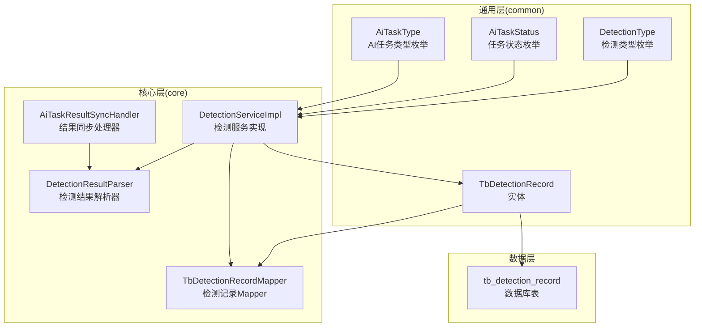
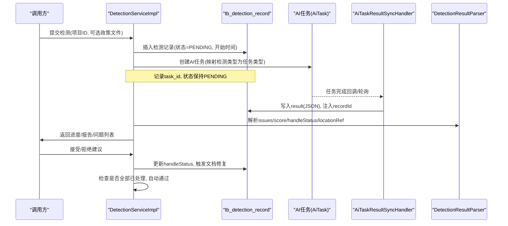
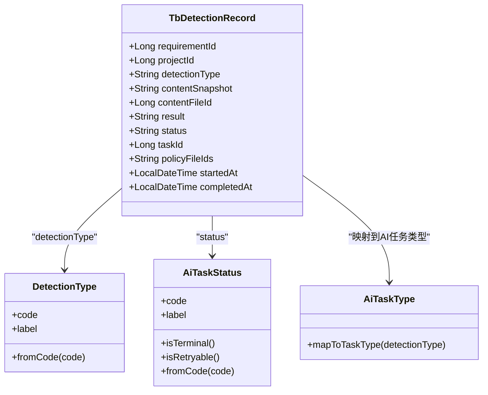
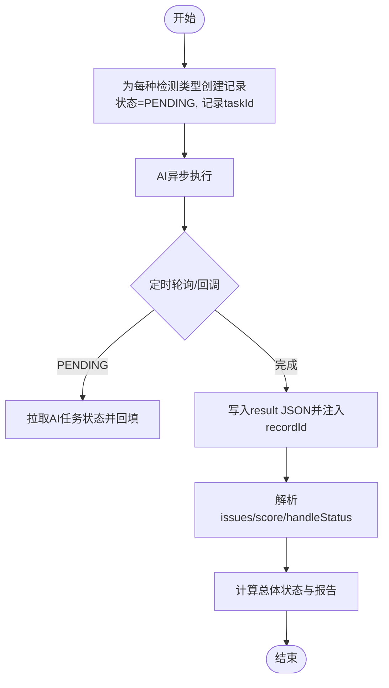
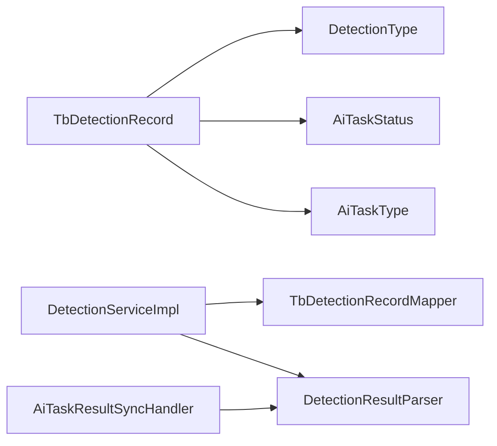

# 检测记录实体(TbDetectionRecord)

<cite>
**本文引用的文件**
- [TbDetectionRecord.java](file://ele-ai-tender-system/ele-ai-tender-common/src/main/java/com/jy/eleaitender/common/entity/core/TbDetectionRecord.java)
- [DetectionType.java](file://ele-ai-tender-system/ele-ai-tender-common/src/main/java/com/jy/eleaitender/common/enums/DetectionType.java)
- [AiTaskStatus.java](file://ele-ai-tender-system/ele-ai-tender-common/src/main/java/com/jy/eleaitender/common/enums/AiTaskStatus.java)
- [AiTaskType.java](file://ele-ai-tender-system/ele-ai-tender-common/src/main/java/com/jy/eleaitender/common/enums/AiTaskType.java)
- [DetectionServiceImpl.java](file://ele-ai-tender-system/ele-ai-tender-core/src/main/java/com/jy/eleaitender/core/service/impl/DetectionServiceImpl.java)
- [TbDetectionRecordMapper.java](file://ele-ai-tender-system/ele-ai-tender-core/src/main/java/com/jy/eleaitender/core/mapper/TbDetectionRecordMapper.java)
- [DetectionResultParser.java](file://ele-ai-tender-system/ele-ai-tender-core/src/main/java/com/jy/eleaitender/core/util/DetectionResultParser.java)
- [AiTaskResultSyncHandler.java](file://ele-ai-tender-system/ele-ai-tender-core/src/main/java/com/jy/eleaitender/core/scheduler/AiTaskResultSyncHandler.java)
- [init.sql](file://ele-ai-tender-system/ele-ai-tender-core/sql/init.sql)
</cite>

## 目录
1. [简介](#简介)
2. [项目结构](#项目结构)
3. [核心组件](#核心组件)
4. [架构总览](#架构总览)
5. [详细组件分析](#详细组件分析)
6. [依赖关系分析](#依赖关系分析)
7. [性能与大数据处理](#性能与大数据处理)
8. [故障排查指南](#故障排查指南)
9. [结论](#结论)
10. [附录](#附录)

## 简介
本文件围绕检测记录实体 TbDetectionRecord 的数据模型与使用规范进行系统化说明，覆盖表结构设计、检测类型枚举、结果 JSON 规范、状态机与异步流程、多模块共享设计、Core 与 AI 模块的字段映射与一致性保障、解析示例、统计查询优化、日志归档策略、性能监控指标及故障排查要点。目标是帮助读者快速理解并正确使用该实体在“智能检测”链路中的角色与约束。

## 项目结构
- 实体定义位于通用层 common，供 Core 与 AI 等多模块复用。
- 业务编排与持久化访问集中在 Core 模块（服务实现与 Mapper）。
- 检测结果 JSON 由 AI 模块写入，Core 模块负责解析、展示与修复联动。

图表来源
- [TbDetectionRecord.java:1-54](file://ele-ai-tender-system/ele-ai-tender-common/src/main/java/com/jy/eleaitender/common/entity/core/TbDetectionRecord.java#L1-L54)
- [DetectionType.java:1-30](file://ele-ai-tender-system/ele-ai-tender-common/src/main/java/com/jy/eleaitender/common/enums/DetectionType.java#L1-L30)
- [AiTaskStatus.java:1-46](file://ele-ai-tender-system/ele-ai-tender-common/src/main/java/com/jy/eleaitender/common/enums/AiTaskStatus.java#L1-L46)
- [AiTaskType.java:31-51](file://ele-ai-tender-system/ele-ai-tender-common/src/main/java/com/jy/eleaitender/common/enums/AiTaskType.java#L31-L51)
- [DetectionServiceImpl.java:1-578](file://ele-ai-tender-system/ele-ai-tender-core/src/main/java/com/jy/eleaitender/core/service/impl/DetectionServiceImpl.java#L1-L578)
- [TbDetectionRecordMapper.java:1-38](file://ele-ai-tender-system/ele-ai-tender-core/src/main/java/com/jy/eleaitender/core/mapper/TbDetectionRecordMapper.java#L1-L38)
- [DetectionResultParser.java:1-446](file://ele-ai-tender-system/ele-ai-tender-core/src/main/java/com/jy/eleaitender/core/util/DetectionResultParser.java#L1-L446)
- [AiTaskResultSyncHandler.java:634-668](file://ele-ai-tender-system/ele-ai-tender-core/src/main/java/com/jy/eleaitender/core/scheduler/AiTaskResultSyncHandler.java#L634-L668)
- [init.sql:218](file://ele-ai-tender-system/ele-ai-tender-core/sql/init.sql#L218)

章节来源
- [TbDetectionRecord.java:1-54](file://ele-ai-tender-system/ele-ai-tender-common/src/main/java/com/jy/eleaitender/common/entity/core/TbDetectionRecord.java#L1-L54)
- [DetectionServiceImpl.java:86-143](file://ele-ai-tender-system/ele-ai-tender-core/src/main/java/com/jy/eleaitender/core/service/impl/DetectionServiceImpl.java#L86-L143)
- [TbDetectionRecordMapper.java:18-38](file://ele-ai-tender-system/ele-ai-tender-core/src/main/java/com/jy/eleaitender/core/mapper/TbDetectionRecordMapper.java#L18-L38)
- [DetectionResultParser.java:38-89](file://ele-ai-tender-system/ele-ai-tender-core/src/main/java/com/jy/eleaitender/core/util/DetectionResultParser.java#L38-L89)
- [AiTaskResultSyncHandler.java:634-668](file://ele-ai-tender-system/ele-ai-tender-core/src/main/java/com/jy/eleaitender/core/scheduler/AiTaskResultSyncHandler.java#L634-L668)
- [init.sql:218](file://ele-ai-tender-system/ele-ai-tender-core/sql/init.sql#L218)

## 核心组件
- 实体 TbDetectionRecord：描述一次检测记录的元数据与结果快照，包含关联需求/项目、检测类型、内容快照、结果JSON、状态、任务ID、政策文件ID列表、时间戳等。
- 检测类型 DetectionType：SENSITIVE_WORD、TYPO、POLICY_REVIEW、FORMAT_CHECK。
- 任务状态 AiTaskStatus：PENDING、PROCESSING、COMPLETED、FAILED、AI_UNAVAILABLE、SKIPPED；提供终态与可重试判断。
- 任务类型映射 AiTaskType：将检测类型映射为具体AI任务类型，驱动AI侧执行。
- 服务实现 DetectionServiceImpl：负责创建检测记录、发起AI任务、进度聚合、报告生成、接受/拒绝建议、批量处理、重试与跳过逻辑。
- 解析器 DetectionResultParser：对 result JSON 进行结构化解析、评分与问题数提取、handleStatus 更新、locationRef 填充与解析、替换项收集等。
- Mapper TbDetectionRecordMapper：按项目/需求维度查询与软删除。
- 结果同步 AiTaskResultSyncHandler：在结果落库前注入 recordId，便于前端逐条处理。

章节来源
- [DetectionType.java:1-30](file://ele-ai-tender-system/ele-ai-tender-common/src/main/java/com/jy/eleaitender/common/enums/DetectionType.java#L1-L30)
- [AiTaskStatus.java:1-46](file://ele-ai-tender-system/ele-ai-tender-common/src/main/java/com/jy/eleaitender/common/enums/AiTaskStatus.java#L1-L46)
- [AiTaskType.java:31-51](file://ele-ai-tender-system/ele-ai-tender-common/src/main/java/com/jy/eleaitender/common/enums/AiTaskType.java#L31-L51)
- [DetectionServiceImpl.java:145-230](file://ele-ai-tender-system/ele-ai-tender-core/src/main/java/com/jy/eleaitender/core/service/impl/DetectionServiceImpl.java#L145-L230)
- [DetectionResultParser.java:94-123](file://ele-ai-tender-system/ele-ai-tender-core/src/main/java/com/jy/eleaitender/core/util/DetectionResultParser.java#L94-L123)
- [TbDetectionRecordMapper.java:18-38](file://ele-ai-tender-system/ele-ai-tender-core/src/main/java/com/jy/eleaitender/core/mapper/TbDetectionRecordMapper.java#L18-L38)
- [AiTaskResultSyncHandler.java:634-668](file://ele-ai-tender-system/ele-ai-tender-core/src/main/java/com/jy/eleaitender/core/scheduler/AiTaskResultSyncHandler.java#L634-L668)

## 架构总览
检测记录贯穿“提交检测→创建AI任务→异步执行→结果回写→解析与交互→文档修复→状态推进”的全链路。

图表来源
- [DetectionServiceImpl.java:86-143](file://ele-ai-tender-system/ele-ai-tender-core/src/main/java/com/jy/eleaitender/core/service/impl/DetectionServiceImpl.java#L86-L143)
- [AiTaskResultSyncHandler.java:634-668](file://ele-ai-tender-system/ele-ai-tender-core/src/main/java/com/jy/eleaitender/core/scheduler/AiTaskResultSyncHandler.java#L634-L668)
- [DetectionResultParser.java:38-89](file://ele-ai-tender-system/ele-ai-tender-core/src/main/java/com/jy/eleaitender/core/util/DetectionResultParser.java#L38-L89)

## 详细组件分析

### 数据模型与字段语义
- requirementId：关联业务需求ID（需求级检测时非空），用于需求维度的检测记录聚合与清理。
- projectId：所属项目ID，用于项目维度的检测进度与报告汇总。
- detectionType：检测类型，取值来自 DetectionType 枚举。
- contentSnapshot：检测内容快照，便于回溯与审计。
- contentFileId：检测文件ID（当前实现中为空，保留扩展）。
- result：检测结果JSON字符串，由AI模块写入，Core 模块解析。
- status：任务状态，取值来自 AiTaskStatus 枚举。
- taskId：关联的AI任务ID，用于状态同步与结果回写。
- policyFileIds：关联的政策文件ID列表（逗号分隔），用于政策审查类检测。
- startedAt/completedAt：开始与完成时间，用于耗时统计与超时判定。

图表来源
- [TbDetectionRecord.java:1-54](file://ele-ai-tender-system/ele-ai-tender-common/src/main/java/com/jy/eleaitender/common/entity/core/TbDetectionRecord.java#L1-L54)
- [DetectionType.java:1-30](file://ele-ai-tender-system/ele-ai-tender-common/src/main/java/com/jy/eleaitender/common/enums/DetectionType.java#L1-L30)
- [AiTaskStatus.java:1-46](file://ele-ai-tender-system/ele-ai-tender-common/src/main/java/com/jy/eleaitender/common/enums/AiTaskStatus.java#L1-L46)
- [AiTaskType.java:31-51](file://ele-ai-tender-system/ele-ai-tender-common/src/main/java/com/jy/eleaitender/common/enums/AiTaskType.java#L31-L51)

章节来源
- [TbDetectionRecord.java:1-54](file://ele-ai-tender-system/ele-ai-tender-common/src/main/java/com/jy/eleaitender/common/entity/core/TbDetectionRecord.java#L1-L54)

### 检测类型与任务映射
- 检测类型：SENSITIVE_WORD、TYPO、POLICY_REVIEW、FORMAT_CHECK。
- 映射规则：DetectionType → AiTaskType.DETECTION_*，确保每种检测类型对应唯一AI任务类型。
- 特殊处理：当未选择政策文件时，POLICY_REVIEW 将被跳过并以“已完成+空问题集”记录。

章节来源
- [DetectionType.java:1-30](file://ele-ai-tender-system/ele-ai-tender-common/src/main/java/com/jy/eleaitender/common/enums/DetectionType.java#L1-L30)
- [AiTaskType.java:31-51](file://ele-ai-tender-system/ele-ai-tender-common/src/main/java/com/jy/eleaitender/common/enums/AiTaskType.java#L31-L51)
- [DetectionServiceImpl.java:107-135](file://ele-ai-tender-system/ele-ai-tender-core/src/main/java/com/jy/eleaitender/core/service/impl/DetectionServiceImpl.java#L107-L135)

### 状态管理与异步流程
- 状态集合：PENDING、PROCESSING、COMPLETED、FAILED、AI_UNAVAILABLE、SKIPPED。
- 终态：COMPLETED、FAILED、AI_UNAVAILABLE、SKIPPED。
- 可重试：FAILED、AI_UNAVAILABLE。
- 异步机制：
  - 提交检测时创建多条检测记录（每种类型一条），状态置为 PENDING，并创建对应AI任务。
  - 定时任务每10秒扫描 PENDING 记录，拉取AI任务状态并回填。
  - AI任务完成后，结果同步处理器将 result JSON 写入检测记录，并注入 recordId。
  - Core 服务根据状态与结果计算总体状态（如 DETECTING、PASSED、FAILED、AI_UNAVAILABLE）。

图表来源
- [DetectionServiceImpl.java:566-575](file://ele-ai-tender-system/ele-ai-tender-core/src/main/java/com/jy/eleaitender/core/service/impl/DetectionServiceImpl.java#L566-L575)
- [AiTaskResultSyncHandler.java:634-668](file://ele-ai-tender-system/ele-ai-tender-core/src/main/java/com/jy/eleaitender/core/scheduler/AiTaskResultSyncHandler.java#L634-L668)
- [DetectionResultParser.java:38-89](file://ele-ai-tender-system/ele-ai-tender-core/src/main/java/com/jy/eleaitender/core/util/DetectionResultParser.java#L38-L89)

章节来源
- [AiTaskStatus.java:1-46](file://ele-ai-tender-system/ele-ai-tender-common/src/main/java/com/jy/eleaitender/common/enums/AiTaskStatus.java#L1-L46)
- [DetectionServiceImpl.java:566-575](file://ele-ai-tender-system/ele-ai-tender-core/src/main/java/com/jy/eleaitender/core/service/impl/DetectionServiceImpl.java#L566-L575)
- [AiTaskResultSyncHandler.java:634-668](file://ele-ai-tender-system/ele-ai-tender-core/src/main/java/com/jy/eleaitender/core/scheduler/AiTaskResultSyncHandler.java#L634-L668)

### 检测结果JSON格式规范
- 顶层字段：
  - issues：数组，每项为一个问题对象。
  - score：数值，表示整体评分。
- 问题对象字段（常见）：
  - detectionType：检测类型代码（若缺失则回退到记录级别 detectionType）。
  - position：位置描述。
  - original：原文片段。
  - targeted：建议替换文本。
  - reason：原因说明。
  - suggestion：建议说明。
  - severity：严重等级（默认 MEDIUM）。
  - handleStatus：处理状态（0=未处理，1=已接受，2=已拒绝，3=未找到）。
  - issueIndex：问题索引（解析后填充）。
  - policyReference：引用政策（可选）。
  - ruleViolated：违反规则（可选）。
  - locationRef：定位信息（可选），包含 type、elementIndex、tableIndex、rowIndex、cellIndex。
- 辅助字段：
  - recordId：由结果同步处理器注入，便于前端逐条处理。

章节来源
- [DetectionResultParser.java:38-89](file://ele-ai-tender-system/ele-ai-tender-core/src/main/java/com/jy/eleaitender/core/util/DetectionResultParser.java#L38-L89)
- [AiTaskResultSyncHandler.java:634-668](file://ele-ai-tender-system/ele-ai-tender-core/src/main/java/com/jy/eleaitender/core/scheduler/AiTaskResultSyncHandler.java#L634-L668)

### 状态机与总体状态计算
- 单项记录状态：遵循 AiTaskStatus。
- 项目总体状态（基于所有检测记录）：
  - 无记录：PENDING
  - 存在 AI_UNAVAILABLE：AI_UNAVAILABLE
  - 存在 FAILED：FAILED
  - 全部 COMPLETED：若有问题则为 FAILED，否则 PASSED
  - 其他：DETECTING

章节来源
- [DetectionServiceImpl.java:189-202](file://ele-ai-tender-system/ele-ai-tender-core/src/main/java/com/jy/eleaitender/core/service/impl/DetectionServiceImpl.java#L189-L202)

### 多模块共享表设计与一致性保证
- 共享设计：
  - 实体与枚举位于 common，Core 与 AI 共同消费。
  - 表 tb_detection_record 由 Core 写入与读取，AI 仅通过任务ID间接关联。
- 一致性保障：
  - 任务类型映射：DetectionType → AiTaskType，避免类型漂移。
  - 状态同步：定时任务拉取 AI 任务状态回填至检测记录。
  - 结果注入：结果同步处理器在写入 result 前注入 recordId，确保前后端一致。
  - 软删除：支持按需求或项目维度软删除检测记录，保持数据生命周期一致。

章节来源
- [AiTaskType.java:31-51](file://ele-ai-tender-system/ele-ai-tender-common/src/main/java/com/jy/eleaitender/common/enums/AiTaskType.java#L31-L51)
- [DetectionServiceImpl.java:566-575](file://ele-ai-tender-system/ele-ai-tender-core/src/main/java/com/jy/eleaitender/core/service/impl/DetectionServiceImpl.java#L566-L575)
- [AiTaskResultSyncHandler.java:634-668](file://ele-ai-tender-system/ele-ai-tender-core/src/main/java/com/jy/eleaitender/core/scheduler/AiTaskResultSyncHandler.java#L634-L668)
- [TbDetectionRecordMapper.java:28-38](file://ele-ai-tender-system/ele-ai-tender-core/src/main/java/com/jy/eleaitender/core/mapper/TbDetectionRecordMapper.java#L28-L38)

### 检测结果解析与处理示例
- 解析问题列表：从 result JSON 的 issues 数组构建问题VO，兼容缺失字段与异常。
- 解析评分与数量：安全解析 score 与 issues 长度，失败时返回默认值。
- 更新处理状态：按 issueIndex 更新 handleStatus，越界或异常时不写入。
- 批量接受：将所有未处理的 handleStatus 置为已接受，并收集替换项用于文档修复。
- 填充定位信息：根据全文与分段偏移，为每个问题补充 locationRef，支持表格单元格精确定位。
- 解析定位信息：从 result JSON 中提取 locationRef 供修复引擎使用。

章节来源
- [DetectionResultParser.java:94-123](file://ele-ai-tender-system/ele-ai-tender-core/src/main/java/com/jy/eleaitender/core/util/DetectionResultParser.java#L94-L123)
- [DetectionResultParser.java:133-178](file://ele-ai-tender-system/ele-ai-tender-core/src/main/java/com/jy/eleaitender/core/util/DetectionResultParser.java#L133-L178)
- [DetectionResultParser.java:310-372](file://ele-ai-tender-system/ele-ai-tender-core/src/main/java/com/jy/eleaitender/core/util/DetectionResultParser.java#L310-L372)
- [DetectionResultParser.java:377-404](file://ele-ai-tender-system/ele-ai-tender-core/src/main/java/com/jy/eleaitender/core/util/DetectionResultParser.java#L377-L404)

### 与文档修复的联动
- 接受单个问题：尝试基于 original/targeted 与 locationRef 精准修复文档，成功则更新生成的文件ID，并将 handleStatus 置为已接受；失败则标记为未找到。
- 批量接受：先批量标记 handleStatus，再一次性提交所有替换项进行修复，减少IO次数。
- 自动通过：当所有问题均已处理（无未处理项），自动将项目状态转为通过，并创建版本备份。

章节来源
- [DetectionServiceImpl.java:290-336](file://ele-ai-tender-system/ele-ai-tender-core/src/main/java/com/jy/eleaitender/core/service/impl/DetectionServiceImpl.java#L290-L336)
- [DetectionServiceImpl.java:360-394](file://ele-ai-tender-system/ele-ai-tender-core/src/main/java/com/jy/eleaitender/core/service/impl/DetectionServiceImpl.java#L360-L394)
- [DetectionServiceImpl.java:527-552](file://ele-ai-tender-system/ele-ai-tender-core/src/main/java/com/jy/eleaitender/core/service/impl/DetectionServiceImpl.java#L527-L552)

## 依赖关系分析
- 实体与枚举：TbDetectionRecord 依赖 DetectionType、AiTaskStatus、AiTaskType。
- 服务与解析器：DetectionServiceImpl 依赖 TbDetectionRecordMapper、DetectionResultParser、AI任务服务。
- 结果同步：AiTaskResultSyncHandler 在结果落库前注入 recordId，增强前后端一致性。
- 数据访问：TbDetectionRecordMapper 提供按项目/需求维度的查询与软删除。

图表来源
- [TbDetectionRecord.java:1-54](file://ele-ai-tender-system/ele-ai-tender-common/src/main/java/com/jy/eleaitender/common/entity/core/TbDetectionRecord.java#L1-L54)
- [DetectionType.java:1-30](file://ele-ai-tender-system/ele-ai-tender-common/src/main/java/com/jy/eleaitender/common/enums/DetectionType.java#L1-L30)
- [AiTaskStatus.java:1-46](file://ele-ai-tender-system/ele-ai-tender-common/src/main/java/com/jy/eleaitender/common/enums/AiTaskStatus.java#L1-L46)
- [AiTaskType.java:31-51](file://ele-ai-tender-system/ele-ai-tender-common/src/main/java/com/jy/eleaitender/common/enums/AiTaskType.java#L31-L51)
- [DetectionServiceImpl.java:1-578](file://ele-ai-tender-system/ele-ai-tender-core/src/main/java/com/jy/eleaitender/core/service/impl/DetectionServiceImpl.java#L1-L578)
- [TbDetectionRecordMapper.java:1-38](file://ele-ai-tender-system/ele-ai-tender-core/src/main/java/com/jy/eleaitender/core/mapper/TbDetectionRecordMapper.java#L1-L38)
- [DetectionResultParser.java:1-446](file://ele-ai-tender-system/ele-ai-tender-core/src/main/java/com/jy/eleaitender/core/util/DetectionResultParser.java#L1-L446)
- [AiTaskResultSyncHandler.java:634-668](file://ele-ai-tender-system/ele-ai-tender-core/src/main/java/com/jy/eleaitender/core/scheduler/AiTaskResultSyncHandler.java#L634-L668)

章节来源
- [DetectionServiceImpl.java:1-578](file://ele-ai-tender-system/ele-ai-tender-core/src/main/java/com/jy/eleaitender/core/service/impl/DetectionServiceImpl.java#L1-L578)
- [TbDetectionRecordMapper.java:1-38](file://ele-ai-tender-system/ele-ai-tender-core/src/main/java/com/jy/eleaitender/core/mapper/TbDetectionRecordMapper.java#L1-L38)
- [DetectionResultParser.java:1-446](file://ele-ai-tender-system/ele-ai-tender-core/src/main/java/com/jy/eleaitender/core/util/DetectionResultParser.java#L1-L446)
- [AiTaskResultSyncHandler.java:634-668](file://ele-ai-tender-system/ele-ai-tender-core/src/main/java/com/jy/eleaitender/core/scheduler/AiTaskResultSyncHandler.java#L634-L668)

## 性能与大数据处理
- 查询优化：
  - 优先按 project_id 与 is_delete 过滤，避免全表扫描。
  - 需要统计时，尽量使用 parseIssueCount/parseScore 轻量解析，避免加载完整问题列表。
- 批处理：
  - 批量接受建议时，先批量更新 handleStatus，再一次性提交替换项，降低网络与IO开销。
- 定位填充：
  - fillLocationRefs 采用二分查找 segments 的 fullTextOffset，提升匹配效率；对长文档建议分片处理。
- 重试与跳过：
  - 对 POLICY_REVIEW 且无政策文件的情况直接以“已完成+空问题集”记录，避免无效AI调用。
- 定时任务：
  - 每10秒扫描 PENDING 记录，注意控制并发与限流，避免对AI服务造成压力。

章节来源
- [DetectionServiceImpl.java:360-394](file://ele-ai-tender-system/ele-ai-tender-core/src/main/java/com/jy/eleaitender/core/service/impl/DetectionServiceImpl.java#L360-L394)
- [DetectionResultParser.java:310-372](file://ele-ai-tender-system/ele-ai-tender-core/src/main/java/com/jy/eleaitender/core/util/DetectionResultParser.java#L310-L372)
- [DetectionServiceImpl.java:479-487](file://ele-ai-tender-system/ele-ai-tender-core/src/main/java/com/jy/eleaitender/core/service/impl/DetectionServiceImpl.java#L479-L487)
- [DetectionServiceImpl.java:566-575](file://ele-ai-tender-system/ele-ai-tender-core/src/main/java/com/jy/eleaitender/core/service/impl/DetectionServiceImpl.java#L566-L575)

## 故障排查指南
- 结果解析失败：
  - 现象：解析 issues/score 返回空或默认值。
  - 排查：确认 result JSON 结构是否符合规范；关注异常日志输出。
- 定位信息缺失：
  - 现象：locationRef 为空导致修复失败。
  - 排查：检查 fillLocationRefs 是否执行；确认全文与分段偏移是否正确；验证规范化匹配逻辑。
- 状态不同步：
  - 现象：检测记录状态长期停留在 PENDING。
  - 排查：确认定时任务是否运行；核对 aiTaskService.getTaskStatus 返回值；检查 AI 任务是否存在。
- 文档修复失败：
  - 现象：接受建议后未生效。
  - 排查：检查 original/targeted 是否有效；确认 locationRef 是否提供；查看 fileServiceClient.fixDocument 返回。
- 软删除影响：
  - 现象：历史检测记录不可见。
  - 排查：确认 is_delete 标志；使用 Mapper 提供的软删除接口进行清理。

章节来源
- [DetectionResultParser.java:85-89](file://ele-ai-tender-system/ele-ai-tender-core/src/main/java/com/jy/eleaitender/core/util/DetectionResultParser.java#L85-L89)
- [DetectionResultParser.java:310-372](file://ele-ai-tender-system/ele-ai-tender-core/src/main/java/com/jy/eleaitender/core/util/DetectionResultParser.java#L310-L372)
- [DetectionServiceImpl.java:566-575](file://ele-ai-tender-system/ele-ai-tender-core/src/main/java/com/jy/eleaitender/core/service/impl/DetectionServiceImpl.java#L566-L575)
- [DetectionServiceImpl.java:290-336](file://ele-ai-tender-system/ele-ai-tender-core/src/main/java/com/jy/eleaitender/core/service/impl/DetectionServiceImpl.java#L290-L336)
- [TbDetectionRecordMapper.java:28-38](file://ele-ai-tender-system/ele-ai-tender-core/src/main/java/com/jy/eleaitender/core/mapper/TbDetectionRecordMapper.java#L28-L38)

## 结论
TbDetectionRecord 作为跨模块共享的检测记录实体，承载了检测类型、结果JSON、状态与任务关联等关键信息。通过统一的枚举与映射、严格的JSON规范、完善的解析与同步机制，系统在准确性、一致性与可维护性方面具备良好基础。结合批处理、定位填充与定时同步策略，可在大数据量场景下保持较好的性能与稳定性。

## 附录

### 表结构与索引建议
- 表名：tb_detection_record
- 关键字段：project_id、requirement_id、detection_type、status、task_id、policy_file_ids、started_at、completed_at、result
- 建议索引：
  - idx_project(project_id, is_delete)
  - idx_requirement(requirement_id, is_delete)
  - idx_status(status)
  - idx_task(task_id)
  - idx_policy(policy_file_ids)（视查询模式考虑函数索引或冗余列）

章节来源
- [init.sql:218](file://ele-ai-tender-system/ele-ai-tender-core/sql/init.sql#L218)

### 统计查询与报表优化
- 按项目维度统计：
  - 使用 selectByProjectId 获取记录列表，再通过 parseIssueCount/parseScore 计算总数与评分。
- 按类型维度统计：
  - 在应用层按 detectionType 分组统计，避免复杂SQL。
- 历史归档：
  - 对长时间未访问的记录，可按项目/需求维度软删除或迁移至归档表，减轻主表压力。

章节来源
- [TbDetectionRecordMapper.java:18-38](file://ele-ai-tender-system/ele-ai-tender-core/src/main/java/com/jy/eleaitender/core/mapper/TbDetectionRecordMapper.java#L18-L38)
- [DetectionServiceImpl.java:145-230](file://ele-ai-tender-system/ele-ai-tender-core/src/main/java/com/jy/eleaitender/core/service/impl/DetectionServiceImpl.java#L145-L230)

### 日志归档策略
- 建议：
  - 将检测记录与AI任务日志关联，按项目/需求维度归档。
  - 对 result JSON 大字段进行压缩存储或外置存储，主表仅保留引用。
  - 定期清理过期记录，保留审计所需的最小数据集。

[本节为通用指导，不直接分析具体文件]

### 性能监控指标
- 关键指标：
  - 检测记录创建耗时、AI任务创建耗时、状态同步延迟、结果解析耗时、文档修复成功率。
- 监控点：
  - 定时任务执行频率与失败率。
  - result JSON 大小分布与解析异常率。
  - 批量接受与修复的吞吐与错误率。

[本节为通用指导，不直接分析具体文件]