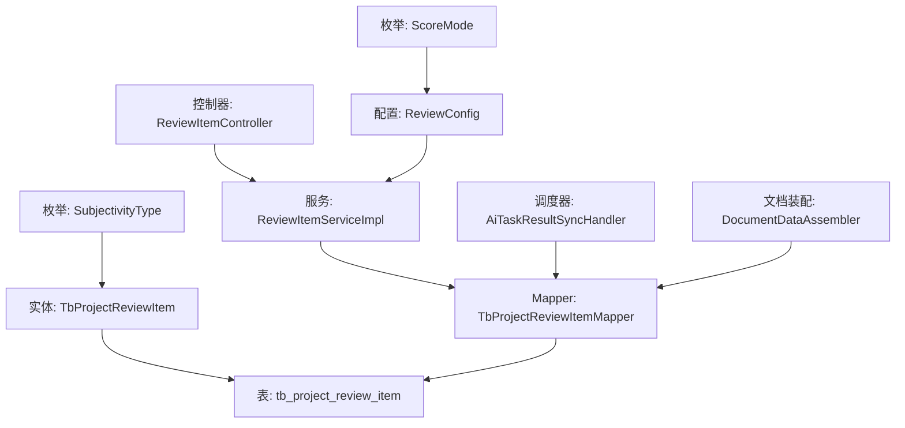
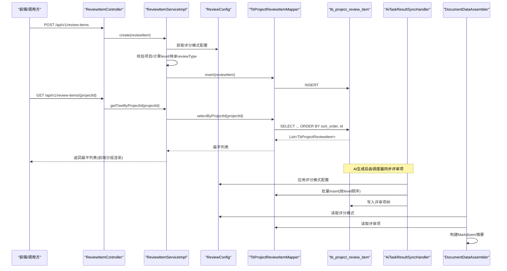
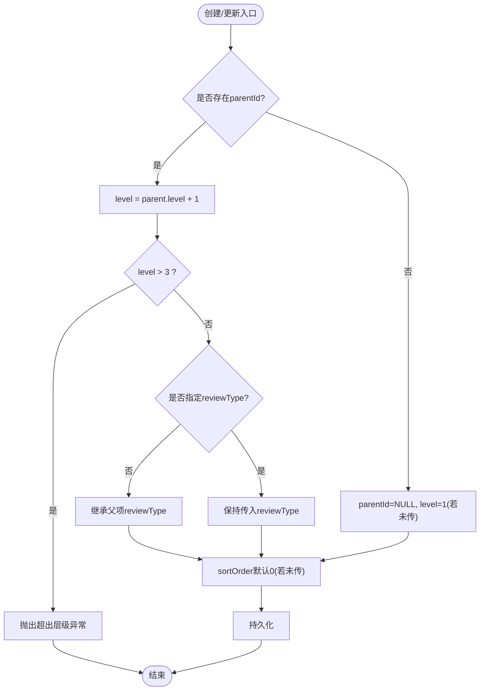
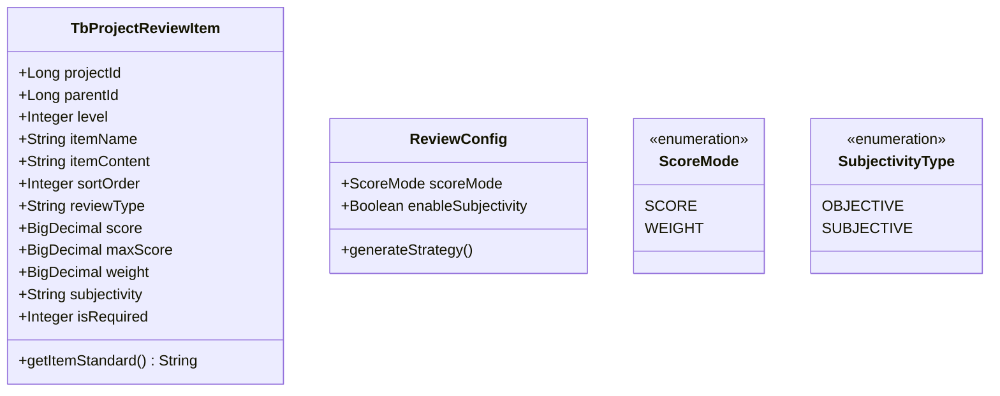
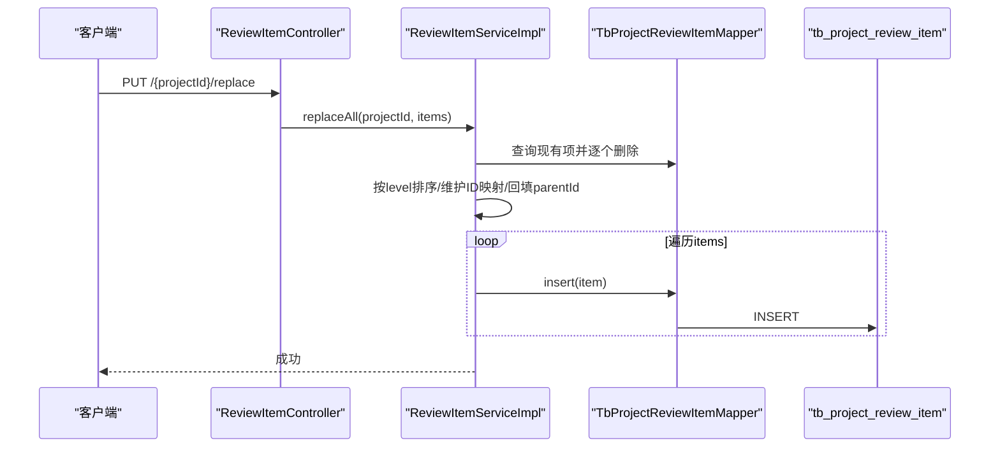
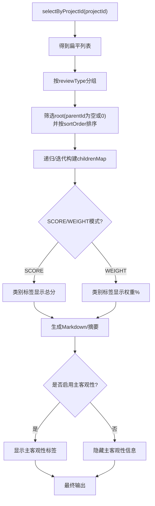
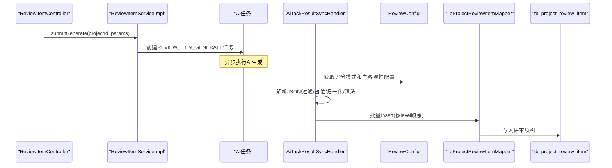
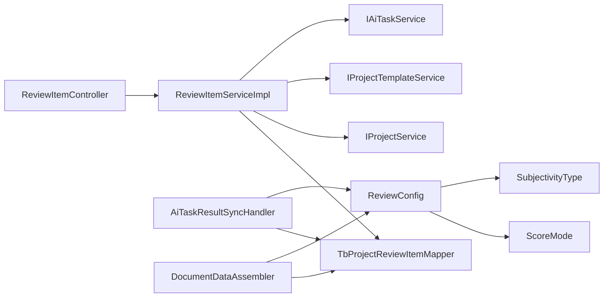

# 评审项实体(TbProjectReviewItem)

<cite>
**本文引用的文件**   
- [TbProjectReviewItem.java](file://ele-ai-tender-system/ele-ai-tender-common/src/main/java/com/jy/eleaitender/common/entity/core/TbProjectReviewItem.java)
- [init.sql](file://ele-ai-tender-system/ele-ai-tender-core/sql/init.sql)
- [TbProjectReviewItemMapper.java](file://ele-ai-tender-system/ele-ai-tender-core/src/main/java/com/jy/eleaitender/core/mapper/TbProjectReviewItemMapper.java)
- [ReviewItemServiceImpl.java](file://ele-ai-tender-system/ele-ai-tender-core/src/main/java/com/jy/eleaitender/core/service/impl/ReviewItemServiceImpl.java)
- [ReviewItemController.java](file://ele-ai-tender-system/ele-ai-tender-core/src/main/java/com/jy/eleaitender/core/controller/ReviewItemController.java)
- [AiTaskResultSyncHandler.java](file://ele-ai-tender-system/ele-ai-tender-core/src/main/java/com/jy/eleaitender/core/scheduler/AiTaskResultSyncHandler.java)
- [DocumentDataAssembler.java](file://ele-ai-tender-system/ele-ai-tender-core/src/main/java/com/jy/eleaitender/core/engine/DocumentDataAssembler.java)
- [BaseEntity.java](file://ele-ai-tender-system/ele-ai-tender-common/src/main/java/com/jy/eleaitender/common/entity/base/BaseEntity.java)
- [ReviewConfig.java](file://ele-ai-tender-system/ele-ai-tender-common/src/main/java/com/jy/eleaitender/common/dto/ReviewConfig.java)
- [ScoreMode.java](file://ele-ai-tender-system/ele-ai-tender-common/src/main/java/com/jy/eleaitender/common/enums/ScoreMode.java)
- [SubjectivityType.java](file://ele-ai-tender-system/ele-ai-tender-common/src/main/java/com/jy/eleaitender/common/enums/SubjectivityType.java)
</cite>

## 更新摘要
**变更内容**   
- 新增评分模式支持（SCORE和WEIGHT）的详细说明
- 增强主客观性区分功能，新增subjectivity字段的设计原理
- ReviewConfig类支持不同生成策略的配置说明
- 数据库表tb_project_review_item中subjectivity字段的实现细节

## 目录
1. [简介](#简介)
2. [项目结构](#项目结构)
3. [核心组件](#核心组件)
4. [架构总览](#架构总览)
5. [详细组件分析](#详细组件分析)
6. [依赖关系分析](#依赖关系分析)
7. [性能考虑](#性能考虑)
8. [故障排查指南](#故障排查指南)
9. [结论](#结论)
10. [附录](#附录)

## 简介
本文件围绕评审项实体 TbProjectReviewItem，系统化阐述其数据模型与业务设计。重点包括：
- 三级嵌套树形结构设计（parent_id 自引用、level 层级标识、sort_order 排序）
- 评审类型（COMPLIANCE/TECHNICAL/CREDIT/COMMERCIAL）、评分体系（score/max_score/weight）与主客观性（subjectivity）的设计原理
- **新增**：评分模式支持（SCORE和WEIGHT）的详细实现机制
- **新增**：主客观性区分功能的完整配置与处理流程
- 必审项标记（is_required）的业务逻辑与验证规则
- 树形结构的 CRUD 实现、层级关系查询与性能优化策略
- 递归查询示例、树形数据组装方法与批量操作最佳实践
- 索引优化建议与复杂业务场景的 SQL 实现思路

## 项目结构
评审项相关代码分布在通用实体层、核心服务层、控制器层、调度器与文档装配器等模块中，形成"实体定义 → 持久化映射 → 服务编排 → 控制器暴露 → 异步生成与汇总"的完整链路。

图表来源
- [TbProjectReviewItem.java:1-67](file://ele-ai-tender-system/ele-ai-tender-common/src/main/java/com/jy/eleaitender/common/entity/core/TbProjectReviewItem.java#L1-L67)
- [init.sql:150-181](file://ele-ai-tender-system/ele-ai-tender-core/sql/init.sql#L150-L181)
- [TbProjectReviewItemMapper.java:1-23](file://ele-ai-tender-system/ele-ai-tender-core/src/main/java/com/jy/eleaitender/core/mapper/TbProjectReviewItemMapper.java#L1-L23)
- [ReviewItemServiceImpl.java:1-276](file://ele-ai-tender-system/ele-ai-tender-core/src/main/java/com/jy/eleaitender/core/service/impl/ReviewItemServiceImpl.java#L1-L276)
- [ReviewItemController.java:1-90](file://ele-ai-tender-system/ele-ai-tender-core/src/main/java/com/jy/eleaitender/core/controller/ReviewItemController.java#L1-L90)
- [AiTaskResultSyncHandler.java:180-299](file://ele-ai-tender-system/ele-ai-tender-core/src/main/java/com/jy/eleaitender/core/scheduler/AiTaskResultSyncHandler.java#L180-L299)
- [DocumentDataAssembler.java:132-214](file://ele-ai-tender-system/ele-ai-tender-core/src/main/java/com/jy/eleaitender/core/engine/DocumentDataAssembler.java#L132-L214)
- [ReviewConfig.java:1-100](file://ele-ai-tender-system/ele-ai-tender-common/src/main/java/com/jy/eleaitender/common/dto/ReviewConfig.java#L1-L100)
- [ScoreMode.java:1-50](file://ele-ai-tender-system/ele-ai-tender-common/src/main/java/com/jy/eleaitender/common/enums/ScoreMode.java#L1-L50)
- [SubjectivityType.java:1-50](file://ele-ai-tender-system/ele-ai-tender-common/src/main/java/com/jy/eleaitender/common/enums/SubjectivityType.java#L1-L50)

章节来源
- [TbProjectReviewItem.java:1-67](file://ele-ai-tender-system/ele-ai-tender-common/src/main/java/com/jy/eleaitender/common/entity/core/TbProjectReviewItem.java#L1-L67)
- [init.sql:150-181](file://ele-ai-tender-system/ele-ai-tender-core/sql/init.sql#L150-L181)
- [TbProjectReviewItemMapper.java:1-23](file://ele-ai-tender-system/ele-ai-tender-core/src/main/java/com/jy/eleaitender/core/mapper/TbProjectReviewItemMapper.java#L1-L23)
- [ReviewItemServiceImpl.java:1-276](file://ele-ai-tender-system/ele-ai-tender-core/src/main/java/com/jy/eleaitender/core/service/impl/ReviewItemServiceImpl.java#L1-L276)
- [ReviewItemController.java:1-90](file://ele-ai-tender-system/ele-ai-tender-core/src/main/java/com/jy/eleaitender/core/controller/ReviewItemController.java#L1-L90)
- [AiTaskResultSyncHandler.java:180-299](file://ele-ai-tender-system/ele-ai-tender-core/src/main/java/com/jy/eleaitender/core/scheduler/AiTaskResultSyncHandler.java#L180-L299)
- [DocumentDataAssembler.java:132-214](file://ele-ai-tender-system/ele-ai-tender-core/src/main/java/com/jy/eleaitender/core/engine/DocumentDataAssembler.java#L132-L214)

## 核心组件
- 实体与基类
  - TbProjectReviewItem：评审项领域模型，包含项目归属、父子关系、层级、名称内容、排序、评审类型、分值权重、**新增**主客观性(subjectivity)与必审标记等字段，并提供便捷方法用于标准文本拼装。
  - BaseEntity：提供通用审计字段、乐观锁与逻辑删除能力。
- 数据访问
  - TbProjectReviewItemMapper：基于 MyBatis 的自定义查询，按项目维度获取评审项列表并排序。
- 服务与控制
  - ReviewItemServiceImpl：封装评审项的创建、更新、删除、批量操作、全量替换、AI 任务提交等核心流程；负责层级校验、父级继承、排序默认值、级联删除等。
  - ReviewItemController：对外暴露 REST API，统一鉴权与参数绑定。
- 异步生成与汇总
  - AiTaskResultSyncHandler：解析 AI 生成的评审项 JSON，结合配置进行占位节点插入、分数归一化、**新增**主观性清洗、父子关系回填与落库。
  - DocumentDataAssembler：将评审项树组装为文档摘要或合规清单，支持**新增**权重模式与分数模式的标签展示。
- **新增**：配置管理
  - ReviewConfig：评审配置类，支持不同的评分模式和主客观性配置策略。
  - ScoreMode：评分模式枚举，定义SCORE和WEIGHT两种模式。
  - SubjectivityType：主客观性类型枚举，定义OBJECTIVE和SUBJECTIVE两种类型。

章节来源
- [TbProjectReviewItem.java:1-67](file://ele-ai-tender-system/ele-ai-tender-common/src/main/java/com/jy/eleaitender/common/entity/core/TbProjectReviewItem.java#L1-L67)
- [BaseEntity.java:13-73](file://ele-ai-tender-system/ele-ai-tender-common/src/main/java/com/jy/eleaitender/common/entity/base/BaseEntity.java#L13-L73)
- [TbProjectReviewItemMapper.java:1-23](file://ele-ai-tender-system/ele-ai-tender-core/src/main/java/com/jy/eleaitender/core/mapper/TbProjectReviewItemMapper.java#L1-L23)
- [ReviewItemServiceImpl.java:50-121](file://ele-ai-tender-system/ele-ai-tender-core/src/main/java/com/jy/eleaitender/core/service/impl/ReviewItemServiceImpl.java#L50-L121)
- [ReviewItemController.java:27-88](file://ele-ai-tender-system/ele-ai-tender-core/src/main/java/com/jy/eleaitender/core/controller/ReviewItemController.java#L27-L88)
- [AiTaskResultSyncHandler.java:180-299](file://ele-ai-tender-system/ele-ai-tender-core/src/main/java/com/jy/eleaitender/core/scheduler/AiTaskResultSyncHandler.java#L180-L299)
- [DocumentDataAssembler.java:132-214](file://ele-ai-tender-system/ele-ai-tender-core/src/main/java/com/jy/eleaitender/core/engine/DocumentDataAssembler.java#L132-L214)
- [ReviewConfig.java:1-100](file://ele-ai-tender-system/ele-ai-tender-common/src/main/java/com/jy/eleaitender/common/dto/ReviewConfig.java#L1-L100)
- [ScoreMode.java:1-50](file://ele-ai-tender-system/ele-ai-tender-common/src/main/java/com/jy/eleaitender/common/enums/ScoreMode.java#L1-L50)
- [SubjectivityType.java:1-50](file://ele-ai-tender-system/ele-ai-tender-common/src/main/java/com/jy/eleaitender/common/enums/SubjectivityType.java#L1-L50)

## 架构总览
评审项从"前端/外部系统调用"到"数据库落库"，再到"文档输出"的整体流程如下：

图表来源
- [ReviewItemController.java:27-39](file://ele-ai-tender-system/ele-ai-tender-core/src/main/java/com/jy/eleaitender/core/controller/ReviewItemController.java#L27-L39)
- [ReviewItemServiceImpl.java:57-91](file://ele-ai-tender-system/ele-ai-tender-core/src/main/java/com/jy/eleaitender/core/service/impl/ReviewItemServiceImpl.java#L57-L91)
- [TbProjectReviewItemMapper.java:20-21](file://ele-ai-tender-system/ele-ai-tender-core/src/main/java/com/jy/eleaitender/core/mapper/TbProjectReviewItemMapper.java#L20-L21)
- [AiTaskResultSyncHandler.java:180-299](file://ele-ai-tender-system/ele-ai-tender-core/src/main/java/com/jy/eleaitender/core/scheduler/AiTaskResultSyncHandler.java#L180-L299)
- [DocumentDataAssembler.java:132-214](file://ele-ai-tender-system/ele-ai-tender-core/src/main/java/com/jy/eleaitender/core/engine/DocumentDataAssembler.java#L132-L214)
- [ReviewConfig.java:1-100](file://ele-ai-tender-system/ele-ai-tender-common/src/main/java/com/jy/eleaitender/common/dto/ReviewConfig.java#L1-L100)

## 详细组件分析

### 数据模型与字段语义
- 树形结构
  - parent_id：自引用外键，NULL 表示顶级节点
  - level：层级标识，取值 1/2/3，限制最大深度为 3
  - sort_order：同级排序号，未设置时默认 0
- 分类与内容
  - review_type：评审类型，枚举值 COMPLIANCE/TECHNICAL/CREDIT/COMMERCIAL
  - item_name/item_content：评审项名称与内容，提供组合方法用于标准文本输出
- 评分与权重
  - score：评审分值
  - max_score：满分值（商务评审专用）
  - weight：权重百分比（一级节点常用）
- **新增**：主客观性与必审
  - subjectivity：**新增**主客观性标识，枚举值 OBJECTIVE/SUBJECTIVE，可按配置决定是否区分
  - is_required：是否必审项（0-否/1-是），用于校验与提示
- 审计与并发控制
  - 继承 BaseEntity：create_time/create_id/create_name、modify_time/modify_id/modify_name、ver（乐观锁）、is_delete（逻辑删除）

**更新**：新增了subjectivity字段，用于区分评审项的主客观性，支持更精细化的评审配置。

章节来源
- [TbProjectReviewItem.java:22-66](file://ele-ai-tender-system/ele-ai-tender-common/src/main/java/com/jy/eleaitender/common/entity/core/TbProjectReviewItem.java#L22-L66)
- [BaseEntity.java:13-73](file://ele-ai-tender-system/ele-ai-tender-common/src/main/java/com/jy/eleaitender/common/entity/base/BaseEntity.java#L13-L73)
- [init.sql:155-181](file://ele-ai-tender-system/ele-ai-tender-core/sql/init.sql#L155-L181)
- [SubjectivityType.java:1-50](file://ele-ai-tender-system/ele-ai-tender-common/src/main/java/com/jy/eleaitender/common/enums/SubjectivityType.java#L1-L50)

### 树形结构与层级约束
- 层级计算与继承
  - 创建子项时根据 parentId 自动计算 level=parent.level+1，且禁止超过 3 级
  - 子项若未显式指定 review_type，则继承父项的 review_type
- 排序机制
  - 查询时按 sort_order ASC, id ASC 保证稳定顺序
  - 批量/全量替换时按 level 升序插入，确保父先于子
- 级联删除
  - 删除节点时递归删除所有子孙节点，避免悬挂数据

图表来源
- [ReviewItemServiceImpl.java:57-91](file://ele-ai-tender-system/ele-ai-tender-core/src/main/java/com/jy/eleaitender/core/service/impl/ReviewItemServiceImpl.java#L57-L91)
- [ReviewItemServiceImpl.java:126-135](file://ele-ai-tender-system/ele-ai-tender-core/src/main/java/com/jy/eleaitender/core/service/impl/ReviewItemServiceImpl.java#L126-L135)
- [TbProjectReviewItemMapper.java:20-21](file://ele-ai-tender-system/ele-ai-tender-core/src/main/java/com/jy/eleaitender/core/mapper/TbProjectReviewItemMapper.java#L20-L21)

章节来源
- [ReviewItemServiceImpl.java:57-91](file://ele-ai-tender-system/ele-ai-tender-core/src/main/java/com/jy/eleaitender/core/service/impl/ReviewItemServiceImpl.java#L57-L91)
- [ReviewItemServiceImpl.java:126-135](file://ele-ai-tender-system/ele-ai-tender-core/src/main/java/com/jy/eleaitender/core/service/impl/ReviewItemServiceImpl.java#L126-L135)
- [TbProjectReviewItemMapper.java:20-21](file://ele-ai-tender-system/ele-ai-tender-core/src/main/java/com/jy/eleaitender/core/mapper/TbProjectReviewItemMapper.java#L20-L21)

### 评审类型与评分体系设计
- 评审类型
  - 四种类型：合规(COMPLIANCE)、技术(TECHNICAL)、资信(CREDIT)、商务(COMMERCIAL)
  - 在 AI 生成阶段，会将类别名映射为 review_type，并在配置驱动下启用/禁用某些类型
- **新增**：评分模式与权重
  - SCORE 模式：以叶子节点 score 累加作为类别总分；当存在手动打分项时，AI 生成项的分数会按比例缩放至剩余目标分
  - WEIGHT 模式：一级节点携带 weight%，用于展示权重占比；类别标签显示"权重X%"
  - max_score 主要用于商务评审场景，配合 score 使用
- **新增**：主客观性区分
  - subjectivity 可区分 OBJECTIVE/SUBJECTIVE；若配置关闭区分，则在落库前清空该字段
  - 支持通过ReviewConfig配置是否启用主客观性区分功能

**更新**：新增了评分模式支持和主客观性区分功能，通过ReviewConfig类统一管理配置策略。

图表来源
- [TbProjectReviewItem.java:22-66](file://ele-ai-tender-system/ele-ai-tender-common/src/main/java/com/jy/eleaitender/common/entity/core/TbProjectReviewItem.java#L22-L66)
- [ReviewConfig.java:1-100](file://ele-ai-tender-system/ele-ai-tender-common/src/main/java/com/jy/eleaitender/common/dto/ReviewConfig.java#L1-L100)
- [ScoreMode.java:1-50](file://ele-ai-tender-system/ele-ai-tender-common/src/main/java/com/jy/eleaitender/common/enums/ScoreMode.java#L1-L50)
- [SubjectivityType.java:1-50](file://ele-ai-tender-system/ele-ai-tender-common/src/main/java/com/jy/eleaitender/common/enums/SubjectivityType.java#L1-L50)

章节来源
- [AiTaskResultSyncHandler.java:180-299](file://ele-ai-tender-system/ele-ai-tender-core/src/main/java/com/jy/eleaitender/core/scheduler/AiTaskResultSyncHandler.java#L180-L299)
- [AiTaskResultSyncHandler.java:329-373](file://ele-ai-tender-system/ele-ai-tender-core/src/main/java/com/jy/eleaitender/core/scheduler/AiTaskResultSyncHandler.java#L329-L373)
- [DocumentDataAssembler.java:170-214](file://ele-ai-tender-system/ele-ai-tender-core/src/main/java/com/jy/eleaitender/core/engine/DocumentDataAssembler.java#L170-214)
- [ReviewConfig.java:1-100](file://ele-ai-tender-system/ele-ai-tender-common/src/main/java/com/jy/eleaitender/common/dto/ReviewConfig.java#L1-L100)

### 必审项标记(is_required)的业务逻辑与验证
- 业务含义
  - is_required=1 表示该评审项为必审项，常用于强制检查点或关键指标
- 数据来源
  - 可由模板配置或 AI 生成结果中的 isRequired 字段映射而来
- 验证与提示
  - 在服务层与调度器中，对 isRequired 进行保留或默认填充；前端可根据该标记进行强提示或阻断
- 注意
  - 当前服务层未对 is_required 做一致性校验（如"至少一个必审项"），可在上层扩展校验

章节来源
- [AiTaskResultSyncHandler.java:481-507](file://ele-ai-tender-system/ele-ai-tender-core/src/main/java/com/jy/eleaitender/core/scheduler/AiTaskResultSyncHandler.java#L481-L507)
- [AiTaskResultSyncHandler.java:301-327](file://ele-ai-tender-system/ele-ai-tender-core/src/main/java/com/jy/eleaitender/core/scheduler/AiTaskResultSyncHandler.java#L301-L327)

### 树形结构的 CRUD 与批量操作
- 创建(create)
  - 校验项目归属；根据 parentId 计算 level 并继承 review_type；默认排序号为 0
- 更新(update)
  - 校验记录存在与项目归属后更新
- 删除(deleteById)
  - 校验存在与项目归属；递归删除所有子项后再删除自身
- 批量创建(batchCreate)
  - 校验项目归属；逐项插入，缺失 sortOrder 时默认 0
- 批量更新(batchUpdate)
  - 逐条校验存在与项目归属后更新
- 全量替换(replaceAll)
  - 先删除该项目下全部评审项；按 level 升序重建；维护临时 ID 映射以回填真实 parentId；再次校验 level≤3

图表来源
- [ReviewItemController.java:81-88](file://ele-ai-tender-system/ele-ai-tender-core/src/main/java/com/jy/eleaitender/core/controller/ReviewItemController.java#L81-L88)
- [ReviewItemServiceImpl.java:211-274](file://ele-ai-tender-system/ele-ai-tender-core/src/main/java/com/jy/eleaitender/core/service/impl/ReviewItemServiceImpl.java#L211-L274)

章节来源
- [ReviewItemServiceImpl.java:57-121](file://ele-ai-tender-system/ele-ai-tender-core/src/main/java/com/jy/eleaitender/core/service/impl/ReviewItemServiceImpl.java#L57-L121)
- [ReviewItemServiceImpl.java:172-209](file://ele-ai-tender-system/ele-ai-tender-core/src/main/java/com/jy/eleaitender/core/service/impl/ReviewItemServiceImpl.java#L172-L209)
- [ReviewItemServiceImpl.java:211-274](file://ele-ai-tender-system/ele-ai-tender-core/src/main/java/com/jy/eleaitender/core/service/impl/ReviewItemServiceImpl.java#L211-L274)

### 层级关系查询与树形数据组装
- 查询接口
  - 通过项目 ID 获取扁平列表，按 sort_order 与 id 排序，便于前端按 review_type 分组渲染
- 文档组装
  - 将评审项树转换为 Markdown 或摘要列表；支持**新增**权重模式与分数模式下的不同标签展示
  - 对于合规清单，跳过一级根节点，直接输出二级与三级项

**更新**：新增了主客观性显示的逻辑判断，根据配置决定是否显示主客观性标签。

图表来源
- [TbProjectReviewItemMapper.java:20-21](file://ele-ai-tender-system/ele-ai-tender-core/src/main/java/com/jy/eleaitender/core/mapper/TbProjectReviewItemMapper.java#L20-L21)
- [DocumentDataAssembler.java:132-214](file://ele-ai-tender-system/ele-ai-tender-core/src/main/java/com/jy/eleaitender/core/engine/DocumentDataAssembler.java#L132-L214)
- [ReviewConfig.java:1-100](file://ele-ai-tender-system/ele-ai-tender-common/src/main/java/com/jy/eleaitender/common/dto/ReviewConfig.java#L1-L100)

章节来源
- [ReviewItemServiceImpl.java:50-55](file://ele-ai-tender-system/ele-ai-tender-core/src/main/java/com/jy/eleaitender/core/service/impl/ReviewItemServiceImpl.java#L50-L55)
- [DocumentDataAssembler.java:132-214](file://ele-ai-tender-system/ele-ai-tender-core/src/main/java/com/jy/eleaitender/core/engine/DocumentDataAssembler.java#L132-L214)

### AI 生成与同步流程
- 触发方式
  - 通过控制器提交生成任务，服务层构造参数并创建异步任务
- 同步处理
  - 调度器解析 AI 返回的 JSON，按配置过滤未启用类型、插入占位节点、归一化分数、**新增**清理主观性字段
  - 按 level 排序后批量插入，同时回填父子关系与审计信息

**更新**：新增了ReviewConfig配置的应用，在AI生成同步过程中会根据配置处理评分模式和主客观性字段。

图表来源
- [ReviewItemController.java:57-63](file://ele-ai-tender-system/ele-ai-tender-core/src/main/java/com/jy/eleaitender/core/controller/ReviewItemController.java#L57-L63)
- [ReviewItemServiceImpl.java:138-170](file://ele-ai-tender-system/ele-ai-tender-core/src/main/java/com/jy/eleaitender/core/service/impl/ReviewItemServiceImpl.java#L138-L170)
- [AiTaskResultSyncHandler.java:180-299](file://ele-ai-tender-system/ele-ai-tender-core/src/main/java/com/jy/eleaitender/core/scheduler/AiTaskResultSyncHandler.java#L180-L299)
- [ReviewConfig.java:1-100](file://ele-ai-tender-system/ele-ai-tender-common/src/main/java/com/jy/eleaitender/common/dto/ReviewConfig.java#L1-L100)

章节来源
- [ReviewItemServiceImpl.java:138-170](file://ele-ai-tender-system/ele-ai-tender-core/src/main/java/com/jy/eleaitender/core/service/impl/ReviewItemServiceImpl.java#L138-L170)
- [AiTaskResultSyncHandler.java:180-299](file://ele-ai-tender-system/ele-ai-tender-core/src/main/java/com/jy/eleaitender/core/scheduler/AiTaskResultSyncHandler.java#L180-L299)

## 依赖关系分析
- 组件耦合
  - Controller 仅依赖 Service 接口，职责单一
  - Service 依赖 Mapper 与外部服务（项目、模板、AI任务）
  - 调度器与文档装配器均依赖 Mapper 读取评审项数据
- 外部依赖
  - 项目服务 IProjectService：用于权限与归属校验
  - 模板服务 IProjectTemplateService：读取评审项配置
  - AI任务服务 IAiTaskService：创建与回调处理
- **新增**：配置依赖
  - ReviewConfig：统一管理评分模式和主客观性配置
  - ScoreMode和SubjectivityType：枚举类型定义

**更新**：新增了ReviewConfig及其相关枚举类型的依赖关系。

图表来源
- [ReviewItemController.java:1-90](file://ele-ai-tender-system/ele-ai-tender-core/src/main/java/com/jy/eleaitender/core/controller/ReviewItemController.java#L1-L90)
- [ReviewItemServiceImpl.java:1-48](file://ele-ai-tender-system/ele-ai-tender-core/src/main/java/com/jy/eleaitender/core/service/impl/ReviewItemServiceImpl.java#L1-L48)
- [TbProjectReviewItemMapper.java:1-23](file://ele-ai-tender-system/ele-ai-tender-core/src/main/java/com/jy/eleaitender/core/mapper/TbProjectReviewItemMapper.java#L1-L23)
- [AiTaskResultSyncHandler.java:180-299](file://ele-ai-tender-system/ele-ai-tender-core/src/main/java/com/jy/eleaitender/core/scheduler/AiTaskResultSyncHandler.java#L180-L299)
- [DocumentDataAssembler.java:132-214](file://ele-ai-tender-system/ele-ai-tender-core/src/main/java/com/jy/eleaitender/core/engine/DocumentDataAssembler.java#L132-L214)
- [ReviewConfig.java:1-100](file://ele-ai-tender-system/ele-ai-tender-common/src/main/java/com/jy/eleaitender/common/dto/ReviewConfig.java#L1-L100)

章节来源
- [ReviewItemServiceImpl.java:1-48](file://ele-ai-tender-system/ele-ai-tender-core/src/main/java/com/jy/eleaitender/core/service/impl/ReviewItemServiceImpl.java#L1-L48)
- [TbProjectReviewItemMapper.java:1-23](file://ele-ai-tender-system/ele-ai-tender-core/src/main/java/com/jy/eleaitender/core/mapper/TbProjectReviewItemMapper.java#L1-L23)

## 性能考虑
- 查询优化
  - 已建立 project_id、parent_id、review_type 索引；查询按 sort_order, id 排序，适合前端分组渲染
- 插入优化
  - 批量插入时按 level 升序，减少父子关系回填失败风险
- 递归删除
  - 采用递归查询与删除，建议在大数据量场景评估级联删除成本，必要时引入软删除或批处理
- 文档组装
  - 通过 childrenMap 一次扫描完成树构建，时间复杂度 O(n)，空间复杂度 O(n)
- **新增**：配置缓存
  - ReviewConfig配置建议在应用启动时加载并缓存，避免频繁读取配置

[本节为通用性能指导，不直接分析具体文件]

## 故障排查指南
- 常见错误码
  - REVIEW_ITEM_NOT_FOUND：更新/删除时记录不存在
  - REVIEW_ITEM_MAX_LEVEL_EXCEEDED：层级超过 3
- 定位步骤
  - 确认项目归属校验是否通过（projectService.getById）
  - 检查 level 计算与继承逻辑是否符合预期
  - 核对 sort_order 与排序结果是否一致
  - 查看 AI 生成结果 JSON 结构是否与解析逻辑匹配
  - **新增**：检查ReviewConfig配置是否正确加载和应用
- 日志与断点
  - 关注服务层与调度器的关键日志输出，确认插入数量与父子关系回填情况
  - **新增**：检查评分模式和主客观性配置的处理日志

章节来源
- [ReviewItemServiceImpl.java:93-121](file://ele-ai-tender-system/ele-ai-tender-core/src/main/java/com/jy/eleaitender/core/service/impl/ReviewItemServiceImpl.java#L93-L121)
- [ReviewItemServiceImpl.java:211-274](file://ele-ai-tender-system/ele-ai-tender-core/src/main/java/com/jy/eleaitender/core/service/impl/ReviewItemServiceImpl.java#L211-L274)
- [AiTaskResultSyncHandler.java:180-299](file://ele-ai-tender-system/ele-ai-tender-core/src/main/java/com/jy/eleaitender/core/scheduler/AiTaskResultSyncHandler.java#L180-L299)
- [ReviewConfig.java:1-100](file://ele-ai-tender-system/ele-ai-tender-common/src/main/java/com/jy/eleaitender/common/dto/ReviewConfig.java#L1-L100)

## 结论
TbProjectReviewItem 采用简洁而稳健的自引用树形结构，配合 level、sort_order 与 review_type 的组合，既能满足多级评审项的组织需求，又能支撑多种评分模式与主客观性区分。**新增的评分模式支持（SCORE和WEIGHT）和主客观性区分功能**进一步增强了系统的灵活性和配置能力。服务层在创建、更新、删除与批量操作中实现了严格的层级与归属校验，调度器与文档装配器进一步增强了自动化与可读性。通过合理的索引设计与批量/全量替换策略，系统在易用性与性能之间取得良好平衡。

[本节为总结性内容，不直接分析具体文件]

## 附录

### 索引优化建议
- 已有索引
  - idx_project(project_id)
  - idx_parent(parent_id)
  - idx_review_type(review_type)
- 建议补充
  - 复合索引 (project_id, level)：加速按项目与层级筛选
  - 复合索引 (project_id, review_type, sort_order)：加速按类型与排序的查询
  - 复合索引 (project_id, is_required)：加速必审项统计与校验
  - **新增**：复合索引 (project_id, subjectivity)：加速按主客观性筛选

章节来源
- [init.sql:177-181](file://ele-ai-tender-system/ele-ai-tender-core/sql/init.sql#L177-L181)

### 复杂业务场景的 SQL 实现思路
- 递归查询（MySQL 8.0+）
  - 使用 WITH RECURSIVE 自连接，从 root 开始向下展开整棵树
- 必审项统计
  - 按项目与评审类型聚合 is_required=1 的数量，辅助前端提示
- 分数归一化
  - 在应用层计算目标分与比例分配，避免在 SQL 中进行复杂浮点运算
- **新增**：主客观性统计
  - 按项目与评审类型聚合 subjectivity 字段，支持主客观性分布分析

[本节为概念性说明，不直接分析具体文件]

### 评分模式配置详解
- SCORE模式特点
  - 适用于需要精确分数控制的评审场景
  - 支持手动打分与AI生成分数的混合模式
  - 自动进行分数归一化处理
- WEIGHT模式特点
  - 适用于强调权重分配的评审场景
  - 一级节点携带权重百分比信息
  - 便于展示各类别的权重占比
- 主客观性配置
  - 可通过ReviewConfig.enableSubjectivity控制是否启用
  - 启用时支持OBJECTIVE和SUBJECTIVE两种类型
  - 关闭时自动清空subjectivity字段

章节来源
- [ReviewConfig.java:1-100](file://ele-ai-tender-system/ele-ai-tender-common/src/main/java/com/jy/eleaitender/common/dto/ReviewConfig.java#L1-L100)
- [ScoreMode.java:1-50](file://ele-ai-tender-system/ele-ai-tender-common/src/main/java/com/jy/eleaitender/common/enums/ScoreMode.java#L1-L50)
- [SubjectivityType.java:1-50](file://ele-ai-tender-system/ele-ai-tender-common/src/main/java/com/jy/eleaitender/common/enums/SubjectivityType.java#L1-L50)