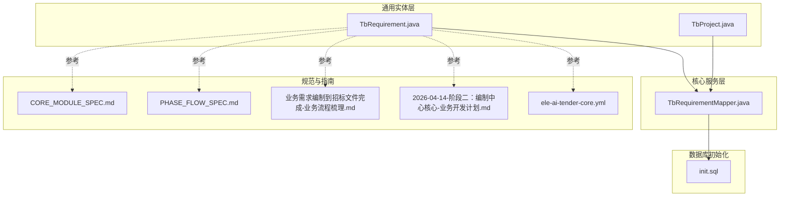
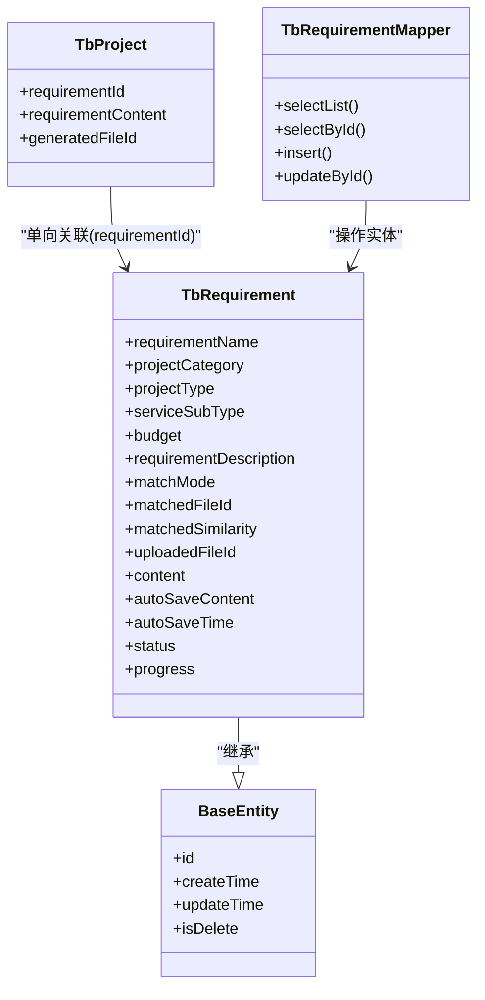
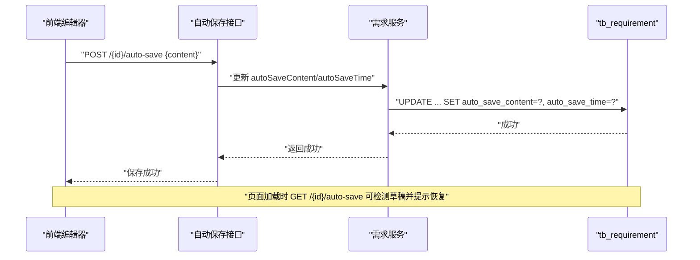
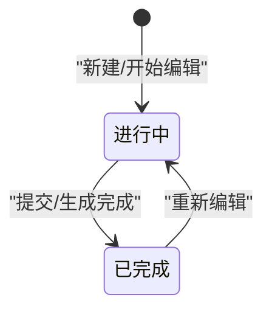
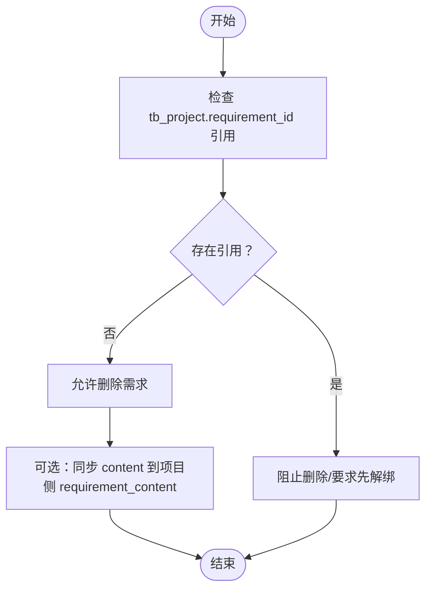
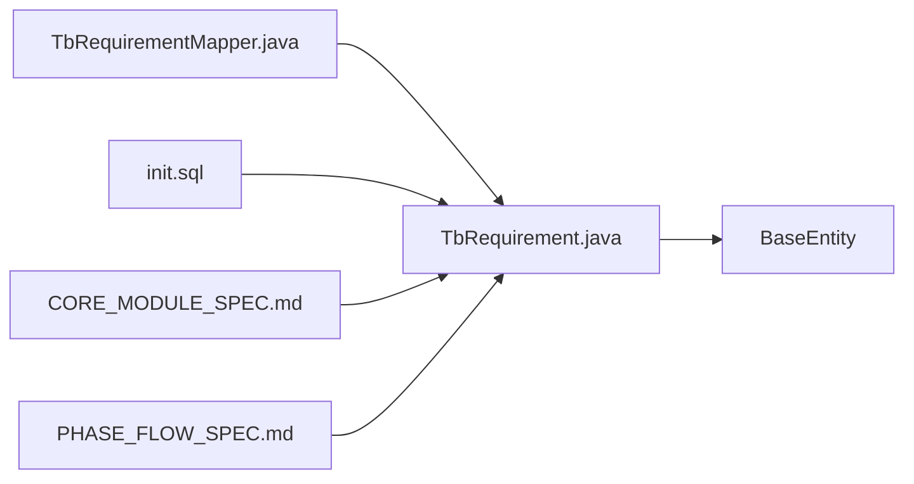

# 需求实体(TbRequirement)

<cite>
**本文引用的文件**
- [TbRequirement.java](file://ele-ai-tender-system/ele-ai-tender-common/src/main/java/com/jy/eleaitender/common/entity/core/TbRequirement.java)
- [TbProject.java](file://ele-ai-tender-system/ele-ai-tender-common/src/main/java/com/jy/eleaitender/common/entity/core/TbProject.java)
- [TbRequirementMapper.java](file://ele-ai-tender-system/ele-ai-tender-core/src/main/java/com/jy/eleaitender/core/mapper/TbRequirementMapper.java)
- [init.sql](file://ele-ai-tender-system/ele-ai-tender-core/sql/init.sql)
- [CORE_MODULE_SPEC.md](file://docs/rules/CORE_MODULE_SPEC.md)
- [PHASE_FLOW_SPEC.md](file://docs/rules/PHASE_FLOW_SPEC.md)
- [业务需求编制到招标文件完成-业务流程梳理.md](file://docs/guides/业务需求编制到招标文件完成-业务流程梳理.md)
- [2026-04-14-阶段二：编制中心核心-业务开发计划.md](file://docs/plans/2026-04-14-阶段二：编制中心核心-业务开发计划.md)
- [ele-ai-tender-core.yml](file://docs/guides/ele-ai-tender-core.yml)
</cite>

## 目录
1. [引言](#引言)
2. [项目结构](#项目结构)
3. [核心组件](#核心组件)
4. [架构总览](#架构总览)
5. [详细组件分析](#详细组件分析)
6. [依赖关系分析](#依赖关系分析)
7. [性能考虑](#性能考虑)
8. [故障排查指南](#故障排查指南)
9. [结论](#结论)
10. [附录](#附录)

## 引言
本文件围绕需求实体 TbRequirement 的数据模型进行系统化说明，覆盖字段设计、自动保存机制、状态与进度管理、与项目的关联关系及数据同步策略，并提供 MyBatis Plus 映射配置要点、复杂查询构建示例、索引与完整性约束建议以及常见查询场景的 SQL 实现。目标是帮助开发者快速理解并正确使用该实体，确保在需求编辑、草稿恢复、AI 生成与提交等流程中保持一致性与高性能。

## 项目结构
TbRequirement 属于通用实体层（common），由 core 模块通过 Mapper 访问；数据库初始化脚本位于 core 模块的 sql 目录；相关规范与接口约定见 docs 下的规则与指南文档。

图表来源
- [TbRequirement.java:1-67](file://ele-ai-tender-system/ele-ai-tender-common/src/main/java/com/jy/eleaitender/common/entity/core/TbRequirement.java#L1-L67)
- [TbProject.java:1-100](file://ele-ai-tender-system/ele-ai-tender-common/src/main/java/com/jy/eleaitender/common/entity/core/TbProject.java#L1-L100)
- [TbRequirementMapper.java:1-15](file://ele-ai-tender-system/ele-ai-tender-core/src/main/java/com/jy/eleaitender/core/mapper/TbRequirementMapper.java#L1-L15)
- [init.sql:100-110](file://ele-ai-tender-system/ele-ai-tender-core/sql/init.sql#L100-L110)
- [CORE_MODULE_SPEC.md:140-150](file://docs/rules/CORE_MODULE_SPEC.md#L140-L150)
- [PHASE_FLOW_SPEC.md:100-120](file://docs/rules/PHASE_FLOW_SPEC.md#L100-L120)
- [业务需求编制到招标文件完成-业务流程梳理.md:280-310](file://docs/guides/业务需求编制到招标文件完成-业务流程梳理.md#L280-L310)
- [2026-04-14-阶段二：编制中心核心-业务开发计划.md:700-740](file://docs/plans/2026-04-14-阶段二：编制中心核心-业务开发计划.md#L700-L740)
- [ele-ai-tender-core.yml:580-600](file://docs/guides/ele-ai-tender-core.yml#L580-L600)

章节来源
- [TbRequirement.java:1-67](file://ele-ai-tender-system/ele-ai-tender-common/src/main/java/com/jy/eleaitender/common/entity/core/TbRequirement.java#L1-L67)
- [TbProject.java:1-100](file://ele-ai-tender-system/ele-ai-tender-common/src/main/java/com/jy/eleaitender/common/entity/core/TbProject.java#L1-L100)
- [TbRequirementMapper.java:1-15](file://ele-ai-tender-system/ele-ai-tender-core/src/main/java/com/jy/eleaitender/core/mapper/TbRequirementMapper.java#L1-L15)
- [init.sql:100-110](file://ele-ai-tender-system/ele-ai-tender-core/sql/init.sql#L100-L110)
- [CORE_MODULE_SPEC.md:140-150](file://docs/rules/CORE_MODULE_SPEC.md#L140-L150)
- [PHASE_FLOW_SPEC.md:100-120](file://docs/rules/PHASE_FLOW_SPEC.md#L100-L120)
- [业务需求编制到招标文件完成-业务流程梳理.md:280-310](file://docs/guides/业务需求编制到招标文件完成-业务流程梳理.md#L280-L310)
- [2026-04-14-阶段二：编制中心核心-业务开发计划.md:700-740](file://docs/plans/2026-04-14-阶段二：编制中心核心-业务开发计划.md#L700-L740)
- [ele-ai-tender-core.yml:580-600](file://docs/guides/ele-ai-tender-core.yml#L580-L600)

## 核心组件
- 实体类：TbRequirement 定义 tb_requirement 表对应的业务需求对象，包含名称、分类、预算、描述、匹配信息、内容、自动保存草稿、状态与进度等字段。
- 基类：BaseEntity 提供通用审计与主键等基础能力（如 id、创建时间、更新时间等）。
- Mapper：TbRequirementMapper 继承 BaseMapper，提供标准 CRUD 与条件构造扩展点。
- 数据库：init.sql 定义了 tb_requirement 表结构与字段注释，包括 auto_save_content 与 auto_save_time。

章节来源
- [TbRequirement.java:16-66](file://ele-ai-tender-system/ele-ai-tender-common/src/main/java/com/jy/eleaitender/common/entity/core/TbRequirement.java#L16-L66)
- [TbRequirementMapper.java:11-14](file://ele-ai-tender-system/ele-ai-tender-core/src/main/java/com/jy/eleaitender/core/mapper/TbRequirementMapper.java#L11-L14)
- [init.sql:100-110](file://ele-ai-tender-system/ele-ai-tender-core/sql/init.sql#L100-L110)

## 架构总览
TbRequirement 作为核心领域实体，被 core 模块通过 MyBatis Plus 访问；与 TbProject 存在单向关联（项目引用需求 ID）；自动保存流程由前端定时触发，后端更新 auto_save_content 与 auto_save_time；状态与进度用于跟踪需求编制生命周期。

图表来源
- [TbRequirement.java:16-66](file://ele-ai-tender-system/ele-ai-tender-common/src/main/java/com/jy/eleaitender/common/entity/core/TbRequirement.java#L16-L66)
- [TbProject.java:88-99](file://ele-ai-tender-system/ele-ai-tender-common/src/main/java/com/jy/eleaitender/common/entity/core/TbProject.java#L88-L99)
- [TbRequirementMapper.java:11-14](file://ele-ai-tender-system/ele-ai-tender-core/src/main/java/com/jy/eleaitender/core/mapper/TbRequirementMapper.java#L11-L14)

## 详细组件分析

### 字段设计与语义
- 基本信息
  - requirementName：需求名称，用户可见标识。
  - projectCategory/projectType/serviceSubType：项目维度分类，便于筛选与统计。
  - budget：预算价（元），使用 BigDecimal 保证精度。
  - requirementDescription：需求描述，自由文本。
- 匹配与文件
  - matchMode：匹配模式（如智能/手动等）。
  - matchedFileId：匹配的历史文件ID。
  - matchedSimilarity：匹配度百分比。
  - uploadedFileId：上传的文件ID。
- 内容与草稿
  - content：正式的业务需求内容。
  - autoSaveContent：自动保存的未提交草稿。
  - autoSaveTime：最近一次自动保存时间。
- 状态与进度
  - status：IN_PROGRESS/COMPLETED。
  - progress：完成进度（0-100）。

章节来源
- [TbRequirement.java:22-66](file://ele-ai-tender-system/ele-ai-tender-common/src/main/java/com/jy/eleaitender/common/entity/core/TbRequirement.java#L22-L66)
- [init.sql:100-110](file://ele-ai-tender-system/ele-ai-tender-core/sql/init.sql#L100-L110)

### 自动保存机制（auto_save_content / auto_save_time）
- 触发时机
  - 前端每约 120 秒调用自动保存接口，将编辑器当前内容写入 auto_save_content，并更新 auto_save_time。
- 恢复策略
  - 进入编辑页时，先 GET 自动保存接口；若存在草稿，提示是否恢复。
- 清理策略
  - 用户点击“正式保存”后，清空 auto_save_content 与 auto_save_time，避免污染正式内容。
- 并发与幂等
  - 自动保存为幂等操作，重复调用不会造成数据不一致；以最新时间为准。

图表来源
- [业务需求编制到招标文件完成-业务流程梳理.md:285-310](file://docs/guides/业务需求编制到招标文件完成-业务流程梳理.md#L285-L310)
- [2026-04-14-阶段二：编制中心核心-业务开发计划.md:700-740](file://docs/plans/2026-04-14-阶段二：编制中心核心-业务开发计划.md#L700-L740)
- [ele-ai-tender-core.yml:587-592](file://docs/guides/ele-ai-tender-core.yml#L587-L592)

章节来源
- [业务需求编制到招标文件完成-业务流程梳理.md:285-310](file://docs/guides/业务需求编制到招标文件完成-业务流程梳理.md#L285-L310)
- [2026-04-14-阶段二：编制中心核心-业务开发计划.md:700-740](file://docs/plans/2026-04-14-阶段二：编制中心核心-业务开发计划.md#L700-L740)
- [ele-ai-tender-core.yml:587-592](file://docs/guides/ele-ai-tender-core.yml#L587-L592)

### 状态管理与进度跟踪
- 状态枚举
  - IN_PROGRESS：进行中，表示需求正在编制或修改。
  - COMPLETED：已完成，表示需求已定稿并提交。
- 进度字段
  - progress：0-100 的整数，反映整体完成度，可与状态联动。
- 典型流转
  - 新建/编辑 → IN_PROGRESS，progress 逐步提升
  - 提交/生成完成 → COMPLETED，progress=100

章节来源
- [TbRequirement.java:61-65](file://ele-ai-tender-system/ele-ai-tender-common/src/main/java/com/jy/eleaitender/common/entity/core/TbRequirement.java#L61-L65)
- [2026-04-14-阶段二：编制中心核心-业务开发计划.md:1449](file://docs/plans/2026-04-14-阶段二：编制中心核心-业务开发计划.md#L1449)

### 与项目的关联关系与数据同步策略
- 关联方向
  - 单向关联：tb_project.requirement_id 指向 tb_requirement.id；tb_requirement 不直接持有 projectId。
- 数据一致性
  - 删除需求前需校验是否存在项目引用，防止孤儿数据。
  - 更新需求内容时，可按策略同步至 tb_project.requirement_content（例如在“正式保存”后）。
- 查询方式
  - 通过 JOIN 或应用层二次查询获取项目侧的需求快照或生成文件信息。

图表来源
- [CORE_MODULE_SPEC.md:144-146](file://docs/rules/CORE_MODULE_SPEC.md#L144-L146)
- [PHASE_FLOW_SPEC.md:109](file://docs/rules/PHASE_FLOW_SPEC.md#L109)
- [TbProject.java:88-99](file://ele-ai-tender-system/ele-ai-tender-common/src/main/java/com/jy/eleaitender/common/entity/core/TbProject.java#L88-L99)

章节来源
- [CORE_MODULE_SPEC.md:144-146](file://docs/rules/CORE_MODULE_SPEC.md#L144-L146)
- [PHASE_FLOW_SPEC.md:109](file://docs/rules/PHASE_FLOW_SPEC.md#L109)
- [TbProject.java:88-99](file://ele-ai-tender-system/ele-ai-tender-common/src/main/java/com/jy/eleaitender/common/entity/core/TbProject.java#L88-L99)

### MyBatis Plus 实体映射配置要点
- 表名映射
  - @TableName("tb_requirement") 指定表名。
- 字段注解
  - 使用 @Schema 描述字段，便于 API 文档生成。
- 基类能力
  - 继承 BaseEntity，复用 id、审计字段等通用能力。
- Mapper 扩展
  - 继承 BaseMapper<TbRequirement>，可直接使用 Wrapper 构建复杂查询。

章节来源
- [TbRequirement.java:16-20](file://ele-ai-tender-system/ele-ai-tender-common/src/main/java/com/jy/eleaitender/common/entity/core/TbRequirement.java#L16-L20)
- [TbRequirementMapper.java:11-14](file://ele-ai-tender-system/ele-ai-tender-core/src/main/java/com/jy/eleaitender/core/mapper/TbRequirementMapper.java#L11-L14)

### 复杂查询条件构建示例（Wrapper 思路）
- 按状态与进度范围查询
  - 条件：status = 'IN_PROGRESS' 且 progress >= 50
- 按分类与预算区间查询
  - 条件：projectCategory = '某类别' 且 budget BETWEEN x AND y
- 模糊搜索需求名称与描述
  - 条件：requirementName LIKE '%关键词%' 或 requirementDescription LIKE '%关键词%'
- 草稿存在性过滤
  - 条件：autoSaveContent IS NOT NULL
- 组合排序
  - 排序：按 update_time 倒序

章节来源
- [TbRequirementMapper.java:11-14](file://ele-ai-tender-system/ele-ai-tender-core/src/main/java/com/jy/eleaitender/core/mapper/TbRequirementMapper.java#L11-L14)
- [TbRequirement.java:22-66](file://ele-ai-tender-system/ele-ai-tender-common/src/main/java/com/jy/eleaitender/common/entity/core/TbRequirement.java#L22-L66)

### 数据完整性约束与索引设计建议
- 完整性约束
  - 预算字段非负：CHECK(budget >= 0)
  - 进度范围：CHECK(progress BETWEEN 0 AND 100)
  - 状态取值：CHECK(status IN ('IN_PROGRESS','COMPLETED'))
- 索引建议
  - 复合索引：idx_status_progress(status, progress)
  - 分类索引：idx_category(project_category, project_type)
  - 草稿检索：idx_auto_save(auto_save_time)
  - 预算区间：idx_budget(budget)
- 唯一性
  - 如需限制同一项目下需求唯一，可在应用层或通过外键/联合唯一约束保障（结合 tb_project.requirement_id 的设计）。

章节来源
- [init.sql:100-110](file://ele-ai-tender-system/ele-ai-tender-core/sql/init.sql#L100-L110)
- [TbRequirement.java:34-65](file://ele-ai-tender-system/ele-ai-tender-common/src/main/java/com/jy/eleaitender/common/entity/core/TbRequirement.java#L34-L65)

### 常见查询场景的 SQL 实现
- 查询进行中的需求并按更新时间倒序
  - SELECT * FROM tb_requirement WHERE status='IN_PROGRESS' ORDER BY update_time DESC;
- 查询某分类下预算大于阈值的草稿需求
  - SELECT * FROM tb_requirement WHERE project_category='某类别' AND budget>阈值 AND auto_save_content IS NOT NULL;
- 模糊匹配需求名称
  - SELECT * FROM tb_requirement WHERE requirement_name LIKE '%关键词%';
- 获取已完成且进度为 100 的需求
  - SELECT * FROM tb_requirement WHERE status='COMPLETED' AND progress=100;

章节来源
- [TbRequirement.java:22-66](file://ele-ai-tender-system/ele-ai-tender-common/src/main/java/com/jy/eleaitender/common/entity/core/TbRequirement.java#L22-L66)
- [init.sql:100-110](file://ele-ai-tender-system/ele-ai-tender-core/sql/init.sql#L100-L110)

## 依赖关系分析
- 内部依赖
  - TbRequirement 依赖 BaseEntity（通用字段）。
  - TbRequirementMapper 依赖 TbRequirement。
- 外部依赖
  - 数据库：MySQL（通过 init.sql 初始化）。
  - 文档与规范：CORE_MODULE_SPEC、PHASE_FLOW_SPEC、业务指南与开发计划。

图表来源
- [TbRequirement.java:1-20](file://ele-ai-tender-system/ele-ai-tender-common/src/main/java/com/jy/eleaitender/common/entity/core/TbRequirement.java#L1-L20)
- [TbRequirementMapper.java:1-15](file://ele-ai-tender-system/ele-ai-tender-core/src/main/java/com/jy/eleaitender/core/mapper/TbRequirementMapper.java#L1-L15)
- [init.sql:100-110](file://ele-ai-tender-system/ele-ai-tender-core/sql/init.sql#L100-L110)
- [CORE_MODULE_SPEC.md:140-150](file://docs/rules/CORE_MODULE_SPEC.md#L140-L150)
- [PHASE_FLOW_SPEC.md:100-120](file://docs/rules/PHASE_FLOW_SPEC.md#L100-L120)

章节来源
- [TbRequirement.java:1-20](file://ele-ai-tender-system/ele-ai-tender-common/src/main/java/com/jy/eleaitender/common/entity/core/TbRequirement.java#L1-L20)
- [TbRequirementMapper.java:1-15](file://ele-ai-tender-system/ele-ai-tender-core/src/main/java/com/jy/eleaitender/core/mapper/TbRequirementMapper.java#L1-L15)
- [init.sql:100-110](file://ele-ai-tender-system/ele-ai-tender-core/sql/init.sql#L100-L110)
- [CORE_MODULE_SPEC.md:140-150](file://docs/rules/CORE_MODULE_SPEC.md#L140-L150)
- [PHASE_FLOW_SPEC.md:100-120](file://docs/rules/PHASE_FLOW_SPEC.md#L100-L120)

## 性能考虑
- 自动保存优化
  - 合并写：前端节流/防抖，避免频繁写入。
  - 批量更新：必要时采用异步队列聚合更新。
- 查询优化
  - 合理使用索引：status、progress、category、budget、auto_save_time。
  - 分页与投影：仅返回必要字段，减少网络传输。
- 存储优化
  - auto_save_content 为大文本，注意行大小与备份策略；必要时分表或归档历史草稿。

[本节为通用指导，无需具体文件引用]

## 故障排查指南
- 自动保存无效
  - 检查前端定时器与接口调用日志；确认 auto_save_content 与 auto_save_time 是否更新。
- 草稿恢复异常
  - 确认 GET /{id}/auto-save 返回内容是否为空；核对清理逻辑是否在“正式保存”后执行。
- 状态与进度不一致
  - 检查业务流中对 status 与 progress 的更新顺序与事务边界。
- 项目-需求关联问题
  - 校验 tb_project.requirement_id 是否存在；删除需求前先解除引用。

章节来源
- [业务需求编制到招标文件完成-业务流程梳理.md:285-310](file://docs/guides/业务需求编制到招标文件完成-业务流程梳理.md#L285-L310)
- [2026-04-14-阶段二：编制中心核心-业务开发计划.md:700-740](file://docs/plans/2026-04-14-阶段二：编制中心核心-业务开发计划.md#L700-L740)
- [CORE_MODULE_SPEC.md:144-146](file://docs/rules/CORE_MODULE_SPEC.md#L144-L146)

## 结论
TbRequirement 提供了完整的需求建模能力，涵盖基本信息、匹配与文件、内容与草稿、状态与进度等关键维度。配合单向项目关联与自动保存机制，可满足从草稿编辑到正式提交的端到端流程。建议在工程实践中完善索引与约束，遵循状态与进度的统一更新策略，并通过 Wrapper 构建高效查询，确保系统在高并发与大数据量下的稳定性与性能。

[本节为总结性内容，无需具体文件引用]

## 附录
- 自动保存接口约定
  - POST /api/v1/requirements/{id}/auto-save：保存草稿
  - GET /api/v1/requirements/{id}/auto-save：获取草稿
  - DELETE /api/v1/requirements/{id}/auto-save：清除草稿

章节来源
- [2026-04-14-阶段二：编制中心核心-业务开发计划.md:700-740](file://docs/plans/2026-04-14-阶段二：编制中心核心-业务开发计划.md#L700-L740)
- [ele-ai-tender-core.yml:587-592](file://docs/guides/ele-ai-tender-core.yml#L587-L592)