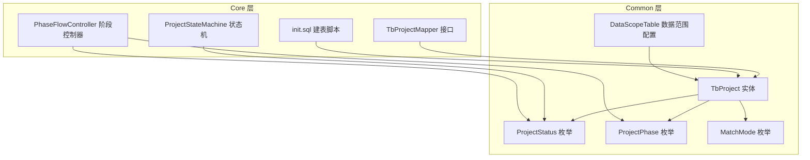
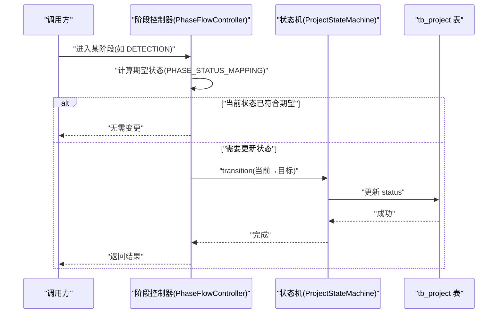
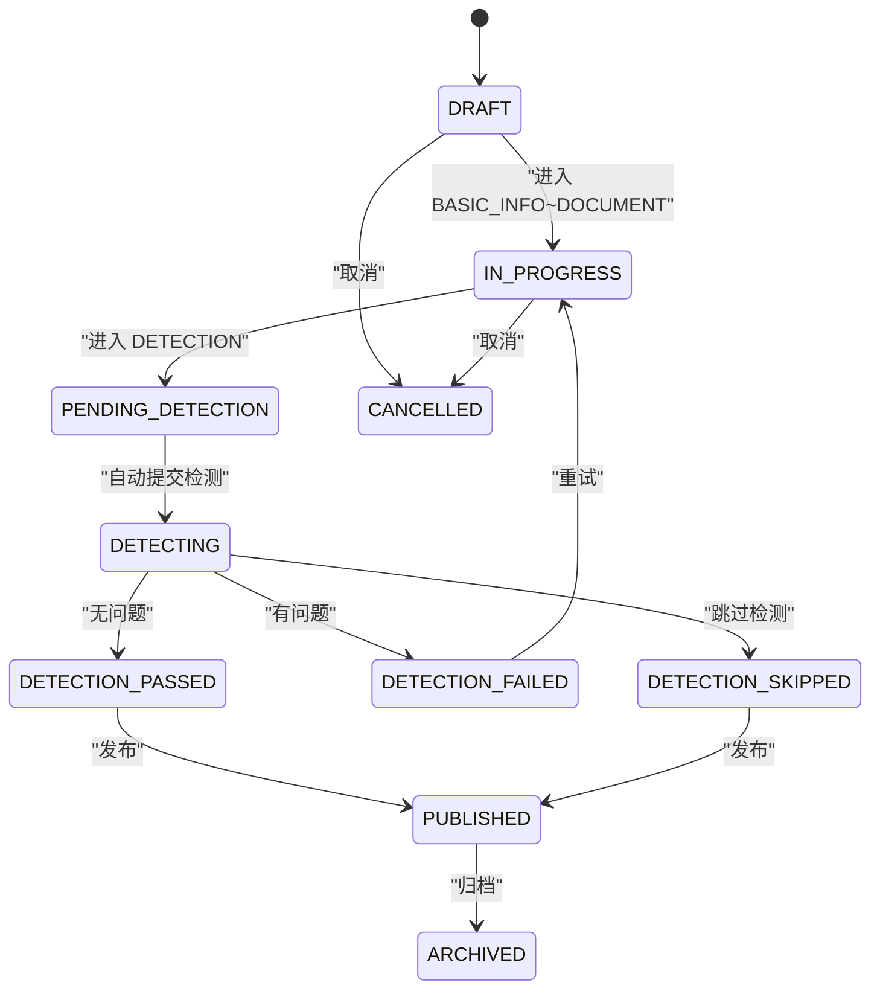
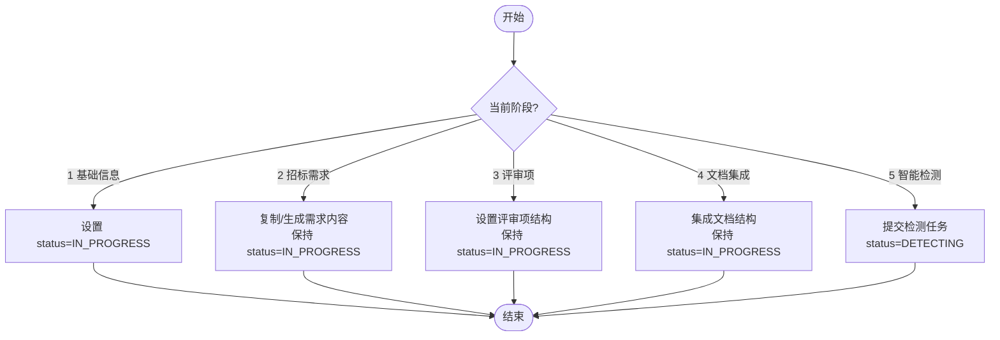
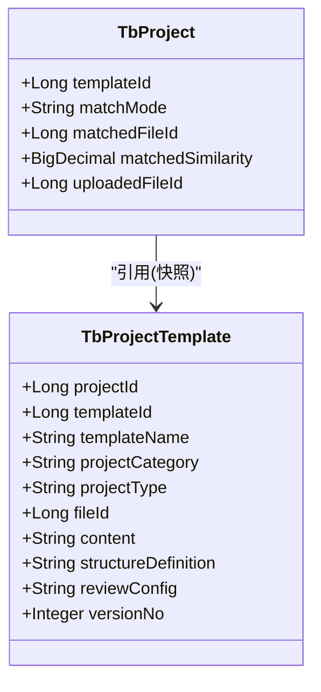
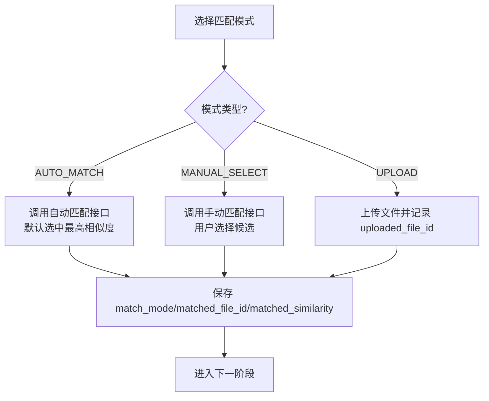
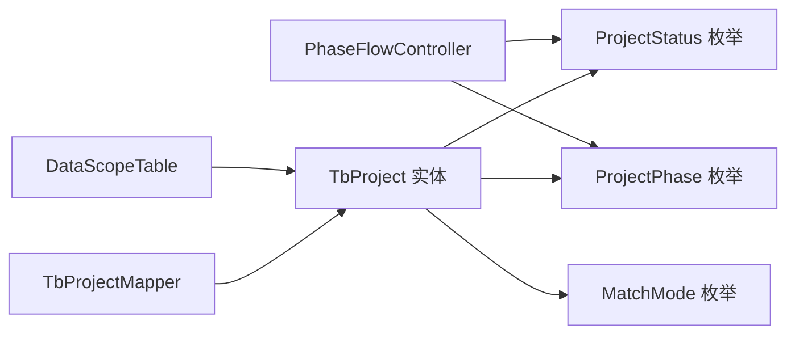

# 项目实体(TbProject)

<cite>
**本文引用的文件列表**
- [TbProject.java](file://ele-ai-tender-system/ele-ai-tender-common/src/main/java/com/jy/eleaitender/common/entity/core/TbProject.java)
- [init.sql](file://ele-ai-tender-system/ele-ai-tender-core/sql/init.sql)
- [ProjectStatus.java](file://ele-ai-tender-system/ele-ai-tender-common/src/main/java/com/jy/eleaitender/common/enums/ProjectStatus.java)
- [ProjectPhase.java](file://ele-ai-tender-system/ele-ai-tender-common/src/main/java/com/jy/eleaitender/common/enums/ProjectPhase.java)
- [MatchMode.java](file://ele-ai-tender-system/ele-ai-tender-common/src/main/java/com/jy/eleaitender/common/enums/MatchMode.java)
- [ProjectStateMachine.java](file://ele-ai-tender-system/ele-ai-tender-core/src/main/java/com/jy/eleaitender/core/statemachine/ProjectStateMachine.java)
- [PhaseFlowController.java](file://ele-ai-tender-system/ele-ai-tender-core/src/main/java/com/jy/eleaitender/core/statemachine/PhaseFlowController.java)
- [TbProjectMapper.java](file://ele-ai-tender-system/ele-ai-tender-core/src/main/java/com/jy/eleaitender/core/mapper/TbProjectMapper.java)
- [DataScopeTable.java](file://ele-ai-tender-system/ele-ai-tender-common/src/main/java/com/jy/eleaitender/common/datascope/DataScopeTable.java)
- [CORE_MODULE_SPEC.md](file://docs/rules/CORE_MODULE_SPEC.md)
- [PHASE_FLOW_SPEC.md](file://docs/rules/PHASE_FLOW_SPEC.md)
- [DETECTION_FLOW_SPEC.md](file://docs/rules/DETECTION_FLOW_SPEC.md)
</cite>

## 目录
1. [简介](#简介)
2. [项目结构](#项目结构)
3. [核心组件](#核心组件)
4. [架构总览](#架构总览)
5. [详细组件分析](#详细组件分析)
6. [依赖关系分析](#依赖关系分析)
7. [性能考虑](#性能考虑)
8. [故障排查指南](#故障排查指南)
9. [结论](#结论)
10. [附录](#附录)

## 简介
本文件围绕项目实体 TbProject 的数据模型进行系统化说明，涵盖字段定义、业务含义、状态机与阶段管理、模板关联机制与匹配模式实现逻辑，并提供 MyBatis Plus 映射配置示例、查询条件构建方法、索引策略与常见业务场景的 SQL 实现建议。目标是帮助开发者快速理解并正确使用 TbProject 相关能力。

## 项目结构
TbProject 属于 Core 模块的核心数据模型，位于 common 层的实体包中；其数据库表定义位于 core 模块的初始化脚本中；状态机与阶段控制器位于 core 模块的状态机包中；枚举类型（状态、阶段、匹配模式）位于 common 层枚举包中。

图表来源
- [TbProject.java:1-100](file://ele-ai-tender-system/ele-ai-tender-common/src/main/java/com/jy/eleaitender/common/entity/core/TbProject.java#L1-L100)
- [ProjectStatus.java:1-36](file://ele-ai-tender-system/ele-ai-tender-common/src/main/java/com/jy/eleaitender/common/enums/ProjectStatus.java#L1-L36)
- [ProjectPhase.java:1-41](file://ele-ai-tender-system/ele-ai-tender-common/src/main/java/com/jy/eleaitender/common/enums/ProjectPhase.java#L1-L41)
- [MatchMode.java:1-29](file://ele-ai-tender-system/ele-ai-tender-common/src/main/java/com/jy/eleaitender/common/enums/MatchMode.java#L1-L29)
- [TbProjectMapper.java:1-25](file://ele-ai-tender-system/ele-ai-tender-core/src/main/java/com/jy/eleaitender/core/mapper/TbProjectMapper.java#L1-L25)
- [ProjectStateMachine.java:1-27](file://ele-ai-tender-system/ele-ai-tender-core/src/main/java/com/jy/eleaitender/core/statemachine/ProjectStateMachine.java#L1-L27)
- [PhaseFlowController.java:1-156](file://ele-ai-tender-system/ele-ai-tender-core/src/main/java/com/jy/eleaitender/core/statemachine/PhaseFlowController.java#L1-L156)
- [init.sql:22-63](file://ele-ai-tender-system/ele-ai-tender-core/sql/init.sql#L22-L63)
- [DataScopeTable.java:1-30](file://ele-ai-tender-system/ele-ai-tender-common/src/main/java/com/jy/eleaitender/common/datascope/DataScopeTable.java#L1-L30)

章节来源
- [TbProject.java:1-100](file://ele-ai-tender-system/ele-ai-tender-common/src/main/java/com/jy/eleaitender/common/entity/core/TbProject.java#L1-L100)
- [init.sql:22-63](file://ele-ai-tender-system/ele-ai-tender-core/sql/init.sql#L22-L63)

## 核心组件
- 实体类：TbProject 对应 tb_project 表，承载项目主数据与流程控制字段。
- 枚举：
  - ProjectStatus：项目状态（DRAFT/IN_PROGRESS/PENDING_DETECTION/DETECTING/DETECTION_PASSED/DETECTION_FAILED/DETECTION_SKIPPED/PUBLISHED/ARCHIVED/CANCELLED）。
  - ProjectPhase：编制阶段（1-基础信息 2-招标需求 3-评审项 4-文档集成 5-智能检测）。
  - MatchMode：匹配模式（AUTO_MATCH/MANUAL_SELECT/UPLOAD）。
- 状态机与阶段控制器：
  - ProjectStateMachine：定义合法状态转换规则。
  - PhaseFlowController：维护阶段到状态的联动映射，并在进入特定阶段时触发相应逻辑。
- Mapper：TbProjectMapper 提供基于 MyBatis Plus 的基础操作及自定义 SQL（如按项目编号计数）。
- 数据范围：DataScopeTable 声明 tb_project 参与 create_id 数据隔离。

章节来源
- [ProjectStatus.java:1-36](file://ele-ai-tender-system/ele-ai-tender-common/src/main/java/com/jy/eleaitender/common/enums/ProjectStatus.java#L1-L36)
- [ProjectPhase.java:1-41](file://ele-ai-tender-system/ele-ai-tender-common/src/main/java/com/jy/eleaitender/common/enums/ProjectPhase.java#L1-L41)
- [MatchMode.java:1-29](file://ele-ai-tender-system/ele-ai-tender-common/src/main/java/com/jy/eleaitender/common/enums/MatchMode.java#L1-L29)
- [ProjectStateMachine.java:1-27](file://ele-ai-tender-system/ele-ai-tender-core/src/main/java/com/jy/eleaitender/core/statemachine/ProjectStateMachine.java#L1-L27)
- [PhaseFlowController.java:1-156](file://ele-ai-tender-system/ele-ai-tender-core/src/main/java/com/jy/eleaitender/core/statemachine/PhaseFlowController.java#L1-L156)
- [TbProjectMapper.java:1-25](file://ele-ai-tender-system/ele-ai-tender-core/src/main/java/com/jy/eleaitender/core/mapper/TbProjectMapper.java#L1-L25)
- [DataScopeTable.java:1-30](file://ele-ai-tender-system/ele-ai-tender-common/src/main/java/com/jy/eleaitender/common/datascope/DataScopeTable.java#L1-L30)

## 架构总览
TbProject 作为核心领域对象，贯穿“创建—编制—检测—发布—归档/取消”的全生命周期。状态机确保状态流转合规，阶段控制器保证阶段推进与状态同步一致，Mapper 提供持久化访问，数据范围拦截器保障多租户/用户级数据隔离。

图表来源
- [PhaseFlowController.java:128-175](file://ele-ai-tender-system/ele-ai-tender-core/src/main/java/com/jy/eleaitender/core/statemachine/PhaseFlowController.java#L128-L175)
- [ProjectStateMachine.java:1-27](file://ele-ai-tender-system/ele-ai-tender-core/src/main/java/com/jy/eleaitender/core/statemachine/ProjectStateMachine.java#L1-L27)

## 详细组件分析

### 数据模型与字段语义
- 标识与元数据
  - id：主键
  - project_code：项目编号（唯一）
  - project_name：项目名称
  - project_category：项目类别
  - project_type：项目类型
  - service_sub_type：服务子类型（当类型为服务时）
  - budget：预算金额（元）
  - project_description：项目基本情况描述
  - tender_unit：招标单位
  - project_location：项目地点
  - contact_person / contact_phone：联系人信息
  - expected_publish_time：预期发布时间
  - remark：备注
- 流程控制
  - review_type：评审类型（MANUAL/INTELLIGENT）
  - status：项目状态（见状态枚举）
  - current_phase：当前编制阶段（1-5）
  - progress：完成进度（百分比 0-100）
- 模板与匹配
  - template_id：使用的模板ID
  - match_mode：匹配模式（AUTO_MATCH/MANUAL_SELECT/UPLOAD）
  - matched_file_id：匹配的历史文件ID
  - matched_similarity：匹配度百分比
  - uploaded_file_id：上传的文件ID
- 需求与生成物
  - requirement_id：关联的业务需求ID
  - requirement_source：需求来源（REFERENCE/SYSTEM_GENERATE）
  - requirement_content：招标需求内容
  - generated_file_id：生成的招标文件ID（关联 file_info）
- 审计与通用字段
  - create_time/create_id/create_name
  - modify_time/modify_id/modify_name
  - ver：乐观锁版本号
  - is_delete：逻辑删除标记

章节来源
- [TbProject.java:1-100](file://ele-ai-tender-system/ele-ai-tender-common/src/main/java/com/jy/eleaitender/common/entity/core/TbProject.java#L1-L100)
- [init.sql:22-63](file://ele-ai-tender-system/ele-ai-tender-core/sql/init.sql#L22-L63)

### 项目状态机设计
- 状态集合：DRAFT、IN_PROGRESS、PENDING_DETECTION、DETECTING、DETECTION_PASSED、DETECTION_FAILED、DETECTION_SKIPPED、PUBLISHED、ARCHIVED、CANCELLED。
- 转换规则由状态机集中定义，禁止跳过中间状态；检测失败后可回退至 IN_PROGRESS 重试或自动转为通过。
- 关键约束：
  - 进入编制阶段（BASIC_INFO~DOCUMENT）→ 状态应为 IN_PROGRESS
  - 进入检测阶段（DETECTION）→ onEnter 提交检测后状态为 DETECTING
  - 检测完成后根据结果转至 DETECTION_PASSED/FAILED/SKIPPED
  - 通过/跳过后可发布（PUBLISHED），最终归档（ARCHIVED）或取消（CANCELLED）

图表来源
- [ProjectStatus.java:1-36](file://ele-ai-tender-system/ele-ai-tender-common/src/main/java/com/jy/eleaitender/common/enums/ProjectStatus.java#L1-L36)
- [ProjectStateMachine.java:1-27](file://ele-ai-tender-system/ele-ai-tender-core/src/main/java/com/jy/eleaitender/core/statemachine/ProjectStateMachine.java#L1-L27)
- [PHASE_FLOW_SPEC.md:37-56](file://docs/rules/PHASE_FLOW_SPEC.md#L37-L56)
- [DETECTION_FLOW_SPEC.md:159-196](file://docs/rules/DETECTION_FLOW_SPEC.md#L159-L196)

章节来源
- [ProjectStatus.java:1-36](file://ele-ai-tender-system/ele-ai-tender-common/src/main/java/com/jy/eleaitender/common/enums/ProjectStatus.java#L1-L36)
- [ProjectStateMachine.java:1-27](file://ele-ai-tender-system/ele-ai-tender-core/src/main/java/com/jy/eleaitender/core/statemachine/ProjectStateMachine.java#L1-L27)
- [CORE_MODULE_SPEC.md:155-195](file://docs/rules/CORE_MODULE_SPEC.md#L155-L195)
- [PHASE_FLOW_SPEC.md:37-56](file://docs/rules/PHASE_FLOW_SPEC.md#L37-L56)
- [DETECTION_FLOW_SPEC.md:159-196](file://docs/rules/DETECTION_FLOW_SPEC.md#L159-L196)

### 编制阶段管理
- 阶段顺序：1-基础信息 → 2-招标需求 → 3-评审项 → 4-文档集成 → 5-智能检测
- 阶段只能顺序推进，不能跳跃或倒退
- 每个阶段有独立触发器，进入新阶段时自动触发 AI 任务
- Phase 与 Status 联动：
  - 进入 BASIC_INFO~DOCUMENT → IN_PROGRESS
  - 进入 DETECTION → DETECTING（onEnter 提交检测）

图表来源
- [ProjectPhase.java:1-41](file://ele-ai-tender-system/ele-ai-tender-common/src/main/java/com/jy/eleaitender/common/enums/ProjectPhase.java#L1-L41)
- [PhaseFlowController.java:33-39](file://ele-ai-tender-system/ele-ai-tender-core/src/main/java/com/jy/eleaitender/core/statemachine/PhaseFlowController.java#L33-L39)
- [CORE_MODULE_SPEC.md:166-175](file://docs/rules/CORE_MODULE_SPEC.md#L166-L175)

章节来源
- [ProjectPhase.java:1-41](file://ele-ai-tender-system/ele-ai-tender-common/src/main/java/com/jy/eleaitender/common/enums/ProjectPhase.java#L1-L41)
- [PhaseFlowController.java:128-175](file://ele-ai-tender-system/ele-ai-tender-core/src/main/java/com/jy/eleaitender/core/statemachine/PhaseFlowController.java#L128-L175)
- [CORE_MODULE_SPEC.md:166-175](file://docs/rules/CORE_MODULE_SPEC.md#L166-L175)

### 项目模板关联机制
- 快照模型：项目引用模板时，将模板信息快照到 tb_project_template，后续模板变更不影响已关联项目。
- 关键字段：
  - project_id：项目ID（唯一）
  - template_id：源模板ID
  - template_name/project_category/project_type/file_id/content/structure_definition/review_config/version_no：模板快照字段
- 服务接口：
  - bindTemplate(projectId, supTemplateId)：从 sup_template 快照到 tb_project_template
  - getByProjectId(projectId)：获取项目的模板引用
  - deleteByProjectId(projectId)：物理删除以释放唯一约束

图表来源
- [TbProject.java:73-86](file://ele-ai-tender-system/ele-ai-tender-common/src/main/java/com/jy/eleaitender/common/entity/core/TbProject.java#L73-L86)
- [TbProjectTemplate.java:1-48](file://ele-ai-tender-system/ele-ai-tender-common/src/main/java/com/jy/eleaitender/common/entity/core/TbProjectTemplate.java#L1-L48)
- [IProjectTemplateService.java:1-34](file://ele-ai-tender-system/ele-ai-tender-core/src/main/java/com/jy/eleaitender/core/service/IProjectTemplateService.java#L1-L34)
- [ProjectTemplateMapper.java:1-19](file://ele-ai-tender-system/ele-ai-tender-core/src/main/java/com/jy/eleaitender/core/mapper/ProjectTemplateMapper.java#L1-L19)
- [init.sql:126-149](file://ele-ai-tender-system/ele-ai-tender-core/sql/init.sql#L126-L149)

章节来源
- [TbProjectTemplate.java:1-48](file://ele-ai-tender-system/ele-ai-tender-common/src/main/java/com/jy/eleaitender/common/entity/core/TbProjectTemplate.java#L1-L48)
- [IProjectTemplateService.java:1-34](file://ele-ai-tender-system/ele-ai-tender-core/src/main/java/com/jy/eleaitender/core/service/IProjectTemplateService.java#L1-L34)
- [ProjectTemplateMapper.java:1-19](file://ele-ai-tender-system/ele-ai-tender-core/src/main/java/com/jy/eleaitender/core/mapper/ProjectTemplateMapper.java#L1-L19)
- [init.sql:126-149](file://ele-ai-tender-system/ele-ai-tender-core/sql/init.sql#L126-L149)

### 匹配模式(AUTO_MATCH/MANUAL_SELECT/UPLOAD)实现逻辑
- 模式枚举：
  - AUTO_MATCH：系统自动匹配，默认选中相似度最高的候选
  - MANUAL_SELECT：手动选择，展示候选列表供用户挑选
  - UPLOAD：用户上传文件作为匹配依据
- 前端交互要点：
  - 切换匹配模式时重新获取候选列表
  - 自动匹配模式下若存在候选则默认选中第一个
  - 手动选择模式下需用户显式确认
- 后端存储：
  - match_mode：记录当前模式
  - matched_file_id / matched_similarity：记录匹配结果
  - uploaded_file_id：记录上传文件ID

图表来源
- [MatchMode.java:1-29](file://ele-ai-tender-system/ele-ai-tender-common/src/main/java/com/jy/eleaitender/common/enums/MatchMode.java#L1-L29)
- [TbProject.java:76-86](file://ele-ai-tender-system/ele-ai-tender-common/src/main/java/com/jy/eleaitender/common/entity/core/TbProject.java#L76-L86)

章节来源
- [MatchMode.java:1-29](file://ele-ai-tender-system/ele-ai-tender-common/src/main/java/com/jy/eleaitender/common/enums/MatchMode.java#L1-L29)
- [TbProject.java:76-86](file://ele-ai-tender-system/ele-ai-tender-common/src/main/java/com/jy/eleaitender/common/entity/core/TbProject.java#L76-L86)

### MyBatis Plus 实体映射配置示例
- 实体注解：
  - @TableName("tb_project")：指定表名
  - @Schema(description="...")：用于 API 文档
  - Lombok @Data/@EqualsAndHashCode(callSuper=true)：简化代码
- 基类 BaseEntity：包含通用审计字段与逻辑删除等
- 数据范围：
  - DataScopeTable.ISOLATED_TABLES 包含 tb_project，启用 create_id 数据隔离

章节来源
- [TbProject.java:1-20](file://ele-ai-tender-system/ele-ai-tender-common/src/main/java/com/jy/eleaitender/common/entity/core/TbProject.java#L1-L20)
- [DataScopeTable.java:18-26](file://ele-ai-tender-system/ele-ai-tender-common/src/main/java/com/jy/eleaitender/common/datascope/DataScopeTable.java#L18-L26)

### 查询条件构建方法与常用 SQL
- 使用 MyBatis Plus LambdaQueryWrapper 构建条件：
  - 按项目编号查询（含逻辑删除）：参考 TbProjectMapper.countByProjectCodeIncludingDeleted
  - 按状态过滤：WHERE status = ?
  - 按阶段过滤：WHERE current_phase = ?
  - 按类别/类型过滤：WHERE project_category = ? AND project_type = ?
  - 按创建人隔离：WHERE create_id = ?（由数据范围拦截器自动注入）
- 常用 SQL 片段（概念性示例，非源码）：
  - 分页查询项目列表：SELECT ... FROM tb_project WHERE is_delete=0 AND create_id=? ORDER BY create_time DESC LIMIT ?,?
  - 统计各状态数量：SELECT status, COUNT(*) FROM tb_project WHERE is_delete=0 GROUP BY status
  - 检索待检测项目：SELECT * FROM tb_project WHERE status='PENDING_DETECTION' AND is_delete=0

章节来源
- [TbProjectMapper.java:15-24](file://ele-ai-tender-system/ele-ai-tender-core/src/main/java/com/jy/eleaitender/core/mapper/TbProjectMapper.java#L15-L24)
- [DataScopeTable.java:18-26](file://ele-ai-tender-system/ele-ai-tender-common/src/main/java/com/jy/eleaitender/common/datascope/DataScopeTable.java#L18-L26)

### 索引策略设计与优化建议
- 现有索引（来自 init.sql）：
  - uk_project_code：项目编号唯一索引
  - idx_status：状态索引
  - idx_category：项目类别索引
  - idx_create_id：创建人索引（配合数据范围）
- 建议补充（视实际查询而定）：
  - (current_phase, status)：联合索引，支持“按阶段+状态”筛选
  - (project_type, project_category)：复合索引，支持按类型/类别组合查询
  - (expected_publish_time)：时间范围查询索引
- 注意事项：
  - 避免过度索引影响写入性能
  - 对大文本字段（requirement_content）不建全文索引，必要时使用外部搜索引擎

章节来源
- [init.sql:58-63](file://ele-ai-tender-system/ele-ai-tender-core/sql/init.sql#L58-L63)

### 常见业务场景 SQL 实现
- 新建项目并设置为草稿：
  - INSERT INTO tb_project(...) VALUES(..., 'DRAFT', NULL, NULL, ...)
- 进入编制阶段（首次）：
  - UPDATE tb_project SET status='IN_PROGRESS', current_phase=?, progress=? WHERE id=? AND is_delete=0
- 进入检测阶段并提交检测：
  - UPDATE tb_project SET status='PENDING_DETECTION' WHERE id=? AND is_delete=0
  - 随后自动流转为 DETECTING（由状态机/控制器处理）
- 检测通过并发布：
  - UPDATE tb_project SET status='PUBLISHED' WHERE id=? AND is_delete=0
- 归档：
  - UPDATE tb_project SET status='ARCHIVED' WHERE id=? AND is_delete=0
- 取消：
  - UPDATE tb_project SET status='CANCELLED' WHERE id=? AND is_delete=0

章节来源
- [ProjectStateMachine.java:19-27](file://ele-ai-tender-system/ele-ai-tender-core/src/main/java/com/jy/eleaitender/core/statemachine/ProjectStateMachine.java#L19-L27)
- [PhaseFlowController.java:128-175](file://ele-ai-tender-system/ele-ai-tender-core/src/main/java/com/jy/eleaitender/core/statemachine/PhaseFlowController.java#L128-L175)

## 依赖关系分析
- 实体依赖：
  - TbProject 依赖 ProjectStatus、ProjectPhase、MatchMode 三个枚举
- 运行时依赖：
  - PhaseFlowController 依赖 IAiTaskService（进入阶段时触发 AI 任务）
  - TbProjectMapper 继承 BaseMapper<TbProject>，提供 CRUD 与自定义 SQL
- 数据范围：
  - DataScopeTable 将 tb_project 纳入 create_id 隔离范围

图表来源
- [TbProject.java:1-100](file://ele-ai-tender-system/ele-ai-tender-common/src/main/java/com/jy/eleaitender/common/entity/core/TbProject.java#L1-L100)
- [ProjectStatus.java:1-36](file://ele-ai-tender-system/ele-ai-tender-common/src/main/java/com/jy/eleaitender/common/enums/ProjectStatus.java#L1-L36)
- [ProjectPhase.java:1-41](file://ele-ai-tender-system/ele-ai-tender-common/src/main/java/com/jy/eleaitender/common/enums/ProjectPhase.java#L1-L41)
- [MatchMode.java:1-29](file://ele-ai-tender-system/ele-ai-tender-common/src/main/java/com/jy/eleaitender/common/enums/MatchMode.java#L1-L29)
- [PhaseFlowController.java:1-156](file://ele-ai-tender-system/ele-ai-tender-core/src/main/java/com/jy/eleaitender/core/statemachine/PhaseFlowController.java#L1-L156)
- [TbProjectMapper.java:1-25](file://ele-ai-tender-system/ele-ai-tender-core/src/main/java/com/jy/eleaitender/core/mapper/TbProjectMapper.java#L1-L25)
- [DataScopeTable.java:1-30](file://ele-ai-tender-system/ele-ai-tender-common/src/main/java/com/jy/eleaitender/common/datascope/DataScopeTable.java#L1-L30)

章节来源
- [PhaseFlowController.java:1-156](file://ele-ai-tender-system/ele-ai-tender-core/src/main/java/com/jy/eleaitender/core/statemachine/PhaseFlowController.java#L1-L156)
- [DataScopeTable.java:1-30](file://ele-ai-tender-system/ele-ai-tender-common/src/main/java/com/jy/eleaitender/common/datascope/DataScopeTable.java#L1-L30)

## 性能考虑
- 索引优化：
  - 针对高频查询（状态、阶段、类别、类型、创建人）建立合适索引
  - 复合索引优先于单列索引，减少回表
- 查询优化：
  - 使用分页与只读必要字段，避免 SELECT *
  - 利用数据范围拦截器自动注入 create_id 条件，避免应用层拼接
- 事务与并发：
  - 状态更新使用乐观锁（ver 字段）防止覆盖写
  - 批量更新尽量合并，减少锁竞争
- 缓存策略：
  - 对静态字典（状态、阶段、匹配模式）可缓存
  - 对热点项目详情可使用短 TTL 缓存

[本节为通用指导，不涉及具体文件分析]

## 故障排查指南
- 状态不一致：
  - 检查 PhaseFlowController.syncProjectStatus 是否被正确调用
  - 核对 ProjectStateMachine 的转换规则是否允许该跳转
- 阶段推进异常：
  - 确认阶段顺序是否符合规范，不允许跳跃或倒退
  - 查看进入 DETECTION 阶段时的 onEnter 触发器是否提交了检测任务
- 数据隔离问题：
  - 确认 DataScopeTable 是否包含 tb_project，且当前上下文具备正确的 create_id
- 模板快照未生效：
  - 检查 bindTemplate 是否执行成功，tb_project_template 是否存在对应记录

章节来源
- [PhaseFlowController.java:128-175](file://ele-ai-tender-system/ele-ai-tender-core/src/main/java/com/jy/eleaitender/core/statemachine/PhaseFlowController.java#L128-L175)
- [ProjectStateMachine.java:19-27](file://ele-ai-tender-system/ele-ai-tender-core/src/main/java/com/jy/eleaitender/core/statemachine/ProjectStateMachine.java#L19-L27)
- [DataScopeTable.java:18-26](file://ele-ai-tender-system/ele-ai-tender-common/src/main/java/com/jy/eleaitender/common/datascope/DataScopeTable.java#L18-L26)

## 结论
TbProject 作为编制中心的核心实体，通过清晰的状态机与阶段控制器实现了严谨的流程控制；模板快照机制保障了历史一致性；匹配模式提供了灵活的候选来源。结合合理的索引与查询策略，可在高并发场景下保持稳定性能。建议在扩展新功能时严格遵循状态机与阶段推进规则，确保数据一致性与可追溯性。

[本节为总结性内容，不涉及具体文件分析]

## 附录
- 相关规范文档：
  - CORE_MODULE_SPEC.md：核心约束（状态流转、阶段流转、AI 任务进度）
  - PHASE_FLOW_SPEC.md：阶段-状态联动规则
  - DETECTION_FLOW_SPEC.md：检测流程与自动流转

章节来源
- [CORE_MODULE_SPEC.md:155-195](file://docs/rules/CORE_MODULE_SPEC.md#L155-L195)
- [PHASE_FLOW_SPEC.md:37-56](file://docs/rules/PHASE_FLOW_SPEC.md#L37-L56)
- [DETECTION_FLOW_SPEC.md:159-196](file://docs/rules/DETECTION_FLOW_SPEC.md#L159-L196)