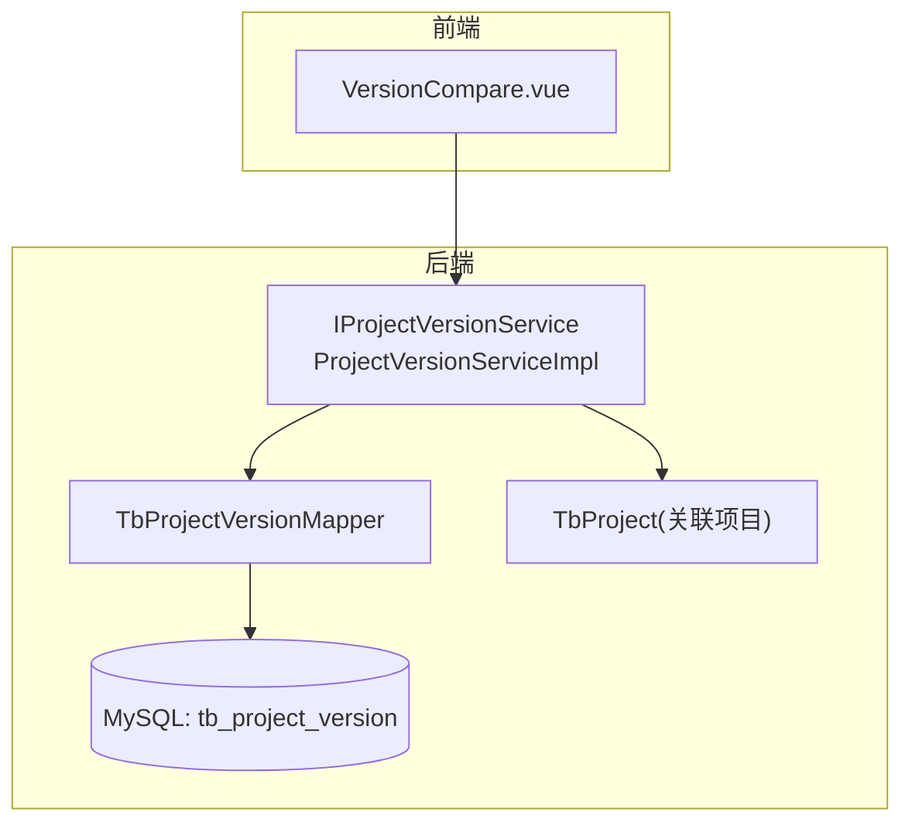
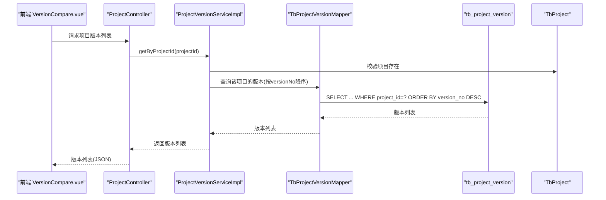
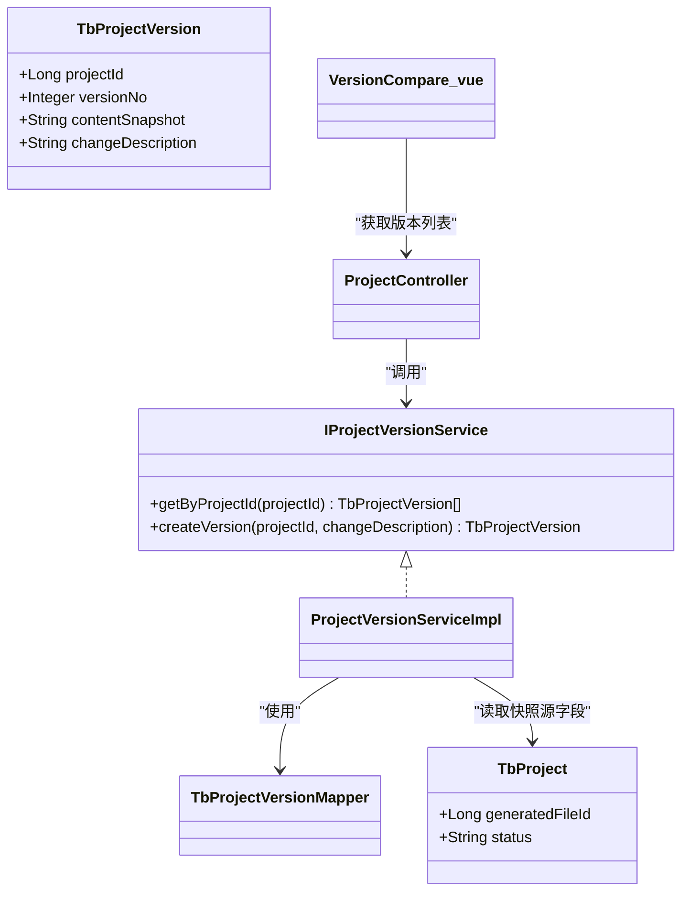

# 项目版本实体(TbProjectVersion)

<cite>
**本文引用的文件**   
- [TbProjectVersion.java](file://ele-ai-tender-system/ele-ai-tender-common/src/main/java/com/jy/eleaitender/common/entity/core/TbProjectVersion.java)
- [TbProject.java](file://ele-ai-tender-system/ele-ai-tender-common/src/main/java/com/jy/eleaitender/common/entity/core/TbProject.java)
- [init.sql](file://ele-ai-tender-system/ele-ai-tender-core/sql/init.sql)
- [IProjectVersionService.java](file://ele-ai-tender-system/ele-ai-tender-core/src/main/java/com/jy/eleaitender/core/service/IProjectVersionService.java)
- [ProjectVersionServiceImpl.java](file://ele-ai-tender-system/ele-ai-tender-core/src/main/java/com/jy/eleaitender/core/service/impl/ProjectVersionServiceImpl.java)
- [TbProjectVersionMapper.java](file://ele-ai-tender-system/ele-ai-tender-core/src/main/java/com/jy/eleaitender/core/mapper/TbProjectVersionMapper.java)
- [ProjectController.java](file://ele-ai-tender-system/ele-ai-tender-core/src/main/java/com/jy/eleaitender/core/controller/ProjectController.java)
- [AiTaskResultSyncHandler.java](file://ele-ai-tender-system/ele-ai-tender-core/src/main/java/com/jy/eleaitender/core/scheduler/AiTaskResultSyncHandler.java)
- [DetectionServiceImpl.java](file://ele-ai-tender-system/ele-ai-tender-core/src/main/java/com/jy/eleaitender/core/service/impl/DetectionServiceImpl.java)
- [VersionCompare.vue](file://ele-ai-tender-frontend/src/components/project/VersionCompare.vue)
</cite>

## 目录
1. [简介](#简介)
2. [项目结构](#项目结构)
3. [核心组件](#核心组件)
4. [架构总览](#架构总览)
5. [详细组件分析](#详细组件分析)
6. [依赖关系分析](#依赖关系分析)
7. [性能与存储优化](#性能与存储优化)
8. [故障排查指南](#故障排查指南)
9. [结论](#结论)
10. [附录](#附录)

## 简介
本文件围绕“项目版本实体 TbProjectVersion”的数据模型与实现进行系统化说明，覆盖表结构设计、版本号管理、内容快照 JSON 的序列化策略、变更说明记录、版本链管理、历史查询、差异对比与回滚恢复思路、迁移与清理策略，以及常见使用场景的 SQL 示例。目标是帮助读者快速理解并正确使用版本能力，同时为后续扩展（如更细粒度字段级快照、增量差异等）提供可落地的方案建议。

## 项目结构
- 数据模型定义位于通用模块的实体类中，映射到数据库表 tb_project_version。
- 版本服务接口与实现位于核心模块，负责版本创建、查询等核心逻辑。
- 前端通过 API 获取版本列表并在 UI 中进行选择与展示。
- 定时任务与检测流程在关键节点自动触发版本快照创建。

图表来源
- [IProjectVersionService.java](file://ele-ai-tender-system/ele-ai-tender-core/src/main/java/com/jy/eleaitender/core/service/IProjectVersionService.java)
- [ProjectVersionServiceImpl.java](file://ele-ai-tender-system/ele-ai-tender-core/src/main/java/com/jy/eleaitender/core/service/impl/ProjectVersionServiceImpl.java)
- [TbProjectVersionMapper.java](file://ele-ai-tender-system/ele-ai-tender-core/src/main/java/com/jy/eleaitender/core/mapper/TbProjectVersionMapper.java)
- [init.sql](file://ele-ai-tender-system/ele-ai-tender-core/sql/init.sql)
- [VersionCompare.vue](file://ele-ai-tender-frontend/src/components/project/VersionCompare.vue)

章节来源
- [TbProjectVersion.java](file://ele-ai-tender-system/ele-ai-tender-common/src/main/java/com/jy/eleaitender/common/entity/core/TbProjectVersion.java)
- [init.sql](file://ele-ai-tender-system/ele-ai-tender-core/sql/init.sql)

## 核心组件
- 实体 TbProjectVersion：描述版本主键、所属项目、版本号、内容快照 JSON、变更说明及审计字段。
- 服务 IProjectVersionService / ProjectVersionServiceImpl：提供按项目查询版本列表、创建版本快照（含版本号自增与默认变更说明）。
- Mapper TbProjectVersionMapper：基于 MyBatis-Plus 的基础 CRUD 访问。
- 控制器与调用方：前端通过项目控制器暴露的版本接口获取版本列表；定时任务与检测完成流程自动创建版本。

章节来源
- [TbProjectVersion.java](file://ele-ai-tender-system/ele-ai-tender-common/src/main/java/com/jy/eleaitender/common/entity/core/TbProjectVersion.java)
- [IProjectVersionService.java](file://ele-ai-tender-system/ele-ai-tender-core/src/main/java/com/jy/eleaitender/core/service/IProjectVersionService.java)
- [ProjectVersionServiceImpl.java](file://ele-ai-tender-system/ele-ai-tender-core/src/main/java/com/jy/eleaitender/core/service/impl/ProjectVersionServiceImpl.java)
- [TbProjectVersionMapper.java](file://ele-ai-tender-system/ele-ai-tender-core/src/main/java/com/jy/eleaitender/core/mapper/TbProjectVersionMapper.java)
- [ProjectController.java](file://ele-ai-tender-system/ele-ai-tender-core/src/main/java/com/jy/eleaitender/core/controller/ProjectController.java)
- [AiTaskResultSyncHandler.java](file://ele-ai-tender-system/ele-ai-tender-core/src/main/java/com/jy/eleaitender/core/scheduler/AiTaskResultSyncHandler.java)
- [DetectionServiceImpl.java](file://ele-ai-tender-system/ele-ai-tender-core/src/main/java/com/jy/eleaitender/core/service/impl/DetectionServiceImpl.java)

## 架构总览
版本能力贯穿“业务状态变更/任务完成”等关键路径，形成“事件驱动 + 快照持久化”的轻量版本链。

图表来源
- [ProjectController.java](file://ele-ai-tender-system/ele-ai-tender-core/src/main/java/com/jy/eleaitender/core/controller/ProjectController.java)
- [ProjectVersionServiceImpl.java](file://ele-ai-tender-system/ele-ai-tender-core/src/main/java/com/jy/eleaitender/core/service/impl/ProjectVersionServiceImpl.java)
- [TbProjectVersionMapper.java](file://ele-ai-tender-system/ele-ai-tender-core/src/main/java/com/jy/eleaitender/core/mapper/TbProjectVersionMapper.java)
- [init.sql](file://ele-ai-tender-system/ele-ai-tender-core/sql/init.sql)

## 详细组件分析

### 数据模型与表结构
- 表名：tb_project_version
- 关键字段
  - id：主键
  - project_id：所属项目ID
  - version_no：版本号（整数，单调递增）
  - content_snapshot：JSON 字符串，保存当前版本的“内容快照”
  - change_description：变更说明（文本）
  - 审计字段：create_time/create_id/create_name、modify_time/modify_id/modify_name、ver、is_delete
- 索引
  - 复合索引 (project_id, version_no)：支撑按项目查询版本链并按版本号排序

章节来源
- [init.sql](file://ele-ai-tender-system/ele-ai-tender-core/sql/init.sql)
- [TbProjectVersion.java](file://ele-ai-tender-system/ele-ai-tender-common/src/main/java/com/jy/eleaitender/common/entity/core/TbProjectVersion.java)

### 版本号(version_no)管理策略
- 生成规则：取该项目下最大 version_no 后 +1；若不存在则从 1 开始。
- 排序策略：查询时按 version_no 降序，便于前端优先展示最新版本。
- 一致性保障：创建过程处于事务内，避免并发写入导致版本号错乱。

章节来源
- [ProjectVersionServiceImpl.java](file://ele-ai-tender-system/ele-ai-tender-core/src/main/java/com/jy/eleaitender/core/service/impl/ProjectVersionServiceImpl.java)

### 内容快照(content_snapshot)设计
- 存储形态：JSON 字符串，持久化为 MySQL JSON 类型字段。
- 当前快照内容：包含“生成的招标文件ID”和“项目状态”，用于定位对应产物与阶段状态。
- 扩展建议：可按需增加更多上下文字段（如模板ID、需求摘要、关键评审项数量等），以增强回溯与对比能力。

章节来源
- [ProjectVersionServiceImpl.java](file://ele-ai-tender-system/ele-ai-tender-core/src/main/java/com/jy/eleaitender/core/service/impl/ProjectVersionServiceImpl.java)
- [TbProject.java](file://ele-ai-tender-system/ele-ai-tender-common/src/main/java/com/jy/eleaitender/common/entity/core/TbProject.java)
- [init.sql](file://ele-ai-tender-system/ele-ai-tender-core/sql/init.sql)

### 变更说明(change_description)记录
- 支持传入自定义说明；未提供时自动生成“第N版”的默认说明。
- 前端版本对比界面会展示变更说明，辅助用户理解版本差异背景。

章节来源
- [ProjectVersionServiceImpl.java](file://ele-ai-tender-system/ele-ai-tender-core/src/main/java/com/jy/eleaitender/core/service/impl/ProjectVersionServiceImpl.java)
- [VersionCompare.vue](file://ele-ai-tender-frontend/src/components/project/VersionCompare.vue)

### 版本链管理与历史查询
- 版本链：同一 project_id 下的多条记录构成一条版本链，version_no 严格递增。
- 历史查询：按 project_id 过滤并按 version_no 降序返回，便于构建时间线视图。

章节来源
- [ProjectVersionServiceImpl.java](file://ele-ai-tender-system/ele-ai-tender-core/src/main/java/com/jy/eleaitender/core/service/impl/ProjectVersionServiceImpl.java)
- [init.sql](file://ele-ai-tender-system/ele-ai-tender-core/sql/init.sql)

### 版本差异对比算法（概念性方案）
- 目标：比较两个版本的 content_snapshot，输出结构化差异（新增/删除/修改）。
- 推荐步骤
  1) 反序列化：将两个版本的 JSON 字符串解析为对象树。
  2) 规范化：统一键顺序、剔除无关元数据（如时间戳）。
  3) 深度比较：递归遍历对象/数组，标记差异点。
  4) 聚合输出：生成差异清单或 HTML 高亮片段供前端渲染。
- 复杂度：O(n)，n 为 JSON 节点总数；空间复杂度取决于对象树大小。
- 注意：当前快照仅包含少量字段，差异较小；未来若扩展为复杂文档结构，建议引入专用 diff 库或领域级 diff 策略。

（本节为概念性说明，不直接分析具体代码文件）

### 回滚恢复机制（概念性方案）
- 适用场景：恢复到某个历史版本的项目状态（例如回退到上一稳定版）。
- 基本流程
  1) 读取目标版本的 content_snapshot。
  2) 根据快照中的关键字段（如 generatedFileId、status）更新 TbProject 对应字段。
  3) 可选：记录一次新的版本快照，标注“回滚至 vN”。
  4) 事务保护：确保多表更新的一致性。
- 风险与约束：仅能恢复快照中包含的字段；如需全量回滚，应扩大快照范围或采用外部归档。

（本节为概念性说明，不直接分析具体代码文件）

### 触发时机与集成点
- 定时任务：AI 任务结果同步完成后，自动创建版本备份。
- 检测完成：当所有问题处理完毕，自动创建版本备份。
- 这些触发点保证在关键业务终态前保留一份一致快照。

章节来源
- [AiTaskResultSyncHandler.java](file://ele-ai-tender-system/ele-ai-tender-core/src/main/java/com/jy/eleaitender/core/scheduler/AiTaskResultSyncHandler.java)
- [DetectionServiceImpl.java](file://ele-ai-tender-system/ele-ai-tender-core/src/main/java/com/jy/eleaitender/core/service/impl/DetectionServiceImpl.java)

## 依赖关系分析
- 实体依赖：TbProjectVersion 继承基础实体，具备通用审计字段。
- 服务依赖：ProjectVersionServiceImpl 依赖 TbProjectVersionMapper 与 IProjectService（用于归属校验）。
- 前端依赖：VersionCompare.vue 通过项目控制器提供的接口获取版本列表。

图表来源
- [TbProjectVersion.java](file://ele-ai-tender-system/ele-ai-tender-common/src/main/java/com/jy/eleaitender/common/entity/core/TbProjectVersion.java)
- [TbProject.java](file://ele-ai-tender-system/ele-ai-tender-common/src/main/java/com/jy/eleaitender/common/entity/core/TbProject.java)
- [IProjectVersionService.java](file://ele-ai-tender-system/ele-ai-tender-core/src/main/java/com/jy/eleaitender/core/service/IProjectVersionService.java)
- [ProjectVersionServiceImpl.java](file://ele-ai-tender-system/ele-ai-tender-core/src/main/java/com/jy/eleaitender/core/service/impl/ProjectVersionServiceImpl.java)
- [TbProjectVersionMapper.java](file://ele-ai-tender-system/ele-ai-tender-core/src/main/java/com/jy/eleaitender/core/mapper/TbProjectVersionMapper.java)
- [ProjectController.java](file://ele-ai-tender-system/ele-ai-tender-core/src/main/java/com/jy/eleaitender/core/controller/ProjectController.java)
- [VersionCompare.vue](file://ele-ai-tender-frontend/src/components/project/VersionCompare.vue)

## 性能与存储优化
- 索引优化
  - 已提供复合索引 (project_id, version_no)，满足按项目查询与排序。
  - 若频繁按 create_time 筛选，可考虑追加索引 (project_id, create_time)。
- JSON 字段
  - 使用 MySQL JSON 类型，便于未来对快照内部字段进行条件查询或函数操作（如 JSON_EXTRACT）。
  - 控制快照体积：仅保留必要字段，避免大对象膨胀。
- 查询分页
  - 历史版本较多时，建议分页加载，减少首屏压力。
- 缓存策略
  - 热点项目的最近 N 个版本可加入本地缓存（如 Caffeine）或 Redis，降低重复查询开销。
- 压缩与归档
  - 对长期历史版本，可考虑离线归档（如对象存储）并保留精简元数据，以降低在线库体积。

（本节为通用优化建议，不直接分析具体代码文件）

## 故障排查指南
- 版本号异常
  - 现象：出现跳号或重复。
  - 排查：确认创建流程是否被并发调用；检查事务边界与唯一性约束。
- 快照为空或解析失败
  - 现象：content_snapshot 为 null 或前端无法解析。
  - 排查：检查序列化逻辑与 JSON 结构；确认字段非空校验。
- 查询缓慢
  - 现象：按项目查询版本列表耗时较长。
  - 排查：确认复合索引是否存在；评估数据量与是否需要分页/缓存。
- 回滚无效
  - 现象：回滚后状态未变化。
  - 排查：确认回滚逻辑是否更新了 TbProject 的关键字段；检查事务是否提交。

（本节为通用排障建议，不直接分析具体代码文件）

## 结论
TbProjectVersion 以“轻量快照 + 有序版本链”的方式实现了项目关键状态的版本化管理。当前实现聚焦于“生成文件ID + 项目状态”的最小可用快照，足以支撑基本的版本回溯与对比。后续可根据业务需要扩展快照字段、引入更精细的差异计算与回滚策略，并结合索引、分页与缓存等手段进一步优化性能。

## 附录

### JSON 序列化和反序列化示例（概念性）
- 序列化（创建快照）
  - 输入：项目对象（包含 generatedFileId、status 等）
  - 输出：JSON 字符串，作为 content_snapshot 写入数据库
- 反序列化（读取快照）
  - 输入：content_snapshot 字符串
  - 输出：对象树，用于对比或回滚

（本节为概念性说明，不直接分析具体代码文件）

### 版本比较算法实现要点（概念性）
- 步骤：解析 -> 规范化 -> 深度比较 -> 聚合差异
- 复杂度：线性于 JSON 节点数
- 输出：差异清单或可视化高亮

（本节为概念性说明，不直接分析具体代码文件）

### 存储空间优化建议（概念性）
- 限制快照字段数量与长度
- 定期归档历史版本
- 使用 JSON 类型并利用数据库内置函数进行选择性查询

（本节为概念性说明，不直接分析具体代码文件）

### 版本迁移策略（概念性）
- 新增字段：提供默认值或允许 NULL，兼容旧数据。
- 结构变更：先加字段再迁移数据，最后移除旧字段，分步发布。
- 回滚预案：保留旧字段一段时间，确保可逆。

（本节为概念性说明，不直接分析具体代码文件）

### 数据清理规则（概念性）
- 保留策略：保留最近 N 个版本或最近 M 个月版本。
- 归档策略：将超出保留期的版本导出并归档，在线表仅保留元数据。
- 幂等清理：清理任务需支持重试与幂等执行。

（本节为概念性说明，不直接分析具体代码文件）

### 常见使用场景 SQL 示例（概念性）
- 查询某项目的所有版本（按版本号倒序）
- 查询最新一个版本
- 统计每个项目的版本数量
- 查找变更说明包含关键词的版本
- 分页查询某项目的历史版本

（本节为概念性说明，不直接分析具体代码文件）