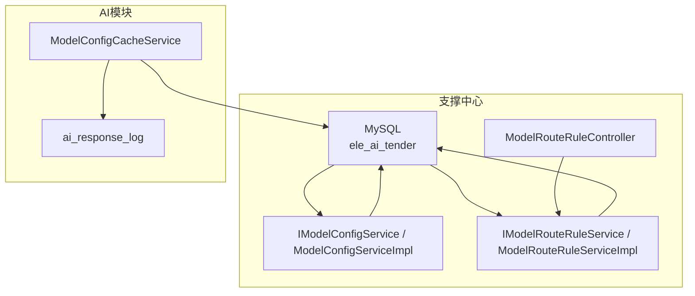
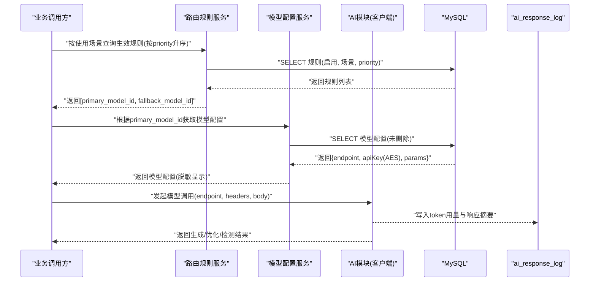
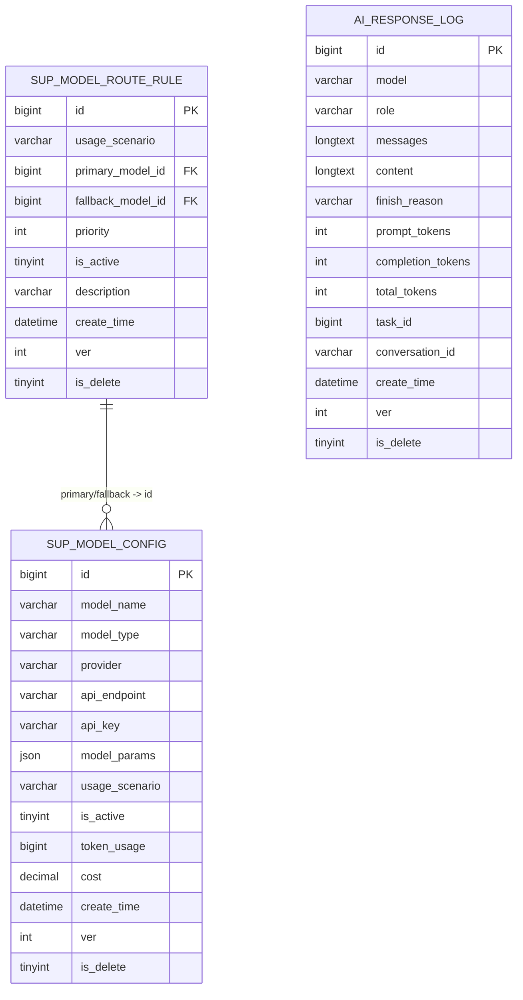
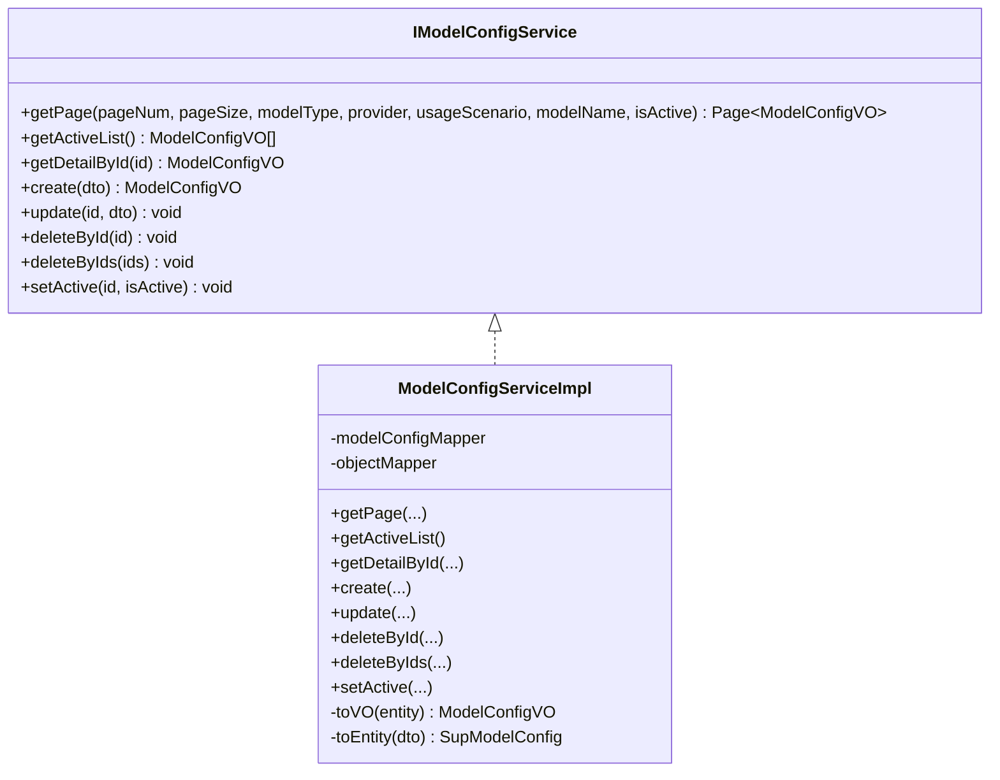
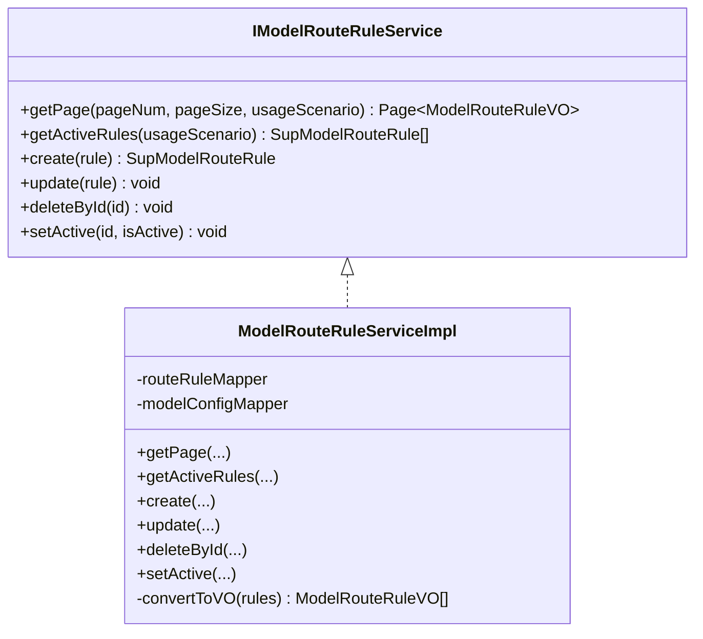
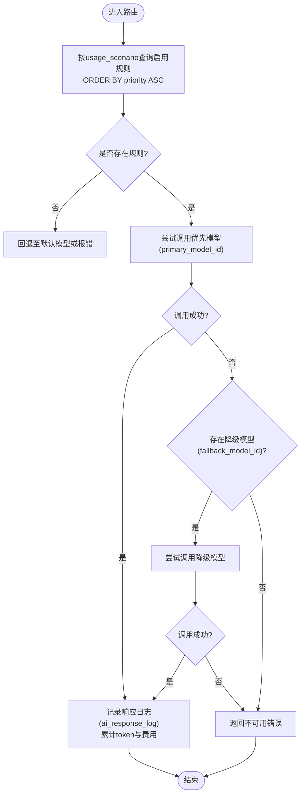
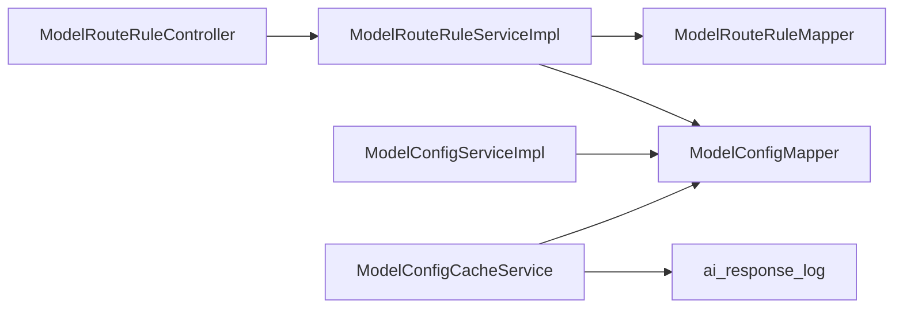

# AI模型配置数据

<cite>
**本文引用的文件**   
- [ele-ai-tender-support/sql/init.sql](file://ele-ai-tender-system/ele-ai-tender-support/sql/init.sql)
- [ele-ai-tender-ai/sql/init.sql](file://ele-ai-tender-system/ele-ai-tender-ai/sql/init.sql)
- [IModelConfigService.java](file://ele-ai-tender-system/ele-ai-tender-support/src/main/java/com/jy/eleaitender/support/service/IModelConfigService.java)
- [ModelConfigServiceImpl.java](file://ele-ai-tender-system/ele-ai-tender-support/src/main/java/com/jy/eleaitender/support/service/impl/ModelConfigServiceImpl.java)
- [ModelConfigCacheService.java](file://ele-ai-tender-system/ele-ai-tender-ai/src/main/java/com/jy/eleaitender/ai/processor/model/ModelConfigCacheService.java)
- [IModelRouteRuleService.java](file://ele-ai-tender-system/ele-ai-tender-support/src/main/java/com/jy/eleaitender/support/service/IModelRouteRuleService.java)
- [ModelRouteRuleServiceImpl.java](file://ele-ai-tender-system/ele-ai-tender-support/src/main/java/com/jy/eleaitender/support/service/impl/ModelRouteRuleServiceImpl.java)
- [ModelRouteRuleController.java](file://ele-ai-tender-system/ele-ai-tender-support/src/main/java/com/jy/eleaitender/support/controller/ModelRouteRuleController.java)
- [ModelRouteRuleVO.java](file://ele-ai-tender-system/ele-ai-tender-support/src/main/java/com/jy/eleaitender/support/vo/ModelRouteRuleVO.java)
</cite>

## 目录
1. [引言](#引言)
2. [项目结构](#项目结构)
3. [核心组件](#核心组件)
4. [架构总览](#架构总览)
5. [详细组件分析](#详细组件分析)
6. [依赖关系分析](#依赖关系分析)
7. [性能与扩展性](#性能与扩展性)
8. [故障排查指南](#故障排查指南)
9. [结论](#结论)
10. [附录](#附录)

## 引言
本文件围绕AI模型配置数据，系统性阐述以下能力：
- 模型配置表 sup_model_config 与模型路由规则表 sup_model_route_rule 的数据库设计与字段语义
- 多模型支持的数据结构：模型类型（LOCAL/CLOUD/PRIVATE）、供应商（OPENAI/ZHIPU）、API端点、密钥加密存储、参数JSON、使用场景等
- 模型路由机制：按使用场景（GENERATION/OPTIMIZATION/DETECTION）选择优先模型与降级模型，基于优先级排序的智能调度
- Token统计与费用累计：通过响应日志与配置表字段支撑运营监控
- 高级特性：配置热更新、路由动态调整、故障转移处理
- 默认配置初始化、多环境管理与版本控制实践

## 项目结构
与AI模型配置相关的关键位置：
- 支撑中心数据库初始化脚本：定义 sup_model_config、sup_model_route_rule 及默认数据
- AI模块数据库初始化脚本：定义 ai_response_log 用于Token与调用明细记录
- 支撑中心服务层：提供模型配置与路由规则的CRUD与查询接口
- AI模块缓存服务：提供模型配置的读取能力（只读视角）

图表来源
- [ele-ai-tender-support/sql/init.sql:329-390](file://ele-ai-tender-system/ele-ai-tender-support/sql/init.sql#L329-L390)
- [ele-ai-tender-ai/sql/init.sql:79-105](file://ele-ai-tender-system/ele-ai-tender-ai/sql/init.sql#L79-L105)
- [IModelConfigService.java:1-19](file://ele-ai-tender-system/ele-ai-tender-support/src/main/java/com/jy/eleaitender/support/service/IModelConfigService.java#L1-L19)
- [ModelConfigServiceImpl.java:29-163](file://ele-ai-tender-system/ele-ai-tender-support/src/main/java/com/jy/eleaitender/support/service/impl/ModelConfigServiceImpl.java#L29-L163)
- [IModelRouteRuleService.java:1-61](file://ele-ai-tender-system/ele-ai-tender-support/src/main/java/com/jy/eleaitender/support/service/IModelRouteRuleService.java#L1-L61)
- [ModelRouteRuleServiceImpl.java:1-106](file://ele-ai-tender-system/ele-ai-tender-support/src/main/java/com/jy/eleaitender/support/service/impl/ModelRouteRuleServiceImpl.java#L1-L106)
- [ModelRouteRuleController.java:1-37](file://ele-ai-tender-system/ele-ai-tender-support/src/main/java/com/jy/eleaitender/support/controller/ModelRouteRuleController.java#L1-L37)
- [ModelConfigCacheService.java:43-59](file://ele-ai-tender-system/ele-ai-tender-ai/src/main/java/com/jy/eleaitender/ai/processor/model/ModelConfigCacheService.java#L43-L59)

章节来源
- [ele-ai-tender-support/sql/init.sql:329-390](file://ele-ai-tender-system/ele-ai-tender-support/sql/init.sql#L329-L390)
- [ele-ai-tender-ai/sql/init.sql:79-105](file://ele-ai-tender-system/ele-ai-tender-ai/sql/init.sql#L79-L105)

## 核心组件
- 模型配置表 sup_model_config
  - 关键字段：模型名称、模型类型（LOCAL/CLOUD/PRIVATE）、供应商（OPENAI/ZHIPU）、API端点、API密钥（AES加密存储）、模型参数JSON、使用场景（GENERATION/OPTIMIZATION/DETECTION）、启用状态、Token使用量累计、累计费用、审计字段与逻辑删除
  - 用途：集中管理多模型接入信息，供AI模块只读访问
- 模型路由规则表 sup_model_route_rule
  - 关键字段：使用场景、优先模型ID、降级模型ID、优先级（值越小越高）、是否启用、描述
  - 用途：为不同业务场景定义“首选+降级”的模型选择策略
- 响应日志表 ai_response_log
  - 关键字段：模型名、角色（对应使用场景）、消息内容、完成原因、prompt_tokens、completion_tokens、total_tokens、任务ID、对话ID、时间戳
  - 用途：沉淀每次调用的Token消耗与结果，支撑计费与可观测性
- 支撑中心服务层
  - IModelConfigService / ModelConfigServiceImpl：模型配置的增删改查、分页筛选、启用/停用、列表导出（脱敏）
  - IModelRouteRuleService / ModelRouteRuleServiceImpl：路由规则的分页、按场景获取生效规则（按优先级排序）、启停控制
  - ModelRouteRuleController：对外暴露路由规则查询与管理接口
- AI模块缓存服务
  - ModelConfigCacheService：根据模型ID读取配置（过滤已删除），作为AI侧只读入口

章节来源
- [ele-ai-tender-support/sql/init.sql:329-390](file://ele-ai-tender-system/ele-ai-tender-support/sql/init.sql#L329-L390)
- [ele-ai-tender-ai/sql/init.sql:79-105](file://ele-ai-tender-system/ele-ai-tender-ai/sql/init.sql#L79-L105)
- [IModelConfigService.java:1-19](file://ele-ai-tender-system/ele-ai-tender-support/src/main/java/com/jy/eleaitender/support/service/IModelConfigService.java#L1-L19)
- [ModelConfigServiceImpl.java:29-163](file://ele-ai-tender-system/ele-ai-tender-support/src/main/java/com/jy/eleaitender/support/service/impl/ModelConfigServiceImpl.java#L29-L163)
- [IModelRouteRuleService.java:1-61](file://ele-ai-tender-system/ele-ai-tender-support/src/main/java/com/jy/eleaitender/support/service/IModelRouteRuleService.java#L1-L61)
- [ModelRouteRuleServiceImpl.java:1-106](file://ele-ai-tender-system/ele-ai-tender-support/src/main/java/com/jy/eleaitender/support/service/impl/ModelRouteRuleServiceImpl.java#L1-L106)
- [ModelRouteRuleController.java:1-37](file://ele-ai-tender-system/ele-ai-tender-support/src/main/java/com/jy/eleaitender/support/controller/ModelRouteRuleController.java#L1-L37)
- [ModelConfigCacheService.java:43-59](file://ele-ai-tender-system/ele-ai-tender-ai/src/main/java/com/jy/eleaitender/ai/processor/model/ModelConfigCacheService.java#L43-L59)

## 架构总览
下图展示从“业务场景→路由规则→模型配置→调用与统计”的整体流程。

图表来源
- [IModelRouteRuleService.java:24-30](file://ele-ai-tender-system/ele-ai-tender-support/src/main/java/com/jy/eleaitender/support/service/IModelRouteRuleService.java#L24-L30)
- [ModelRouteRuleServiceImpl.java:54-60](file://ele-ai-tender-system/ele-ai-tender-support/src/main/java/com/jy/eleaitender/support/service/impl/ModelRouteRuleServiceImpl.java#L54-L60)
- [IModelConfigService.java:10-19](file://ele-ai-tender-system/ele-ai-tender-support/src/main/java/com/jy/eleaitender/support/service/IModelConfigService.java#L10-L19)
- [ModelConfigCacheService.java:43-59](file://ele-ai-tender-system/ele-ai-tender-ai/src/main/java/com/jy/eleaitender/ai/processor/model/ModelConfigCacheService.java#L43-L59)
- [ele-ai-tender-ai/sql/init.sql:79-105](file://ele-ai-tender-system/ele-ai-tender-ai/sql/init.sql#L79-L105)

## 详细组件分析

### 数据模型与字段语义
- sup_model_config（AI模型配置表）
  - 模型标识与分类：model_name、model_type（LOCAL/CLOUD/PRIVATE）、provider（OPENAI/ZHIPU）
  - 连接与鉴权：api_endpoint、api_key（AES加密存储）
  - 运行时参数：model_params（JSON，如temperature/maxTokens/topP/model等）
  - 业务适配：usage_scenario（GENERATION/OPTIMIZATION/DETECTION）
  - 生命周期与统计：is_active、token_usage（累计）、cost（累计费用）
  - 审计与软删除：create_time/create_id/create_name、modify_time/modify_id/modify_name、ver、is_delete
- sup_model_route_rule（模型路由规则表）
  - 场景到模型的映射：usage_scenario、primary_model_id、fallback_model_id
  - 调度顺序：priority（值越小优先级越高）
  - 生命周期：is_active、description、审计字段与软删除
- ai_response_log（AI响应记录表）
  - 调用上下文：model、role（对应使用场景）、messages、content、finish_reason
  - Token计量：prompt_tokens、completion_tokens、total_tokens
  - 关联维度：task_id、conversation_id、create_time

图表来源
- [ele-ai-tender-support/sql/init.sql:329-390](file://ele-ai-tender-system/ele-ai-tender-support/sql/init.sql#L329-L390)
- [ele-ai-tender-ai/sql/init.sql:79-105](file://ele-ai-tender-system/ele-ai-tender-ai/sql/init.sql#L79-L105)

章节来源
- [ele-ai-tender-support/sql/init.sql:329-390](file://ele-ai-tender-system/ele-ai-tender-support/sql/init.sql#L329-L390)
- [ele-ai-tender-ai/sql/init.sql:79-105](file://ele-ai-tender-system/ele-ai-tender-ai/sql/init.sql#L79-L105)

### 模型配置服务（支撑中心）
- 能力概览
  - 分页查询：支持按模型类型、供应商、使用场景、模型名称、启用状态筛选
  - 活跃列表：仅返回启用且未删除的配置
  - 详情/创建/更新/删除/批量删除/启停
  - VO转换：对apiKey进行解密后脱敏展示，避免敏感信息泄露
- 关键实现要点
  - 查询条件组合与默认排序
  - 事务边界：写操作统一加事务注解
  - 异常处理：不存在时抛出业务异常
  - 安全：密钥在入库前加密、出参脱敏

图表来源
- [IModelConfigService.java:1-19](file://ele-ai-tender-system/ele-ai-tender-support/src/main/java/com/jy/eleaitender/support/service/IModelConfigService.java#L1-L19)
- [ModelConfigServiceImpl.java:29-163](file://ele-ai-tender-system/ele-ai-tender-support/src/main/java/com/jy/eleaitender/support/service/impl/ModelConfigServiceImpl.java#L29-L163)

章节来源
- [IModelConfigService.java:1-19](file://ele-ai-tender-system/ele-ai-tender-support/src/main/java/com/jy/eleaitender/support/service/IModelConfigService.java#L1-L19)
- [ModelConfigServiceImpl.java:29-163](file://ele-ai-tender-system/ele-ai-tender-support/src/main/java/com/jy/eleaitender/support/service/impl/ModelConfigServiceImpl.java#L29-L163)

### 模型路由规则服务（支撑中心）
- 能力概览
  - 分页查询：可按使用场景过滤，并按优先级升序返回
  - 按场景获取生效规则：仅返回启用规则，按priority升序
  - 增删改与启停控制
  - VO填充：将primary/fallback模型ID映射为模型名称，便于前端展示
- 关键实现要点
  - 排序：ORDER BY priority ASC
  - 事务：写操作统一加事务注解
  - 校验：不存在时抛业务异常

图表来源
- [IModelRouteRuleService.java:1-61](file://ele-ai-tender-system/ele-ai-tender-support/src/main/java/com/jy/eleaitender/support/service/IModelRouteRuleService.java#L1-L61)
- [ModelRouteRuleServiceImpl.java:1-106](file://ele-ai-tender-system/ele-ai-tender-support/src/main/java/com/jy/eleaitender/support/service/impl/ModelRouteRuleServiceImpl.java#L1-L106)

章节来源
- [IModelRouteRuleService.java:1-61](file://ele-ai-tender-system/ele-ai-tender-support/src/main/java/com/jy/eleaitender/support/service/IModelRouteRuleService.java#L1-L61)
- [ModelRouteRuleServiceImpl.java:1-106](file://ele-ai-tender-system/ele-ai-tender-support/src/main/java/com/jy/eleaitender/support/service/impl/ModelRouteRuleServiceImpl.java#L1-L106)

### 路由决策流程（算法级）

图表来源
- [ModelRouteRuleServiceImpl.java:54-60](file://ele-ai-tender-system/ele-ai-tender-support/src/main/java/com/jy/eleaitender/support/service/impl/ModelRouteRuleServiceImpl.java#L54-L60)
- [ele-ai-tender-ai/sql/init.sql:79-105](file://ele-ai-tender-system/ele-ai-tender-ai/sql/init.sql#L79-L105)

章节来源
- [ModelRouteRuleServiceImpl.java:54-60](file://ele-ai-tender-system/ele-ai-tender-support/src/main/java/com/jy/eleaitender/support/service/impl/ModelRouteRuleServiceImpl.java#L54-L60)
- [ele-ai-tender-ai/sql/init.sql:79-105](file://ele-ai-tender-system/ele-ai-tender-ai/sql/init.sql#L79-L105)

### 控制器与对外接口
- 路由规则控制器
  - GET /api/v1/model-routes：分页查询路由规则，支持按使用场景过滤
  - 其他CRUD接口由服务层提供，控制器负责入参校验与统一响应封装

章节来源
- [ModelRouteRuleController.java:1-37](file://ele-ai-tender-system/ele-ai-tender-support/src/main/java/com/jy/eleaitender/support/controller/ModelRouteRuleController.java#L1-L37)
- [ModelRouteRuleVO.java:1-39](file://ele-ai-tender-system/ele-ai-tender-support/src/main/java/com/jy/eleaitender/support/vo/ModelRouteRuleVO.java#L1-L39)

### AI侧只读访问与缓存
- ModelConfigCacheService
  - 根据模型ID读取配置，自动过滤已删除项
  - 作为AI模块内部只读入口，避免直接耦合持久层细节

章节来源
- [ModelConfigCacheService.java:43-59](file://ele-ai-tender-system/ele-ai-tender-ai/src/main/java/com/jy/eleaitender/ai/processor/model/ModelConfigCacheService.java#L43-L59)

## 依赖关系分析
- 支撑中心
  - 控制器依赖服务接口；服务实现依赖MyBatis Mapper访问数据库
  - 路由规则服务依赖模型配置Mapper以填充模型名称（VO转换阶段）
- AI模块
  - 缓存服务依赖模型配置Mapper进行只读访问
  - 响应日志写入独立表，不反向影响配置与路由

图表来源
- [ModelRouteRuleController.java:1-37](file://ele-ai-tender-system/ele-ai-tender-support/src/main/java/com/jy/eleaitender/support/controller/ModelRouteRuleController.java#L1-L37)
- [ModelRouteRuleServiceImpl.java:1-106](file://ele-ai-tender-system/ele-ai-tender-support/src/main/java/com/jy/eleaitender/support/service/impl/ModelRouteRuleServiceImpl.java#L1-L106)
- [ModelConfigServiceImpl.java:29-163](file://ele-ai-tender-system/ele-ai-tender-support/src/main/java/com/jy/eleaitender/support/service/impl/ModelConfigServiceImpl.java#L29-L163)
- [ModelConfigCacheService.java:43-59](file://ele-ai-tender-system/ele-ai-tender-ai/src/main/java/com/jy/eleaitender/ai/processor/model/ModelConfigCacheService.java#L43-L59)
- [ele-ai-tender-ai/sql/init.sql:79-105](file://ele-ai-tender-system/ele-ai-tender-ai/sql/init.sql#L79-L105)

## 性能与扩展性
- 查询性能
  - 路由规则按场景+启用状态+优先级排序，建议在(usage_scenario, is_active, priority)建立复合索引以提升排序与过滤效率
  - 模型配置常用过滤字段(model_type, usage_scenario, is_active)已有索引，建议结合具体查询模式评估是否需要复合索引
- 读写分离与缓存
  - AI模块对配置为只读，可在应用层引入本地缓存或Redis缓存，降低数据库压力
  - 路由规则变更频率低，适合长TTL缓存，配合失效事件刷新
- Token统计与费用
  - 高频写入ai_response_log，建议分区或归档策略，避免单表过大
  - 费用计算可与外部定价策略解耦，通过定时任务汇总至配置表的cost字段

## 故障排查指南
- 常见问题定位
  - 路由无生效：检查usage_scenario是否正确、规则是否启用、priority排序是否符合预期
  - 模型不可用：核对api_endpoint连通性、api_key是否有效、model_params是否合法
  - Token统计缺失：确认ai_response_log写入是否成功、字段是否完整
- 快速验证步骤
  - 查询生效路由：按场景获取启用规则并观察排序
  - 查询模型配置：按ID获取配置，确认未删除且启用
  - 查看最近调用日志：按模型或任务ID检索ai_response_log，核对token与耗时

章节来源
- [ele-ai-tender-ai/sql/init.sql:79-105](file://ele-ai-tender-system/ele-ai-tender-ai/sql/init.sql#L79-L105)
- [ModelRouteRuleServiceImpl.java:54-60](file://ele-ai-tender-system/ele-ai-tender-support/src/main/java/com/jy/eleaitender/support/service/impl/ModelRouteRuleServiceImpl.java#L54-L60)
- [ModelConfigCacheService.java:43-59](file://ele-ai-tender-system/ele-ai-tender-ai/src/main/java/com/jy/eleaitender/ai/processor/model/ModelConfigCacheService.java#L43-L59)

## 结论
- sup_model_config 与 sup_model_route_rule 共同构成“配置+策略”的双层体系，既保证多模型接入的灵活性，又提供按场景智能调度的能力
- ai_response_log 为Token统计与费用核算提供可靠数据基础
- 支撑中心提供完善的配置与规则管理能力，AI模块以只读方式消费，职责清晰、易于扩展与维护

## 附录

### 默认模型配置初始化
- 初始化脚本包含多条默认模型配置，覆盖不同使用场景与参数模板，便于快速启动与测试
- 部署时可通过环境变量注入敏感信息（如API Key占位符），确保生产安全

章节来源
- [ele-ai-tender-support/sql/init.sql:359-365](file://ele-ai-tender-system/ele-ai-tender-support/sql/init.sql#L359-L365)

### 多环境配置管理
- 通过环境变量替换敏感字段（如API Key），避免硬编码
- 不同环境（开发/测试/生产）维护独立的初始化脚本或参数化脚本，确保一致性

章节来源
- [ele-ai-tender-support/sql/init.sql:359-365](file://ele-ai-tender-system/ele-ai-tender-support/sql/init.sql#L359-L365)

### 配置版本控制建议
- 在现有审计字段基础上，可扩展version_no或snapshot_id字段，形成配置快照
- 结合发布流程，对关键配置变更打标签，支持回滚与审计追踪

[本节为通用实践建议，不直接分析具体代码文件]