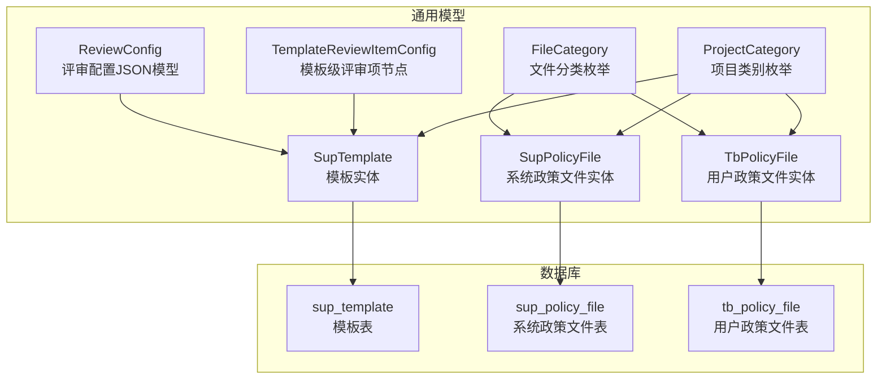
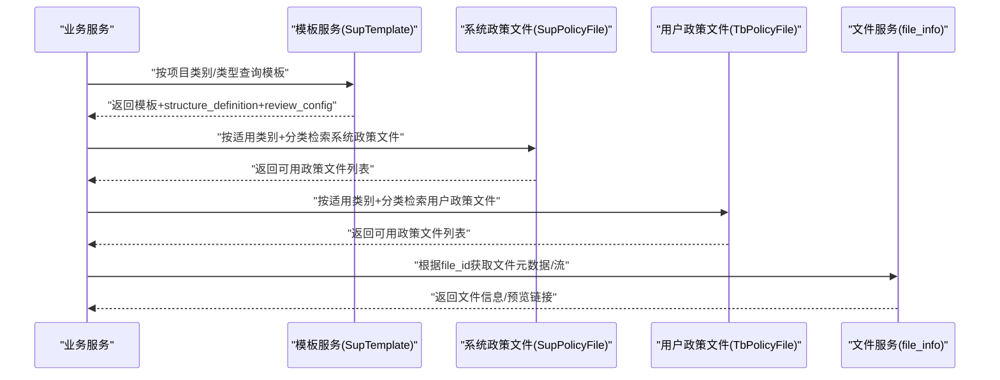
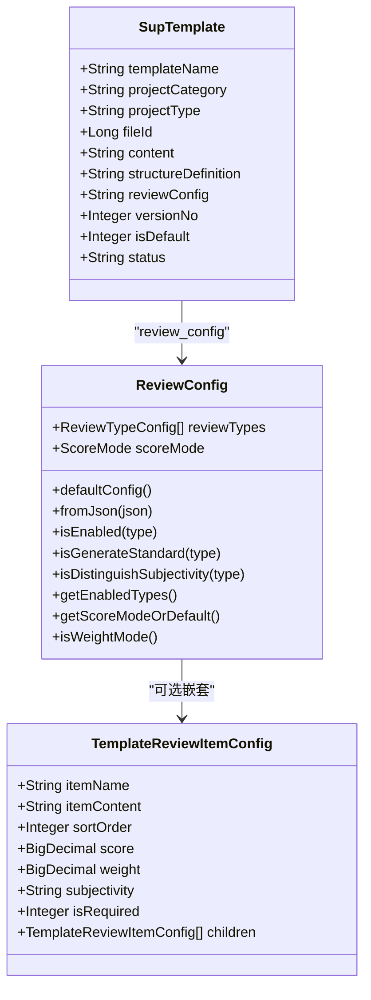
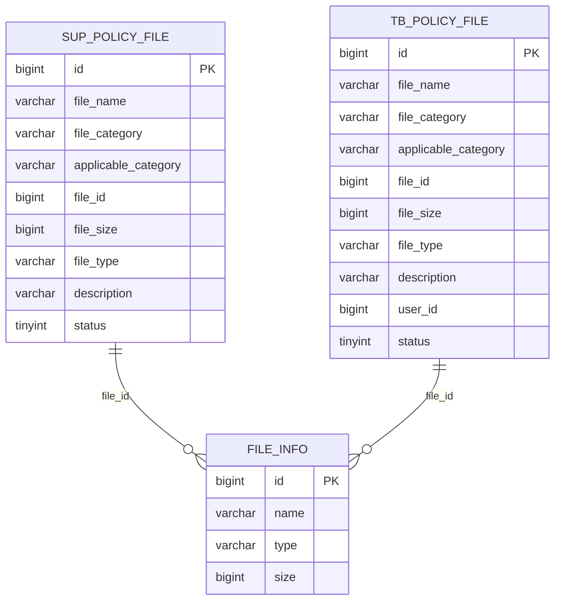
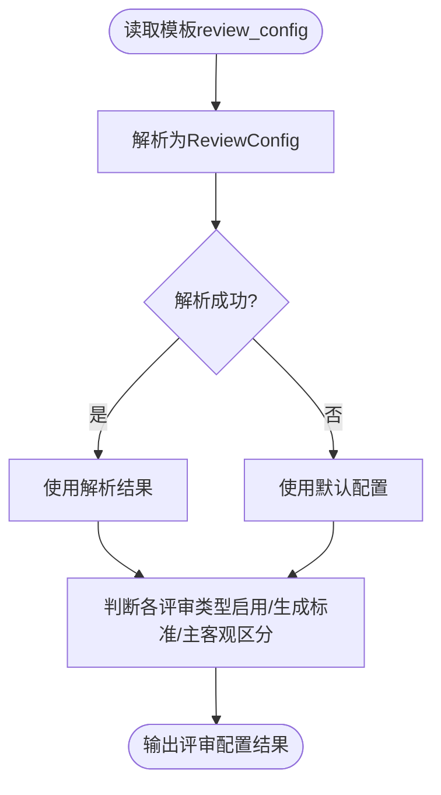
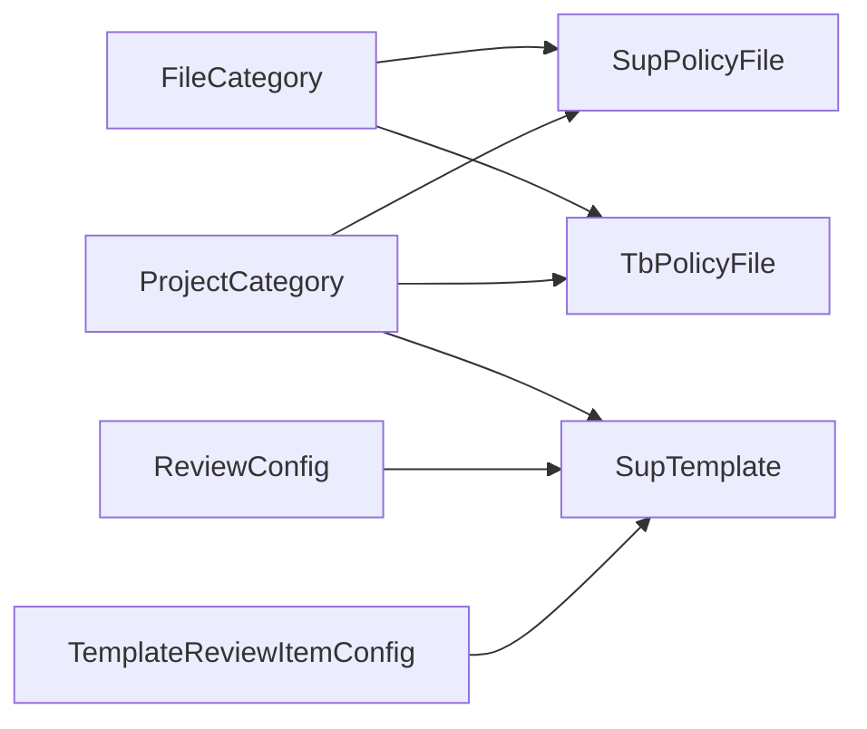

# 业务配置数据

<cite>
**本文引用的文件**   
- [SupTemplate.java](file://ele-ai-tender-system/ele-ai-tender-common/src/main/java/com/jy/eleaitender/common/entity/support/SupTemplate.java)
- [SupPolicyFile.java](file://ele-ai-tender-system/ele-ai-tender-common/src/main/java/com/jy/eleaitender/common/entity/support/SupPolicyFile.java)
- [TbPolicyFile.java](file://ele-ai-tender-system/ele-ai-tender-common/src/main/java/com/jy/eleaitender/common/entity/core/TbPolicyFile.java)
- [ReviewConfig.java](file://ele-ai-tender-system/ele-ai-tender-common/src/main/java/com/jy/eleaitender/common/dto/ReviewConfig.java)
- [TemplateReviewItemConfig.java](file://ele-ai-tender-system/ele-ai-tender-common/src/main/java/com/jy/eleaitender/common/dto/TemplateReviewItemConfig.java)
- [FileCategory.java](file://ele-ai-tender-system/ele-ai-tender-common/src/main/java/com/jy/eleaitender/common/enums/FileCategory.java)
- [ProjectCategory.java](file://ele-ai-tender-system/ele-ai-tender-common/src/main/java/com/jy/eleaitender/common/enums/ProjectCategory.java)
- [init.sql（支持库）](file://ele-ai-tender-system/ele-ai-tender-support/sql/init.sql)
- [init.sql（核心库）](file://ele-ai-tender-system/ele-ai-tender-core/sql/init.sql)
</cite>

## 目录
1. [引言](#引言)
2. [项目结构](#项目结构)
3. [核心组件](#核心组件)
4. [架构总览](#架构总览)
5. [详细组件分析](#详细组件分析)
6. [依赖关系分析](#依赖关系分析)
7. [性能考虑](#性能考虑)
8. [故障排查指南](#故障排查指南)
9. [结论](#结论)
10. [附录](#附录)

## 引言
本文件聚焦于“业务配置数据”的设计与实现，围绕招标文件模板表 sup_template 与政策文件表 sup_policy_file 的业务模型、数据结构、版本控制机制、项目类别适配、评审项配置(JSON)、文件分类管理(LAW/REGULATION/POLICY)、适用项目类别与文件关联等合规性检查的数据支撑进行系统化说明。同时给出模板结构定义、评审配置、文件预览等业务对象的数据建模方案，并提供模板引擎集成、政策文件解析、版本对比分析的技术指导，以及数据迁移策略、备份恢复方案与扩展开发规范。

## 项目结构
- 实体与枚举位于通用模块 ele-ai-tender-common，提供跨服务复用的领域模型与常量。
- 数据库初始化脚本分别位于 core 与 support 子模块，分别承载业务运行期与平台支撑期的基础表结构。
- 模板与政策文件的核心字段在实体类与建表脚本中保持一致，确保前后端与存储层的一致性。

图表来源
- [SupTemplate.java:1-52](file://ele-ai-tender-system/ele-ai-tender-common/src/main/java/com/jy/eleaitender/common/entity/support/SupTemplate.java#L1-L52)
- [SupPolicyFile.java:12-41](file://ele-ai-tender-system/ele-ai-tender-common/src/main/java/com/jy/eleaitender/common/entity/support/SupPolicyFile.java#L12-L41)
- [TbPolicyFile.java:13-45](file://ele-ai-tender-system/ele-ai-tender-common/src/main/java/com/jy/eleaitender/common/entity/core/TbPolicyFile.java#L13-L45)
- [ReviewConfig.java:1-121](file://ele-ai-tender-system/ele-ai-tender-common/src/main/java/com/jy/eleaitender/common/dto/ReviewConfig.java#L1-L121)
- [TemplateReviewItemConfig.java:1-33](file://ele-ai-tender-system/ele-ai-tender-common/src/main/java/com/jy/eleaitender/common/dto/TemplateReviewItemConfig.java#L1-L33)
- [FileCategory.java:1-37](file://ele-ai-tender-system/ele-ai-tender-common/src/main/java/com/jy/eleaitender/common/enums/FileCategory.java#L1-L37)
- [ProjectCategory.java:1-29](file://ele-ai-tender-system/ele-ai-tender-common/src/main/java/com/jy/eleaitender/common/enums/ProjectCategory.java#L1-L29)
- [init.sql（支持库）:446-467](file://ele-ai-tender-system/ele-ai-tender-support/sql/init.sql#L446-L467)
- [init.sql（支持库）:304-317](file://ele-ai-tender-system/ele-ai-tender-support/sql/init.sql#L304-L317)
- [init.sql（核心库）:188-211](file://ele-ai-tender-system/ele-ai-tender-core/sql/init.sql#L188-L211)

章节来源
- [SupTemplate.java:1-52](file://ele-ai-tender-system/ele-ai-tender-common/src/main/java/com/jy/eleaitender/common/entity/support/SupTemplate.java#L1-L52)
- [SupPolicyFile.java:12-41](file://ele-ai-tender-system/ele-ai-tender-common/src/main/java/com/jy/eleaitender/common/entity/support/SupPolicyFile.java#L12-L41)
- [TbPolicyFile.java:13-45](file://ele-ai-tender-system/ele-ai-tender-common/src/main/java/com/jy/eleaitender/common/entity/core/TbPolicyFile.java#L13-L45)
- [ReviewConfig.java:1-121](file://ele-ai-tender-system/ele-ai-tender-common/src/main/java/com/jy/eleaitender/common/dto/ReviewConfig.java#L1-L121)
- [TemplateReviewItemConfig.java:1-33](file://ele-ai-tender-system/ele-ai-tender-common/src/main/java/com/jy/eleaitender/common/dto/TemplateReviewItemConfig.java#L1-L33)
- [FileCategory.java:1-37](file://ele-ai-tender-system/ele-ai-tender-common/src/main/java/com/jy/eleaitender/common/enums/FileCategory.java#L1-L37)
- [ProjectCategory.java:1-29](file://ele-ai-tender-system/ele-ai-tender-common/src/main/java/com/jy/eleaitender/common/enums/ProjectCategory.java#L1-L29)
- [init.sql（支持库）:446-467](file://ele-ai-tender-system/ele-ai-tender-support/sql/init.sql#L446-L467)
- [init.sql（支持库）:304-317](file://ele-ai-tender-system/ele-ai-tender-support/sql/init.sql#L304-L317)
- [init.sql（核心库）:188-211](file://ele-ai-tender-system/ele-ai-tender-core/sql/init.sql#L188-L211)

## 核心组件
- 模板实体 SupTemplate：描述模板名称、适用项目类别/类型、用途说明、Word章节结构定义(JSON)、评审项配置(JSON)、版本号、是否默认、状态等。
- 系统政策文件实体 SupPolicyFile：用于平台侧维护的政策文件，包含文件分类(法律法规/规章制度/政策文件)、适用项目类别、文件ID、大小、格式、描述、状态等。
- 用户政策文件实体 TbPolicyFile：用于用户上传的政策文件，结构与系统政策文件一致，但归属用户维度。
- 评审配置 ReviewConfig：封装模板的评审项配置，包括评分模式、各评审类型的启用/生成标准/主客观区分等，并内置默认配置与兼容回退逻辑。
- 模板级评审项 TemplateReviewItemConfig：表示模板内手动配置的评审项树形结构，支持排序、分值/权重、主客观属性、是否必填及子项。
- 枚举 FileCategory 与 ProjectCategory：统一文件分类与项目类别的代码与标签，保证跨模块一致性。

章节来源
- [SupTemplate.java:1-52](file://ele-ai-tender-system/ele-ai-tender-common/src/main/java/com/jy/eleaitender/common/entity/support/SupTemplate.java#L1-L52)
- [SupPolicyFile.java:12-41](file://ele-ai-tender-system/ele-ai-tender-common/src/main/java/com/jy/eleaitender/common/entity/support/SupPolicyFile.java#L12-L41)
- [TbPolicyFile.java:13-45](file://ele-ai-tender-system/ele-ai-tender-common/src/main/java/com/jy/eleaitender/common/entity/core/TbPolicyFile.java#L13-L45)
- [ReviewConfig.java:1-121](file://ele-ai-tender-system/ele-ai-tender-common/src/main/java/com/jy/eleaitender/common/dto/ReviewConfig.java#L1-L121)
- [TemplateReviewItemConfig.java:1-33](file://ele-ai-tender-system/ele-ai-tender-common/src/main/java/com/jy/eleaitender/common/dto/TemplateReviewItemConfig.java#L1-L33)
- [FileCategory.java:1-37](file://ele-ai-tender-system/ele-ai-tender-common/src/main/java/com/jy/eleaitender/common/enums/FileCategory.java#L1-L37)
- [ProjectCategory.java:1-29](file://ele-ai-tender-system/ele-ai-tender-common/src/main/java/com/jy/eleaitender/common/enums/ProjectCategory.java#L1-L29)

## 架构总览
模板与政策文件作为“业务配置数据”，贯穿需求匹配、评审项生成、文档生成与合规检测等环节。其关键交互如下：
- 模板选择：根据项目类别/类型匹配 sup_template，加载 structure_definition 与 review_config。
- 评审配置：基于 ReviewConfig 决定评审类型启用、是否生成评审标准、是否区分主客观。
- 政策文件匹配：依据 applicable_category 与 file_category 筛选适用的 LAW/REGULATION/POLICY 文件，为合规检测提供依据。
- 文件预览：通过 file_id 关联文件服务，获取实际文件内容以进行预览或解析。

图表来源
- [SupTemplate.java:1-52](file://ele-ai-tender-system/ele-ai-tender-common/src/main/java/com/jy/eleaitender/common/entity/support/SupTemplate.java#L1-L52)
- [SupPolicyFile.java:12-41](file://ele-ai-tender-system/ele-ai-tender-common/src/main/java/com/jy/eleaitender/common/entity/support/SupPolicyFile.java#L12-L41)
- [TbPolicyFile.java:13-45](file://ele-ai-tender-system/ele-ai-tender-common/src/main/java/com/jy/eleaitender/common/entity/core/TbPolicyFile.java#L13-L45)
- [init.sql（支持库）:446-467](file://ele-ai-tender-system/ele-ai-tender-support/sql/init.sql#L446-L467)
- [init.sql（支持库）:304-317](file://ele-ai-tender-system/ele-ai-tender-support/sql/init.sql#L304-L317)
- [init.sql（核心库）:188-211](file://ele-ai-tender-system/ele-ai-tender-core/sql/init.sql#L188-L211)

## 详细组件分析

### 模板管理：sup_template 表与版本控制
- 表结构要点
  - 关键字段：template_name、project_category、project_type、file_id、content、structure_definition(JSON)、review_config(JSON)、version_no、is_default、status。
  - 索引：idx_category_type(project_category, project_type)、idx_status(status)、idx_file_id(file_id)。
  - 审计与并发：create_time/create_id/create_name、modify_time/modify_id/modify_name、ver(乐观锁)、is_delete(逻辑删除)。
- 版本控制机制
  - version_no 用于标识模板版本；结合 is_default 与 status 控制生效与默认选择。
  - 建议：新增版本时递增 version_no，保持历史可追溯；默认模板在同一类别/类型下唯一。
- 项目类别适配
  - 通过 project_category 与 project_type 组合定位模板，索引 idx_category_type 提升匹配效率。
- 评审项配置(JSON)
  - review_config 采用 ReviewConfig 模型，支持评分模式、评审类型启用、生成标准、主客观区分等。
  - 当 JSON 为空或解析失败时，使用默认配置回退，保障链路稳定。
- Word章节结构(JSON)
  - structure_definition 描述模板的章节树，供模板引擎渲染与文档生成使用。

图表来源
- [SupTemplate.java:1-52](file://ele-ai-tender-system/ele-ai-tender-common/src/main/java/com/jy/eleaitender/common/entity/support/SupTemplate.java#L1-L52)
- [ReviewConfig.java:1-121](file://ele-ai-tender-system/ele-ai-tender-common/src/main/java/com/jy/eleaitender/common/dto/ReviewConfig.java#L1-L121)
- [TemplateReviewItemConfig.java:1-33](file://ele-ai-tender-system/ele-ai-tender-common/src/main/java/com/jy/eleaitender/common/dto/TemplateReviewItemConfig.java#L1-L33)
- [init.sql（支持库）:446-467](file://ele-ai-tender-system/ele-ai-tender-support/sql/init.sql#L446-L467)

章节来源
- [SupTemplate.java:1-52](file://ele-ai-tender-system/ele-ai-tender-common/src/main/java/com/jy/eleaitender/common/entity/support/SupTemplate.java#L1-L52)
- [init.sql（支持库）:446-467](file://ele-ai-tender-system/ele-ai-tender-support/sql/init.sql#L446-L467)
- [ReviewConfig.java:1-121](file://ele-ai-tender-system/ele-ai-tender-common/src/main/java/com/jy/eleaitender/common/dto/ReviewConfig.java#L1-L121)
- [TemplateReviewItemConfig.java:1-33](file://ele-ai-tender-system/ele-ai-tender-common/src/main/java/com/jy/eleaitender/common/dto/TemplateReviewItemConfig.java#L1-L33)

### 政策文件管理：sup_policy_file 与 tb_policy_file
- 表结构要点
  - sup_policy_file：平台侧系统政策文件，包含 file_name、file_category(LAW/REGULATION/POLICY)、applicable_category(逗号分隔的项目类别)、file_id、file_size、file_type、description、status 等。
  - tb_policy_file：用户侧上传的政策文件，字段与系统表一致，另含 user_id 标识上传者。
- 分类管理与适用项目类别
  - file_category 使用 FileCategory 枚举，统一代码与描述。
  - applicable_category 使用逗号分隔的 ProjectCategory 代码集合，便于多类别匹配。
- 文件关联与预览
  - file_id 指向文件服务的 file_info，用于下载、预览与解析。
- 合规性检查的数据支撑
  - 在检测流程中，根据项目类别与文件分类筛选出适用的 LAW/REGULATION/POLICY 文件，作为规则校验的依据。

图表来源
- [SupPolicyFile.java:12-41](file://ele-ai-tender-system/ele-ai-tender-common/src/main/java/com/jy/eleaitender/common/entity/support/SupPolicyFile.java#L12-L41)
- [TbPolicyFile.java:13-45](file://ele-ai-tender-system/ele-ai-tender-common/src/main/java/com/jy/eleaitender/common/entity/core/TbPolicyFile.java#L13-L45)
- [init.sql（支持库）:304-317](file://ele-ai-tender-system/ele-ai-tender-support/sql/init.sql#L304-L317)
- [init.sql（核心库）:188-211](file://ele-ai-tender-system/ele-ai-tender-core/sql/init.sql#L188-L211)

章节来源
- [SupPolicyFile.java:12-41](file://ele-ai-tender-system/ele-ai-tender-common/src/main/java/com/jy/eleaitender/common/entity/support/SupPolicyFile.java#L12-L41)
- [TbPolicyFile.java:13-45](file://ele-ai-tender-system/ele-ai-tender-common/src/main/java/com/jy/eleaitender/common/entity/core/TbPolicyFile.java#L13-L45)
- [init.sql（支持库）:304-317](file://ele-ai-tender-system/ele-ai-tender-support/sql/init.sql#L304-L317)
- [init.sql（核心库）:188-211](file://ele-ai-tender-system/ele-ai-tender-core/sql/init.sql#L188-L211)

### 评审配置(JSON)与模板级评审项
- ReviewConfig 能力
  - 默认配置：四种评审类型全部启用，区分是否生成评审标准与主客观区分。
  - 兼容性：scoreMode 为 null 时回退为 SCORE；未知属性忽略；解析失败回退默认。
  - 便捷方法：isEnabled、isGenerateStandard、isDistinguishSubjectivity、getEnabledTypes、getScoreModeOrDefault、isWeightMode。
- 模板级评审项 TemplateReviewItemConfig
  - 支持层级结构(children)，用于模板内预置评审项树。
  - 字段涵盖排序、分值/权重、主客观属性、是否必填等。

图表来源
- [ReviewConfig.java:1-121](file://ele-ai-tender-system/ele-ai-tender-common/src/main/java/com/jy/eleaitender/common/dto/ReviewConfig.java#L1-L121)
- [TemplateReviewItemConfig.java:1-33](file://ele-ai-tender-system/ele-ai-tender-common/src/main/java/com/jy/eleaitender/common/dto/TemplateReviewItemConfig.java#L1-L33)

章节来源
- [ReviewConfig.java:1-121](file://ele-ai-tender-system/ele-ai-tender-common/src/main/java/com/jy/eleaitender/common/dto/ReviewConfig.java#L1-L121)
- [TemplateReviewItemConfig.java:1-33](file://ele-ai-tender-system/ele-ai-tender-common/src/main/java/com/jy/eleaitender/common/dto/TemplateReviewItemConfig.java#L1-L33)

### 模板结构定义与文件预览
- 模板结构定义(structure_definition)
  - 以 JSON 描述 Word 章节树，驱动模板引擎生成文档骨架。
- 文件预览
  - 通过 file_id 调用文件服务，获取文件元信息与预览链接，支持 PDF/DOCX/DOC/XLSX 等格式。

章节来源
- [SupTemplate.java:1-52](file://ele-ai-tender-system/ele-ai-tender-common/src/main/java/com/jy/eleaitender/common/entity/support/SupTemplate.java#L1-L52)
- [init.sql（支持库）:446-467](file://ele-ai-tender-system/ele-ai-tender-support/sql/init.sql#L446-L467)

## 依赖关系分析
- 枚举依赖
  - FileCategory 与 ProjectCategory 被模板与政策文件实体广泛引用，确保分类与类别的统一语义。
- 配置依赖
  - SupTemplate.review_config 依赖 ReviewConfig 与 TemplateReviewItemConfig 进行解析与校验。
- 存储依赖
  - sup_template 与 sup_policy_file/tb_policy_file 通过 file_id 与文件服务解耦，避免直接耦合具体存储介质。

图表来源
- [FileCategory.java:1-37](file://ele-ai-tender-system/ele-ai-tender-common/src/main/java/com/jy/eleaitender/common/enums/FileCategory.java#L1-L37)
- [ProjectCategory.java:1-29](file://ele-ai-tender-system/ele-ai-tender-common/src/main/java/com/jy/eleaitender/common/enums/ProjectCategory.java#L1-L29)
- [SupTemplate.java:1-52](file://ele-ai-tender-system/ele-ai-tender-common/src/main/java/com/jy/eleaitender/common/entity/support/SupTemplate.java#L1-L52)
- [SupPolicyFile.java:12-41](file://ele-ai-tender-system/ele-ai-tender-common/src/main/java/com/jy/eleaitender/common/entity/support/SupPolicyFile.java#L12-L41)
- [TbPolicyFile.java:13-45](file://ele-ai-tender-system/ele-ai-tender-common/src/main/java/com/jy/eleaitender/common/entity/core/TbPolicyFile.java#L13-L45)
- [ReviewConfig.java:1-121](file://ele-ai-tender-system/ele-ai-tender-common/src/main/java/com/jy/eleaitender/common/dto/ReviewConfig.java#L1-L121)
- [TemplateReviewItemConfig.java:1-33](file://ele-ai-tender-system/ele-ai-tender-common/src/main/java/com/jy/eleaitender/common/dto/TemplateReviewItemConfig.java#L1-L33)

章节来源
- [FileCategory.java:1-37](file://ele-ai-tender-system/ele-ai-tender-common/src/main/java/com/jy/eleaitender/common/enums/FileCategory.java#L1-L37)
- [ProjectCategory.java:1-29](file://ele-ai-tender-system/ele-ai-tender-common/src/main/java/com/jy/eleaitender/common/enums/ProjectCategory.java#L1-L29)
- [SupTemplate.java:1-52](file://ele-ai-tender-system/ele-ai-tender-common/src/main/java/com/jy/eleaitender/common/entity/support/SupTemplate.java#L1-L52)
- [SupPolicyFile.java:12-41](file://ele-ai-tender-system/ele-ai-tender-common/src/main/java/com/jy/eleaitender/common/entity/support/SupPolicyFile.java#L12-L41)
- [TbPolicyFile.java:13-45](file://ele-ai-tender-system/ele-ai-tender-common/src/main/java/com/jy/eleaitender/common/entity/core/TbPolicyFile.java#L13-L45)
- [ReviewConfig.java:1-121](file://ele-ai-tender-system/ele-ai-tender-common/src/main/java/com/jy/eleaitender/common/dto/ReviewConfig.java#L1-L121)
- [TemplateReviewItemConfig.java:1-33](file://ele-ai-tender-system/ele-ai-tender-common/src/main/java/com/jy/eleaitender/common/dto/TemplateReviewItemConfig.java#L1-L33)

## 性能考虑
- 索引优化
  - sup_template 的 idx_category_type 加速按项目类别/类型匹配模板。
  - sup_policy_file 与 tb_policy_file 可按 applicable_category 建立前缀索引或使用全文检索以提升匹配效率。
- JSON 处理
  - review_config 与 structure_definition 为 JSON 字段，建议在应用层缓存常用模板配置，减少频繁解析开销。
- 文件预览
  - 大文件预览建议使用分片或流式传输，避免一次性加载导致内存压力。

[本节为通用性能建议，不直接分析具体文件]

## 故障排查指南
- 评审配置解析失败
  - 现象：review_config JSON 解析异常，系统回退到默认配置。
  - 排查：确认 JSON 结构是否符合 ReviewConfig 定义；检查是否存在未知字段或非法值。
- 模板未命中
  - 现象：按项目类别/类型无法找到模板。
  - 排查：核对 project_category 与 project_type 是否与枚举一致；检查 idx_category_type 索引是否生效。
- 政策文件不可用
  - 现象：合规检测找不到适用政策文件。
  - 排查：确认 applicable_category 是否为逗号分隔的有效类别；检查 file_category 是否为 LAW/REGULATION/POLICY；验证 status 是否启用。
- 文件预览失败
  - 现象：通过 file_id 无法获取文件。
  - 排查：确认 file_id 是否存在且未被删除；检查文件服务可用性。

章节来源
- [ReviewConfig.java:1-121](file://ele-ai-tender-system/ele-ai-tender-common/src/main/java/com/jy/eleaitender/common/dto/ReviewConfig.java#L1-L121)
- [init.sql（支持库）:446-467](file://ele-ai-tender-system/ele-ai-tender-support/sql/init.sql#L446-L467)
- [init.sql（支持库）:304-317](file://ele-ai-tender-system/ele-ai-tender-support/sql/init.sql#L304-L317)
- [init.sql（核心库）:188-211](file://ele-ai-tender-system/ele-ai-tender-core/sql/init.sql#L188-L211)

## 结论
sup_template 与 sup_policy_file/tb_policy_file 构成了招标文件编制与合规检测的关键业务配置基座。通过统一的枚举、灵活的 JSON 配置与完善的索引设计，系统在模板选择、评审项生成、政策文件匹配与文件预览等方面具备高可扩展性与稳定性。建议在生产环境引入配置缓存与版本对比工具，进一步提升运维效率与用户体验。

[本节为总结性内容，不直接分析具体文件]

## 附录

### 技术实现指导
- 模板引擎集成
  - 读取 structure_definition 构建章节树，结合模板文件(file_id)渲染最终文档。
  - 对 review_config 进行解析与校验，必要时回退默认配置。
- 政策文件解析
  - 根据项目类别与文件分类筛选 LAW/REGULATION/POLICY 文件，结合文本抽取与关键词/规则匹配进行合规检查。
- 版本对比分析
  - 基于 version_no 与 JSON 字段差异计算变更点，辅助发布审批与回滚决策。

[本节为通用技术指导，不直接分析具体文件]

### 数据迁移策略
- 增量迁移
  - 针对新增字段或索引，编写幂等的 SQL 补丁脚本，确保重复执行安全。
- 兼容处理
  - 对旧版 JSON 结构提供转换脚本，将 legacy 字段映射至新结构。
- 灰度发布
  - 先在新环境导入数据并验证，再逐步切换流量，保留回滚窗口。

[本节为通用迁移建议，不直接分析具体文件]

### 备份恢复方案
- 全量备份
  - 定期导出 sup_template、sup_policy_file、tb_policy_file 及相关字典表。
- 增量备份
  - 基于 binlog 或时间戳增量备份，缩短 RPO。
- 恢复演练
  - 定期进行恢复演练，验证数据一致性与完整性。

[本节为通用备份建议，不直接分析具体文件]

### 扩展开发规范
- 新增枚举
  - 在 FileCategory 或 ProjectCategory 中新增条目，并在所有相关实体与脚本中保持一致。
- JSON 结构演进
  - 保持向后兼容，新增字段允许为空；提供默认值与回退逻辑。
- 索引与查询
  - 新增查询条件需评估索引影响，避免全表扫描。
- 测试覆盖
  - 对评审配置解析、模板匹配、政策文件筛选等关键路径补充单元测试与集成测试。

[本节为通用开发规范，不直接分析具体文件]